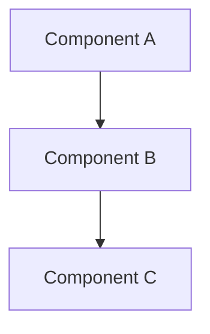
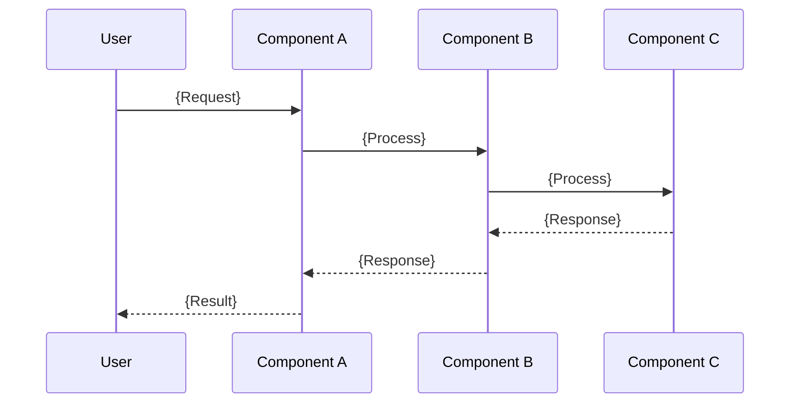
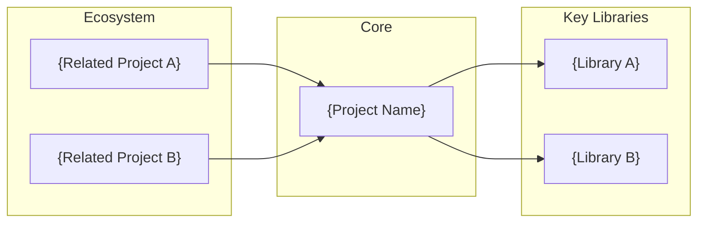

# {Project Name}

> {One-line description of the project}

| Metadata | |
|---|---|
| Repository | {Repository URL} |
| License | {License} |
| Primary Language | {Language} |
| Category | {Category} |
| Analyzed Release | `{Version}` ({Release Date}) |
| Stars (approx.) | {Star Count} |
| Generated by | {Model Name} |
| Generated on | {YYYY-MM-DD} |

## Overview

{Describe the project overview in 2-3 sentences}

Problems it solves:

- {Problem 1}
- {Problem 2}
- {Problem 3}

Positioning:

{Comparison with competitors/similar projects and positioning within the ecosystem}

## Architecture Overview

{Describe the high-level architecture in 2-3 sentences}

## Core Components

### {Component Name 1} (`{path}`)

- Responsibility: {Responsibility of this component}
- Key files: `{file path}`
- Design patterns: {Design patterns applied}

{Detailed description of the component}

### {Component Name 2} (`{path}`)

- Responsibility: {Responsibility of this component}
- Key files: `{file path}`
- Design patterns: {Design patterns applied}

{Detailed description of the component}

### {Component Name 3} (`{path}`)

- Responsibility: {Responsibility of this component}
- Key files: `{file path}`
- Design patterns: {Design patterns applied}

{Detailed description of the component}

## Data Flow

### {Representative Use Case Name}

## Key Design Decisions

### 1. {Decision Title}

- Choice: {What was chosen}
- Rationale: {Why this choice was made}
- Trade-offs: {Trade-offs resulting from this choice}

### 2. {Decision Title}

- Choice: {What was chosen}
- Rationale: {Why this choice was made}
- Trade-offs: {Trade-offs resulting from this choice}

### 3. {Decision Title}

- Choice: {What was chosen}
- Rationale: {Why this choice was made}
- Trade-offs: {Trade-offs resulting from this choice}

## Dependencies

## Testing Strategy

{Briefly describe the overall testing approach}

Unit tests: {Unit testing methodology and approach}

Integration tests: {Integration testing methodology and approach}

CI/CD: {CI/CD pipeline configuration}

## Key Takeaways

1. {Takeaway 1 title}: {Description of design insight applicable to other projects}

2. {Takeaway 2 title}: {Description of design insight applicable to other projects}

3. {Takeaway 3 title}: {Description of design insight applicable to other projects}

## References

- [{Project Name} Official Documentation]({URL})
- [{Reference 1}]({URL})
- [{Reference 2}]({URL})
