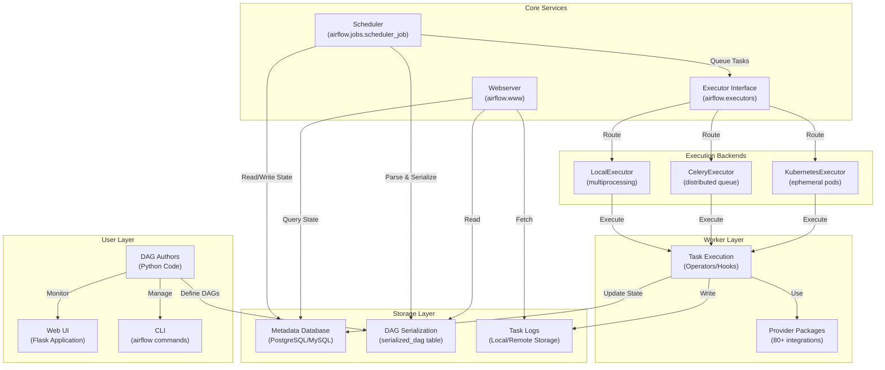
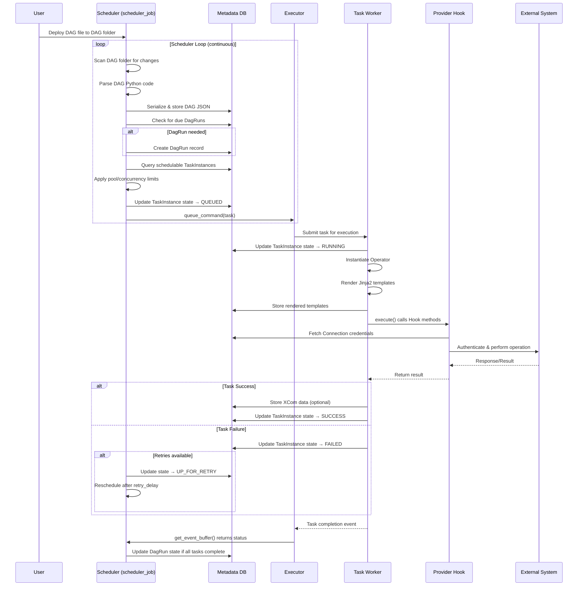
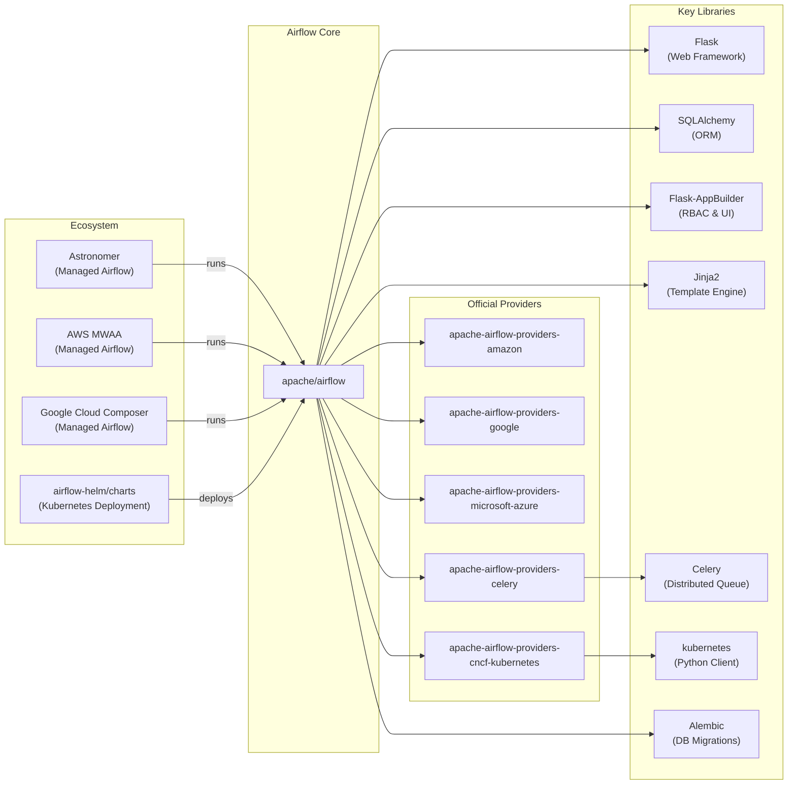

# Apache Airflow

> A platform to programmatically author, schedule, and monitor workflows

| Metadata | |
|---|---|
| Repository | https://github.com/apache/airflow |
| License | Apache License 2.0 |
| Primary Language | Python |
| Analyzed Release | `3.1.7` (2026-02-04) |
| Stars (approx.) | 44,000+ |
| Generated by | Claude Opus 4.6 (Anthropic) |
| Generated on | 2026-02-08 |

## Overview

Apache Airflow is an open-source platform for orchestrating complex computational workflows and data processing pipelines. It allows developers to programmatically author, schedule, and monitor workflows as Directed Acyclic Graphs (DAGs) using Python code. Originally created at Airbnb in 2014 and later donated to the Apache Software Foundation, Airflow has become the de facto standard for workflow orchestration in the data engineering ecosystem.

Problems it solves:

- Managing dependencies between batch jobs and ensuring tasks execute in the correct order based on complex dependency graphs
- Monitoring and retrying failed tasks automatically with configurable retry logic and alerting mechanisms
- Scaling workflow execution from single-machine deployments to distributed clusters handling thousands of concurrent tasks
- Providing visibility into workflow execution history, task duration, and failure patterns through a comprehensive web UI

Positioning:

Airflow competes with tools like Prefect, Dagster, Luigi, and Argo Workflows. Its key differentiator is the mature ecosystem of 80+ provider packages integrating with cloud platforms (AWS, GCP, Azure), databases, and data processing frameworks. Airflow is widely adopted in enterprises for ETL/ELT pipelines, ML workflow orchestration, and infrastructure automation. Its Python-based DAG definition allows dynamic pipeline generation and code reuse, unlike declarative YAML-based alternatives.

## Architecture Overview

Airflow employs a modular, distributed architecture built around a central metadata database. The Scheduler orchestrates task execution by reading DAG definitions, determining task readiness based on dependencies, and submitting tasks to Executors. The Executor abstraction allows pluggable backends ranging from single-machine execution to distributed Celery or Kubernetes clusters. DAG serialization decouples the Webserver from DAG parsing, enabling faster UI response times and independent component scaling.

## Core Components

### Scheduler (`airflow/jobs/scheduler_job.py`)

- Responsibility: Core orchestration engine that parses DAGs, determines task readiness, and submits tasks for execution
- Key files: `airflow/jobs/scheduler_job.py`, `airflow/jobs/scheduler_job_runner.py`
- Design patterns: Event loop pattern, state machine pattern for task lifecycle management

The Scheduler runs a continuous loop with two primary phases: DAG processing and task scheduling. In the DAG parsing phase, it scans the DAG directory, parses Python files to construct DAG objects, and serializes them into JSON format stored in the serialized_dag table. This serialization enables the Webserver to render DAGs without re-parsing Python code, significantly reducing memory footprint and startup time.

The task scheduling phase examines DagRuns (workflow instances) and creates TaskInstances with dependencies resolved. The Scheduler respects pool limits (logical resource grouping), concurrency constraints (max parallel tasks per DAG), and parallelism settings (global task limit). It transitions TaskInstances through a state machine: None → Scheduled → Queued → Running → Success/Failed/Upstream_Failed/Skipped. Critical sections use row-level write locks on the Pool table to prevent resource oversubscription. The heartbeat mechanism periodically calls the executor to update task states and trigger new executions.

### Executor (`airflow/executors/`)

- Responsibility: Abstraction layer for task execution backends, providing pluggable interface for different scaling strategies
- Key files: `airflow/executors/base_executor.py`, `airflow/executors/local_executor.py`, `airflow/executors/celery_executor.py`
- Design patterns: Strategy pattern, queue-based workload distribution

All executors implement the BaseExecutor interface, making them pluggable. The Scheduler interacts with executors through standardized methods: queue_command() to submit tasks, heartbeat() to synchronize state, and get_event_buffer() to retrieve task completion events. This abstraction allows switching execution backends without modifying core scheduling logic.

LocalExecutor uses Python's multiprocessing module to run tasks in separate processes on a single machine. It maintains a task queue and worker pool with configurable parallelism. CeleryExecutor distributes tasks across multiple worker nodes using Celery, a distributed task queue backed by Redis or RabbitMQ as the message broker. Each task is serialized as a Celery job and routed to available workers. KubernetesExecutor creates ephemeral Kubernetes pods for each task, providing strong isolation and per-task resource allocation. The CeleryKubernetesExecutor hybrid allows queue-based routing: tasks in the Celery queue run on persistent workers, while tasks in the Kubernetes queue get dedicated pods.

### DAG and Task Models (`airflow/models/`)

- Responsibility: Core domain models representing workflows, task definitions, and execution state
- Key files: `airflow/models/dag.py`, `airflow/models/dagrun.py`, `airflow/models/taskinstance.py`, `airflow/models/baseoperator.py`
- Design patterns: Active Record pattern, builder pattern for DAG construction

The DAG class represents a workflow definition with properties like schedule_interval, start_date, catchup behavior, and default_args. DAGs use context managers and decorators for task definition: the bitshift operators (>> and <<) define dependencies, creating an intuitive syntax for expressing task order. The DagRun model represents a specific execution of a DAG, identified by execution_date (logical timestamp) and run_id. Each DagRun contains multiple TaskInstances.

TaskInstance is the central state-tracking entity, representing a single task execution attempt. It maintains state, try_number for retry counting, duration, start_date, end_date, and relationships to the Operator definition. TaskInstance implements the state machine logic with states like scheduled, queued, running, success, failed, upstream_failed, skipped, and up_for_retry. The _execute() method coordinates pre-execution hooks, task execution, XCom (cross-communication) data storage, and post-execution cleanup.

Operators inherit from BaseOperator and implement the execute() method containing task logic. Hooks provide reusable connection management and API abstraction for external systems (databases, cloud APIs, etc.). The separation of Operators (what to do) and Hooks (how to connect) promotes code reuse across provider packages.

### Webserver (`airflow/www/`)

- Responsibility: Web-based UI for monitoring DAGs, triggering runs, and inspecting task execution details
- Key files: `airflow/www/app.py`, `airflow/www/views.py`, `airflow/www/fab_security/`
- Design patterns: MVC pattern using Flask, Flask-AppBuilder for admin interface

The Webserver is a Flask application using Flask-AppBuilder (FAB) for role-based access control (RBAC) and UI scaffolding. It reads serialized DAGs from the metadata database rather than parsing Python files, eliminating the need to synchronize DAG folders across Scheduler and Webserver instances. This architecture supports horizontal scaling of the Webserver for high-traffic deployments.

The UI provides the Graph View (visualizing DAG structure and task dependencies), Tree View (historical runs across time), Gantt Chart (task duration timelines), and Task Instance Details (logs, XCom data, rendered templates). The Code View displays the source Python file, and the Rendered Template View shows Jinja2 template expansion with actual runtime values.

Authentication and authorization are managed by pluggable auth backends, with FAB providing LDAP, OAuth, and database-backed user management. API authentication defaults to session-based for the UI and supports HTTP Basic Auth and JWT tokens for programmatic access. The REST API (introduced in Airflow 2.0 as a stable interface) provides full CRUD operations on DAGs, DagRuns, TaskInstances, Connections, Variables, and Pools.

### Provider System (`airflow/providers/`)

- Responsibility: Extensible plugin architecture for integrating with external systems and extending Airflow capabilities
- Key files: Provider packages are distributed separately (e.g., `apache-airflow-providers-google`, `apache-airflow-providers-amazon`)
- Design patterns: Plugin pattern, entry point discovery mechanism

Airflow 2.0 introduced the provider architecture to decouple integration code from core Airflow. Providers are Python packages installable via pip with their own release cycles, allowing users to upgrade AWS provider functionality without upgrading Airflow core. Each provider defines an entry point (apache_airflow_provider) pointing to a discovery callable that returns a JSON schema describing capabilities: operators, hooks, sensors, transfer operators, connection types, extra links, and secrets backends.

Providers can extend Airflow's CLI with custom commands, add custom connection form fields in the UI (e.g., AWS region selector for S3 connections), register secret backends (HashiCorp Vault, AWS Secrets Manager) for secure credential storage, and provide remote logging handlers (S3, GCS, Azure Blob) for centralized log aggregation. The community maintains 80+ official providers covering AWS, GCP, Azure, Kubernetes, databases (PostgreSQL, MySQL, Snowflake), messaging systems (Kafka, RabbitMQ), and monitoring platforms (Datadog, PagerDuty).

### Serialization Layer (`airflow/serialization/`)

- Responsibility: Converting DAG objects to JSON for storage and reconstructing them for UI rendering
- Key files: `airflow/serialization/serialized_objects.py`, `airflow/models/serialized_dag.py`
- Design patterns: Serializer pattern, caching pattern

DAG Serialization addresses a critical performance bottleneck: historically, the Webserver had to parse all DAG Python files on startup and periodically refresh them, consuming significant memory and CPU. The Scheduler now parses DAGs, serializes them to JSON, and stores them in the serialized_dag table with a hash to detect changes. The Webserver loads DAGs on-demand from the database, drastically reducing startup time and memory usage.

The serialization process traverses the DAG object graph, converting Tasks, dependencies, default_args, and Jinja2 templates to a JSON-compatible dictionary. Non-serializable objects (functions, classes) are handled via special encoders. The min_serialized_dag_update_interval configuration controls update frequency to reduce database write amplification. The compress_serialized_dags option enables gzip compression for large DAGs, trading CPU for storage and network efficiency.

The RenderedTaskInstanceFields table stores a snapshot of template-rendered task parameters before execution, enabling post-execution inspection of what values were actually used. This is critical for debugging parameterized DAGs where inputs vary per execution.

## Data Flow

### DAG Execution Flow

## Key Design Decisions

### 1. DAG-as-Code with Python

- Choice: Defining workflows as Python code rather than declarative YAML or visual drag-and-drop
- Rationale: Python enables dynamic DAG generation (e.g., creating tasks in loops based on database queries), code reuse through functions and classes, and integration with the broader Python ecosystem (Pandas, NumPy, etc.). This approach treats workflows as software, allowing version control, unit testing, and CI/CD integration
- Trade-offs: Requires Python knowledge from users (barrier for non-programmers). DAG parsing executes arbitrary Python code, creating security risks in multi-tenant environments (mitigated by DAG serialization isolating parsing to Scheduler). Complex DAG logic can become hard to debug without proper testing discipline

### 2. Metadata Database as Single Source of Truth

- Choice: Using a relational database (PostgreSQL, MySQL) to store all workflow state, execution history, and configuration
- Rationale: Centralized state management simplifies distributed coordination. Multiple Schedulers can run in active-passive HA mode by using database locks. Historical data powers analytics on task duration, failure rates, and SLA violations. The relational model enforces referential integrity between DAGs, DagRuns, TaskInstances, and Logs
- Trade-offs: Database becomes a single point of failure and potential bottleneck at scale. Large deployments require careful database tuning (connection pooling, indexing, vacuuming). Migration complexity when upgrading Airflow versions due to schema changes

### 3. Pluggable Executor Architecture

- Choice: Abstracting task execution behind a BaseExecutor interface with implementations for LocalExecutor, CeleryExecutor, KubernetesExecutor, and hybrid CeleryKubernetesExecutor
- Rationale: Different deployment scenarios require different execution strategies. Development and small workloads use LocalExecutor for simplicity. Production deployments choose CeleryExecutor for persistent worker pools with fast task startup or KubernetesExecutor for task isolation and dynamic resource allocation. The CeleryKubernetesExecutor hybrid allows routing: lightweight tasks to Celery workers (low latency), resource-intensive tasks to dedicated Kubernetes pods (isolation)
- Trade-offs: Each executor has operational complexity: CeleryExecutor requires Redis/RabbitMQ infrastructure and worker scaling logic; KubernetesExecutor needs Kubernetes cluster and incurs pod startup latency (5-30 seconds). Configuration complexity when choosing and tuning executors for specific workload characteristics

### 4. DAG Serialization for Webserver Decoupling

- Choice: Scheduler serializes DAGs to JSON in the database; Webserver reads pre-parsed DAGs rather than executing Python files
- Rationale: Eliminates the need to synchronize DAG folders across Scheduler and Webserver instances. Reduces Webserver memory footprint (no DagBag loading all DAGs into memory) and startup time (no Python parsing). Improves security by preventing the Webserver from executing arbitrary user code. Enables independent horizontal scaling of Webserver for UI traffic
- Trade-offs: Slight delay between DAG file changes and UI updates (controlled by min_serialized_dag_update_interval). Serialization adds CPU overhead to Scheduler. Large DAGs may hit JSON size limits (mitigated by compress_serialized_dags option). Debugging is harder when UI shows serialized representation rather than live code

### 5. Provider Package Ecosystem

- Choice: Extracting integrations (AWS, GCP, Azure, databases) into separate provider packages with independent release cycles
- Rationale: Core Airflow can evolve without breaking integrations. Users install only needed providers, reducing dependency bloat. Providers can have their own versioning, allowing bug fixes without waiting for Airflow core releases. Community can contribute providers without modifying core codebase. Enables backward compatibility: older Airflow versions can use newer provider packages if API contracts are maintained
- Trade-offs: Dependency management complexity: users must track compatible provider versions. Breaking changes in provider APIs require migration effort. Discovery mechanism (entry points) adds indirection making debugging harder. Provider quality varies: official Apache providers are well-maintained, but third-party providers may lag

## Dependencies

## Testing Strategy

Airflow employs a multi-layered testing strategy covering unit, integration, and system tests.

Unit tests: Airflow distinguishes between DB and non-DB unit tests. Non-DB tests run once per Python version with a none database backend, causing any database access to fail immediately. This ensures proper mocking of database dependencies. DB tests run against PostgreSQL, MySQL, and SQLite to verify cross-database compatibility. Tests use pytest fixtures for setting up test DAGs and TaskInstances. The testdata/ directories contain sample DAGs and mock data.

Integration tests: Integration test DAGs validate interactions with external systems using test resources or dev accounts. These DAGs exercise common services (S3, Snowflake, Vault) and serve as smoke tests after upgrades. Providers include integration tests using Docker Compose to spin up local instances of databases, message queues, and other dependencies. The Breeze development environment provides a containerized setup for running the full test suite.

System tests: System test DAGs run in real cloud environments to validate end-to-end functionality. These tests create actual cloud resources (GCS buckets, BigQuery tables, EC2 instances), execute workflows, and clean up resources. They verify that providers work correctly with current cloud API versions.

CI/CD: GitHub Actions workflows run tests on every pull request against multiple Python versions (3.8, 3.9, 3.10, 3.11, 3.12) and database backends (PostgreSQL, MySQL, SQLite). Static analysis includes Pylint, Mypy type checking, and flake8 linting. Pre-commit hooks enforce code formatting (Black) and import sorting (isort). Release process includes building Docker images, publishing PyPI packages, generating documentation, and updating Helm charts.

## Key Takeaways

1. Metadata-driven orchestration: Storing all workflow state in a relational database enables powerful capabilities like historical analysis, SLA monitoring, and audit logging. The metadata approach allows rebuilding the scheduler's in-memory state from the database, supporting high-availability deployments. This pattern is applicable to any system requiring durable state management and distributed coordination

2. Abstraction for scalability: The Executor abstraction allows Airflow to scale from single-machine development (LocalExecutor) to massive distributed deployments (CeleryExecutor, KubernetesExecutor) without changing DAG code. This demonstrates the power of interface-based design for future-proofing systems against evolving deployment requirements

3. Decoupling through serialization: Separating DAG parsing (Scheduler) from DAG rendering (Webserver) via serialization eliminates tight coupling and enables independent scaling. This pattern of pre-computing expensive operations and caching results is broadly applicable to web applications with complex data models

4. Extensibility via providers: The provider architecture demonstrates how to build an extensible system without bloating the core. Entry point discovery, semantic versioning, and backward compatibility contracts allow a vibrant ecosystem while maintaining stability. This approach is relevant for any platform expecting third-party extensions

5. Dynamic pipeline generation: Python-as-configuration unlocks dynamic workflows impossible with static YAML: generating tasks from database queries, parameterizing DAGs with config files, and applying business logic to pipeline construction. This flexibility comes with complexity costs but enables powerful use cases like multi-tenant pipelines and workflow templating

6. State machine clarity: The explicit TaskInstance state machine (None → Scheduled → Queued → Running → Success/Failed/Up_for_retry) makes workflow lifecycle transparent and debuggable. Clear state transitions with database persistence enable precise failure recovery and retry logic. This pattern is essential for reliable distributed systems

## References

- [Apache Airflow Official Documentation](https://airflow.apache.org/docs/apache-airflow/stable/)
- [Architecture Overview — Airflow 3.1.7 Documentation](https://airflow.apache.org/docs/apache-airflow/stable/core-concepts/overview.html)
- [Scheduler — Airflow 3.1.7 Documentation](https://airflow.apache.org/docs/apache-airflow/stable/administration-and-deployment/scheduler.html)
- [Executor — Airflow 3.1.7 Documentation](https://airflow.apache.org/docs/apache-airflow/stable/core-concepts/executor/index.html)
- [DAG Serialization — Airflow 3.1.6 Documentation](https://airflow.apache.org/docs/apache-airflow/stable/administration-and-deployment/dag-serialization.html)
- [Providers — apache-airflow-providers Documentation](https://airflow.apache.org/docs/apache-airflow-providers/)
- [Understanding the Airflow metadata database | Astronomer Docs](https://www.astronomer.io/docs/learn/airflow-database)
- [Apache Airflow® Executors | Astronomer Docs](https://www.astronomer.io/docs/learn/airflow-executors-explained)
- [Apache Airflow — Scheduler Internals | by Rakesh K | Medium](https://rakesh-upadhyaya.medium.com/apache-airflow-scheduler-internals-2bbccc220120)
- [Test Airflow DAGs | Astronomer Docs](https://www.astronomer.io/docs/learn/testing-airflow)
