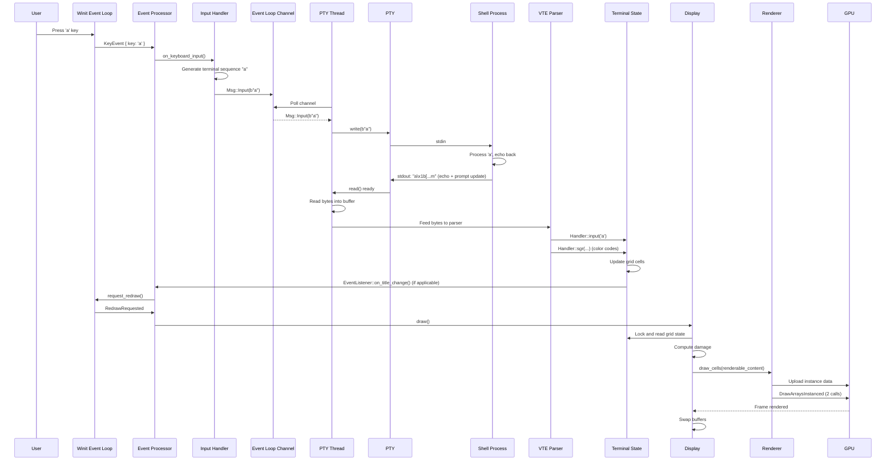
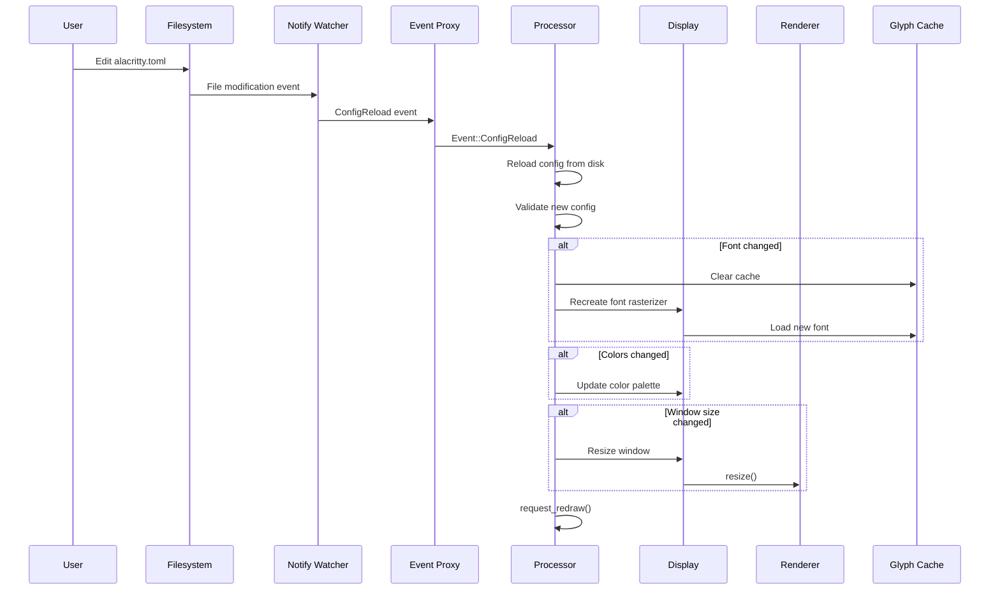
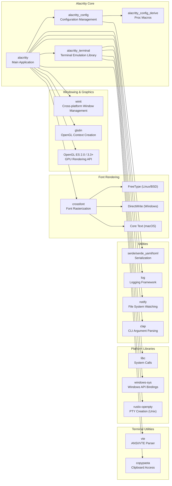

# Alacritty

> A fast, cross-platform, OpenGL terminal emulator

| Metadata | |
|---|---|
| Repository | https://github.com/alacritty/alacritty |
| License | Apache-2.0 |
| Primary Language | Rust |
| Analyzed Release | `v0.16.1` (2025-10-20) |
| Stars (approx.) | 62,000+ |
| Generated by | Claude Sonnet 4.5 (Anthropic) |
| Generated on | 2026-02-08 |

## Overview

Alacritty is a GPU-accelerated terminal emulator that prioritizes performance and simplicity. Unlike traditional terminal emulators, Alacritty offloads rendering to the GPU via OpenGL, achieving approximately 500 FPS with full-screen text. Its Rust implementation ensures memory safety and zero-cost abstractions, enabling modularity without sacrificing speed.

Problems it solves:

- Slow rendering performance in traditional CPU-bound terminal emulators when processing large volumes of rapidly changing text
- Input latency when interacting with terminal applications (vim, tmux, etc.)
- Lack of cross-platform consistency in terminal emulation behavior across Linux, macOS, Windows, and BSD

Positioning:

Alacritty is positioned as a "do one thing well" terminal emulator, intentionally excluding features like tabs, splits, and GUI configuration editors. Instead, it integrates with external tools (tmux, i3, etc.) and uses text-based TOML configuration. This philosophy allows it to maintain a lean codebase focused purely on terminal emulation and rendering performance.

## Architecture Overview

Alacritty employs a pipeline architecture separating terminal state management, event processing, and GPU rendering. The system consists of four major subsystems: the terminal library (alacritty_terminal) handling VTE parsing and grid state, the event processor orchestrating user input and window events, the OpenGL renderer managing GPU-based text rasterization, and the PTY system providing bidirectional communication with shell processes.

```mermaid
graph TB
    subgraph User["User Layer"]
        CLI["CLI Entry Point<br/>alacritty/src/main.rs"]
        Config["Configuration<br/>alacritty/src/config/"]
    end

    subgraph EventSystem["Event System<br/>alacritty/src/event.rs"]
        Processor["Processor<br/>ApplicationHandler"]
        EventLoop["Winit Event Loop"]
        Scheduler["Scheduler<br/>Timer Management"]
    end

    subgraph Display["Display Subsystem<br/>alacritty/src/display/"]
        WindowCtx["WindowContext"]
        Display["Display<br/>Window + Renderer + Terminal"]
        Window["Window<br/>Winit Window Management"]
    end

    subgraph Renderer["Renderer<br/>alacritty/src/renderer/"]
        RendererCore["Renderer Core"]
        TextRenderer["Text Renderer<br/>GLES2/GLSL3"]
        GlyphCache["Glyph Cache"]
        Atlas["Texture Atlas"]
        RectRenderer["Rect Renderer"]
    end

    subgraph Terminal["Terminal Library<br/>alacritty_terminal/"]
        Term["Term<br/>Terminal State"]
        Grid["Grid<br/>Cell Storage"]
        VTE["VTE Parser<br/>ANSI Escape Sequences"]
        EventLoopTerm["Event Loop<br/>PTY I/O"]
        PTY["PTY Interface<br/>Unix/Windows"]
    end

    subgraph External["External Systems"]
        Shell["Shell Process<br/>bash/zsh/fish"]
        GPU["GPU<br/>OpenGL ES 2.0+"]
        Crossfont["Crossfont<br/>Font Rasterization"]
    end

    CLI --> Config
    CLI --> EventLoop
    EventLoop --> Processor
    Processor --> WindowCtx
    WindowCtx --> Display
    Display --> Window
    Display --> Term
    Display --> RendererCore

    RendererCore --> TextRenderer
    RendererCore --> RectRenderer
    TextRenderer --> GlyphCache
    GlyphCache --> Atlas
    GlyphCache --> Crossfont
    TextRenderer --> GPU
    RectRenderer --> GPU

    Term --> Grid
    Term --> VTE
    EventLoopTerm --> PTY
    EventLoopTerm --> Term
    PTY --> Shell

    Processor --> Scheduler
    Config --> WindowCtx
```

## Core Components

### Terminal Core (`alacritty_terminal/`)

- Responsibility: Terminal state management, VTE parsing, grid storage, and PTY I/O orchestration
- Key files: `alacritty_terminal/src/term/mod.rs`, `alacritty_terminal/src/grid/mod.rs`, `alacritty_terminal/src/event_loop.rs`
- Design patterns: State pattern, Observer pattern (EventListener)

The `alacritty_terminal` crate is a standalone library providing terminal emulation capabilities. The `Term<T>` struct maintains the terminal grid, cursor position, scrollback buffer, selection state, and mode flags (e.g., ALT_SCREEN, BRACKETED_PASTE). The `Grid<T>` implements a specialized 2D storage with efficient scrollback, supporting up to configurable maximum history lines. The grid uses a circular buffer strategy with display offset tracking to handle viewport scrolling without copying data.

The `event_loop` module runs in a dedicated thread, continuously polling the PTY file descriptor for incoming data. Raw bytes from the shell are fed to the VTE parser, which invokes handler methods on `Term` to update the grid state. The VTE parser is implemented as a state machine, handling ANSI escape sequences, control characters, and UTF-8 multibyte sequences. Outbound data (user input) is queued via channels and written to the PTY during the event loop cycle.

### Event Processor (`alacritty/src/event.rs`)

- Responsibility: Central event orchestration, bridging winit window events and terminal operations
- Key files: `alacritty/src/event.rs`, `alacritty/src/window_context.rs`
- Design patterns: Command pattern, Event-driven architecture

The `Processor` struct implements winit's `ApplicationHandler` trait, receiving window events (keyboard input, mouse events, resize, focus changes) and dispatching them to appropriate handlers. It maintains a `HashMap<WindowId, WindowContext>` to support multiple terminal windows within a single Alacritty instance.

For keyboard input, the processor translates winit's `KeyEvent` into terminal input sequences, considering modifiers, application cursor mode, and Kitty keyboard protocol. The `input` module handles complex mappings, including vi mode navigation, search activation, and hint triggering. Mouse events are transformed into terminal coordinates and either processed locally (selection, URL opening) or forwarded to the shell as mouse reporting sequences.

The processor integrates with the `Scheduler` for deferred actions (e.g., search debouncing, visual bell timeout, frame throttling). When terminal state changes, the processor marks damage regions and schedules redraws using winit's `request_redraw` mechanism.

### Renderer (`alacritty/src/renderer/`)

- Responsibility: GPU-accelerated rendering of terminal content using OpenGL
- Key files: `alacritty/src/renderer/mod.rs`, `alacritty/src/renderer/text/mod.rs`, `alacritty/src/renderer/text/atlas.rs`
- Design patterns: Strategy pattern (GLES2 vs GLSL3), Batch rendering, Texture atlas

The renderer automatically selects between GLES2 and GLSL3 backends based on the GPU's OpenGL version. GLSL3 uses instanced rendering with dual-source blending for subpixel antialiasing in a single draw call, while GLES2 falls back to three-pass rendering for devices without dual-source blending support.

Glyphs are rasterized on-demand by the `crossfont` library (supporting FreeType on Linux/BSD, DirectWrite on Windows, Core Text on macOS) and cached in a texture atlas. The atlas uses a row-packing strategy, filling 1024x1024 textures with glyphs arranged left-to-right, top-to-bottom. When an atlas fills, a new texture is allocated. The `GlyphCache` maintains a mapping from `GlyphKey` (font, size, character) to atlas coordinates and texture ID.

During rendering, visible cells are iterated to generate instance data (position, texture coordinates, foreground/background colors, flags). This data is uploaded to a GPU buffer once per frame, and the text is drawn in two draw calls: one for backgrounds and one for glyphs. The `RectRenderer` handles non-text elements like cursor, selections, and damage debug overlays using instanced quad rendering.

### Display Layer (`alacritty/src/display/`)

- Responsibility: Coordinates window management, terminal state, and renderer lifecycle
- Key files: `alacritty/src/display/mod.rs`, `alacritty/src/display/content.rs`, `alacritty/src/display/damage.rs`
- Design patterns: Facade pattern, Damage tracking

The `Display` struct aggregates the winit `Window`, glutin OpenGL context, `Renderer`, `GlyphCache`, and terminal `Term` reference. It provides a `draw()` method that:

1. Locks the terminal state
2. Computes damage regions (changed cells) since the last frame
3. Generates `RenderableContent` from visible grid cells
4. Renders backgrounds, text, cursor, selections, and UI overlays
5. Swaps the OpenGL surface to present the frame

Damage tracking is performed per-line, with the terminal marking line ranges that have changed. On platforms supporting partial redraw (some compositors), Alacritty can skip rendering undamaged regions, reducing GPU load. The `DamageTracker` converts terminal line coordinates to viewport pixel rectangles.

The `SizeInfo` struct maintains window dimensions, cell size (derived from font metrics), and padding, providing conversion utilities between pixel and grid coordinates.

### PTY System (`alacritty_terminal/src/tty/`)

- Responsibility: Platform-specific pseudoterminal creation and I/O
- Key files: `alacritty_terminal/src/tty/unix.rs`, `alacritty_terminal/src/tty/windows/conpty.rs`
- Design patterns: Adapter pattern, Platform abstraction

On Unix (Linux, macOS, BSD), Alacritty uses the traditional PTY model with `openpty()` creating a master/slave pair. The child process executes the shell in the slave PTY, while the master is registered with a poller for non-blocking I/O. Signal handling (SIGCHLD) notifies the event loop of child termination.

On Windows, Alacritty uses ConPTY (Console Pseudo-terminal), a Windows 10 1809+ feature providing Unix-like PTY semantics. The ConPTY handle is wrapped with named pipes for I/O, and a separate thread monitors the child process handle for exit events.

Both implementations expose the `EventedPty` trait, abstracting platform differences. The PTY resize operation (TIOCSWINSZ ioctl on Unix, ResizePseudoConsole on Windows) is triggered by the event loop when the window size changes.

## Data Flow

### Typical Input-to-Output Flow



### Configuration Hot-Reload Flow



## Key Design Decisions

### 1. GPU-Accelerated Rendering via OpenGL

- Choice: Offload all text rendering to the GPU using OpenGL with texture atlas and instanced rendering
- Rationale: Traditional terminal emulators are CPU-bound, rasterizing glyphs per-frame and blitting to the window. By caching rasterized glyphs in GPU textures and using instanced rendering, Alacritty reduces CPU work to instance data generation, achieving 500+ FPS. Subpixel antialiasing is performed in shaders, leveraging GPU parallelism
- Trade-offs: Requires OpenGL ES 2.0+ support, limiting compatibility with very old hardware or software renderers. The texture atlas approach requires managing atlas allocation and eviction. Emoji and complex Unicode glyphs increase atlas memory usage. The renderer complexity increases with two codepaths (GLES2 multi-pass and GLSL3 dual-source blending)

### 2. Separate Terminal Library (alacritty_terminal)

- Choice: Extract terminal emulation logic into a standalone crate independent of rendering and windowing
- Rationale: Enables reuse of terminal emulation in other projects (e.g., GUI applications, testing frameworks). Clear separation of concerns between terminal state (grid, cursor, modes) and rendering (fonts, OpenGL). The library can be tested independently with input/output sequences without requiring a window or GPU
- Trade-offs: Adds abstraction overhead with the `EventListener` trait for terminal-to-UI communication. Some features require coordination between library and UI (e.g., visual bell, clipboard). The API surface between library and UI must be carefully designed to avoid tight coupling

### 3. Single-Threaded Rendering with PTY on Separate Thread

- Choice: Run the PTY event loop on a dedicated thread, while rendering and input handling occur on the main thread
- Rationale: PTY I/O is blocking and needs continuous polling to avoid input lag. Running it on a separate thread prevents blocking the UI thread, ensuring responsive rendering and input processing. The terminal state (`Term`) is protected by a `FairMutex`, allowing the PTY thread to acquire the lock for updates while the main thread holds it briefly for rendering. The `FairMutex` prevents the PTY thread from starving the UI thread
- Trade-offs: Requires careful synchronization around terminal state access. The PTY thread must limit read sizes when the terminal is locked to avoid long pauses. The channel for input messages (user typing) introduces latency if not drained frequently. Race conditions are possible if terminal mode changes aren't atomic

### 4. VI Mode and Search as First-Class Features

- Choice: Implement VI-style navigation and regex search directly in Alacritty rather than relying on external tools
- Rationale: VI mode enables keyboard-only workflows for scrollback navigation, text selection, and URL opening without requiring tmux copy-mode. Search is frequently used to locate commands or output in long sessions. Implementing these in Alacritty provides a unified UX across platforms and reduces the need for external dependencies
- Trade-offs: Increases code complexity in the input handler and display layer (cursor rendering in VI mode, search highlight rendering). The VI mode state machine must coordinate with normal terminal mode. Search regex compilation can cause frame drops if not debounced

### 5. TOML Configuration without GUI

- Choice: Use text-based TOML configuration files without a built-in GUI settings editor
- Rationale: Aligns with the "do one thing well" philosophy. Text configuration is version-controllable, scriptable, and can be managed with existing editors. TOML provides a human-readable format with strong typing. Avoiding a GUI reduces binary size and development complexity
- Trade-offs: Less discoverable for new users compared to GUI settings. Configuration errors can prevent startup (though Alacritty logs errors). Users must edit files manually or use third-party GUI tools

### 6. Hints System for URL and Text Pattern Matching

- Choice: Implement a regex-based hint system for matching URLs, file paths, and custom patterns with configurable actions
- Rationale: Enables keyboard-driven interaction with terminal output (e.g., opening URLs, executing commands on matched text). Regex-based matching provides flexibility for users to define custom patterns. Hints integrate with VI mode and mouse interaction, providing multiple UX paths
- Trade-offs: Regex matching can be CPU-intensive if many patterns are configured. Hint rendering (underline) adds visual complexity. Users must understand regex syntax to configure custom hints

## Dependencies



## Testing Strategy

Alacritty employs a multi-layered testing approach combining unit tests, integration tests, and manual testing.

Unit tests: Each module includes unit tests verifying individual components. The `alacritty_terminal` crate has extensive tests for grid operations, VTE parsing, and selection logic. Tests use golden files (e.g., `testdata/` directories) to verify terminal output against expected states after feeding specific escape sequences.

Integration tests: The `tests/` directory contains end-to-end tests launching actual Alacritty instances and verifying behavior via PTY interaction and pixel-based rendering checks. Ref tests (reference tests) capture rendered frames as images and compare against baseline images to detect rendering regressions.

Manual testing: The development team maintains a test suite of terminal applications (vim, tmux, htop, etc.) and visual inspection checklists. Performance benchmarking uses vtebench (a separate tool) to measure throughput and latency.

CI/CD: GitHub Actions runs unit tests, linting (clippy), formatting (rustfmt), and builds for Linux, macOS, and Windows. Release builds are published with changelogs and binaries for all platforms.

## Key Takeaways

1. GPU acceleration for unexpected domains: Alacritty demonstrates that GPU acceleration can provide order-of-magnitude performance improvements in traditionally CPU-bound domains like terminal emulation. The key insight is identifying the bottleneck (glyph rasterization and blitting) and moving it to the GPU with caching strategies (texture atlas). This approach applies to any text-heavy application (editors, logs, dashboards).

2. Rust's zero-cost abstractions for modular design: Alacritty's architecture separates concerns (terminal state, rendering, windowing, PTY) into distinct modules without sacrificing performance. Rust's trait system enables polymorphism (EventListener, EventedPty, TextRenderer) while maintaining static dispatch. This proves Rust's suitability for performance-critical applications requiring maintainable architecture.

3. Platform abstraction with minimal overhead: The PTY abstraction cleanly separates Unix (openpty) and Windows (ConPTY) implementations behind a common trait. This pattern allows platform-specific optimizations while maintaining a unified codebase. The design avoids runtime overhead by using conditional compilation (`#[cfg(unix)]`, `#[cfg(windows)]`).

4. Event-driven architecture for responsiveness: The separation of PTY I/O (blocking thread) and rendering (event loop) ensures UI responsiveness. The FairMutex prevents starvation, allowing the PTY thread to make progress while the UI thread remains responsive. This pattern is applicable to any application with blocking I/O and interactive UI requirements.

5. Texture atlas for efficient GPU memory usage: The glyph atlas strategy minimizes texture switches during rendering, enabling batch rendering of all text in two draw calls. The row-packing allocation strategy balances simplicity and space efficiency. This technique applies to any application rendering many small textures (game sprites, emoji, icons).

6. Configuration hot-reload without restart: The file watcher integration allows users to edit configuration and see changes immediately without restarting. This greatly improves the configuration experience and encourages experimentation. The pattern of validation + atomic swap is applicable to any long-running application with user configuration.

## References

- [Alacritty Official Documentation](https://alacritty.org/)
- [Announcing Alacritty, a GPU-accelerated terminal emulator](https://jwilm.io/blog/announcing-alacritty/)
- [GitHub - alacritty/alacritty](https://github.com/alacritty/alacritty)
- [alacritty/alacritty | DeepWiki](https://deepwiki.com/alacritty/alacritty)
- [Alacritty - Wikipedia](https://en.wikipedia.org/wiki/Alacritty)
