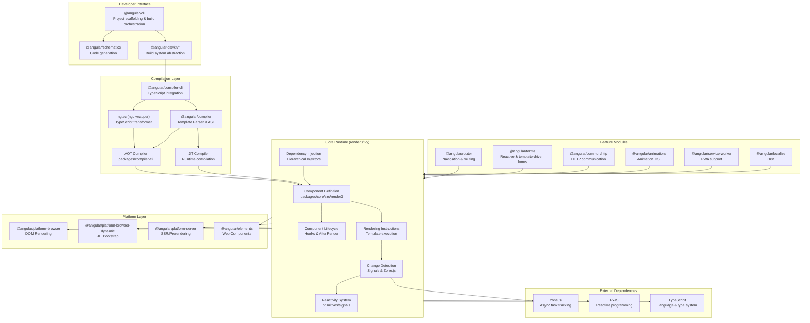
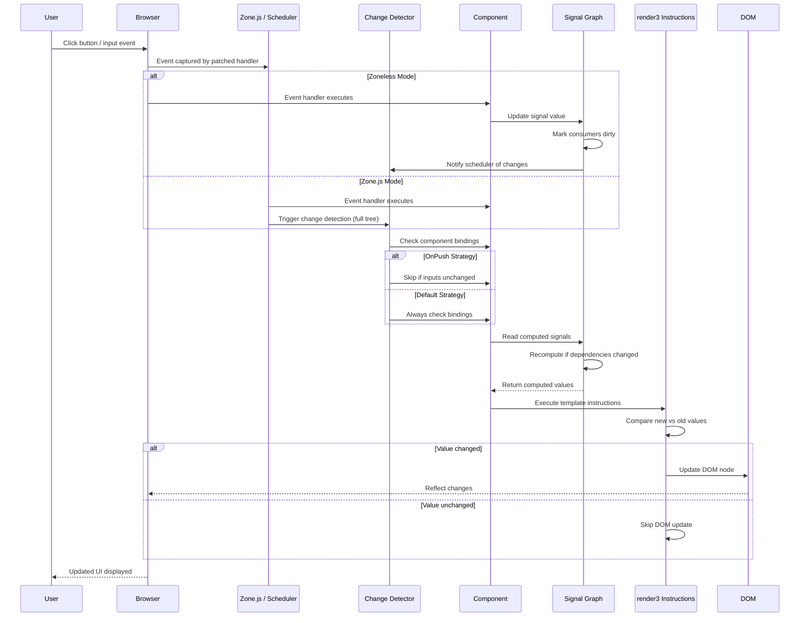
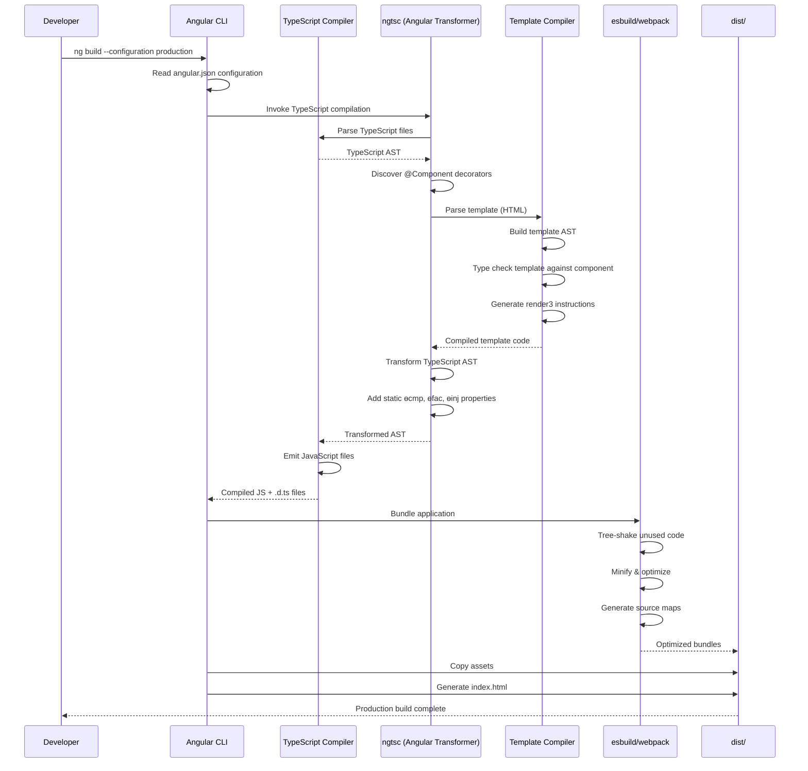
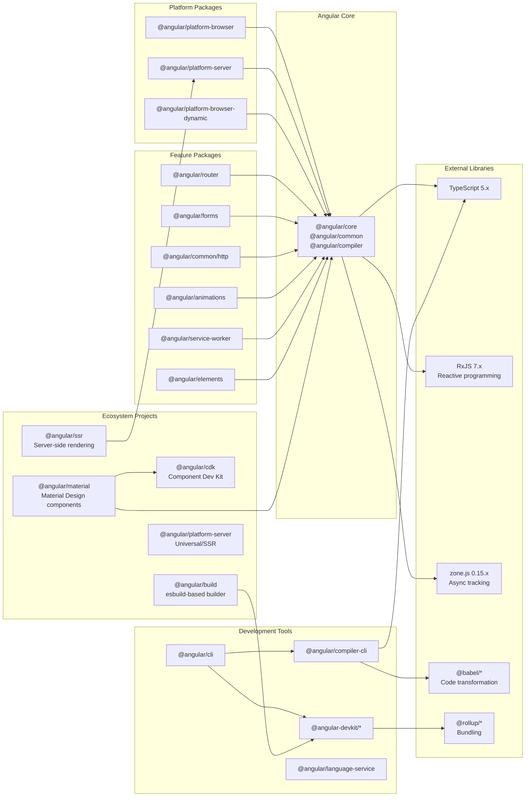

# Angular

> Deliver web apps with confidence - The modern web developer's platform

| Metadata | |
|---|---|
| Repository | https://github.com/angular/angular |
| License | MIT License |
| Primary Language | TypeScript |
| Analyzed Release | `v21.2.0-next.2` (2026-02-05) |
| Stars (approx.) | 99,816 |
| Generated by | Claude Sonnet 4.5 (Anthropic) |
| Generated on | 2026-02-08 |

## Overview

Angular is a comprehensive development platform for building mobile and desktop web applications using TypeScript and JavaScript. It provides a complete solution including a component-based framework, a CLI for scaffolding and building projects, a powerful template compiler, dependency injection system, routing, forms handling, HTTP client, animations, and testing utilities.

Problems it solves:

- Building large-scale enterprise applications with maintainable architecture through modular component design and hierarchical dependency injection
- Managing application state and UI reactivity efficiently with the introduction of Signals as a modern alternative to Zone.js-based change detection
- Ensuring type safety and early error detection through AOT compilation, reducing runtime errors and improving bundle size through tree-shaking
- Providing consistent development experience across teams with opinionated tooling (Angular CLI), style guides, and migration schematics
- Delivering high-performance web applications through optimizations like Ivy rendering engine, incremental DOM, lazy loading, and server-side rendering

Positioning:

Angular is positioned as an enterprise-grade, opinionated framework compared to more flexible libraries like React or Vue. It's the successor to AngularJS (1.x) with a complete rewrite starting from Angular 2+. The framework is backed by Google and has strong adoption in large-scale enterprise environments. With the introduction of standalone components (default since Angular 15+), Signals-based reactivity (Angular 16+), and zoneless change detection (stable in Angular 20+), Angular is evolving toward better performance and developer experience while maintaining backward compatibility.

## Architecture Overview

Angular employs a layered architecture with clear separation between compilation, runtime, and platform-specific implementations. The Ivy compiler transforms TypeScript components and templates into optimized JavaScript instructions. The core runtime (render3) manages component lifecycle, dependency injection, and change detection. Platform-specific packages (platform-browser, platform-server) provide rendering targets for different environments.

## Core Components

### Ivy Rendering Engine (`packages/core/src/render3/`)

- Responsibility: Core rendering pipeline that transforms component definitions into efficient DOM operations using incremental DOM approach
- Key files: `packages/core/src/render3/component.ts`, `packages/core/src/render3/instructions/`, `packages/core/src/render3/interfaces/definition.ts`
- Design patterns: Instruction-based rendering, Locality principle, Incremental DOM

Ivy is Angular's third-generation rendering engine replacing View Engine. It generates rendering instructions directly rather than using an interpreter. The locality principle means the compiler only needs information from a component's decorator and class, not the entire application, enabling true incremental compilation. The instructions directory contains low-level operations like `element()`, `text()`, `property()`, and `listener()` that are generated by the compiler and executed at runtime. This approach enables superior tree-shaking as unused features generate no code, reducing bundle sizes by 30-40% compared to View Engine.

### Dependency Injection System (`packages/core/src/di/`)

- Responsibility: Hierarchical dependency injection managing service instantiation, scoping, and lifecycle across application and component trees
- Key files: `packages/core/src/di/r3_injector.ts`, `packages/core/src/di/injector.ts`, `packages/core/src/di/injection_token.ts`, `packages/core/src/di/injectable.ts`
- Design patterns: Hierarchical injector pattern, Provider pattern, Token-based injection

Angular's DI system creates two parallel injector trees: EnvironmentInjector (formerly ModuleInjector) for application-level services and ElementInjector for component-level dependencies. When resolving dependencies, Angular walks up the ElementInjector hierarchy first, then the EnvironmentInjector hierarchy. The `inject()` function introduced as the modern alternative to constructor injection enables functional composition and usage in factory functions. Resolution modifiers like `@Optional()`, `@Self()`, `@SkipSelf()`, and `@Host()` provide fine-grained control over dependency resolution. The system supports lazy loading with tree-shakable providers through `providedIn` metadata.

### Template Compiler (`packages/compiler/`)

- Responsibility: Parsing templates, validating syntax, and generating optimized TypeScript code from component templates
- Key files: `packages/compiler/src/render3/`, `packages/compiler/src/template_parser/`, `packages/compiler/src/ml_parser/`, `packages/compiler-cli/src/ngtsc/`
- Design patterns: AST transformation pipeline, Visitor pattern, Code generation

The compiler transforms HTML templates into TypeScript code generating rendering instructions. It operates in two modes: AOT (Ahead-of-Time) for production builds and JIT (Just-in-Time) for development. The ngtsc (next-generation TypeScript compiler) integrates with the TypeScript compilation process as a transformer. The compilation pipeline includes: lexing/parsing HTML → building template AST → type checking against component class → generating instruction calls. The compiler performs template type checking, catching errors like invalid property bindings or incorrect event handlers at build time. For AOT, it outputs .js files with compiled templates alongside .d.ts files containing metadata for downstream consumers.

### Signals Reactivity System (`packages/core/primitives/signals/`)

- Responsibility: Fine-grained reactive state management tracking dependencies and propagating changes efficiently without Zone.js
- Key files: `packages/core/primitives/signals/src/signal.ts`, `packages/core/primitives/signals/src/computed.ts`, `packages/core/primitives/signals/src/effect.ts`, `packages/core/primitives/signals/src/graph.ts`
- Design patterns: Observer pattern, Reactive graph, Pull-based reactivity

Signals provide a modern reactivity primitive enabling zoneless change detection. A Signal is a wrapper around a value that notifies consumers when the value changes. Computed signals derive values from other signals and only recompute when dependencies change. Effects run side effects when signal dependencies change. The implementation uses a dependency graph where nodes track their consumers, enabling surgical updates rather than dirty-checking entire component trees. Signals integrate with change detection through `ReactiveNode` and `ReactiveLViewConsumer`, marking only affected components for checking. This enables 20-30% performance improvements by avoiding unnecessary change detection cycles triggered by irrelevant async operations.

### Change Detection (`packages/core/src/change_detection/`)

- Responsibility: Detecting and propagating state changes to update the view efficiently
- Key files: `packages/core/src/change_detection/change_detection.ts`, `packages/core/src/render3/reactive_lview_consumer.ts`, `packages/zone.js/`
- Design patterns: Strategy pattern (ChangeDetectionStrategy), Observer pattern

Angular's change detection comes in two modes: Default (checks entire component tree) and OnPush (checks only when inputs change or events fire). Traditionally powered by Zone.js which monkey-patches async APIs to trigger change detection automatically, Angular is transitioning to zoneless mode where change detection is triggered explicitly by Signals, event handlers, async pipe, or manual `markForCheck()` calls. The change detection cycle traverses the component tree depth-first, checking bindings and updating DOM where necessary. With zoneless + signals, components become pull-based reactive nodes that notify the scheduler when they need checking, dramatically reducing wasted cycles.

### Router (`packages/router/`)

- Responsibility: Client-side navigation, route matching, lazy loading, and managing navigation lifecycle
- Key files: `packages/router/src/router.ts`, `packages/router/src/router_state.ts`, `packages/router/src/recognize.ts`, `packages/router/src/apply_redirects.ts`
- Design patterns: State machine, Guard pattern, Resolver pattern

The router manages URL-based navigation through a configuration tree of routes. Navigation flows through phases: redirects → recognition → guards → resolvers → activation → rendering. Route guards (CanActivate, CanDeactivate, etc.) control access, while resolvers prefetch data before activation. Lazy loading leverages dynamic imports to load feature modules on-demand, reducing initial bundle size. The router maintains two parallel trees: UrlTree (parsed URL structure) and RouterStateSnapshot (activated routes with components). Functional guards and resolvers introduced as alternatives to class-based implementations enable better tree-shaking and composition. The router integrates with server-side rendering for prerendering and supports partial hydration in modern Angular versions.

## Data Flow

### Component Rendering and Change Detection Flow

### AOT Compilation and Build Flow

## Key Design Decisions

### 1. Ivy Rendering Engine with Instruction-Based Approach

- Choice: Replace View Engine's interpreter-based rendering with direct instruction generation implementing incremental DOM
- Rationale: Interpreter-based rendering required shipping interpreter code in every bundle regardless of which features were used. By generating instructions directly, tree-shaking eliminates unused framework code. Incremental DOM updates only changed nodes rather than diffing entire virtual DOM trees, improving performance and memory usage. Locality principle enables true incremental compilation where components compile independently without global analysis
- Trade-offs: Requires complete rewrite of compiler and runtime. Breaking changes from View Engine required migration effort. Instruction API is lower-level and less abstracted. Initial Ivy adoption faced stability issues and required View Engine compatibility mode

### 2. Signals-Based Reactivity for Zoneless Change Detection

- Choice: Introduce Signals as reactive primitives enabling fine-grained change detection without Zone.js dependency
- Rationale: Zone.js monkey-patches all async browser APIs causing overhead and potential conflicts with third-party libraries. It triggers change detection for all async operations even when they don't affect Angular state. Signals track dependencies precisely, updating only affected components. Zoneless mode enables better integration with non-Angular code and modern JavaScript frameworks. Aligns with industry trends toward fine-grained reactivity (like Solid.js, Vue 3 Composition API)
- Trade-offs: Requires learning new reactive primitives and migration from Zone.js-based patterns. Mixed mode (Zone.js + Signals) during transition increases complexity. Existing codebases require gradual migration. Signal API additions increase framework surface area

### 3. Hierarchical Dependency Injection with Two Injector Trees

- Choice: Implement parallel EnvironmentInjector and ElementInjector trees with specific resolution order
- Rationale: EnvironmentInjector manages application-level singletons and lazy-loaded module scope. ElementInjector provides component-level services enabling isolation and testability. Walking ElementInjector first enables overriding application services at component level. Tree-shakable providers through `providedIn` eliminate need to register every service in modules. Supports lazy loading with proper scoping
- Trade-offs: Conceptual complexity of understanding two injector hierarchies. Resolution rules with modifiers (@Optional, @Self, @SkipSelf, @Host) add learning curve. Debugging dependency resolution issues requires understanding tree structure. Provider lookup traversal has performance cost for deeply nested components

### 4. Ahead-of-Time (AOT) Compilation as Default

- Choice: Make AOT compilation the default and primary compilation mode, with JIT available for development
- Rationale: AOT catches template errors at build time rather than runtime, improving reliability. Eliminates compiler from production bundles reducing size by ~1MB. Pre-compiled templates load and render faster. Enables better tree-shaking and optimization. Template type checking prevents common errors. Security benefits by eliminating eval-based compilation
- Trade-offs: Slower build times during development (mitigated by incremental compilation). Build process more complex with TypeScript transformer integration. Some dynamic template patterns difficult or impossible. Requires build step eliminating simple script tag inclusion

### 5. Standalone Components and Simplified Mental Model

- Choice: Introduce standalone components that can bootstrap without NgModules, making them the default since Angular 15+
- Rationale: NgModules added conceptual overhead especially for beginners who needed to understand modules before building first component. Standalone components import dependencies directly in decorator making dependencies explicit and local. Reduces boilerplate and simplifies project structure. Aligns with industry trends toward component-centric architecture. Enables better tree-shaking by making dependency graph more explicit
- Trade-offs: Existing applications require gradual migration from NgModule-based architecture. Standalone and NgModule interop requires understanding compatibility rules. Some advanced patterns (shared module configuration, route scope) require rethinking. Documentation and tutorials split between NgModule and standalone approaches during transition

## Dependencies

## Testing Strategy

Angular employs comprehensive multi-level testing with strong emphasis on unit and integration testing through Jasmine and Karma.

Unit tests: Every package contains extensive test suites in `*_spec.ts` files colocated with source code. The framework itself uses Jasmine for test structure and Karma for test execution. Tests cover component logic, services, pipes, directives, and utilities. Angular TestBed provides utilities for configuring test modules, creating component fixtures, and mocking dependencies. Component testing leverages fixture.detectChanges() for manual change detection control. The core packages use Bazel for build and test execution providing hermetic, cacheable test runs.

Integration tests: End-to-end integration tests in the `integration/` directory test complete application scenarios using real compilation and bundling. These tests verify CLI workflows, AOT compilation, lazy loading, server-side rendering, and framework interop. Each integration test typically scaffolds a mini application, runs build commands, and validates output. The repository also includes benchmark tests (`packages/benchpress/`) measuring rendering performance, change detection speed, and memory usage across different scenarios.

Build system: Angular uses Bazel as the primary build system for the framework itself providing fast, reproducible builds with fine-grained caching. The monorepo structure with pnpm workspaces manages dependencies across 20+ packages. TypeScript compilation integrates with ngtsc transformer. API surface testing through api-extractor validates public API changes preventing unintentional breaking changes. Symbol extractor tests ensure tree-shaking effectiveness by verifying which symbols appear in production bundles.

CI/CD: GitHub Actions orchestrates continuous integration running lint checks, unit tests, integration tests, and performance benchmarks. The pipeline includes circular dependency detection, code format verification (Prettier), and TypeScript strict mode validation. Separate workflows handle framework tests versus integration tests to parallelize execution. Release automation generates changelogs from conventional commits, publishes npm packages, and updates documentation site. Tsec (TypeScript security analyzer) runs as part of CI to catch security issues.

## Key Takeaways

1. Instruction-based rendering enables superior tree-shaking: By generating direct rendering instructions rather than using an interpreter, Ivy eliminates all unused framework code. This architectural decision demonstrates how compilation strategy fundamentally impacts bundle size and runtime performance. Applicable to any framework considering how to balance feature richness with payload size.

2. Fine-grained reactivity through Signals represents industry evolution: The shift from Zone.js-based dirty checking to Signal-based reactivity reflects broader industry trends toward precise dependency tracking. This pattern enables surgical updates rather than broad tree traversals, applicable to any reactive system dealing with complex state dependencies.

3. Hierarchical dependency injection balances flexibility and encapsulation: The two-tree injector design (Environment + Element) elegantly solves the problem of providing application-level singletons while enabling component-level isolation. The resolution order and modifiers demonstrate sophisticated scope management applicable to any large-scale DI system.

4. Locality principle in compilation enables scalability: Ivy's locality (compiling each component independently using only its own metadata) eliminates the need for global program analysis. This architectural choice enables incremental compilation and distributed builds, demonstrating how compiler design affects development velocity at scale.

5. Migration strategy for breaking changes: Angular's approach to major architectural changes (View Engine to Ivy, NgModules to standalone, Zone.js to Signals) provides a playbook for framework evolution. Compatibility modes, migration schematics, and gradual adoption paths demonstrate how to evolve large ecosystems without fragmenting the community.

6. Platform abstraction through packages: Separating platform-specific code (platform-browser, platform-server) from core runtime enables Angular to target multiple rendering environments. This architectural separation demonstrates clean abstraction boundaries applicable to any framework supporting multiple platforms.

## References

- [Angular Official Documentation](https://angular.dev/)
- [Angular GitHub Repository](https://github.com/angular/angular)
- [Angular Routing Internals — A Scientific, Production-Minded Guide (2026)](https://dev.to/cristiansifuentes/angular-routing-internals-a-scientific-production-minded-guide-2026-333m)
- [Zoneless Change Detection](https://angular.dev/guide/zoneless)
- [Change Detection in Angular: Zone vs Signal](https://medium.com/@kakarotdevv/change-detection-in-angular-zone-vs-signal-9b35f6a39eea)
- [The Latest in Angular Change Detection](https://angular.love/the-latest-in-angular-change-detection-zoneless-signals/)
- [Ivy Engine in Angular: First In-Depth Look at Compilation, Runtime and Change Detection](https://angular.love/ivy-engine-in-angular-first-in-depth-look-at-compilation-runtime-and-change-detection/)
- [Inside Ivy: Exploring the New Angular Compiler](https://medium.com/angular-in-depth/inside-ivy-exploring-the-new-angular-compiler-ebf85141cee1)
- [Hierarchical Dependency Injection](https://angular.dev/guide/di/hierarchical-dependency-injection)
- [Ahead-of-Time (AOT) Compilation](https://angular.dev/tools/cli/aot-compiler)
- [Understanding Angular AOT vs JIT Compilations](https://abp.io/community/articles/understanding-angular-aot-vs-jit-compilations-0r0a0a3f)
- [Angular Architecture Guide To Building Maintainable Applications at Scale](https://nx.dev/blog/architecting-angular-applications)
