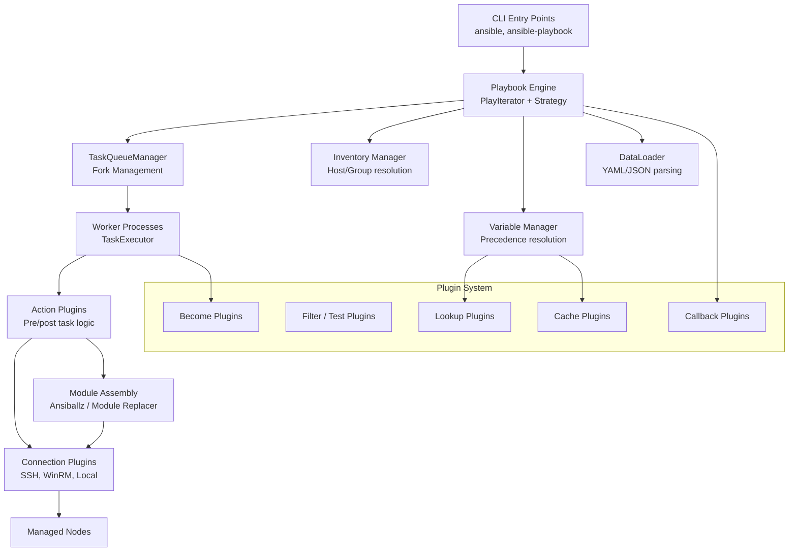
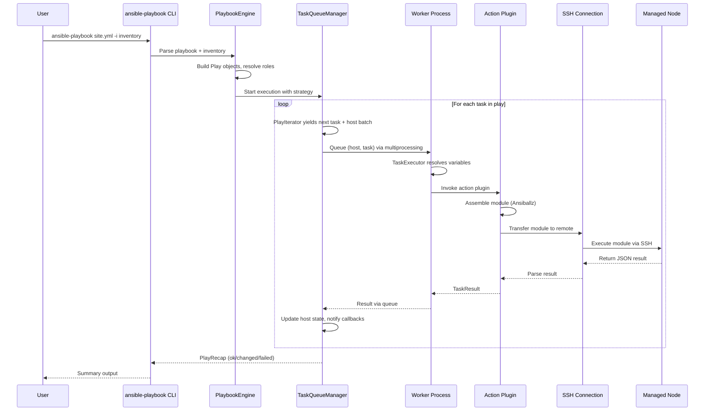
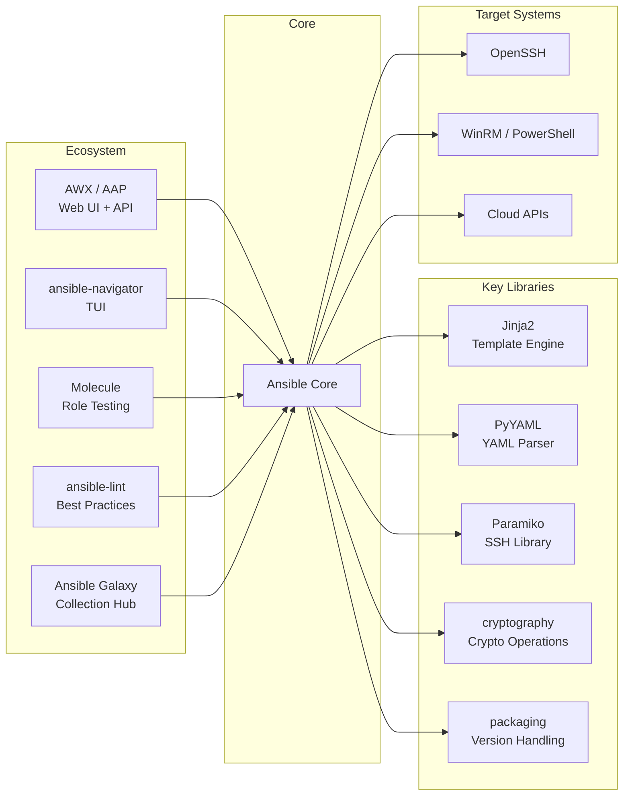

# Ansible

> Radically simple IT automation platform for application deployment, configuration management, and orchestration

| Metadata | |
|---|---|
| Repository | https://github.com/ansible/ansible |
| License | GPL-3.0 |
| Primary Language | Python |
| Category | IaC |
| Analyzed Release | `v2.20.2` (2026-01-29) |
| Stars (approx.) | 68,000+ |
| Generated by | Claude Opus 4.6 (Anthropic) |
| Generated on | 2026-02-09 |

## Overview

Ansible is an agentless IT automation platform that uses SSH to connect to remote systems and execute tasks defined in YAML-based playbooks. It enables infrastructure as code by allowing users to describe the desired state of their systems declaratively, then converges each managed node toward that state through idempotent operations. The architecture is designed around simplicity: no agents to install, no custom security infrastructure, and a language that approaches plain English.

Problems it solves:

- Manual, error-prone server configuration that does not scale across hundreds or thousands of nodes
- Inconsistent environments between development, staging, and production due to ad-hoc changes
- Complex multi-tier application deployments requiring coordinated steps across different server roles
- Lack of a unified automation framework covering provisioning, configuration, deployment, and orchestration
- Vendor lock-in from proprietary configuration management tools

Positioning:

Ansible occupies a unique position among configuration management tools (Chef, Puppet, SaltStack) by prioritizing simplicity and agentless operation. While Chef and Puppet require agents on managed nodes, Ansible uses SSH, reducing operational overhead. Compared to Terraform (which focuses on provisioning), Ansible excels at post-provisioning configuration and application deployment. The project sits at the heart of the Red Hat automation ecosystem, with Ansible Tower/AWX providing enterprise-grade UI and RBAC, and Ansible Galaxy serving as a community hub for reusable roles and collections.

## Architecture Overview

Ansible follows a push-based, controller-to-node architecture where the control node orchestrates execution across managed hosts via SSH. The core engine reads inventory, parses playbooks, resolves variables, and dispatches tasks through a plugin-driven execution pipeline. Everything flows through a layered system: CLI parses commands, the playbook engine iterates through plays and tasks, the executor dispatches work to forked processes, and connection plugins deliver module code to remote nodes for execution.

## Core Components

### Playbook Engine (`lib/ansible/playbook/`)

- Responsibility: Parsing, validating, and representing playbook structures (plays, tasks, roles, blocks, handlers)
- Key files: `lib/ansible/playbook/play.py`, `lib/ansible/playbook/task.py`, `lib/ansible/playbook/role/__init__.py`, `lib/ansible/playbook/block.py`, `lib/ansible/playbook/handler.py`
- Design patterns: Composite pattern (plays contain blocks, blocks contain tasks), Template method for attribute inheritance

The playbook engine defines the data model for all playbook constructs. A Play object encapsulates hosts, roles, tasks, and variables. Tasks are the atomic units of work, each referencing a module with arguments. The engine uses a Base class with FieldAttribute descriptors that handle attribute inheritance, validation, and Jinja2 template resolution. Roles provide a reusable packaging mechanism with a well-defined directory structure (tasks/, handlers/, defaults/, vars/, files/, templates/). Blocks enable error handling via rescue/always semantics, similar to try/catch in programming languages.

### Executor (`lib/ansible/executor/`)

- Responsibility: Orchestrating task execution across managed nodes using forked worker processes
- Key files: `lib/ansible/executor/task_queue_manager.py`, `lib/ansible/executor/task_executor.py`, `lib/ansible/executor/play_iterator.py`, `lib/ansible/executor/process/worker.py`
- Design patterns: Strategy pattern (linear, free, debug execution strategies), Producer-consumer with multiprocessing

The executor is the runtime engine of Ansible. TaskQueueManager creates a pool of worker processes and manages communication through multiprocessing queues. PlayIterator tracks the state of each host as it progresses through a play's tasks. The strategy plugin (defaulting to "linear") determines how tasks are dispatched: linear executes each task on all hosts before moving on, while free allows each host to proceed independently. TaskExecutor runs in the worker process and handles the full lifecycle of a single task on a single host: resolving variables, loading the action plugin, executing the module, and processing results.

### Plugin System (`lib/ansible/plugins/`)

- Responsibility: Providing extensible interfaces for connections, actions, callbacks, filters, inventory sources, and more
- Key files: `lib/ansible/plugins/loader.py`, `lib/ansible/plugins/connection/ssh.py`, `lib/ansible/plugins/action/__init__.py`, `lib/ansible/plugins/strategy/linear.py`
- Design patterns: Plugin architecture with lazy loading, Abstract base classes for each plugin type

Ansible's plugin system is its primary extensibility mechanism with 17+ plugin types. Connection plugins (ssh, paramiko, winrm, local) handle transport to managed nodes. Action plugins execute on the control node and bridge the gap between the executor and the remote module by handling file transfers, template rendering, and result processing. Callback plugins receive events during playbook execution for logging, notification, and custom reporting. The plugin loader discovers plugins through a configurable search path that includes built-in plugins, collection-provided plugins, and user-defined plugins in configured directories.

### Inventory System (`lib/ansible/inventory/`)

- Responsibility: Building and managing the host/group hierarchy and associated variables
- Key files: `lib/ansible/inventory/manager.py`, `lib/ansible/inventory/data.py`, `lib/ansible/inventory/host.py`, `lib/ansible/inventory/group.py`
- Design patterns: Composite pattern (groups contain hosts and child groups), Dynamic inventory through plugin interface

The inventory system constructs a data model of all managed infrastructure. InventoryManager coordinates multiple inventory sources (static INI/YAML files, dynamic inventory scripts, inventory plugins) into a unified view. The data model consists of Host and Group objects forming a directed acyclic graph. Groups can contain hosts and child groups, with variables defined at each level. Dynamic inventory plugins can query external sources (AWS EC2, Azure, GCP, VMware) to build the inventory at runtime, allowing Ansible to adapt to cloud-scale infrastructure.

### Variable Manager (`lib/ansible/vars/manager.py`)

- Responsibility: Resolving variables across 22+ precedence levels and providing them to the template engine
- Key files: `lib/ansible/vars/manager.py`, `lib/ansible/vars/hostvars.py`, `lib/ansible/vars/plugins.py`
- Design patterns: Chain of Responsibility for variable precedence, Lazy evaluation for hostvars

VariableManager implements Ansible's complex variable precedence system, merging variables from command-line extra vars (highest), play vars, role defaults (lowest), inventory group_vars, host_vars, facts, and registered variables. The system uses lazy evaluation for hostvars to avoid computing variables for hosts that may not be needed. Variable values can contain Jinja2 expressions that reference other variables, and the template engine (based on Jinja2) recursively resolves these references. The manager also handles "magic variables" like inventory_hostname, groups, and hostvars that provide runtime context.

## Data Flow

### Playbook Execution Flow

## Key Design Decisions

### 1. Agentless Architecture via SSH

- Choice: Use SSH as the primary transport instead of requiring agents on managed nodes
- Rationale: Eliminates the need to install, configure, and maintain agent software on every managed system. SSH is already deployed on virtually all Linux/Unix systems, reducing the barrier to adoption to near zero
- Trade-offs: Higher per-task overhead compared to persistent agent connections. No ability to push changes reactively from managed nodes. Requires SSH key or credential distribution. Performance at scale requires tuning (pipelining, ControlPersist, mitogen)

### 2. YAML-based Declarative DSL

- Choice: Use YAML for playbooks instead of a general-purpose programming language or custom DSL
- Rationale: YAML is human-readable and approachable for system administrators who may not be developers. It enforces a declarative style that describes desired state rather than procedural steps
- Trade-offs: YAML's limitations (no native logic constructs) lead to Jinja2 template abuse for complex scenarios. Error messages from YAML parsing can be cryptic. The "simplicity" can become complex when combining when conditions, loops, and variable interpolation

### 3. Module Execution in Isolated Processes

- Choice: Ship module code to managed nodes and execute in separate processes rather than running modules within the controller
- Rationale: Provides strong isolation between modules and the controller. Modules can be written in any language the target supports. Failures in one module cannot crash the controller
- Trade-offs: Higher latency due to file transfer and process creation. Module utility code must be bundled (Ansiballz zipping). Debugging remote module execution is more difficult than local execution

### 4. Plugin-based Extensibility

- Choice: Make virtually every subsystem replaceable through plugins (17+ plugin types)
- Rationale: Allows the community to extend Ansible without modifying core code. Connection plugins support diverse transports (SSH, WinRM, Docker, network devices). Strategy plugins allow different execution models
- Trade-offs: Plugin API surface is large and evolving, making backward compatibility challenging. Plugin discovery and loading adds startup overhead. The boundary between "core" and "plugin" behavior can be unclear

### 5. Collections as Distribution Unit

- Choice: Move from monolithic module bundling to a distributed collections system via Ansible Galaxy
- Rationale: The monolithic approach was unsustainable with thousands of modules. Collections allow independent versioning, testing, and release cycles. Content creators can publish without waiting for core releases
- Trade-offs: Increased complexity for users who must manage collection dependencies. Namespace changes broke existing playbooks during migration. Collection resolution adds overhead to playbook loading

## Dependencies

## Testing Strategy

Ansible employs a comprehensive multi-layered testing approach.

Unit tests: Located in `test/units/`, these tests cover individual modules, plugins, and core components using pytest. Module tests validate argument parsing, idempotency logic, and return values without connecting to real infrastructure. The test suite uses extensive mocking to isolate components.

Integration tests: Found in `test/integration/`, these run actual Ansible playbooks against test targets (Docker containers, VMs) to validate end-to-end behavior. Integration targets cover module functionality, connection types, and complex playbook features. The `test/integration/targets/` directory contains hundreds of test scenarios.

CI/CD: Ansible uses Azure Pipelines and GitHub Actions for continuous integration. The CI matrix covers multiple Python versions (3.10+), operating systems (Linux, macOS, Windows), and test categories (sanity, units, integration). Sanity tests enforce coding standards, documentation requirements, and import validation. The `ansible-test` tool provides a unified interface for running all test types.

## Key Takeaways

1. Simplicity as architecture driver: Ansible demonstrates that choosing simplicity at the architectural level (agentless, YAML, push-based) can drive massive adoption even when it introduces trade-offs in performance and flexibility. The SSH-based approach eliminates an entire class of operational complexity that agent-based systems must manage.

2. Plugin systems enable ecosystem growth: By defining clean plugin interfaces for 17+ extension points, Ansible created an ecosystem where thousands of community modules and plugins extend its reach far beyond what any core team could build. The lesson is that investing in plugin architecture early pays dividends as the project scales.

3. Variable precedence as a design challenge: Ansible's 22+ variable precedence levels reveal the inherent tension between flexibility and predictability. While the system is powerful, it is a frequent source of user confusion. This demonstrates that each new variable source adds combinatorial complexity to debugging and reasoning about behavior.

4. Collections solve monorepo scaling: The transition from a monolithic module distribution to independent collections illustrates how large open-source projects must eventually decompose their distribution model. The collections system allows independent release cycles while maintaining a unified user experience through Galaxy.

## References

- [Ansible Official Documentation](https://docs.ansible.com/)
- [Ansible Architecture Overview](https://docs.ansible.com/projects/ansible/latest/dev_guide/overview_architecture.html)
- [Ansible Module Architecture](https://docs.ansible.com/projects/ansible/latest/dev_guide/developing_program_flow_modules.html)
- [Developing Plugins Guide](https://docs.ansible.com/projects/ansible/latest/dev_guide/developing_plugins.html)
- [Ansible GitHub Repository](https://github.com/ansible/ansible)
- [Ansible Architecture - Spacelift](https://spacelift.io/blog/ansible-architecture)
