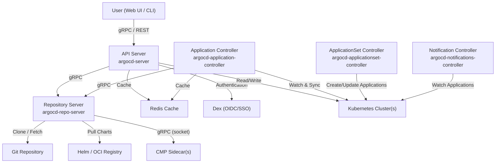
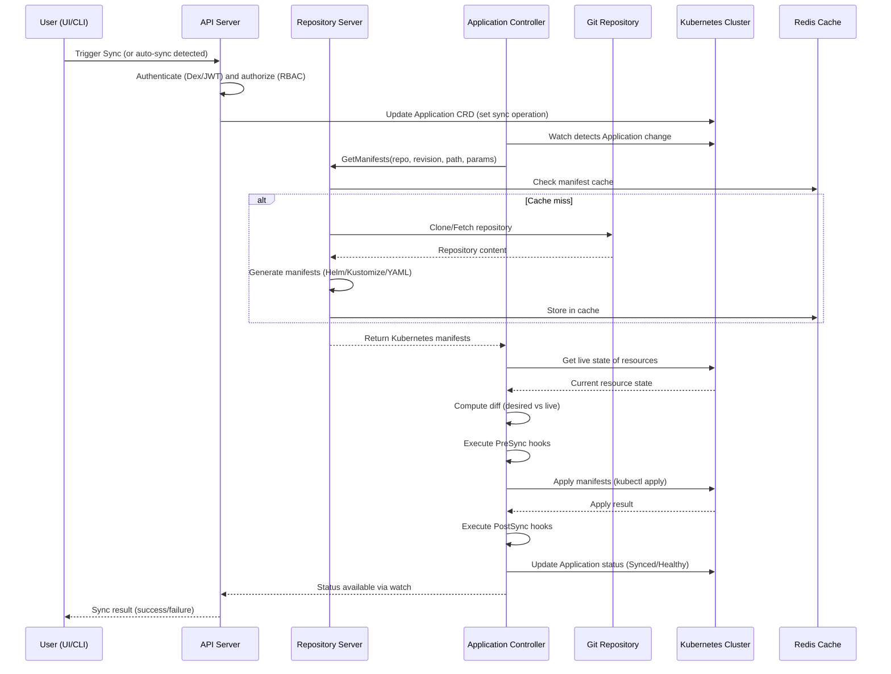
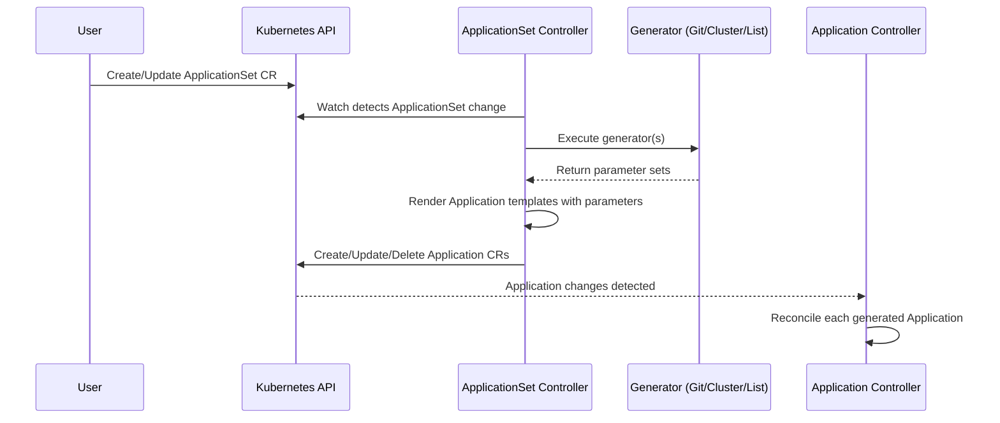
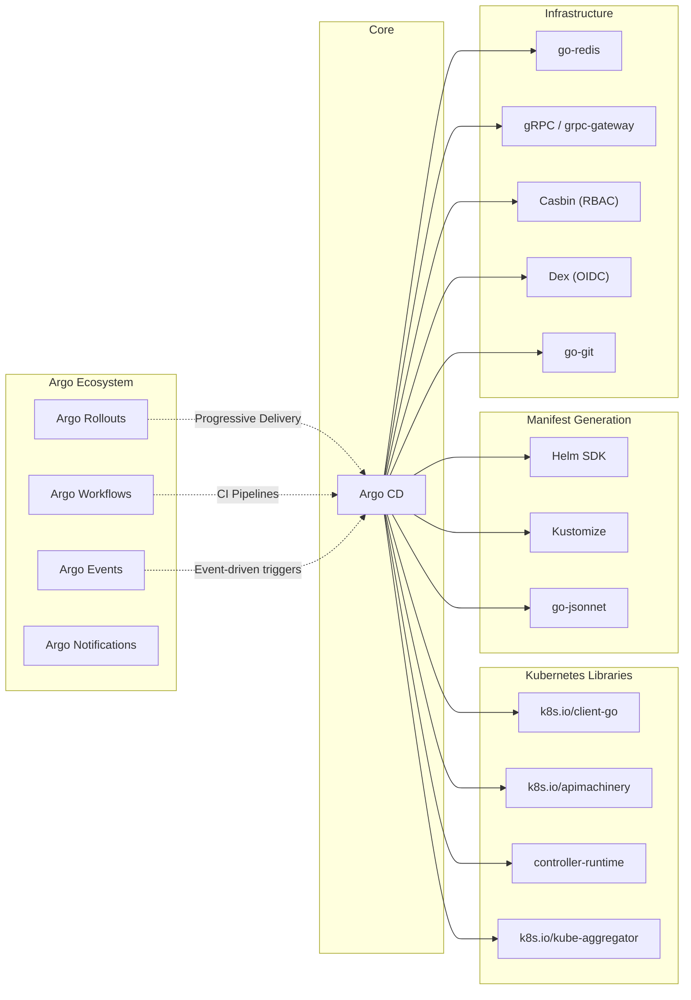

# Argo CD

> Declarative, GitOps-based continuous deployment for Kubernetes

| Metadata | |
|---|---|
| Repository | https://github.com/argoproj/argo-cd |
| License | Apache License 2.0 |
| Primary Language | Go |
| Analyzed Release | `v3.3.0` (2026-02-02) |
| Stars (approx.) | 21,900+ |
| Generated by | Claude Opus 4.6 (Anthropic) |
| Generated on | 2026-02-08 |

## Overview

Argo CD is a declarative, GitOps continuous delivery tool for Kubernetes. It continuously monitors running applications and compares the current live state in the cluster against the desired target state defined in a Git repository, automatically detecting drift and optionally reconciling it. Argo CD operates as a set of Kubernetes controllers and microservices, providing both a rich web UI and a CLI for managing application deployments across multiple clusters.

Problems it solves:

- Manual and error-prone Kubernetes deployments that lack auditability and reproducibility
- Configuration drift between the desired state in Git and the actual state running in clusters
- Lack of centralized visibility and control when managing applications across multiple Kubernetes clusters
- Complex multi-tenancy requirements where teams need self-service deployment capabilities with guardrails

Positioning:

Argo CD is the most widely adopted GitOps tool in the Kubernetes ecosystem, with over 21,000 GitHub stars and backing from the CNCF as a graduated project. Compared to Flux CD, its primary competitor, Argo CD differentiates itself through a rich web UI, built-in RBAC with SSO integration, and a more opinionated developer experience. While Flux favors a composable, CLI-first, controller-per-concern model that appeals to platform engineers building infrastructure-as-code pipelines, Argo CD targets teams that value centralized visibility, an intuitive interface, and rapid onboarding. Argo CD is part of the broader Argo project ecosystem alongside Argo Workflows, Argo Events, and Argo Rollouts.

## Architecture Overview

Argo CD follows a microservices architecture composed of several independently deployable components that communicate via gRPC. The system is built on top of Kubernetes Custom Resource Definitions (CRDs) -- Application, AppProject, and ApplicationSet -- and uses the Kubernetes control loop pattern to continuously reconcile desired state from Git with actual cluster state. External authentication is delegated to an embedded Dex server, while Redis serves as a throw-away cache layer for performance optimization.

## Core Components

### API Server (`cmd/argocd-server/`, `server/`)

- Responsibility: Serves as the primary gateway for all user interactions, exposing both gRPC and REST APIs (via grpc-gateway) for application management, authentication, RBAC enforcement, and the web UI
- Key files: `cmd/argocd-server/commands/argocd_server.go`, `server/server.go`, `server/application/`, `server/project/`, `server/repository/`
- Design patterns: API Gateway, gRPC-Gateway for REST translation, middleware chain for authentication and authorization

The API Server is the front door to Argo CD. It hosts the embedded web UI (a React single-page application) and translates user intent into operations against the Kubernetes API and internal services. Authentication flows through an embedded Dex instance for SSO/OIDC, or through local accounts. Once authenticated, every request passes through a Casbin-based RBAC policy engine that evaluates JWT group claims against configured roles. The server delegates manifest generation to the Repository Server via gRPC and reads/writes Application CRDs directly to the Kubernetes API.

### Application Controller (`cmd/argocd-application-controller/`, `controller/`)

- Responsibility: Core reconciliation engine that continuously monitors Application resources, computes live-vs-desired state diffs, and orchestrates sync operations
- Key files: `cmd/argocd-application-controller/commands/argocd_application_controller.go`, `controller/appcontroller.go`, `controller/sync.go`, `controller/state.go`
- Design patterns: Kubernetes Controller pattern (informers + work queues), eventual consistency, optimistic concurrency

The Application Controller is the heart of Argo CD. It runs a reconciliation loop that watches Application CRDs via Kubernetes informers, fetches the desired manifests from the Repository Server, retrieves the live state from target clusters, and computes a diff using a three-way merge strategy. When an application is detected as OutOfSync, the controller can either report the drift or (if auto-sync is enabled) initiate a sync operation. Sync operations are executed through configurable waves with lifecycle hooks (PreSync, Sync, PostSync, SyncFail) that enable complex deployment orchestration. The controller uses a sharding mechanism to distribute Application reconciliation across multiple replicas in high-availability deployments, with each shard responsible for a subset of applications determined by a consistent hashing algorithm.

### Repository Server (`cmd/argocd-repo-server/`, `reposerver/`)

- Responsibility: Manages Git repository access, caches repository content, and generates Kubernetes manifests from various source formats (Kustomize, Helm, plain YAML, Jsonnet, and custom plugins)
- Key files: `cmd/argocd-repo-server/commands/argocd_repo_server.go`, `reposerver/repository/repository.go`, `reposerver/cache/cache.go`
- Design patterns: Sidecar pattern (for CMP plugins), Strategy pattern (for manifest generation), caching with TTL-based invalidation

The Repository Server is an internal-only gRPC service that acts as the manifest generation engine. When the API Server or Application Controller needs Kubernetes manifests for an application, they call the Repository Server with the repository URL, target revision, path, and any template-specific parameters (such as Helm values or Kustomize overlays). The server clones or fetches the repository, checks out the specified revision, and dispatches to the appropriate manifest generator based on the detected or configured source type. For custom tooling, Config Management Plugins (CMPs) run as sidecar containers alongside the Repository Server, communicating over Unix domain sockets via gRPC. The server implements aggressive caching of both repository content and generated manifests to minimize repeated Git operations and manifest rendering.

### ApplicationSet Controller (`cmd/argocd-applicationset-controller/`, `applicationset/`)

- Responsibility: Automates the generation and lifecycle management of multiple Application resources from a single declarative ApplicationSet template
- Key files: `applicationset/controllers/applicationset_controller.go`, `applicationset/generators/`, `applicationset/utils/`
- Design patterns: Template Method pattern, Generator/Template separation, Kubernetes controller reconciliation

The ApplicationSet Controller extends Argo CD with the ability to programmatically generate Application resources based on parameterized templates and pluggable generators. Generators (Git directory, Git file, Cluster, List, Matrix, Merge, Pull Request, SCM Provider) produce sets of parameter values that are rendered into Application specs through Go templates. This enables use cases such as deploying the same application across many clusters, generating one Application per directory in a monorepo, or creating ephemeral preview environments from pull requests. The controller watches ApplicationSet CRDs and reconciles the generated Application resources, creating, updating, or deleting them as the generator outputs change.

### Notification Controller (`cmd/argocd-notification-controller/`, `notification_controller/`)

- Responsibility: Monitors Application state changes and dispatches notifications to external services based on configurable triggers and templates
- Key files: `notification_controller/controller.go`
- Design patterns: Observer pattern, template-based message rendering, pluggable transport adapters

The Notification Controller watches Application resources for state transitions (such as sync success, failure, health degradation) and evaluates user-defined trigger conditions. When a trigger fires, the controller renders a notification message using a Go template and dispatches it through configured services including Slack, email, GitHub, PagerDuty, webhooks, and many others. Triggers and templates are defined in ConfigMaps, enabling teams to customize notification behavior without code changes.

## Data Flow

### Application Sync Operation

### ApplicationSet Generation Flow

## Key Design Decisions

### 1. Git as the Single Source of Truth (GitOps Model)

- Choice: All desired application state is declared in Git repositories; the system continuously reconciles the cluster to match Git
- Rationale: Git provides a built-in audit trail, rollback capability (via git revert), peer review through pull requests, and a familiar developer workflow. By making Git the authoritative source, Argo CD eliminates imperative deployment scripts and ensures every change is traceable and reproducible
- Trade-offs: Requires all configuration to be expressible as declarative manifests. Secret management requires additional tooling (Sealed Secrets, SOPS, Vault) since secrets should not be stored in plain text in Git. Network connectivity to Git is required for reconciliation

### 2. Kubernetes CRDs as the Internal Data Model

- Choice: Application, AppProject, and ApplicationSet are defined as Kubernetes Custom Resource Definitions, with etcd as the persistence layer
- Rationale: Using CRDs allows Argo CD to leverage the Kubernetes API for storage, RBAC, watch semantics, and the controller pattern without requiring an external database. This also means applications can be managed declaratively using kubectl or any Kubernetes-native tool
- Trade-offs: The Kubernetes API server becomes a bottleneck at very large scale (thousands of applications). Application status updates create significant write load on etcd. CRDs impose schema versioning constraints that complicate API evolution

### 3. Separation of Manifest Generation into a Dedicated Repository Server

- Choice: Manifest generation (Helm template, Kustomize build, etc.) is isolated in a separate Repository Server process with its own lifecycle
- Rationale: Isolating manifest generation provides security boundaries (untrusted Helm charts or CMP plugins cannot access cluster credentials), enables independent scaling, and allows caching at the manifest level. The Repository Server can be scaled horizontally to handle high manifest generation throughput
- Trade-offs: Adds network latency for gRPC calls between controller and repo server. The Repository Server requires significant disk I/O and memory for cloning large repositories. CMP sidecar architecture adds operational complexity

### 4. Redis as a Throw-Away Cache Layer

- Choice: Redis is used for caching application state, manifests, and repository metadata, but is explicitly designed to be disposable
- Rationale: By treating Redis as ephemeral, Argo CD avoids the operational burden of persistent Redis clusters. All authoritative state lives in Kubernetes (etcd) and Git, so the cache can be rebuilt from scratch without data loss. This dramatically reduces the blast radius of cache failures
- Trade-offs: Cache invalidation and cold-start scenarios cause temporary performance degradation. After a Redis restart, the controller must re-fetch all manifests and re-compute diffs, which can cause a spike in Git and Kubernetes API load

### 5. Embedded Dex for Authentication with Delegated RBAC

- Choice: Argo CD bundles Dex as its authentication provider and implements its own RBAC layer using Casbin, rather than relying solely on Kubernetes RBAC
- Rationale: Embedding Dex provides out-of-the-box SSO integration with any OIDC/LDAP/SAML provider without requiring users to configure external authentication infrastructure. The custom RBAC layer allows fine-grained access control at the application and project level, which Kubernetes RBAC cannot express natively (e.g., "user X can sync application Y in project Z")
- Trade-offs: Maintaining an embedded identity provider adds complexity and a potential attack surface. The dual RBAC model (Kubernetes RBAC + Argo CD RBAC) can be confusing. Argo CD does not maintain its own user database, which limits local user management capabilities

## Dependencies

## Testing Strategy

Argo CD employs a multi-layered testing strategy spanning unit tests, integration tests, and comprehensive end-to-end tests to ensure reliability across its distributed architecture.

Unit tests: Each package contains `_test.go` files co-located with implementation code. Tests use the standard Go `testing` package along with `stretchr/testify` for assertions. Mock interfaces are used extensively for external dependencies like the Kubernetes API, Git operations, and gRPC services. The `controller/`, `reposerver/`, and `server/` packages have particularly thorough unit test coverage for their core reconciliation and manifest generation logic.

Integration tests: Integration tests validate interactions between components, particularly the Repository Server's ability to generate manifests from various source types (Helm, Kustomize, plain YAML, Jsonnet) and the Application Controller's reconciliation behavior against a real or simulated Kubernetes API.

E2E tests: The `test/e2e/` directory contains a comprehensive end-to-end test suite that deploys Argo CD into a real Kubernetes cluster (k3s in CI, or a local cluster for development). Tests create actual Git repositories from test fixtures, deploy real applications, and verify sync behavior. Each test receives a unique 5-character ID and runs in an isolated `argocd-e2e-<random>` namespace. The CI pipeline uses Argo Workflows to orchestrate E2E test execution on disposable k3s clusters. Running E2E tests locally is supported via `make start-e2e` (to launch services) and `make test-e2e` (to execute the suite).

CI/CD: The project uses GitHub Actions for CI, running linting (`golangci-lint`), unit tests, and E2E tests on every pull request. Container images are built and published for each release using a multi-stage Dockerfile.

## Key Takeaways

1. Treat the cache as disposable: Argo CD's decision to use Redis as a throw-away cache that can be rebuilt from authoritative sources (Git and Kubernetes) is an excellent pattern for distributed systems. By ensuring no unique state lives in the cache, the system gains resilience without sacrificing performance. Any application that depends on a cache should be designed to function correctly (albeit more slowly) when the cache is entirely empty.

2. Isolate untrusted workloads behind process boundaries: The Repository Server's separation from the Application Controller is a security-conscious design. Since manifest generation involves executing arbitrary Helm templates, Kustomize plugins, or custom CMP binaries, isolating this in a separate process (and further isolating CMP plugins in sidecar containers communicating over Unix sockets) prevents a compromised plugin from accessing cluster credentials held by the controller. This principle of least privilege across process boundaries is applicable to any system that executes user-provided or third-party code.

3. Leverage Kubernetes primitives instead of reinventing them: By modeling its core data as CRDs and implementing reconciliation through the standard controller pattern (informers, work queues, eventual consistency), Argo CD gets watch semantics, declarative management, RBAC, API discoverability, and persistence for free. This dramatically reduces the amount of infrastructure code the project needs to maintain and allows it to be managed using the same tools (kubectl, GitOps, Terraform) that manage the rest of the Kubernetes ecosystem.

4. Design for multi-tenancy from the start: Argo CD's AppProject abstraction provides namespace-like isolation at the application level, restricting which repositories, clusters, and namespaces a project can access. Combined with the Casbin-based RBAC engine that evaluates JWT group claims, this enables organizations to offer self-service deployment capabilities to many teams while maintaining security boundaries. Building multi-tenancy into the core data model (rather than bolting it on later) is far more effective.

5. Separate state observation from state mutation: The controller's reconciliation loop clearly separates the "observe and compare" phase (fetching manifests, reading live state, computing diffs) from the "act" phase (applying resources, running hooks). This separation makes the system safer -- drift detection works independently of whether auto-sync is enabled -- and gives operators the choice between manual approval workflows and fully automated reconciliation. This pattern of separating detection from action is broadly applicable to any system that manages external state.

## References

- [Argo CD Official Documentation](https://argo-cd.readthedocs.io/en/stable/)
- [Argo CD Architectural Overview](https://argo-cd.readthedocs.io/en/stable/operator-manual/architecture/)
- [Argo CD Component Architecture (Developer Guide)](https://argo-cd.readthedocs.io/en/latest/developer-guide/architecture/components/)
- [Argo CD GitHub Repository](https://github.com/argoproj/argo-cd)
- [Argo CD E2E Testing Guide](https://argo-cd.readthedocs.io/en/stable/developer-guide/test-e2e/)
- [A Comprehensive Overview of Argo CD Architectures (Codefresh)](https://codefresh.io/learn/argo-cd/a-comprehensive-overview-of-argo-cd-architectures-2025/)
- [Argo CD DeepWiki](https://deepwiki.com/argoproj/argo-cd)
- [Argo CD High Availability](https://argo-cd.readthedocs.io/en/stable/operator-manual/high_availability/)
- [Argo CD RBAC Configuration](https://argo-cd.readthedocs.io/en/stable/operator-manual/rbac/)
- [Argo CD Config Management Plugins](https://argo-cd.readthedocs.io/en/stable/operator-manual/config-management-plugins/)
