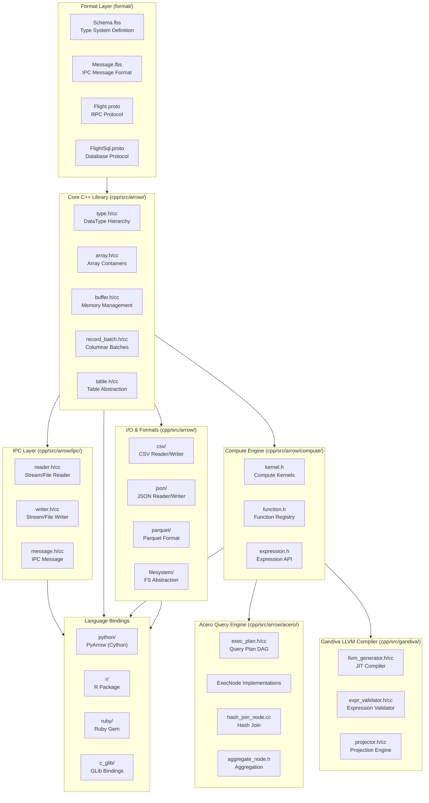
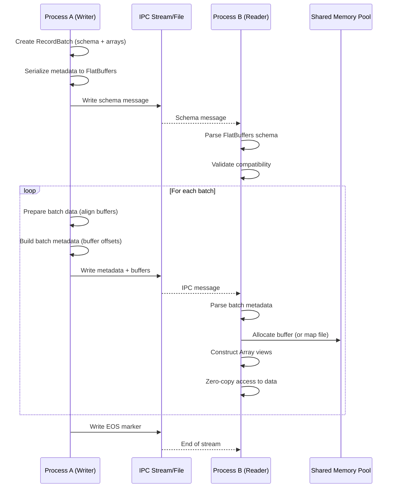
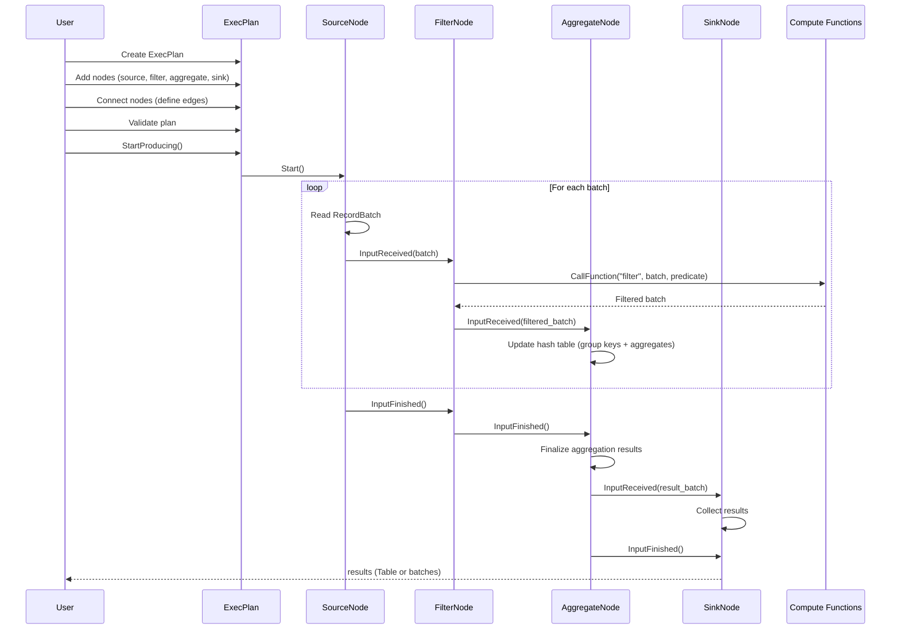
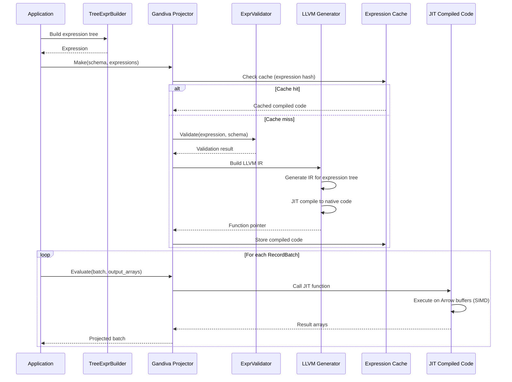
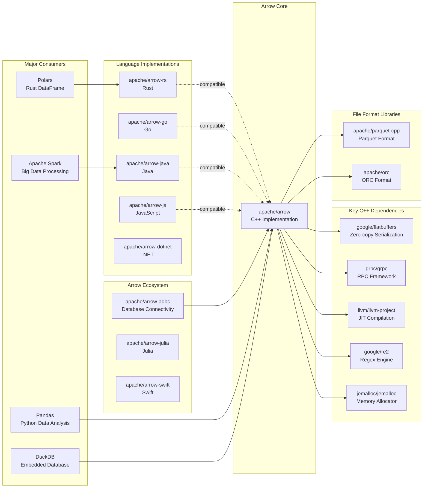

# Apache Arrow

> Universal columnar format and multi-language toolbox for fast data interchange and in-memory analytics

| Metadata | |
|---|---|
| Repository | https://github.com/apache/arrow |
| License | Apache-2.0 |
| Primary Language | C++ |
| Analyzed Release | `apache-arrow-23.0.0` (2026-01-18) |
| Stars (approx.) | 16,486 |
| Generated by | Claude Sonnet 4.5 (Anthropic) |
| Generated on | 2026-02-08 |

## Overview

Apache Arrow is a development platform for in-memory analytics that provides a standardized language-independent columnar memory format for flat and hierarchical data, organized for efficient analytic operations on modern hardware. Arrow enables zero-copy data sharing between processes and heterogeneous systems with a rich data type system supporting nested and user-defined types. The project includes multi-language libraries (C++, Python, Java, Go, Rust, etc.) and defines IPC/RPC mechanisms for efficient data movement.

Problems it solves:

- Eliminating serialization overhead when moving data between systems and languages by providing a standard in-memory format that enables zero-copy reads
- Enabling vectorized execution using SIMD operations on modern CPUs through contiguous columnar layout optimized for cache efficiency
- Providing fast data interchange across heterogeneous systems (databases, data frames, query engines) without expensive conversion overhead

Positioning:

Arrow has become the de facto standard for in-memory analytics, adopted by major big data systems like Spark, Pandas, Dask, and Polars. It serves as the foundation for interoperability in the modern data ecosystem. Arrow Flight provides a high-performance RPC framework for database connectivity, and ADBC offers a database-neutral API standard.

## Architecture Overview

Apache Arrow employs a layered architecture centered around a columnar memory format specification. The C++ implementation serves as the reference, with language-specific bindings providing idiomatic interfaces. The architecture separates format specification (FlatBuffers schemas), in-memory representation (type system and buffer management), compute kernels (vectorized operations), and I/O layers (IPC, file formats, networking).

## Core Components

### Type System (`cpp/src/arrow/type.h`)

- Responsibility: Defines the logical type hierarchy for Arrow's rich type system including primitives, nested types, and temporal types
- Key files: `cpp/src/arrow/type.h`, `cpp/src/arrow/type.cc`, `cpp/src/arrow/type_fwd.h`
- Design patterns: Type hierarchy with visitor pattern, flyweight for type instances

The DataType class hierarchy provides logical types (Int32, String, List, Struct, etc.) that map to physical buffer layouts. The type system supports parametric types (e.g., Decimal with precision/scale, Timestamp with time unit) and nested types (List, Struct, Map, Union). Each DataType instance is immutable and cached, enabling efficient type equality checks via pointer comparison. The DataTypeLayout struct describes the physical buffer layout for each type, separating logical semantics from physical representation.

### Array and Buffer Management (`cpp/src/arrow/array.h`, `cpp/src/arrow/buffer.h`)

- Responsibility: Memory management and array container implementation with zero-copy semantics
- Key files: `cpp/src/arrow/array.h`, `cpp/src/arrow/buffer.h`, `cpp/src/arrow/buffer.cc`, `cpp/src/arrow/memory_pool.h`
- Design patterns: Reference counting, memory pool pattern, builder pattern for construction

Buffer provides reference-counted, immutable byte buffers with aligned memory allocation (64-byte alignment for SIMD). MemoryPool abstracts allocator backends (system, jemalloc, mimalloc). Array types (Int32Array, StringArray, etc.) are immutable views over underlying buffers with validity bitmaps for null handling. Chunked arrays allow handling data larger than 2^31 elements by composing multiple array chunks. Builder classes provide efficient array construction with type-specific optimizations.

### IPC Format (`cpp/src/arrow/ipc/`)

- Responsibility: Serialization and deserialization of Arrow data for interprocess communication
- Key files: `cpp/src/arrow/ipc/reader.h`, `cpp/src/arrow/ipc/writer.h`, `cpp/src/arrow/ipc/message.h`, `format/Message.fbs`
- Design patterns: Streaming protocol, message-based communication

The IPC layer implements two formats: streaming (for pipes, sockets) and file format (random access). Messages are encoded using FlatBuffers for zero-copy metadata parsing. RecordBatchStreamReader/Writer handle sequential reading/writing of batches, while RecordBatchFileReader/Writer support random access with footer metadata. Dictionary encoding is supported with dictionary batch messages. The format ensures 64-byte alignment for efficient SIMD processing and supports compression (LZ4, ZSTD).

### Compute Kernels (`cpp/src/arrow/compute/`)

- Responsibility: Vectorized compute operations on Arrow arrays
- Key files: `cpp/src/arrow/compute/api.h`, `cpp/src/arrow/compute/kernel.h`, `cpp/src/arrow/compute/registry.h`
- Design patterns: Function registry, kernel dispatch based on input types

The compute module provides a registry of vectorized functions (scalar, vector, aggregate). Functions support multiple kernel implementations dispatched based on input types. Kernels are optimized using SIMD instructions and operate directly on Arrow arrays without deserialization. The Expression API provides a declarative interface for building compute graphs. Key function categories include arithmetic, comparison, string manipulation, datetime operations, and aggregations.

### Acero Query Engine (`cpp/src/arrow/acero/`)

- Responsibility: Stream-based query execution engine for analytical workloads
- Key files: `cpp/src/arrow/acero/exec_plan.h`, `cpp/src/arrow/acero/exec_plan.cc`, `cpp/src/arrow/acero/hash_join_node.cc`
- Design patterns: Pipeline execution, operator-based query processing, backpressure handling

Acero is a modern streaming query engine built on Arrow. ExecPlan represents a DAG of ExecNode operators (source, filter, project, aggregate, join, union, etc.). Execution uses push-based streaming with backpressure control. Hash join implementation includes optimizations like bloom filters and SIMD-accelerated swiss tables. Aggregation nodes support both hash-based and streaming aggregation. The engine integrates tightly with Arrow compute functions and supports expression-based operations.

### Gandiva LLVM Compiler (`cpp/src/gandiva/`)

- Responsibility: JIT compilation of Arrow expressions to native code using LLVM
- Key files: `cpp/src/gandiva/llvm_generator.h`, `cpp/src/gandiva/projector.h`, `cpp/src/gandiva/expr_validator.h`
- Design patterns: Expression compilation, code generation, function registry

Gandiva provides runtime code generation for Arrow expressions. It parses expression trees, validates them against supported function signatures, generates LLVM IR, and JIT-compiles to native code. The compiled code operates directly on Arrow buffers without interpretation overhead. Gandiva supports a rich set of functions for arithmetic, string manipulation, date/time, and conditionals. Generated code is cached based on expression signatures to avoid recompilation.

### Language Bindings - PyArrow (`python/pyarrow/`)

- Responsibility: Python interface to Arrow C++ libraries with Pandas integration
- Key files: `python/pyarrow/_compute.pyx`, `python/pyarrow/lib.pyx`, `python/pyarrow/array.pxi`
- Design patterns: Cython bindings for zero-copy integration, Python C API usage

PyArrow provides Pythonic APIs wrapping the C++ core. Cython enables zero-copy data sharing between NumPy/Pandas and Arrow. The library supports seamless conversion to/from Pandas DataFrames, reading/writing Parquet files, and compute function invocation. PyArrow handles reference counting across the Python/C++ boundary and provides Python-specific conveniences like context managers and iterators.

## Data Flow

### IPC Data Exchange Between Processes

### Acero Query Execution Flow

### Gandiva Expression Compilation and Execution

## Key Design Decisions

### 1. Columnar Memory Layout with Aligned Buffers

- Choice: Store data in column-oriented format with 64-byte aligned, contiguous memory buffers
- Rationale: Columnar layout enables vectorized processing using SIMD instructions (AVX2, AVX512), maximizes cache efficiency for analytical queries scanning many rows but few columns, and enables compression algorithms to work on homogeneous data
- Trade-offs: Row insertion is less efficient than row-oriented formats. Requires buffer alignment and padding which increases memory overhead slightly. Not optimal for transactional workloads requiring random row access

### 2. Language-Agnostic Format with FlatBuffers

- Choice: Define schema and IPC messages using FlatBuffers instead of Protocol Buffers or custom serialization
- Rationale: FlatBuffers enables zero-copy parsing - messages can be read directly from buffers without deserialization. Forward and backward compatibility through schema evolution. Language-agnostic specification ensures consistent behavior across 15+ language implementations
- Trade-offs: FlatBuffers is less widely adopted than Protocol Buffers, requiring custom tooling. Schema files must be distributed alongside binaries. Limited support for schema validation and complex nested structures

### 3. Reference-Counted Immutable Arrays

- Choice: Arrays and buffers are immutable and reference-counted for automatic memory management
- Rationale: Immutability enables safe zero-copy sharing across threads and processes. Reference counting avoids garbage collection pauses and provides deterministic destruction. Enables slice operations without copying data
- Trade-offs: Mutation requires creating new arrays (copy-on-write semantics). Reference counting adds atomic operations overhead. Cyclic references must be avoided (though rare in practice)

### 4. Separation of Compute and Execution Engines

- Choice: Provide low-level compute kernels (arrow/compute) separate from high-level query engine (Acero) and expression compiler (Gandiva)
- Rationale: Compute kernels can be used standalone for simple operations without query engine overhead. Acero provides declarative query planning for complex analytics. Gandiva offers JIT compilation for expression-heavy workloads. Separation allows users to choose appropriate abstraction level
- Trade-offs: API surface is large and potentially confusing (when to use compute vs Acero vs Gandiva). Code duplication between kernel implementations and Gandiva codegen. Integration complexity between layers

### 5. Multi-Implementation Strategy

- Choice: Maintain separate implementations in multiple languages (arrow-rs, arrow-go, arrow-java) rather than wrapping C++
- Rationale: Native implementations provide idiomatic APIs and integrate with language ecosystems (e.g., Rust ownership, Java GC). Avoids FFI overhead for performance-critical paths. Enables language-specific optimizations and ecosystem integration
- Trade-offs: Feature parity challenges across implementations. Specification must be detailed enough to ensure compatibility. Increased maintenance burden with multiple codebases. Integration testing complexity

### 6. Flight RPC for Database Connectivity

- Choice: Build Arrow Flight on gRPC for high-performance data transfer rather than using JDBC/ODBC
- Rationale: Flight leverages Arrow's columnar format end-to-end, eliminating serialization overhead. Streaming protocol with backpressure enables efficient transfer of large result sets. gRPC provides HTTP/2 multiplexing, authentication, and encryption. FlightSQL extends Flight with SQL semantics
- Trade-offs: Requires client and server to support Arrow format. Not compatible with legacy JDBC/ODBC tooling without adapters. Relatively new protocol with less ecosystem maturity compared to traditional database protocols

## Dependencies

## Testing Strategy

Apache Arrow employs comprehensive multi-layered testing to ensure correctness and cross-language compatibility.

Unit tests: Each component has extensive unit tests covering edge cases, null handling, and error conditions. Tests use parameterized testing for type variations. Golden file pattern is used for IPC format tests. Memory leak detection via Valgrind and sanitizers (ASAN, UBSAN).

Integration tests: Cross-language integration tests validate IPC format compatibility. Test data generated in one language is consumed by all other implementations. JSON-based integration test format describes schema and data. Tests cover all type combinations including nested types and dictionaries.

Performance benchmarks: Google Benchmark framework for C++ microbenchmarks. Benchmarks cover compute kernels, IPC throughput, Acero query execution, and Gandiva compilation. Continuous performance regression tracking via Conbench.

Fuzz testing: OSS-Fuzz integration for continuous fuzzing of parsers and compute kernels. Fuzz targets for IPC reader, CSV parser, Parquet reader.

CI/CD: GitHub Actions and self-hosted runners for multi-platform testing (Linux, macOS, Windows, ARM). Matrix testing across compiler versions (GCC, Clang, MSVC) and optional dependencies. Nightly builds verify compatibility with development versions of dependencies.

## Key Takeaways

1. Zero-copy as first principle: Arrow's entire architecture is built around enabling zero-copy data access - from aligned buffer allocation to IPC format design to array slicing. This principle permeates every design decision and enables unprecedented performance for data interchange

2. Specification-driven multi-language support: Rather than wrapping a single implementation, Arrow defines a detailed format specification enabling native implementations in each language. This approach maximizes language ecosystem integration while ensuring interoperability through rigorous integration testing

3. Layered abstraction for different use cases: Providing low-level building blocks (buffers, arrays) alongside high-level abstractions (Acero, Gandiva) allows users to choose the right level - systems builders use primitives while data scientists use DataFrame-like interfaces

4. Columnar format enables vectorization: The contiguous columnar layout is specifically designed for SIMD vectorization on modern CPUs. Compute kernels can process entire columns using AVX2/AVX512 instructions, achieving order-of-magnitude speedups over row-oriented processing

5. Immutability simplifies concurrency: Immutable arrays with reference counting enable safe sharing across threads without locking. This design choice simplifies concurrent processing and enables the streaming execution model in Acero

6. FlatBuffers for metadata efficiency: Using FlatBuffers for schema and IPC messages eliminates parsing overhead - metadata can be accessed directly from wire format. This is critical for low-latency scenarios where metadata parsing would dominate small batch processing

7. Expression compilation for CPU efficiency: Gandiva's LLVM-based compilation of expressions to native code eliminates interpretation overhead and enables aggressive compiler optimizations including loop unrolling and auto-vectorization

## References

- [Apache Arrow Official Documentation](https://arrow.apache.org/)
- [Arrow Columnar Format Specification](https://arrow.apache.org/docs/format/Columnar.html)
- [Arrow IPC Format Specification](https://arrow.apache.org/docs/format/IPC.html)
- [Arrow Flight RPC Protocol](https://arrow.apache.org/docs/format/Flight.html)
- [Apache Arrow Architecture (Cloudera Blog)](https://blog.cloudera.com/introducing-apache-arrow-a-fast-interoperable-in-memory-columnar-data-structure-standard/)
- [Apache Arrow Repository](https://github.com/apache/arrow)
