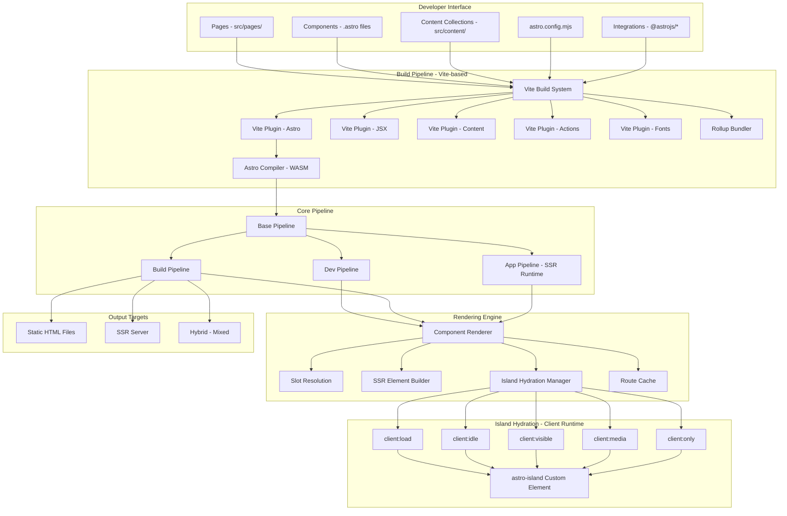
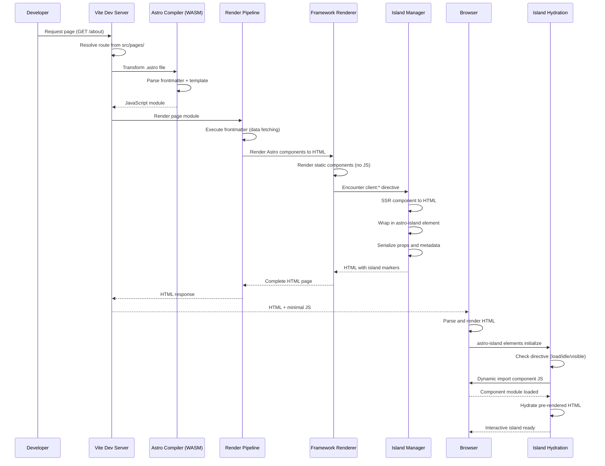

# Astro - Architecture Report

| Item | Detail |
|------|--------|
| Project | Astro |
| Repository | [withastro/astro](https://github.com/withastro/astro) |
| Category | Web Framework |
| Language | TypeScript |
| License | MIT-like (Custom) |
| Stars | 56,628 |
| Latest Release | astro@6.0.0-beta.9 (2026-02-05) |
| Generated by | Claude Opus 4.6 (Anthropic) |
| Generated on | 2026-02-08 |

---

## Overview

Astro is a content-focused web framework that pioneered the "Islands Architecture" -- a rendering model where pages are rendered as static HTML by default, with isolated interactive "islands" of JavaScript hydrated independently on the client. This approach addresses the fundamental tension in modern web development: the need for rich interactivity without sacrificing page load performance.

The core problem Astro solves is the "JavaScript tax" imposed by traditional SPA frameworks. Frameworks like React, Vue, and Svelte ship their entire component tree as JavaScript to the browser, even when most of the page is static content. For content-heavy sites (blogs, documentation, marketing pages, e-commerce), this results in unnecessary JavaScript that hurts Core Web Vitals scores and user experience.

Astro's positioning is unique in the framework landscape:
- Zero JavaScript by default: Pages ship no client JS unless explicitly requested
- Framework agnostic: Use React, Vue, Svelte, Solid, Preact, or Lit components in the same project
- Content-first: Built-in content collections with type-safe frontmatter, Markdown/MDX support
- Hybrid rendering: Static (SSG), server (SSR), or per-route rendering strategies
- Vite-powered: Built on Vite for fast development and optimized production builds

Astro occupies the space between static site generators (Hugo, Jekyll) and full-featured meta-frameworks (Next.js, Nuxt), offering the performance of static sites with the component model of modern frameworks.

---

## Architecture Overview



---

## Core Components

### 1. Astro Compiler (WASM)

Responsibility: Parse .astro single-file components into JavaScript modules that can be processed by Vite and rendered on the server.

Key files:
- The compiler is a separate package (`@astrojs/compiler`) written in Go and compiled to WASM
- `packages/astro/src/core/compile.ts` -- Compiler integration point
- `packages/astro/src/runtime/compiler/` -- Runtime compiler utilities

Design patterns:
- Compiler pattern: Transforms .astro template syntax into executable JavaScript
- Bridge pattern: Go/WASM compiler communicates with the TypeScript runtime through a defined API

The Astro compiler parses the .astro file format, which consists of a frontmatter script section (fenced by ---) and a template section that resembles JSX but supports Astro-specific directives. The compiler outputs a JavaScript module with a default export function that renders the component to HTML strings. The WASM implementation ensures consistent parsing performance regardless of the host runtime.

### 2. Vite Plugin System

Responsibility: Integrate Astro's compilation, content collections, actions, and asset handling into Vite's build pipeline.

Key files:
- `packages/astro/src/vite-plugin-astro/` -- Core Astro file transformation
- `packages/astro/src/content/vite-plugin-content-imports.ts` -- Content collection type generation
- `packages/astro/src/content/vite-plugin-content-virtual-mod.ts` -- Virtual module for content access
- `packages/astro/src/content/vite-plugin-content-assets.ts` -- Content asset handling
- `packages/astro/src/actions/vite-plugin-actions.ts` -- Server actions integration
- `packages/astro/src/assets/fonts/vite-plugin-fonts.ts` -- Font optimization

Design patterns:
- Plugin pattern: Each Vite plugin hooks into Vite's transform, resolveId, and load lifecycle methods
- Virtual Module pattern: Content collections and config are exposed as virtual modules (e.g., `astro:content`)
- Pipeline pattern: Multiple plugins transform files sequentially through Vite's plugin pipeline

The Vite plugin architecture is central to Astro's extensibility. When Vite encounters an `.astro` file, the Astro plugin invokes the WASM compiler, transforms the output, and injects hydration scripts for interactive islands. Content plugins generate TypeScript types from content schemas and provide virtual module access to collection data.

### 3. Rendering Pipeline

Responsibility: Orchestrate server-side rendering of pages, components, and islands with support for multiple UI frameworks.

Key files:
- `packages/astro/src/core/base-pipeline.ts` -- Abstract base pipeline class
- `packages/astro/src/core/app/pipeline.ts` -- Production SSR pipeline
- `packages/astro/src/core/app/dev/pipeline.ts` -- Development pipeline
- `packages/astro/src/core/build/pipeline.ts` -- Static build pipeline
- `packages/astro/src/core/render/renderer.ts` -- Framework-specific renderer orchestration
- `packages/astro/src/core/render/index.ts` -- Page rendering entry point
- `packages/astro/src/core/render-context.ts` -- Per-request render context
- `packages/astro/src/core/render/slots.ts` -- Named slot resolution
- `packages/astro/src/core/render/ssr-element.ts` -- SSR element construction

Design patterns:
- Template Method pattern: BasePipeline defines the rendering sequence; Dev, Build, and App pipelines implement specifics
- Strategy pattern: Different renderers for React, Vue, Svelte, etc. implement a common interface
- Chain of Responsibility: Middleware chain processes requests before rendering

The pipeline architecture supports three modes:
- Dev Pipeline: Uses Vite's dev server with HMR for fast iteration
- Build Pipeline: Generates static HTML files with optional prerendering
- App Pipeline: Runtime SSR for dynamically rendered routes

### 4. Island Hydration System

Responsibility: Manage selective client-side hydration of interactive components, ensuring zero JavaScript for static content.

Key files:
- `packages/astro/src/runtime/client/load.ts` -- client:load directive (immediate hydration)
- `packages/astro/src/runtime/client/idle.ts` -- client:idle directive (requestIdleCallback)
- `packages/astro/src/runtime/client/visible.ts` -- client:visible directive (IntersectionObserver)
- `packages/astro/src/runtime/client/media.ts` -- client:media directive (matchMedia)
- `packages/astro/src/runtime/client/only.ts` -- client:only directive (client-only rendering)
- `packages/astro/src/runtime/client/hmr.ts` -- HMR support for islands

Design patterns:
- Observer pattern: IntersectionObserver for client:visible, requestIdleCallback for client:idle
- Lazy Loading pattern: Islands load their JavaScript only when their hydration condition is met
- Custom Element pattern: `<astro-island>` web component encapsulates hydration logic

The island system works as follows:
1. During SSR, interactive components are rendered to HTML and wrapped in `<astro-island>` custom elements
2. The custom element carries metadata: component URL, renderer, props (serialized), and hydration directive
3. On the client, each `<astro-island>` monitors its hydration condition
4. When triggered, it dynamically imports the component module and the framework renderer
5. The framework hydrates the pre-rendered HTML, attaching event listeners and state

### 5. Content Layer

Responsibility: Provide a type-safe, schema-validated content management system for Markdown, MDX, and custom data sources.

Key files:
- `packages/astro/src/content/content-layer.ts` -- Content layer orchestration
- `packages/astro/src/content/data-store.ts` -- In-memory data store for content
- `packages/astro/src/content/mutable-data-store.ts` -- Mutable store for loaders
- `packages/astro/src/content/config.ts` -- Content collection configuration
- `packages/astro/src/content/loaders/glob.ts` -- File-system glob loader
- `packages/astro/src/content/loaders/file.ts` -- Single-file loader
- `packages/astro/src/content/types-generator.ts` -- TypeScript type generation
- `packages/astro/src/content/runtime.ts` -- Runtime content querying API

Design patterns:
- Repository pattern: Content collections provide a queryable interface over structured content
- Builder pattern: Content schemas are defined using Zod-based schema builders
- Loader pattern: Pluggable content loaders (glob, file, custom) abstract data source differences

---

## Data Flow



---

## Key Design Decisions

### 1. Zero JavaScript by Default

Choice: Ship no client-side JavaScript unless a component explicitly uses a `client:*` hydration directive.

Rationale: Most content on the web is static text, images, and layout. Sending JavaScript for content that never changes wastes bandwidth and hurts performance. By making JavaScript opt-in rather than opt-out, Astro ensures the best possible performance baseline. Pages consistently achieve 100 Lighthouse performance scores without special optimization.

Trade-offs: Developers must explicitly mark interactive components, adding friction to the development process. Components that need interactivity require understanding the hydration directive system. Some patterns common in SPA frameworks (global state, context providers) do not translate directly.

### 2. Framework-Agnostic Island Architecture

Choice: Support multiple UI frameworks (React, Vue, Svelte, Solid, Preact, Lit) within the same project, with each island independently hydrated.

Rationale: This provides maximum flexibility for teams with diverse framework expertise. It also enables migration strategies -- teams can incrementally adopt new frameworks without rewriting existing components. Each island is independently hydrated, so a React component's bundle does not affect a Svelte component's loading.

Trade-offs: Supporting multiple frameworks adds significant complexity to the build system and renderer architecture. Each framework integration is a separate package that must be maintained. Using multiple frameworks in one project means shipping multiple framework runtimes to the browser.

### 3. Vite as the Build Foundation

Choice: Build Astro's entire dev server and build pipeline on top of Vite rather than creating a custom bundler.

Rationale: Vite provides fast HMR, ESM-based dev server, Rollup-based production builds, and a rich plugin ecosystem. Building on Vite means Astro benefits from Vite's ongoing improvements and ecosystem. Developers familiar with Vite can understand and extend Astro's build process.

Trade-offs: Astro is coupled to Vite's architecture and release cycle. Vite-specific limitations (e.g., SSR handling) become Astro's limitations. The plugin system adds layers of indirection that can make debugging difficult.

### 4. Content Collections with Schema Validation

Choice: Provide a first-class content management layer with Zod-based schema validation, automatic TypeScript type generation, and pluggable content loaders.

Rationale: Content-focused sites need structured data (blog posts, documentation pages, product listings). Content Collections give developers type safety at build time, catching frontmatter errors before deployment. The loader system allows content to come from the file system, a CMS API, or any custom source.

Trade-offs: The content layer adds build-time overhead for type generation. The API for defining collections has a learning curve. Large content collections can slow down builds. The system is optimized for Astro's rendering model and is not easily portable to other frameworks.

### 5. WASM-Based Compiler

Choice: Implement the .astro file compiler in Go, compiled to WASM, rather than in JavaScript/TypeScript.

Rationale: Go provides fast compilation and deterministic memory management. WASM ensures the compiler runs consistently across all platforms (Node.js, Deno, Bun) without native binary distribution issues. The compiler performance is critical since it runs on every .astro file during development.

Trade-offs: Contributing to the compiler requires Go expertise, creating a higher barrier for TypeScript-focused contributors. WASM adds a startup cost for the first compilation. Debugging the compiler requires different tooling than the rest of the TypeScript codebase.

---

## Dependencies

```mermaid
graph LR
    subgraph "Core Dependencies"
        VITE_DEP[Vite]
        COMPILER_DEP[@astrojs/compiler - WASM]
        ZOD[Zod - Schema Validation]
        UNIST[unified/remark/rehype - Markdown]
        SHARP[Sharp - Image Optimization]
    end

    subgraph "Astro Core"
        ASTRO[packages/astro]
    end

    subgraph "Framework Integrations"
        REACT_INT[@astrojs/react]
        VUE_INT[@astrojs/vue]
        SVELTE_INT[@astrojs/svelte]
        SOLID_INT[@astrojs/solid-js]
        PREACT_INT[@astrojs/preact]
        LIT_INT[@astrojs/lit]
    end

    subgraph "Adapter Integrations"
        NODE_AD[@astrojs/node]
        VERCEL_AD[@astrojs/vercel]
        CF_AD[@astrojs/cloudflare]
        NETLIFY_AD[@astrojs/netlify]
    end

    subgraph "Companion Packages"
        DB[packages/db - Astro DB]
        RSS[packages/astro-rss]
        CREATE[create-astro CLI]
    end

    VITE_DEP & COMPILER_DEP & ZOD & UNIST & SHARP --> ASTRO
    ASTRO --> REACT_INT & VUE_INT & SVELTE_INT & SOLID_INT & PREACT_INT & LIT_INT
    ASTRO --> NODE_AD & VERCEL_AD & CF_AD & NETLIFY_AD
    ASTRO --> DB & RSS & CREATE
```

Astro is a monorepo with the core `packages/astro` package depending on Vite, the WASM compiler, Zod for schemas, unified ecosystem for Markdown processing, and Sharp for image optimization. Framework and adapter integrations are separate packages.

---

## Testing Strategy

Astro employs a multi-layered testing approach:

- Unit tests: Individual modules tested with Vitest (e.g., content schema validation, route matching)
- Integration tests: Full build and dev server tests that render pages and assert HTML output
- End-to-end tests: Playwright-based browser tests for hydration behavior and client-side interactivity
- Fixture-based tests: Test projects in `packages/astro/test/fixtures/` that represent real-world scenarios
- Snapshot tests: HTML output snapshots for regression detection
- Cross-framework tests: Dedicated test suites for each framework integration (React, Vue, Svelte, etc.)

The monorepo uses Turborepo for build orchestration and caching, ensuring efficient CI/CD across the many packages.

---

## Key Takeaways

1. Islands Architecture as a performance paradigm -- Astro's most significant contribution to web development is proving that partial hydration works at scale. By rendering pages as static HTML and independently hydrating interactive components, Astro achieves SPA-like interactivity with MPA-like performance. The `<astro-island>` custom element pattern is an elegant implementation that other frameworks are adopting.

2. Framework agnosticism through renderer abstraction -- Astro's ability to mix React, Vue, and Svelte components in a single page demonstrates a powerful abstraction layer. The renderer interface standardizes how different frameworks are server-rendered and hydrated, enabling true framework interoperability. This is architecturally significant as it decouples page composition from framework choice.

3. Compiler-driven optimization -- The WASM compiler approach shows that investing in a dedicated, high-performance compiler pays dividends in both build performance and the ability to implement optimizations that would be impossible with a runtime-only approach. The .astro file format can evolve independently of JavaScript syntax constraints.

4. Content as a first-class concern -- Unlike general-purpose frameworks that treat content as an afterthought, Astro's Content Collections demonstrate that schema-validated, type-safe content management can be a core framework feature. The loader pattern makes content sourcing pluggable while maintaining type safety.

5. Vite as a framework foundation -- Astro's successful use of Vite as its build foundation validates the approach of building meta-frameworks on top of general-purpose build tools. The Vite plugin system provides sufficient extension points for complex framework-specific behavior while leveraging Vite's ecosystem and ongoing improvements.

---

## References

- [Astro Official Documentation](https://docs.astro.build/)
- [GitHub Repository - withastro/astro](https://github.com/withastro/astro)
- [Islands Architecture - Astro Docs](https://docs.astro.build/en/concepts/islands/)
- [Astro DeepWiki](https://deepwiki.com/withastro/astro)
- [Understanding Astro Islands Architecture - LogRocket](https://blog.logrocket.com/understanding-astro-islands-architecture/)
- [Astro Islands Architecture Explained - Strapi Blog](https://strapi.io/blog/astro-islands-architecture-explained-complete-guide)
- [Islands Architecture - patterns.dev](https://www.patterns.dev/vanilla/islands-architecture/)
