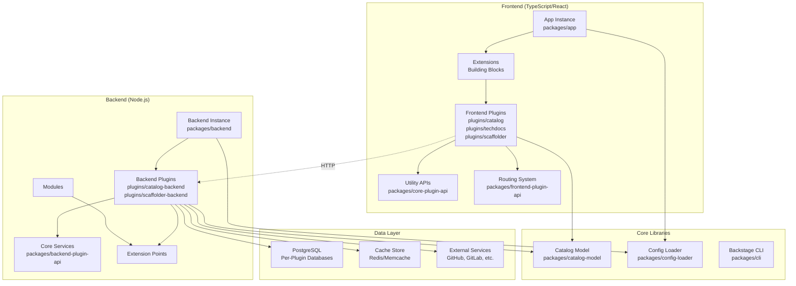
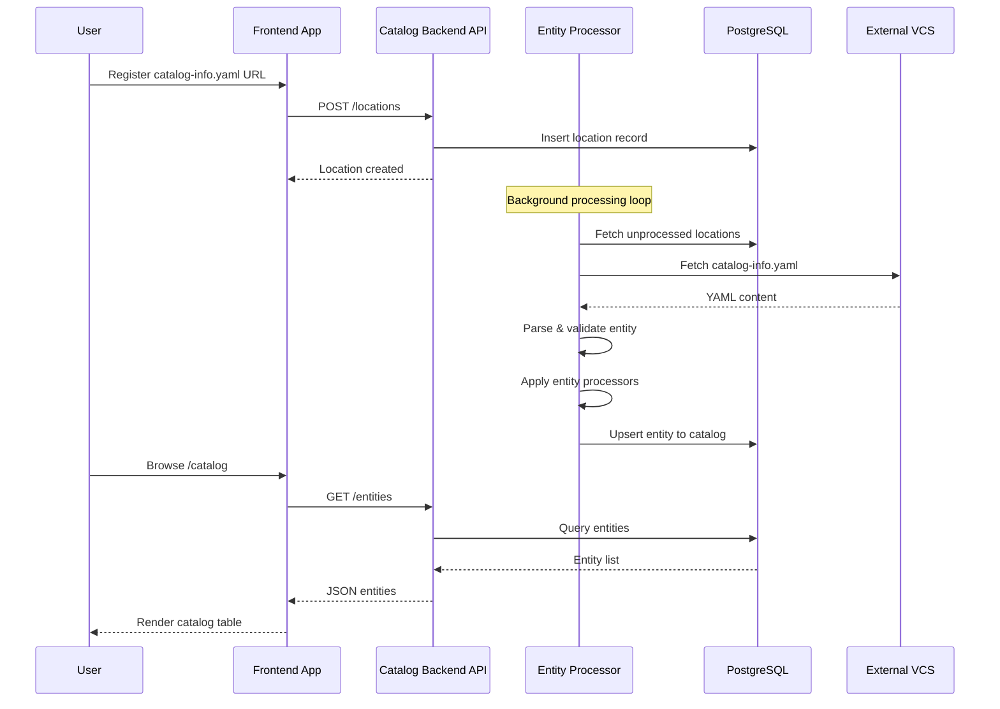
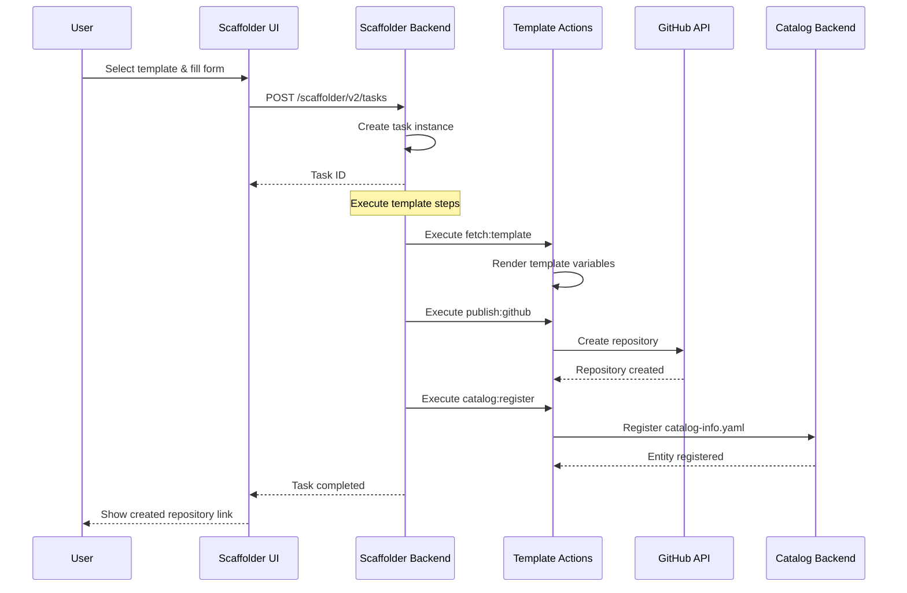
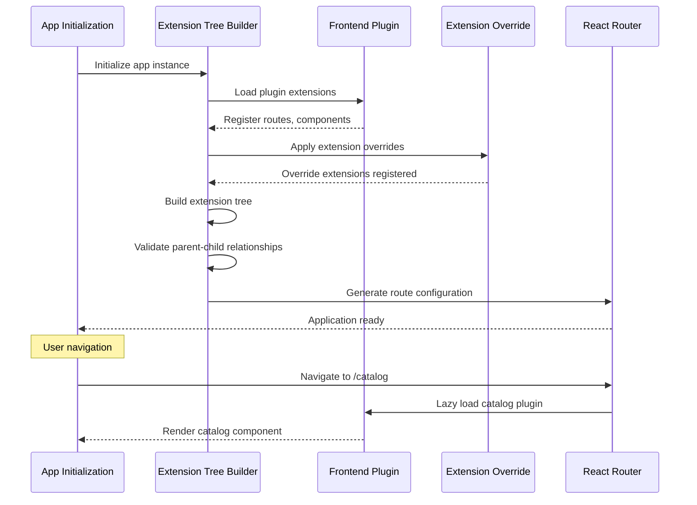
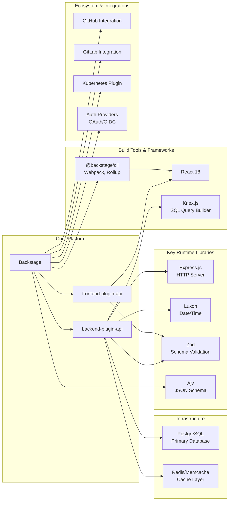

# Backstage

> An open framework for building developer portals powered by a centralized software catalog

| Metadata | |
|---|---|
| Repository | https://github.com/backstage/backstage |
| License | Apache-2.0 |
| Primary Language | TypeScript |
| Category | Developer Tool |
| Analyzed Release | `v1.48.0-next.1` (2026-02-03) |
| Stars (approx.) | 32,500+ |
| Generated by | Claude Sonnet 4.5 (Anthropic) |
| Generated on | 2026-02-08 |

## Overview

Backstage is an open source platform for building developer portals created by Spotify and now a CNCF Incubation project. It unifies all infrastructure tooling, services, and documentation to create a streamlined development environment from end to end.

Problems it solves:

- Managing ownership and metadata for thousands of microservices, libraries, data pipelines, and infrastructure components scattered across an organization
- Creating a unified developer experience by integrating disparate tools like CI/CD, monitoring, documentation, and cloud resources into a single interface
- Standardizing project creation and best practices through software templates while maintaining team autonomy
- Discovering and understanding software components across the entire engineering organization

Positioning:

Backstage is positioned as the leading open-source developer portal framework, adopted by organizations like Spotify, American Airlines, Netflix, and DAZN. It competes with proprietary solutions like Port and OpsLevel but stands out with its extensible plugin architecture and strong CNCF backing. Unlike simple catalog tools, Backstage provides a full platform for building customized internal developer portals.

## Architecture Overview

Backstage employs a three-tier architecture with a React frontend (extensions and plugins), Node.js backend (plugins and services), and databases. The system is designed around a plugin-first approach where every feature is implemented as an isolated plugin communicating through well-defined APIs.

## Core Components

### Frontend App Instance (packages/app)

- Responsibility: Entry point that wires together frontend plugins and extensions into a deployable application
- Key files: packages/app/src/App.tsx, packages/app/src/index.tsx
- Design patterns: Dependency Injection, Extension Tree Pattern

The App Instance serves as the root of the frontend application. It does not implement features directly but acts as a composition layer that combines plugins, extensions, and configuration into a working application. The app uses the extension tree pattern where each extension attaches to a parent and can have children, forming a single tree structure from which the entire application is instantiated.

### Extensions System (packages/frontend-plugin-api)

- Responsibility: Provides building blocks for constructing both visual and non-visual application structure
- Key files: packages/frontend-plugin-api/src/index.ts, packages/frontend-plugin-api/src/alpha.ts
- Design patterns: Composite Pattern, Extension Point Pattern

Extensions are the fundamental building blocks of the frontend architecture. They can be provided by the app itself or by plugins. Each extension shares data with its parent and can have multiple children. The app wires all extensions together into an app extension tree, which is then rendered. Extension overrides allow replacing individual extensions with higher priority versions, enabling customization of plugin behavior.

### Frontend Plugins (plugins/catalog, plugins/techdocs, plugins/scaffolder)

- Responsibility: Implement specific features and provide extensions that add functionality to the application
- Key files: plugins/catalog/src/plugin.ts, plugins/techdocs/src/plugin.ts
- Design patterns: Plugin Pattern, Route-based Code Splitting

Frontend plugins are isolated feature implementations that export extensions, utility APIs, and routes. Plugins communicate through shared utility APIs and by composing extensions. The catalog plugin (plugins/catalog) provides UI for browsing software components. The TechDocs plugin (plugins/techdocs) renders documentation using a "docs like code" approach. The scaffolder plugin (plugins/scaffolder) provides software templates for project creation. Each plugin is rendered on its own URL path and loads independently.

### Backend Instance (packages/backend-app-api)

- Responsibility: Backend deployment unit that initializes and runs backend plugins with their service dependencies
- Key files: packages/backend-app-api/src/wiring/BackstageBackend.ts, packages/backend-app-api/src/wiring/BackendInitializer.ts
- Design patterns: Service Locator, Initialization Pipeline

The BackstageBackend class manages the backend lifecycle through the BackendInitializer. It accepts BackendFeature instances (plugins, modules, services) via the add() method and starts them through a coordinated initialization process. Multiple backend instances can be deployed independently to scale and isolate features. The start() method returns a BackendStartupResult containing initialization status.

### Backend Plugins (plugins/catalog-backend, plugins/scaffolder-backend)

- Responsibility: Implement server-side features operating as independent microservices
- Key files: plugins/catalog-backend/src/service/, plugins/scaffolder-backend/src/scaffolder/
- Design patterns: Microservice Pattern, Repository Pattern

Backend plugins are completely isolated from each other and communicate only over the wire through HTTP APIs. Each plugin receives its own database connection and service instances. The catalog-backend manages entity ingestion, processing, and storage with components like AuthorizedRefreshService and processors in plugins/catalog-backend/src/processing/. The scaffolder-backend handles template execution and action orchestration. Plugins expose extension points for customization.

### Core Services (packages/backend-plugin-api)

- Responsibility: Provide reusable utilities for plugin development including logging, database access, and configuration
- Key files: packages/backend-plugin-api/src/index.ts, packages/backend-plugin-api/src/alpha/index.ts
- Design patterns: Service Provider Pattern, Dependency Injection

Core services are injected into plugins through the backend plugin API. They include database service (Knex-based with per-plugin isolation), logger service, config service, HTTP router service, and scheduler service. Services are customization points allowing installations to override implementations. The service registry manages service instances and ensures proper lifecycle management.

### Catalog Model (packages/catalog-model)

- Responsibility: Define types and validators for software catalog entities with JSON schema validation
- Key files: packages/catalog-model/src/index.ts, packages/catalog-model/examples/
- Design patterns: Domain Model, Validation Pattern

The catalog model defines the entity schema including Component, API, Resource, System, Domain, Location, User, and Group entity types. It uses Ajv for JSON schema validation ensuring entity consistency. The model is isomorphic (shared between frontend and backend) and provides type-safe entity manipulation. Entity relationships are modeled through spec and metadata fields with standardized relation types.

### Backend Modules and Extension Points (packages/backend-plugin-api)

- Responsibility: Enable plugin extensibility by allowing modules to register custom providers and actions
- Key files: packages/backend-plugin-api/src/alpha/index.ts
- Design patterns: Extension Point Pattern, Provider Pattern

Extension Points define customization interfaces exposed by plugins. Modules use these extension points to add features like catalog entity providers or scaffolder actions. Each module extends a single plugin and must be deployed together with it. Modules share services with their parent plugin but communicate only through registered extension points. This pattern allows evolving plugin APIs independently while maintaining backward compatibility.

## Data Flow

### Entity Registration and Ingestion

### Software Template Scaffolding

### Plugin Extension Loading

## Key Design Decisions

### 1. Plugin Isolation with Over-the-Wire Communication

- Choice: Backend plugins operate as independent microservices with no direct code-level communication
- Rationale: Enables independent deployment, scaling, and evolution of plugins. Prevents tight coupling between features and allows teams to own plugins independently. Supports polyglot architectures where plugins could theoretically be written in different languages.
- Trade-offs: Increases network overhead compared to in-process communication. Requires careful API design and versioning. Makes distributed tracing and debugging more complex. Forces explicit API contracts instead of shared code.

### 2. Per-Plugin Database Isolation via Knex

- Choice: Each backend plugin receives a logically separated database connection through Knex with plugin-specific schemas
- Rationale: Provides strong isolation allowing plugins to manage their own schema migrations independently. Prevents coupling through shared database tables. Enables plugins to evolve their data models without coordination. Supports different database engines through Knex abstraction.
- Trade-offs: Makes cross-plugin database queries impossible, requiring API-based data access. Increases database connection overhead. Can lead to data duplication when multiple plugins need similar information. Migration coordination across plugins requires careful planning.

### 3. Extension Tree Architecture for Frontend

- Choice: Frontend uses a tree structure where extensions attach to parents and share data hierarchically
- Rationale: Provides a declarative way to compose plugins without imperative wiring code. Allows plugins to extend other plugins through extension points. Supports lazy loading and code splitting naturally. Enables app developers to override any extension without modifying plugin code.
- Trade-offs: Adds conceptual overhead compared to simpler component composition. Requires understanding of tree structure and parent-child relationships. Makes debugging harder when extensions fail to attach. Performance implications if tree becomes very deep.

### 4. Configuration as Code with YAML + Environment Variables

- Choice: Configuration defined in app-config.yaml with environment variable interpolation and hierarchical merging
- Rationale: Allows checking configuration into version control while keeping secrets in environment variables. Supports different configurations per environment (dev, staging, production). Uses standard YAML format familiar to developers. Enables schema validation through TypeScript types.
- Trade-offs: Configuration loading happens at startup, requiring restarts for changes. Complex override semantics between multiple config files can be confusing. Limited dynamic configuration without external config services. Schema validation is optional and runtime errors can occur.

### 5. Isomorphic Catalog Model Package

- Choice: Catalog entity types and validation defined in a shared packages/catalog-model used by both frontend and backend
- Rationale: Ensures type safety across the entire stack with TypeScript. Prevents drift between frontend and backend entity definitions. Allows frontend code to validate entities before sending to backend. Reduces code duplication and enables shared business logic.
- Trade-offs: Requires careful versioning to avoid breaking changes across frontend and backend. Package must remain lightweight to avoid bloating frontend bundle. Changes require coordinated releases of frontend and backend. Cannot use backend-only dependencies in the shared package.

## Dependencies

## Testing Strategy

Backstage employs a comprehensive multi-layer testing approach with strong emphasis on isolated unit tests, integration tests for plugin interactions, and end-to-end tests for critical user flows.

Unit tests: Jest is used across all packages with NODE_OPTIONS='--no-node-snapshot --experimental-vm-modules'. Each plugin and package contains co-located test files. The backend-test-utils and frontend-test-utils packages provide test helpers including mock services and component rendering utilities. Coverage targets are tracked with Codecov integration.

Integration tests: Backend plugins use the backend-test-utils package which provides a test backend instance with real database connections (SQLite in-memory). Frontend integration tests use Testing Library and React Testing Library for component testing. The e2e-test package contains cross-cutting integration tests verifying plugin interactions.

CI/CD: GitHub Actions workflows run linting (ESLint), type checking (TypeScript), unit tests, and Playwright e2e tests on every pull request. The monorepo uses Changesets for versioning and automated releases. Storybook is built for visual regression testing with Chromatic. API reports are generated via backstage-repo-tools to catch breaking changes. Knip reports identify unused dependencies and exports.

## Key Takeaways

1. Plugin-First Extensibility: Backstage's architecture treats plugins as first-class citizens with strong isolation boundaries. Backend plugins communicate only over-the-wire, and frontend plugins compose through extensions and utility APIs. This design enables teams to independently develop, deploy, and maintain features without central coordination. Other platforms can adopt this by establishing clear plugin contracts and avoiding shared mutable state.

2. Hierarchical Configuration with Schema Validation: The configuration system combines YAML files, environment variables, and TypeScript schema validation to provide type-safe, version-controlled configuration. The hierarchical merging of app-config.yaml, app-config.local.yaml, and environment-specific configs allows sharing common configuration while overriding for specific environments. This pattern balances developer experience with operational flexibility.

3. Isomorphic Type Systems: Sharing type definitions and validation logic between frontend and backend through packages like catalog-model ensures consistency across the stack. Using the same entity schemas on both sides prevents drift and enables client-side validation. However, this requires careful package design to avoid including backend-only dependencies in frontend bundles. Platforms with shared domain models benefit from this approach.

## References

- [Backstage Official Documentation](https://backstage.io/docs)
- [Architecture Overview](https://backstage.io/docs/overview/architecture-overview/)
- [Backend System Architecture](https://backstage.io/docs/backend-system/architecture/index/)
- [Frontend System Architecture](https://backstage.io/docs/frontend-system/architecture/index/)
- [Everything is a Plugin: How the Backstage Architecture Helps Platform Teams](https://www.infoq.com/presentations/backstage-plugin/)
- [Backstage GitHub Repository](https://github.com/backstage/backstage)
- [CNCF Backstage Project](https://www.cncf.io/projects/backstage/)
