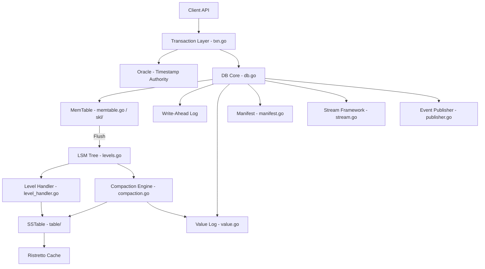
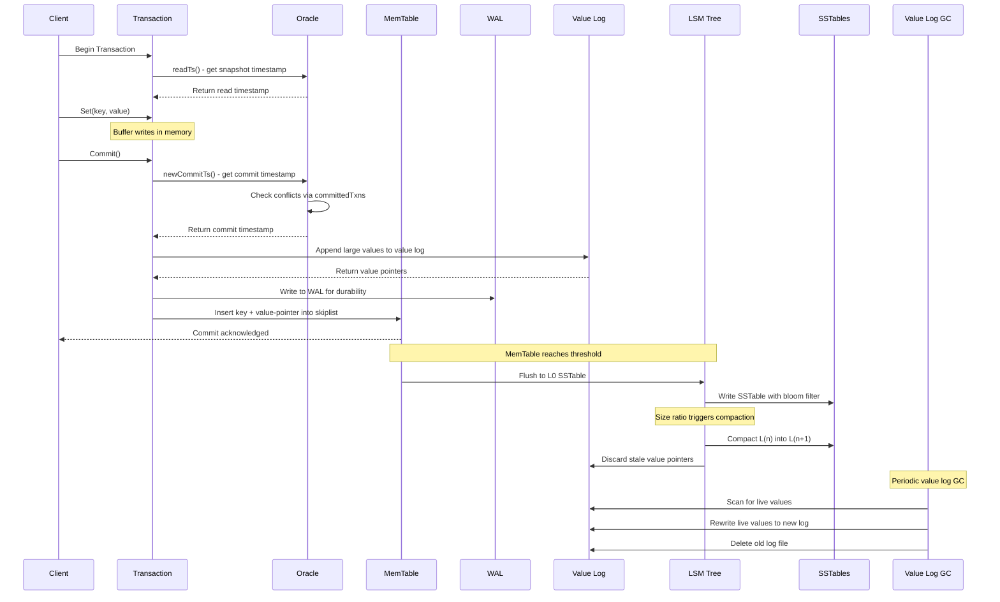
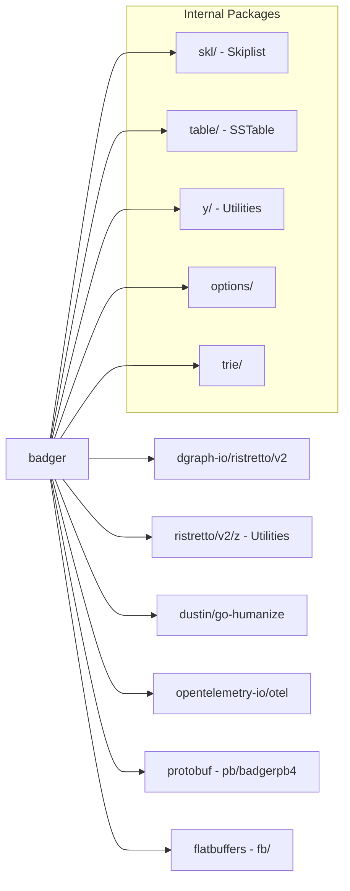

# Badger Architecture Report

- Generated by: Claude Opus 4.6 (Anthropic)
- Generated on: 2026-02-08
- Category: Database
- Repository: [dgraph-io/badger](https://github.com/dgraph-io/badger)

---

## Overview

Badger is a high-performance, embeddable key-value store written in pure Go, originally developed by Dgraph Labs (now Hypermode/Istari Digital) as the storage engine for Dgraph, a distributed graph database. Its architecture is based on the WiscKey paper, which separates keys from values to reduce write amplification on SSD-based storage systems.

| Attribute         | Value                                      |
|-------------------|--------------------------------------------|
| Language          | Go                                         |
| License           | Apache License 2.0                         |
| Stars             | 15,458                                     |
| Latest Release    | v4.9.1 (2026-02-04)                        |
| Description       | Fast key-value DB in Go                    |

Badger supports concurrent ACID transactions with serializable snapshot isolation (SSI), making it suitable for applications requiring strong consistency guarantees. It has been battle-tested serving data sets worth hundreds of terabytes in production environments.

---

## Architecture Overview

---

## Core Components

### 1. Database Core and Transaction Layer (db.go, txn.go)

The `DB` struct in `db.go` is the central coordinator. Key fields include:
- `mt *memTable`: The active (currently-written) in-memory table
- `imm []*memTable`: Immutable memtables queued for flushing
- `opt Options`: Database configuration
- `manifest *manifestFile`: Tracks SSTable file assignments across levels
- `closers closers`: Lifecycle managers for background goroutines (`updateSize`, `compactors`, `memtable`, `writes`, `valueGC`, `pub`, `cacheHealth`)

The transaction layer in `txn.go` implements serializable snapshot isolation via the `oracle` struct:
- `nextTxnTs uint64`: Monotonically increasing transaction timestamp
- `readMark *y.WaterMark`: Tracks the minimum timestamp of active read transactions
- `txnMark *y.WaterMark`: Tracks committed transaction timestamps
- `committedTxns []committedTxn`: Buffer of committed transactions for conflict detection
- `detectConflicts bool`: Toggleable conflict detection

Each `committedTxn` stores a `conflictKeys map[uint64]struct{}` -- fingerprints of written keys used for SSI conflict detection.

### 2. LSM Tree and Levels (levels.go, level_handler.go)

The `levelsController` struct manages the multi-level LSM:
- `levels []*levelHandler`: Array of level handlers, sized by `opt.MaxLevels`
- `cstatus compactStatus`: Tracks in-progress compaction state per level
- `nextFileID atomic.Uint64`: Monotonic SSTable file ID generator
- `l0stallsMs atomic.Int64`: Tracks L0 stall duration for diagnostics

The `newLevelsController` function enforces `NumLevelZeroTablesStall > NumLevelZeroTables` to ensure the stall threshold exceeds the compaction trigger. The `revertToManifest` function verifies file integrity on startup by cross-referencing the manifest with actual files on disk, removing orphaned tables.

### 3. Value Log (value.go)

The value log is the core of Badger's WiscKey design. Key aspects:
- `maxVlogFileSize uint32 = math.MaxUint32`: Maximum vlog file size (~4GB per file)
- Bit flags control entry interpretation:
  - `bitDelete (1<<0)`: Key deleted
  - `bitValuePointer (1<<1)`: Value stored in vlog, not inline in LSM
  - `bitDiscardEarlierVersions (1<<2)`: Older versions can be garbage collected
  - `bitMergeEntry (1<<3)`: Protected from compaction (merge operator)
  - `bitTxn (1<<6)`, `bitFinTxn (1<<7)`: Transaction boundary markers
- `vlogHeaderSize = 20`: Each vlog has a 20-byte header (8-byte keyID + 12-byte baseIV for encryption)
- Writes are append-only, minimizing random I/O on SSDs
- The `hashReader` struct wraps reads with CRC32 (Castagnoli) checksumming for data integrity

### 4. SSTable Layer (table/)

The SSTable package handles on-disk sorted string table format:
- `table/builder.go`: Constructs new SSTable files with block-level compression
- `table/iterator.go`: Forward and reverse iteration over SSTable contents
- `table/merge_iterator.go`: Merges iterators from multiple SSTables
- `table/table.go`: SSTable reader with mmap support and bloom filter integration
- FlatBuffers-based index format (`fb/BlockOffset.go`, `fb/TableIndex.go`) for zero-copy deserialization

### 5. Supporting Infrastructure

- `skl/` (Skiplist): Arena-based concurrent skiplist for memtable implementation (`skl/arena.go`, `skl/skl.go`)
- `stream.go` and `stream_writer.go`: High-throughput streaming framework for bulk data operations, backup, and restore
- `publisher.go`: Pub/sub event system for watching key mutations
- `trie/trie.go`: Trie data structure for efficient prefix operations
- `y/` (Utilities): Core utilities including `watermark.go` for tracking timestamps, `bloom.go` for bloom filters, `checksum.go` for CRC32 validation, and `zstd.go` for Zstandard compression

---

## Data Flow

---

## Key Design Decisions

### 1. WiscKey Value Separation

The fundamental design decision is separating keys from values based on the WiscKey paper. Keys and small values are stored in the LSM tree (SSTables), while large values are appended to a separate value log. This dramatically reduces write amplification because compactions only rewrite the small keys and value pointers, not the large values. The `bitValuePointer` flag in each entry indicates whether the value is inline or in the vlog.

### 2. Serializable Snapshot Isolation via Oracle

The `oracle` struct implements SSI without requiring a separate lock manager. Each transaction reads at a fixed `readTs` and commits at a monotonically increasing `commitTs`. Conflict detection uses key fingerprints (`conflictKeys map[uint64]struct{}`) stored in the `committedTxns` buffer. A new transaction only aborts if its read set overlaps with writes committed after its `readTs`. The `WaterMark` mechanism tracks minimum active read timestamps for safe garbage collection.

### 3. Arena-Based Skiplist for MemTable

Like Pebble, Badger uses an arena-based skiplist (`skl/`) for the memtable. The arena pre-allocates a contiguous block of memory, and nodes reference each other via uint32 offsets rather than Go pointers. This eliminates GC scanning overhead for the memtable, which is one of the most allocation-intensive data structures in an LSM-based store.

### 4. FlatBuffers for SSTable Index

Rather than using Protocol Buffers or custom binary formats, Badger uses Google FlatBuffers (`fb/BlockOffset.go`, `fb/TableIndex.go`) for the SSTable index format. FlatBuffers enable zero-copy deserialization -- the index can be read directly from the mmap'd file without parsing overhead. This is particularly beneficial for large SSTables with many blocks.

### 5. Append-Only Value Log with Background GC

The value log is purely append-only, which maximizes sequential write throughput on SSDs. Background garbage collection (`valueGC` closer) reclaims space by scanning for live values and rewriting them to a new log file. The `discard` statistics (tracked in `discard.go`) identify which log files have the highest proportion of stale data, guiding the GC to maximize space reclamation per rewrite.

---

## Dependencies

Notable external dependencies:
- `dgraph-io/ristretto/v2`: High-performance concurrent cache with TinyLFU admission policy, used for block caching and key caching
- `ristretto/v2/z`: Utility package providing `Closer` (goroutine lifecycle management), `Buffer`, and memory-mapped file helpers
- `opentelemetry-io/otel`: Distributed tracing integration for observability
- `dustin/go-humanize`: Human-readable byte size formatting for logging
- `google/flatbuffers`: Zero-copy serialization for SSTable index format

---

## Testing Strategy

Badger employs several testing approaches:

- Unit Tests: Comprehensive `_test.go` files alongside each source file, covering normal operations, edge cases, and error conditions
- Integration Tests: The `integration/testgc/` directory contains a dedicated test binary for validating value log garbage collection under realistic workloads
- CLI-Based Testing: The `badger/cmd/` package provides benchmark commands:
  - `bench.go`: General benchmarking harness
  - `bank.go`: Bank transfer simulation for transaction correctness
  - `read_bench.go` and `write_bench.go`: Focused I/O benchmarks
  - `pick_table_bench.go`: SSTable selection benchmarking
- Backup/Restore Testing: `backup.go` and `badger/cmd/restore.go` test the streaming backup and restore pipeline
- Stress Testing: The `stream.go` framework is used for high-throughput data ingestion testing
- OpenTelemetry Tracing: Instrumented with spans and attributes for runtime observability during testing and production

---

## Key Takeaways

1. Badger validates the WiscKey approach for Go-based storage engines: by separating keys from values, it achieves significantly lower write amplification than traditional LSM stores like LevelDB or RocksDB, making it particularly well-suited for SSD-based deployments where random reads are cheap but write amplification degrades drive lifetime.

2. The oracle-based SSI transaction model provides ACID guarantees without heavy locking. The use of key fingerprints for conflict detection is memory-efficient and scales well with transaction throughput, though it introduces a small probability of false positives in conflict detection.

3. The Ristretto cache integration brings state-of-the-art caching with TinyLFU admission policy, providing significantly better hit ratios than simple LRU caches. This is critical for read performance in the WiscKey design where value reads require an additional I/O to the value log.

4. Badger's streaming framework (`stream.go`, `stream_writer.go`) enables efficient bulk operations (backup, restore, data migration) by bypassing the transaction layer and writing directly to SSTables. This is essential for large-scale data management in production environments.

5. The project's evolution from Dgraph Labs to Istari Digital (now Hypermode) demonstrates the sustainability challenges of OSS database projects, while the v4 release line continues to receive active maintenance and improvements including OpenTelemetry integration and improved garbage collection.

---

## References

- [GitHub Repository](https://github.com/dgraph-io/badger)
- [Go Package Documentation](https://pkg.go.dev/github.com/dgraph-io/badger/v4)
- [BadgerDB Overview - Docastra Docs](https://docs.docastra.com/a40c4ad8de74a236/docs/project-overview/)
- [DeepWiki - BadgerDB](https://deepwiki.com/hypermodeinc/badger/1-badgerdb-overview)
- [WiscKey Paper - Separating Keys from Values in SSD-conscious Storage](https://www.usenix.org/conference/fast16/technical-sessions/presentation/lu)
- [Badger README on GitHub](https://github.com/dgraph-io/badger/blob/main/README.md)
