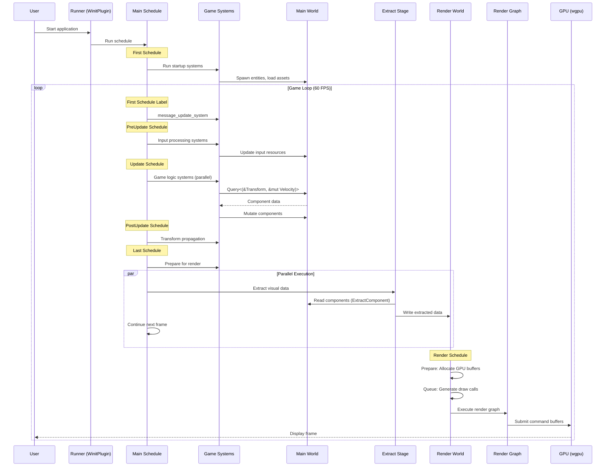
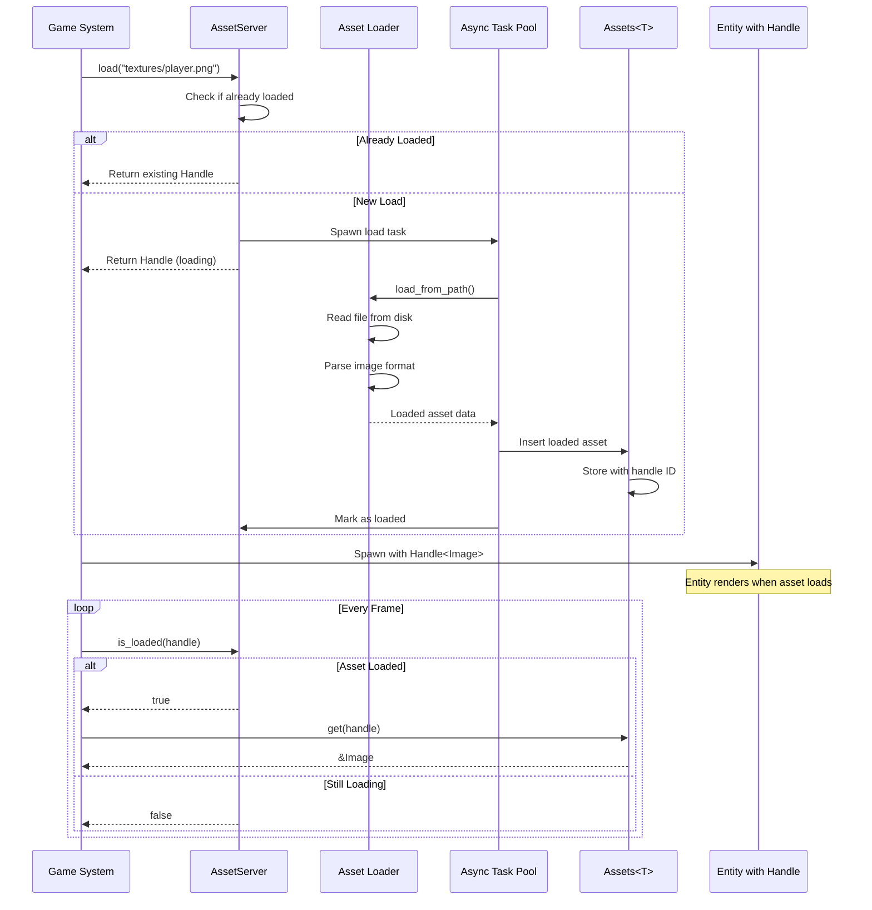
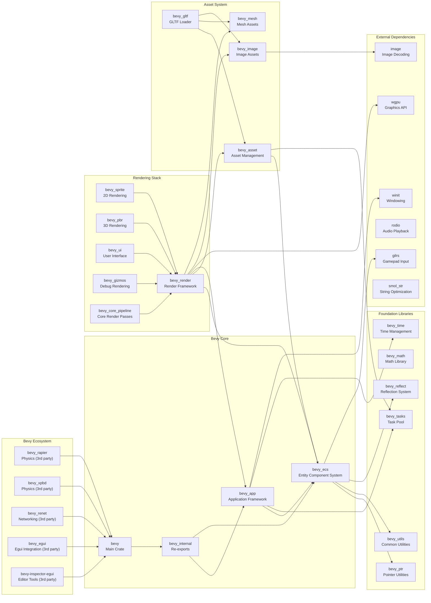

# Bevy

> A refreshingly simple data-driven game engine built in Rust

| Metadata | |
|---|---|
| Repository | https://github.com/bevyengine/bevy |
| License | MIT OR Apache-2.0 |
| Primary Language | Rust |
| Analyzed Release | `v0.18.0` (2026-01-13) |
| Stars (approx.) | 44,535+ |
| Generated by | Claude Sonnet 4.5 (Anthropic) |
| Generated on | 2026-02-08 |

## Overview

Bevy is a refreshingly simple data-driven game engine built in Rust that embraces the Entity Component System (ECS) paradigm as its foundational architecture. Unlike traditional object-oriented game engines, Bevy organizes all game logic around data and behavior separation, enabling massive parallelism and cache-friendly memory access patterns.

Problems it solves:

- Eliminating the complexity of deeply nested inheritance hierarchies common in traditional game engines by using composition over inheritance through ECS
- Enabling automatic parallelization of game logic without manual thread management through its systems scheduler that analyzes data dependencies
- Providing a modular architecture where features can be added or removed through plugins, avoiding monolithic engine designs
- Reducing compile times through a modular crate structure and optional features (fast compiles mode with dynamic linking)
- Bridging the gap between performance and ergonomics by using Rust's type system to make ECS usage feel natural without macros or complex traits

Positioning:

Bevy positions itself as a modern alternative to Unity and Godot for Rust developers, emphasizing simplicity and data-oriented design. It competes with other Rust game engines like Amethyst (now deprecated) and Fyrox, but distinguishes itself through its focus on ergonomics and a batteries-included approach. Bevy is still in active development (pre-1.0) with breaking changes every 3 months, targeting developers willing to work with an evolving ecosystem in exchange for cutting-edge features and performance.

## Architecture Overview

Bevy employs a layered plugin-based architecture built on a custom ECS implementation. The engine is divided into 57+ specialized crates that can be composed together through the plugin system. At its core is bevy_ecs, which manages all game state through Worlds containing Entities with Components, processed by Systems scheduled in parallel. The App serves as the central orchestrator, collecting plugins and managing SubApps for different execution contexts (main game loop, rendering extraction, render execution).

```mermaid
graph TB
    subgraph Application["Application Layer (bevy_app)"]
        App["App<br/>Main Orchestrator"]
        MainSchedule["Main Schedule<br/>First→PreUpdate→Update→PostUpdate→Last"]
        Plugins["Plugin System<br/>DefaultPlugins/MinimalPlugins"]
        Runner["Runner<br/>WinitPlugin/ScheduleRunnerPlugin"]
    end

    subgraph ECS["ECS Core (bevy_ecs)"]
        World["World<br/>Central Data Store"]
        Entities["Entities<br/>Unique IDs"]
        Components["Components<br/>Data Storage"]
        Systems["Systems<br/>Logic Execution"]
        Schedule["Schedule<br/>System Ordering & Parallelization"]
        Query["Query<br/>Component Access"]
        Resources["Resources<br/>Global Singletons"]
        Observers["Observers<br/>Reactive Events"]
    end

    subgraph Render["Render Pipeline (bevy_render)"]
        ExtractStage["Extract Stage<br/>Copy to Render World"]
        RenderWorld["Render World<br/>Separate ECS for Rendering"]
        RenderGraph["Render Graph<br/>GPU Command Scheduling"]
        Wgpu["wgpu Integration<br/>Cross-platform Graphics"]
    end

    subgraph Assets["Asset Management (bevy_asset)"]
        AssetServer["AssetServer<br/>Async Loading"]
        AssetCollection["Assets&lt;T&gt;<br/>Typed Collections"]
        Handles["Handle&lt;T&gt;<br/>Reference Counting"]
        Loaders["Asset Loaders<br/>Format Parsers"]
    end

    subgraph Features["Core Features"]
        Input["Input<br/>bevy_input/bevy_gilrs"]
        Window["Window<br/>bevy_window/bevy_winit"]
        Audio["Audio<br/>bevy_audio"]
        Animation["Animation<br/>bevy_animation"]
        UI["UI<br/>bevy_ui"]
        Scene["Scene<br/>bevy_scene"]
    end

    subgraph Math["Math & Transform"]
        Math["Math<br/>bevy_math"]
        Transform["Transform<br/>bevy_transform"]
        Time["Time<br/>bevy_time"]
    end

    App --> MainSchedule
    App --> Plugins
    App --> Runner
    Plugins --> ECS
    Plugins --> Render
    Plugins --> Assets
    Plugins --> Features

    MainSchedule --> Schedule
    Schedule --> Systems
    Systems --> Query
    Query --> World
    World --> Entities
    World --> Components
    World --> Resources
    World --> Observers

    Systems --> ExtractStage
    ExtractStage --> RenderWorld
    RenderWorld --> RenderGraph
    RenderGraph --> Wgpu

    Systems --> AssetServer
    AssetServer --> AssetCollection
    AssetCollection --> Handles
    AssetServer --> Loaders

    Features --> Math
    Features --> Transform
    Systems --> Time
```

## Core Components

### ECS Core - World and Entities (`crates/bevy_ecs/src/world/mod.rs`)

- Responsibility: Central data storage for all game state, entity lifecycle management, and direct data access APIs
- Key files: `crates/bevy_ecs/src/world/mod.rs` (4,487 lines), `crates/bevy_ecs/src/entity/mod.rs`, `crates/bevy_ecs/src/archetype/mod.rs`
- Design patterns: Archetypal ECS storage, sparse sets for fast component addition/removal, table storage for cache-friendly iteration

The World struct is the central database of the ECS, storing all entities, components, and resources. Entities are lightweight identifiers (consisting of an index and generation for safety against use-after-free) that serve as keys into component storage. Bevy uses an archetypal storage model where entities with the same component types are grouped into Archetypes for efficient iteration. Components can be stored in tables (default, optimized for iteration) or sparse sets (optimized for insertion/removal). The World provides both low-level APIs (spawn, despawn, insert, remove) and high-level query interfaces.

The World also manages Observers, a reactive system that executes immediately when events are triggered, enabling hook-like behavior for lifecycle events (component addition, removal, entity despawn).

### ECS Core - Systems and Schedule (`crates/bevy_ecs/src/system/mod.rs`, `crates/bevy_ecs/src/schedule/mod.rs`)

- Responsibility: Executing game logic functions with automatic dependency injection and parallel execution scheduling
- Key files: `crates/bevy_ecs/src/system/mod.rs`, `crates/bevy_ecs/src/schedule/schedule.rs` (2,638 lines)
- Design patterns: Dependency injection via Rust type system, directed acyclic graph (DAG) for scheduling, automatic parallelization

Systems are normal Rust functions that become systems through the IntoSystem trait, which Bevy implements automatically for functions whose parameters implement SystemParam. Common system parameters include Query (for accessing entity components), Res/ResMut (for resources), Commands (for deferred operations), and Local (for per-system state). The Rust type system enables Bevy to analyze system signatures at compile time to determine what data each system accesses.

The Schedule organizes systems into a directed graph based on explicit ordering constraints (.before(), .after(), .chain()) and implicit data dependencies. The executor analyzes which systems can run in parallel (those accessing non-overlapping data) and uses the bevy_tasks thread pool to execute them concurrently. Systems are grouped into SystemSets (like Update, PreUpdate, PostUpdate) that run in defined orders within the Main schedule.

Bevy detects system order ambiguities (incompatible systems without explicit ordering) and can warn about them, helping developers avoid non-deterministic behavior.

### ECS Core - Queries (`crates/bevy_ecs/src/query/mod.rs`)

- Responsibility: Type-safe, efficient access to entities and their components with filtering capabilities
- Key files: `crates/bevy_ecs/src/query/mod.rs` (927 lines), `crates/bevy_ecs/src/query/state.rs`, `crates/bevy_ecs/src/query/fetch.rs`
- Design patterns: Iterator pattern, builder pattern for QueryBuilder, compile-time query validation

Query<(QueryData, QueryFilter)> provides type-safe access to component data with automatic iteration over matching entities. QueryData specifies what data to fetch (like &Transform, &mut Velocity), while QueryFilter constrains which entities match (With<Player>, Changed<Health>, Without<Dead>). Queries are compiled into optimized iteration code that traverses archetypes efficiently.

Queries support change detection through Changed and Added filters, leveraging per-component tick counters to track when data was last modified. This enables reactive systems that only process entities when relevant data changes, crucial for performance in large worlds.

QueryState allows pre-building and caching query state for repeated use, and QueryBuilder enables dynamic query construction at runtime for tools and editors.

### Application Layer (`crates/bevy_app/src/app.rs`)

- Responsibility: Application lifecycle management, plugin composition, and schedule orchestration
- Key files: `crates/bevy_app/src/app.rs` (70KB), `crates/bevy_app/src/plugin.rs`, `crates/bevy_app/src/main_schedule.rs`
- Design patterns: Builder pattern, plugin architecture, observer pattern for lifecycle events

The App struct is the primary API for building Bevy applications. It manages a main SubApp (containing the game world and schedules) and additional SubApps for specialized execution contexts (like RenderApp for rendering). The builder API allows chaining operations: App::new().add_plugins().add_systems().run().

Plugins are the fundamental unit of modularity, implementing the Plugin trait to configure the app. DefaultPlugins includes all standard features (rendering, audio, input, etc.), while MinimalPlugins provides only core functionality. Users can build custom plugins to encapsulate related functionality and systems.

The Main schedule defines the standard game loop structure: First → PreUpdate → Update → PostUpdate → Last, with FixedUpdate running at a fixed timestep. The runner function (set by plugins like WinitPlugin or ScheduleRunnerPlugin) controls the outer loop, repeatedly calling the schedule.

### Rendering Pipeline (`crates/bevy_render/src/lib.rs`)

- Responsibility: Extracting visual data from the main world and executing GPU commands in a separate rendering thread
- Key files: `crates/bevy_render/src/lib.rs`, `crates/bevy_render/src/render_graph/`, `crates/bevy_render/src/renderer/`
- Design patterns: Extract-Prepare-Queue-Render pipeline, separate render world, render graph for GPU scheduling

Bevy uses a pipelined rendering architecture to enable parallel game logic and rendering. The RenderApp (a separate SubApp) runs in parallel with the main app using a double-buffered approach. The extract stage copies only the data needed for rendering from the main World to the RenderWorld, minimizing synchronization overhead.

The rendering pipeline follows these stages:
1. Extract: Copy relevant components and resources to RenderWorld using ExtractComponent
2. Prepare: Allocate GPU resources (buffers, textures) based on extracted data
3. Queue: Generate render phase items (draw calls) and sort them
4. Render: Execute the render graph to issue GPU commands via wgpu

The render graph is a directed acyclic graph of render nodes that specify GPU operations (render passes, compute dispatches). Nodes declare their inputs/outputs, allowing Bevy to automatically schedule GPU work and insert barriers.

wgpu provides the cross-platform graphics abstraction, supporting Vulkan, Metal, DirectX 12, and WebGPU backends.

### Asset System (`crates/bevy_asset/src/lib.rs`)

- Responsibility: Asynchronous loading, hot reloading, and lifecycle management of game assets with reference counting
- Key files: `crates/bevy_asset/src/server/mod.rs`, `crates/bevy_asset/src/assets.rs`, `crates/bevy_asset/src/loader.rs`
- Design patterns: Handle-based resource management, async loading with task pools, asset loaders as trait implementations

The AssetServer manages asynchronous asset loading using bevy_tasks for background I/O. Assets are loaded via AssetServer::load(path), which returns a Handle<T> (a reference-counted smart pointer). Handles allow sharing assets between entities without duplication and enable lazy loading (entities can reference assets before they're loaded).

Assets<T> is a resource that stores loaded assets indexed by handle. Multiple handles to the same asset share the underlying data. When all handles are dropped, the asset is automatically removed from memory (reference counting-based garbage collection).

Asset loaders implement the AssetLoader trait to parse specific file formats (images, meshes, sounds, etc.). The system is extensible, allowing custom asset types and loaders. Hot reloading (enabled with file_watcher feature) detects file changes and automatically reloads assets, invaluable for rapid iteration during development.

The asset system also supports asset processors for build-time optimization (texture compression, mesh simplification) and asset dependencies (assets referencing other assets).

### Plugin System (`crates/bevy_app/src/plugin.rs`)

- Responsibility: Modular extension mechanism for adding features and configuring the app
- Key files: `crates/bevy_app/src/plugin.rs` (194 lines), `crates/bevy_app/src/plugin_group.rs`
- Design patterns: Plugin architecture, builder pattern, dependency injection

Plugins implement a simple trait with a build(app: &mut App) method that configures the app (adding systems, resources, events, etc.). Plugins can declare dependencies on other plugins and configure execution order. PluginGroup bundles related plugins together (like DefaultPlugins).

This design enables:
- Feature toggles via cargo features (disable rendering, audio, etc. for smaller binaries)
- Third-party ecosystem extensions (physics engines, networking, ECS debuggers)
- Clean separation of concerns (each feature is self-contained)
- Testability (plugins can be tested in isolation)

Plugins are applied in dependency order, with duplicate prevention. Some plugins like RenderPlugin create additional SubApps for specialized execution.

## Data Flow

### Typical Game Loop Execution



### Asset Loading Flow



## Key Design Decisions

### 1. Archetypal ECS with Table Storage

- Choice: Using archetypal storage where entities are grouped by component composition, with table storage as default
- Rationale: Archetypal storage provides excellent cache locality for iteration (components of same type are contiguous), crucial for performance in game loops that iterate millions of components. Tables group entities with identical component sets, making queries extremely fast. This matches common game patterns where many entities share the same components (e.g., thousands of enemies with Position, Velocity, Health)
- Trade-offs: Changing an entity's archetype (adding/removing components) requires moving the entity between tables, which is more expensive than sparse set ECS implementations like EnTT. Bevy mitigates this with Commands that batch structural changes and optional sparse set storage for frequently-added/removed components. The archetype model also uses more memory for metadata when there are many unique component combinations

### 2. Systems as Plain Functions with Type-Based Dependency Injection

- Choice: Systems are normal Rust functions, with parameters implementing SystemParam for automatic data access
- Rationale: Eliminates the need for complex trait implementations, macros, or builder patterns that plague other Rust ECS libraries. The compiler automatically generates code to fetch system parameters based on their types. This makes Bevy feel natural to Rust developers - functions like fn my_system(query: Query<&Transform>, time: Res<Time>) just work
- Trade-offs: Heavy reliance on Rust's type system increases compile times (trait monomorphization). Systems cannot be stored in collections or passed as trait objects without boxing (addressed by SystemId for registered systems). Generic systems require careful trait bounds. The magic of automatic system implementation can be confusing for beginners learning how the parameter fetching works

### 3. Separate Render World with Extract-Prepare-Queue Pattern

- Choice: Maintaining a separate ECS world for rendering that runs in parallel with the main world
- Rationale: Game logic and rendering operate at different rates (fixed timestep vs. frame rate) and have different data requirements. The extract stage copies only render-relevant data, minimizing synchronization points. This enables pipelined rendering where frame N+1 logic runs while frame N renders, increasing throughput. The render world is single-threaded during extraction but parallelizes within rendering stages
- Trade-offs: Increases memory usage (two worlds) and complexity (data must be explicitly extracted). Requires careful design of what data to extract. Can cause confusion when debugging (changes to main world don't immediately affect rendering). Some systems like immediate-mode UI become more complex. The pipelined execution makes profiling and debugging frame timing more difficult

### 4. Handle-Based Asset Reference Counting

- Choice: Using strongly-typed Handle<T> with automatic reference counting for asset lifecycle management
- Rationale: Handles provide a type-safe, ergonomic way to reference assets without borrowing issues. Reference counting automatically unloads unused assets without manual tracking. Handles work with loading assets (entities can reference not-yet-loaded assets). The indirection enables asset hot reloading - updating the asset data doesn't require changing entity handles. Cloning handles is cheap (just incrementing a counter)
- Trade-offs: Reference counting prevents assets from unloading while any handle exists, which can cause memory leaks if handles are stored indefinitely (e.g., in resource "catalogs"). No automatic detection of circular dependencies. Weak handles aren't provided (though could be added). The indirection adds a lookup cost compared to direct references. Handle cloning must be explicit, which can be forgotten when passing to spawned entities

### 5. Plugin-Based Modular Architecture with Cargo Features

- Choice: Dividing the engine into 57+ crates that can be composed via plugins and cargo features
- Rationale: Enables users to exclude unused features (e.g., disable audio for server builds), reducing binary size and compile times. Allows the community to extend Bevy with third-party plugins (physics, networking). Each feature area is independently testable and developable. Clear separation of concerns - each crate has a focused purpose. Supports platform-specific implementations (e.g., bevy_winit only on desktop)
- Trade-offs: Increases workspace complexity and cognitive load (57+ crates to navigate). Cargo feature resolution can cause subtle bugs (features are unified across the dependency graph). Breaking changes in one crate can cascade through many others. The plugin system adds indirection (harder to trace initialization order). Feature flags create combinatorial explosion of test configurations. Compile times can still be high despite modularization due to monomorphization

## Dependencies



## Testing Strategy

Bevy employs a comprehensive multi-layered testing approach across its crates.

Unit tests: Each crate contains extensive unit tests in inline test modules and separate tests/ directories. Tests focus on core functionality like entity spawning, component insertion/removal, query iteration, and system execution. The bevy_ecs crate is particularly well-tested with tests for archetypes, scheduling, change detection, and observers. Many tests use the test harness pattern where small worlds are created, systems run, and results verified.

Integration tests: The examples/ directory serves as both documentation and integration tests. With 200+ examples covering ECS, rendering, audio, assets, and UI, these verify that features work together correctly. Examples are run in CI with rendering tests using headless mode and screenshot comparison. The examples also demonstrate best practices and serve as templates for users.

Compile fail tests: Several crates (bevy_ecs, bevy_reflect, bevy_derive) include compile_fail/ directories with tests that verify compiler errors are correct and helpful, ensuring that API misuse is caught at compile time with good error messages.

Benchmarks: The benches/ workspace contains performance benchmarks for critical paths like entity iteration, scheduling, and rendering. Benchmarks use criterion for statistical analysis and track performance across releases to prevent regressions.

CI/CD: GitHub Actions runs tests on Linux, Windows, and macOS across stable Rust. CI includes clippy lints, rustfmt formatting checks, and cargo deny for dependency auditing. WASM builds are tested separately. Documentation is built and published to docs.rs. The CI also runs example builds to catch platform-specific issues.

## Key Takeaways

1. Type-Driven API Design: Bevy demonstrates how Rust's type system can create powerful ergonomic APIs without macros. The SystemParam trait allows normal functions to become systems by having parameters that automatically fetch data. This pattern of "make illegal states unrepresentable" and using types to drive behavior is applicable beyond game engines - consider it for any framework with dependency injection needs

2. Archetypal Storage Tradeoffs: The choice between archetypal (Bevy) and sparse set (EnTT) ECS storage is a fundamental performance tradeoff between iteration speed and structural change speed. Archetypal storage excels when entities rarely change component composition but are frequently iterated (typical in games). This pattern applies to any high-performance data structure design: optimize for the common case (iteration), provide escape hatches for the uncommon case (sparse sets for frequently-added components)

3. Render World Separation: The dual-world architecture (main world for logic, render world for rendering) demonstrates a powerful pattern for decoupling systems operating at different rates. The extract-prepare-queue pattern enables pipelined parallelism while maintaining clean separation. This applies to any system with producer-consumer patterns at different cadences (game logic at 60Hz, rendering at 144Hz, physics at 120Hz)

4. Plugin Architecture for Modularity: Bevy's plugin system shows how to make a framework extensible without sacrificing integration. Plugins can configure the app, add systems, and declare dependencies. The cargo feature system allows compile-time composition. This demonstrates how to design "pay for what you use" architectures - relevant for any large application that different users will use in different ways

5. Handle-Based Resource Management: The asset system's handle-based reference counting provides a good middle ground between manual management and garbage collection. Handles enable async loading, hot reloading, and automatic cleanup while avoiding borrowing issues. The tradeoff is potential memory leaks from forgotten handles. This pattern works well for any resource with shared ownership that can be loaded asynchronously

6. Scheduler Automatic Parallelization: Bevy's approach to system scheduling - inferring parallelism from data access patterns - eliminates manual thread management. Systems declare what data they need; the scheduler runs incompatible systems in parallel. This declarative approach to parallelism (similar to database query optimizers) is applicable to any workflow where tasks have data dependencies - the key insight is encoding dependencies in types rather than explicit synchronization primitives

## References

- [Bevy Official Documentation](https://bevy.org/learn/)
- [ECS - Bevy Quick Start Guide](https://bevy.org/learn/quick-start/getting-started/ecs/)
- [bevy_ecs - Rust Documentation](https://docs.rs/bevy_ecs/latest/bevy_ecs/)
- [Bevy GitHub Repository](https://github.com/bevyengine/bevy)
- [Bevy ECS Guide Example](https://github.com/bevyengine/bevy/blob/main/examples/ecs/ecs_guide.rs)
- [Rust Bevy Entity Component System - LogRocket Blog](https://blog.logrocket.com/rust-bevy-entity-component-system/)
- [How Bevy's ECS Inspired a New Rust Backend Architecture - Medium](https://medium.com/@theopinionatedev/how-bevys-ecs-inspired-a-new-rust-backend-architecture-6426a8681672)
- [Making Games in Rust - Part 1 - Bevy and ECS - DEV Community](https://dev.to/sbelzile/rust-platformer-part-1-bevy-and-ecs-2pci)
