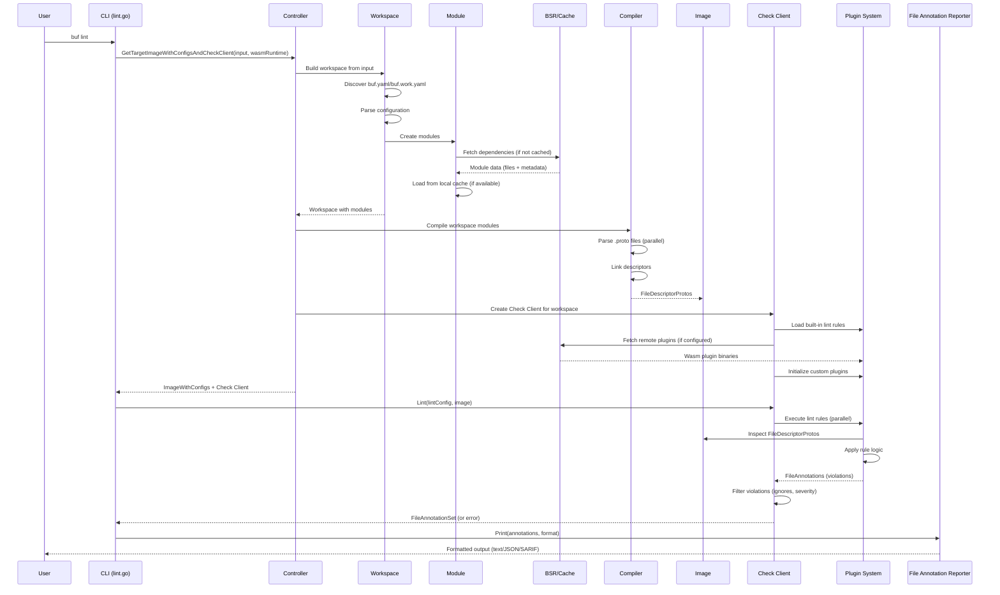
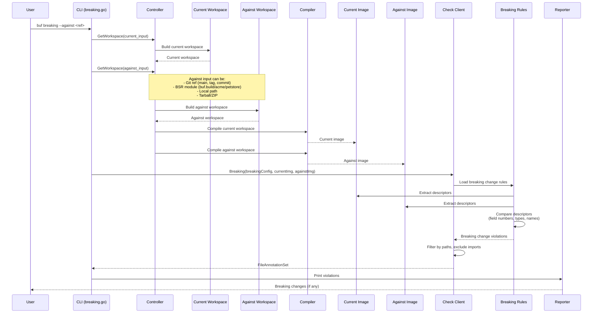
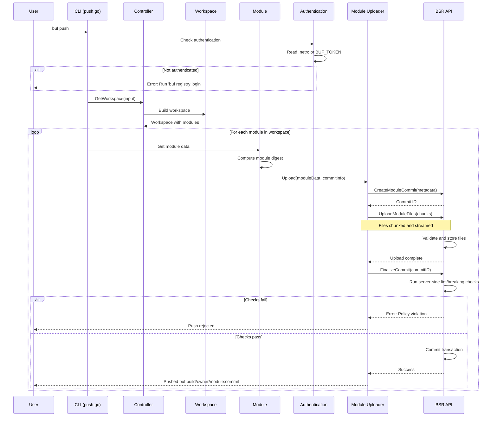
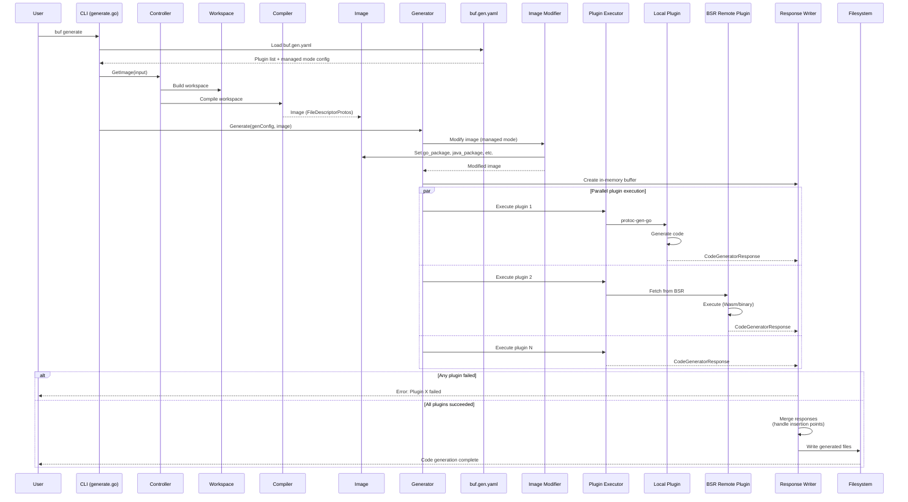
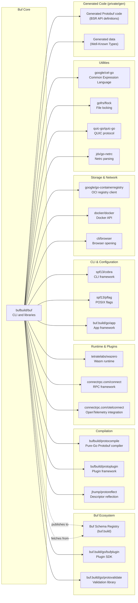

# Buf

> The best way of working with Protocol Buffers, providing linting, breaking change detection, code generation, and Schema Registry integration

| Metadata | |
|---|---|
| Repository | https://github.com/bufbuild/buf |
| License | Apache-2.0 |
| Primary Language | Go |
| Analyzed Release | `v1.65.0` (2026-02-03) |
| Stars (approx.) | 10,810 |
| Generated by | Claude Sonnet 4.5 (Anthropic) |
| Generated on | 2026-02-08 |

## Overview

Buf is a comprehensive CLI tool and ecosystem for working with Protocol Buffers. It provides linting, breaking change detection, code generation, formatting, and seamless integration with the Buf Schema Registry (BSR), establishing a modern Protobuf development workflow.

Problems it solves:

- Replacing the cumbersome protoc workflow with automatic file discovery and centralized configuration
- Enforcing API design best practices and backward compatibility through linting and breaking change detection
- Managing Protobuf dependencies across organizations without manual vendoring
- Providing a centralized registry (BSR) for sharing and versioning Protobuf schemas
- Enabling plugin-based extensibility for custom lint and breaking change rules

Positioning:

Buf aims to replace the traditional REST/JSON paradigm with a schema-driven approach built on Protobuf. Unlike protoc which requires manual proto_path management and lacks built-in quality enforcement, Buf provides an integrated toolchain that makes Protobuf development as easy as modern package managers. The BSR positions Buf as the "npm/Maven for Protobuf," enabling dependency management and schema distribution at scale.

## Architecture Overview

Buf employs a layered architecture with strict package dependency hierarchy. The CLI layer routes commands via Cobra, the Controller orchestrates workflows through workspace management, the compilation layer builds images using an internal high-performance compiler, and the checker layer executes lint and breaking change rules via a plugin-based system.

```mermaid
graph TB
    subgraph CLI["CLI Layer (cmd/buf)"]
        Main["buf.go<br/>Main Entry Point"]
        BuildCmd["build command"]
        LintCmd["lint command"]
        BreakingCmd["breaking command"]
        GenerateCmd["generate command"]
        PushCmd["push command"]
        RegistryCmd["registry commands"]
    end

    subgraph Controller["Controller Layer (private/buf/bufctl)"]
        Ctrl["Controller<br/>Central Orchestrator"]
        WorkspaceMgr["Workspace Manager"]
        ImageBuilder["Image Builder"]
        CheckClient["Check Client Factory"]
    end

    subgraph Workspace["Workspace Layer (private/buf/bufworkspace)"]
        WS["Workspace<br/>Multi-module container"]
        ModuleSet["Module Set"]
        DepResolver["Dependency Resolver"]
        BufYAML["buf.yaml Parser"]
        BufLock["buf.lock Parser"]
    end

    subgraph Module["Module Layer (private/bufpkg/bufmodule)"]
        Mod["Module<br/>Unit of Protobuf files"]
        ModuleData["Module Data"]
        ModuleKey["Module Key"]
        BSRClient["BSR API Client"]
        Cache["Module Cache"]
    end

    subgraph Compiler["Compiler Layer (private/bufpkg/bufprotocompile)"]
        Compile["Internal Compiler<br/>protocompile library"]
        Parser["Protobuf Parser"]
        Linker["Descriptor Linker"]
    end

    subgraph Image["Image Layer (private/bufpkg/bufimage)"]
        Img["Image<br/>Compiled Protobuf"]
        Descriptor["FileDescriptorProto"]
        Modifier["Image Modifier<br/>Managed Mode"]
    end

    subgraph Check["Check Layer (private/bufpkg/bufcheck)"]
        CheckCli["Check Client"]
        LintRunner["Lint Runner"]
        BreakingRunner["Breaking Runner"]
        BuiltinPlugin["Built-in Rules"]
        RemotePlugin["Remote Plugins (Wasm)"]
        CustomPlugin["Custom Plugins"]
    end

    subgraph Generate["Generate Layer (private/buf/bufgen)"]
        Gen["Generator"]
        PluginExec["Plugin Executor"]
        LocalPlugin["Local protoc Plugins"]
        BSRPlugin["BSR Remote Plugins"]
        Response["Code Generation Response"]
    end

    subgraph Config["Config Layer (private/bufpkg/bufconfig)"]
        BufConfig["Configuration Parser"]
        LintConfig["Lint Config"]
        BreakingConfig["Breaking Config"]
        GenConfig["Generate Config"]
    end

    subgraph BSR["BSR Integration (private/bufpkg/bufregistryapi)"]
        ModuleAPI["Module API"]
        PluginAPI["Plugin API"]
        PolicyAPI["Policy API"]
        OwnerAPI["Owner API"]
    end

    Main --> BuildCmd & LintCmd & BreakingCmd & GenerateCmd & PushCmd & RegistryCmd
    BuildCmd & LintCmd & BreakingCmd & GenerateCmd & PushCmd --> Ctrl
    Ctrl --> WorkspaceMgr & ImageBuilder & CheckClient
    WorkspaceMgr --> WS
    WS --> ModuleSet & DepResolver
    ModuleSet --> Mod
    DepResolver --> BufYAML & BufLock
    Mod --> ModuleData & ModuleKey & BSRClient & Cache
    ImageBuilder --> Workspace & Compiler
    Compiler --> Parser & Linker
    Compiler --> Img
    Img --> Descriptor & Modifier
    CheckClient --> CheckCli
    CheckCli --> LintRunner & BreakingRunner
    LintRunner & BreakingRunner --> BuiltinPlugin & RemotePlugin & CustomPlugin
    GenerateCmd --> Gen
    Gen --> PluginExec
    PluginExec --> LocalPlugin & BSRPlugin --> Response
    Ctrl --> Config
    Config --> BufConfig --> LintConfig & BreakingConfig & GenConfig
    Mod --> BSR
    BSR --> ModuleAPI & PluginAPI & PolicyAPI & OwnerAPI
```

## Core Components

### CLI Layer (`cmd/buf/buf.go`)

- Responsibility: Command routing, flag management, and error handling
- Key files: `cmd/buf/buf.go`, `cmd/buf/internal/command/`
- Design patterns: Command pattern (Cobra), Error interceptor pattern

The `newRootCommand()` function constructs the root Cobra command tree with subcommands for `build`, `lint`, `breaking`, `generate`, `push`, `registry`, `dep`, `config`, and more. Each command is implemented as a separate package under `cmd/buf/internal/command/`.

The `newErrorInterceptor()` wraps all command executions to provide user-friendly error messages, particularly for authentication errors (CodeUnauthenticated), network errors (CodeUnavailable), and BSR version mismatches (CodeUnimplemented). Special handling converts Connect RPC errors into actionable messages guiding users to run `buf registry login` or set the `BUF_TOKEN` environment variable.

The CLI follows a strict no-breaking-changes policy: the v1.x CLI will never introduce breaking changes, ensuring long-term stability for CI/CD integrations.

### Controller (`private/buf/bufctl/controller.go`)

- Responsibility: Central orchestration of all Buf operations
- Key files: `private/buf/bufctl/controller.go`, `private/buf/bufctl/option.go`
- Design patterns: Facade pattern, Option pattern (functional options)

The Controller is the primary interface for the CLI layer, providing high-level methods like `GetWorkspace()`, `GetImage()`, `GetTargetImageWithConfigsAndCheckClient()`, and `PutImage()`. It abstracts away the complexity of workspace resolution, module fetching, compilation, and caching.

The Controller accepts functional options (`FunctionOption`) allowing fine-grained control over behavior such as targeting specific paths, excluding imports, disabling symlinks, and specifying configuration overrides. This design enables command-specific customization without polluting the core interface.

A key method is `GetTargetImageWithConfigsAndCheckClient()`, which returns both compiled images with their configuration (ImageWithConfig) and a configured Check Client bound to the workspace's plugin dependencies. This ensures that lint and breaking change checks use the correct plugin versions.

### Workspace Layer (`private/buf/bufworkspace/`)

- Responsibility: Managing multi-module workspaces and dependency resolution
- Key files: `private/buf/bufworkspace/workspace.go`, `private/buf/bufworkspace/workspace_dep_manager.go`
- Design patterns: Composite pattern (workspace contains modules), Builder pattern

A Workspace represents either a single module (buf.yaml) or a multi-module workspace (buf.work.yaml). The workspace system handles:

1. Automatic file discovery: Walking the directory tree to find .proto files
2. Module resolution: Parsing buf.yaml to determine module boundaries
3. Dependency resolution: Reading buf.lock and fetching dependencies from BSR or local cache
4. Well-Known Types injection: Automatically including Google's WKT definitions

The `WorkspaceDepManager` provides methods for updating dependencies (`dep update`), pruning unused deps (`dep prune`), and visualizing the dependency graph (`dep graph`). Dependency resolution follows semantic versioning and supports both digest-based pinning (buf.lock) and version ranges (buf.yaml).

Workspaces enforce module visibility rules: only files explicitly exported in a module's buf.yaml can be imported by other modules, preventing accidental API surface expansion.

### Module Layer (`private/bufpkg/bufmodule/`)

- Responsibility: Representing individual Protobuf modules with metadata and files
- Key files: `private/bufpkg/bufmodule/module.go`, `private/bufpkg/bufmodule/module_data.go`
- Design patterns: Value object pattern, Digest-based immutability

A Module is an immutable collection of Protobuf files with associated metadata (ModuleKey, Commit, Dependencies). Modules are identified by ModuleKeys containing the registry, owner, and module name (e.g., `buf.build/acme/petstore`).

The `ModuleData` type provides the actual file content as a `storage.ReadBucket`, enabling efficient streaming of .proto files without loading them all into memory. Modules are cached locally using a content-addressable store keyed by digest (SHA256 of sorted file contents).

The `ModuleSet` represents a resolved set of modules including transitive dependencies. ModuleSets enforce that each ModuleKey appears at most once, preventing diamond dependency conflicts. The `ModuleSetBuilder` handles topological sorting of dependencies to ensure correct compilation order.

### Compiler Layer (`private/bufpkg/bufprotocompile/`)

- Responsibility: Compiling .proto files into FileDescriptorProtos
- Key files: `private/bufpkg/bufprotocompile/bufprotocompile.go`
- Design patterns: Wrapper pattern (wraps protocompile library)

Buf uses the `github.com/bufbuild/protocompile` library as its internal compiler, which provides a pure-Go implementation of the protoc compilation pipeline. This design choice offers several advantages:

1. Speed: Parallel compilation using all available CPU cores while maintaining deterministic output
2. No external dependencies: No need to install protoc separately
3. Better error reporting: Rich error messages with file positions converted to FileAnnotations

The compiler converts `reporter.ErrorWithPos` from protocompile into `bufanalysis.FileAnnotation`, special-casing import errors to provide actionable messages. Compilation produces an Image (set of FileDescriptorProtos) which serves as input to both the Check and Generate layers.

### Image Layer (`private/bufpkg/bufimage/`)

- Responsibility: Managing compiled Protobuf descriptors as images
- Key files: `private/bufpkg/bufimage/image.go`, `private/bufpkg/bufimage/bufimagemodify/`
- Design patterns: Immutable value object, Modifier pattern

An Image is a collection of FileDescriptorProtos with methods for filtering, merging, and transformation. Images distinguish between "target files" (files being built) and "import files" (dependencies and WKTs), enabling commands like lint to focus only on user code.

The `bufimagemodify` package implements "Managed Mode," which automatically modifies FileDescriptorProtos to set file options like `go_package`, `java_package`, `csharp_namespace`, etc. based on configuration in buf.gen.yaml. This eliminates the need to manually maintain language-specific options in .proto files, centralizing configuration in one place.

Managed Mode supports per-file-path overrides and per-module configuration, allowing fine-grained control while maintaining DRY principles. Modifiers are applied just before code generation, ensuring that the canonical .proto files remain language-agnostic.

### Check Layer (`private/bufpkg/bufcheck/`)

- Responsibility: Running lint and breaking change detection rules
- Key files: `private/bufpkg/bufcheck/bufcheck.go`, `private/bufpkg/bufcheck/client.go`
- Design patterns: Strategy pattern (pluggable rules), Client pattern

The Check layer provides a unified Client interface for both lint and breaking change detection. The Client executes Rules organized into Categories (DEFAULT, MINIMAL, BASIC, STANDARD, FILE_LAYOUT, PACKAGE_AFFINITY, etc.).

Buf ships with 40 built-in lint rules and 53 breaking change rules, covering:

- Lint: Package naming, field naming, enum zero values, RPC naming, import organization
- Breaking: Field number changes, field type changes, field removal, message removal, package changes

The Check system supports three types of plugins:

1. Built-in plugins: Compiled into the buf binary
2. Remote plugins: Wasm-based plugins fetched from BSR and executed via wazero
3. Custom plugins: User-defined plugins implementing the bufplugin/check interface

The `MultiClient` pattern allows composing multiple check sources (built-in + remote plugins + policies) into a single Client. Rules can be selectively enabled/disabled via buf.yaml configuration, and rule violations are reported as FileAnnotations with file path, line number, and error message.

### Generate Layer (`private/buf/bufgen/`)

- Responsibility: Invoking protoc plugins to generate code
- Key files: `private/buf/bufgen/generator.go`, `private/buf/bufprotopluginexec/`
- Design patterns: Template Method pattern, Parallel execution

The Generator orchestrates code generation based on buf.gen.yaml configuration. It supports three plugin types:

1. Local plugins: Standard protoc plugins installed on $PATH (protoc-gen-go, protoc-gen-grpc-go)
2. Binary plugins: Plugins specified as direct binary paths
3. Remote plugins: Plugins hosted on BSR and executed via Wasm or downloaded binaries

All plugins are executed in parallel, and their CodeGeneratorResponses are buffered in memory. Only if all plugins succeed does the Generator write output to disk, providing atomic "all-or-nothing" behavior matching protoc.

The Generator handles insertion points, allowing later plugins to modify files generated by earlier plugins (e.g., grpc-gateway inserting code into go files). The `bufprotopluginos.ResponseWriter` manages the in-memory buffer and coordinates file merging across plugins.

Remote plugins eliminate the need to install plugin binaries locally, pulling them on-demand from BSR with version pinning via buf.lock. This simplifies CI/CD and ensures reproducible builds across teams.

### Config Layer (`private/bufpkg/bufconfig/`)

- Responsibility: Parsing and validating buf.yaml, buf.gen.yaml, buf.work.yaml
- Key files: `private/bufpkg/bufconfig/buf_yaml_file.go`, `private/bufpkg/bufconfig/buf_gen_yaml_file.go`
- Design patterns: Builder pattern, Immutable configuration

The Config layer parses YAML configuration files into strongly-typed Go structs. Configuration supports two versions (v1, v2) with automatic migration via `buf config migrate`.

Key configuration types:

- ModuleConfig: Defines module roots, excludes, and dependencies
- LintConfig: Specifies enabled lint rules, categories, and per-file ignores
- BreakingConfig: Specifies breaking change rules and ignore paths
- GenerateConfig: Lists protoc plugins, outputs, and managed mode options
- PluginConfig: Defines custom check plugins (lint/breaking)
- PolicyConfig: References policy files from BSR

Configuration resolution follows precedence: CLI flags > buf.yaml > defaults. The `--config` flag allows providing configuration as a file path or inline YAML data, enabling one-off overrides without modifying committed configuration.

### BSR Integration (`private/bufpkg/bufregistryapi/`)

- Responsibility: Communicating with the Buf Schema Registry via gRPC
- Key files: `private/bufpkg/bufregistryapi/bufregistryapimodule/`, `private/bufpkg/bufregistryapi/bufregistryapiplugin/`
- Design patterns: Repository pattern, API client pattern

The BSR integration provides clients for interacting with the registry's Connect RPC APIs:

- Module API: Pushing modules, fetching module metadata, managing commits and labels
- Plugin API: Pushing plugins, fetching plugin metadata, managing plugin versions
- Policy API: Pushing policies, fetching policy metadata
- Owner API: Managing organizations and repositories

Authentication is handled via Buf API tokens stored in .netrc or the `BUF_TOKEN` environment variable. The `bufconnect.AugmentedConnectError` type enhances Connect errors with registry address and procedure information for better debugging.

The registry client supports both public BSR (buf.build) and private BSR instances (self-hosted), with automatic registry selection based on module references. Module pushes use the `ModuleUploader` which chunks file uploads and handles transactional commits.

## Data Flow

### Lint Command Execution Flow

### Breaking Change Detection Flow

### Module Push to BSR Flow

### Code Generation Flow

## Key Design Decisions

### 1. Strict Package Dependency Hierarchy

- Choice: Enforcing a strict four-layer dependency graph: `cmd -> private/buf -> private/bufpkg -> private/pkg`
- Rationale: Prevents cyclic dependencies and maintains clear architectural boundaries. Packages in `private/pkg` are generic utilities with no Buf-specific knowledge, while `private/bufpkg` contains reusable Buf components, and `private/buf` contains repository-specific logic
- Trade-offs: Requires careful planning when adding new functionality to ensure it lands in the correct layer. Enforced via linting tools (likely bandeps) to prevent violations

### 2. Controller as Central Facade

- Choice: Providing a single Controller interface as the entry point for all CLI operations
- Rationale: Simplifies the CLI layer by hiding complexity of workspace resolution, module fetching, caching, compilation, and configuration. Enables consistent behavior across commands and facilitates testing by allowing easy mocking
- Trade-offs: Controller becomes a large interface with many methods. Requires careful design to avoid God Object anti-pattern, mitigated by using functional options pattern for customization

### 3. Content-Addressable Module Storage

- Choice: Caching modules using SHA256 digests of their content rather than versions
- Rationale: Ensures bit-for-bit reproducibility. Two modules with identical files produce identical digests regardless of version labels. Enables secure caching and prevents cache poisoning attacks
- Trade-offs: Requires recomputing digests when validating cache entries. Digest changes require re-download even if semantic version hasn't changed (though this is actually a feature, not a bug)

### 4. Image as Compilation Output

- Choice: Using Image (collection of FileDescriptorProtos) as the intermediate representation between compilation and downstream operations
- Rationale: Decouples compilation from linting, breaking change detection, and code generation. Images can be serialized (via `buf build -o`), cached, and inspected independently. Matches protoc's CodeGeneratorRequest format for plugin compatibility
- Trade-offs: Additional serialization/deserialization overhead when communicating with plugins. Mitigated by using in-memory representations when possible

### 5. Managed Mode for File Options

- Choice: Automatically setting language-specific file options (go_package, java_package, etc.) based on buf.gen.yaml configuration
- Rationale: Eliminates repetitive file option declarations in .proto files, centralizing configuration in one place. Supports multi-language projects without polluting .proto files with every language's options. Enables organization-wide conventions via default configurations
- Trade-offs: Creates a gap between canonical .proto files and what's compiled. Requires understanding the managed mode configuration to predict generated package names. Users accustomed to seeing options in .proto files may find this magical

### 6. Plugin System with Three Plugin Types

- Choice: Supporting built-in, remote (Wasm), and custom (binary) plugins for extensibility
- Rationale: Built-in plugins provide zero-setup experience with fast execution. Remote plugins enable sharing organization-specific rules via BSR without distributing binaries. Custom plugins allow power users to implement complex rules in any language
- Trade-offs: Increased complexity in plugin resolution and execution. Wasm plugins have performance overhead and limitations (no network access, limited syscalls). Requires maintaining stable plugin API across versions

### 7. Dependency Resolution via BSR with buf.lock

- Choice: Using BSR as the authoritative dependency source with buf.lock for pinning
- Rationale: Eliminates vendoring, provides versioned dependency management, and enables transitive dependency resolution. buf.lock ensures reproducible builds by pinning exact commits. BSR provides additional features like deprecation notices and security advisories
- Trade-offs: Requires network access to BSR (mitigated by local cache). Introduces BSR as a critical dependency for builds (mitigated by supporting private BSR instances and fallback to local modules)

### 8. Parallel Compilation with Deterministic Output

- Choice: Using protocompile library to compile files in parallel while maintaining deterministic descriptor output
- Rationale: Dramatically improves build times on multi-core machines (vs. protoc's single-threaded parser). Deterministic output ensures reproducible builds and cache-friendly digests despite parallel execution
- Trade-offs: Increased implementation complexity to ensure thread-safety and determinism. Higher memory usage due to parallel file parsing

### 9. Universal Input Format Support

- Choice: Supporting diverse input formats (directories, tarballs, ZIP, Git refs, BSR modules, images)
- Rationale: Enables flexible workflows: CI can lint against Git branches, local dev can use directories, deployment can reference BSR tags, and `buf build -o` images can be passed to `buf breaking`
- Trade-offs: Complex input resolution logic in buffetch package. Error messages must guide users when format is ambiguous or incorrect

### 10. No Breaking Changes Policy for v1.x

- Choice: Committing to never introduce breaking changes in the v1.x release series
- Rationale: Provides stability for CI/CD integrations and enterprise adoption. Enables long-term support without forcing users to update. Builds trust in the Buf ecosystem
- Trade-offs: Constrains future evolution. Requires careful API design upfront. Beta/alpha features (`buf beta`, `buf alpha`) used for experimentation before stabilization

## Dependencies

## Testing Strategy

Buf employs a comprehensive testing strategy across multiple dimensions.

Unit tests: Nearly every package has extensive `_test.go` files. Tests use table-driven patterns with test cases defined in `testdata/` directories. The bufcheck package contains large test files (breaking_test.go is 90KB, lint_test.go is 96KB) verifying all lint and breaking change rules. Tests use golden files for snapshot testing of generated output.

Integration tests: The `cmd/buf/` directory contains workspace tests verifying end-to-end flows like `buf lint`, `buf breaking`, and `buf generate` against real .proto files. Tests exercise various input formats (local, tarball, Git, BSR) to ensure universal input support works correctly.

Build system: Uses standard Go tooling (`go build`, `go test`, `go generate`). Wire (Google's compile-time dependency injection) generates dependency graphs in `wire_gen.go` files. The `make` directory contains Makefile targets for common tasks.

CI/CD: GitHub Actions (`.github/workflows/ci/`) runs tests on multiple platforms (Linux, macOS, Windows) and Go versions. Tests include linting (golangci-lint with extensive configuration in `.golangci.yml`), formatting checks (gofmt), and license header validation. Pre-commit hooks (`.pre-commit-hooks.yaml`) enable running buf checks on Protobuf files in other repositories.

Contract testing: The BSR integration includes tests against mock API servers to verify request/response handling. The bufregistryapi package tests authentication flows, error handling, and retry logic.

Performance testing: The internal compiler is benchmarked to ensure parallel compilation outperforms protoc. Caching effectiveness is tested to verify that repeated builds of the same input skip compilation.

## Key Takeaways

1. Layered architecture with enforced dependencies: The strict four-layer package hierarchy (cmd → private/buf → private/bufpkg → private/pkg) prevents cyclic dependencies and creates clear architectural boundaries. This pattern is applicable to any large Go project, enforced via custom linting tools

2. Content-addressable storage for reproducibility: Using SHA256 digests of module content (rather than version tags) as cache keys ensures bit-for-bit reproducibility. Combined with buf.lock for dependency pinning, builds become fully reproducible across time and machines

3. Controller as orchestration layer: Providing a high-level Controller facade that hides complexity of workspace resolution, module fetching, compilation, and caching. Enables CLI commands to be thin wrappers around Controller methods, improving testability and consistency

4. Image as intermediate representation: Decoupling compilation from downstream operations (lint, breaking, generate) via the Image abstraction. Images can be serialized, cached, and distributed independently, enabling flexible workflows

5. Functional options pattern for customization: Using variadic functional options (`...FunctionOption`) instead of bloated configuration structs. Provides flexibility while maintaining backward compatibility as new options are added

6. Plugin extensibility with three tiers: Supporting built-in (compiled-in), remote (Wasm from BSR), and custom (binary) plugins. Balances performance (built-in), shareability (remote), and flexibility (custom) to serve different user needs

7. Managed mode for DRY configuration: Automatically setting language-specific file options based on centralized configuration eliminates repetitive declarations in .proto files. Demonstrates the value of compile-time code transformation for developer experience

8. Universal input format support: Accepting diverse input formats (local directories, tarballs, Git refs, BSR modules, images) via a unified parsing layer. Eliminates impedance mismatch between different environments (local dev, CI, production)

9. Error augmentation for actionable messages: Wrapping low-level errors (Connect RPC errors, network errors) with context-specific guidance (e.g., "run buf registry login"). Improves user experience by turning cryptic errors into actionable instructions

10. Parallel execution with determinism: Using parallel compilation while ensuring deterministic output through careful ordering and hashing. Demonstrates that parallelism and reproducibility are not mutually exclusive with proper design

11. Breaking change policy as commitment: The no-breaking-changes policy for v1.x signals stability and builds trust with enterprise users. Shows the value of API stability commitments for adoption in production environments

12. Registry as ecosystem hub: The BSR acts as the central hub for modules, plugins, and policies, creating a network effect. Demonstrates how a well-designed registry can transform a tool into an ecosystem

## References

- [Buf Official Documentation](https://buf.build/docs)
- [GitHub - bufbuild/buf](https://github.com/bufbuild/buf)
- [Breaking change detection - Buf Docs](https://buf.build/docs/breaking/)
- [Breaking change detection quickstart](https://buf.build/docs/breaking/quickstart/)
- [Introducing custom lint and breaking change plugins for Buf](https://buf.build/blog/buf-custom-lint-breaking-change-plugins)
- [Buf Schema Registry (BSR)](https://buf.build/docs/bsr/)
- [buf module - github.com/bufbuild/buf - Go Packages](https://pkg.go.dev/github.com/bufbuild/buf)
- [Buf CLI Releases](https://github.com/bufbuild/buf/releases)
