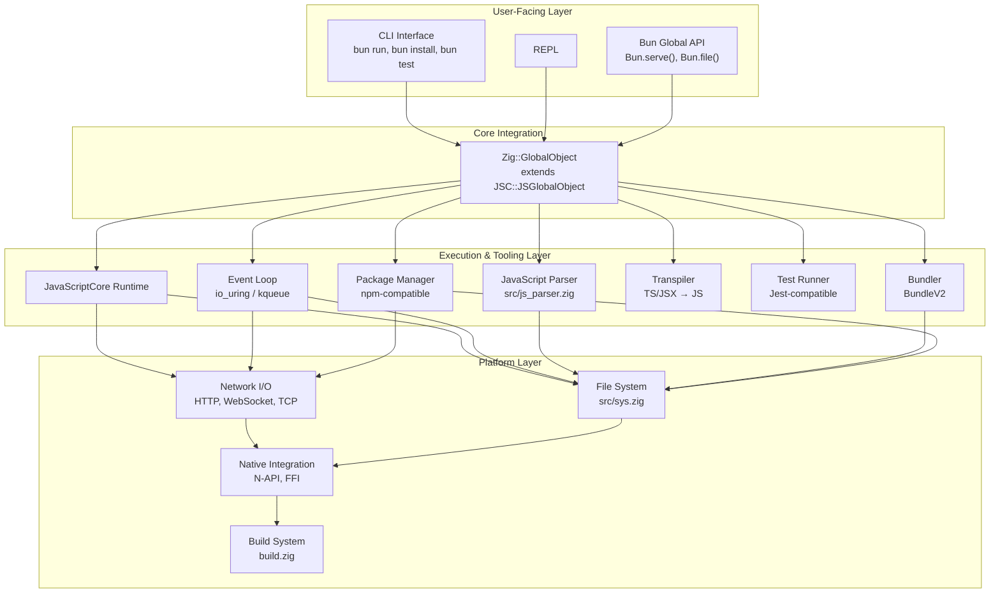
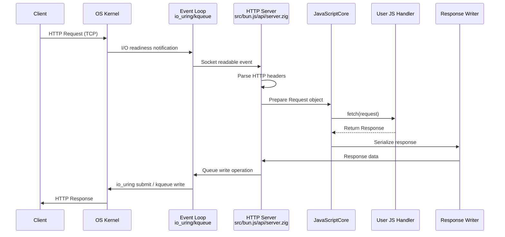
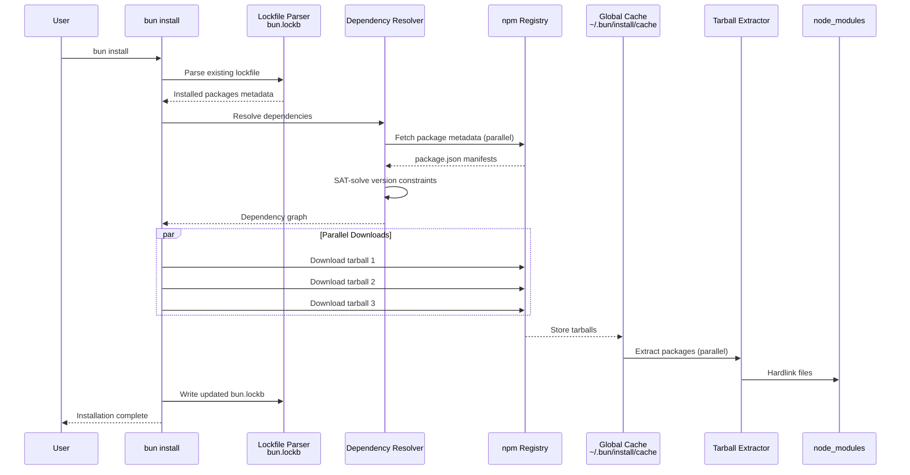
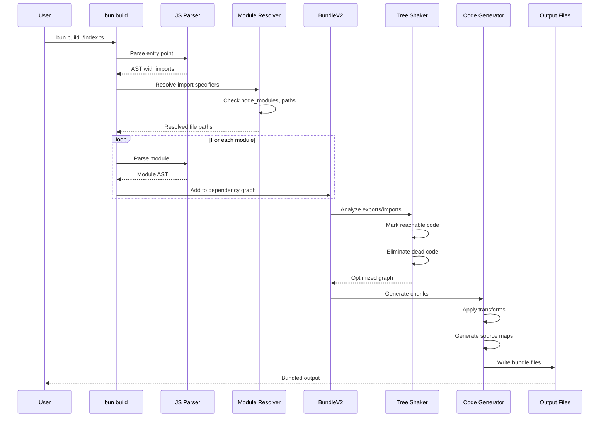
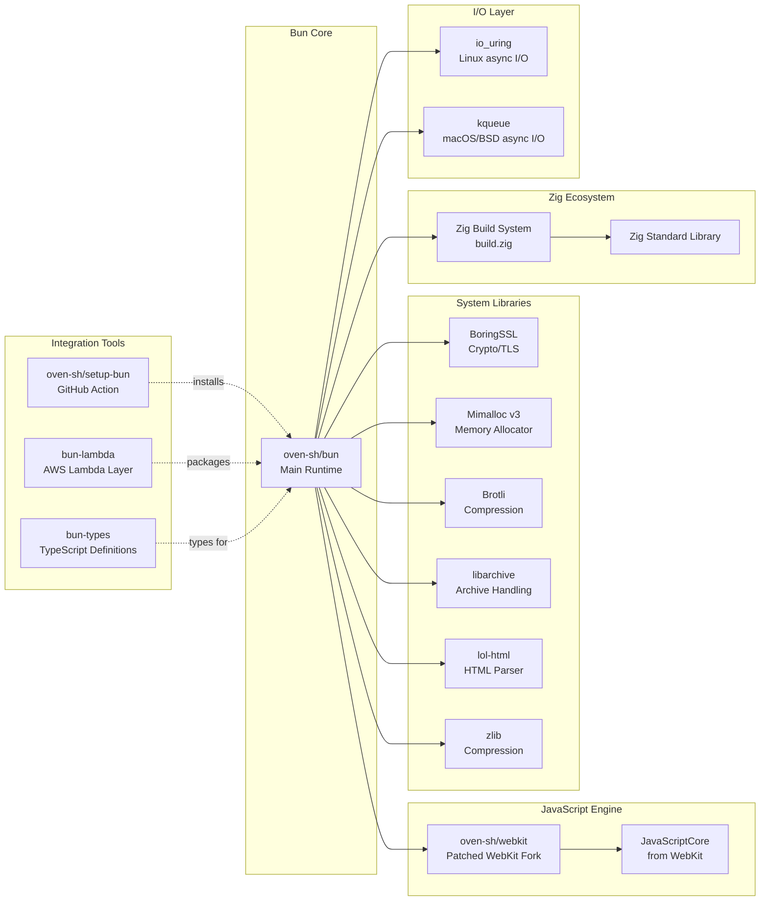

# Bun

> Incredibly fast JavaScript runtime, bundler, test runner, and package manager – all in one

| Metadata | |
|---|---|
| Repository | https://github.com/oven-sh/bun |
| License | Other (MIT-like + LGPL-2 for JavaScriptCore) |
| Primary Language | Zig |
| Category | Runtime |
| Analyzed Release | `v1.3.9` (2026-02-08) |
| Stars (approx.) | 87,166 |
| Generated by | Claude Sonnet 4.5 (Anthropic) |
| Generated on | 2026-02-08 |

## Overview

Bun is a modern, high-performance JavaScript runtime designed as a drop-in replacement for Node.js. It ships as a single executable that combines a JavaScript runtime, bundler, transpiler, test runner, and package manager into one cohesive toolkit. Written in Zig and powered by Apple's JavaScriptCore engine, Bun dramatically reduces startup times and memory usage compared to traditional Node.js environments.

Problems it solves:

- Slow startup times and high memory overhead in Node.js-based development workflows
- Tool fragmentation requiring separate installations of runtime, bundler, test runner, and package manager
- Performance bottlenecks in package installation, bundling, and transpilation operations
- Complex configuration requirements for TypeScript, JSX, and modern JavaScript features

Positioning:

Bun positions itself as an all-in-one replacement for the Node.js ecosystem's fragmented toolchain (Node.js + npm/pnpm/yarn + webpack/esbuild + Jest/Vitest + tsc/Babel). It competes with Node.js and Deno as a JavaScript runtime, but differentiates itself through JavaScriptCore (vs V8), native Zig implementation (vs C++/Rust), and integrated tooling. By 2026, Bun has achieved significant adoption in serverless environments, development workflows, and performance-critical applications.

## Architecture Overview

Bun employs a three-layer architecture converging at a central integration point. The user-facing layer provides CLI commands and JavaScript APIs through the global Bun object. The execution layer contains the JavaScriptCore runtime, event loop, and all developer tooling (bundler, transpiler, test runner, package manager). The platform layer handles low-level I/O, file system operations, and native integration. All subsystems converge at Zig::GlobalObject, which extends JavaScriptCore's JSGlobalObject to bridge native Zig/C++ code with JavaScript APIs.

## Core Components

### Global Object Integration (`src/bun.js/bindings/ZigGlobalObject.h`)

- Responsibility: Central integration point bridging Zig, C++, and JavaScriptCore runtimes
- Key files: `src/bun.js/bindings/ZigGlobalObject.h`, `src/bun.js/bindings/ZigGlobalObject.cpp`
- Design patterns: Bridge pattern, Facade pattern

Zig::GlobalObject inherits from JSC::JSGlobalObject and serves as the central nexus where all three language runtimes converge. It exposes Bun-specific APIs (Bun.serve(), Bun.file(), Bun.write()) as JavaScript properties and methods while delegating to native Zig implementations. This design allows JavaScriptCore to maintain its standard global object structure while Bun extends it with custom functionality. The global object manages the lifecycle of native resources, garbage collection integration, and the event loop coordination.

### JavaScript Parser (`src/js_parser.zig`)

- Responsibility: Parsing JavaScript, TypeScript, and JSX source code into AST
- Key files: `src/js_parser.zig`, `src/js_lexer.zig`, `src/js_ast.zig`
- Design patterns: Visitor pattern, Factory pattern

The parser is implemented entirely in Zig for maximum performance, handling all JavaScript syntax including ECMAScript 2024 features, TypeScript type annotations, and JSX/TSX syntax. It produces an abstract syntax tree (AST) consumed by both the bundler and transpiler. The parser employs recursive descent with operator precedence parsing for expressions and maintains source location information for precise error reporting. It includes specialized handling for JSX syntax sugar, decorators, and TypeScript-specific constructs like enums and namespaces.

### Bundler (`src/bundler/`)

- Responsibility: Module resolution, dependency graphing, code splitting, and bundle generation
- Key files: `src/bundler/bundler.zig`, `src/resolver/resolver.zig`, `src/bundler/bundle_v2.zig`
- Design patterns: Graph traversal, Plugin architecture

BundleV2 implements Bun's bundling pipeline with aggressive optimization. It resolves module specifiers using Node.js resolution algorithm with extensions for TypeScript path mapping and package.json exports field. The bundler performs tree-shaking by analyzing static imports/exports, eliminates dead code, and generates optimized bundles with code splitting support. Unlike webpack or Rollup which run in Node.js, Bun's bundler is native Zig code, enabling significantly faster build times. The bundler supports plugins for custom loaders and transformations, though the plugin API is still evolving.

### Transpiler (`src/bun.js/bindings/`)

- Responsibility: Transforming TypeScript and JSX into executable JavaScript
- Key files: `src/bun.js/bindings/transpiler.zig`, `src/bun.js/javascript.zig`
- Design patterns: Pipeline pattern, Strategy pattern

The transpiler converts TypeScript to JavaScript by stripping type annotations while preserving runtime behavior. It handles JSX transformation into createElement calls or JSX transform syntax depending on configuration. The transpiler runs on-demand during module loading, caching transformed output to avoid redundant work. It supports advanced TypeScript features like const enums (inlining), namespaces, and decorators (stage 3 proposal). The transpiler is invoked both during runtime (require/import interception) and build time (bundling), sharing the same parser infrastructure for consistency.

### Test Runner (`src/cli/test_command.zig`, `src/bun.js/test/jest.zig`)

- Responsibility: Test discovery, execution, reporting with Jest-compatible API
- Key files: `src/cli/test_command.zig`, `src/bun.js/test/jest.zig`, `src/bun.js/test/expect.zig`
- Design patterns: Test runner pattern, Reporter pattern

Bun's test runner provides a Jest-compatible API (describe, test/it, expect, beforeEach, etc.) implemented natively in Zig for superior performance. Test discovery scans for files matching patterns like *.test.ts or *.spec.js. The runner supports parallel test execution, watch mode, snapshot testing, and mocking capabilities. Reporters include CLI table output, TAP, and JSON formats. The expect assertion library implements matchers like toBe, toEqual, toMatchObject with deep equality checking. Unlike Jest which runs in Node.js with significant startup overhead, Bun's test runner benefits from fast initialization and minimal runtime cost.

### Package Manager (`src/install/`)

- Responsibility: npm-compatible package installation with dependency resolution
- Key files: `src/install/install.zig`, `src/install/lockfile.zig`, `src/install/dependency_resolver.zig`
- Design patterns: Graph resolution, Concurrent processing

Bun's package manager reimagines npm/yarn/pnpm with a focus on speed. It uses a custom binary lockfile format (bun.lockb) alongside a text lockfile (bun.lock) for version control friendliness. The installer performs parallel HTTP requests with HTTP/2 multiplexing, extracts tarballs concurrently, and hardlinks identical files across packages to save disk space. Dependency resolution implements a SAT-solver approach to handle complex version constraints. The package manager supports npm registry, private registries, Git dependencies, and workspace/monorepo configurations. Installation speed improvements come from Zig's async I/O, aggressive parallelism, and global cache management.

### Event Loop (`src/async/`)

- Responsibility: Asynchronous I/O coordination across platform-specific mechanisms
- Key files: `src/async/linux_event_loop.zig`, `src/async/darwin_event_loop.zig`, `src/io/io.zig`
- Design patterns: Reactor pattern, Platform abstraction

Bun implements a custom event loop that abstracts over platform-specific I/O mechanisms: io_uring on Linux and kqueue on macOS/BSD. This design is inspired by TigerBeetle's I/O library. The event loop batches I/O operations to amortize system call overhead—with io_uring, kernel performs reads/writes into user-provided buffers, while kqueue delivers readiness events for userland operations. The event loop integrates with JavaScriptCore's microtask queue and timers, ensuring proper Promise resolution ordering. It handles network I/O (TCP, UDP, HTTP, WebSocket), file I/O, timers, and process signals. The architecture allows nearly all I/O to occur in kernel space on Linux, reducing context switches.

## Data Flow

### HTTP Server Request Handling

### Package Installation Flow

### Bundling Process Flow

## Key Design Decisions

### 1. JavaScriptCore over V8

- Choice: Using Apple's JavaScriptCore engine instead of V8 (Node.js/Deno) or SpiderMonkey (Firefox)
- Rationale: JavaScriptCore prioritizes fast startup times and lower memory usage, critical for serverless functions, CLI tools, and development workflows with frequent restarts. JSC's architecture is more suitable for short-lived processes compared to V8's focus on long-running optimizations. The engine is mature, well-maintained by Apple/WebKit team, and has modern JavaScript feature support
- Trade-offs: V8 has more aggressive JIT optimization for long-running workloads, larger ecosystem of C++ addons expecting V8 APIs, and more extensive tooling (DevTools protocol). JavaScriptCore has less documentation for embedders and smaller community. However, for Bun's target use cases (development, serverless, scripts), startup time trumps sustained throughput

### 2. Zig as Implementation Language

- Choice: Implementing core runtime, bundler, transpiler, and package manager in Zig rather than C, C++, Rust, or Go
- Rationale: Zig provides manual memory management with compile-time safety checks, eliminating garbage collection overhead. It offers C interoperability without FFI overhead, crucial for integrating with JavaScriptCore (C++ API) and system libraries. Zig's compile-time execution and metaprogramming enable aggressive optimizations. The language encourages explicit error handling and resource management, reducing runtime surprises. Zig's cross-compilation capabilities simplify building for multiple platforms
- Trade-offs: Zig is still pre-1.0 with evolving language features and occasional breaking changes. Smaller talent pool compared to C++ or Rust. Fewer libraries and ecosystem maturity. However, Bun's team gains fine-grained control over performance, memory layout, and low-level optimizations that would be difficult in higher-level languages

### 3. All-in-One Single Binary Distribution

- Choice: Bundling runtime, bundler, transpiler, test runner, and package manager into one executable rather than separate tools
- Rationale: Eliminates dependency hell and version conflicts between tools. Simplifies installation and updates (single download). Reduces disk space and memory overhead through code sharing. Provides consistent APIs and behavior across tooling. Enables cross-component optimizations (e.g., parser shared by runtime and bundler). Improves discoverability and user experience
- Trade-offs: Larger binary size (90+ MB) compared to minimal runtimes. Harder to swap individual components. Potential bloat for users needing only subset of features. However, the trade-off aligns with Bun's philosophy of optimizing for developer experience and integrated workflows

### 4. Native I/O with io_uring and kqueue

- Choice: Implementing custom event loop with io_uring (Linux) and kqueue (macOS/BSD) instead of using libuv (Node.js standard)
- Rationale: io_uring enables true async I/O with kernel-side buffering, dramatically reducing system call overhead and context switches. kqueue provides efficient event notification on BSD-based systems. Direct integration allows optimizations specific to Bun's workload. Batching I/O operations amortizes syscall costs. The abstraction layer (inspired by TigerBeetle) provides cross-platform compatibility without sacrificing performance
- Trade-offs: More complex implementation requiring platform-specific code paths. io_uring requires recent Linux kernels (5.1+), limiting compatibility. Maintenance burden of custom I/O layer. However, benchmarks show significant throughput improvements over libuv, justifying the complexity

### 5. Binary Lockfile Format (bun.lockb)

- Choice: Using custom binary lockfile format alongside text format instead of following package-lock.json or yarn.lock conventions
- Rationale: Binary format enables faster parsing (memory-mapped, zero-copy deserialization). Compact representation reduces file size and I/O overhead. Deterministic serialization ensures consistent hashes. The parallel text lockfile (bun.lock) provides human readability and version control friendliness. Binary format stores additional metadata (checksums, install state) efficiently
- Trade-offs: Non-standard format creates lock-in to Bun ecosystem. Requires tooling for inspection (can't just cat the file). Potential compatibility issues with other tools. Migration friction from npm/yarn/pnpm. However, the performance benefits align with Bun's speed-first philosophy

### 6. Jest-Compatible Test API

- Choice: Implementing Jest-compatible testing API rather than inventing new conventions
- Rationale: Lowers migration friction for existing projects using Jest. Leverages developers' familiarity with describe/it/expect patterns. Enables gradual adoption without rewriting tests. Maintains compatibility with common patterns (mocks, snapshots, matchers). Reduces documentation burden by referencing Jest's extensive resources
- Trade-offs: Inherits some Jest API quirks and historical decisions. Limits innovation in test API design. May conflict with future Jest features. However, compatibility prioritizes adoption over novelty, allowing Bun to compete on performance rather than API differences

## Dependencies

## Testing Strategy

Bun employs a comprehensive multi-layered testing approach combining Zig unit tests, JavaScript integration tests, and extensive benchmarking.

Unit tests: Zig components include inline unit tests using Zig's built-in test framework (zig test). Each module (parser, bundler, installer) has test blocks verifying core functionality. These tests run during build process and CI, providing fast feedback on low-level correctness. JavaScript API tests use Bun's own test runner to validate the bun:test, bun:sqlite, and other modules. Tests are located in test/ directory with naming convention *.test.ts.

Integration tests: End-to-end tests validate complete workflows: package installation (test/cli/install/), bundling (test/bundler/), HTTP servers (test/bun.js/http/), and runtime compatibility (test/js/). Tests use real-world packages from npm to ensure compatibility. The test suite includes regression tests for reported issues, often in test/regression/. Tests run against actual binaries, not mocked components, to catch integration issues.

Benchmarking: Bun maintains extensive benchmarks comparing against Node.js, Deno, and other tools. Benchmarks cover startup time, HTTP throughput, package installation speed, and bundling performance. Results are published at bun.sh/benchmarks with methodology transparency. Benchmarks run in CI to detect performance regressions.

CI/CD: GitHub Actions workflows automate testing across Linux, macOS, and Windows on x64 and arm64 architectures. Build pipeline includes Zig compilation, C++ JSC bindings, test execution, and artifact generation. Release process builds signed binaries, publishes to GitHub releases, and updates package repositories. The project uses Buildkite for additional build infrastructure.

## Key Takeaways

1. Engine selection matters: Choosing JavaScriptCore over V8 demonstrates that engine selection should align with target workload. For short-lived processes (CLI tools, serverless, development), startup time and memory efficiency matter more than sustained throughput. This decision is applicable to any runtime or embedded JavaScript use case.

2. Language-level performance investment: Implementing core components in Zig rather than JavaScript or higher-level languages yields order-of-magnitude improvements. The investment in Zig expertise and ecosystem immaturity pays dividends in bundler, installer, and transpiler performance. This pattern applies to performance-critical tooling where milliseconds compound.

3. Vertical integration benefits: Combining runtime, bundler, transpiler, test runner, and package manager enables cross-component optimizations impossible in separate tools. Shared parser, type information flow, and unified caching create emergent performance benefits. This approach suits greenfield projects willing to own the full stack.

4. Platform-specific I/O optimization: Abstracting over io_uring and kqueue while optimizing for each platform's strengths demonstrates effective performance portability. The complexity cost is justified when I/O is a bottleneck. This pattern applies to databases, message queues, and high-throughput servers.

5. Compatibility as adoption strategy: Providing Jest-compatible test APIs and npm-compatible package management reduces migration friction. Competing on performance while maintaining compatibility lets users adopt incrementally. This strategy is broadly applicable when disrupting established ecosystems.

6. Binary formats for performance: Using binary lockfiles demonstrates trading human readability for machine efficiency in hot paths. The dual format (binary for performance, text for VCS) balances competing needs. Applicable to configuration files, caches, and data interchange where parsing is a bottleneck.

## References

- [Bun Official Documentation](https://bun.com/docs)
- [Bun GitHub Repository](https://github.com/oven-sh/bun)
- [DeepWiki - oven-sh/bun Architecture](https://deepwiki.com/oven-sh/bun)
- [Global Object and JSC Integration](https://deepwiki.com/oven-sh/bun/2.1-zigglobalobject-and-event-loop)
- [Bun Bundler Architecture](https://deepwiki.com/oven-sh/bun/3.3-registry-and-caching)
- [Bun Build System](https://deepwiki.com/oven-sh/bun/8-build-system-and-development)
- [JavaScriptCore WebKit Source](https://github.com/oven-sh/webkit)
- [Bun Blog - Release Notes](https://bun.com/blog)
- [Node.js vs Deno vs Bun: Runtime Guide 2026](https://dev.to/dataformathub/nodejs-vs-deno-vs-bun-the-ultimate-runtime-guide-for-2026-di)
- [Bun Microservice Framework Benchmark](https://ozkanpakdil.github.io/posts/my_collections/2026/2026-01-10-bun-microservice-framework-benchmark/)
