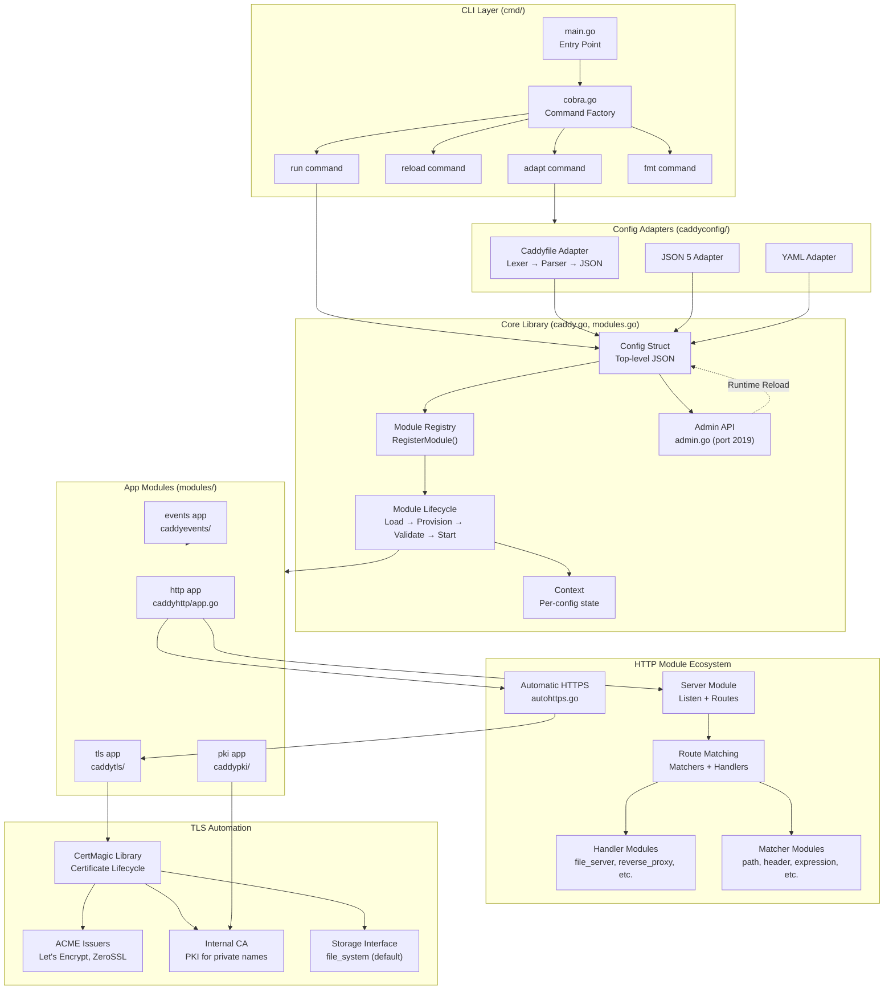
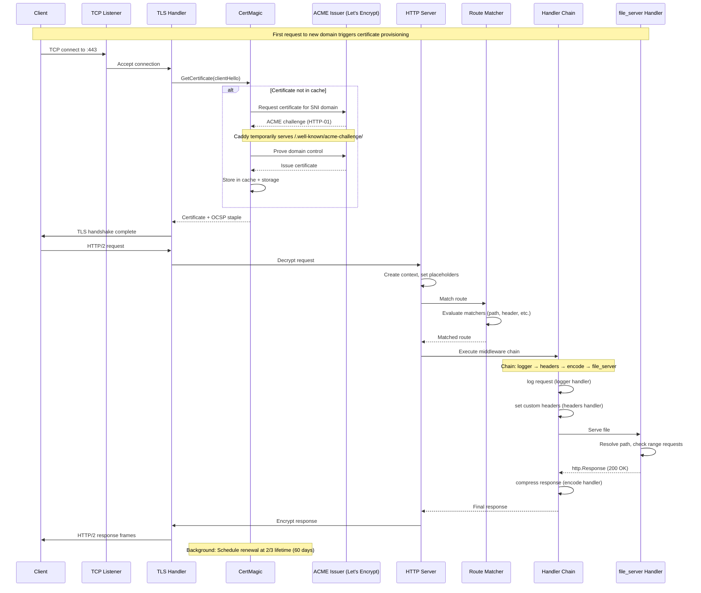
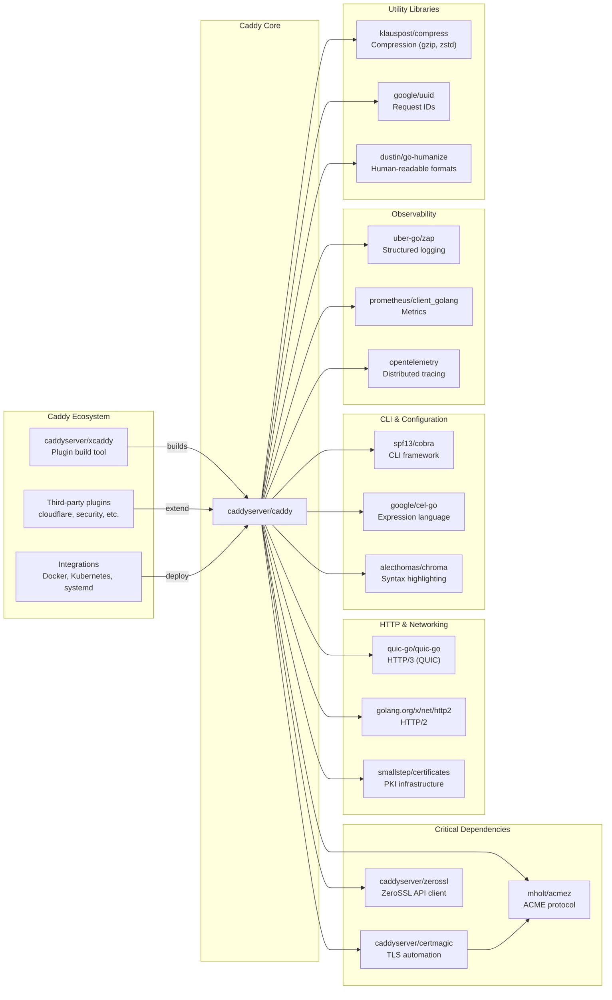

# Caddy

> Fast and extensible multi-platform HTTP/1-2-3 web server with automatic HTTPS

| Metadata | |
|---|---|
| Repository | https://github.com/caddyserver/caddy |
| License | Apache-2.0 |
| Primary Language | Go |
| Analyzed Release | `v2.11.0-beta.2` (2026-01-06) |
| Stars (approx.) | 69,700+ |
| Generated by | Claude Opus 4.6 (Anthropic) |
| Generated on | 2026-02-08 |

## Overview

Caddy is a production-ready, extensible web server platform written in Go that pioneered automatic HTTPS by default. Unlike traditional web servers, Caddy is designed as a modular platform where apps are implemented as composable modules, enabling unprecedented flexibility without bloat.

Problems it solves:

- Manual TLS certificate provisioning and renewal across diverse environments (public, internal, clustered)
- Configuration complexity scattered across multiple files, CLI flags, and environment variables in traditional web servers
- Platform lock-in through static compilation with no external dependencies, including no libc requirement
- Extensibility limitations of traditional web servers through a novel plugin architecture using static compilation

Positioning:

Caddy stands out in the web server landscape by being the first to offer automatic HTTPS by default (since 2015, before Let's Encrypt public beta). It competes with nginx and Apache but differentiates through Go-native architecture, unified JSON configuration, runtime reconfiguration via API, and production-proven TLS automation serving trillions of requests. The underlying CertMagic library has become the de facto standard for ACME-based certificate automation in Go applications.

## Architecture Overview

Caddy employs a three-layer architecture: a CLI command layer for process bootstrapping, a core library managing configuration lifecycle and module orchestration, and a module layer where all functionality is implemented. Configuration is expressed natively as JSON with optional adapters (Caddyfile, YAML, etc.) converting to the canonical format.

## Core Components

### Module System (`modules.go`, `caddy.go`)

- Responsibility: Module registration, lifecycle management, and dependency injection for the entire plugin architecture
- Key files: `modules.go`, `caddy.go`, `context.go`
- Design patterns: Registry pattern, Interface-based polymorphism, Lifecycle hooks (Provisioner, Validator, CleanerUpper)

The module system is Caddy's defining architectural feature. Every module implements the `Module` interface providing a `CaddyModule()` method that returns `ModuleInfo` with a unique `ModuleID` and constructor function. Modules register themselves in `init()` via `RegisterModule()`, building a global registry. The module ID follows a hierarchical namespace convention (e.g., `http.handlers.file_server`), enabling logical organization and JSON unmarshaling through the `caddy` struct tag system. The core library invokes lifecycle hooks: `Provision()` for initialization with `Context` access, `Validate()` for configuration validation, and `Cleanup()` for resource disposal during config reloads. This architecture enables zero-downtime config changes by provisioning new modules before cleaning up old ones, briefly running two configs simultaneously.

### HTTP App (`modules/caddyhttp/app.go`)

- Responsibility: HTTP/HTTPS server orchestration, automatic HTTPS coordination, and request routing
- Key files: `modules/caddyhttp/app.go`, `modules/caddyhttp/autohttps.go`, `modules/caddyhttp/server.go`
- Design patterns: App interface, Middleware chain (Handler pattern), Two-phase automatic HTTPS provisioning

The HTTP app is Caddy's primary application module (ID: `http`). It manages a map of `Server` instances, each with listeners, routes, and TLS configuration. The app implements two-phase automatic HTTPS: phase 1 analyzes route matchers to identify qualifying domain names and configure HTTP→HTTPS redirects; phase 2 enables certificate management after the TLS app provisions. Each server compiles routes into a middleware chain where `MiddlewareHandler` instances process requests sequentially. The `ServeHTTP` method signature extends `http.Handler` with error returns, enabling proper error propagation. Graceful shutdown is handled through configurable grace periods and shutdown delays, useful for load balancer coordination. The app exposes rich placeholders (e.g., `{http.request.uri.path}`, `{http.request.tls.version}`) for dynamic configuration.

### Config Adapter System (`caddyconfig/caddyfile/`)

- Responsibility: Converting user-friendly configuration formats into Caddy's native JSON
- Key files: `caddyconfig/caddyfile/adapter.go`, `caddyconfig/caddyfile/lexer.go`, `caddyconfig/caddyfile/parse.go`, `caddyconfig/httpcaddyfile/httptype.go`
- Design patterns: Adapter pattern, Lexer-Parser architecture, Server type abstraction

The Caddyfile adapter transforms Caddy's domain-specific language into JSON through a three-stage pipeline: lexing (tokenization), parsing (building a block tree structure), and adaptation (JSON generation via server type). The `ServerType` interface (implemented by `httptype` for HTTP servers) contains the business logic for converting generic Caddyfile blocks into app-specific JSON structures. The adapter system is pluggable, allowing third-party formats (nginx config, YAML, TOML) to be converted to Caddy JSON. The `httpcaddyfile` package contains directive handlers that transform Caddyfile directives into HTTP handler module configurations, with directive ordering controlled through a defined precedence system. Import statements support file globbing and argument parameterization, enabling modular configuration composition.

### Admin API (`admin.go`)

- Responsibility: Runtime configuration management, metrics exposure, and operational control via HTTP API
- Key files: `admin.go`, `cmd/commandfuncs.go`
- Design patterns: RESTful API, Hash-based optimistic concurrency control, Authentication via origin enforcement

The Admin API (default `localhost:2019`) provides a JSON API for zero-downtime config changes. It exposes endpoints for configuration retrieval (`GET /config/`), updates (`POST /load`, `PATCH /config/`), and traversal using JSON path notation (e.g., `/config/apps/http/servers`). Config changes use an optimistic concurrency model with ETag headers computed via xxhash, preventing conflicting updates. The API integrates with Go's `expvar` for metrics and `pprof` for profiling. Origin enforcement (configurable via `enforce_origin`) prevents CSRF attacks by validating `Host` and `Origin` headers. The API can be disabled entirely for immutable deployments or secured via TLS with Tailscale integration for production environments. The `/reverse_proxy/upstreams` endpoint enables dynamic backend management without config reloads.

### TLS Automation (`modules/caddytls/`, CertMagic)

- Responsibility: Automatic certificate provisioning, renewal, OCSP stapling, and TLS connection management
- Key files: `modules/caddytls/tls.go`, `modules/caddytls/automation.go`, external: `github.com/caddyserver/certmagic`
- Design patterns: Strategy pattern (multiple issuers), Storage interface abstraction, Event-driven renewal

The TLS app delegates certificate lifecycle management to CertMagic, a battle-tested library extracted from Caddy that has managed millions of certificates since 2015. CertMagic implements automatic ACME challenge solving (HTTP-01, TLS-ALPN-01, DNS-01), on-demand certificate provisioning, background renewal (90-day certs renewed at 60 days), OCSP stapling for privacy, and cluster coordination through storage interface abstraction. The TLS app configures multiple certificate issuers with automatic fallback (ZeroSSL, Let's Encrypt, internal CA), enabling resilience against CA outages. The internal PKI app provides a managed certificate authority for internal names and IP addresses, with automatic trust store installation on local machines. The storage interface (default: file system) enables pluggable backends (Redis, S3) for distributed deployments. Certificate selection uses SNI matching with wildcard support and client certificate authentication via X.509 verification.

## Data Flow

### Typical HTTPS Request Processing with Automatic Certificate Provisioning

## Key Design Decisions

### 1. Static Plugin Compilation over Dynamic Loading

- Choice: Plugins are compiled into the Caddy binary via Go imports rather than dynamically loaded as shared libraries
- Rationale: Go's static compilation model provides memory safety guarantees, eliminates version mismatch issues, reduces attack surface, and enables single-binary deployment with no external dependencies. The xcaddy build tool automates custom binary creation by generating a main.go with plugin imports and running `go build`
- Trade-offs: Requires recompilation to add/remove plugins (xcaddy minimizes friction). Cannot load plugins at runtime, though this is partially addressed through WebAssembly support. Binary size increases with more plugins, though unused code is eliminated via dead code elimination

### 2. JSON as Native Configuration Language

- Choice: Caddy's native configuration is JSON rather than a custom DSL, with optional adapters (Caddyfile, YAML) converting to JSON
- Rationale: JSON maps directly to Go struct unmarshaling, enabling compile-time type safety and automatic documentation generation from struct tags. The `json.RawMessage` type allows deferred unmarshaling for polymorphic module fields. This design exposes the actual in-memory configuration, providing unprecedented control over server behavior
- Trade-offs: JSON is verbose and unfriendly for manual editing (mitigated by Caddyfile adapter). The adapter layer adds complexity and potential for semantic gaps between input format and JSON output. The `caddy.Module` struct tag system creates custom unmarshaling logic that can be non-obvious

### 3. Admin API for Runtime Configuration Management

- Choice: Providing an HTTP API for config changes rather than relying solely on file-based configuration with SIGHUP reloads
- Rationale: Enables zero-downtime config updates, programmatic automation, and GitOps workflows. The JSON patch capability allows surgical config changes without replacing the entire config. Config versioning via ETags prevents concurrent modification issues in distributed management scenarios
- Trade-offs: Introduces a network attack surface (mitigated by localhost default, origin enforcement, and optional TLS). Config drift between running state and files on disk requires discipline. API must be secured in production environments, often through Tailscale or firewall rules

### 4. Automatic HTTPS as Default Behavior

- Choice: HTTPS is enabled automatically for all qualifying domain names without explicit configuration
- Rationale: Security by default reduces human error. The automatic HTTPS system handles certificate provisioning, renewal, OCSP stapling, and HTTP→HTTPS redirects transparently. Multi-issuer fallback (ZeroSSL, Let's Encrypt) provides resilience. The internal CA handles private names/IPs automatically
- Trade-offs: Surprise behavior for users expecting manual certificate management. Public CA issuance requires publicly-reachable servers for ACME challenges (though DNS-01 challenge solves this). Initial request latency for on-demand certificate provisioning. Rate limiting from Let's Encrypt requires careful staging environment practices

### 5. Interface-Based Module Lifecycle Hooks

- Choice: Using optional interfaces (`Provisioner`, `Validator`, `CleanerUpper`) for lifecycle management rather than requiring all modules to implement all methods
- Rationale: Follows Go's "accept interfaces, return structs" idiom. Modules only implement hooks they need, reducing boilerplate. Type assertion enables flexible behavior based on capabilities. The pattern supports zero-downtime reloads by cleanly separating provisioning (new config) from cleanup (old config)
- Trade-offs: Lifecycle behavior is less discoverable than explicit required methods. Runtime type assertions can fail silently if interfaces change. The Context parameter threading pattern requires careful management to avoid memory leaks during reloads

## Dependencies

## Testing Strategy

Caddy employs a comprehensive multi-layered testing approach with over 340 test files across the codebase.

Unit tests: Each package contains `_test.go` files following Go conventions. Core packages like `modules.go`, `caddyfile/`, and `caddyhttp/` have extensive unit test coverage. Test data is organized in `testdata/` directories using the golden file pattern for complex parsing scenarios (Caddyfile lexer, formatter). Fuzz tests (`_fuzz.go`) validate parser robustness against malformed input.

Integration tests: End-to-end tests validate entire request flows including TLS handshakes, certificate provisioning, and handler chains. The `caddytest/` package provides integration test helpers for spinning up full Caddy instances programmatically.

Build system: Standard Go toolchain (`go test ./...`, `go build -tags=nobadger,nomysql,nopgx`). The build tags exclude optional database dependencies. The `setcap.sh` script handles Linux capability management for binding to privileged ports during development.

CI/CD: GitHub Actions runs tests across multiple platforms (Linux, macOS, Windows) and Go versions (currently 1.25+). The CI pipeline includes linting, fuzzing, security scanning via step-security/harden-runner, and artifact publishing. Caddy releases are signed and published as multi-architecture Docker images and platform-specific binaries.

## Key Takeaways

1. Static Compilation as a Feature: Caddy demonstrates that static compilation isn't a limitation but an architectural advantage for server software. By eschewing dynamic plugins for compile-time composition via Go imports, Caddy achieves memory safety, eliminates dependency hell, and enables truly portable single-binary deployment. The xcaddy tool shows that custom build workflows can provide plugin-like flexibility without runtime loading complexity.

2. Configuration as Code with Multiple Frontends: The separation of native configuration (JSON structs) from user-facing configuration (Caddyfile, YAML) through adapters is a powerful pattern. The native format maps directly to in-memory state, enabling programmatic manipulation via API, while adapters provide human-friendly authoring. This pattern is applicable to any system requiring both human and machine interaction.

3. Graceful Config Reloads via Dual Provisioning: Caddy's zero-downtime reload mechanism provisions the new config completely before cleaning up the old one, briefly running two configs simultaneously. This approach, combined with the Provisioner/CleanerUpper lifecycle pattern, ensures that config errors never leave the system in a broken state and active connections aren't dropped. This pattern is valuable for any long-running service requiring runtime reconfiguration.

4. Security as Default Behavior: Automatic HTTPS demonstrates the power of secure defaults over secure options. By making HTTPS the default path and requiring explicit opt-out, Caddy inverted the traditional security model. This pattern of "pit of success" design applies broadly: make the secure/correct choice the easiest choice.

5. Interface-Based Lifecycle Management: Using optional interfaces (Provisioner, Validator, CleanerUpper) rather than a single monolithic interface enables flexible module behavior while minimizing boilerplate. Modules implement only the hooks they need. This Go idiom is superior to inheritance-based lifecycle management in languages like Java.

6. Modular Monolith Architecture: Caddy shows that modularity doesn't require microservices or dynamic plugin systems. The module registry, namespace hierarchy, and interface-based composition create strong logical boundaries within a single binary. This architecture provides extensibility benefits without distributed system complexity, challenging the assumption that modularity requires process boundaries.

## References

- [Caddy Official Documentation](https://caddyserver.com/docs/)
- [Architecture — Caddy Documentation](https://caddyserver.com/docs/architecture)
- [Extending Caddy — Caddy Documentation](https://caddyserver.com/docs/extending-caddy)
- [CertMagic Library Repository](https://github.com/caddyserver/certmagic)
- [Caddy Community Forum](https://caddy.community/)
- [DeepWiki - caddyserver/caddy](https://deepwiki.com/caddyserver/caddy)
- [A Look Inside Caddy, a Web Server Written in Go](https://blog.gopheracademy.com/caddy-a-look-inside/)
