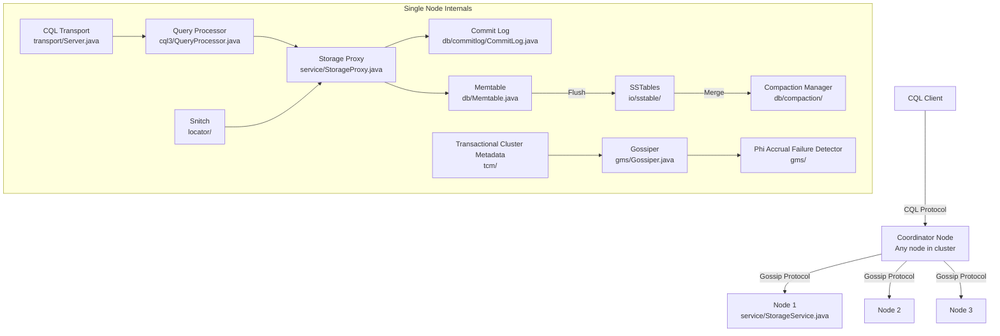
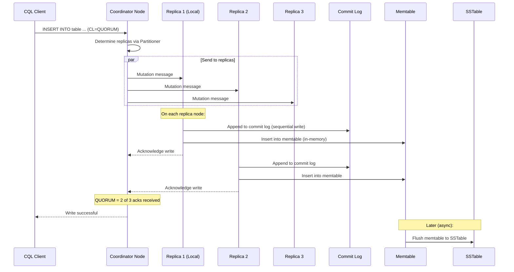
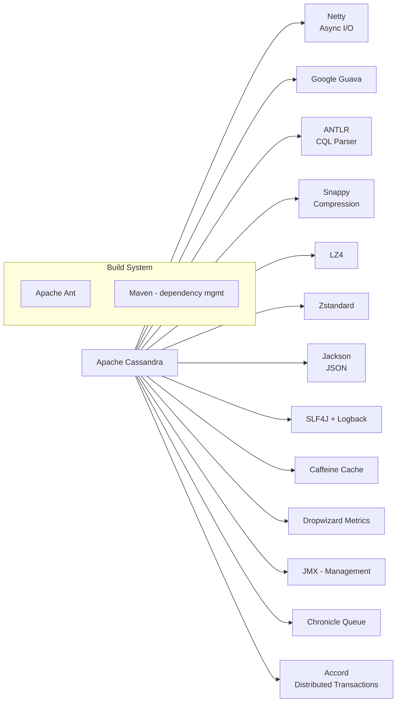

# Apache Cassandra

> A highly scalable, distributed NoSQL database designed for handling large amounts of data across many commodity servers with no single point of failure.

| Metadata | |
|---|---|
| Repository | https://github.com/apache/cassandra |
| License | Apache License 2.0 |
| Primary Language | Java |
| Category | Database |
| Analyzed Release | `5.0.6` (2026) |
| Stars (approx.) | 9,613 |
| Generated by | Claude Opus 4.6 (Anthropic) |
| Generated on | 2026-02-08 |

## Overview

Apache Cassandra is a distributed, wide-column NoSQL database designed to handle massive volumes of data across many commodity servers while providing high availability with no single point of failure. Its architecture combines concepts from Amazon Dynamo (consistent hashing, gossip-based membership, tunable consistency) and Google BigTable (LSM-tree storage, SSTables, memtables) into a unified system. Cassandra is optimized for write-heavy workloads and provides linear scalability, making it the go-to choice for time-series data, messaging systems, and IoT applications.

Problems it solves:
- Provides continuous availability with no single point of failure through a masterless, peer-to-peer architecture where every node can serve reads and writes
- Delivers linear horizontal scalability by distributing data across nodes using consistent hashing, allowing capacity to grow by simply adding nodes
- Supports tunable consistency levels per operation, letting applications balance between strong consistency and low latency based on their specific requirements

Positioning:
Cassandra occupies a unique position as a distributed wide-column store that excels at write-heavy, geographically distributed workloads. It competes with Amazon DynamoDB (managed NoSQL), ScyllaDB (C++ rewrite for better performance), HBase (Hadoop ecosystem), and CockroachDB (distributed SQL). Major users include Apple (400,000+ nodes), Netflix, Instagram, and Discord. The Apache Software Foundation stewards the project, with DataStax being the primary commercial backer.

## Architecture Overview

Cassandra uses a masterless ring architecture where all nodes are equal participants. Data is distributed across nodes using consistent hashing with virtual nodes (vnodes). Each node communicates with others via a gossip protocol for cluster state propagation. The storage engine uses an LSM-tree design where writes go to an in-memory memtable and are periodically flushed to immutable SSTables on disk. Starting with Cassandra 5.0, the Transactional Cluster Metadata (TCM) subsystem manages schema and topology changes through a Raft-based consensus mechanism.

## Core Components

### CQL Transport Layer (`src/java/org/apache/cassandra/transport/`)
- Responsibility: Handles the CQL (Cassandra Query Language) binary protocol, managing client connections, request framing, and response serialization.
- Key files: `Server.java` (Netty-based server), `Message.java` (protocol message types), `Frame.java` (protocol framing), `SimpleClient.java`
- Design patterns: Netty-based asynchronous I/O; message-oriented protocol with versioned frames; connection multiplexing.

The transport layer uses Netty for high-performance asynchronous I/O. It supports protocol versions 3-5, with native protocol v5 adding per-frame compression and small message optimization. Each frame carries a stream ID for request-response matching over multiplexed connections.

### Query Processing (`src/java/org/apache/cassandra/cql3/`)
- Responsibility: Parses CQL statements, performs semantic analysis, prepares execution plans, and coordinates query execution.
- Key files: `QueryProcessor.java` (entry point), `Cql.g` (ANTLR grammar), `statements/SelectStatement.java`, `statements/ModificationStatement.java`, `QueryOptions.java`
- Design patterns: ANTLR-based parser; prepared statement caching; statement-specific execution strategies.

CQL is parsed using an ANTLR grammar (`Cql.g`) into abstract syntax trees. The QueryProcessor validates statements against the schema, checks permissions, and delegates execution. Prepared statements are cached to avoid repeated parsing. The CQL language supports SELECT, INSERT, UPDATE, DELETE, and batch operations with consistency level specification.

### Storage Proxy (`src/java/org/apache/cassandra/service/StorageProxy.java`)
- Responsibility: Coordinates distributed read and write operations, determining which nodes to contact based on the replication strategy and consistency level.
- Key files: `StorageProxy.java`, `ReadCallback.java`, `AbstractWriteResponseHandler.java`
- Design patterns: Coordinator pattern; speculative execution for reads; write-path with commit log + memtable; read repair for consistency convergence.

The StorageProxy is the central coordinator for all data operations. For writes, it determines the replica nodes using the partitioner and replication strategy, sends mutation messages, and waits for the required number of acknowledgments based on the consistency level. For reads, it contacts enough replicas to satisfy the consistency level and performs digest comparison to detect inconsistencies.

### LSM-Tree Storage Engine (`src/java/org/apache/cassandra/db/` and `src/java/org/apache/cassandra/io/sstable/`)
- Responsibility: Manages the on-node data storage using an LSM-tree architecture with memtables, commit log, and SSTables.
- Key files: `db/ColumnFamilyStore.java`, `db/Memtable.java`, `db/commitlog/CommitLog.java`, `io/sstable/format/SSTableReader.java`, `io/sstable/format/SSTableWriter.java`
- Design patterns: Log-Structured Merge (LSM) tree; append-only commit log for durability; in-memory memtable with concurrent skip-list; immutable SSTable files with bloom filters and partition index.

Writes flow through two paths in parallel: the commit log (for durability) and the memtable (for serving reads). When the memtable reaches a threshold, it is flushed to an immutable SSTable on disk. The SSTable format includes a partition index, bloom filter, compression metadata, and the data itself sorted by partition key and clustering columns.

### Compaction (`src/java/org/apache/cassandra/db/compaction/`)
- Responsibility: Merges multiple SSTables to reclaim space from deleted/overwritten data and maintain read performance.
- Key files: `CompactionManager.java`, `CompactionStrategy.java`, `SizeTieredCompactionStrategy.java`, `LeveledCompactionStrategy.java`, `TimeWindowCompactionStrategy.java`, `UnifiedCompactionStrategy.java`
- Design patterns: Strategy pattern for different compaction algorithms; background task scheduling; tombstone garbage collection with gc_grace_seconds.

Cassandra offers multiple compaction strategies: Size-Tiered (STCS) for write-heavy workloads, Leveled (LCS) for read-heavy workloads, Time-Window (TWCS) for time-series data, and the newer Unified Compaction Strategy (UCS) introduced in Cassandra 5.0 that dynamically adjusts based on workload patterns.

### Gossip and Failure Detection (`src/java/org/apache/cassandra/gms/`)
- Responsibility: Propagates cluster membership information and node state through a peer-to-peer gossip protocol, with failure detection using the Phi Accrual algorithm.
- Key files: `Gossiper.java`, `FailureDetector.java`, `EndpointState.java`, `GossipDigestSyn.java`, `GossipDigestAck.java`, `GossipDigestAck2.java`
- Design patterns: Epidemic (gossip) protocol with three-way handshake (SYN, ACK, ACK2); Phi Accrual Failure Detector that outputs a suspicion level rather than a binary alive/dead decision.

The gossiper runs every second on each node, randomly selecting up to three peers to exchange state information. It uses a three-phase protocol: SYN (send digests), ACK (respond with newer state and request missing state), ACK2 (send requested state). The Phi Accrual Failure Detector continuously computes a "phi" value based on the arrival times of heartbeats, with a configurable threshold for marking nodes as down.

### Partitioning and Replication (`src/java/org/apache/cassandra/dht/` and `src/java/org/apache/cassandra/locator/`)
- Responsibility: Distributes data across the cluster ring using consistent hashing and determines replica placement based on replication strategies.
- Key files: `dht/Murmur3Partitioner.java`, `locator/SimpleStrategy.java`, `locator/NetworkTopologyStrategy.java`, `locator/TokenMetadata.java`
- Design patterns: Consistent hashing with virtual nodes (vnodes); pluggable replication strategies; rack-aware and datacenter-aware placement.

The Murmur3Partitioner (default) hashes partition keys to 64-bit tokens that map to positions on the ring. Each node owns multiple token ranges (vnodes). The NetworkTopologyStrategy places replicas across different racks and datacenters for fault tolerance.

## Data Flow

### Write Path

## Key Design Decisions

### 1. Masterless Peer-to-Peer Architecture
- Choice: All nodes in the cluster are equal; any node can serve as coordinator for any request. There is no single leader or master node.
- Rationale: Eliminates single points of failure. Any node failure only affects a portion of the data, and the cluster continues serving requests. Simplifies operations since there is no leader election for data operations.
- Trade-offs: Makes strong consistency more expensive (requires coordination across replicas for each operation). Conflict resolution relies on last-write-wins (LWW) timestamps, which can lose updates in concurrent write scenarios. Lightweight Transactions (LWT) and the new Accord protocol address this but at a performance cost.

### 2. LSM-Tree Storage with Multiple Compaction Strategies
- Choice: Use an LSM-tree storage engine where writes go to memory first (memtable) and are later flushed to immutable disk files (SSTables), with background compaction to merge files.
- Rationale: Optimizes write performance by converting random writes into sequential I/O. The append-only design avoids read-modify-write cycles. Different compaction strategies (STCS, LCS, TWCS, UCS) allow tuning for different workload patterns.
- Trade-offs: Read amplification since a read may need to check multiple SSTables. Space amplification during compaction (temporary storage of both old and new SSTables). Write amplification from repeated compaction of the same data.

### 3. Tunable Consistency
- Choice: Allow clients to specify consistency levels (ONE, QUORUM, ALL, LOCAL_QUORUM, etc.) on a per-operation basis.
- Rationale: Different operations within the same application may have different consistency requirements. Read operations might tolerate eventual consistency for low latency, while critical writes might require QUORUM. This flexibility lets applications optimize the consistency-latency trade-off.
- Trade-offs: Places the burden of choosing correct consistency levels on application developers. Incorrect choices can lead to data inconsistencies or unnecessary latency. The interaction between read and write consistency levels must satisfy R + W > N for strong consistency.

### 4. Gossip Protocol for Cluster Management
- Choice: Use an epidemic gossip protocol for propagating cluster state (node membership, load, schema versions) rather than a centralized coordination service.
- Rationale: Scales well with cluster size. No single point of failure for metadata. Eventually consistent propagation is sufficient for cluster management. The Phi Accrual Failure Detector provides nuanced failure detection.
- Trade-offs: Cluster state convergence is not immediate; there is a propagation delay. Gossip traffic grows with cluster size (though bounded by the three-peer-per-round limit). Starting with Cassandra 5.0, the Transactional Cluster Metadata (TCM) system provides stronger consistency for schema and topology changes.

### 5. Virtual Nodes (vnodes) for Data Distribution
- Choice: Instead of assigning a single token to each node, assign multiple (typically 256) random tokens to each node, creating virtual nodes.
- Rationale: Provides more uniform data distribution across the cluster. When a node joins or leaves, the load is redistributed across many nodes rather than just the adjacent nodes on the ring. Simplifies operations like bootstrapping and decommissioning.
- Trade-offs: More complex token management. Repair operations touch more token ranges. Streaming during topology changes involves more nodes. Some users prefer manually assigned tokens for predictable data placement.

## Dependencies

## Testing Strategy

Cassandra's testing approach reflects its distributed nature:

- Unit Tests (`test/unit/`): JUnit-based tests for individual components like the CQL parser, compaction strategies, data structures, and serialization. Tests use in-JVM Cassandra instances where possible.
- Integration Tests (`test/distributed/`): Tests that spin up multi-node clusters within a single JVM using the `in-jvm-dtest` framework. This allows testing replication, consistency, streaming, and failure scenarios without the overhead of separate processes.
- Python DTests: A separate repository (`cassandra-dtest`) containing Python-based distributed tests that launch actual Cassandra processes and test operational scenarios like rolling upgrades, bootstrap, decommission, and repair.
- Fuzz Tests: Property-based testing and fuzz testing for serialization and protocol handling code.
- Burn Tests: Long-running stress tests using `cassandra-stress` to verify performance and stability under sustained load.
- Harry: A data validation tool that generates random workloads and verifies data correctness, specifically designed to find consistency bugs in distributed operations.
- Simulator: A new testing approach in Cassandra 5.0 that enables deterministic testing of distributed algorithms.

## Key Takeaways

1. Cassandra's combination of Dynamo's distribution model (consistent hashing, gossip, tunable consistency) with BigTable's storage model (LSM-trees, SSTables, memtables) created a uniquely powerful system for write-heavy, geographically distributed workloads. This hybrid lineage is visible throughout the codebase, from the gossiper in `gms/` to the SSTable format in `io/sstable/`.

2. The tunable consistency model is both Cassandra's greatest strength and its most common source of operational complexity. The flexibility to choose consistency per-operation enables fine-grained trade-offs, but requires deep understanding of quorum mathematics and the interaction between read and write consistency levels.

3. Cassandra 5.0 represents a significant architectural evolution with the introduction of Transactional Cluster Metadata (TCM) for strongly consistent schema management, the Unified Compaction Strategy for adaptive compaction, and the Accord protocol for distributed transactions. These additions address long-standing limitations while preserving Cassandra's core strengths of availability and scalability.

## References

- Apache Cassandra Documentation: https://cassandra.apache.org/doc/
- Cassandra Architecture - Dynamo: https://cassandra.apache.org/doc/3.11/cassandra/architecture/dynamo.html
- Gossip Protocol in Cassandra: https://www.geeksforgeeks.org/dbms/gossip-protocol-in-cassandra/
- Apache Cassandra Architecture Fundamentals: https://www.yugabyte.com/blog/apache-cassandra-architecture-how-it-works-lightweight-transactions/
- Complete Guide - Architecture, Internals, and CQL: https://dev.to/farhadrahimiklie/apache-cassandra-database-the-complete-guide-architecture-internals-and-full-cql-syntax-23f7
- DataStax Cassandra Documentation: https://docs.datastax.com/en/cassandra-oss/3.x/
- Apache Cassandra Source Code: https://github.com/apache/cassandra
