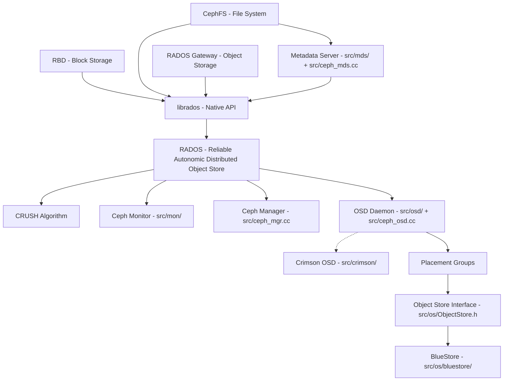
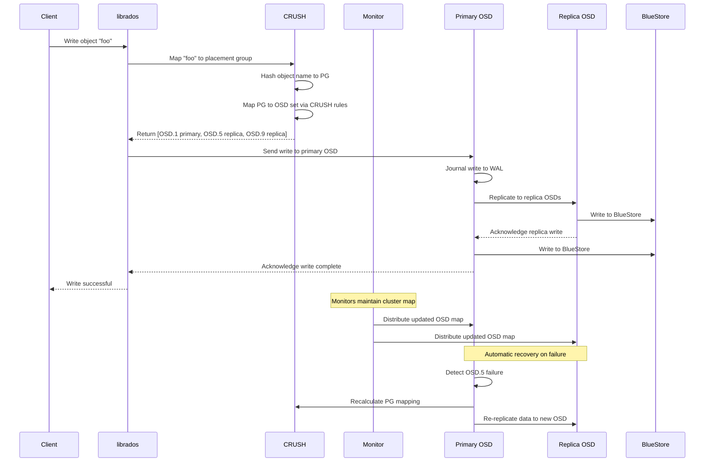
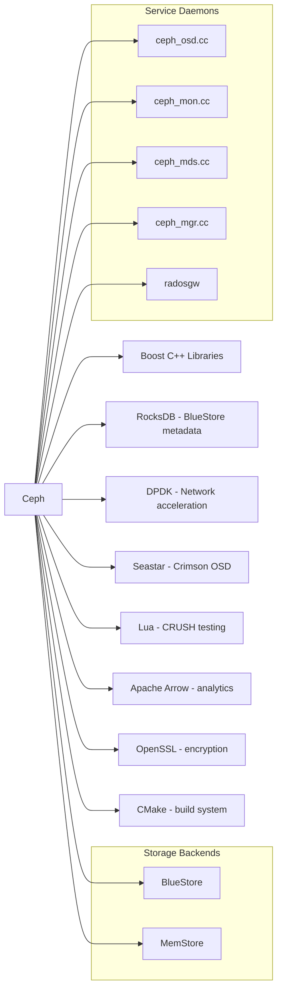

# Ceph

> Distributed storage system providing object, block, and file storage in a single unified platform

| Metadata | |
|---|---|
| Repository | https://github.com/ceph/ceph |
| License | LGPL 2.1 / GPL 2 (mixed) |
| Primary Language | C++ |
| Category | Database |
| Analyzed Release | `rolling` (named releases) |
| Stars (approx.) | 16,000+ |
| Generated by | Claude Opus 4.6 (Anthropic) |
| Generated on | 2026-02-08 |

## Overview

Ceph is a distributed storage system that provides object, block, and file storage in a single unified platform. Built on RADOS (Reliable Autonomic Distributed Object Store), Ceph is designed to be self-healing, self-managing, and scalable to the exabyte level without a single point of failure.

Ceph's architecture is distinguished by its use of the CRUSH (Controlled Replication Under Scalable Hashing) algorithm, which computes data placement deterministically without relying on a central lookup table. This enables Ceph to scale to thousands of nodes while maintaining consistent performance.

---

## Architecture Overview

---

## Core Components

### 1. RADOS and OSD Daemons (src/osd/)

RADOS is the foundational layer of Ceph, providing a reliable distributed object store. Each OSD (Object Storage Daemon) manages one physical or logical storage device. Key source files in `src/osd/`:

- `src/ceph_osd.cc`: OSD daemon entry point
- `ECBackend.cc` / `ECBackendL.cc`: Erasure coding backend for space-efficient data protection
- `ECCommon.cc` / `ECCommonL.cc`: Shared erasure coding utilities
- `ECExtentCache.cc` / `ECExtentCacheL.cc`: Caching layer for erasure-coded extents
- `ECTransaction.cc` / `ECTransactionL.cc`: Transactional writes for erasure-coded pools
- `ECMsgTypes.cc`: Network message types for EC operations
- `ECUtil.cc` / `ECUtilL.cc`: Low-level erasure coding utilities
- `ClassHandler.cc`: Dynamic class loading for RADOS object classes

OSDs communicate peer-to-peer using the Ceph messenger protocol, performing replication, erasure coding, data scrubbing, and recovery autonomously. The `DynamicPerfStats.h` header provides runtime performance counters.

### 2. CRUSH Algorithm (src/crush/)

The CRUSH algorithm is the heart of Ceph's data placement:

- `crush.c` / `crush.h`: Core CRUSH mapping implementation in C for performance
- `builder.c` / `builder.h`: CRUSH map construction utilities
- `hash.c` / `hash.h`: Deterministic hashing functions used by CRUSH
- `CrushWrapper.cc` / `CrushWrapper.h`: C++ wrapper providing the high-level API
- `CrushCompiler.cc` / `CrushCompiler.h`: Compiles human-readable CRUSH maps to binary format
- `CrushTester.cc` / `CrushTester.h`: Testing framework for CRUSH map validation
- `CrushLocation.cc` / `CrushLocation.h`: Physical topology awareness (rack, row, datacenter)
- `CrushTreeDumper.h`: Visualization of CRUSH hierarchy
- `grammar.h`: CRUSH map grammar definitions
- `crush_ln_table.h`: Precomputed logarithm table for straw2 bucket selection

CRUSH maps objects to placement groups (PGs), then maps PGs to sets of OSDs. The hierarchical bucket structure (root -> datacenter -> rack -> host -> OSD) enables topology-aware placement. The straw2 bucket type provides uniform distribution with minimal data movement during cluster changes.

### 3. Monitor Cluster (src/mon/)

Ceph Monitors maintain authoritative cluster state:

- `src/ceph_mon.cc`: Monitor daemon entry point
- `AuthMonitor.cc/h`: Authentication subsystem management
- `ConfigMonitor.cc/h`: Cluster-wide configuration management
- `HealthMonitor.cc/h`: Cluster health assessment and alerting
- `ElectionLogic.cc/h` and `Elector.cc/h`: Paxos-based leader election for monitor quorum
- `ConnectionTracker.cc/h`: Monitor-to-monitor connection management
- `FSCommands.cc/h`: CephFS administration commands
- `CommandHandler.cc/h`: CLI and API command dispatch
- `ConfigMap.cc/h`: Configuration key-value storage
- `CreatingPGs.h`: Placement group creation tracking

Monitors use a Paxos consensus protocol to maintain a consistent view of the cluster map (OSD map, CRUSH map, monitor map, MDS map, and PG map). A quorum of monitors must agree on any cluster state change.

### 4. Metadata Server for CephFS (src/mds/)

The Metadata Server (MDS) provides POSIX-compatible filesystem metadata:

- `src/ceph_mds.cc`: MDS daemon entry point
- `CInode.cc/h`: Inode management with capability tracking
- `CDentry.cc/h`: Directory entry management
- `CDir.cc/h`: Directory fragment management
- `Anchor.cc/h`: Inode anchoring for hard link support
- `Beacon.cc/h`: MDS health reporting to monitors
- `Capability.cc/h`: Client capability (lease) management
- `DamageTable.cc/h`: Tracking and reporting of metadata corruption
- `FSMap.cc/h`: Filesystem map management
- `BatchOp.cc/h`: Batched metadata operations for performance

The MDS uses a dynamic subtree partitioning algorithm to distribute metadata load across multiple MDS daemons. It caches metadata aggressively and uses client capabilities (leases) to enable client-side caching of metadata and data.

### 5. Object Store Backend (src/os/)

The Object Store abstraction layer provides pluggable storage backends:

- `ObjectStore.cc/h`: Abstract interface for all storage backends
- `Transaction.cc/h`: Transaction abstraction for atomic operations
- `bluestore/`: BlueStore -- the default and recommended backend that manages raw block devices directly
- `memstore/`: In-memory backend for testing
- `FuseStore.cc/h`: FUSE-based backend for development
- `kv.h`: Key-value store interface for BlueStore's internal metadata

BlueStore bypasses the local filesystem entirely, directly managing raw block devices. It uses RocksDB (internally) for metadata storage and provides checksumming, compression, and encryption at the object level.

---

## Data Flow

---

## Key Design Decisions

### 1. CRUSH - Decentralized Data Placement

Rather than using a central metadata server or lookup table for data placement, Ceph uses the CRUSH algorithm to compute placement deterministically. Any node with the CRUSH map and the PG map can independently compute where any object should be stored. This eliminates a central bottleneck and single point of failure, enabling the cluster to scale to thousands of nodes. The tradeoff is that cluster map distribution must be consistent, which is handled by the monitor quorum.

### 2. Placement Groups as Indirection Layer

Objects are not mapped directly to OSDs. Instead, they are first hashed into a fixed number of placement groups (PGs), which are then mapped to OSD sets. This indirection layer provides several benefits: it limits the number of data placement decisions that must be tracked, enables efficient rebalancing when cluster topology changes, and allows fine-grained control over replication and erasure coding at the PG level.

### 3. BlueStore - Bypassing Local Filesystems

BlueStore (`src/os/bluestore/`) directly manages raw block devices rather than using a local filesystem like ext4 or XFS. This eliminates the double-write penalty of journaling (data must be written to both the journal and the filesystem), provides end-to-end checksumming, enables inline compression, and allows direct control over data layout for optimal performance. BlueStore uses RocksDB internally for its own metadata.

### 4. Paxos-Based Monitor Quorum

Cluster state (OSD map, CRUSH map, PG map, MDS map, monitor map) is maintained by a quorum of monitor daemons using the Paxos consensus protocol (`ElectionLogic.cc`, `Elector.cc`). This provides strong consistency guarantees for cluster metadata while tolerating minority failures. The monitor quorum is typically 3 or 5 nodes, and all cluster state changes must be committed through the quorum.

### 5. Crimson - Next-Generation OSD (src/crimson/)

The Crimson project (`src/crimson/`) is a ground-up rewrite of the OSD using the Seastar asynchronous programming framework. Crimson aims to eliminate thread-per-core overhead, minimize context switches, and fully exploit modern NVMe storage with millions of IOPS. It maintains API compatibility with the classic OSD while providing dramatically improved performance for high-throughput workloads.

---

## Dependencies

Notable external dependencies:
- Boost C++ Libraries: Extensively used for smart pointers, containers, ASIO networking, and coroutines
- RocksDB: Used internally by BlueStore for metadata management
- Seastar: Asynchronous framework powering the Crimson OSD rewrite
- DPDK: Optional kernel-bypass networking for high-performance deployments
- Apache Arrow: Analytics integration via the Arrow memory format
- OpenSSL: TLS encryption for inter-daemon communication and at-rest encryption
- `c-ares`: Asynchronous DNS resolution
- `breakpad`: Crash reporting and minidump generation

---

## Testing Strategy

Ceph has one of the most comprehensive testing frameworks in open-source storage:

- QA Framework (qa/): A massive suite of integration and regression tests using Teuthology, Ceph's custom distributed testing framework
- Unit Tests: Each subsystem contains its own test files alongside the source
- Ceph Object Corpus (ceph-object-corpus/): Serialized objects from previous versions used for backward compatibility testing
- Erasure Code Corpus (ceph-erasure-code-corpus/): Reference data for validating erasure coding correctness across versions
- Stress Testing: The `ceph_syn.cc` synthetic workload generator simulates various access patterns
- Scrubbing: OSDs perform periodic deep scrubs to verify data integrity by comparing replicas bit-for-bit
- CRUSH Testing: `CrushTester.cc` validates CRUSH map distribution uniformity and data movement during topology changes
- Continuous Integration: Automated testing across multiple Linux distributions and hardware configurations
- Performance Testing: CBT (Ceph Benchmarking Tool) for standardized performance measurement

---

## Key Takeaways

1. Ceph's CRUSH algorithm is a landmark contribution to distributed systems, demonstrating that decentralized, deterministic data placement can scale to exabyte-level storage without central metadata bottlenecks. The hierarchical topology awareness (datacenter -> rack -> host -> device) enables sophisticated data placement policies that balance performance, reliability, and cost.

2. The unified storage platform approach (object + block + file on a single RADOS cluster) provides operational simplicity at the cost of complexity in the codebase. The shared RADOS layer means that improvements to the core benefit all storage interfaces, but the codebase exceeds 2 million lines of C++ and is one of the most complex open-source projects.

3. BlueStore's decision to bypass local filesystems and manage raw block devices directly was a fundamental architectural shift that eliminated the double-journal penalty, enabled end-to-end data integrity, and provided control over data layout. This pattern has influenced other storage systems.

4. The Crimson project represents a bet on the future of storage hardware. By adopting Seastar's share-nothing, run-to-completion threading model, Crimson targets the millions-of-IOPS throughput expected from NVMe and persistent memory devices that overwhelm traditional thread-pool architectures.

5. Ceph's self-healing capabilities (automatic rebalancing, recovery, and scrubbing) make it suitable for large-scale deployments where manual intervention is impractical. The tradeoff is operational complexity during initial deployment and tuning, as the CRUSH map and PG count must be carefully configured for optimal performance.

---

## References

- [GitHub Repository](https://github.com/ceph/ceph)
- [Ceph Architecture Documentation](https://docs.ceph.com/en/reef/architecture/)
- [Ceph Technology Overview](https://ceph.io/en/discover/technology/)
- [CRUSH Maps Documentation](https://docs.ceph.com/en/squid/rados/operations/crush-map/)
- [Red Hat Ceph Storage Architecture Guide](https://docs.redhat.com/en/documentation/red_hat_ceph_storage/7/html-single/architecture_guide/index)
- [Ceph RADOS Deep Dive - Alibaba Cloud](https://www.alibabacloud.com/tech-news/a/ceph/gvis3i4bu2-cephs-rados-a-closer-look)
- [Ceph RGW Object Storage Deep Dive](https://ceph.io/en/news/blog/2025/rgw-deep-dive-1/)
- [RADOS and Ceph Filesystem - ADMIN Magazine](https://www.admin-magazine.com/HPC/Articles/The-RADOS-Object-Store-and-Ceph-Filesystem)
