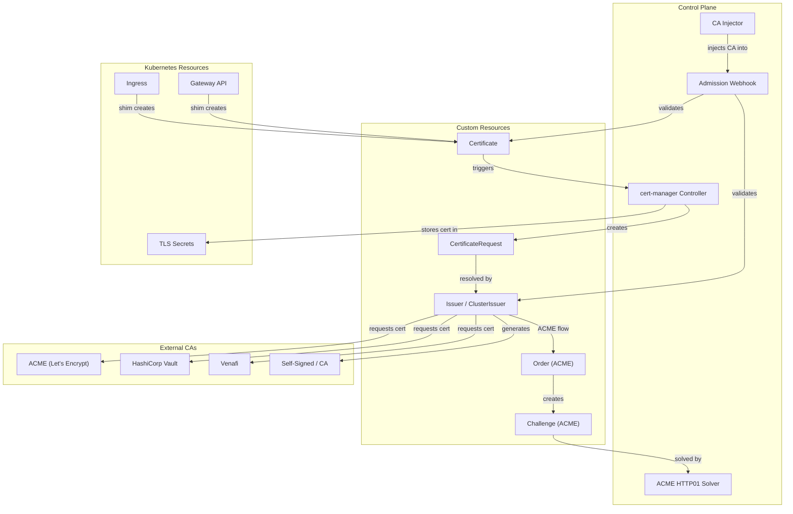
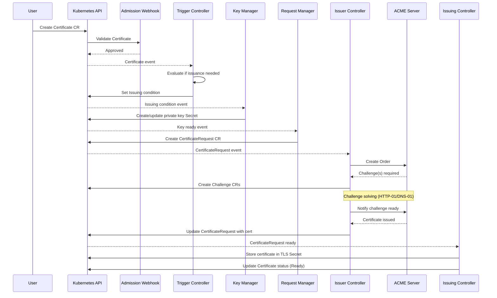
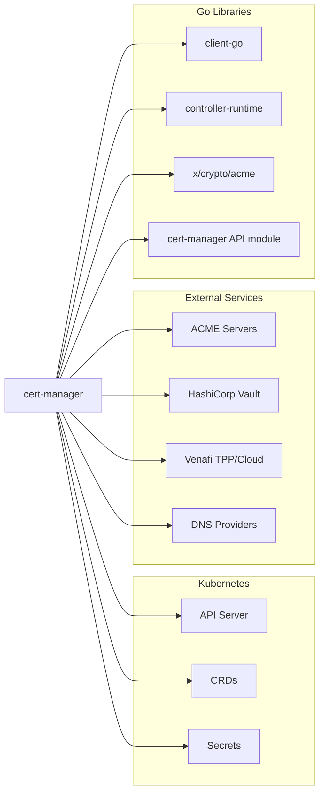

# cert-manager Architecture Report

| Item | Detail |
|------|--------|
| Project | cert-manager |
| Repository | [cert-manager/cert-manager](https://github.com/cert-manager/cert-manager) |
| Category | Security |
| Primary Language | Go |
| License | Apache License 2.0 |
| Stars | 13,551 |
| Latest Release | v1.18.5 (2026-02-02) |
| Generated by | Claude Opus 4.6 (Anthropic) |
| Generated on | 2026-02-08 |

---

## Overview

cert-manager is a Kubernetes-native certificate management controller that automates the issuance, renewal, and lifecycle management of TLS certificates. It solves the critical problem of managing X.509 certificates at scale within Kubernetes clusters, where manual certificate management is error-prone and does not scale.

The project positions itself as the standard certificate management solution for the Kubernetes ecosystem. It integrates with multiple Certificate Authorities (CAs) including Let's Encrypt (ACME), HashiCorp Vault, Venafi, and simple CA/self-signed issuers. cert-manager introduces a set of Custom Resource Definitions (CRDs) that allow users to declaratively specify their certificate requirements.

Key problems it addresses:
- Automated TLS certificate provisioning without manual intervention
- Automatic certificate renewal before expiration
- Integration with multiple certificate authority backends
- Seamless integration with Kubernetes Ingress and Gateway API resources
- Certificate lifecycle tracking and status reporting

---

## Architecture Overview

---

## Core Components

### 1. cert-manager Controller

Responsibility: The main controller binary that runs multiple sub-controllers, each watching specific CRDs and reconciling certificate state. It manages the full lifecycle from Certificate creation to Secret storage.

Key files:
- `cmd/controller/app/controller.go` - Controller initialization and setup
- `cmd/controller/app/start.go` - Server startup logic
- `pkg/controller/certificates/trigger/trigger_controller.go` - Triggers certificate issuance
- `pkg/controller/certificates/issuing/issuing_controller.go` - Handles the issuing process
- `pkg/controller/certificates/keymanager/keymanager_controller.go` - Private key management
- `pkg/controller/certificates/requestmanager/requestmanager_controller.go` - CertificateRequest creation
- `pkg/controller/certificates/readiness/readiness_controller.go` - Readiness status tracking
- `pkg/controller/certificates/revisionmanager/revisionmanager_controller.go` - Revision history

Design patterns:
- Controller pattern: Each sub-controller watches a specific resource type and reconciles
- Chain of responsibility: Certificate lifecycle is split across multiple controllers (trigger, key-manager, request-manager, issuing, readiness, revision-manager)
- Shared informer caching via `pkg/controller/certificates/informers.go` and `pkg/controller/certificates/listers.go`

### 2. Issuer Implementations

Responsibility: Provides pluggable backends for certificate signing. Each issuer type implements a common interface and handles the specifics of communicating with external CAs.

Key files:
- `pkg/issuer/factory.go` - Factory for creating issuer instances
- `pkg/issuer/acme/acme.go` - ACME protocol issuer (Let's Encrypt)
- `pkg/issuer/acme/setup.go` - ACME account registration
- `pkg/issuer/acme/dns/dns.go` - DNS-01 challenge solver orchestrator
- `pkg/issuer/acme/http/http.go` - HTTP-01 challenge solver
- `pkg/issuer/ca/ca.go` - Simple CA issuer
- `pkg/issuer/acme/dns/cloudflare/cloudflare.go` - Cloudflare DNS provider
- `pkg/issuer/acme/dns/route53/route53.go` - AWS Route53 DNS provider

Design patterns:
- Factory pattern: `pkg/issuer/factory.go` creates the correct issuer based on Issuer spec
- Strategy pattern: Different DNS providers implement a common solver interface
- Plugin architecture: External DNS webhook solvers via `pkg/issuer/acme/dns/webhook/webhook.go`

### 3. ACME Controller Chain (Orders and Challenges)

Responsibility: Manages the ACME protocol flow, including order creation, challenge solving, and certificate retrieval. This is the most complex subsystem, implementing the RFC 8555 (ACME) protocol.

Key files:
- `pkg/controller/acmeorders/controller.go` - Order reconciliation
- `pkg/controller/acmeorders/sync.go` - Order synchronization with ACME server
- `pkg/controller/acmechallenges/controller.go` - Challenge reconciliation
- `pkg/controller/acmechallenges/sync.go` - Challenge verification lifecycle
- `pkg/controller/acmechallenges/scheduler/scheduler.go` - Challenge scheduling
- `pkg/controller/acmechallenges/finalizer.go` - Cleanup on challenge completion
- `pkg/acme/accounts/registry.go` - ACME account registry
- `pkg/acme/accounts/client.go` - ACME client management

Design patterns:
- State machine: Orders and Challenges progress through defined states (pending, processing, valid, invalid)
- Scheduler pattern: Challenge scheduler controls concurrent solving across domains
- Finalizer pattern: Kubernetes finalizers ensure cleanup of solver resources

### 4. Certificate Shim Controllers (Ingress and Gateway)

Responsibility: Automatically creates Certificate resources based on annotations on Ingress and Gateway API resources. This provides a seamless integration experience where users annotate their ingress and certificates are provisioned automatically.

Key files:
- `pkg/controller/certificate-shim/ingresses/controller.go` - Ingress shim controller
- `pkg/controller/certificate-shim/gateways/controller.go` - Gateway API shim
- `pkg/controller/certificate-shim/listenerset/controller.go` - Listener set shim
- `pkg/controller/certificate-shim/helper.go` - Shared utilities
- `pkg/controller/certificate-shim/sync.go` - Sync logic for shim controllers

Design patterns:
- Adapter pattern: Translates Ingress/Gateway annotations into Certificate CRDs
- Observer pattern: Watches for changes to Ingress/Gateway resources

### 5. Webhook and CA Injector

Responsibility: The webhook provides admission validation and defaulting for cert-manager CRDs. The CA Injector automatically injects CA certificates into webhook configurations, API services, and CRDs.

Key files:
- `cmd/webhook/app/webhook.go` - Webhook server setup
- `cmd/cainjector/app/cainjector.go` - CA Injector setup
- `pkg/controller/cainjector/reconciler.go` - CA injection reconciliation
- `pkg/controller/cainjector/injectables.go` - Injectable resource types
- `pkg/controller/cainjector/sources.go` - CA data sources
- `internal/apis/certmanager/validation/certificate.go` - Certificate validation
- `internal/apis/acme/validation/challenge.go` - Challenge validation

Design patterns:
- Webhook pattern: Kubernetes admission webhooks for validation and mutation
- Injection pattern: CA Injector watches annotated resources and injects CA bundles

---

## Data Flow

---

## Key Design Decisions

### 1. Multi-Controller Architecture with Fine-Grained Responsibilities

Choice: Split the certificate lifecycle across six sub-controllers (trigger, key-manager, request-manager, issuing, readiness, revision-manager) rather than a single monolithic controller.

Rationale: Each controller has a clear, testable responsibility. This prevents a single large reconcile loop from becoming unwieldy and enables independent scaling and debugging of each lifecycle phase.

Trade-offs:
- Pro: Excellent separation of concerns and testability
- Pro: Individual controllers can be disabled or replaced
- Con: Increased complexity in understanding the full flow
- Con: More inter-controller communication via status conditions

### 2. CertificateRequest as an Intermediate Resource

Choice: Introduce CertificateRequest as a separate CRD rather than having Certificates directly request from issuers.

Rationale: CertificateRequest provides a clean abstraction layer between the certificate lifecycle and the actual signing operation. It enables external approval workflows, audit trails, and decouples the "what to sign" from "how to sign."

Trade-offs:
- Pro: Enables approval policies and external signers
- Pro: Clean audit trail of all signing requests
- Con: Additional resource to manage and understand
- Con: Slight latency increase in the issuance pipeline

### 3. Ingress/Gateway Shim via Annotations

Choice: Use annotations on existing Kubernetes resources (Ingress, Gateway) to trigger automatic Certificate creation rather than requiring explicit Certificate resources.

Rationale: Provides a low-friction adoption path where users can add a single annotation to their existing Ingress and get automatic TLS. This dramatically simplifies the most common use case.

Trade-offs:
- Pro: Extremely simple user experience for common cases
- Pro: Works with existing Ingress controllers without modification
- Con: Annotation-based configuration is less discoverable and harder to validate
- Con: Complex configurations still require explicit Certificate CRDs

### 4. Pluggable DNS Provider Architecture

Choice: Support both built-in DNS providers and external webhook-based DNS solvers for ACME DNS-01 challenges.

Rationale: Built-in providers offer simplicity for common cloud providers, while the webhook mechanism provides extensibility for any DNS provider without modifying cert-manager core.

Trade-offs:
- Pro: Covers the most common DNS providers out of the box
- Pro: Webhook mechanism allows community-driven extensions
- Con: Built-in providers increase the attack surface and dependency tree
- Con: Webhook providers require additional deployment and configuration

---

## Dependencies

---

## Testing Strategy

cert-manager employs a comprehensive testing strategy:

- Unit tests: Each controller, issuer, and DNS provider has unit tests. Files like `internal/apis/certmanager/validation/certificate_test.go` and `internal/apis/acme/validation/challenge_test.go` validate the API resource validation logic.
- Integration tests: The `cmd/controller/app/start_test.go` and `cmd/controller/app/options/options_test.go` files test the controller startup and configuration.
- Fuzzing tests: `internal/apis/acme/fuzzer/fuzzer.go` and `internal/apis/certmanager/fuzzer/fuzzer.go` provide fuzz testing for API types to ensure roundtrip serialization correctness.
- Roundtrip tests: `internal/apis/acme/install/roundtrip_test.go` verifies that API conversion between versions is lossless.
- End-to-end tests: The project maintains a comprehensive e2e test suite that tests the full lifecycle against real ACME servers and cloud providers.
- Startup API check: `cmd/startupapicheck/` provides a dedicated binary to verify CRD installation before the controller starts.

---

## Key Takeaways

1. The fine-grained multi-controller architecture with each sub-controller responsible for one phase of the certificate lifecycle is a model example of separation of concerns in Kubernetes controller design. This approach makes each controller independently testable and debuggable.

2. The CertificateRequest abstraction layer is a powerful design that decouples certificate lifecycle from signing. This enables approval workflows, external policy engines, and third-party signers without modifying the core certificate controllers.

3. The dual-path integration model -- annotation-based shims for simplicity and explicit CRDs for power users -- provides an effective onboarding gradient. Users start with annotations and graduate to full CRDs only when needed.

4. The challenge scheduler (`pkg/controller/acmechallenges/scheduler/scheduler.go`) is a critical component that prevents overwhelming DNS providers and ACME servers by controlling the concurrency of challenge solving. This kind of rate management is essential for operating at scale.

5. The project demonstrates excellent Go project structure with clear separation between public API types (`pkg/apis/`), internal types (`internal/apis/`), controllers (`pkg/controller/`), and issuer implementations (`pkg/issuer/`). The multi-module structure under `cmd/` allows each binary to have its own dependency tree.

---

## References

- [cert-manager Official Documentation](https://cert-manager.io/docs/)
- [cert-manager GitHub Repository](https://github.com/cert-manager/cert-manager)
- [cert-manager Controller CLI Reference](https://cert-manager.io/docs/cli/controller/)
- [cert-manager Component Configuration](https://cert-manager.io/docs/installation/configuring-components/)
- [cert-manager Architecture - Phalanx](https://phalanx.lsst.io/applications/cert-manager/notes.html)
- [DeepWiki - cert-manager Configuration Options](https://deepwiki.com/cert-manager/cert-manager/6.2-configuration-options)
