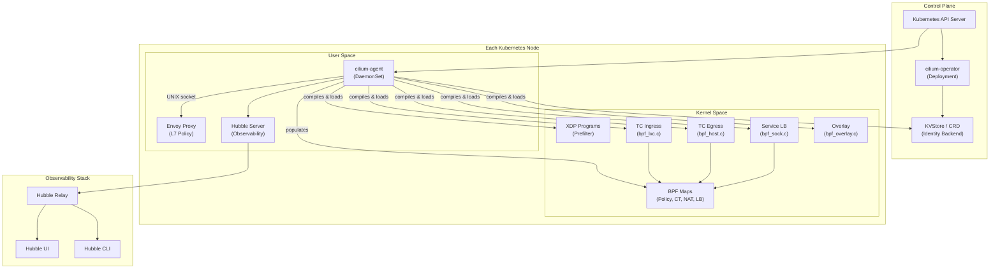
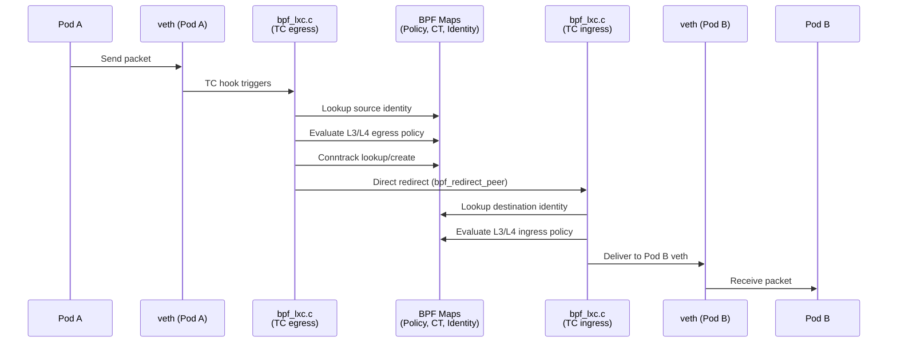
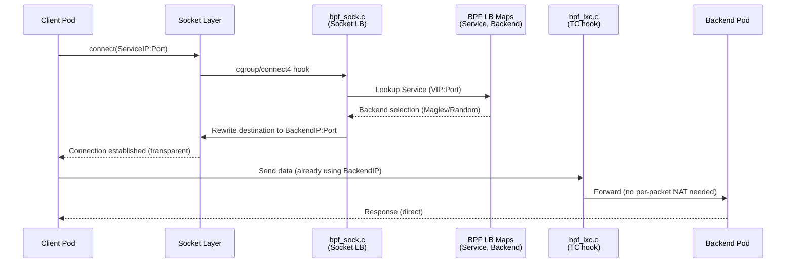
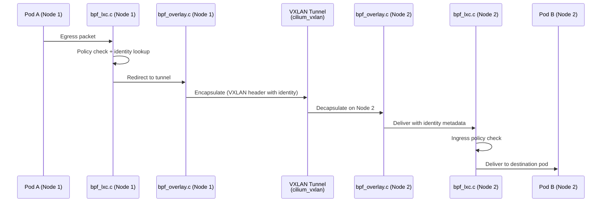
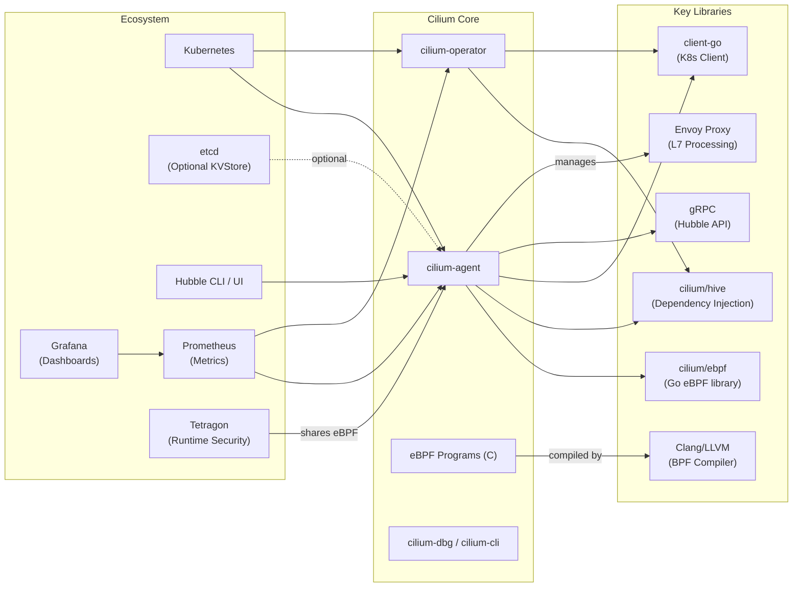

# Cilium

> eBPF-based Networking, Security, and Observability for Kubernetes

| Metadata | |
|---|---|
| Repository | https://github.com/cilium/cilium |
| License | Apache License 2.0 |
| Primary Language | Go (with C for eBPF programs) |
| Analyzed Release | `v1.19.0` (2026-02-04) |
| Stars (approx.) | 23,600+ |
| Generated by | Claude Opus 4.6 (Anthropic) |
| Generated on | 2026-02-08 |

## Overview

Cilium is a CNCF graduated project that provides networking, security, and observability for cloud-native workloads using eBPF technology in the Linux kernel. It replaces traditional iptables/netfilter-based networking stacks with eBPF programs that are dynamically compiled and loaded into the kernel, enabling high-performance packet processing, transparent encryption, and identity-based security policies without the overhead of userspace proxying for L3/L4 traffic.

Problems it solves:

- Traditional kube-proxy and iptables-based networking in Kubernetes suffers from O(n) rule evaluation overhead that degrades at scale, limited visibility, and no native identity awareness
- Network policy enforcement at L3/L4/L7 layers requires composing multiple disparate tools (iptables, Envoy, Calico, etc.) with inconsistent policy models
- Observability into network flows across a Kubernetes cluster is difficult without dedicated tooling; existing solutions often impose significant performance penalties
- Multi-cluster networking and service discovery across Kubernetes clusters typically requires complex VPN or gateway configurations

Positioning:

Cilium competes with Calico, Flannel, and Weave as a Kubernetes CNI plugin. Its primary differentiator is the use of eBPF for datapath processing, which enables significantly higher throughput and lower latency compared to iptables-based solutions. Calico also offers eBPF support, but Cilium's eBPF datapath is more mature and comprehensive. Cilium additionally integrates Hubble for observability and Envoy for L7 policy, providing a unified platform rather than requiring separate tool composition. As a CNCF graduated project (since October 2023), it is widely adopted by major cloud providers including Google (GKE Dataplane V2), AWS (EKS Anywhere), and Azure (AKS).

## Architecture Overview

Cilium follows a distributed agent architecture where a cilium-agent DaemonSet runs on every node and a cilium-operator Deployment handles cluster-wide coordination tasks. The agent manages the eBPF datapath by compiling C programs into eBPF bytecode and loading them into the kernel via TC (Traffic Control) and XDP hooks. All packet-level processing (forwarding, policy enforcement, load balancing, NAT, encapsulation) occurs in kernel space through eBPF programs, while the userspace agent handles configuration, policy computation, identity management, and integration with the Kubernetes API server.

## Core Components

### 1. Cilium Agent (`daemon/`)

- Responsibility: The central component running on every node. Manages the eBPF datapath lifecycle, synchronizes state with the Kubernetes API, computes policy, allocates identities, and orchestrates endpoint regeneration.
- Key files: `daemon/cmd/daemon.go`, `daemon/cmd/endpoint.go`, `daemon/cmd/policy.go`, `daemon/restapi/`, `daemon/k8s/`
- Design patterns: Hive dependency injection (cells), controller pattern for reconciliation loops, event-driven architecture

The cilium-agent is structured using the Hive dependency injection framework (`pkg/hive/`). Components are organized into modular "cells" that declare their dependencies as constructor parameters and are wired together at startup. This decouples initialization order from component implementation and enables testability. The agent watches the Kubernetes API for Pod, Service, Endpoint, NetworkPolicy, and CiliumNetworkPolicy resources, translating them into eBPF map entries and program configurations. When a policy or endpoint changes, the agent triggers "endpoint regeneration," which recompiles the eBPF programs with updated configuration defines and atomically replaces the running programs in the kernel.

### 2. eBPF Datapath (`bpf/`)

- Responsibility: All in-kernel packet processing including forwarding, policy enforcement, service load balancing, NAT, conntrack, encapsulation/decapsulation, and metrics collection
- Key files: `bpf/bpf_lxc.c` (endpoint/pod programs), `bpf/bpf_host.c` (host-facing programs), `bpf/bpf_overlay.c` (VXLAN/Geneve tunnel), `bpf/bpf_sock.c` (socket-level LB), `bpf/bpf_xdp.c` (XDP prefilter), `bpf/bpf_network.c` (network device), `bpf/lib/` (shared library headers)
- Design patterns: Template-based compilation with C preprocessor defines, shared header library (`bpf/lib/`), tail calls for program chaining, BPF map-based communication between programs

The `bpf/` directory contains C source code compiled to eBPF bytecode using Clang/LLVM. Each `.c` file represents a distinct attachment point in the kernel networking stack. `bpf_lxc.c` is attached to the veth pair of each pod and handles ingress/egress policy enforcement and forwarding. `bpf_host.c` is attached to the host-facing network device. `bpf_overlay.c` handles VXLAN/Geneve encapsulation. The `bpf/lib/` directory contains over 80 shared header files implementing conntrack (`conntrack.h`), NAT (`nat.h`), load balancing (`lb.h`, `nodeport.h`), policy evaluation (`policy.h`), and encryption (`encrypt.h`, `ipsec.h`, `wireguard.h`). Configuration is injected at compile time through `node_config.h` which is generated by `pkg/datapath/linux/config/config.go` with node-specific `#define` directives like `ENABLE_IPV4`, `ENABLE_NODEPORT`, and `TUNNEL_MODE`.

### 3. Datapath Loader (`pkg/datapath/loader/`)

- Responsibility: Compiles eBPF C programs into bytecode, loads them into the kernel, and manages program lifecycle including atomic replacement
- Key files: `pkg/datapath/loader/loader.go`, `pkg/datapath/linux/config/config.go`, `pkg/datapath/linux/`, `pkg/datapath/maps/`
- Design patterns: Template compilation, atomic program replacement, lazy compilation with caching

The loader bridges the gap between userspace configuration and kernel-space eBPF programs. It generates `node_config.h` containing compile-time defines based on the current agent configuration, invokes Clang/LLVM to compile the eBPF C code into ELF object files, and uses the `cilium/ebpf` library to load the programs into the kernel. Programs are attached to TC (Traffic Control) hooks or XDP hooks on the appropriate network interfaces. Endpoint-specific programs are compiled with per-endpoint defines (identity, policy verdict maps) enabling the kernel to enforce per-pod network policies without runtime map lookups for common cases.

### 4. Policy Engine (`pkg/policy/`)

- Responsibility: Computes the effective network policy for each endpoint from CiliumNetworkPolicy, CiliumClusterwideNetworkPolicy, and Kubernetes NetworkPolicy resources
- Key files: `pkg/policy/distillery.go`, `pkg/policy/repository.go`, `pkg/policy/selectorcache.go`, `pkg/policy/resolve.go`, `pkg/policy/rule.go`
- Design patterns: Selector cache for efficient label matching, incremental policy computation, identity-based policy model

Cilium's policy model is identity-based rather than IP-based. Each workload receives a numeric security identity (16-bit or 24-bit) derived from its Kubernetes labels. The policy engine maintains a selector cache that maps label selectors to sets of identities, enabling efficient incremental updates when identities change. When a new CiliumNetworkPolicy is created, the engine resolves which endpoints are affected, computes the allowed identity-to-identity communication pairs, and translates them into BPF map entries. L3/L4 policies are enforced directly in the eBPF datapath, while L7 policies are redirected to the Envoy proxy.

### 5. Identity and IP Cache (`pkg/identity/`, `pkg/ipcache/`)

- Responsibility: Allocates and manages numeric security identities for workloads, and maintains the global mapping from IP addresses to security identities
- Key files: `pkg/identity/cache/allocator.go`, `pkg/identity/identity.go`, `pkg/ipcache/ipcache.go`, `pkg/ipcache/metadata.go`
- Design patterns: Distributed consensus via CRD or KVStore backend, reference counting, heartbeat-based garbage collection

Every unique set of security-relevant labels is assigned a numeric identity. Cilium supports two allocation backends: CRD-based (default, using CiliumIdentity custom resources stored in the Kubernetes API) and KVStore-based (using etcd for larger deployments). The IP cache (`ipcache`) maintains a cluster-wide mapping from IP addresses to identities, which is critical for the eBPF datapath to perform identity lookups for remote endpoints. The IP cache is populated from multiple sources (Kubernetes, node discovery, ClusterMesh) and synchronized to BPF maps on every node.

### 6. Cilium Operator (`operator/`)

- Responsibility: Handles cluster-wide tasks that do not need to run on every node: IPAM CRD management, identity garbage collection, CES (CiliumEndpointSlice) management, and cloud provider API interactions
- Key files: `operator/cmd/root.go`, `operator/identitygc/`, `operator/endpointgc/`, `operator/endpointslicegc/`, `operator/watchers/`, `operator/pkg/`
- Design patterns: Hive dependency injection, leader election, controller-based reconciliation

The operator runs as a single-replica (or leader-elected) Deployment. It manages IPAM by allocating per-node PodCIDRs via CiliumNode custom resources, performs garbage collection of stale CiliumIdentity resources using a heartbeat mechanism (identities not seen within `identity-heartbeat-timeout` are deleted), and handles cloud-provider-specific tasks like ENI allocation on AWS or Azure NIC management. The operator also manages CiliumEndpointSlice resources for improved scalability of endpoint state distribution.

### 7. Hubble Observability (`pkg/hubble/`, `hubble-relay/`)

- Responsibility: Provides network flow visibility, DNS awareness, HTTP/gRPC request logging, and service dependency mapping
- Key files: `pkg/hubble/observer/`, `pkg/hubble/parser/`, `pkg/hubble/recorder/`, `hubble-relay/cmd/`, `hubble-relay/main.go`
- Design patterns: Ring buffer for flow storage, gRPC streaming API, peer discovery via Kubernetes

Hubble's server component runs embedded within the cilium-agent, receiving flow events from the eBPF datapath via a perf event ring buffer. The Hubble parser converts raw BPF events into structured flow records with protocol-level details (DNS queries, HTTP requests, Kafka topics). Hubble Relay (`hubble-relay/`) is deployed as a separate Deployment that connects to all Hubble servers across the cluster, providing a unified multi-node API. Hubble CLI and Hubble UI consume this API for real-time and historical flow analysis.

### 8. Service Load Balancing (`pkg/loadbalancer/`, `pkg/maps/`)

- Responsibility: Replaces kube-proxy by implementing Kubernetes Service load balancing entirely in eBPF
- Key files: `pkg/loadbalancer/loadbalancer.go`, `pkg/maps/lbmap/`, `pkg/k8s/service_cache.go`, `bpf/lib/lb.h`, `bpf/lib/nodeport.h`, `bpf/bpf_sock.c`
- Design patterns: Consistent hashing (Maglev), socket-level interception, DSR (Direct Server Return)

Cilium implements ClusterIP, NodePort, LoadBalancer, and ExternalIP service types directly in the eBPF datapath. The `pkg/k8s/service_cache.go` watches Kubernetes Service and EndpointSlice resources and translates them into BPF LB map entries. Socket-level load balancing via `bpf_sock.c` intercepts `connect()` syscalls to perform service translation before a packet is even created, avoiding per-packet NAT overhead. For external traffic, NodePort and LoadBalancer services are handled at the TC or XDP layer. Maglev consistent hashing (`pkg/maglev/`) provides stable backend selection for stateful protocols.

## Data Flow

### Pod-to-Pod Communication (Same Node)

### Pod-to-Service Communication (with kube-proxy replacement)

### Cross-Node Communication (VXLAN Overlay)

## Key Design Decisions

### 1. eBPF as the Primary Datapath Instead of iptables

- Choice: All L3/L4 packet processing (forwarding, policy, NAT, load balancing, conntrack) is implemented as eBPF programs attached to TC and XDP hooks, completely replacing iptables and kube-proxy
- Rationale: iptables rule evaluation is O(n) with the number of rules, causing performance degradation in large clusters. eBPF programs use O(1) hash map lookups for policy decisions and service translation. eBPF also provides programmability (custom logic per packet) that iptables cannot offer, and avoids the fragility of iptables rule ordering
- Trade-offs: Requires Linux kernel 4.19+ (5.4+ recommended for full features), increases complexity of the datapath code (C programs in `bpf/`), and debugging kernel-space issues is harder than userspace iptables debugging. Older kernels or non-Linux platforms are not supported

### 2. Identity-Based Security Model over IP-Based Policies

- Choice: Security policies reference workload identities (derived from Kubernetes labels) rather than IP addresses. Each unique label set is assigned a numeric identity that is embedded in BPF maps and carried in tunnel headers
- Rationale: In dynamic container environments, IP addresses are ephemeral and frequently recycled. Identity-based policies decouple security from networking, allowing policies to remain valid even when pods are rescheduled to different IPs. This also enables policy enforcement across clusters in ClusterMesh without IP coordination
- Trade-offs: Requires a distributed identity allocation mechanism (CRD or KVStore), introduces a 16-bit identity space limit (~65K unique label sets by default, extendable to 24-bit), and adds latency to endpoint startup while identities are being allocated and distributed

### 3. Template-Based eBPF Compilation per Endpoint

- Choice: eBPF programs are compiled with per-endpoint and per-node `#define` directives injected via `node_config.h` and `ep_config.h`, producing specialized programs for each endpoint rather than using a single generic program with runtime branching
- Rationale: Compile-time specialization eliminates runtime conditional branches in the fast path, reducing instruction count and improving performance. Unused features (e.g., IPv6 when only IPv4 is configured) are compiled out entirely, keeping programs within the eBPF verifier's instruction limit
- Trade-offs: Endpoint regeneration requires invoking Clang/LLVM to recompile programs, which adds CPU overhead and latency during policy updates. In large clusters with frequent policy changes, compilation can become a bottleneck. Cilium mitigates this with compilation caching and batched regeneration

### 4. Hive Dependency Injection for Agent Architecture

- Choice: The cilium-agent and cilium-operator use the Hive framework (`pkg/hive/`, `github.com/cilium/hive`) for runtime dependency injection, organizing the application into composable "cells"
- Rationale: Cilium's agent has dozens of interacting subsystems (IPAM, policy, endpoint management, BPF loader, Hubble, K8s watchers, etc.). Manual initialization ordering and dependency management became unmaintainable. Hive automates dependency resolution, lifecycle management (start/stop ordering), and enables isolated unit testing of individual cells
- Trade-offs: Adds a layer of indirection that can make code navigation harder for newcomers. Runtime dependency injection means some errors are caught at startup rather than compile time. The framework itself is Cilium-specific, not a widely adopted Go DI standard

### 5. Embedded Envoy for L7 Policy Enforcement

- Choice: L7 (HTTP, gRPC, Kafka, DNS) policy enforcement is delegated to an Envoy proxy instance running as a sidecar process within the Cilium agent pod (or as a separate DaemonSet), communicating with the agent via UNIX domain sockets
- Rationale: eBPF excels at L3/L4 processing but cannot perform complex L7 protocol parsing. Rather than building a custom L7 proxy, Cilium leverages Envoy's mature and extensible proxy architecture, adding custom Cilium filters (`cilium:bpf_metadata`, `cilium:network_filter`, `cilium:l7policy`) that integrate with the identity-based security model
- Trade-offs: L7 policy enforcement requires packets to be redirected from kernel space to userspace Envoy and back, adding latency compared to pure eBPF L3/L4 enforcement. The Envoy binary adds to the container image size. The custom Cilium Envoy fork must be maintained and kept in sync with upstream Envoy releases

## Dependencies

## Testing Strategy

Cilium employs a multi-layered testing approach spanning unit tests, integration tests, and end-to-end connectivity tests, all orchestrated through GitHub Actions CI.

Unit tests: Standard Go `_test.go` files alongside source code in each package. BPF datapath logic is tested using a custom testing framework in `bpf/tests/` that runs eBPF programs in a controlled environment. The `pkg/testutils/` package provides shared test helpers and fixtures.

Integration tests: The `test/` directory contains integration tests that verify interactions between components. Cilium uses Ginkgo-based test suites for legacy integration tests (`.github/actions/ginkgo/`) that test specific feature combinations across different kernel versions and Kubernetes versions.

End-to-end tests: `cilium-cli connectivity test` runs a comprehensive suite of connectivity tests against a live cluster, testing L3/L4/L7 policies, service load balancing, encryption, ClusterMesh, and more. The test framework includes built-in feature detection to automatically skip tests when prerequisites are not met.

CI/CD: GitHub Actions (GHA) is the primary CI infrastructure. Smoke tests run automatically on every pull request via `pull_request` triggers. Platform tests covering different kernel versions (4.19, 5.4, 5.10, 5.15, 6.1+), Kubernetes versions, and IP families (IPv4, IPv6, dual-stack) require manual triggering by organization members. The CI matrix ensures compatibility across a wide range of environments.

## Key Takeaways

1. eBPF as a platform for kernel-programmable networking: Cilium demonstrates that eBPF can replace entire kernel networking subsystems (iptables, conntrack, kube-proxy) with programmable, O(1)-lookup datapath logic. The key insight is using compile-time specialization (`#define`-based templates) to produce optimized per-endpoint programs rather than one-size-fits-all generic programs. This pattern is applicable to any system where fast-path performance is critical and configuration is relatively stable.

2. Identity-based security decouples policy from infrastructure: By abstracting workloads into numeric identities derived from labels rather than IP addresses, Cilium achieves policy portability across nodes, clusters, and cloud providers. This design pattern -- assigning stable logical identities to ephemeral resources and using those identities as the basis for access control -- is broadly applicable to microservice architectures, zero-trust networks, and multi-cloud environments.

3. Hive dependency injection for large Go applications: Cilium's adoption of the Hive framework shows how runtime dependency injection can tame the complexity of large Go applications with many interacting subsystems. The "cell" abstraction (each subsystem declares its dependencies as constructor parameters) eliminates manual initialization ordering, enables isolated testing, and makes the dependency graph explicit and inspectable at startup. This is a compelling pattern for any Go project that outgrows manual `main()` wiring.

4. Layered datapath architecture separating L3/L4 and L7: Cilium's design of handling L3/L4 in eBPF (kernel space) and L7 in Envoy (user space) is a pragmatic separation of concerns. eBPF provides the raw packet processing speed, while Envoy provides protocol-aware processing. The integration via UNIX domain sockets and custom Envoy filters keeps the boundary clean. This layered approach is applicable to any system that needs both high-throughput packet processing and deep protocol inspection.

5. Distributed state management with multiple consistency backends: Cilium's support for both CRD-based and KVStore-based identity allocation demonstrates a pragmatic approach to distributed state. The CRD backend works out of the box with zero additional dependencies, while the KVStore backend provides better scalability for large clusters. The ability to switch backends (and the migration tooling) shows the value of abstracting the storage layer behind a common interface, a pattern useful in any distributed system that must scale across different deployment sizes.

## References

- [Cilium Official Documentation](https://docs.cilium.io/en/stable/)
- [Cilium Code Overview](https://docs.cilium.io/en/latest/contributing/development/codeoverview/)
- [eBPF Datapath Documentation](https://docs.cilium.io/en/stable/network/ebpf/index.html)
- [Cilium Architecture - DeepWiki](https://deepwiki.com/cilium/cilium)
- [Hubble Internals](https://docs.cilium.io/en/stable/internals/hubble/)
- [Cilium Operator Internals](https://docs.cilium.io/en/stable/internals/cilium_operator/)
- [Guide to the Hive](https://docs.cilium.io/en/latest/contributing/development/hive/)
- [IP Address Management (IPAM)](https://docs.cilium.io/en/stable/network/concepts/ipam/index.html)
- [Multi-Cluster (Cluster Mesh)](https://docs.cilium.io/en/stable/network/clustermesh/intro/)
- [Cilium GitHub Repository](https://github.com/cilium/cilium)
