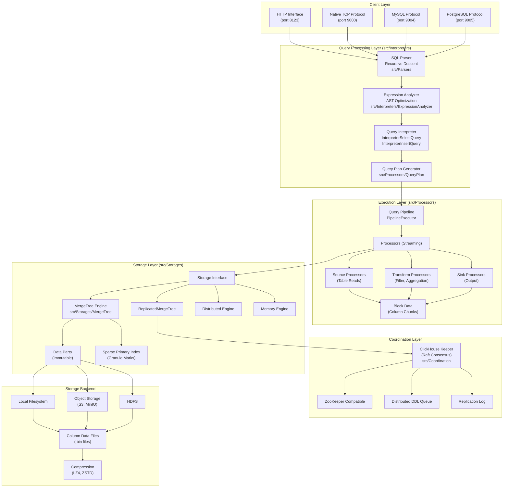
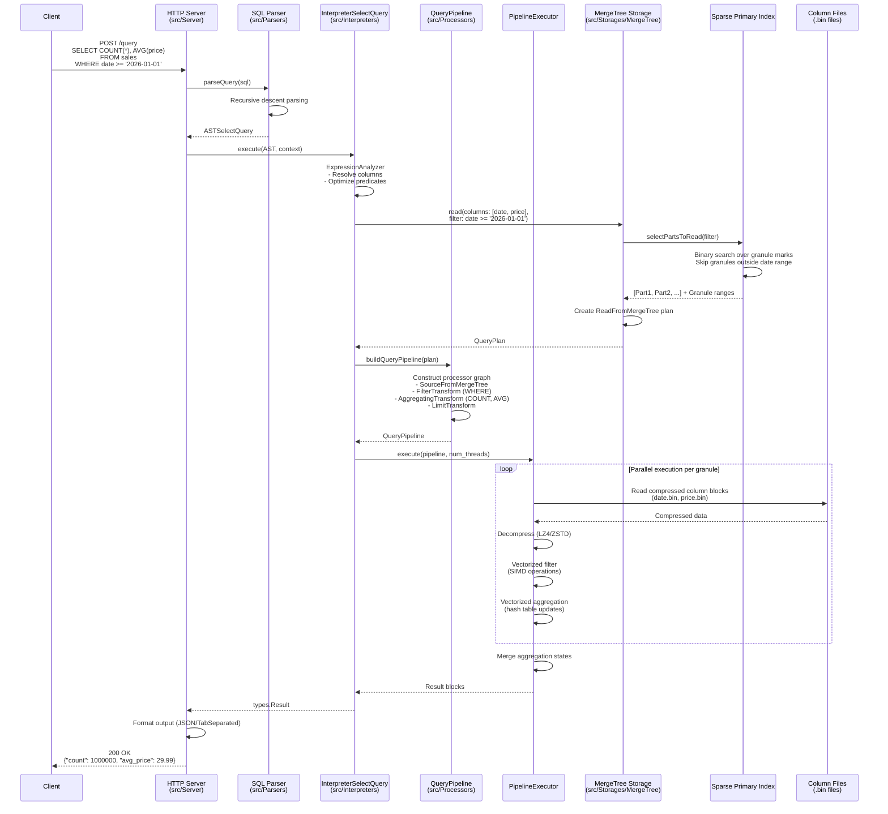
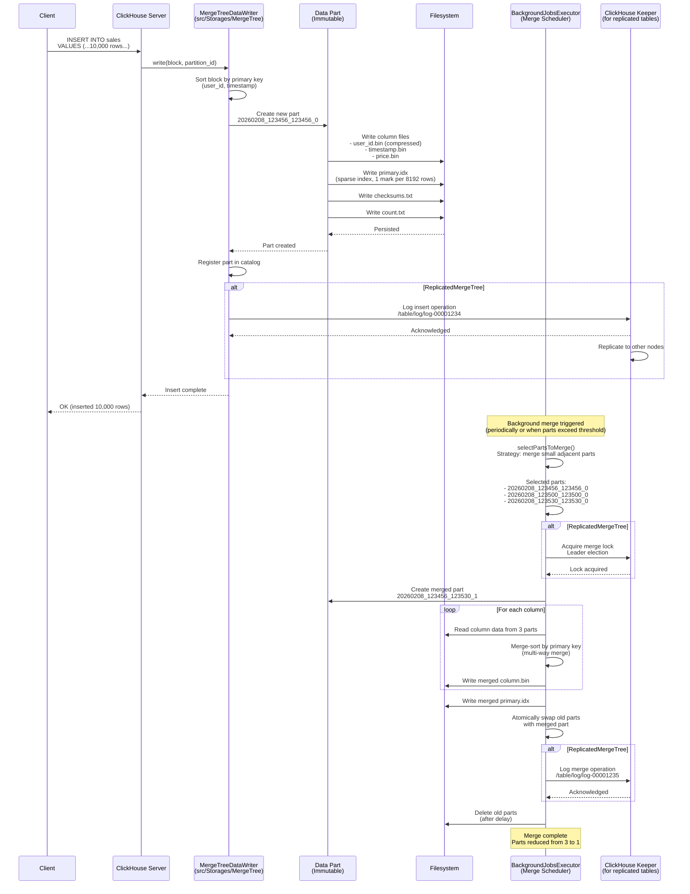
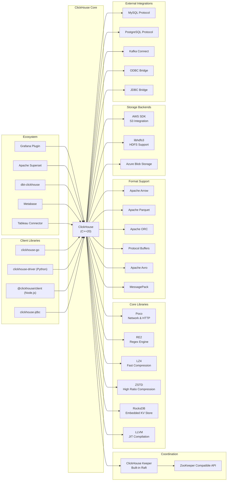

# ClickHouse

> A real-time analytics database management system with column-oriented storage architecture

| Metadata | |
|---|---|
| Repository | https://github.com/ClickHouse/ClickHouse |
| License | Apache License 2.0 |
| Primary Language | C++ |
| Analyzed Release | `v25.12.5.44-stable` (2026-02-02) |
| Stars (approx.) | 45,721 |
| Generated by | Claude Sonnet 4.5 (Anthropic) |
| Generated on | 2026-02-08 |

## Overview

ClickHouse is an open-source column-oriented database management system designed for online analytical processing (OLAP) workloads. Originally developed by Yandex in 2009, it enables real-time analytics on massive datasets through vectorized query execution and sparse indexing. ClickHouse excels at processing billions of rows in sub-second timeframes.

Problems it solves:

- Real-time analytical queries on massive datasets that traditional row-oriented databases cannot handle efficiently
- High ingestion rates combined with low-latency queries for time-series and log data analytics
- Storage overhead through advanced column compression techniques (10x-100x compression ratios)
- Distributed query execution across clusters while maintaining high performance and consistency

Positioning:

ClickHouse competes with systems like Apache Druid, Apache Pinot, and TimescaleDB in the OLAP space. Its column-oriented architecture, sparse indexes, and vectorized execution make it particularly strong for analytical workloads on large-scale data. Unlike traditional data warehouses such as Snowflake or BigQuery, ClickHouse can be self-hosted and provides sub-second query latency even on commodity hardware. It has become the de facto standard for real-time analytics in observability platforms (Uber, Cloudflare, GitLab), ad-tech, and time-series monitoring.

## Architecture Overview

ClickHouse employs a column-oriented storage model with vectorized query execution. The architecture consists of multiple layers: query parsing and interpretation, processor-based execution pipelines, storage engines (primarily MergeTree family), and optional distributed coordination via ClickHouse Keeper. Data is organized in immutable parts that are periodically merged in the background, enabling high write throughput while maintaining query performance.

## Core Components

### Query Parser (`src/Parsers`)

- Responsibility: Lexical and syntactic analysis of SQL queries, converting them into Abstract Syntax Trees (AST)
- Key files: `src/Parsers/ParserQuery.cpp`, `src/Parsers/ASTSelectQuery.h`
- Design patterns: Recursive descent parser, Visitor pattern for AST traversal

ClickHouse uses a recursive-descent parser to convert SQL queries into AST nodes. Unlike database systems that use parser generators like Bison/Yacc, ClickHouse's hand-written parser provides better error messages and flexibility. The parser is designed to be fast and memory-efficient, creating lightweight AST nodes. There are specialized parsers for different contexts: a full SQL parser for SELECT/DDL queries and a data format parser specifically for INSERT queries to handle various input formats (CSV, JSON, Parquet, etc.).

### Interpreters (`src/Interpreters`)

- Responsibility: Creating query execution pipelines from AST, performing semantic analysis and query optimization
- Key files: `src/Interpreters/InterpreterSelectQuery.cpp`, `src/Interpreters/ExpressionAnalyzer.cpp`, `src/Interpreters/Aggregator.h`
- Design patterns: Interpreter pattern, Strategy pattern for different query types

Interpreters form the bridge between parsed queries and physical execution. The InterpreterSelectQuery is the most sophisticated, handling query transformations, predicate pushdown, and generating execution pipelines. The ExpressionAnalyzer performs semantic analysis, resolves column names, applies type checking, and optimizes expressions using heuristic rules. For GROUP BY queries, the Aggregator component implements efficient hash-based aggregation with vectorized operations, pre-aggregation, and two-level aggregation for high cardinality keys.

### Processors and Query Pipeline (`src/Processors`)

- Responsibility: Streaming query execution with parallelism and backpressure handling
- Key files: `src/Processors/IProcessor.h`, `src/Processors/QueryPlan/QueryPlan.cpp`, `src/Processors/Executors/PipelineExecutor.cpp`
- Design patterns: Pipeline pattern, Push-Pull hybrid model, Port-based communication

The processor-based execution model replaced the older Block-based streams in 2019. Each Processor is a computation unit with input/output ports that processes chunks of data (Blocks). Processors communicate via ports with backpressure support, enabling efficient parallel execution. The PipelineExecutor schedules processor execution across threads, handling dependencies and optimizing CPU cache utilization. Common processors include SourceFromSingleChunk (data sources), FilterTransform (WHERE clauses), AggregatingTransform (GROUP BY), and LimitTransform (LIMIT clauses).

### Storage Engines (`src/Storages`)

- Responsibility: Data persistence, retrieval, and storage engine abstraction
- Key files: `src/Storages/IStorage.h`, `src/Storages/MergeTree/MergeTreeData.cpp`, `src/Storages/StorageDistributed.cpp`
- Design patterns: Abstract Factory pattern for storage engines, Immutable data parts design

The IStorage interface provides a unified abstraction for all storage engines. The MergeTree family is the primary storage engine, storing data in immutable parts sorted by primary key. When data is inserted, it forms new parts that are periodically merged in the background to maintain performance. Each part stores columns separately in .bin files with compressed blocks. The Distributed engine enables querying across cluster shards by routing queries to underlying tables on remote nodes. Other engines include Memory (in-memory), Merge (view union of multiple tables), Dictionary (external dictionaries), and various integration engines (MySQL, PostgreSQL, Kafka, S3).

### MergeTree Storage (`src/Storages/MergeTree`)

- Responsibility: Column-oriented storage with sparse indexing, background merges, and efficient data skipping
- Key files: `src/Storages/MergeTree/MergeTreeData.cpp`, `src/Storages/MergeTree/MergeTreeDataSelectExecutor.cpp`, `src/Storages/MergeTree/MergeTreeDataWriter.cpp`
- Design patterns: LSM-tree inspired design, Sparse index, Granule-based storage

MergeTree implements a column-oriented storage format optimized for analytical queries. Data is organized into parts, each containing all columns sorted by the primary key. The sparse primary index contains one mark per granule (typically 8,192 rows), enabling binary search over granules to skip irrelevant data. Each column is stored in separate .bin files with compressed blocks. Background merge operations consolidate small parts into larger ones, reducing overhead and improving query performance. The engine supports data TTL, partitioning by date/key expressions, and sampling for approximate queries. ReplicatedMergeTree adds asynchronous multi-master replication via ClickHouse Keeper.

### ClickHouse Keeper (`src/Coordination`)

- Responsibility: Distributed coordination for replication and distributed DDL execution
- Key files: `src/Coordination/KeeperServer.cpp`, `src/Coordination/KeeperStateMachine.cpp`
- Design patterns: Raft consensus algorithm, State machine replication

ClickHouse Keeper is a ZooKeeper-compatible coordination service written in C++ specifically for ClickHouse. It uses the Raft consensus algorithm instead of ZAB (ZooKeeper Atomic Broadcast), providing faster recovery after network partitions and eliminating the zxid overflow issue that requires periodic ZooKeeper restarts. Keeper manages replication logs, leader elections for merges/mutations, distributed DDL queue coordination, and quorum write tracking. Compared to ZooKeeper, Keeper uses 4.5x less memory and 8x less I/O through compressed snapshots and log entries.

### Distributed Query Execution (`src/Storages/Distributed`, `src/Interpreters/Cluster`)

- Responsibility: Query distribution across cluster shards and result aggregation
- Key files: `src/Storages/StorageDistributed.cpp`, `src/Interpreters/ClusterProxy/executeQuery.cpp`
- Design patterns: Scatter-Gather pattern, Coordinator-Worker model

When querying a Distributed table, the node receiving the query becomes the coordinator. It determines which shards need to execute subqueries, distributes these queries to appropriate nodes, and aggregates results. The coordinator performs one subquery locally for performance (avoiding network overhead). Each shard processes its local data independently, returning partial aggregates that the coordinator merges. This architecture enables horizontal scaling for both storage and compute, with sharding strategies including random, hashed, or custom expressions.

## Data Flow

### Analytical Query Processing

### Data Insertion and Merging

## Key Design Decisions

### 1. Column-Oriented Storage with Separate Column Files

- Choice: Store each column in separate .bin files rather than row-oriented records or hybrid formats
- Rationale: Analytical queries typically access only a small subset of columns (10-20%) but process millions of rows. Storing columns separately minimizes I/O by reading only required columns. This enables better compression ratios (similar values compress better) and vectorized processing via SIMD instructions
- Trade-offs: Higher overhead for transactional workloads that need full row access. More file handles required (one per column per part). Point lookups are slower compared to row-oriented databases. Not suitable for OLTP workloads with frequent updates and deletes

### 2. Sparse Primary Index with Granule Marks

- Choice: Index every Nth row (granule of 8,192 rows) rather than every row like B-tree indexes
- Rationale: Analytical queries process large ranges of data where dense indexes provide diminishing returns. Sparse indexes are compact (fit in memory), enable fast binary search to narrow down granules, and reduce index maintenance overhead. Combined with sorting by primary key, this allows efficient data skipping for range queries
- Trade-offs: Cannot eliminate individual rows without reading the entire granule. Queries without primary key filters must scan all granules. Less effective for high cardinality lookup queries compared to traditional indexes

### 3. Immutable Data Parts with Background Merging

- Choice: Write data to immutable parts and periodically merge them in the background (LSM-tree inspired)
- Rationale: Immutable parts enable high write throughput without locking, simplify concurrent read-write operations, and facilitate replication (parts can be copied atomically). Background merges consolidate small parts to maintain query performance while avoiding write amplification during ingestion
- Trade-offs: Query performance degrades with too many parts (more seeks required). Background merges consume I/O and CPU resources. Short-term storage amplification during merges. DELETE and UPDATE operations are expensive (implemented as mutations)

### 4. Vectorized Query Execution on Blocks

- Choice: Process data in blocks (chunks of columns) using vectorized operations instead of tuple-at-a-time processing
- Rationale: Vectorized execution amortizes function call overhead, improves CPU cache utilization, and enables SIMD instructions for parallel data processing. Processing blocks of 8,192-65,536 rows balances memory usage with instruction-level parallelism. ClickHouse compiles aggregate functions for GROUP BY and multi-key sorting to further reduce virtual calls
- Trade-offs: Higher memory consumption per query (buffering blocks). More complex implementation compared to row-at-a-time iterators. Code generation adds compilation overhead

### 5. Asynchronous Multi-Master Replication via Raft

- Choice: Implement replication at the table engine level (ReplicatedMergeTree) using ClickHouse Keeper for coordination
- Rationale: Async replication allows high write throughput without waiting for replica acknowledgments. Multi-master design enables writes to any replica, improving availability. The Raft-based Keeper provides better recovery times and eliminates ZooKeeper's zxid overflow issue. Part-based replication is more efficient than row-level replication for analytical workloads
- Trade-offs: Eventual consistency (replicas may lag). Complex conflict resolution during part merges. Requires ClickHouse Keeper cluster for high availability. Higher operational complexity compared to single-node deployments

### 6. Support for Multiple Network Protocols

- Choice: Implement HTTP, native TCP, MySQL, and PostgreSQL wire protocols
- Rationale: HTTP enables easy integration with web applications and REST APIs. Native TCP protocol is more efficient for high-throughput scenarios. MySQL and PostgreSQL protocol support allows existing tools and ORMs to connect to ClickHouse without modification, lowering adoption barriers
- Trade-offs: Maintenance burden of supporting multiple protocols. Protocol feature gaps (not all MySQL/PostgreSQL features are supported). Potential security considerations with multiple attack surfaces

## Dependencies

## Testing Strategy

ClickHouse employs a comprehensive multi-layered testing approach with thousands of tests executed on every commit.

Unit tests: Limited traditional unit tests. Most functionality is tested through functional tests. Performance-critical components like compression algorithms have dedicated micro-benchmarks. Code is structured to minimize mocking requirements.

Functional tests: The primary testing method with over 10,000+ tests located in `tests/queries/`. Divided into stateless tests (create synthetic data on-the-fly) and stateful tests (require pre-loaded datasets). Each test sends SQL queries to a running ClickHouse instance and compares output against reference files. Tests cover query correctness, edge cases, different data types, format conversions, and error handling.

Integration tests: Located in `tests/integration/`, these tests launch ClickHouse clusters in Docker containers with various configurations. Test scenarios include multi-node clusters with replication, distributed queries across shards, integration with external systems (MySQL, PostgreSQL, Kafka, S3), network failure simulations, and backup/restore operations. Integration tests use Python with pytest framework.

Performance tests: Continuous performance monitoring via dedicated benchmarks. Compare query performance across releases to detect regressions. Tests cover typical analytical query patterns (aggregations, joins, filtering). Results are tracked over time and published publicly.

Stress tests: Run queries with high concurrency, memory pressure, and CPU saturation to detect race conditions and deadlocks. Include fuzzing tests that generate random valid SQL queries.

CI/CD: GitHub Actions-based pipeline runs on every commit. Builds multiple configurations (release, debug, with sanitizers: AddressSanitizer, ThreadSanitizer, MemorySanitizer, UndefinedBehaviorSanitizer). Runs all test suites in parallel across multiple machines. Flaky test detection runs new tests 100 times (functional) or 10 times (integration) to identify instability. Build artifacts and test results are stored for several months.

## Key Takeaways

1. Column-oriented storage with granule-based organization: Storing columns separately with sparse indexing over granules (8,192 rows) enables efficient data skipping and compression. This design pattern is applicable to any system processing analytical workloads where queries access few columns but many rows. The sparse index approach balances memory usage, index maintenance, and query performance.

2. Immutable data parts with background compaction: Writing immutable parts eliminates locking during ingestion and simplifies concurrent operations. Background merging maintains query performance without impacting write throughput. This LSM-tree inspired approach is broadly applicable to write-heavy systems requiring high availability and is seen in systems like Cassandra, HBase, and RocksDB.

3. Vectorized execution with block processing: Processing data in blocks rather than individual rows amortizes function call overhead and enables SIMD instructions. This technique can be applied to any data processing pipeline (ETL, stream processing) to improve throughput. The key is finding the optimal block size that balances memory usage with cache locality.

4. Processor-based pipeline architecture: Decomposing query execution into small, independent processors with port-based communication enables flexible scheduling, parallelism, and backpressure handling. This design pattern is applicable to any streaming data processing system and is similar to patterns in Apache Flink and Spark's Tungsten engine.

5. Protocol flexibility for adoption: Supporting multiple wire protocols (HTTP, native TCP, MySQL, PostgreSQL) lowers adoption barriers by enabling integration with existing tools. This strategy is valuable for any database or service seeking to replace existing infrastructure - compatibility accelerates migration without forcing tool changes.

6. Custom coordination service: Building ClickHouse Keeper instead of relying solely on ZooKeeper demonstrates the value of purpose-built components. By implementing Raft-based coordination specifically for ClickHouse's needs, the team achieved better performance, lower resource usage, and eliminated operational issues. This highlights the trade-off between reusing existing infrastructure versus optimizing for specific requirements.

7. Comprehensive functional testing over unit tests: ClickHouse's testing strategy prioritizes end-to-end functional tests that verify behavior from the user's perspective. This approach reduces brittleness from implementation changes while ensuring correctness. The trade-off is longer test execution time, mitigated through parallelization and caching.

## References

- [ClickHouse Official Documentation](https://clickhouse.com/docs/)
- [Architecture Overview - ClickHouse Docs](https://clickhouse.com/docs/development/architecture)
- [ClickHouse Kernel Analysis - MergeTree Storage Structure](https://www.alibabacloud.com/blog/clickhouse-kernel-analysis-storage-structure-and-query-acceleration-of-mergetree_597727)
- [ClickHouse Source Code Introduction - SQL Query Flow](https://www.alibabacloud.com/blog/clickhouse-source-code-introduction-the-story-of-sql-queries_597893)
- [A Practical Introduction to Primary Indexes in ClickHouse](https://clickhouse.com/docs/guides/best-practices/sparse-primary-indexes)
- [ClickHouse architecture: 4 key components and optimization tips](https://www.instaclustr.com/education/clickhouse/clickhouse-architecture-4-key-components-and-optimization-tips/)
- [Introduction to Vectorized Query Processing in ClickHouse](https://chistadata.com/clickhouse-vectorized-query-processing/)
- [Testing ClickHouse - Official Docs](https://clickhouse.com/docs/development/tests)
- [Why is ClickHouse Keeper recommended over ZooKeeper?](https://clickhouse.com/docs/knowledgebase/why_recommend_clickhouse_keeper_over_zookeeper)
- [PostHog Handbook - Data storage or what is a MergeTree](https://posthog.com/handbook/engineering/clickhouse/data-storage)
- [PostHog Handbook - Data replication and distributed queries](https://posthog.com/handbook/engineering/clickhouse/replication)
- [Compression in ClickHouse](https://clickhouse.com/docs/data-compression/compression-in-clickhouse)
- [The definitive guide to ClickHouse query optimization (2026)](https://clickhouse.com/resources/engineering/clickhouse-query-optimisation-definitive-guide)
