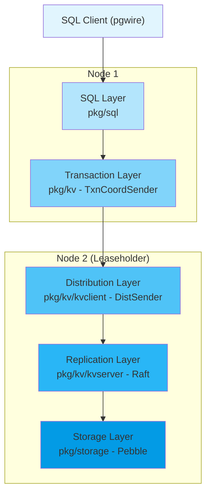
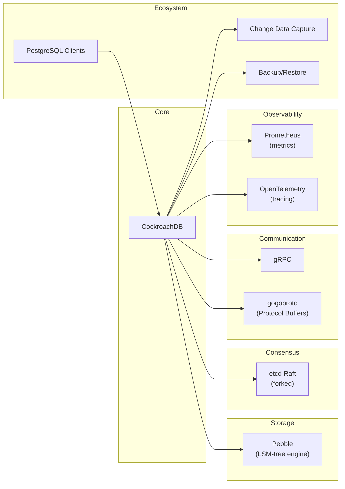

# CockroachDB

> A cloud-native, distributed SQL database designed for high availability, effortless scale, and control over data placement.

| Metadata | |
|---|---|
| Repository | https://github.com/cockroachdb/cockroach |
| License | Business Source License (BSL 1.1) / CockroachDB Community License |
| Primary Language | Go |
| Analyzed Release | `v26.1.0-rc.1` (2026) |
| Stars (approx.) | 31,823 |
| Generated by | Claude Opus 4.6 (Anthropic) |
| Generated on | 2026-02-08 |

## Overview

CockroachDB is a distributed SQL database that combines the relational data model, ACID transactions, and standard SQL interface with the horizontal scalability, fault tolerance, and geo-distribution capabilities traditionally found only in NoSQL systems. It achieves this through a layered architecture that translates SQL operations into distributed key-value operations, replicated across nodes using the Raft consensus protocol, and persisted to disk via the Pebble storage engine.

Problems it solves:

- Traditional relational databases cannot scale horizontally across multiple nodes or data centers without sacrificing transactional consistency
- Distributed NoSQL databases sacrifice SQL compatibility and ACID guarantees for scalability
- Geo-distributed applications need data locality control to minimize latency while maintaining global consistency
- Manual sharding of relational databases creates operational complexity and limits cross-shard transactions

Positioning:

CockroachDB competes with Google Spanner (its primary inspiration), Amazon Aurora, TiDB, YugabyteDB, and traditional databases like PostgreSQL. It differentiates itself by offering PostgreSQL wire-protocol compatibility with automatic sharding, built-in geo-partitioning, and serializable isolation without requiring specialized hardware (unlike Spanner's TrueTime). Compared to TiDB (MySQL-compatible) and YugabyteDB (also PostgreSQL-compatible), CockroachDB emphasizes geo-distribution and survivability guarantees. Since November 2024, CockroachDB has shifted from an open-core model to a unified enterprise license, with an Enterprise Free tier for smaller organizations.

## Architecture Overview

CockroachDB implements a layered architecture where each layer abstracts the complexity of the layers beneath it. At the top, the SQL layer parses, optimizes, and executes SQL queries. Below it, the Transaction layer ensures ACID semantics using MVCC timestamps. The Distribution layer splits data into ranges and routes requests to the correct nodes. The Replication layer uses Raft consensus to maintain copies of each range. At the bottom, the Storage layer persists data to disk using the Pebble LSM-tree engine.



## Core Components

### SQL Layer (`pkg/sql`)

- Responsibility: Parsing SQL statements, semantic analysis, query optimization, and query execution
- Key files: `pkg/sql/parser/sql.y` (grammar), `pkg/sql/conn_executor.go` (session management), `pkg/sql/opt/xform/optimizer.go` (cost-based optimizer), `pkg/sql/colexec/` (vectorized execution engine)
- Design patterns: Visitor pattern for AST traversal, Volcano/vectorized execution model, Cascades-style optimizer framework

The SQL layer is the entry point for all client interactions. It implements PostgreSQL wire protocol compatibility through the pgwire package (`pkg/sql/pgwire`). SQL statements are parsed by a yacc-generated parser (`pkg/sql/parser/sql.y`) into an abstract syntax tree (AST) defined in `pkg/sql/sem/tree`. The conn_executor (`pkg/sql/conn_executor.go`, approximately 200KB) manages client sessions and coordinates the execution pipeline.

The cost-based optimizer in `pkg/sql/opt/` uses a Cascades-style framework to explore equivalent query plans. The `pkg/sql/opt/xform/` package contains transformation rules (`explorer.go`, `coster.go`, `join_order_builder.go`) that enumerate join orderings, index selections, and distribution strategies. The optimizer produces a memo structure that compactly represents the search space of equivalent plans.

For execution, CockroachDB supports both a row-oriented engine and a vectorized columnar engine (`pkg/sql/colexec/`). The vectorized engine processes data in columnar batches, providing significant performance improvements for analytical queries. The DistSQL framework (`pkg/sql/distsql/`) distributes query execution across multiple nodes when beneficial, with physical planning handled by `pkg/sql/physicalplan/`.

### Transaction Layer (`pkg/kv`)

- Responsibility: Ensuring ACID transaction semantics across distributed operations using MVCC and hybrid logical clocks
- Key files: `pkg/kv/txn.go` (client-facing transaction API), `pkg/kv/kvclient/kvcoord/txn_coord_sender.go` (transaction coordinator), `pkg/kv/db.go` (KV client interface), `pkg/kv/kvserver/batcheval/cmd_end_transaction.go` (transaction commit)
- Design patterns: Coordinator pattern, optimistic concurrency control, write-intent tracking, parallel commits protocol

The transaction layer provides serializable isolation (the highest level in the SQL standard) using a combination of multi-version concurrency control (MVCC) and timestamp ordering. Each transaction is assigned a hybrid logical clock (HLC) timestamp at its start, and all of its reads and writes operate at that timestamp.

The TxnCoordSender (`pkg/kv/kvclient/kvcoord/`) is the core component that tracks the lifecycle of a transaction. It maintains a record of all keys written (write intents) and periodically heartbeats the transaction record to prevent it from being aborted by other transactions. Write intents are provisional values that other transactions can detect; they act as both locks and MVCC versions.

CockroachDB implements a Parallel Commits protocol that allows a transaction to commit in a single round-trip in the common case. When a transaction is ready to commit, it writes all of its intents and the commit record in parallel. The transaction is considered implicitly committed once all writes have been replicated via Raft, even before the transaction record is explicitly updated.

### Distribution Layer (`pkg/kv/kvclient`)

- Responsibility: Mapping key-value operations to the correct range replicas across the cluster
- Key files: `pkg/kv/kvclient/kvcoord/dist_sender.go` (request routing), `pkg/kv/kvclient/rangecache/` (range descriptor cache), `pkg/kv/range_lookup.go` (meta range lookups)
- Design patterns: Two-level routing index (meta1/meta2 ranges), client-side caching, transparent retry on lease transfers

The distribution layer provides the abstraction of a monolithic key-value store over a cluster of nodes. CockroachDB splits the entire key-space into contiguous ranges (default 512MB each), where each range is a unit of replication, distribution, and load balancing.

The DistSender (`pkg/kv/kvclient/kvcoord/dist_sender.go`) is the central routing component. It receives BatchRequests from the TxnCoordSender, resolves which ranges contain the requested keys using a two-level meta-range index (meta1 and meta2 ranges stored in the cluster itself), and routes the requests to the appropriate leaseholders. It maintains an in-memory range descriptor cache (`pkg/kv/kvclient/rangecache/`) to avoid repeated meta lookups.

When a range becomes too large, CockroachDB automatically splits it. When load is unevenly distributed, it merges underutilized ranges or rebalances replicas across nodes. The allocator (`pkg/kv/kvserver/allocator/`) makes these decisions based on storage capacity, range count, QPS, and locality constraints.

### Replication Layer (`pkg/kv/kvserver`, `pkg/raft`)

- Responsibility: Replicating range data across nodes using Raft consensus for fault tolerance
- Key files: `pkg/raft/raft.go` (Raft state machine), `pkg/kv/kvserver/replica.go` (range replica management), `pkg/kv/kvserver/store.go` (per-node store management), `pkg/kv/kvserver/replica_raft.go` (Raft integration)
- Design patterns: Raft consensus protocol, leader-based replication, range leases for read optimization

CockroachDB maintains its own fork of the etcd Raft library (`pkg/raft/`), which implements the core consensus algorithm including leader election, log replication, and membership changes. Each range forms an independent Raft group, typically with 3 or 5 replicas.

The Store (`pkg/kv/kvserver/store.go`, approximately 179KB) manages all ranges hosted on a single node. Each range replica is represented by the Replica struct (`pkg/kv/kvserver/replica.go`, approximately 128KB), which integrates with the Raft group and handles the proposal-commit cycle for writes.

Range leases are a critical optimization layered on top of Raft. While Raft requires a quorum for writes, the leaseholder can serve consistent reads without involving other replicas, since it is guaranteed to be up-to-date. Leases are either epoch-based (tied to node liveness) or expiration-based, managed through the lease acquisition protocol in the replica.

### Storage Layer (`pkg/storage`)

- Responsibility: Persisting key-value data to disk with MVCC semantics
- Key files: `pkg/storage/engine.go` (storage engine interface), `pkg/storage/pebble.go` (Pebble integration), `pkg/storage/mvcc.go` (MVCC operations), `pkg/storage/intent_interleaving_iter.go` (intent-aware iteration)
- Design patterns: LSM-tree (Log-Structured Merge tree), MVCC key encoding, write-ahead logging, sorted-string tables (SSTables)

The storage layer wraps the Pebble key-value engine, which is a pure Go LSM-tree implementation developed by Cockroach Labs as a replacement for RocksDB. Pebble provides high write throughput through its write-ahead log (WAL) and periodic compaction of sorted-string tables.

CockroachDB encodes MVCC data into Pebble keys by appending the HLC timestamp to the key. This means that multiple versions of the same key are stored as adjacent entries in the LSM tree, with newer versions appearing first. The `pkg/storage/engine_key.go` file defines the encoding scheme, and `pkg/storage/mvcc.go` provides high-level MVCC operations such as MVCCGet, MVCCPut, MVCCScan, and MVCCResolveWriteIntent.

The IntentInterleavingIter (`pkg/storage/intent_interleaving_iter.go`) is a specialized iterator that seamlessly handles both committed MVCC values and uncommitted write intents (stored in a separate lock table keyspace), presenting a unified view to upper layers.

### Server and RPC Layer (`pkg/server`, `pkg/rpc`)

- Responsibility: Node lifecycle management, inter-node communication, and HTTP/gRPC API serving
- Key files: `pkg/server/server.go` (node server), `pkg/server/config.go` (server configuration), `pkg/rpc/context.go` (RPC connection management)
- Design patterns: gRPC-based inter-node communication, connection pooling, TLS mutual authentication

The server layer bootstraps each CockroachDB node, initializing all subsystems (SQL, KV, storage) and exposing both the SQL pgwire endpoint and the inter-node gRPC endpoint. Every node in the cluster is symmetrical and can serve as a SQL gateway for any query.

Inter-node communication uses gRPC with Protocol Buffers serialization (using the gogoproto fork for better Go performance). The RPC layer handles connection management, flow control, and authentication. CockroachDB uses separate gRPC streams for Raft messages and Raft snapshots to prevent large snapshot transfers from blocking time-sensitive consensus messages.

## Data Flow

### SQL Query Execution (SELECT)

```mermaid
sequenceDiagram
    participant C as SQL Client
    participant PG as pgwire Gateway
    participant P as Parser
    participant OPT as Cost-Based Optimizer
    participant DE as DistSQL Engine
    participant DS as DistSender
    participant LS as Leaseholder Replica
    participant PEB as Pebble Engine

    C->>PG: SQL Query (SELECT)
    PG->>P: Parse SQL text
    P-->>PG: AST
    PG->>OPT: Optimize query plan
    OPT-->>PG: Physical plan
    PG->>DE: Execute plan
    DE->>DS: KV BatchRequest (Scan)
    DS->>DS: Resolve range from cache
    DS->>LS: Route to leaseholder
    LS->>PEB: MVCC Read at timestamp
    PEB-->>LS: Versioned KV pairs
    LS-->>DS: BatchResponse
    DS-->>DE: KV results
    DE-->>PG: Result rows
    PG-->>C: pgwire result set
```

### Distributed Write Transaction

```mermaid
sequenceDiagram
    participant C as SQL Client
    participant TC as TxnCoordSender
    participant DS as DistSender
    participant L1 as Leaseholder Range A
    participant L2 as Leaseholder Range B
    participant R as Raft Followers

    C->>TC: BEGIN; INSERT ...; UPDATE ...; COMMIT
    TC->>DS: Write intent (Range A)
    DS->>L1: BatchRequest with intent
    L1->>R: Raft Propose (write intent)
    R-->>L1: Raft Commit (quorum)
    L1-->>DS: Write acknowledged
    TC->>DS: Write intent (Range B)
    DS->>L2: BatchRequest with intent
    L2->>R: Raft Propose (write intent)
    R-->>L2: Raft Commit (quorum)
    L2-->>DS: Write acknowledged
    TC->>DS: Parallel Commit (EndTxn)
    DS->>L1: EndTxn + resolve intents
    L1->>R: Raft Propose (commit record)
    R-->>L1: Committed
    L1-->>DS: Transaction committed
    DS-->>TC: Commit confirmed
    TC-->>C: COMMIT OK
```

## Key Design Decisions

### 1. Monolithic Sorted Key-Value Map as Foundation

- Choice: Map all SQL tables, indexes, and system metadata into a single, sorted key-value namespace partitioned into ranges
- Rationale: A unified key-space simplifies the distribution and replication layers since they only need to manage one type of data structure. Range splits and merges work uniformly regardless of whether the data is a user table, a secondary index, or system metadata. This also enables cross-table transactions without special coordination.
- Trade-offs: The encoding of SQL rows into KV pairs introduces overhead for wide tables and requires careful key encoding design. Secondary index lookups may require additional KV reads. The abstraction boundary between SQL and KV can make certain SQL-specific storage optimizations harder to implement.

### 2. Raft Consensus per Range (Multi-Raft)

- Choice: Each range maintains its own independent Raft group rather than using a single global consensus group
- Rationale: Per-range Raft allows the system to scale the number of consensus groups linearly with data size. Each range can have its replicas on different sets of nodes, enabling fine-grained data placement. Leader election and log replication are scoped to individual ranges, limiting the blast radius of any single node failure.
- Trade-offs: Managing thousands of Raft groups per node creates overhead for heartbeats, leader elections, and log management. CockroachDB mitigates this with coalesced heartbeats and efficient Raft message batching. Cross-range transactions require a distributed commit protocol (Parallel Commits) since no single Raft group spans the entire transaction.

### 3. Range Leases for Consistent Reads

- Choice: Assign a single leaseholder to each range that can serve reads without Raft quorum
- Rationale: Raft requires a round-trip to a quorum for every operation, which would make reads unnecessarily expensive. Range leases guarantee that only one replica serves reads at any given time, ensuring consistency without the overhead of consensus for read-only operations. This dramatically reduces read latency.
- Trade-offs: Lease acquisition and renewal add complexity. Lease transfers during rebalancing can cause brief read unavailability. The leaseholder becomes a hot spot for read-heavy ranges (mitigated by follower reads for stale data). Epoch-based leases depend on the node liveness subsystem, which is itself a potential source of cascading failures.

### 4. Hybrid Logical Clocks for Causal Ordering

- Choice: Use hybrid logical clocks (HLC) combining physical wall-clock time with a logical counter, instead of Google Spanner's TrueTime
- Rationale: TrueTime requires specialized hardware (GPS receivers and atomic clocks) that limits deployment to Google's infrastructure. HLCs provide causal ordering guarantees without special hardware, making CockroachDB deployable on commodity servers and any cloud provider. The clock skew is bounded by a configurable maximum offset (default 500ms).
- Trade-offs: Unlike TrueTime, HLCs cannot provide strict external consistency without a wait period. CockroachDB handles this by restarting transactions whose timestamps conflict with observed clock skew, which can increase tail latency under high clock skew. Operators must ensure NTP is well-configured to keep clock skew within bounds.

### 5. Vectorized Columnar Execution Engine

- Choice: Implement a columnar vectorized execution engine alongside the traditional row-oriented Volcano model
- Rationale: Analytical queries that process large numbers of rows benefit dramatically from columnar batch processing, which improves CPU cache utilization and enables SIMD-like optimizations. CockroachDB converts row-oriented data from the KV layer into columnar batches in memory, gaining the performance benefits of columnar processing without changing the storage format.
- Trade-offs: Two execution engines increase code complexity and maintenance burden. The row-to-column and column-to-row conversions add overhead for small queries. Not all SQL operators have vectorized implementations, requiring fallback to the row engine in some cases. The columnar batches consume more memory due to materialization.

## Dependencies



## Testing Strategy

CockroachDB employs a comprehensive multi-level testing strategy that emphasizes correctness through randomization and metamorphic testing.

Unit tests: Standard Go testing framework with `_test.go` files colocated with source code throughout the `pkg/` directory. SQL-specific logic is tested using the data-driven test framework (`pkg/sql/logictest/`), which executes SQL statements and compares results against expected output files. CockroachDB also uses metamorphic testing extensively, where test runs randomly vary internal configuration parameters (e.g., batch sizes, merge thresholds, execution engine selection) to explore a wider state space with each run.

Integration tests: The `roachtest` framework (`pkg/cmd/roachtest/`) runs end-to-end tests against real multi-node clusters, exercising scenarios like node failures, network partitions, rolling upgrades, and workload simulations. The `kvnemesis` package (`pkg/kv/kvnemesis/`) performs randomized testing of the KV layer by generating arbitrary sequences of operations and verifying linearizability. SQL logic tests also run compatibility suites to verify PostgreSQL behavioral compatibility.

CI/CD: CockroachDB uses a combination of Bazel for hermetic builds (configured in `BUILD.bazel` files throughout the repository) and TeamCity for CI orchestration. The CI pipeline runs unit tests, race detector builds, lint checks, and a subset of roachtests on every pull request. Nightly runs execute the full roachtest suite, long-running stress tests, and performance benchmarks.

## Key Takeaways

1. Layered abstraction enables independent evolution: CockroachDB's strict layering (SQL, Transaction, Distribution, Replication, Storage) allows each layer to evolve independently. The SQL layer can add new features without modifying the KV layer, and the storage engine was swapped from RocksDB to Pebble without changes to upper layers. This architectural pattern is valuable for any complex system that needs to evolve over time while maintaining stability.

2. Per-shard consensus groups scale better than global consensus: Rather than using a single Raft group for the entire cluster, CockroachDB creates one Raft group per range (shard). This Multi-Raft approach enables horizontal scaling of both data and consensus, with each group operating independently. The lesson is that decomposing global coordination into many local coordination groups, with cross-group protocols only when necessary (e.g., distributed transactions), can achieve both correctness and scalability.

3. Optimistic concurrency with timestamp ordering reduces contention: CockroachDB's use of MVCC with timestamp ordering allows most read operations to proceed without acquiring locks. Conflicts are detected at commit time rather than at operation time, which reduces contention in workloads with low conflict rates. This demonstrates that in distributed systems, optimistic approaches often outperform pessimistic locking, particularly when the cost of coordination is high.

4. Metamorphic testing amplifies test coverage: By randomizing internal configuration parameters on each test run, CockroachDB effectively multiplies its test coverage without writing additional tests. This technique, where the same test exercises different code paths depending on random seeds, is applicable to any system with configurable behavior and is particularly valuable for distributed systems where the state space is too large to exhaustively test.

5. Hardware-independent clock synchronization broadens deployment: CockroachDB's choice of hybrid logical clocks over hardware-dependent solutions like TrueTime made the database deployable on any infrastructure. This demonstrates that accepting weaker timing guarantees (bounded clock skew vs. exact time) in exchange for broader applicability can be a winning architectural trade-off, especially when the system can gracefully handle the uncertainty through transaction restarts.

## References

- [CockroachDB Official Documentation - Architecture Overview](https://www.cockroachlabs.com/docs/stable/architecture/overview)
- [CockroachDB Design Document (docs/design.md)](https://github.com/cockroachdb/cockroach/blob/master/docs/design.md)
- [Life of a Distributed Transaction](https://www.cockroachlabs.com/docs/stable/architecture/life-of-a-distributed-transaction)
- [CockroachDB SQL Layer Documentation](https://www.cockroachlabs.com/docs/stable/architecture/sql-layer)
- [CockroachDB Distribution Layer Documentation](https://www.cockroachlabs.com/docs/stable/architecture/distribution-layer)
- [CockroachDB Replication Layer Documentation](https://www.cockroachlabs.com/docs/stable/architecture/replication-layer)
- [CockroachDB Storage Layer Documentation](https://www.cockroachlabs.com/docs/stable/architecture/storage-layer)
- [CockroachDB Transaction Layer Documentation](https://www.cockroachlabs.com/docs/stable/architecture/transaction-layer)
- [How We Built a Cost-Based SQL Optimizer](https://www.cockroachlabs.com/blog/building-cost-based-sql-optimizer/)
- [How We Built a Vectorized Execution Engine](https://www.cockroachlabs.com/blog/how-we-built-a-vectorized-execution-engine/)
- [Serializable, Lockless, Distributed: Isolation in CockroachDB](https://www.cockroachlabs.com/blog/serializable-lockless-distributed-isolation-cockroachdb/)
- [CockroachDB: The Resilient Geo-Distributed SQL Database (SIGMOD 2020)](https://dl.acm.org/doi/10.1145/3318464.3386134)
