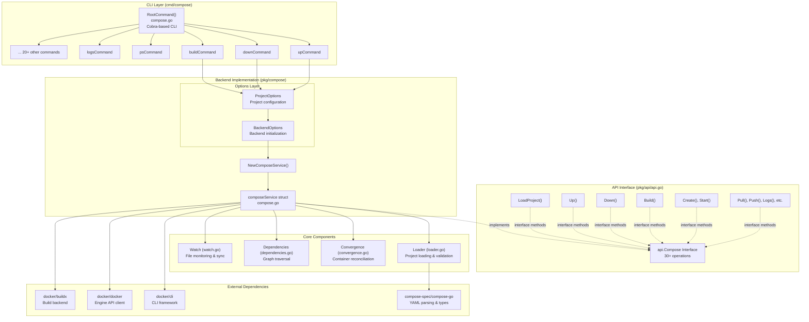
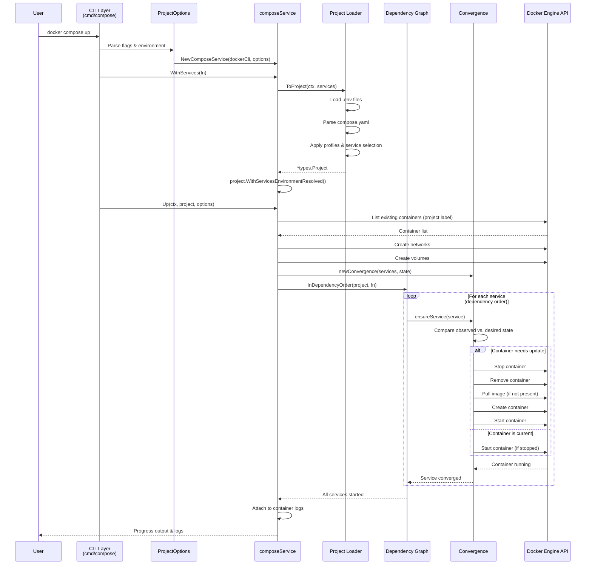
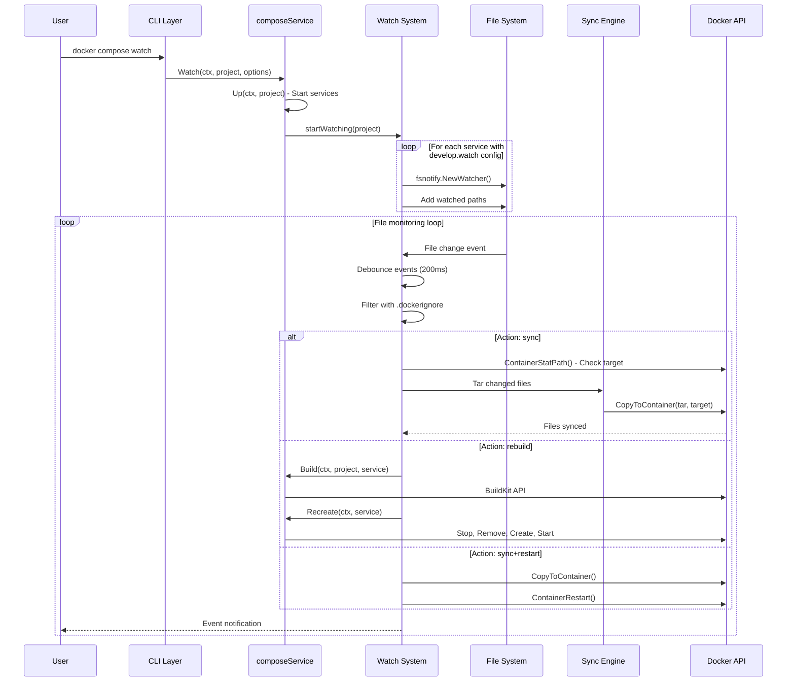
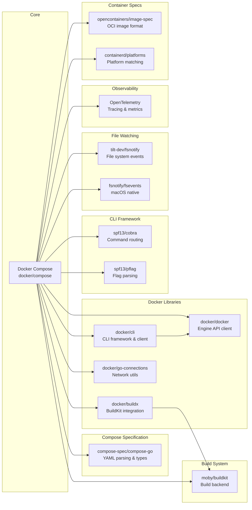

# Docker Compose

> Define and run multi-container applications with Docker

| Metadata | |
|---|---|
| Repository | https://github.com/docker/compose |
| License | Apache-2.0 |
| Primary Language | Go |
| Analyzed Release | `v5.0.2` (2026-01-21) |
| Stars (approx.) | 36,953 |
| Generated by | Claude Sonnet 4.5 (Anthropic) |
| Generated on | 2026-02-08 |

## Overview

Docker Compose is a tool for running multi-container applications on Docker defined using the Compose file format. It evolved from a Python-based implementation (v1) to a Go-based CLI plugin (v2+), deeply integrated with Docker CLI and capable of leveraging the entire Docker ecosystem. Compose v2 is now bundled with Docker Desktop and is available as a standalone plugin on Linux.

Problems it solves:

- Simplifying the orchestration of multi-container applications with a single YAML configuration file
- Managing service dependencies, networks, volumes, and environment variables declaratively
- Providing a unified workflow from development to production with consistent configurations
- Enabling efficient local development with features like file watching, live reload, and build caching

Positioning:

Docker Compose is the de facto standard for local container orchestration and development environments. While Kubernetes targets production-scale deployments, Compose focuses on simplicity and developer experience. It is bundled with Docker Desktop and widely adopted in CI/CD pipelines for integration testing.

## Architecture Overview

Docker Compose v2 follows a layered architecture with clear separation between CLI commands, the unified API interface, and the backend implementation. The core revolves around the api.Compose interface (30+ methods), implemented by the composeService struct that orchestrates Docker Engine API calls, container convergence logic, and resource lifecycle management.



## Core Components

### CLI Layer (`cmd/compose`)

- Responsibility: Command routing, flag parsing, environment setup, and user interaction
- Key files: `cmd/compose/compose.go`, `cmd/compose/up.go`, `cmd/compose/down.go`
- Design patterns: Command pattern (Cobra), Adapter pattern, Flag Group pattern

The `RootCommand()` function in `compose.go` constructs the root `docker compose` command and registers 30+ subcommands including `up`, `down`, `start`, `stop`, `build`, `logs`, `ps`, `exec`, `run`, `watch`, etc. Each command is defined as a separate Cobra command with its own flags and options.

The `ProjectOptions` struct encapsulates all project-level configuration:
- Project name, profiles, config file paths, working directory
- Environment files, compatibility mode, progress output mode
- Remote resource loading (Git, OCI registries)

The CLI layer uses the `AdaptCmd()` function to wrap CobraCommand functions with signal handling (SIGTERM, SIGINT) and context cancellation, ensuring graceful shutdown.

Configuration resolution follows priority: CLI flags > environment variables > config file (trivy.yaml precedent). Environment variables like `COMPOSE_PROJECT_NAME`, `COMPOSE_PARALLEL_LIMIT`, `COMPOSE_ANSI` control behavior.

### API Interface (`pkg/api/api.go`)

- Responsibility: Defining the public interface for programmatic use of Docker Compose
- Key files: `pkg/api/api.go`, `pkg/api/labels.go`, `pkg/api/event.go`
- Design patterns: Interface segregation, Event-driven architecture

The `api.Compose` interface defines 30+ operations that can be performed on a Compose project:
- Lifecycle: `Up()`, `Down()`, `Create()`, `Start()`, `Stop()`, `Restart()`, `Remove()`
- Build & Registry: `Build()`, `Push()`, `Pull()`, `Publish()`
- Runtime: `Exec()`, `Run()`, `Attach()`, `Logs()`, `Watch()`
- Inspection: `Ps()`, `List()`, `Images()`, `Top()`, `Events()`
- Utilities: `Scale()`, `Wait()`, `Copy()`, `Viz()`, `Generate()`

The interface separates concerns:
- All methods accept `context.Context` for cancellation
- Methods take service-specific options structs (`UpOptions`, `BuildOptions`, etc.)
- Project loading is separated: `LoadProject()` returns `*types.Project`

The `EventProcessor` interface enables progress reporting and UI integration:
```go
type EventProcessor interface {
    CreateProgress(context.Context) (Progress, error)
    CreateEvent(Event) error
}
```

This design allows embedding Compose as a library in other Go applications.

### Backend Implementation (`pkg/compose/compose.go`)

- Responsibility: Implementing the api.Compose interface with Docker Engine orchestration
- Key files: `pkg/compose/compose.go`, `pkg/compose/up.go`, `pkg/compose/down.go`
- Design patterns: Functional options pattern, Dependency injection, Strategy pattern

The `composeService` struct is the concrete implementation:
```go
type composeService struct {
    dockerCli      command.Cli          // Docker CLI client
    events         api.EventProcessor   // Progress reporting
    prompt         Prompt               // User confirmation
    maxConcurrency int                  // Parallel operation limit
    dryRun         bool                 // Dry run mode
    clock          clockwork.Clock      // Time abstraction (testability)
}
```

The constructor `NewComposeService()` uses functional options:
- `WithStreams()`: Custom I/O streams
- `WithPrompt()`: User interaction component
- `WithMaxConcurrency()`: Parallelism control
- `WithEventProcessor()`: Progress UI
- `WithDryRun()`: Read-only mode

The backend orchestrates multiple sub-systems:
- Container lifecycle management via Docker Engine API
- Image building via BuildKit/Buildx integration
- Network and volume provisioning
- Dependency graph resolution
- File watching and synchronization

### Project Loader (`pkg/compose/loader.go`)

- Responsibility: Loading, parsing, and validating Compose projects from YAML files
- Key files: `pkg/compose/loader.go`
- Design patterns: Builder pattern, Strategy pattern (ResourceLoader)

The `LoadProject()` method implements the complete loading pipeline:

1. Remote loader setup (Git, OCI registries) unless offline mode
2. Project options construction with layered configuration:
   - Working directory, OS environment
   - PWD environment variable injection
   - `.env` file loading (twice: from PWD and project dir)
   - `COMPOSE_FILE` environment variable
   - Default `compose.yaml` discovery
   - Profile activation
3. Project loading via `compose-go` library
4. Post-processing:
   - Service selection based on profiles and CLI args
   - Custom label injection (project name, version, config files)
   - Unused resource removal (networks, volumes)

Remote loaders enable including external Compose files:
```yaml
include:
  - path: git::https://github.com/user/repo.git#main
  - path: oci://registry.example.com/compose-config:latest
```

The loader supports `LoadListener` callbacks for metrics collection (e.g., counting `extends` and `include` usage).

### Convergence Engine (`pkg/compose/convergence.go`)

- Responsibility: Reconciling actual container state with desired state defined in Compose file
- Key files: `pkg/compose/convergence.go`, `pkg/compose/create.go`
- Design patterns: State reconciliation, Observer pattern

The `convergence` struct manages service container lifecycle:
```go
type convergence struct {
    compose    *composeService
    services   map[string]Containers  // Observed state per service
    networks   map[string]string      // Network name -> ID
    volumes    map[string]string      // Volume name -> ID
    stateMutex sync.Mutex            // Concurrent access protection
}
```

Convergence algorithm:
1. List existing containers for the project
2. Group containers by service name (via `com.docker.compose.service` label)
3. For each service, compare observed vs. desired state:
   - Container config hash changed? Recreate container
   - Container stopped? Start it
   - Too many replicas? Remove excess
   - Too few replicas? Create missing ones
4. Update dependencies (`depends_on`, `links`) with resolved container references
5. Execute operations in dependency order

The convergence engine handles:
- Rolling updates with `--no-deps` and `--force-recreate` flags
- Scale operations (adjusting replica count)
- Service health checks before proceeding with dependents
- Container renaming conflicts

### Dependency Graph (`pkg/compose/dependencies.go`)

- Responsibility: Topological sorting and parallel execution of service operations
- Key files: `pkg/compose/dependencies.go`
- Design patterns: Graph traversal, Visitor pattern

The dependency system uses graph algorithms:

`InDependencyOrder()`: Executes operations from leaves to roots (for `up`, `create`)
`InReverseDependencyOrder()`: Executes from roots to leaves (for `down`, `stop`)

The `graphTraversal` struct configures traversal:
```go
type graphTraversal struct {
    extremityNodesFn            func(*Graph) []*Vertex
    adjacentNodesFn             func(*Vertex) []*Vertex
    filterAdjacentByStatusFn    func(*Graph, string, ServiceStatus) []*Vertex
    targetServiceStatus         ServiceStatus
    adjacentServiceStatusToSkip ServiceStatus
    visitorFn                   func(context.Context, string) error
    maxConcurrency              int
}
```

Features:
- Parallel execution of independent services (controlled by `maxConcurrency`)
- Cycle detection in dependency graphs
- Service status tracking (started/stopped) to skip redundant operations
- Error propagation with context cancellation

Example: For `docker compose up`, services with no dependencies start first, and their dependents start only after they're running.

### Watch System (`pkg/compose/watch.go`, `pkg/watch`)

- Responsibility: File monitoring, live sync, and hot reload during development
- Key files: `pkg/compose/watch.go`, `pkg/watch/paths.go`, `pkg/watch/ephemeral.go`
- Design patterns: Observer pattern, Event aggregation

The watch feature (`docker compose watch`) monitors file changes and performs actions:

Actions:
- `sync`: Copy changed files into container (fast, no rebuild)
- `rebuild`: Rebuild image and recreate container
- `sync+restart`: Sync files and restart container

Configuration in `compose.yaml`:
```yaml
services:
  web:
    build: .
    develop:
      watch:
        - path: ./src
          action: sync
          target: /app/src
        - path: ./package.json
          action: rebuild
```

Implementation:
- Uses `fsnotify` (Linux/macOS) and `fsevents` (macOS) for file system events
- Debouncing: Aggregates multiple rapid changes into a single action
- `.dockerignore` support: Filters watched files
- Ephemeral container support: Watches and syncs without persisting changes

The watch system integrates with the convergence engine to handle container recreation intelligently.

### Build System (`pkg/compose/build.go`, `pkg/compose/build_bake.go`)

- Responsibility: Building Docker images from Dockerfiles using BuildKit
- Key files: `pkg/compose/build.go`, `pkg/compose/build_bake.go`, `pkg/compose/build_classic.go`
- Design patterns: Strategy pattern, Builder pattern

Compose v2 integrates deeply with Docker Buildx (BuildKit frontend):

`build_bake.go`: Uses BuildKit "bake" feature for efficient multi-service builds
- Converts Compose `build` configs to BuildKit bake definition
- Supports cross-service build caching
- Parallel builds with dependency ordering
- Multi-platform builds (`--platform`)

`build_classic.go`: Fallback to legacy Docker build API
- Used when BuildKit is unavailable or disabled
- Sequential builds

Build features:
- SSH agent forwarding (`ssh: default`)
- Secret mounting (`--secret`)
- Build arguments from environment
- Build context from Git/HTTP URLs
- Custom target stage selection
- Cache backends (registry, local, gha)

## Data Flow

### `docker compose up` Execution Flow



### `docker compose watch` Execution Flow



## Key Design Decisions

### 1. Go Implementation with CLI Plugin Architecture

- Choice: Rewrite Compose v2 in Go as a Docker CLI plugin instead of standalone Python tool
- Rationale:
  - Code sharing with Docker CLI and Moby project (Go ecosystem)
  - Tight integration with Docker CLI (`docker compose` vs. `docker-compose`)
  - Performance improvements (compiled binary vs. interpreted Python)
  - Unified authentication, context management, and configuration
  - Native support for BuildKit and modern Docker features
- Trade-offs:
  - Breaking changes from v1 (some flags removed/renamed)
  - Initial learning curve for contributors familiar with Python codebase
  - Plugin installation complexity on Linux (manual copy to `~/.docker/cli-plugins/`)

### 2. Functional Options Pattern for Service Configuration

- Choice: Use functional options (`WithStreams()`, `WithPrompt()`, etc.) instead of config structs
- Rationale:
  - Extensibility: New options can be added without breaking existing code
  - Optional parameters: Users provide only needed options
  - Composability: Options can be combined and reused
  - Testability: Easy to inject mock implementations
- Trade-offs:
  - Slightly more verbose initialization code
  - Options must be careful to avoid conflicting state
  - Less IDE autocomplete support compared to struct fields

### 3. Convergence-Based State Reconciliation

- Choice: Implement declarative reconciliation loop instead of imperative commands
- Rationale:
  - Idempotency: Running `docker compose up` multiple times is safe
  - Resilience: Automatically recovers from partial failures
  - Consistency: Ensures containers match the Compose file definition
  - Efficient updates: Only changed containers are recreated
- Trade-offs:
  - More complex implementation (state diff, hash comparison)
  - Slower initial implementation (need to list and inspect all containers)
  - Debugging is harder (implicit decisions about what to recreate)

### 4. Dependency Graph with Parallel Execution

- Choice: Use topological sort with parallel execution for independent services
- Rationale:
  - Performance: Start multiple services concurrently when possible
  - Correctness: Respect `depends_on` constraints
  - Flexibility: Support both `docker compose up` (forward) and `down` (reverse)
  - Scalability: Configurable parallelism via `COMPOSE_PARALLEL_LIMIT`
- Trade-offs:
  - Race conditions if services don't wait for health checks
  - Debugging is harder with parallel logs interleaved
  - Complex error handling (partial failures)

### 5. Unified API Interface for Programmatic Use

- Choice: Design `api.Compose` interface for library embedding, not just CLI use
- Rationale:
  - Enables third-party tools to embed Compose (e.g., Docker Desktop, testcontainers-go)
  - Separates CLI concerns from core logic
  - Easier testing with mock implementations
  - Supports alternative UIs (GUI, web, IDE extensions)
- Trade-offs:
  - More abstractions to maintain (interface + implementation)
  - Versioning complexity (API stability guarantees)
  - Additional documentation burden

### 6. Remote Resource Loading (Git, OCI)

- Choice: Support loading Compose files and configs from Git repos and OCI registries
- Rationale:
  - Configuration reuse across projects
  - Version-controlled shared configurations
  - Distribution of Compose files as artifacts
  - Enterprise use case: centralized policy enforcement
- Trade-offs:
  - Network dependency (offline mode needed)
  - Security concerns (trust of remote sources)
  - Complexity in caching and credential management

## Dependencies



Key dependencies:

1. compose-spec/compose-go (v2.10.1): Official Compose Specification parser and types. Handles YAML parsing, validation, interpolation, and type definitions for `types.Project`, `types.ServiceConfig`, etc.

2. docker/cli (v28.5.2): Docker CLI library providing `command.Cli` interface, context management, authentication, and flags framework. Compose extends CLI as a plugin.

3. docker/buildx (v0.30.1): BuildKit frontend integration. Provides "bake" functionality for efficient multi-service builds with advanced caching.

4. docker/docker (v28.5.2): Docker Engine API client. Used for all container, image, network, and volume operations.

5. moby/buildkit (v0.26.3): Modern build backend. Supports multi-stage builds, cache backends, secrets, SSH forwarding, and parallel builds.

6. spf13/cobra (v1.10.2): CLI framework. Provides command routing, help generation, flag parsing, and shell completion.

7. tilt-dev/fsnotify (v1.4.8): File system notification library (fork with performance improvements). Core of the watch feature.

8. OpenTelemetry (v1.38.0): Distributed tracing and metrics. Used for observability and performance monitoring.

## Testing Strategy

Docker Compose v2 employs a multi-layered testing approach with unit, integration, and end-to-end tests.

Unit tests: Located alongside source files (`*_test.go`). Focus on individual functions and methods. Mock dependencies using interfaces (e.g., `api.Compose` mock for CLI tests). Use `testify/assert` and `testify/require` for assertions. Example: `convergence_test.go` tests state reconciliation logic with mock containers.

Integration tests: Located in `pkg/e2e` directory. Use Docker-in-Docker or require Docker daemon. Test full command execution end-to-end. Example: Starting a project with `docker compose up` and verifying containers are created and running.

E2E tests: Execute actual CLI commands via `exec.Command()`. Parse command output (JSON, table formats). Verify side effects (container state, network creation). Cover scenarios like:
- Multi-service dependencies
- Volume mounts and persistence
- Environment variable interpolation
- Profiles and service selection
- Watch mode with file changes

Test helpers:
- `pkg/mocks`: Generated mocks using `uber-go/mock`
- `pkg/e2e`: Test utilities for Docker operations, cleanup, and assertions
- Fixtures: Sample Compose files in `pkg/e2e/fixtures/`

CI/CD: GitHub Actions workflows in `.github/workflows/`:
- `ci.yml`: Runs tests on Linux, Windows, macOS
- `build.yml`: Builds binaries for all platforms
- `release.yml`: Publishes releases to GitHub and Docker Hub
- `e2e.yml`: Extended E2E test suite

Code coverage: Codecov integration tracks coverage. Current coverage ~65-70% with focus on core logic (convergence, dependencies, loader).

## Key Takeaways

1. CLI Plugin Architecture Enables Tight Integration: By implementing Compose as a Docker CLI plugin rather than a standalone tool, the project gains unified authentication, context management, and configuration. This architecture allows seamless integration with Docker Desktop and third-party tools while maintaining a clean separation between CLI and core logic through the api.Compose interface.

2. Convergence Model Provides Idempotency and Resilience: The declarative reconciliation approach (comparing observed vs. desired state) makes `docker compose up` idempotent and self-healing. This design is inspired by Kubernetes controllers and enables features like automatic recovery from partial failures, efficient incremental updates, and safe re-execution.

3. Graph-Based Dependency Resolution with Parallel Execution: The dependency graph system using topological sort enables correct ordering (respecting `depends_on`) while maximizing parallelism for independent services. The bidirectional traversal (leaves-to-roots for `up`, roots-to-leaves for `down`) demonstrates how the same data structure can support different operation modes with configurable concurrency limits.

4. Functional Options Pattern for Extensible Configuration: The use of functional options (`WithStreams()`, `WithPrompt()`, `WithMaxConcurrency()`) instead of config structs provides extensibility without breaking changes, optional parameters without constructors, and easy dependency injection for testing. This pattern is increasingly common in Go libraries and worth adopting for similar use cases.

5. Watch System Bridges Development and Production Workflows: The watch feature with three action types (sync, rebuild, sync+restart) optimizes the development inner loop by minimizing container restarts. The sync action (file copying without rebuild) is particularly innovative, enabling sub-second feedback for interpreted languages while rebuild handles compiled languages correctly.

## References

- [Docker Compose Official Documentation](https://docs.docker.com/compose/)
- [Compose Specification](https://compose-spec.io/)
- [Docker Compose GitHub Repository](https://github.com/docker/compose)
- [Docker Compose v2 Overview - DeepWiki](https://deepwiki.com/docker/compose/1-docker-compose-v2-overview)
- [Announcing Compose V2 General Availability - Docker Blog](https://www.docker.com/blog/announcing-compose-v2-general-availability/)
- [Docker Compose API Go Package Documentation](https://pkg.go.dev/github.com/docker/compose/v5/pkg/api)
- [Docker Compose SDK Documentation](https://github.com/docker/compose/blob/main/docs/sdk.md)
