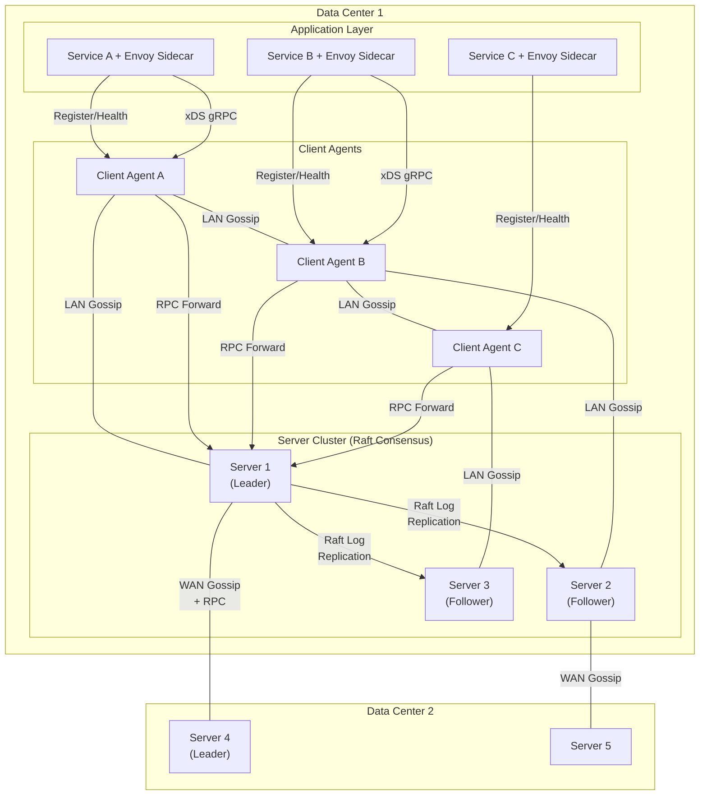
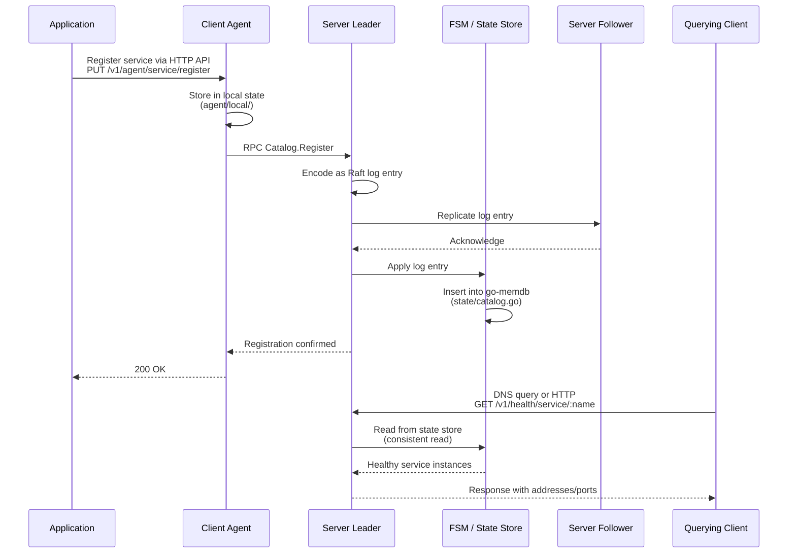
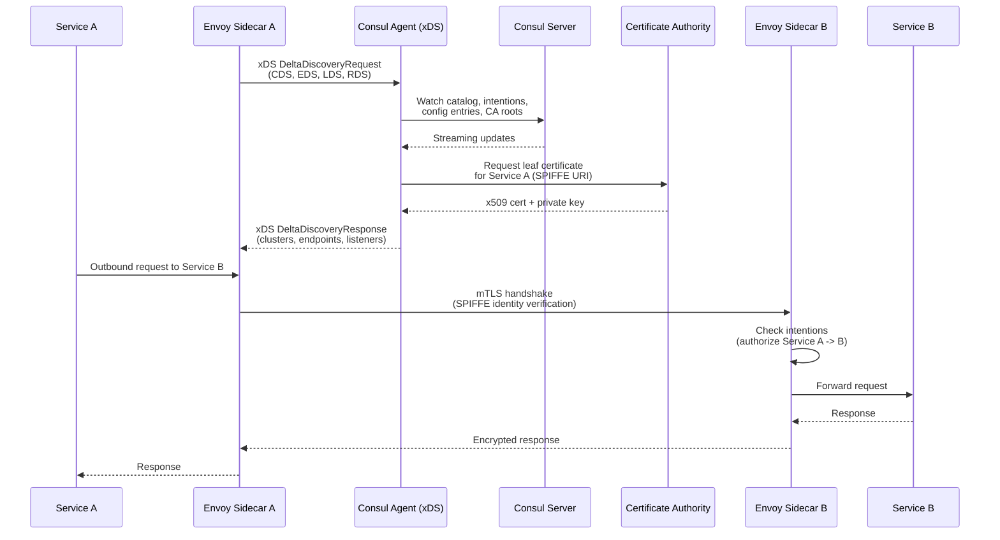
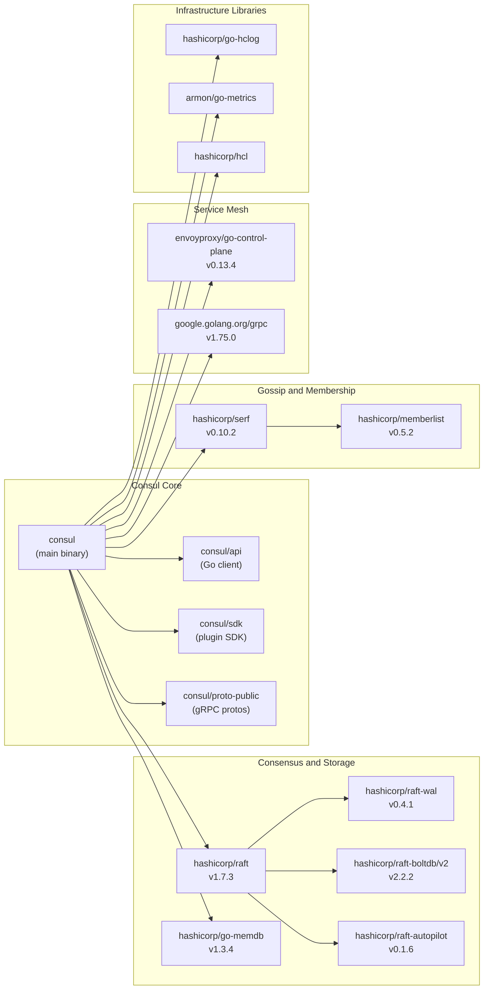

# Consul

> A distributed, highly available, and data center aware solution to connect and configure applications across dynamic, distributed infrastructure.

| Metadata | |
|---|---|
| Repository | https://github.com/hashicorp/consul |
| License | BUSL-1.1 |
| Primary Language | Go |
| Analyzed Release | `v1.22.3` (2026-01-23) |
| Stars (approx.) | 29,700 |
| Generated by | Claude Opus 4.6 (Anthropic) |
| Generated on | 2026-02-08 |

## Overview

Consul is HashiCorp's service networking platform that combines service discovery, service mesh, health checking, KV storage, and multi-datacenter federation into a single binary. It runs as a cluster of server nodes using Raft consensus for strong consistency, while client agents on application nodes participate in gossip-based membership and forward requests to servers. The architecture supports both traditional VM-based deployments and modern Kubernetes environments through Consul Dataplane.

Problems it solves:

- Service discovery in dynamic, ephemeral infrastructure where IP addresses and ports change frequently
- Secure service-to-service communication (mTLS) without application-level changes, via sidecar proxies and a built-in Certificate Authority
- Consistent configuration distribution and health-aware traffic routing across multiple data centers
- Multi-datacenter federation with a single pane of glass for globally distributed services

Positioning:

Consul occupies a unique position by combining service discovery (competing with etcd, ZooKeeper, and CoreDNS), service mesh (competing with Istio, Linkerd), and KV configuration (competing with etcd) into a unified platform. Unlike Istio, which is Kubernetes-native, Consul supports heterogeneous environments spanning VMs and containers. Its tight integration with other HashiCorp tools (Terraform, Vault, Nomad) makes it a natural choice within the HashiCorp ecosystem.

## Architecture Overview

Consul follows a distributed agent-based architecture where every node in the infrastructure runs a Consul agent in either server or client mode. Server agents form a Raft consensus cluster that maintains all state in an in-memory database (go-memdb). All agents participate in a gossip protocol (Serf/memberlist implementing SWIM) for membership management and failure detection. Service mesh functionality is implemented through Envoy sidecar proxies configured via the xDS API.

## Core Components

### Agent (`agent/agent.go`)

- Responsibility: The central long-running daemon process on every node, orchestrating all subsystems
- Key files: `agent/agent.go`, `agent/agent_endpoint.go`, `agent/apiserver.go`, `agent/config/builder.go`, `agent/config/runtime.go`
- Design patterns: Facade pattern (unified interface over subsystems), Dependency Injection (subsystem wiring at startup)

The Agent is the main entry point for every Consul process. It initializes and manages the HTTP API server, DNS server, gRPC server, and either a Server or Client delegate depending on the configured mode. It handles local service and check registration, manages the anti-entropy sync with servers via `agent/ae/`, and exposes endpoints for the CLI and UI. The Agent struct holds references to all subsystems and coordinates their lifecycle (start, reload, shutdown). Configuration is parsed by the builder in `agent/config/builder.go` and materialized into a `RuntimeConfig` struct used by all subsystems.

### Server / Raft Consensus (`agent/consul/server.go`)

- Responsibility: Maintaining strongly consistent cluster state via Raft, handling all write operations, leader election, and RPC endpoint dispatch
- Key files: `agent/consul/server.go`, `agent/consul/leader.go`, `agent/consul/rpc.go`, `agent/consul/catalog_endpoint.go`, `agent/consul/health_endpoint.go`, `agent/consul/acl_endpoint.go`
- Design patterns: Leader-Follower (Raft), Command pattern (RPC endpoints), State Machine (FSM)

The Server struct embeds a Raft instance (`hashicorp/raft` v1.7.3), two Serf instances (LAN and WAN gossip pools), and an in-memory state store. All mutations to cluster state flow through the Raft log: the leader receives an RPC request, encodes it as a log entry, replicates it to a quorum of followers, then applies it to the FSM. The server exposes both net/rpc-style and gRPC endpoints. It manages leader-specific routines such as ACL replication, config entry replication, federation state replication, and certificate authority rotation. Autopilot (`hashicorp/raft-autopilot` v0.1.6) automates server health monitoring and dead-server cleanup. The WAL-based LogStore (`hashicorp/raft-wal` v0.4.1) provides efficient append-only log persistence.

### FSM and State Store (`agent/consul/fsm/`, `agent/consul/state/`)

- Responsibility: Deterministic application of Raft log entries to an in-memory database, snapshot/restore for consistency recovery
- Key files: `agent/consul/fsm/fsm.go`, `agent/consul/fsm/commands_ce.go`, `agent/consul/fsm/snapshot.go`, `agent/consul/state/catalog.go`, `agent/consul/state/acl.go`, `agent/consul/state/config_entry.go`
- Design patterns: Finite State Machine, Command Dispatch (message type routing), MVCC (Multi-Version Concurrency Control via go-memdb)

The FSM implements `raft.FSM` and dispatches each log entry to a registered command handler based on `structs.MessageType`. Commands are registered at init-time via `registerCommand()`, creating a type-safe dispatch table. Each command mutates the State Store, which wraps `hashicorp/go-memdb` -- a radix-tree-based in-memory database with MVCC semantics. The state store organizes data into tables (nodes, services, checks, KV, ACLs, sessions, config entries, intentions) with compound indexes for efficient queries. Snapshots serialize the entire state for new server bootstrapping and Raft log compaction. The `stream.EventPublisher` emits change events for blocking queries and gRPC streaming.

### Gossip Layer / Serf Integration (`agent/consul/client_serf.go`, `agent/consul/flood.go`)

- Responsibility: Cluster membership management, failure detection, and event propagation using the SWIM protocol
- Key files: `agent/consul/client_serf.go`, `agent/consul/flood.go`, `agent/consul/server.go` (Serf initialization), `agent/router/`
- Design patterns: Gossip protocol (SWIM), Two-tier membership (LAN + WAN pools)

Consul maintains two gossip pools built on `hashicorp/serf` v0.10.2 and `hashicorp/memberlist` v0.5.2. The LAN pool operates within a single data center: all servers and clients exchange membership state, detect failures, and propagate events. The WAN pool connects only server nodes across data centers, enabling cross-DC service discovery and RPC forwarding. The `flood.go` mechanism bridges WAN and LAN pools by periodically copying LAN Serf members into the WAN pool. Memberlist implements SWIM (Scalable Weakly-consistent Infection-style Process Group Membership) with random probe targets, indirect pings for suspicion, and configurable probe intervals. Gossip convergence enables O(log N) failure detection for clusters with thousands of nodes.

### Service Mesh / Connect (`agent/xds/`, `agent/proxycfg/`, `agent/connect/`)

- Responsibility: Configuring Envoy sidecar proxies with TLS certificates, service discovery results, intentions (authorization), and L7 routing rules via the xDS API
- Key files: `agent/xds/delta.go`, `agent/xds/clusters.go`, `agent/xds/endpoints.go`, `agent/xds/listeners.go`, `agent/proxycfg/manager.go`, `agent/proxycfg/connect_proxy.go`, `agent/connect/ca/`
- Design patterns: Delta xDS (incremental streaming updates), Observer pattern (proxycfg watches data sources), Sidecar proxy pattern

The xDS subsystem implements Envoy's Aggregated Discovery Service (ADS) using incremental (delta) streaming via gRPC. The `delta.go` file handles the xDS protocol state machine, translating Consul's internal proxy configuration snapshots into Envoy-native Cluster, Endpoint, Listener, and Route resources. The `proxycfg` package maintains a per-proxy configuration snapshot by watching multiple data sources (catalog, config entries, intentions, CA roots, leaf certificates) and merging them into a consistent `ConfigSnapshot`. When any data source changes, the snapshot is rebuilt and pushed to any connected Envoy instance. The Connect subsystem manages the built-in Certificate Authority that issues SPIFFE-compatible x509 certificates for mTLS.

### ACL System (`acl/`, `agent/consul/acl.go`, `agent/consul/acl_endpoint.go`)

- Responsibility: Authentication and authorization for all API operations using tokens, policies, and roles
- Key files: `acl/authorizer.go`, `acl/policy.go`, `acl/policy_authorizer.go`, `agent/consul/acl.go`, `agent/consul/acl_endpoint.go`, `agent/consul/acl_replication.go`
- Design patterns: Chain of Responsibility (chained authorizers), Policy-based access control, Token-based authentication

The ACL subsystem implements a fine-grained permission model where tokens carry policies that define allowed operations on specific resources (services, nodes, KV paths, intentions, etc.). The `ChainedAuthorizer` evaluates authorization decisions through a chain: first checking the token's policies, then falling back to default policies. ACL state is replicated from the primary datacenter to secondaries via `acl_replication.go`, enabling local token resolution even during network partitions. The resolver caches token-to-policy mappings for performance while invalidating on changes.

## Data Flow

### Service Registration and Discovery

### Service Mesh mTLS Connection Establishment

## Key Design Decisions

### 1. Raft for Consensus with In-Memory State Store (go-memdb)

- Choice: Use Raft consensus protocol with an in-memory radix-tree database (go-memdb) rather than an on-disk database for the primary state store
- Rationale: All state mutations go through the Raft log, so the state can always be reconstructed from the log. go-memdb provides MVCC semantics with microsecond-level read latency, enabling high-throughput blocking queries. Snapshots allow log compaction without losing state.
- Trade-offs: Memory usage scales linearly with cluster state size (nodes, services, KV entries). Very large clusters with millions of KV entries can require significant server memory. However, read performance is exceptional since no disk I/O is involved for queries.

### 2. Two-Tier Gossip Protocol (LAN + WAN Pools)

- Choice: Maintain separate gossip pools for intra-datacenter (LAN) and inter-datacenter (WAN) communication using Serf/memberlist implementing SWIM
- Rationale: LAN gossip enables sub-second failure detection within a datacenter with minimal network overhead (O(log N) convergence). WAN gossip connects only servers across datacenters, keeping cross-DC traffic minimal while still enabling automatic datacenter discovery and federation.
- Trade-offs: Two separate gossip pools add operational complexity. The WAN pool only includes servers, so client agents cannot directly participate in cross-DC gossip. The flood mechanism that bridges LAN-to-WAN introduces a slight delay in cross-DC membership updates.

### 3. Envoy xDS for Service Mesh Data Plane

- Choice: Use Envoy as the default sidecar proxy and implement Envoy's xDS (discovery service) API for dynamic configuration, rather than building a custom proxy
- Rationale: Envoy is the industry-standard proxy with rich L7 features, observability, and a well-defined configuration API. By implementing xDS, Consul leverages the entire Envoy ecosystem while maintaining full control over the control plane. The delta (incremental) xDS protocol minimizes configuration push overhead.
- Trade-offs: Tight coupling to Envoy's API surface and release cadence. Envoy's memory and CPU footprint per sidecar adds resource overhead. The xDS translation layer (`agent/xds/`) is complex and must handle many proxy types (connect proxy, mesh gateway, ingress gateway, terminating gateway, API gateway).

### 4. Anti-Entropy Sync for Local State

- Choice: Implement an anti-entropy mechanism (`agent/ae/`) that periodically reconciles local agent state with the server catalog, rather than relying solely on event-driven registration
- Rationale: In distributed systems, messages can be lost. Anti-entropy provides an eventually-consistent safety net that ensures local agent state (registered services, health checks) is always reflected in the central catalog, even after network partitions or server leader changes.
- Trade-offs: Periodic full syncs generate additional RPC traffic. The sync interval must be tuned to balance consistency freshness against server load. During large-scale deployments, thundering herd effects on sync can spike server CPU.

### 5. BUSL License with CE/Enterprise Split in Source

- Choice: Maintain both Community Edition (CE) and Enterprise code in the same repository using build-tag-based file naming (`*_ce.go` vs enterprise files)
- Rationale: Single codebase reduces merge conflicts and ensures feature parity testing. The `_ce.go` suffix pattern provides compile-time separation without preprocessor directives. Enterprise features (namespaces, audit logging, advanced federation) are additive rather than forked.
- Trade-offs: Open source contributors must understand the CE/Enterprise boundary. Some architectural decisions are constrained by the need to support both editions. The BUSL-1.1 license restricts competitive use, which limits some community adoption paths.

## Dependencies

## Testing Strategy

Consul employs a multi-layered testing approach with extensive unit tests, integration tests, and end-to-end tests.

Unit tests: Co-located with source files (e.g., `agent/agent_test.go`, `agent/consul/server_test.go`, `agent/consul/fsm/fsm_test.go`). Tests use `testing.T` with helper packages like `agent/consul/state/*_test.go` for state store verification. Mock interfaces are generated using Mockery v3 for gRPC services and internal abstractions.

Integration tests: Located in `test/` and `test-integ/` directories. These spin up multi-node clusters with real Raft and Serf instances to verify cross-component behavior. The `testrpc/` package provides helpers for waiting until cluster leaders are elected and state is settled.

CI/CD: GitHub Actions workflows in `.github/workflows/` run tests on every PR. The build system uses `gotestsum` for structured test output with coverage tracking (`.github/go_test_coverage.txt`). The Makefile provides targets for running tests with race detection and specific build tags. Protobuf definitions are validated with `buf` (v1.56.0) and linting uses `golangci-lint` (v2.4.0).

## Key Takeaways

1. Raft + In-Memory DB as a proven pattern for strongly consistent distributed state: Consul demonstrates that combining a consensus protocol with an in-memory database (go-memdb with MVCC) yields both strong consistency and high read throughput. The FSM abstraction decouples state mutation logic from consensus mechanics, making the system testable and extensible. This pattern is applicable to any system requiring consistent distributed state with fast reads.

2. Layered protocol design for multi-datacenter systems: The two-tier gossip architecture (LAN for intra-DC, WAN for inter-DC) is an elegant solution for scaling distributed systems across geographic boundaries. By restricting cross-DC gossip to server nodes only, Consul minimizes WAN bandwidth while maintaining automatic datacenter discovery. This principle of using different communication protocols at different network layers is broadly applicable.

3. Control plane / data plane separation via standard APIs: By implementing Envoy's xDS API rather than building a custom proxy, Consul cleanly separates the control plane (configuration, policy, discovery) from the data plane (actual traffic proxying). This allows independent evolution of both planes and leverages the Envoy ecosystem. The lesson: when an industry-standard interface exists, implementing it is often better than inventing a proprietary one.

4. Anti-entropy as a reliability mechanism: The anti-entropy sync (`agent/ae/`) provides a critical safety net in distributed systems. Rather than relying solely on event-driven state propagation (which can lose messages), periodic reconciliation ensures eventual consistency. This defensive programming pattern is valuable in any distributed system where network reliability cannot be guaranteed.

5. Build-tag-based edition separation for multi-tier products: The `_ce.go` / enterprise file naming convention allows Consul to maintain a single codebase for both open-source and commercial editions without preprocessor macros. This Go-idiomatic approach uses build constraints for compile-time separation, keeping the repository unified while enabling different feature sets. This pattern is useful for any project that needs to ship multiple editions from one codebase.

## References

- [Consul Official Documentation](https://developer.hashicorp.com/consul/docs)
- [Consul Architecture Overview](https://developer.hashicorp.com/consul/docs/architecture)
- [Consul Consensus Protocol (Raft)](https://developer.hashicorp.com/consul/docs/architecture/consensus)
- [Consul Gossip Protocol](https://notes.kodekloud.com/docs/HashiCorp-Certified-Consul-Associate-Certification/Explain-Consul-Architecture/Gossip-Protocol-Serf/page)
- [Consul Reference Architecture](https://developer.hashicorp.com/consul/tutorials/production-vms/reference-architecture)
- [Consul Dataplane Architecture](https://developer.hashicorp.com/consul/docs/architecture/control-plane/dataplane)
- [HashiCorp Raft Library](https://github.com/hashicorp/raft)
- [Envoy xDS Protocol](https://www.envoyproxy.io/docs/envoy/latest/api-docs/xds_protocol)
- [Consul Source Code (GitHub)](https://github.com/hashicorp/consul)
