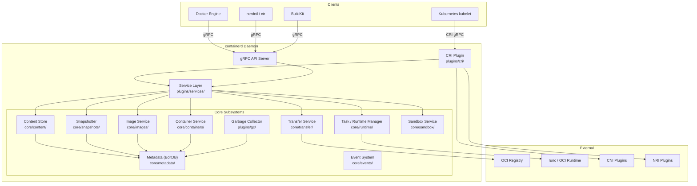
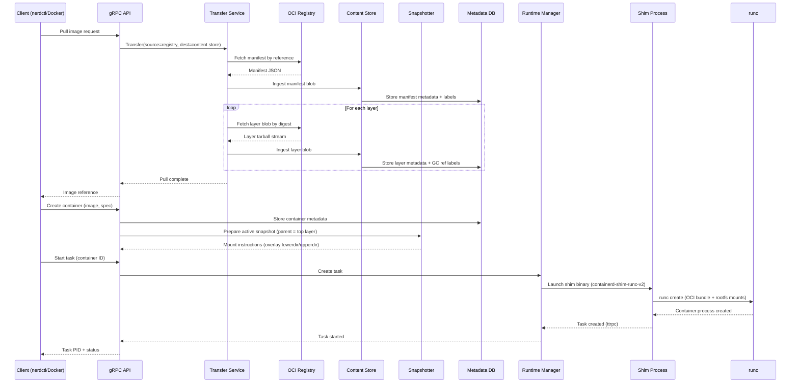
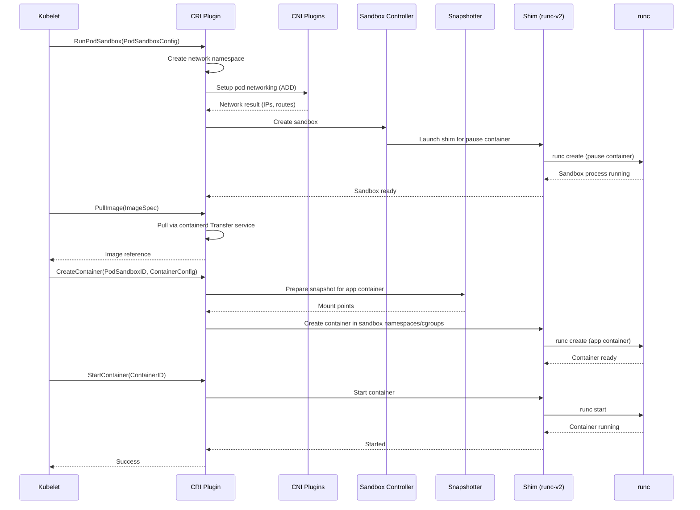
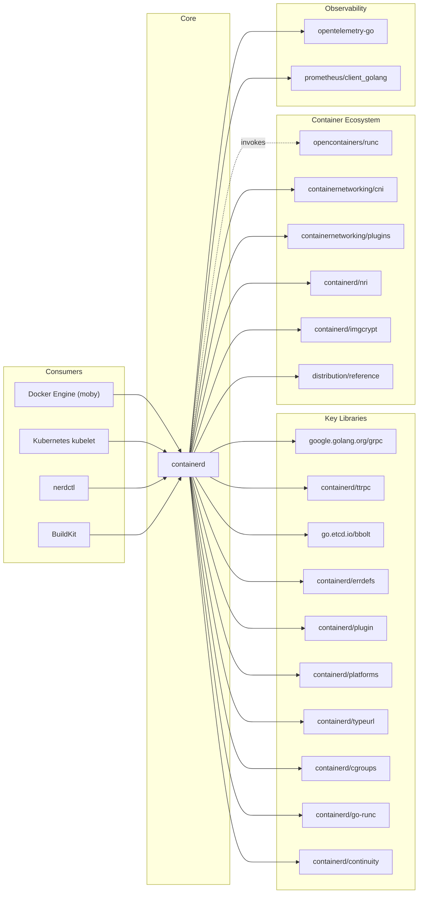

# containerd

> An industry-standard container runtime with an emphasis on simplicity, robustness, and portability

| Metadata | |
|---|---|
| Repository | https://github.com/containerd/containerd |
| License | Apache License 2.0 |
| Primary Language | Go |
| Analyzed Release | `v2.2.1` (2025-12-18) |
| Stars (approx.) | 20,200 |
| Generated by | Claude Opus 4.6 (Anthropic) |
| Generated on | 2026-02-08 |

## Overview

containerd is a CNCF graduated container runtime daemon for Linux and Windows that manages the complete container lifecycle on a host system: image transfer and storage, container execution and supervision, low-level storage via snapshotters, and network attachments. Originally extracted from Docker in 2015 and donated to the CNCF, containerd serves as the foundational runtime layer that higher-level container platforms build upon.

Problems it solves:

- Provides a stable, minimal, and auditable container runtime that decouples lifecycle management from higher-level orchestration concerns such as build, networking, and volume management
- Offers a namespaced, multi-tenant API via gRPC so that multiple consumers (Docker Engine, Kubernetes via CRI, nerdctl, BuildKit) can share a single daemon without resource conflicts
- Abstracts low-level OCI runtime execution (runc) behind a shim model, enabling pluggable runtimes (gVisor, Kata Containers, Firecracker) without modifying the daemon itself

Positioning:

containerd sits between high-level platforms (Docker Engine, Kubernetes kubelet, nerdctl) and low-level OCI runtimes (runc, crun, youki). Docker Engine embeds containerd as its core runtime. Kubernetes communicates with containerd through the CRI plugin, which replaced the legacy dockershim path. Compared to CRI-O, which is CRI-only, containerd is a general-purpose runtime with a broader plugin ecosystem and client library. Podman takes a different approach entirely by running daemonless, whereas containerd operates as a long-running daemon.

## Architecture Overview

containerd follows a smart client / thin daemon architecture. The daemon exposes low-level primitives (content store, snapshots, tasks, events) via a gRPC API, while higher-level logic (image resolution, spec generation, registry interaction) is pushed to client libraries. Internally, the daemon is decomposed into a plugin system where every major subsystem (content store, snapshotter, runtime, metadata, CRI, garbage collection) is a registered plugin with typed dependencies.

## Core Components

### Plugin System (`plugins/types.go`, `cmd/containerd/`)

- Responsibility: Plugin registration, initialization ordering, dependency resolution, and lifecycle management for all daemon subsystems
- Key files: `plugins/types.go`, `cmd/containerd/builtins_linux.go`, `cmd/containerd/main.go`
- Design patterns: Plugin Registry, Dependency Injection, Type-based dispatch

containerd is built entirely on a plugin architecture. Every subsystem (content store, snapshotter, runtime, metadata, gRPC services, CRI) is a plugin identified by a type and ID string such as `io.containerd.content.v1.content` or `io.containerd.snapshotter.v1.overlayfs`. At startup the daemon resolves a dependency graph among registered plugins and initializes them in topological order. Plugins can be built-in (compiled into the binary), proxy (communicating via a local gRPC socket), or binary (external executables). The command `ctr plugins ls` exposes the full plugin inventory. Configuration for each plugin lives under `[plugins."<type>.<id>"]` in the TOML config file at `/etc/containerd/config.toml`.

### Content Store (`core/content/`, `plugins/content/`)

- Responsibility: Content-addressable storage for all OCI blobs (manifests, configs, layer tarballs)
- Key files: `core/content/store.go`, `core/content/helpers.go`, `plugins/content/local/`
- Design patterns: Content-Addressable Storage, Ingestion pipeline with writer/commit semantics

The content store manages all immutable data referenced by digest. When an image is pulled, each blob (manifest, config JSON, layer tarball) is written through an ingestion pipeline: a writer is opened with an expected digest, data is streamed in, and on commit the final digest is verified. Content is stored on disk at `/var/lib/containerd/io.containerd.content.v1.content/blobs/<algorithm>/<hex>`. The store supports garbage collection labels (`containerd.io/gc.ref.content.*`) that declare reference relationships so the GC can determine reachability. Proxy content store plugins can delegate storage to remote systems.

### Snapshotter (`core/snapshots/`, `plugins/snapshots/`)

- Responsibility: Managing layered, copy-on-write filesystems that become container root filesystems
- Key files: `core/snapshots/snapshotter.go`, `plugins/snapshots/overlay/`, `plugins/snapshots/native/`, `plugins/snapshots/btrfs/`
- Design patterns: Strategy pattern (swappable backends), Parent-chain layering, Prepare/Commit/View lifecycle

Snapshotters translate OCI image layers into mountable filesystems. The interface defines three states: Active (read-write, being populated), Committed (immutable, reusable as a parent), and View (read-only mount of a committed snapshot). When an image is unpacked, each layer diff is applied on top of its parent snapshot and committed. To run a container, a new active snapshot is prepared on top of the final committed layer, producing mount instructions (e.g., overlay lowerdir/upperdir/workdir). Built-in snapshotters include overlayfs (default on Linux), native (simple copy), btrfs, blockfile, devmapper, ZFS, EROFS, and Windows. Remote snapshotters (e.g., stargz-snapshotter for lazy pulling) can be plugged in as proxy plugins via gRPC.

### Runtime and Shim Manager (`core/runtime/`, `core/runtime/v2/`)

- Responsibility: Container process lifecycle management including create, start, pause, resume, kill, delete, and exec operations
- Key files: `core/runtime/v2/shim_manager.go`, `core/runtime/v2/task_manager.go`, `core/runtime/v2/bundle.go`, `core/runtime/v2/shim.go`
- Design patterns: Shim process model (out-of-process), Binary resolution, ttrpc communication

containerd does not directly call runc. Instead it uses a shim process model (runtime v2). When a container is created, containerd resolves the configured runtime (default `io.containerd.runc.v2`) to a binary on the system (`containerd-shim-runc-v2`). This binary is launched as a separate process that:

1. Creates an OCI bundle directory under `/run/containerd/io.containerd.runtime.v2.task/<namespace>/<id>/`
2. Invokes runc (or another OCI runtime) to create/start the container process
3. Stays alive as a lightweight daemon communicating with containerd over ttrpc (a lighter-weight alternative to gRPC)

This shim model provides crash isolation: if containerd restarts, running containers remain alive because the shim holds the container process. On daemon restart, containerd re-discovers existing shims and reconnects. The shim also handles stdio forwarding, exit status collection, and OOM event monitoring.

### CRI Plugin (`plugins/cri/`, `internal/cri/`)

- Responsibility: Implementing the Kubernetes Container Runtime Interface so that kubelet can use containerd as its container runtime
- Key files: `plugins/cri/cri.go`, `internal/cri/server/`, `internal/cri/server/sandbox/`, `internal/cri/server/images/`
- Design patterns: Adapter pattern (CRI gRPC to containerd internals), Sandbox controller abstraction

The CRI plugin is a built-in containerd plugin that serves the Kubernetes CRI gRPC API on the same socket as the main containerd API. It translates kubelet requests (RunPodSandbox, CreateContainer, PullImage, etc.) into containerd internal operations. Pod creation involves: creating a network namespace, configuring it via CNI, launching a pause container (sandbox) via the sandbox controller, then creating application containers within that sandbox's namespaces and cgroups. In containerd 2.x, the CRI plugin uses the stable sandbox service with its own controller abstraction, enabling alternative sandbox implementations (e.g., VM-based sandboxes for Kata Containers).

### Metadata Store (`core/metadata/`, `plugins/metadata/`)

- Responsibility: Persisting all metadata (images, containers, snapshots, leases, namespaces) in a fully namespaced BoltDB database
- Key files: `core/metadata/db.go`, `core/metadata/images.go`, `core/metadata/containers.go`, `core/metadata/snapshot.go`
- Design patterns: Repository pattern, BoltDB bucket hierarchy per namespace, MVCC via single-writer

All metadata in containerd is stored in a single BoltDB file at `/var/lib/containerd/io.containerd.metadata.v1.bolt/meta.db`. The database is organized as a hierarchy of buckets: top-level namespace buckets contain sub-buckets for images, containers, snapshots, content references, and leases. BoltDB provides serializable isolation with one concurrent writer and multiple readers, which simplifies consistency. The metadata store wraps the underlying content store and snapshotters so that namespace isolation is enforced at this layer. Garbage collection labels stored in metadata drive the reachability analysis for the GC.

### Garbage Collector (`plugins/gc/`)

- Responsibility: Automatically reclaiming unreferenced content blobs, snapshots, and other resources
- Key files: `plugins/gc/scheduler.go`, `core/metadata/gc.go`
- Design patterns: Mark-and-sweep via label-based reference graph, Background scheduling with configurable thresholds

The garbage collector runs on a background goroutine using a scheduler that balances collection frequency against database lock time. It defaults to keeping the database unlocked 98% of the time. The GC traverses the reference graph defined by `containerd.io/gc.ref.*` labels on content and snapshot resources, performing a mark-and-sweep to remove unreachable blobs and snapshots. Clients protect in-flight resources using leases (short-lived references with optional TTL) to prevent premature collection. Synchronous GC can also be triggered explicitly on image or lease deletion.

### Transfer Service (`core/transfer/`, `plugins/transfer/`)

- Responsibility: Providing a unified interface to transfer artifact objects between sources and destinations (registries, local tar, content store)
- Key files: `core/transfer/transfer.go`, `plugins/transfer/`, `client/transfer.go`
- Design patterns: Source/Destination abstraction, Binary streaming channels

Stabilized in containerd 2.0, the transfer service replaces fragmented pull/push/import/export code paths with a single API. It models operations as transferring data from a source to a destination, where sources and destinations can be OCI registries, local tar archives, or the content store itself. The API uses binary streams as first-class citizens, inspired by the libchan project. Image verifier plugins can hook into the transfer pipeline to enforce policy (e.g., signature verification) before content is accepted.

## Data Flow

### Container Image Pull and Container Start

### Kubernetes Pod Creation via CRI

## Key Design Decisions

### 1. Smart Client / Thin Daemon Architecture

- Choice: Push high-level logic (spec generation, registry name resolution, image format handling) to client libraries; keep the daemon focused on low-level primitives (content store, snapshots, tasks, events)
- Rationale: Minimizes the daemon's attack surface and complexity. Clients can evolve independently (Docker, nerdctl, BuildKit each have different needs) without requiring daemon changes. The daemon remains stable and auditable.
- Trade-offs: Clients must implement more logic, leading to potential inconsistencies across different client implementations. Upgrading behavior requires updating client libraries, not just the daemon.

### 2. Out-of-Process Shim Model (Runtime v2)

- Choice: Each container's lifecycle is managed by a dedicated shim process that communicates with containerd via ttrpc, rather than containerd directly managing container processes
- Rationale: Provides crash isolation between the daemon and running containers. containerd can restart (for upgrades or recovery) without killing running containers. The shim also abstracts the OCI runtime, allowing runc, crun, gVisor (runsc), Kata, and other runtimes to be used transparently.
- Trade-offs: Additional per-container process overhead (one shim per container). Debugging requires understanding the three-layer process hierarchy (containerd -> shim -> runc -> container). The ttrpc protocol adds a communication layer, though it is lighter than full gRPC.

### 3. Content-Addressable Storage with Label-Based GC

- Choice: Store all image data as content-addressed blobs with garbage collection driven by label-based reference graphs rather than reference counting
- Rationale: Content addressing enables natural deduplication across namespaces and images. Label-based references are more flexible than hard-coded relationships, allowing clients to define custom reference structures (e.g., OCI index -> manifest -> config + layers). The GC scheduler adaptively balances throughput vs. pause time.
- Trade-offs: Clients must correctly set GC labels or risk premature collection. Leases add complexity for long-running operations. The single BoltDB writer can become a bottleneck under extremely high metadata write loads.

### 4. Fully Namespaced Multi-Tenancy

- Choice: All API operations require a namespace context. Resources (images, containers, snapshots) are isolated per namespace, while underlying content blobs are shared via content addressing
- Rationale: Enables multiple independent consumers (Docker, Kubernetes CRI, BuildKit, custom clients) to share a single containerd daemon without resource naming conflicts. Docker containers and Kubernetes pods can coexist on the same host.
- Trade-offs: Namespaces are an administrative boundary, not a security boundary. Any client with socket access can switch namespaces. Content sharing across namespaces means a blob pulled in one namespace is available (by digest) in another.

### 5. Pluggable Snapshotter Interface

- Choice: Define a generic Snapshotter interface with a Prepare/Commit/View lifecycle, allowing backend-specific implementations to be swapped via configuration or proxy plugins
- Rationale: Different environments need different storage drivers: overlayfs for general Linux, devicemapper for block-level isolation, btrfs for CoW-native filesystems, remote snapshotters (stargz, nydus) for lazy image pulling. The uniform interface lets containerd remain storage-agnostic.
- Trade-offs: The lowest-common-denominator interface may not expose advanced features of specific filesystems. Proxy snapshotters introduce network round-trips. Testing across all snapshotter backends adds CI complexity.

## Dependencies

## Testing Strategy

containerd employs a multi-layered testing approach that covers individual subsystems, cross-component integration, and full Kubernetes compatibility.

Unit tests: Each package contains `_test.go` files alongside source code. Tests cover plugin initialization, content store operations, snapshot lifecycle, metadata CRUD, and GC label resolution. Mock implementations of interfaces (e.g., mock snapshotters) are used to test components in isolation. Run via `make test`.

Integration tests: The `integration/` directory contains end-to-end tests that start a real containerd daemon and exercise full workflows: pulling images from registries, creating and running containers, verifying snapshot states, and testing CRI operations. These tests require root privileges and a running containerd instance. The `internal/cri/` directory contains CRI-specific integration tests that simulate kubelet interactions. Run via `make integration`.

CI/CD: GitHub Actions workflows run on every merge group event. The CI matrix covers Linux (amd64, arm64), Windows, and FreeBSD builds. Nightly builds produce binaries from the `main` branch. Kubernetes compatibility is tracked via the CNCF TestGrid dashboard (`testgrid.k8s.io/containerd`), which runs containerd against multiple Kubernetes versions. Code quality is enforced via golangci-lint (`.golangci.yml`), and link checking validates documentation integrity.

## Key Takeaways

1. Primitives over abstractions: containerd deliberately exposes low-level primitives (content blobs, snapshots, mount structs, task handles) instead of high-level abstractions (build, volumes, logging). This keeps the daemon's scope narrow and stable while giving clients maximum flexibility. The explicit SCOPE.md document with a required 100% maintainer vote to change scope is a governance pattern worth studying for any infrastructure project.

2. Plugin-all-the-things for extensibility: By making every internal subsystem a plugin with typed dependencies, containerd achieves both modularity and extensibility without sacrificing cohesion. Internal and external plugins are treated identically. The proxy plugin pattern (exposing a gRPC socket for external implementations) is an elegant way to extend a daemon without recompilation or dynamic loading.

3. Crash-isolated shim process model: The runtime v2 shim design, where each container gets its own long-lived process communicating over ttrpc, provides remarkable resilience. Daemon restarts, upgrades, and crashes do not affect running containers. This pattern of delegating stateful process management to per-resource sidecar processes is applicable to any system that must survive its own restarts.

4. Content-addressed deduplication across tenants: By separating namespace-scoped metadata from content-addressed blob storage, containerd achieves both multi-tenancy and storage efficiency. Two namespaces pulling the same image share the same blobs on disk. The label-based garbage collection graph is a flexible alternative to hard-coded foreign-key relationships that works well for evolving data models.

5. Adaptive garbage collection scheduling: Rather than using fixed intervals or aggressive immediate collection, containerd's GC scheduler dynamically adjusts its frequency based on observed database lock times, targeting a configurable pause-time threshold (default 2%). This self-tuning approach prevents GC from becoming a performance bottleneck while still reclaiming resources promptly after deletions.

## References

- [containerd Official Website](https://containerd.io/)
- [containerd GitHub Repository](https://github.com/containerd/containerd)
- [containerd SCOPE.md - Project Scope and Principles](https://github.com/containerd/containerd/blob/main/SCOPE.md)
- [containerd Plugins Documentation](https://github.com/containerd/containerd/blob/main/docs/PLUGINS.md)
- [CRI Plugin Architecture](https://github.com/containerd/containerd/blob/main/docs/cri/architecture.md)
- [Content Flow Documentation](https://github.com/containerd/containerd/blob/main/docs/content-flow.md)
- [Garbage Collection Documentation](https://github.com/containerd/containerd/blob/main/docs/garbage-collection.md)
- [containerd 2.0 Release Notes](https://github.com/containerd/containerd/blob/main/docs/containerd-2.0.md)
- [Namespaces and Multi-Tenancy](https://github.com/containerd/containerd/blob/main/docs/namespaces.md)
- [Transfer Service Documentation](https://github.com/containerd/containerd/blob/main/docs/transfer.md)
- [Getting Started Guide](https://github.com/containerd/containerd/blob/main/docs/getting-started.md)
- [containerd vs. Docker (Docker Blog)](https://www.docker.com/blog/containerd-vs-docker/)
- [Understanding Kubernetes Container Runtime: CRI, Containerd and Runc](https://devoriales.com/post/318/understanding-kubernetes-container-runtime-cri-containerd-and-runc-explained)
