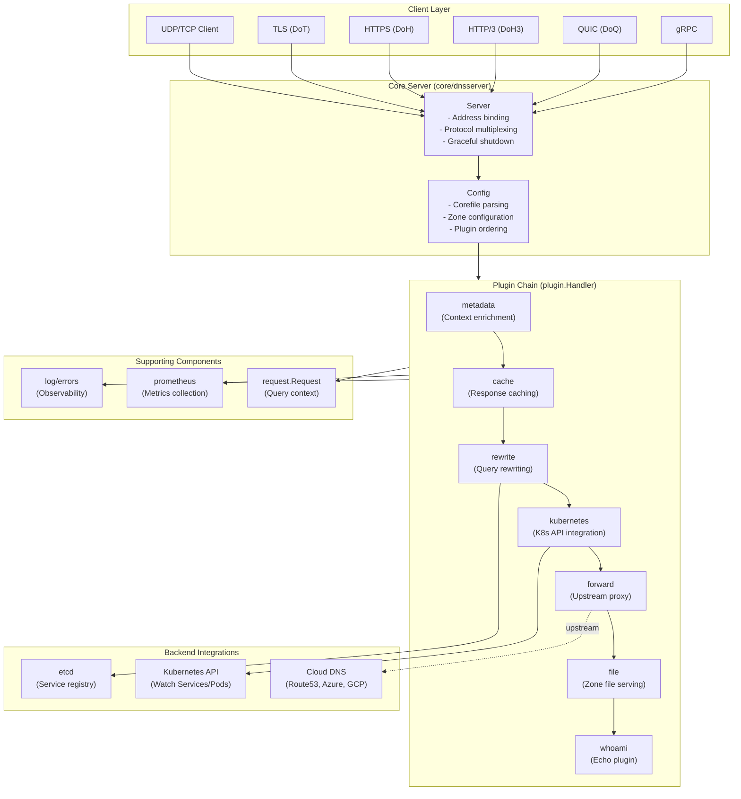
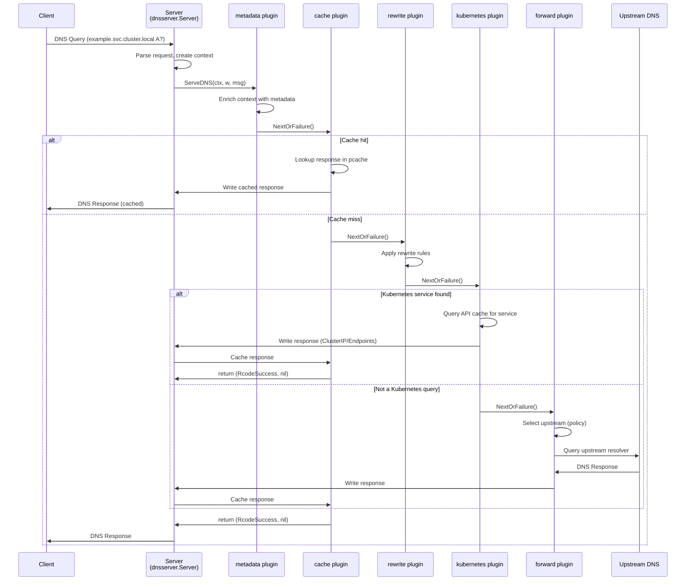
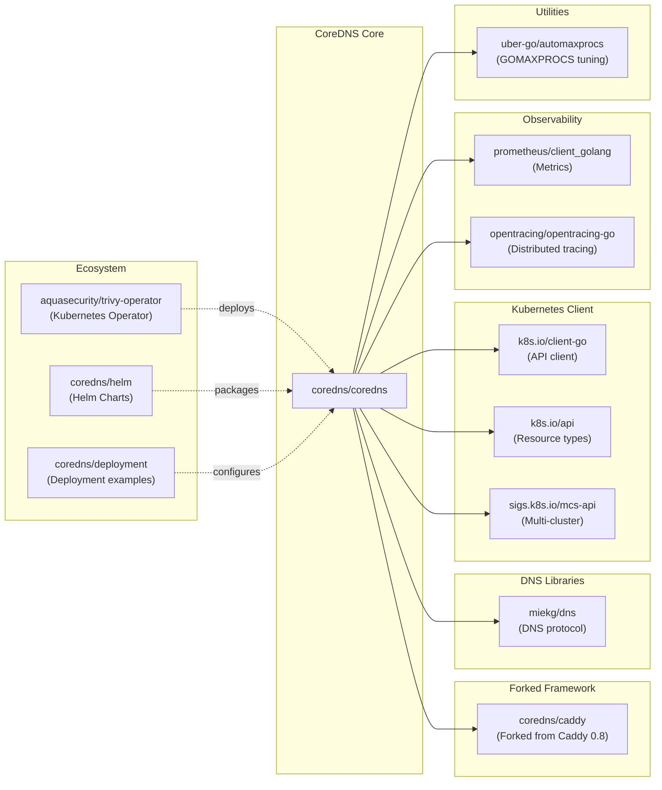

# CoreDNS

> A DNS server that chains plugins

| Metadata | |
|---|---|
| Repository | https://github.com/coredns/coredns |
| License | Apache-2.0 |
| Primary Language | Go |
| Category | Networking |
| Analyzed Release | `v1.14.1` (2026-01-16) |
| Stars (approx.) | 13,796 |
| Generated by | Claude Opus 4.6 (Anthropic) |
| Generated on | 2026-02-08 |

## Overview

CoreDNS is a fast, flexible, and cloud-native DNS server written in Go, adopted as a graduated project by the Cloud Native Computing Foundation (CNCF). It serves as the default DNS solution for Kubernetes since version 1.13, replacing kube-dns. CoreDNS is built upon a forked version of the Caddy web server framework, inheriting its elegant plugin architecture and configuration approach.

Problems it solves:

- Traditional DNS servers lack flexibility and extensibility, requiring monolithic configurations and limited customization capabilities
- Modern cloud-native environments need dynamic service discovery with real-time updates from orchestration platforms like Kubernetes
- DNS functionality often requires combining multiple capabilities (caching, forwarding, zone serving, metrics) that are difficult to compose in traditional DNS servers
- Organizations need to support diverse DNS protocols (UDP/TCP, DoT, DoH, DoH3, DoQ, gRPC) from a single server instance

Positioning:

CoreDNS is positioned as the standard DNS solution for cloud-native environments, particularly Kubernetes. Unlike BIND (heavyweight, traditional), Unbound (recursive resolver focus), or PowerDNS (authoritative focus), CoreDNS emphasizes modularity, composability, and cloud-native integration. Its plugin-based architecture makes it comparable to middleware frameworks like nginx or envoy, but specialized for DNS operations.

## Architecture Overview

CoreDNS implements a middleware chain architecture where each DNS query flows through a pipeline of plugins. The framework is built on a forked Caddy HTTP server, adapted for DNS protocol handling. The architecture consists of a thin core server that parses the Corefile configuration, initializes plugins in strict order, and chains them together to process DNS requests. Each plugin can choose to handle a query fully, pass it to the next plugin, or fall through after partial processing.

## Core Components

### Server (`core/dnsserver/server.go`)

- Responsibility: DNS protocol handling, listener management, and plugin chain coordination
- Key files: `core/dnsserver/server.go`, `core/dnsserver/server_https.go`, `core/dnsserver/server_quic.go`
- Design patterns: Server pattern, graceful shutdown pattern, protocol multiplexing

The Server struct manages DNS request lifecycle across multiple transport protocols. It maintains two dns.Server instances per address (one for net.Listener/TCP, one for net.PacketConn/UDP) and implements Caddy's GracefulServer interface. The NewServer function compiles plugins into a handler chain by iterating backwards through the plugin list, creating a nested structure where each plugin wraps the next. Protocol-specific servers (HTTPS, QUIC, gRPC) extend the base Server with transport-specific configuration and handlers.

### Plugin Interface (`plugin/plugin.go`)

- Responsibility: Defines the contract for all middleware components
- Key files: `plugin/plugin.go`, `core/plugin/zplugin.go`
- Design patterns: Chain of Responsibility, Handler pattern, functional composition

The Handler interface requires two methods: ServeDNS(context.Context, dns.ResponseWriter, dns.Msg) (int, error) and Name() string. Plugins return DNS rcodes to signal whether they have written a response. The NextOrFailure helper function chains plugins together with OpenTracing span integration. The Plugin type is a function that takes a Handler and returns a Handler, enabling functional composition. Plugins are registered via side-effect imports in zplugin.go and ordered according to plugin.cfg.

### Configuration System (`core/dnsserver/config.go`, `coremain/run.go`)

- Responsibility: Corefile parsing and plugin initialization
- Key files: `core/dnsserver/config.go`, `core/dnsserver/register.go`, `coremain/run.go`
- Design patterns: Builder pattern, registry pattern, directive parsing

The configuration system is inherited from Caddy's input system. Run() in coremain loads the Corefile using Caddy's loader mechanism, which parses zone blocks and directives. Each plugin registers a setup function via caddy.RegisterPlugin that is called during configuration parsing. The Config struct holds per-zone configuration including the compiled plugin chain, timeouts, TSIG secrets, and zone-specific settings. The register.go file maintains a DirectiveOrder array that determines plugin execution order.

### Forward Plugin (`plugin/forward/forward.go`)

- Responsibility: Proxying DNS queries to upstream resolvers with health checking and connection pooling
- Key files: `plugin/forward/forward.go`, `plugin/pkg/proxy/proxy.go`
- Design patterns: Proxy pattern, object pool pattern, health check pattern, policy pattern (round-robin, random)

The Forward plugin maintains a slice of Proxy objects, each representing an upstream DNS server. It implements connection reuse by caching net.Conn objects for a configurable duration (default 10 seconds), providing approximately 50% performance improvement over creating new connections. Inband health checking runs at 500ms intervals using a health check domain. The plugin supports multiple selection policies (random, round-robin, sequential) and implements max concurrency limits via atomic counters. It integrates with dnstap for observability and supports TLS, QUIC, and gRPC transports.

### Cache Plugin (`plugin/cache/cache.go`)

- Responsibility: Caching DNS responses with separate positive and negative caches
- Key files: `plugin/cache/cache.go`, `plugin/pkg/cache/cache.go`
- Design patterns: Cache-aside pattern, LRU eviction, prefetching

The Cache plugin maintains two separate cache.Cache instances: one for positive responses (pcache) and one for denial-of-existence responses (ncache). Cache keys are computed using FNV-64 hashing of qname, qtype, DO bit, and CD bit. The plugin implements TTL management with configurable minimum and maximum values, plus special handling for SERVFAIL responses. Prefetching is supported to refresh entries before expiration based on configurable percentage and duration thresholds. The stale-serving feature allows returning expired cache entries during upstream failures.

### Kubernetes Plugin (`plugin/kubernetes/kubernetes.go`)

- Responsibility: Dynamic DNS resolution for Kubernetes services and pods
- Key files: `plugin/kubernetes/kubernetes.go`, `plugin/kubernetes/controller.go`, `plugin/kubernetes/object/`
- Design patterns: Watch pattern, controller pattern, informer pattern

The Kubernetes plugin integrates with the Kubernetes API server using client-go to watch Services, Endpoints, and Pods. It implements a controller that maintains an in-memory cache synchronized via Kubernetes watch streams. DNS queries are resolved according to the Kubernetes DNS specification (schema version 1.1.0): service queries follow the pattern service.namespace.svc.zone, while pod queries support verified, insecure, or disabled modes. The plugin handles ExternalName services, headless services, and namespace-scoped queries. It supports federation and multi-cluster service mesh via MCS (Multi-Cluster Services) API integration.

## Data Flow

### Standard DNS Query Resolution Flow

## Key Design Decisions

### 1. Plugin Chain Execution Order

- Choice: Strict, compile-time ordering of plugins defined in plugin.cfg with code generation
- Rationale: DNS query processing has inherent dependencies where certain operations must occur before others (e.g., metadata collection before logging, caching before forwarding, rewriting before backend lookups). A deterministic order ensures predictable behavior and prevents subtle bugs from plugin ordering changes. The ordering is enforced at compile time via generated code in zplugin.go, making it explicit and immutable
- Trade-offs: Lack of runtime flexibility means reordering plugins requires recompilation. Users cannot dynamically adjust plugin order via configuration alone. However, this trade-off ensures performance (no runtime ordering logic) and safety (no accidental misorderings). External plugins can be integrated by modifying plugin.cfg and rebuilding

### 2. Forking Caddy Instead of Using It as a Library

- Choice: CoreDNS maintains a fork of Caddy (github.com/coredns/caddy) stripped of HTTP-specific code
- Rationale: Caddy 0.8 provided an excellent foundation with its plugin architecture, configuration parsing, and server lifecycle management. However, Caddy's evolution towards HTTPS and web serving introduced dependencies and complexity unnecessary for DNS. Forking allowed CoreDNS to maintain API stability, remove HTTP-specific code, and evolve the DNS-specific features independently. The fork predates Caddy 2.0's server-type plugin system
- Trade-offs: The fork creates maintenance overhead as Caddy framework improvements must be manually backported. CoreDNS cannot leverage Caddy 2.x improvements without significant refactoring. However, the fork provides stability and allows DNS-specific optimizations without upstream constraints

### 3. Handler Interface Returning (rcode, error) Tuple

- Choice: ServeDNS returns both an int rcode and an error, unlike Go's standard http.Handler
- Rationale: DNS protocol semantics require distinguishing between "query handled but no answer" (NXDOMAIN, NODATA) and "error occurred during processing" (SERVFAIL). The rcode communicates protocol-level outcomes while errors enable structured logging and monitoring. Specific rcodes (SERVFAIL, REFUSED, FORMERR, NOTIMP) signal to upstream plugins that no response was written, allowing fallthrough behavior. This design enables flexible plugin composition where plugins can decline to handle queries
- Trade-offs: More complex interface than http.Handler's simple error return. Plugin authors must understand rcode semantics and the ClientWrite() helper function. However, this complexity is essential for correct DNS behavior and enables patterns like fallthrough and conditional processing that are fundamental to CoreDNS's flexibility

### 4. Connection Pooling in Forward Plugin

- Choice: Maintain a pool of persistent connections to upstream resolvers, reusing connections for multiple queries
- Rationale: DNS queries are typically small and frequent. Establishing TCP connections or TLS sessions for each query incurs significant latency and resource overhead. Connection pooling reduces latency by approximately 50% and decreases load on upstream resolvers. The 10-second default expiry balances connection reuse with resource cleanup. The design is particularly beneficial for DoT and DoH where TLS handshake cost is high
- Trade-offs: Increased memory usage for connection pools and state management complexity. Stale connections must be detected and replaced, requiring health check mechanisms. Upstream resolver connection limits may be exhausted if many CoreDNS instances pool connections. However, the performance benefits for typical DNS workloads justify the complexity

### 5. Separate Positive and Negative Caches

- Choice: Maintain distinct cache.Cache instances for successful responses (pcache) and NXDOMAIN/NODATA responses (ncache)
- Rationale: Positive and negative responses have different characteristics and tuning requirements. Negative caching prevents repeated lookups for nonexistent domains (critical for typosquatting defense and performance), but negative responses should typically have shorter TTLs and potentially different cache sizes. Separate caches allow independent configuration of capacity, TTL ranges, and eviction policies optimized for each response type
- Trade-offs: Doubled cache infrastructure and increased memory footprint. More complex cache key management and statistics. However, operational flexibility gained by tuning positive and negative caching independently is valuable for production deployments

## Dependencies

## Testing Strategy

CoreDNS employs comprehensive testing across multiple layers to ensure reliability in production environments.

Unit tests: Each plugin includes extensive unit tests in `_test.go` files using Go's standard testing package. The tests utilize table-driven approaches for covering edge cases and the testdata/ directories contain fixtures including zone files, Corefiles, and expected responses. Mock implementations of the Handler interface enable isolated plugin testing without requiring full server setup.

Integration tests: The test/ directory contains integration tests that start real CoreDNS servers and execute queries against them. These tests verify plugin chain behavior, protocol support (UDP, TCP, TLS, HTTPS), and configuration parsing. Integration tests use the miekg/dns client library to generate realistic queries and validate full response messages including DNSSEC signatures and EDNS options.

Performance testing: Benchmark tests measure query processing throughput and latency. The forward plugin includes benchmarks comparing connection pooling versus connection-per-query performance. Cache plugin benchmarks validate LRU eviction performance and prefetching behavior under load.

CI/CD: GitHub Actions runs tests on Linux, macOS, and Windows across multiple Go versions. CircleCI provides additional validation for external plugin compatibility. Code quality is monitored via CodeQL for security vulnerability scanning and Go Report Card for idiomatic Go code. Docker images are automatically built and published to Docker Hub and GHCR for each release. The project maintains CII Best Practices gold badge and OpenSSF Scorecard monitoring.

## Key Takeaways

1. Plugin ordering as architectural constraint: CoreDNS demonstrates that explicitly encoding execution order constraints at compile time can simplify plugin development and prevent entire classes of bugs. The plugin.cfg approach trades runtime flexibility for compile-time safety and forces plugin authors to consider dependencies explicitly. This pattern is applicable to any middleware system where order matters

2. DNS-specific Handler interface: Returning (rcode, error) tuples rather than just errors enables elegant composition of DNS-specific logic. The pattern allows plugins to signal "I didn't handle this" without treating it as an error, enabling fallthrough chains. This design pattern applies broadly to protocol-specific middleware where operations can have multiple semantic outcomes beyond success/failure

3. Forking for focused evolution: CoreDNS shows that forking a framework can be the right choice when the original evolves in incompatible directions. Maintaining API stability and removing unused complexity enabled CoreDNS to become a production-grade DNS server. The lesson is that forks are not inherently technical debt if they serve a clear architectural purpose

4. Connection pooling at plugin level: Implementing connection pooling as a plugin-level concern rather than framework-level infrastructure distributes complexity to where it matters. The forward plugin can optimize connection reuse while other plugins remain simple. This demonstrates the value of keeping infrastructure concerns close to their usage rather than centralizing them

5. Kubernetes integration pattern: The watch-based controller pattern used in the kubernetes plugin provides real-time service discovery without polling. The informer cache pattern scales to large clusters by maintaining local state synchronized via event streams. This architecture is broadly applicable to systems needing dynamic configuration from external sources

6. Modular observability: Treating metrics, logging, and tracing as composable plugins rather than built-in infrastructure enables flexible observability. Users can configure exactly the telemetry they need without overhead from unused features. This plugin-based observability model applies to any system where monitoring requirements vary across deployments

## References

- [CoreDNS Official Documentation](https://coredns.io)
- [CoreDNS GitHub Repository](https://github.com/coredns/coredns)
- [How Queries Are Processed in CoreDNS](https://coredns.io/2017/06/08/how-queries-are-processed-in-coredns/)
- [Writing Plugins for CoreDNS](https://coredns.io/2016/12/19/writing-plugins-for-coredns/)
- [CoreDNS and Caddy](https://coredns.io/2016/09/29/coredns-and-caddy/)
- [Learning CoreDNS - O'Reilly Book](https://www.oreilly.com/library/view/learning-coredns/9781492047957/)
- [Kubernetes CoreDNS Documentation](https://kubernetes.io/docs/tasks/administer-cluster/coredns/)
- [CoreDNS Plugin Development Guide](https://github.com/coredns/coredns.io/blob/master/content/manual/plugins-dev.md)
- [Part Three: In-Depth Analysis of the CoreDNS Component in Kubernetes DNS](https://www.oreateai.com/blog/part-three-indepth-analysis-of-the-coredns-component-in-kubernetes-dns/08efd15b2bd79eaa0c711e059047c838)
- [Deep dive into CoreDNS - DevKhaja](https://moinuddin14.hashnode.dev/deep-dive-into-coredns)
