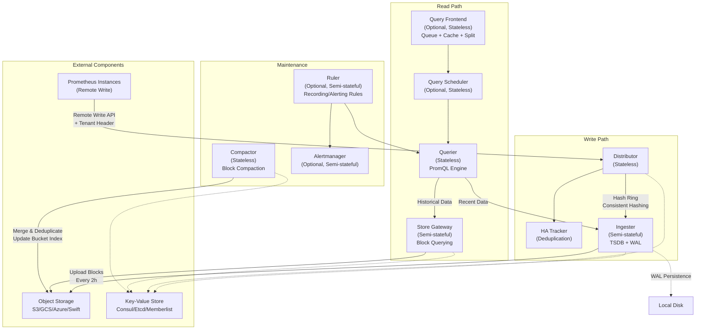
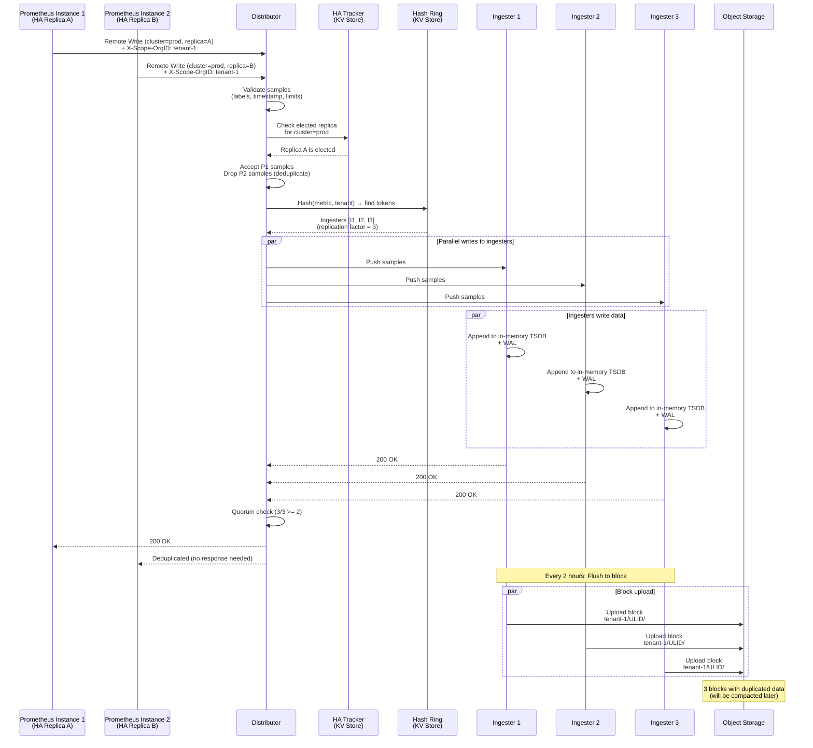
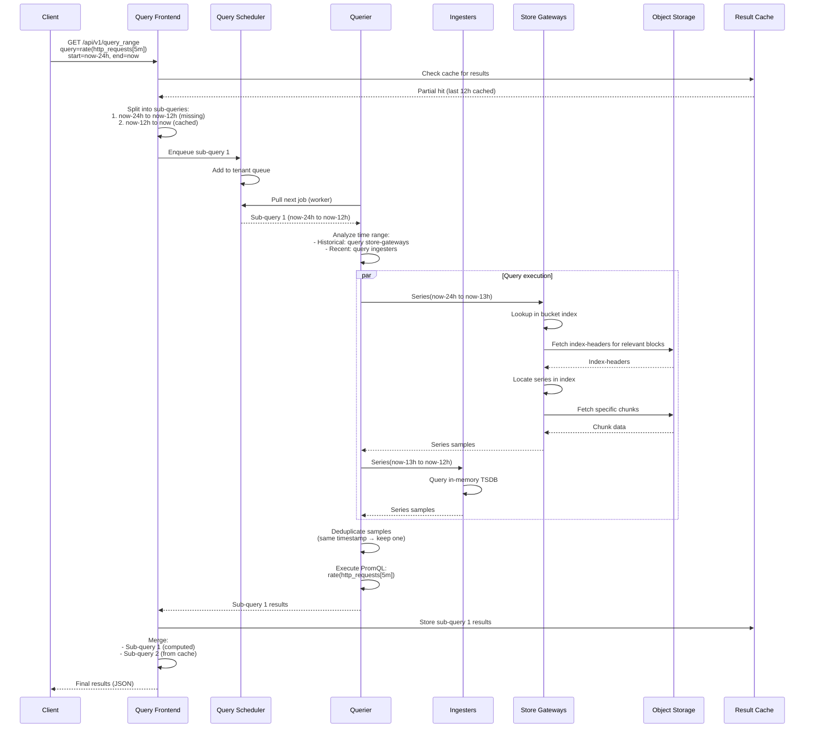
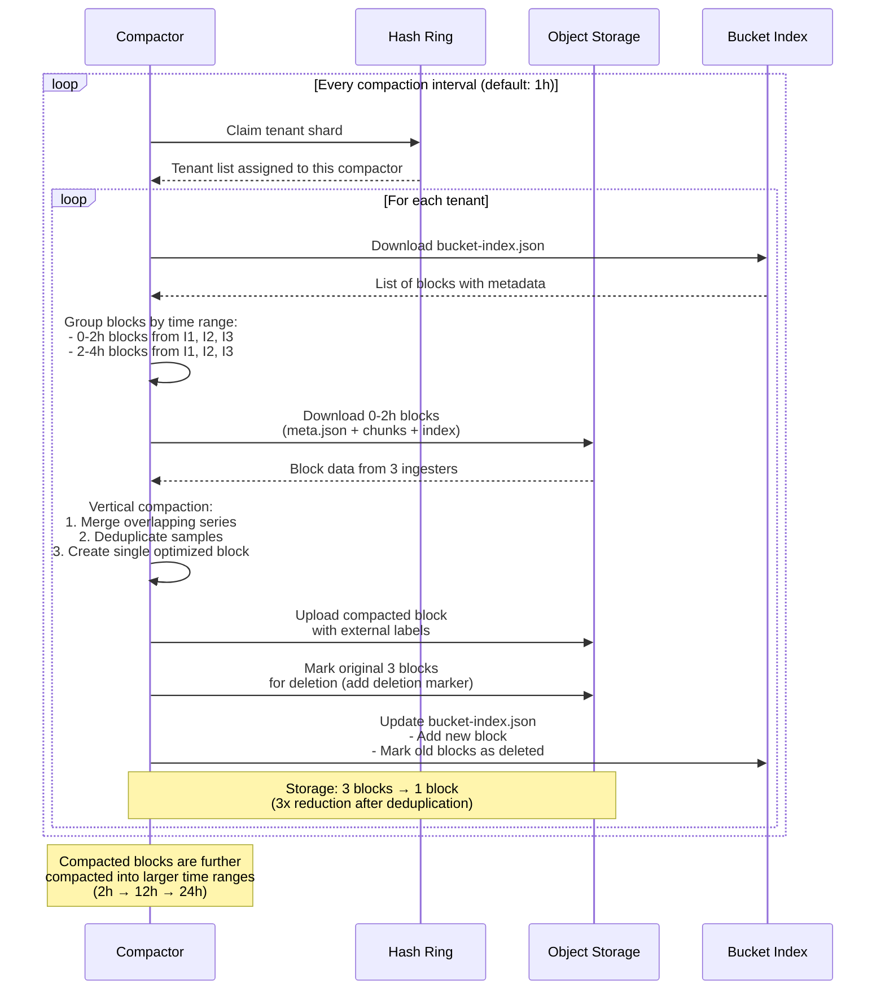
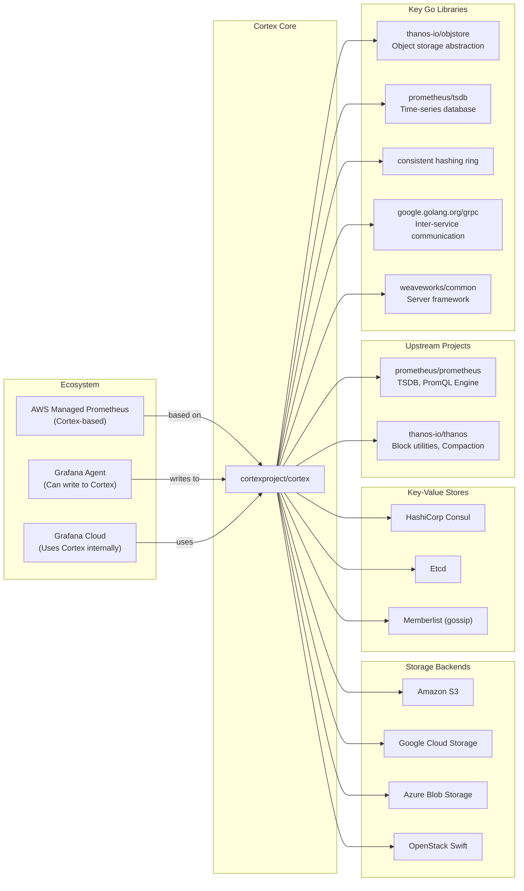

# Cortex

> A horizontally scalable, highly available, multi-tenant, long-term storage solution for Prometheus and OpenTelemetry Metrics

| Metadata | |
|---|---|
| Repository | https://github.com/cortexproject/cortex |
| License | Apache-2.0 |
| Primary Language | Go |
| Category | Monitoring |
| Analyzed Release | `v1.20.1` (2025-12-04) |
| Stars (approx.) | 5,744 |
| Generated by | Claude Sonnet 4.5 (Anthropic) |
| Generated on | 2026-02-08 |

## Overview

Cortex is a horizontally scalable, highly available, multi-tenant, long-term storage solution for Prometheus metrics. It was started by Tom Wilkie and Julius Volz (Prometheus' co-founder) in June 2016 and has become a CNCF graduated project. Cortex enables running Prometheus as a service, allowing multiple Prometheus instances to write to a centralized, scalable backend while maintaining full isolation between tenants.

Problems it solves:

- Horizontal scalability for Prometheus storage beyond single-node limits, enabling storage and query across massive metric volumes (50 billion+ time series)
- Long-term retention of Prometheus metrics using object storage (S3, GCS, Azure, Swift) without operational overhead of managing multiple Prometheus instances
- Multi-tenancy with strong isolation, allowing multiple teams or customers to share the same Cortex cluster while maintaining data separation and per-tenant limits
- High availability through replication, eliminating single points of failure and supporting seamless failover for both ingestion and querying

Positioning:

Cortex is one of the pioneering solutions for Prometheus long-term storage, alongside Thanos. While both share similar goals and even share some code (both based on Prometheus TSDB), Cortex focuses on a pure multi-tenant architecture with strong isolation. It serves as the foundation for Amazon Managed Service for Prometheus (AMP) and is widely adopted in enterprise environments requiring strict tenant separation. Compared to Thanos which emphasizes federation of existing Prometheus instances, Cortex provides a more opinionated, integrated solution designed for Prometheus-as-a-Service use cases.

## Architecture Overview

Cortex employs a microservices architecture where each component is horizontally scalable. The system is split into stateless components (distributors, queriers, query frontends) and semi-stateful components (ingesters, store-gateways, compactors). Components coordinate through a hash ring stored in a key-value store (Consul, Etcd, or Memberlist), enabling consistent hashing for series distribution and discovery.

## Core Components

### Distributor (`pkg/distributor/distributor.go`)

- Responsibility: First stop in the write path, receives samples from Prometheus remote write and distributes them to ingesters
- Key files: `pkg/distributor/distributor.go`, `pkg/ha/ha_tracker.go`
- Design patterns: Stateless service, Consistent hashing, Quorum consensus (Dynamo-style)

The distributor validates incoming samples for correctness (label name validity, max labels per metric, timestamp range), enforces per-tenant rate limits, and optionally deduplicates samples from Prometheus HA pairs through the HA Tracker. It uses consistent hashing with a configurable replication factor (typically 3) to determine which ingesters should receive each time series. The hash can be computed either by metric name and tenant ID (default) or by metric name, labels, and tenant ID for better load distribution.

The distributor implements quorum consistency: it waits for successful responses from at least N/2 + 1 ingesters before acknowledging the write to Prometheus. This ensures data durability even if some ingesters fail. Distributors are completely stateless and can be scaled up or down freely, with load balancing typically handled by a simple round-robin or random distribution.

### Ingester (`pkg/ingester/ingester.go`)

- Responsibility: Stores incoming time series in memory and periodically flushes them as TSDB blocks to object storage
- Key files: `pkg/ingester/ingester.go`, `pkg/storage/tsdb/`
- Design patterns: Write-ahead log (WAL), Per-tenant TSDB isolation, Lifecycler state machine

Each ingester maintains per-tenant TSDB instances created lazily upon receiving the first samples for a tenant. Incoming samples are simultaneously written to an in-memory structure and a write-ahead log (WAL) on persistent disk. Every 2 hours (configurable), the in-memory data is flushed to a new TSDB block which is uploaded to object storage. Blocks remain in the ingester for a retention period (default 13 hours) to allow queriers and store-gateways time to discover them.

The ingester uses a lifecycler to manage its state in the hash ring: PENDING → JOINING → ACTIVE → LEAVING → UNHEALTHY. During startup (JOINING), it loads tokens from disk or generates new ones, checks for conflicts, then transitions to ACTIVE. The WAL enables recovery of in-memory series if the ingester crashes, preventing data loss. Combined with replication (typically 3x), this provides strong durability guarantees even without immediate persistence to object storage.

### Querier (`pkg/querier/querier.go`)

- Responsibility: Executes PromQL queries by fetching data from both ingesters (recent data) and store-gateways (historical data)
- Key files: `pkg/querier/querier.go`, `pkg/querier/batch/`, `pkg/engine/`
- Design patterns: Stateless service, Scatter-gather query pattern, Deduplication

Queriers act as the query execution engine, receiving PromQL queries and determining which data sources to consult based on the query time range. For recent data (typically last 13 hours), queriers fetch samples directly from ingesters. For historical data, they retrieve samples from store-gateways. Because of the replication factor, queriers receive duplicated samples and perform internal deduplication based on exact timestamp matches for a given time series.

The querier can optionally work with a query frontend and query scheduler to benefit from queueing, query splitting, and result caching. When configured with `query_ingesters_within` and `query_store_after`, the querier intelligently routes queries to the appropriate backend, minimizing unnecessary fan-out to ingesters for purely historical queries.

### Store Gateway (`pkg/storegateway/gateway.go`)

- Responsibility: Queries time series from TSDB blocks stored in object storage
- Key files: `pkg/storegateway/gateway.go`, `pkg/storegateway/bucket_stores.go`
- Design patterns: Semi-stateful service, Index-header caching, Bucket index for block discovery

Store-gateways maintain an up-to-date view of blocks in object storage either by periodically scanning the bucket or by downloading the bucket index maintained by the compactor. For each block, the store-gateway downloads only the index-header (a compact subset of the full block index) to enable efficient series lookups without loading entire blocks into memory.

At query time, store-gateways receive series requests from queriers, use the index-header to locate the relevant chunks within blocks, fetch only the necessary chunks from object storage, and return the matching series. Store-gateways use sharding via the hash ring to distribute block querying across multiple instances, with each instance responsible for a subset of blocks.

### Compactor (`pkg/compactor/compactor.go`)

- Responsibility: Merges and deduplicates blocks to reduce storage costs and improve query performance
- Key files: `pkg/compactor/compactor.go`, `pkg/storage/tsdb/bucketindex/`
- Design patterns: Stateless service, Time-based compaction windows, Bucket index maintenance

The compactor continuously scans object storage for blocks belonging to each tenant. It groups blocks by time range and compaction level, then merges multiple small blocks from different ingesters into larger, optimized blocks. During this process, it deduplicates samples that were replicated across multiple ingesters, significantly reducing storage utilization (from N replicas to 1).

The compactor maintains the bucket index, a per-tenant metadata file listing all blocks and their properties. This index is used by queriers, store-gateways, and rulers to efficiently discover blocks without repeatedly scanning object storage. The compactor ensures only one instance works on a given tenant at a time through sharding coordination via the hash ring.

### Query Frontend (`pkg/frontend/`)

- Responsibility: Optional service providing query acceleration through queueing, splitting, and caching
- Key files: `pkg/frontend/v1/`, `pkg/querier/tripperware/queryrange/`
- Design patterns: Stateless service, Queue-based workload distribution, Result caching

The query frontend sits between clients and queriers, providing several optimizations. It maintains an internal queue where queries wait for available queriers (workers), ensuring fair scheduling across tenants and preventing large queries from monopolizing resources. The frontend splits multi-day queries into single-day sub-queries executed in parallel, preventing OOM errors in queriers.

The frontend caches query results (supporting Memcached, Redis, or in-memory backends) and serves partial results from cache, executing only the missing time ranges. It can optionally align queries to their step parameter to improve cache hit rates. Queriers connect to the frontend as workers, pulling jobs from the queue, executing them, and returning results for aggregation.

### Hash Ring (`pkg/ring/ring.go`)

- Responsibility: Distributed coordination mechanism for consistent hashing and service discovery
- Key files: `pkg/ring/ring.go`, `pkg/ring/lifecycler.go`, `pkg/ring/kv/`
- Design patterns: Consistent hashing with virtual tokens, Heartbeat-based health tracking

The hash ring is central to Cortex's architecture, used by distributors to determine ingester placement, by queriers to discover active ingesters, and by compactors and store-gateways for sharding. Each instance registers itself in the ring with a set of tokens (random 32-bit unsigned integers) and maintains its registration through periodic heartbeats to the KV store (Consul, Etcd, or Memberlist).

Series are assigned to ingesters by hashing the series and finding the smallest token value greater than the hash. With a replication factor N, the series is sent to the owners of the next N tokens belonging to different instances. The ring supports multiple hashing strategies: by metric name and tenant ID (default) or by metric name, labels, and tenant ID for better distribution.

## Data Flow

### Write Path: Prometheus Remote Write to Long-term Storage

### Read Path: PromQL Query Execution

### Compaction: Block Merging and Deduplication

## Key Design Decisions

### 1. Blocks Storage Based on Prometheus TSDB

- Choice: Use Prometheus TSDB as the storage format for both ingesters and long-term storage, organizing data into immutable blocks
- Rationale: Leverage the battle-tested, efficient columnar storage format from Prometheus itself. TSDB blocks provide excellent compression, fast query performance, and natural alignment with Prometheus semantics. Using the same format end-to-end (from scraping to long-term storage) simplifies the data model and enables code reuse from Prometheus and Thanos projects
- Trade-offs: Requires periodic block compaction to maintain query performance and storage efficiency. Ingesters need persistent disks for WAL, adding infrastructure requirements. The 2-hour block boundary is a hard constraint that affects query patterns and retention policies

### 2. Multi-tenancy with Strong Isolation via Separate TSDBs

- Choice: Create completely separate TSDB instances per tenant within each ingester, with tenant ID carried in HTTP headers (X-Scope-OrgID)
- Rationale: Provides the strongest possible isolation between tenants. Each tenant's data is physically separated in memory and on disk, preventing noisy neighbor problems, simplifying per-tenant limits enforcement, and enabling independent data lifecycle management. This architecture is essential for SaaS use cases where tenants must not be able to observe each other's data or performance
- Trade-offs: Higher memory overhead due to multiple TSDB instances per ingester. More complex management when scaling to thousands of tenants. Requires external authentication/authorization layer to validate tenant headers, as Cortex itself does not handle authentication

### 3. Consistent Hashing with Quorum Writes

- Choice: Use consistent hashing with a configurable replication factor (typically 3) and quorum consistency (N/2 + 1 acknowledgments)
- Rationale: Enables horizontal scalability by distributing series across ingesters based on hash values, allowing the cluster to handle arbitrary write throughput. Quorum writes provide strong durability guarantees without requiring all replicas to acknowledge, tolerating minority failures. Consistent hashing minimizes data movement when adding or removing ingesters
- Trade-offs: Temporary storage amplification (3x) until compaction runs. Write latency is determined by the slowest replica in the quorum. Complex failure scenarios (e.g., simultaneous multi-ingester failures) can lead to data loss if they affect all replicas of a series before compaction

### 4. HA Tracker for Prometheus Replica Deduplication

- Choice: Implement HA Tracker in distributors that uses a KV store to track which Prometheus replica is currently "elected" for each cluster
- Rationale: Enables users to run Prometheus in HA pairs (or larger groups) without duplicating data in Cortex. The distributor can drop samples from non-elected replicas immediately, saving ingestion capacity and storage. This is critical for large-scale deployments where many Prometheus instances run in HA mode
- Trade-offs: Requires fast, consistent KV store (Consul/Etcd) - memberlist is explicitly not supported due to gossip latency. Adds complexity to the write path. If the KV store becomes unavailable, HA deduplication stops working, potentially causing sample duplication or rejection depending on configuration

### 5. Separate Compactor and Store-Gateway Services

- Choice: Split block compaction (compactor) and block querying (store-gateway) into separate, independently scalable services
- Rationale: Compaction is a resource-intensive, batch-oriented workload (high CPU, disk I/O, object storage bandwidth), while querying is latency-sensitive and requires fast index lookups. Separating these concerns allows independent scaling and optimization. Store-gateways can be scaled for query load without affecting compaction throughput, and compactors can run on different instance types optimized for their workload
- Trade-offs: More operational complexity with additional service types to manage. Requires bucket index synchronization between compactor (writer) and store-gateway (reader). The store-gateway's view of blocks may lag slightly behind the compactor's updates

### 6. Write-Ahead Log (WAL) for Durability

- Choice: Ingesters maintain a write-ahead log on persistent disk, writing all incoming samples before acknowledging success
- Rationale: Provides durability against ingester crashes without relying solely on replication. If an ingester restarts, it can replay the WAL to recover in-memory state, preventing data loss. This is particularly important for handling rolling restarts or unexpected failures without waiting for all replicas to fail
- Trade-offs: Requires persistent disk volumes (e.g., EBS, GCP Persistent Disk) which adds infrastructure cost and complexity, especially in Kubernetes where StatefulSets are needed. WAL replay on startup increases ingester boot time. WAL storage must be sized appropriately to handle the buffer between flushes (typically 2 hours of data)

## Dependencies

## Testing Strategy

Cortex employs a comprehensive multi-layered testing strategy to ensure reliability at scale.

Unit tests: Each package contains extensive unit tests in `_test.go` files. The distributor, ingester, querier, and compactor all have dedicated test suites covering core logic, edge cases, and error conditions. Mock interfaces are used for isolating components, particularly for ring operations, KV store interactions, and object storage calls.

Integration tests: The `integration/` directory contains end-to-end tests that spin up full Cortex clusters using the `integration/e2e` framework. These tests cover complete workflows including single-process mode, distributed mode, blocks storage backends, HA deduplication, query federation, and various failure scenarios. Integration tests use real Prometheus instances for remote write and Docker containers for dependencies like Consul and Minio (S3-compatible storage).

Performance testing: Benchmark tests are included for critical paths like series hashing, sample batching, and query execution. The codebase includes specific benchmarks for the distributor's sharding logic, ingester's TSDB operations, and querier's batch processing.

CI/CD: GitHub Actions workflows run on every pull request, executing unit tests, integration tests, linters (golangci-lint), and building Docker images. The CI pipeline also validates configuration examples and checks for breaking changes in the API. Releases are automated with multi-architecture Docker image builds (amd64, arm64) and cryptographic signatures.

## Key Takeaways

1. Hash ring as a coordination primitive: The hash ring pattern used throughout Cortex demonstrates how consistent hashing can be extended beyond simple load balancing to provide service discovery, tenant sharding, and workload distribution. The ring's flexibility in supporting different operations (Write, Read, Reporting) with different instance state requirements makes it applicable to many distributed system problems

2. Multi-tenancy through physical isolation: Cortex's approach of creating separate TSDB instances per tenant shows that strong isolation doesn't require separate clusters. This pattern of "virtual clusters within a shared infrastructure" is broadly applicable to SaaS platforms where tenant isolation, limits enforcement, and independent lifecycle management are critical

3. Separating storage and compute for scalability: The blocks storage architecture exemplifies the benefits of disaggregating storage (object storage) from compute (ingesters, queriers, store-gateways). This separation enables independent scaling of write throughput, query throughput, and storage capacity, while also reducing operational costs by using commodity object storage

4. WAL plus replication for durability: Combining write-ahead logs (for single-node durability) with replication (for cluster-wide durability) provides strong guarantees without sacrificing write performance. This hybrid approach is applicable to any system where fast writes and high durability are both requirements

5. Microservices with composable deployment modes: Cortex can run as a single binary (for development/small deployments) or as separate microservices (for production/large scale). This flexibility, achieved through a module system (`pkg/cortex/modules.go`), shows how to design systems that scale from simple to complex deployments without maintaining separate codebases

6. Query optimization through layered caching: The query frontend's approach of combining result caching, query splitting, and query alignment demonstrates how to build a transparent acceleration layer. The pattern of splitting queries temporally to improve cache hit rates is applicable to any time-series or temporal data system

7. Background compaction as a first-class concern: Making compaction a separate, continuously running service (rather than an afterthought) reflects the reality that efficient storage requires ongoing maintenance. The compactor's design, with sharding via the hash ring and bucket index maintenance, shows how to operationalize storage optimization at scale

## References

- [Cortex Official Documentation](https://cortexmetrics.io/docs/)
- [Cortex Architecture Documentation](https://cortexmetrics.io/docs/architecture/)
- [Cortex GitHub Repository](https://github.com/cortexproject/cortex)
- [CNCF Blog: Cortex - A Multi-Tenant, Horizontally Scalable Prometheus as a Service](https://www.cncf.io/blog/2018/12/18/cortex-a-multi-tenant-horizontally-scalable-prometheus-as-a-service/)
- [Grafana Labs: How Blocks Storage in Cortex Reduces Operational Complexity](https://grafana.com/blog/2020/07/29/how-blocks-storage-in-cortex-reduces-operational-complexity-for-running-prometheus-at-massive-scale/)
- [AWS Blog: How AWS and Grafana Labs are Scaling Cortex for the Cloud](https://aws.amazon.com/blogs/opensource/how-aws-and-grafana-labs-are-scaling-cortex-for-the-cloud/)
- [Prometheus TSDB Documentation](https://prometheus.io/docs/prometheus/latest/storage/)
- [Thanos Project](https://thanos.io/)
