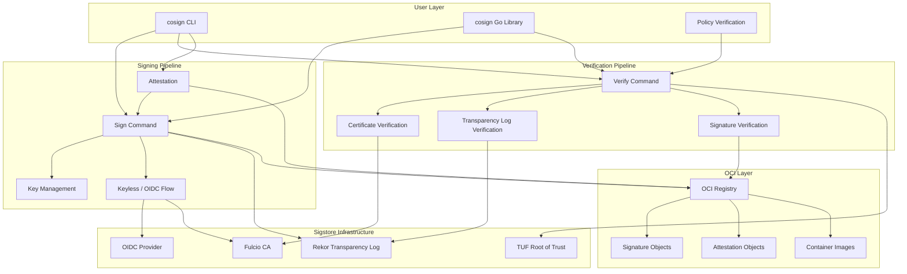
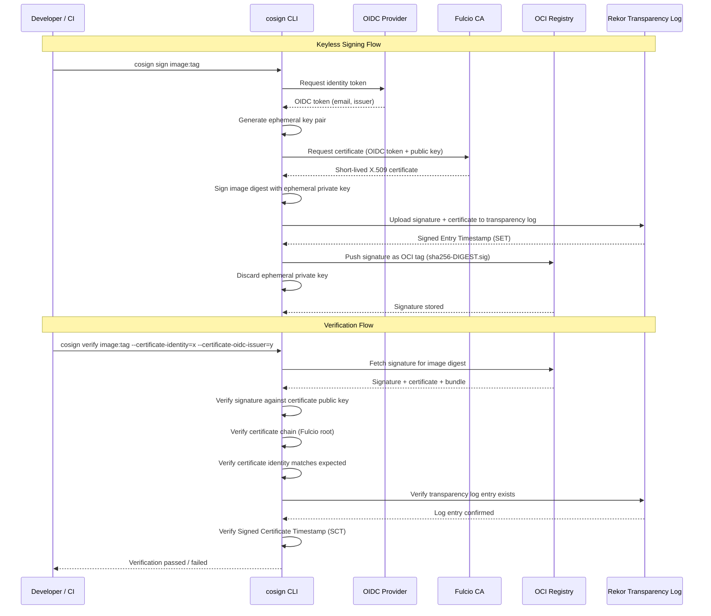
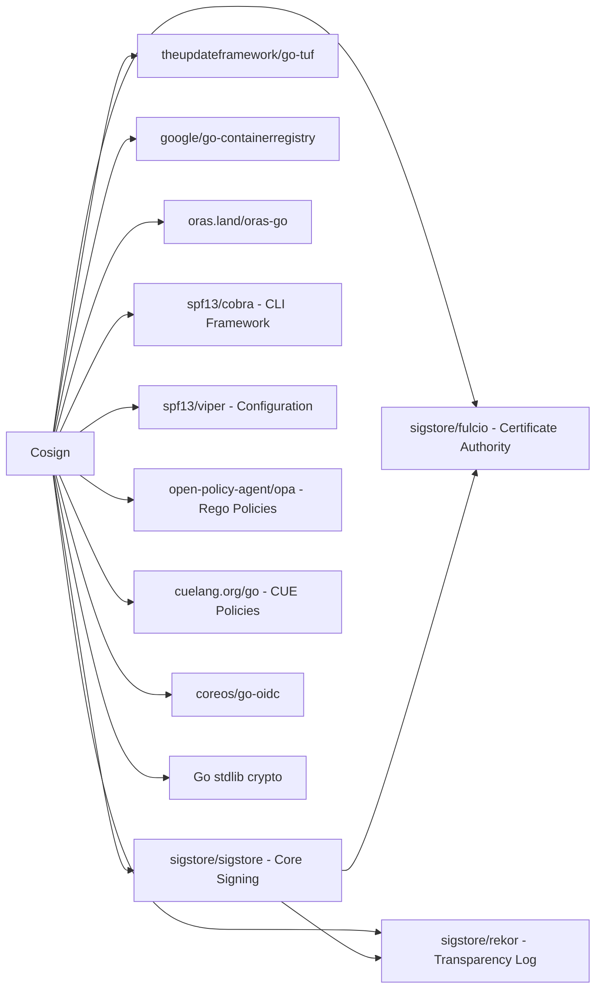

# Cosign Architecture Report

| Item | Value |
|------|-------|
| Project | Cosign |
| Repository | [sigstore/cosign](https://github.com/sigstore/cosign) |
| Category | Security |
| Language | Go |
| License | Apache License 2.0 |
| Stars | 5,633 |
| Latest Release | v3.0.4 (2026-01-09) |
| Generated by | Claude Opus 4.6 (Anthropic) |
| Generated on | 2026-02-08 |

---

## Overview

Cosign solves the problem of container image and artifact signing and verification in the software
supply chain. Before cosign, verifying the provenance and integrity of container images required
either complex PKI infrastructure or trusting the registry without cryptographic guarantees.

Cosign is a core component of the Sigstore project, which provides a free, open-source software
signing infrastructure. Cosign supports both traditional key-based signing and "keyless" signing
using OIDC-based identity and ephemeral certificates from Fulcio (a free certificate authority).
Signatures are stored alongside images in OCI registries and recorded in Rekor (a transparency log),
enabling public, auditable verification.

The project is part of the OpenSSF (Open Source Security Foundation) and has become the de facto
standard for container image signing in the cloud-native ecosystem.

### Problems Solved

- No standard tooling for cryptographically signing container images
- Traditional code signing requires complex PKI and key management
- Signatures stored separately from images are hard to discover and verify
- No transparency or auditability for who signed what and when
- Key management burden discourages adoption of image signing
- Attestation (SBOM, provenance, vulnerability scans) lacks a standard attachment mechanism

---

## Architecture Overview

---

## Core Components

### 1. CLI and Command Structure

Responsibility: Provide the user-facing command-line interface for all cosign operations including
signing, verification, attestation, key management, and various utility functions.

Key Files:
- `cmd/cosign/main.go` -- Application entry point
- `cmd/cosign/cli/commands.go` -- Root command registration and CLI structure
- `cmd/cosign/cli/sign.go` -- Image signing command
- `cmd/cosign/cli/signblob.go` -- Blob signing command
- `cmd/cosign/cli/verify.go` -- (implied) verification commands
- `cmd/cosign/cli/attest.go` -- Attestation command (SBOM, provenance, etc.)
- `cmd/cosign/cli/attest_blob.go` -- Blob attestation command
- `cmd/cosign/cli/generate_key_pair.go` -- Key pair generation
- `cmd/cosign/cli/import_key_pair.go` -- Key pair import from external sources
- `cmd/cosign/cli/public_key.go` -- Public key extraction
- `cmd/cosign/cli/attach.go` -- Attach artifacts (signatures, SBOMs) to images
- `cmd/cosign/cli/download.go` -- Download signatures and attestations
- `cmd/cosign/cli/copy.go` -- Copy signatures between registries
- `cmd/cosign/cli/tree.go` -- Display signature tree for an image
- `cmd/cosign/cli/triangulate.go` -- Discover the signature location for an image
- `cmd/cosign/cli/dockerfile.go` -- Verify images referenced in Dockerfiles
- `cmd/cosign/cli/manifest.go` -- Verify images referenced in Kubernetes manifests
- `cmd/cosign/cli/initialize.go` -- Initialize TUF root of trust
- `cmd/cosign/cli/bundle/` -- Bundle-related subcommands
- `cmd/cosign/cli/fulcio/` -- Fulcio-related utilities
- `cmd/cosign/cli/generate/` -- Generation subcommands
- `cmd/cosign/errors/` -- CLI error types

Design Patterns:
- Command Pattern: Each CLI command encapsulates an operation with its parameters
- Facade Pattern: CLI commands present simplified interfaces to complex underlying workflows
- Builder Pattern: Command options are built up incrementally from flags

### 2. Signing and Verification Core

Responsibility: Implement the core cryptographic operations for signing container images, blobs,
and attestations, and verifying signatures against various trust anchors (keys, certificates,
transparency logs).

Key Files:
- `pkg/cosign/verify.go` -- Main verification logic for image signatures
- `pkg/cosign/verify_bundle.go` -- Bundle-based verification (offline verification)
- `pkg/cosign/verify_sct.go` -- Signed Certificate Timestamp verification
- `pkg/cosign/verifiers.go` -- Verifier interface implementations
- `pkg/cosign/keys.go` -- Key loading and management (file, KMS, Kubernetes Secret)
- `pkg/cosign/common.go` -- Shared utilities
- `pkg/cosign/tlog.go` -- Rekor transparency log client integration
- `pkg/cosign/tsa.go` -- Timestamp Authority integration
- `pkg/cosign/ctlog.go` -- Certificate Transparency log integration
- `pkg/cosign/tuf.go` -- TUF (The Update Framework) root of trust management
- `pkg/cosign/fulcioverifier/` -- Fulcio certificate chain verification
- `pkg/cosign/certextensions.go` -- X.509 certificate extension parsing (OIDC issuer, identity, etc.)
- `pkg/cosign/bundle/` -- Cosign bundle format handling
- `pkg/cosign/remote/` -- Remote signature and attestation operations
- `pkg/cosign/fetch.go` -- Signature fetching from registries
- `pkg/cosign/errors.go` -- Domain-specific error types
- `pkg/cosign/rekor_factory.go` -- Factory for Rekor client creation
- `internal/pkg/cosign/` -- Internal cosign implementation details

Design Patterns:
- Strategy Pattern: Multiple verification strategies (key-based, keyless, bundle-based)
- Factory Pattern: `rekor_factory.go` creates appropriate Rekor clients
- Chain of Responsibility: Verification proceeds through multiple checks (signature, certificate, SCT, tlog)
- Builder Pattern: Verification options are composed incrementally

### 3. OCI Integration Layer

Responsibility: Provide abstractions for storing, retrieving, and manipulating signatures and
attestations as OCI (Open Container Initiative) artifacts in container registries.

Key Files:
- `pkg/oci/interface.go` -- Core OCI type interfaces (SignedEntity, Signatures, Attestations)
- `pkg/oci/image.go` -- SignedImage interface for signed container images
- `pkg/oci/index.go` -- SignedImageIndex for multi-architecture images
- `pkg/oci/signatures.go` -- Signatures collection type
- `pkg/oci/file.go` -- File-based OCI artifacts
- `pkg/oci/mediatypes.go` -- Media type constants for cosign artifacts
- `pkg/oci/errors.go` -- OCI-specific error types
- `pkg/oci/remote/` -- Remote registry operations (push, pull signatures)
- `pkg/oci/mutate/` -- OCI artifact mutation (attaching signatures, attestations)
- `pkg/oci/static/` -- Static OCI artifacts for testing
- `pkg/oci/empty/` -- Empty OCI artifacts
- `pkg/oci/layout/` -- OCI layout (on-disk) support
- `pkg/oci/signed/` -- Signed entity implementation
- `pkg/oci/signature/` -- Signature implementation
- `pkg/oci/walk/` -- Walk OCI image trees
- `pkg/oci/platform/` -- Platform-specific OCI handling
- `pkg/oci/internal/` -- Internal OCI utilities

Design Patterns:
- Adapter Pattern: Adapts the go-containerregistry library to cosign's signing model
- Composite Pattern: SignedImageIndex composes multiple SignedImages for multi-arch support
- Repository Pattern: Remote package abstracts registry interactions
- Decorator Pattern: Mutate package wraps OCI entities with additional metadata

### 4. Policy Evaluation

Responsibility: Evaluate verification policies against images, supporting multiple policy languages
(Rego, CUE) and enabling flexible verification criteria beyond simple signature checks.

Key Files:
- `pkg/policy/attestation.go` -- Attestation policy evaluation
- `pkg/policy/eval.go` -- Policy evaluation engine
- `pkg/policy/errors.go` -- Policy evaluation error types
- `pkg/cosign/rego/` -- Rego-based policy evaluation integration
- `pkg/cosign/cue/` -- CUE-based policy evaluation integration

Design Patterns:
- Strategy Pattern: Rego and CUE are interchangeable policy evaluation strategies
- Interpreter Pattern: Policy expressions are parsed and evaluated against attestation data

### 5. Identity Providers and Key Management

Responsibility: Support multiple identity and key sources for signing operations, including
local key files, cloud KMS services, hardware tokens (PIV/PKCS11), Kubernetes Secrets,
and OIDC-based keyless signing.

Key Files:
- `pkg/cosign/keys.go` -- Key loading and management interface
- `pkg/cosign/kubernetes/` -- Kubernetes Secret-based key storage
- `pkg/cosign/pivkey/` -- PIV (smart card) key support
- `pkg/cosign/pkcs11key/` -- PKCS#11 hardware security module support
- `pkg/cosign/git/` -- Git-based signing support
- `pkg/providers/interface.go` -- Identity provider interface
- `pkg/providers/all/` -- Provider registration
- `pkg/providers/github/` -- GitHub Actions OIDC identity provider
- `pkg/providers/google/` -- Google Cloud OIDC identity provider
- `pkg/providers/buildkite/` -- Buildkite OIDC identity provider
- `pkg/providers/spiffe/` -- SPIFFE-based identity provider
- `pkg/providers/filesystem/` -- Filesystem-based identity token provider
- `pkg/providers/envvar/` -- Environment variable-based identity provider
- `internal/key/` -- Internal key management utilities
- `internal/auth/` -- Authentication utilities for registry access
- `cmd/cosign/cli/fulcio/` -- Fulcio certificate acquisition

Design Patterns:
- Strategy Pattern: Multiple key sources (file, KMS, PIV, Kubernetes) implement a common interface
- Provider Pattern: Identity providers are auto-detected based on environment
- Abstract Factory: Key and identity providers are created from configuration

---

## Data Flow

---

## Key Design Decisions

### 1. Keyless Signing with Ephemeral Certificates

Choice: Support "keyless" signing using OIDC identity, ephemeral key pairs, and short-lived
certificates from Fulcio, rather than requiring users to manage long-lived signing keys.

Rationale: Key management is the primary barrier to adoption of code signing. By leveraging
existing OIDC identities (GitHub, Google, Microsoft) and generating ephemeral keys that are
discarded after signing, cosign eliminates the need for key provisioning, rotation, and protection.

Trade-offs:
- Pro: No key management burden -- zero infrastructure to maintain
- Pro: Leverages existing identity infrastructure (GitHub Actions, Google Cloud, etc.)
- Pro: Ephemeral keys cannot be stolen for future misuse
- Con: Depends on Fulcio and Rekor availability for signing (centralized dependency)
- Con: Identity is tied to OIDC provider -- provider outages affect signing
- Con: Verification requires checking the transparency log (network dependency)

### 2. OCI Registry as Signature Storage

Choice: Store signatures as OCI artifacts alongside images in the same registry, using a
tag-based naming convention (sha256-DIGEST.sig), rather than a separate signature store.

Rationale: Co-locating signatures with images ensures they are discovered, distributed, and
garbage-collected together. Using OCI registries avoids introducing a new storage service
and leverages existing registry infrastructure, access controls, and replication.

Trade-offs:
- Pro: No additional infrastructure for signature storage
- Pro: Signatures follow images through registry mirroring and replication
- Pro: Registry access controls apply to signatures automatically
- Con: Registry must support OCI artifacts (referrers API or fallback tag scheme)
- Con: Signature tags can be confusing in registry UIs
- Con: Garbage collection policies must account for signature artifacts

### 3. Transparency Log Integration (Rekor)

Choice: Record all signatures in a public transparency log (Rekor), making every signing
event publicly auditable and providing non-repudiation guarantees.

Rationale: Transparency logs prevent a compromised CA from silently issuing fraudulent
certificates. If an attacker obtains a certificate from Fulcio, the issuance is recorded
in Rekor and can be detected through log monitoring. This provides an additional security
layer beyond certificate verification alone.

Trade-offs:
- Pro: Public auditability of all signing events
- Pro: Detects compromised CA certificates through log monitoring
- Pro: Non-repudiation -- signers cannot deny their signatures
- Con: Privacy concern -- signing events are public by default
- Con: Rekor availability is required for signing (or offline bundle verification)
- Con: Transparency log growth requires ongoing infrastructure

### 4. Multiple Policy Language Support (Rego + CUE)

Choice: Support policy evaluation using both Rego (from OPA) and CUE for verifying
attestation contents, rather than a single policy format.

Rationale: Different organizations already use different policy languages. Rego is common in
Kubernetes environments (through OPA/Gatekeeper), while CUE is gaining adoption for
configuration validation. Supporting both reduces the barrier to adoption.

Trade-offs:
- Pro: Users can leverage existing policy expertise
- Pro: Flexible attestation verification beyond simple signature checks
- Con: Two policy engines to maintain and document
- Con: Potential inconsistencies between Rego and CUE evaluation behavior

### 5. Bundle Format for Offline Verification

Choice: Package all verification materials (signature, certificate, transparency log proof)
into a self-contained bundle format that enables offline verification.

Rationale: Production environments may not have connectivity to Rekor or Fulcio. The bundle
format includes all cryptographic proofs needed for verification, enabling air-gapped
environments to verify images without network access.

Trade-offs:
- Pro: Enables verification in air-gapped environments
- Pro: Faster verification (no network round-trips)
- Pro: Resilient to Rekor/Fulcio outages
- Con: Bundles increase storage requirements
- Con: Bundle format must evolve carefully to maintain backward compatibility

---

## Dependencies

---

## Testing Strategy

Cosign employs a comprehensive testing approach:

- Unit Tests: Core verification logic is extensively tested. Key files include
  `pkg/cosign/verify_test.go`, `pkg/cosign/verify_bundle_test.go`, `pkg/cosign/verify_sct_test.go`,
  `pkg/cosign/keys_test.go`, `pkg/cosign/ctlog_test.go`, `pkg/cosign/tlog_test.go`, and
  `pkg/cosign/tsa_test.go`.

- Certificate Extension Tests: `pkg/cosign/certextensions_test.go` verifies correct parsing
  of X.509 certificate extensions used for identity information.

- Fuzz Testing: `pkg/cosign/fuzz_test.go` and `pkg/policy/fuzz_test.go` provide fuzz testing
  for parsing and verification logic.

- Policy Tests: `pkg/policy/attestation_test.go` and `pkg/policy/eval_test.go` test policy
  evaluation with both Rego and CUE.

- CLI Tests: `cmd/cosign/cli/env_test.go` tests CLI environment handling.

- OCI Tests: The `pkg/oci/` package has dedicated test utilities in `pkg/oci/static/` and
  `pkg/oci/empty/` for constructing test fixtures.

- Error Tests: `pkg/cosign/errors_test.go` and `pkg/cosign/obsolete_test.go` test error
  handling and deprecated API behavior.

- Conformance Tests: `cmd/conformance/` provides conformance testing for Sigstore interoperability.

- Test Data: `pkg/cosign/testdata/` contains test certificates, keys, and bundles for
  reproducible testing.

---

## Key Takeaways

1. Keyless signing is a paradigm shift in code signing. By replacing long-lived signing keys with
   ephemeral certificates tied to OIDC identity, cosign eliminates the key management problem
   that has prevented widespread adoption of artifact signing. The trade-off is dependency on
   Fulcio and the OIDC provider -- but for most organizations, this is a far better trade-off
   than managing signing keys.

2. Storing signatures as OCI artifacts alongside images is an elegant design that leverages
   existing infrastructure. Rather than building a separate signature database, cosign uses the
   same registries that already store images, inheriting their access controls, replication,
   and operational tooling.

3. The transparency log (Rekor) provides a crucial security guarantee that certificates alone
   cannot offer. Even if Fulcio is compromised, the transparency log makes fraudulent certificate
   issuance detectable. This defense-in-depth approach mirrors the design of Certificate
   Transparency for web PKI.

4. The Sigstore ecosystem (Fulcio + Rekor + cosign) demonstrates the power of decomposing a
   complex problem (artifact trust) into composable services. Each component has a single
   responsibility: Fulcio issues certificates, Rekor provides transparency, and cosign
   orchestrates the workflow. This separation enables each component to evolve independently.

5. Supporting multiple identity providers (GitHub, Google, Buildkite, SPIFFE, filesystem) and
   key sources (file, KMS, PIV, PKCS#11) ensures cosign works across diverse environments.
   The provider/key strategy pattern makes it straightforward to add new integrations without
   modifying the core signing and verification logic.

---

## References

- [GitHub Repository: sigstore/cosign](https://github.com/sigstore/cosign)
- [Sigstore Documentation: Signing Containers](https://docs.sigstore.dev/cosign/signing/signing_with_containers/)
- [Sigstore Quickstart with Cosign](https://docs.sigstore.dev/quickstart/quickstart-cosign/)
- [Verifying Signatures with Cosign](https://docs.sigstore.dev/cosign/verifying/verify/)
- [Chainguard Academy: Introduction to Cosign](https://edu.chainguard.dev/open-source/sigstore/cosign/an-introduction-to-cosign/)
- [Chainguard Academy: How to Sign a Container](https://edu.chainguard.dev/open-source/sigstore/cosign/how-to-sign-a-container-with-cosign/)
