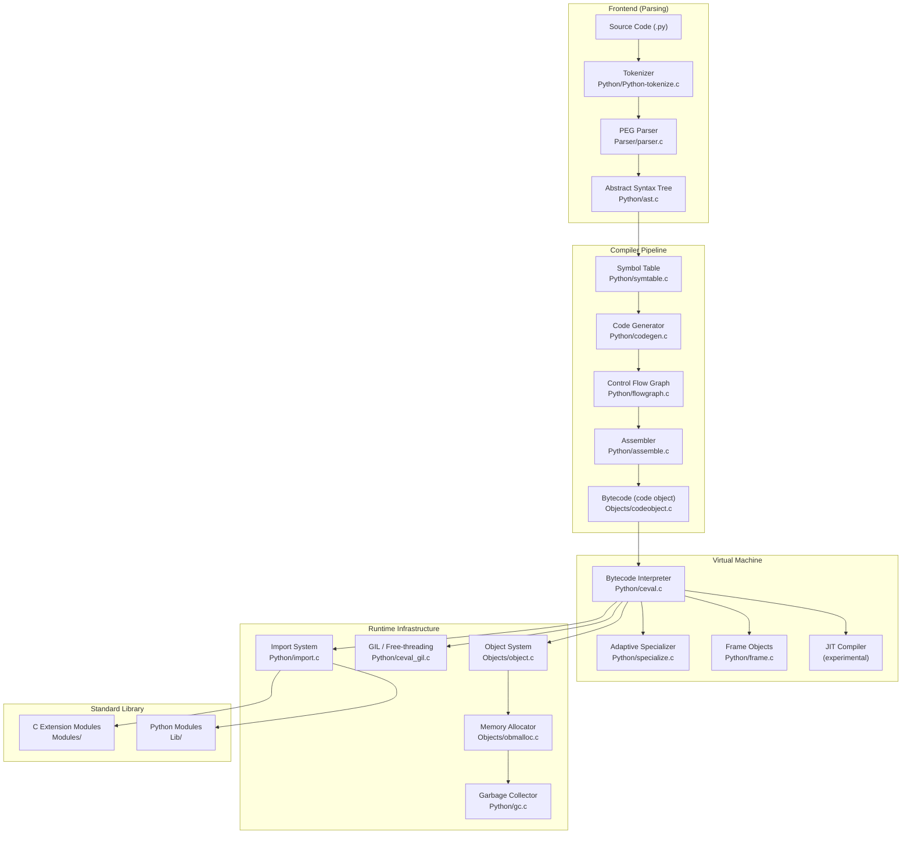
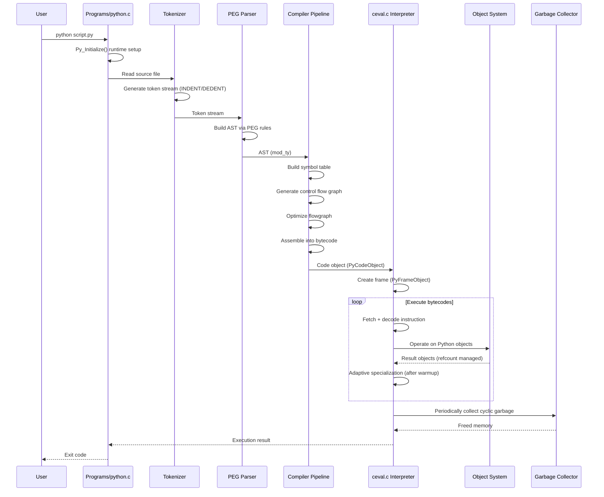
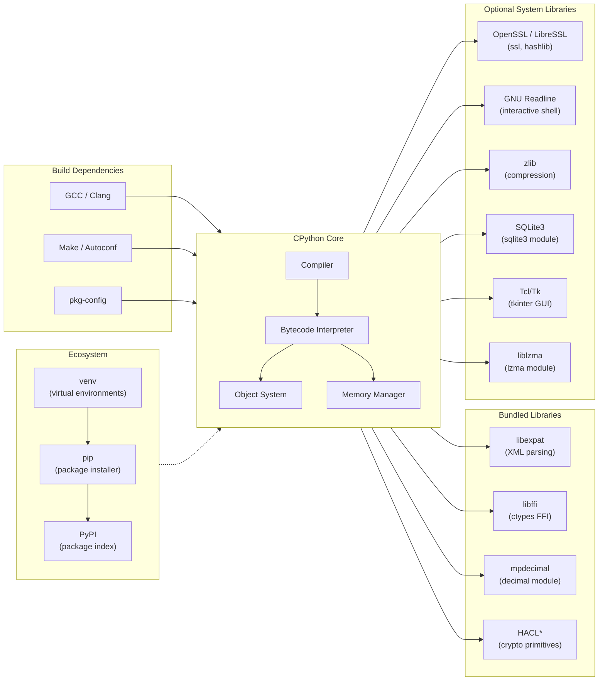

# CPython

> The reference implementation of the Python programming language

| Metadata | |
|---|---|
| Repository | https://github.com/python/cpython |
| License | PSF License |
| Primary Language | Python |
| Category | Runtime |
| Analyzed Release | `v3.14.0` (2025-10-07) |
| Stars (approx.) | 71,000+ |
| Generated by | Claude Opus 4.6 (Anthropic) |
| Generated on | 2026-02-09 |

## Overview

CPython is the default and most widely used implementation of the Python programming language, written in C. It serves as the reference interpreter that defines Python's semantics and provides the standard library used by millions of developers worldwide. CPython compiles Python source code into bytecode instructions and executes them on a stack-based virtual machine, managing memory through reference counting combined with a cycle-detecting garbage collector.

Problems it solves:

- Provides a high-level, dynamically-typed programming language that prioritizes readability and developer productivity over raw execution speed
- Delivers a comprehensive standard library ("batteries included") that covers file I/O, networking, text processing, data structures, and hundreds of other domains
- Offers seamless C extension integration, enabling Python to serve as a glue language between high-performance native libraries
- Establishes a platform-independent execution environment through bytecode compilation, allowing the same code to run on Windows, macOS, Linux, and other platforms

Positioning:

CPython is the canonical Python implementation, maintained by the Python Software Foundation and a global community of contributors. While alternative implementations exist (PyPy for JIT compilation speed, Jython for JVM integration, GraalPython for polyglot scenarios), CPython remains the standard against which all others are measured. It defines the language specification through its implementation and provides the C API that nearly all Python extensions depend on. Recent versions (3.11-3.14) have introduced significant performance improvements including adaptive specialization, an experimental JIT compiler, and free-threaded mode that removes the Global Interpreter Lock (GIL).

## Architecture Overview

CPython follows a classic compiler-interpreter pipeline architecture. Source code enters through a PEG parser that produces an Abstract Syntax Tree (AST), which is compiled through several stages (symbol table analysis, control flow graph generation, bytecode emission) into Python bytecode. The bytecode is then executed by a stack-based virtual machine (the ceval loop) that manages frame objects, thread states, and the runtime. The entire system is backed by a memory management subsystem that combines reference counting with cyclic garbage collection.

## Core Components

### PEG Parser (`Parser/`)

- Responsibility: Transforms Python source code into an Abstract Syntax Tree (AST) through tokenization and parsing
- Key files: `Parser/parser.c`, `Parser/pegen.c`, `Parser/pegen.h`, `Grammar/python.gram`
- Design patterns: Parser combinator (PEG grammar), code generation from grammar specification

The parser was rewritten from an LL(1) parser to a PEG (Parsing Expression Grammar) parser in Python 3.9. The grammar definition in `Grammar/python.gram` is used by `Tools/peg_generator/` to generate the C parser code automatically. The PEG parser enables more flexible and readable grammar rules, allowing direct left recursion and removing the need for many workarounds that the LL(1) parser required. The tokenizer (`Python/Python-tokenize.c`) handles Python's significant whitespace by generating INDENT and DEDENT tokens.

### Compiler (`Python/compile.c`, `Python/codegen.c`, `Python/assemble.c`)

- Responsibility: Transforms the AST into optimized bytecode through symbol table analysis, code generation, and assembly
- Key files: `Python/compile.c`, `Python/codegen.c`, `Python/flowgraph.c`, `Python/assemble.c`, `Python/symtable.c`
- Design patterns: Visitor pattern (AST traversal), multi-pass compilation, control flow graph optimization

The compiler operates in multiple passes. First, `Python/symtable.c` analyzes variable scopes and bindings (local, global, free, cell). Then `Python/codegen.c` walks the AST to produce a control flow graph of pseudo-instructions. `Python/flowgraph.c` optimizes this graph (dead code elimination, constant folding, jump optimization). Finally, `Python/assemble.c` converts the flow graph into a linear bytecode sequence stored in a code object (`Objects/codeobject.c`). The code object contains the bytecode bytes, a constant table, variable names, line number mappings, and exception handling tables.

### Bytecode Interpreter (`Python/ceval.c`)

- Responsibility: Executes Python bytecode instructions using a stack-based virtual machine with adaptive specialization
- Key files: `Python/ceval.c`, `Python/bytecodes.c`, `Python/specialize.c`, `Python/generated_cases.c.h`
- Design patterns: Computed goto dispatch, inline caching, adaptive specialization (PEP 659)

The interpreter is the heart of CPython. `Python/ceval.c` contains the main evaluation loop (`_PyEval_EvalFrameDefault`) that fetches, decodes, and dispatches bytecode instructions. Since Python 3.11, it uses adaptive specialization: generic bytecode instructions track how they are used and, after a warmup period, replace themselves with type-specialized versions (e.g., `LOAD_ATTR` becomes `LOAD_ATTR_INSTANCE_VALUE` for attribute access on regular objects). The instruction definitions are written in a DSL in `Python/bytecodes.c` and processed by `Tools/cases_generator/` to produce the actual C dispatch code. Python 3.13 introduced an experimental copy-and-patch JIT compiler that compiles specialized bytecode into machine code.

### Object System (`Objects/`)

- Responsibility: Implements Python's type system, object model, and all built-in types
- Key files: `Objects/object.c`, `Objects/typeobject.c`, `Objects/dictobject.c`, `Objects/listobject.c`, `Objects/longobject.c`
- Design patterns: Type-object pattern (metaclass hierarchy), reference counting, C struct inheritance

Every value in Python is represented as a `PyObject` structure containing a reference count and a pointer to its type object. Type objects (`Objects/typeobject.c`) define the behavior of instances through a table of function pointers (tp_hash, tp_repr, tp_richcompare, etc.), implementing a form of vtable dispatch. The dict implementation (`Objects/dictobject.c`) is one of the most performance-critical components, using a compact hash table layout with separate key and value arrays. Lists use a dynamic array that grows by approximately 12.5% when full. Integers (`Objects/longobject.c`) support arbitrary precision through an array of digits.

### Memory Management and GC (`Objects/obmalloc.c`, `Python/gc.c`)

- Responsibility: Manages memory allocation, deallocation, and cyclic garbage collection
- Key files: `Objects/obmalloc.c`, `Python/gc.c`, `Include/internal/pycore_gc.h`
- Design patterns: Arena allocator (three-tier allocation), generational garbage collection, reference counting

CPython uses a three-tier memory allocation strategy. For objects smaller than 512 bytes, `obmalloc` provides a custom allocator with arenas (256 KB chunks), pools (4 KB blocks), and individual blocks. This avoids the overhead of system malloc for the many small objects Python creates. On top of this, reference counting provides deterministic destruction for most objects. A separate cyclic garbage collector (`Python/gc.c`) handles reference cycles using a generational approach with three generations (young, medium, old). Objects that survive collection are promoted to older generations, which are collected less frequently.

## Data Flow

### Executing a Python Script

## Key Design Decisions

### 1. Reference Counting as Primary Memory Management

- Choice: Use reference counting for immediate object deallocation, supplemented by a cyclic garbage collector
- Rationale: Reference counting provides deterministic destruction semantics, which is important for managing external resources (file handles, network connections) via context managers and destructors. It keeps memory usage predictable and avoids the long pauses associated with tracing garbage collectors.
- Trade-offs: Reference counting adds overhead to every pointer assignment and makes multi-threaded performance harder (the GIL was partly needed to protect reference counts). Circular references cannot be collected by reference counting alone, requiring the supplementary cyclic GC. The free-threaded build (PEP 703) uses deferred reference counting and biased reference counting to mitigate thread-safety costs.

### 2. Global Interpreter Lock (GIL)

- Choice: A single global lock that prevents multiple native threads from executing Python bytecode simultaneously
- Rationale: The GIL simplifies the implementation enormously, making single-threaded code faster and eliminating the need for fine-grained locking on every object operation. It also makes C extension development much simpler since extensions do not need to worry about thread-safety for Python objects.
- Trade-offs: Multi-threaded CPU-bound Python code cannot utilize multiple cores. This has been the most criticized design decision in CPython's history. Python 3.13 introduced an experimental free-threaded build (--disable-gil) that removes the GIL, using per-object locks and other techniques, though it comes with single-threaded performance costs of approximately 5-10%.

### 3. PEG Parser (replacing LL(1))

- Choice: Replaced the LL(1) parser with a PEG (Parsing Expression Grammar) parser in Python 3.9
- Rationale: The LL(1) parser imposed significant restrictions on the grammar, forcing workarounds and making certain natural syntax impossible. PEG parsers support unlimited lookahead, left recursion, and more natural rule composition.
- Trade-offs: The PEG parser uses more memory than the LL(1) parser (it memoizes parse results), and the generated parser code is larger. However, parsing time is a negligible fraction of total execution time for most programs.

### 4. Adaptive Specialization (PEP 659)

- Choice: Bytecode instructions specialize themselves at runtime based on observed types
- Rationale: Dynamic languages spend a large fraction of execution time on type checks and dispatch. By observing which types actually flow through each instruction and replacing generic instructions with type-specialized versions, the interpreter avoids redundant work on hot code paths.
- Trade-offs: Adds complexity to the interpreter (each instruction may have multiple specialized variants), increases the size of the instruction set, and requires careful deoptimization when assumptions are violated. The specialization metadata also increases memory usage per code object.

### 5. Bytecode DSL and Code Generation

- Choice: Define bytecode instructions in a custom DSL (`Python/bytecodes.c`) and generate the actual dispatch code
- Rationale: The number of instructions has grown significantly with adaptive specialization. A DSL approach enables generating both the interpreter loop and documentation/tools from a single source of truth, reducing maintenance burden and inconsistencies.
- Trade-offs: Adds a build-time code generation step and makes the interpreter harder to understand for newcomers who must learn the DSL. Debugging can be more difficult since the executed code is generated.

## Dependencies

## Testing Strategy

CPython maintains an extensive test suite in the `Lib/test/` directory with over 450 test modules covering the standard library, built-in types, compiler, and interpreter behavior.

Unit tests: The primary testing framework is `unittest`, Python's own standard library test module. Each standard library module typically has a corresponding test file (e.g., `Lib/test/test_dict.py` for dict behavior). Tests exercise edge cases, error handling, and cross-platform behavior. The `Lib/test/support/` module provides testing utilities specific to CPython internals.

Integration tests: Regression tests in `Lib/test/` serve as integration tests, verifying that changes do not break existing behavior. The `Lib/test/test_capi/` directory contains tests for the C API. Multi-threading, multi-processing, and signal handling are tested through dedicated test modules. The import system has comprehensive tests covering circular imports, namespace packages, and zip imports.

CI/CD: CPython uses GitHub Actions and Azure Pipelines (`.azure-pipelines/`) for continuous integration. The CI matrix covers multiple platforms (Linux, macOS, Windows, FreeBSD), compiler versions (GCC, Clang, MSVC), build configurations (debug, release, free-threaded, ASAN, UBSAN), and architectures (x86_64, ARM64). The `Tools/buildbot/` directory contains scripts for the Python buildbot infrastructure that tests on additional platforms.

## Key Takeaways

1. Adaptive optimization in interpreters: CPython's adaptive specialization approach demonstrates how a dynamic language runtime can achieve significant speedups (25-40% in Python 3.11) without requiring a full JIT compiler. By tracking type distributions at the bytecode level and specializing hot instructions, it reduces dispatch overhead while maintaining simplicity.

2. Layered memory management: CPython's three-tier allocation strategy (system allocator for large objects, pymalloc arena allocator for small objects, free lists for frequently allocated types) shows how tailoring allocation strategies to observed usage patterns can dramatically reduce allocation overhead in runtimes that create many small, short-lived objects.

3. Grammar-driven development: Generating the parser from a formal grammar specification (`python.gram`) and the interpreter from a bytecode DSL (`bytecodes.c`) ensures consistency between specification and implementation. This pattern is valuable for any project where multiple artifacts must stay synchronized with a central definition.

4. Incremental modernization: CPython's approach to removing the GIL (offering it as an experimental build option in 3.13, then planning gradual stabilization) demonstrates how to make fundamental architectural changes in a project with millions of users. The free-threaded build coexists with the default build, allowing the ecosystem to adapt gradually.

## References

- [CPython Developer Guide](https://devguide.python.org/)
- [CPython Internals - Bytecode Interpreter](https://devguide.python.org/internals/interpreter/)
- [CPython Internals - Exploring the Source](https://devguide.python.org/internals/exploring/)
- [PEP 659 - Specializing Adaptive Interpreter](https://peps.python.org/pep-0659/)
- [PEP 703 - Making the GIL Optional](https://peps.python.org/pep-0703/)
- [PEP 744 - JIT Compilation](https://peps.python.org/pep-0744/)
- [The Design and Implementation of the CPython Virtual Machine](https://blog.codingconfessions.com/p/cpython-vm-internals)
- [Your Guide to the CPython Source Code - Real Python](https://realpython.com/cpython-source-code-guide/)
