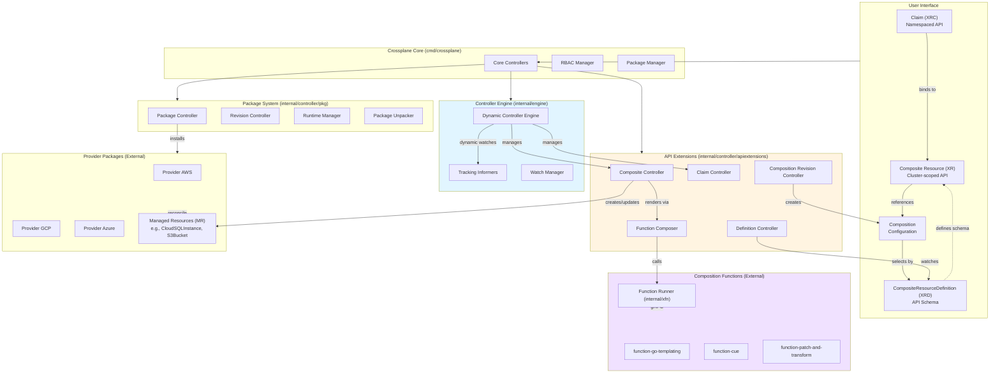
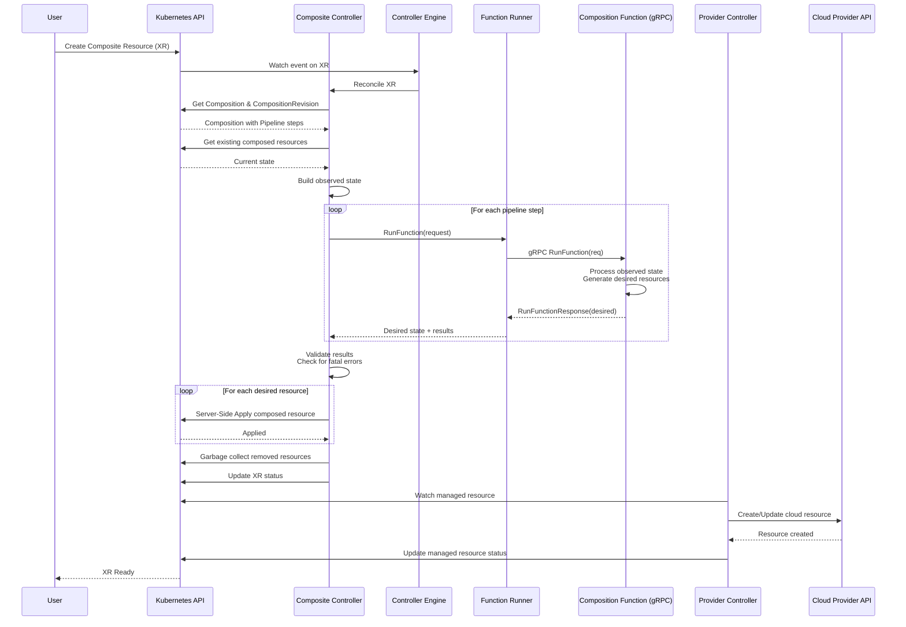
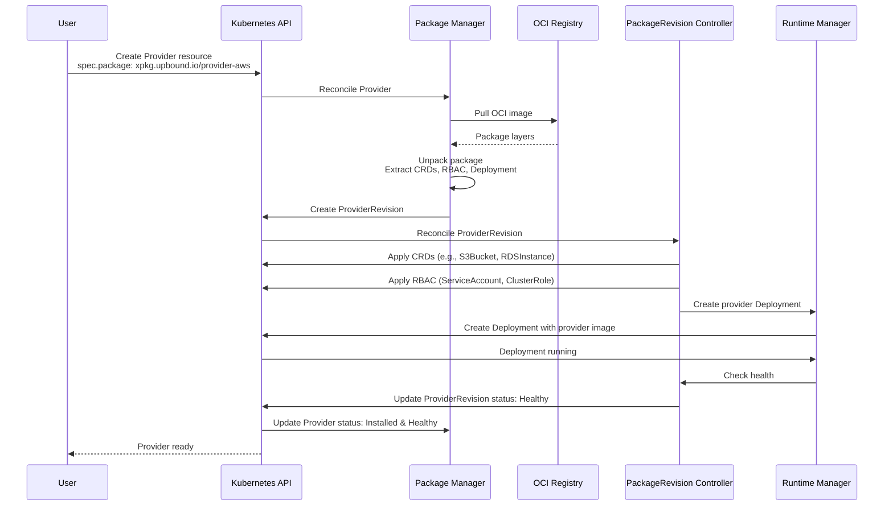

# Crossplane

> The Cloud Native Control Plane - A framework for building cloud native control planes without writing code

| Metadata | |
|---|---|
| Repository | https://github.com/crossplane/crossplane |
| License | Apache-2.0 |
| Primary Language | Go |
| Analyzed Release | `v2.1.4` (2026-02-03) |
| Stars (approx.) | 11,389 |
| Generated by | Claude Sonnet 4.5 (Anthropic) |
| Generated on | 2026-02-08 |

## Overview

Crossplane is a framework for building cloud native control planes that orchestrate applications and infrastructure across any environment. It extends Kubernetes using Custom Resource Definitions (CRDs) and controllers to provide a declarative API for provisioning and managing infrastructure resources from multiple cloud providers.

Problems it solves:

- Enables platform teams to build internal platform APIs without writing code, abstracting infrastructure complexity from application developers
- Provides a unified control plane for managing multi-cloud and hybrid cloud infrastructure using the Kubernetes API
- Allows composition of infrastructure primitives into higher-level abstractions through declarative configuration
- Eliminates vendor lock-in by offering portable infrastructure definitions across AWS, Azure, GCP, and other providers

Positioning:

Crossplane is a CNCF project positioned as a universal control plane framework. Unlike Terraform which uses HCL for infrastructure-as-code, Crossplane leverages Kubernetes CRDs and controllers for declarative infrastructure management. It competes with tools like Pulumi and AWS CDK but emphasizes a no-code approach and tight Kubernetes integration. The v2.0 release expanded beyond infrastructure management to include application orchestration, making it a comprehensive control plane solution.

## Architecture Overview

Crossplane employs a layered architecture built on Kubernetes extension mechanisms. The core consists of three primary layers: the Package Manager for installing providers and configurations, the API Extensions layer for defining composite resources through XRDs and Compositions, and the Control Plane Engine that dynamically manages controllers for reconciling resources.



## Core Components

### Controller Engine (`internal/engine`)

- Responsibility: Dynamically manages the lifecycle of controllers for composite and claim resources
- Key files: `internal/engine/engine.go`, `internal/engine/controller.go`
- Design patterns: Dynamic controller management, Informer tracking pattern

The Controller Engine is a sophisticated component that manages controllers dynamically based on the XRDs installed in the cluster. When a new XRD is created, the engine spins up dedicated controllers for that composite resource type without requiring a restart. The engine maintains a map of running controllers indexed by name and uses TrackingInformers to monitor which GVKs are actively being watched. This allows Crossplane to scale to hundreds of custom resource types efficiently.

The engine provides exclusive-use informers to prevent cache conflicts and supports dynamic watch management. Each controller can add or remove watches at runtime based on composition requirements. The engine also enforces RBAC by checking service account permissions before starting watches.

### Composite Resource Controller (`internal/controller/apiextensions/composite`)

- Responsibility: Reconciles composite resources by executing composition logic and managing composed resources
- Key files: `internal/controller/apiextensions/composite/reconciler.go`, `internal/controller/apiextensions/composite/composition_functions.go`
- Design patterns: Reconciliation loop, Function pipeline pattern, Server-side apply

The Composite Controller implements the core reconciliation logic for composite resources. It supports two composition modes: Patch & Transform (P&T) and Pipeline (functions). The Pipeline mode allows platform engineers to define a sequence of composition functions that process the desired state iteratively.

The reconciliation flow:
1. Select appropriate Composition and CompositionRevision
2. Fetch existing composed resources
3. Build observed state for the composition function pipeline
4. Execute function pipeline via gRPC calls
5. Apply desired composed resources using Server-Side Apply
6. Garbage collect resources no longer desired
7. Publish connection secrets

The controller uses field ownership (SSA) to manage concurrent updates and prevents conflicts when multiple controllers modify the same resource.

### Claim Controller (`internal/controller/apiextensions/claim`)

- Responsibility: Binds namespaced claims to cluster-scoped composite resources
- Key files: `internal/controller/apiextensions/claim/reconciler.go`
- Design patterns: Binding pattern, Connection secret propagation

Claims provide a namespaced API for developers to request infrastructure. The Claim Controller handles binding claims to composite resources, propagating connection secrets to the claim's namespace, and synchronizing status. Claims can either bind to pre-existing composite resources (static provisioning) or trigger dynamic provisioning of new composite resources.

### Package Manager (`internal/controller/pkg/manager`)

- Responsibility: Installs and manages Crossplane packages (Providers, Configurations, Functions)
- Key files: `internal/controller/pkg/manager/reconciler.go`, `internal/xpkg`
- Design patterns: Revision management, OCI image handling

The Package Manager reconciles Provider, Configuration, and Function resources by pulling OCI images, unpacking them, and creating PackageRevision resources. It supports pull policies (Always, IfNotPresent, Never) and automatic updates. The manager maintains a revision history and performs garbage collection of old revisions based on configurable retention policies.

Packages are stored as OCI artifacts in container registries, enabling standard DevOps workflows. The unpacker extracts CRDs, RBAC rules, and deployment manifests from the package and applies them to the cluster.

### Composition Revision Controller (`internal/controller/apiextensions/composition`)

- Responsibility: Creates immutable revisions of Compositions for safe updates
- Key files: `internal/controller/apiextensions/composition/reconciler.go`
- Design patterns: Immutable revision pattern

When a Composition is updated, this controller creates a new CompositionRevision. Composite resources reference specific revisions rather than the Composition directly, enabling controlled rollouts. This prevents unexpected changes to existing infrastructure when compositions are modified. The revision system supports update policies (Automatic, Manual) to control when composite resources migrate to new revisions.

### Function Runner (`internal/xfn`)

- Responsibility: Executes composition functions via gRPC protocol
- Key files: `internal/xfn/function_runner.go`, `internal/xfn/required_resources.go`, `internal/xfn/required_schemas.go`
- Design patterns: gRPC client pattern, Capability negotiation

The Function Runner invokes composition functions using the protobuf-based Function API. Functions can be deployed as Deployments in the cluster or pulled as OCI images. The runner handles:

- Protocol negotiation and capability detection
- Passing observed state, desired state, and context to functions
- Collecting function results and fatal errors
- Managing required resources and schemas for function dependencies
- Connection credential injection for functions

Functions communicate using the `RunFunctionRequest` and `RunFunctionResponse` protocol, enabling extensibility without modifying Crossplane core.

### RBAC Manager (`cmd/crossplane/rbac`)

- Responsibility: Dynamically generates RBAC roles for composite resources
- Key files: `cmd/crossplane/rbac`, `internal/controller/rbac`
- Design patterns: Dynamic RBAC generation

The RBAC Manager automatically creates ClusterRoles for managing composite and claim resources. When a new XRD is created, it generates roles allowing users to operate on those resources. This eliminates manual RBAC configuration and ensures consistent permissions across all composite resource types.

## Data Flow

### Composite Resource Provisioning with Functions



### Package Installation Flow



## Key Design Decisions

### 1. Function Pipeline Architecture

- Choice: Composition functions execute as gRPC services in a pipeline, each receiving and modifying the desired state
- Rationale: Enables extensibility without modifying Crossplane core. Functions can be written in any language and tested independently. The pipeline model allows composition of multiple transformations and integrations with external systems
- Trade-offs: Introduces complexity with out-of-process communication and serialization overhead. Functions require separate deployment and lifecycle management. However, this approach prevents the organic growth of an incomplete DSL within Crossplane's core API

### 2. Dynamic Controller Engine

- Choice: Controllers are created dynamically at runtime based on installed XRDs rather than being statically defined
- Rationale: Allows Crossplane to scale to hundreds or thousands of custom resource types without requiring restarts or redeployments. Each composite resource type gets a dedicated controller with its own reconciliation queue and rate limiting
- Trade-offs: Increases architectural complexity and requires careful management of shared resources like caches and informers. Memory usage grows with the number of XRDs, but enables true multi-tenancy and resource isolation

### 3. Composition Revisions

- Choice: Compositions are versioned with immutable revisions, and composite resources reference specific revisions
- Rationale: Provides safe update semantics for infrastructure definitions. Platform teams can update compositions without immediately affecting existing resources. Supports gradual migration strategies and rollback capabilities
- Trade-offs: Adds additional resources to manage and potential confusion between Compositions and CompositionRevisions. Requires garbage collection of old revisions. However, prevents accidental breaking changes to production infrastructure

### 4. Server-Side Apply for Composed Resources

- Choice: Use Kubernetes Server-Side Apply (SSA) with explicit field ownership for managing composed resources
- Rationale: SSA enables multiple controllers to manage different fields of the same resource without conflicts. Field ownership clearly defines which controller is responsible for which fields. Supports composition hierarchies where an XR composes another XR
- Trade-offs: Requires Kubernetes 1.16+ and careful management of field owners. More complex than traditional Update operations but essential for avoiding ownership conflicts in complex compositions

### 5. Package-Based Extension Model

- Choice: Providers, Configurations, and Functions are distributed as OCI images
- Rationale: Leverages existing container registry infrastructure and workflows. Enables versioning, signing, and distribution using standard tools. Packages can include CRDs, controllers, and configuration in a single artifact
- Trade-offs: Requires OCI registry access and understanding of image management. Increases download times compared to in-cluster resources. However, provides a familiar distribution model and strong supply chain security

### 6. High-Fidelity Managed Resources

- Choice: Managed resources are direct representations of cloud provider APIs with minimal abstraction
- Rationale: Ensures full feature parity with cloud providers. Users can access all fields and features without waiting for abstractions. Simplifies provider development through code generation from cloud APIs
- Trade-offs: Results in verbose resource definitions and requires cloud-specific knowledge. Platform teams must build their own abstractions using compositions. However, prevents the "lowest common denominator" problem and ensures completeness

## Dependencies

```mermaid
graph LR
    subgraph Core
        Main["Crossplane Core"]
    end

    subgraph Runtime["Crossplane Runtime"]
        Runtime["crossplane-runtime<br/>Common controllers & types"]
    end

    subgraph K8s["Kubernetes Ecosystem"]
        ControllerRuntime["controller-runtime<br/>Controller framework"]
        ClientGo["client-go<br/>Kubernetes client"]
        APIExtensions["apiextensions-apiserver<br/>CRD support"]
    end

    subgraph Protocol["Function Protocol"]
        ProtoFn["proto/fn/v1<br/>gRPC API definition"]
        Protobuf["protobuf<br/>Serialization"]
    end

    subgraph CLI["CLI Tools"]
        Cobra["cobra<br/>CLI framework"]
        Kong["kong<br/>Command parsing"]
    end

    subgraph Extensions["Extension Points"]
        Providers["Provider Packages<br/>provider-aws, provider-gcp"]
        Functions["Function Packages<br/>function-*, custom functions"]
        Configurations["Configuration Packages<br/>Reusable compositions"]
    end

    Main --> Runtime
    Main --> ControllerRuntime
    Main --> ProtoFn
    Main --> Kong

    Runtime --> ClientGo
    Runtime --> ControllerRuntime

    ControllerRuntime --> ClientGo
    ControllerRuntime --> APIExtensions

    ProtoFn --> Protobuf

    Main -.->|installs| Providers
    Main -.->|installs| Functions
    Main -.->|installs| Configurations

    style Runtime fill:#e1f5ff
    style Extensions fill:#f0e1ff
```

## Testing Strategy

Crossplane employs a multi-layered testing approach covering unit, integration, and end-to-end scenarios.

Unit tests: Extensive unit testing of individual components using Go's testing framework. Controllers use fake clients from controller-runtime for isolated testing. Functions and utilities have high test coverage with table-driven tests for edge cases.

Integration tests: Integration tests validate controller behavior against a real Kubernetes API server (envtest). These tests exercise full reconciliation loops, CRD installation, and resource management without requiring cloud provider credentials.

E2E tests: End-to-end tests run against real Kubernetes clusters and cloud providers. These tests validate the full stack including package installation, composition execution, and actual resource provisioning in AWS, GCP, and Azure. E2E tests use special test providers that can mock cloud API responses for deterministic testing.

CI/CD: GitHub Actions workflows run tests on every pull request. The pipeline includes:
- Linting (golangci-lint) and code generation verification
- Unit and integration tests with race detection
- E2E tests against multiple Kubernetes versions
- Code coverage reporting
- Security scanning with Trivy
- Build verification for multiple architectures

## Key Takeaways

1. Dynamic Extension Architecture: Crossplane demonstrates how to build a truly extensible platform using dynamic controller management. The Controller Engine pattern allows unlimited resource types without core modifications, providing a blueprint for building scalable Kubernetes operators that must support arbitrary custom resources.

2. Function Pipeline for Declarative Logic: The composition function pipeline solves the "configuration DSL problem" by delegating complex logic to external, testable functions. This design prevents feature creep in the core API while enabling arbitrary transformation logic. This pattern is applicable to any system that needs extensible data transformation pipelines.

3. Revision-Based Safe Updates: The composition revision system demonstrates how to implement safe update semantics for declarative infrastructure. By making configuration changes immutable and requiring explicit migration, Crossplane prevents accidental production changes. This pattern is valuable for any system managing critical resources that require controlled update rollouts.

4. Package-Based Distribution: Using OCI images for distributing extensions (providers, functions, configurations) provides a familiar and secure distribution mechanism. This approach leverages existing registry infrastructure and enables strong supply chain security through image signing and verification.

5. gRPC-Based Extensibility: The function protocol demonstrates how to build a language-agnostic extension API. By using Protocol Buffers and gRPC, Crossplane enables composition functions in any language while maintaining type safety and performance. This pattern is applicable to any platform requiring user-provided extensions.

## References

- [Crossplane Official Documentation](https://docs.crossplane.io/)
- [Crossplane GitHub Repository](https://github.com/crossplane/crossplane)
- [Composition Functions Design Document](https://github.com/crossplane/crossplane/blob/main/design/design-doc-composition-functions.md)
- [Composition Design Document](https://github.com/crossplane/crossplane/blob/main/design/design-doc-composition.md)
- [Crossplane Architecture Overview](https://www.crossplane.io/why-control-planes)
- [Extending Kubernetes with Crossplane CRDs](https://blog.upbound.io/kubernetes-crds)
- [Crossplane v2.0 Release - InfoQ](https://www.infoq.com/news/2025/08/crossplane-applications-v2/)
- [Provisioning Multi-Cloud Infrastructure with Crossplane and Dapr](https://blog.crossplane.io/crossplane-and-dapr/)
- [AWS Blueprints for Crossplane](https://aws.amazon.com/blogs/opensource/introducing-aws-blueprints-for-crossplane/)
