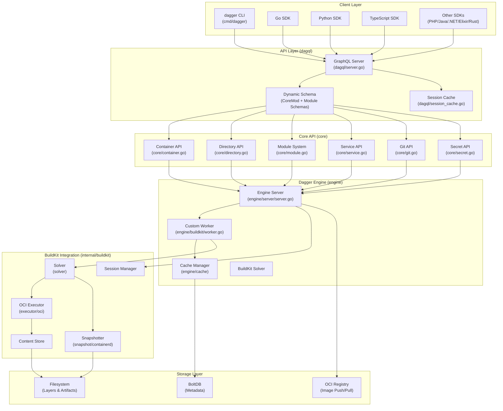
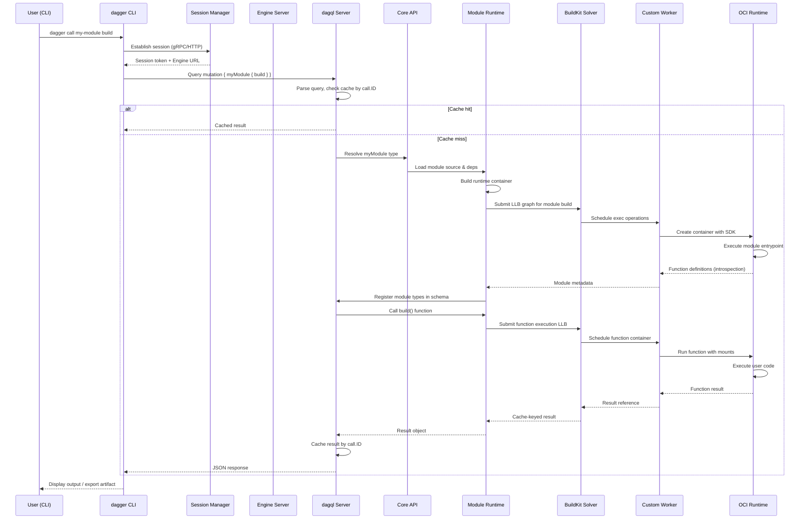
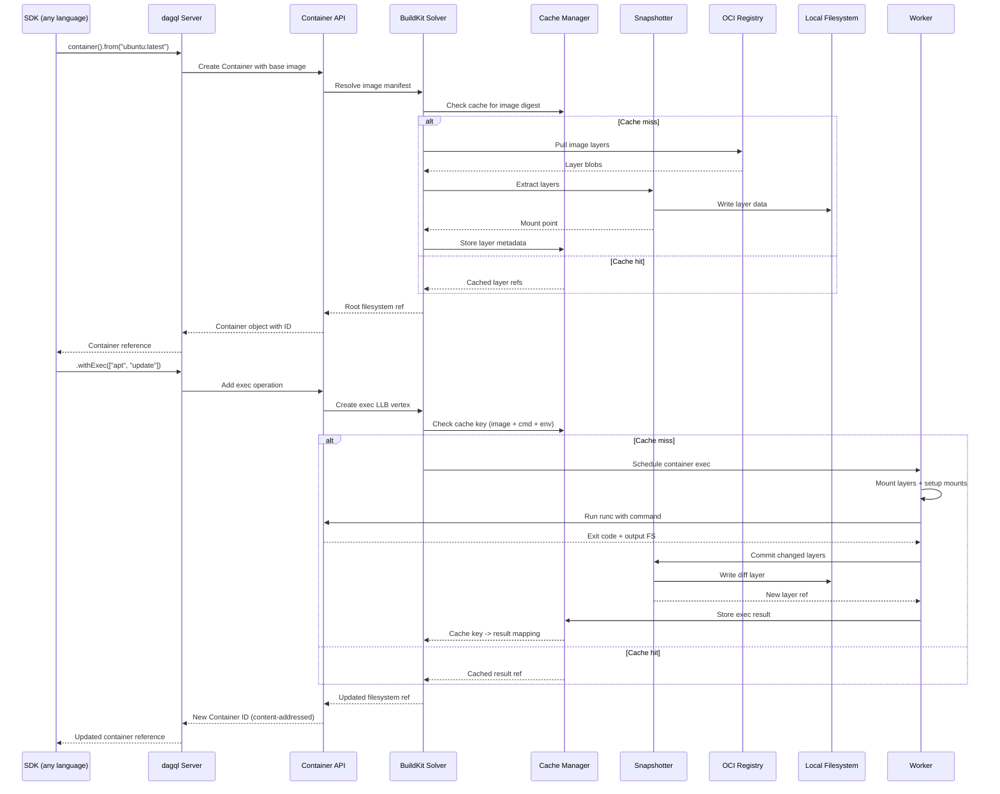
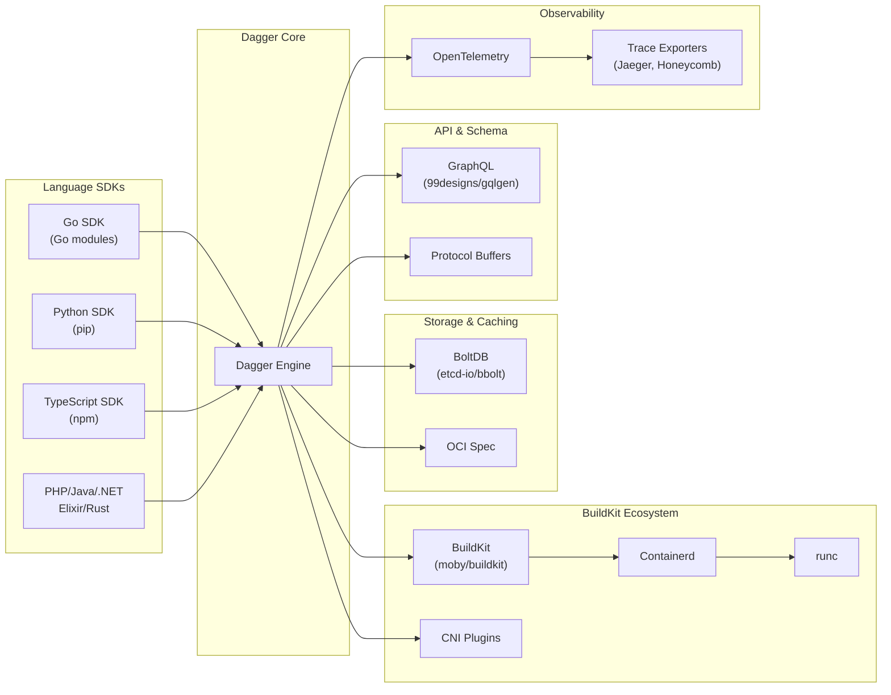

# Dagger

> A programmable CI/CD automation engine that builds, tests and ships any codebase, running locally, in CI, or directly in the cloud

| Metadata | |
|---|---|
| Repository | https://github.com/dagger/dagger |
| License | Apache-2.0 |
| Primary Language | Go |
| Analyzed Release | `sdk/rust/v0.19.11` (2026-02-05) |
| Stars (approx.) | 15,402 |
| Generated by | Claude Sonnet 4.5 (Anthropic) |
| Generated on | 2026-02-08 |

## Overview

Dagger is a platform for automating software delivery that transforms CI/CD from proprietary YAML configurations into programmable, type-safe code. It provides a portable devkit powered by BuildKit that enables developers to write CI/CD pipelines in their preferred programming language (Go, Python, TypeScript, PHP, Java, .NET, Elixir, Rust) and run them consistently across any environment.

Problems it solves:

- Eliminates the gap between local development and CI environments by making pipelines runnable anywhere with just a container runtime
- Replaces brittle shell scripts and vendor-specific YAML with type-safe, testable code using native programming languages
- Provides advanced caching and incremental execution to dramatically speed up build times through content-addressed operations
- Enables pipeline observability with built-in OpenTelemetry tracing and real-time visualization

Positioning:

Dagger positions itself as the "Docker for CI/CD" - providing a standardized abstraction layer over build infrastructure. Unlike traditional CI platforms (GitHub Actions, GitLab CI, Jenkins) that lock users into specific YAML syntaxes, Dagger treats pipelines as portable applications. It competes with tools like Earthly and Depot but distinguishes itself through its multi-language SDK approach, modular architecture, and deep BuildKit integration. Adopted by Docker itself for internal CI/CD workflows, Dagger represents a paradigm shift toward programmable, infrastructure-agnostic automation.

## Architecture Overview

Dagger employs a client-server architecture where the Engine (a custom BuildKit server) executes operations as DAG vertices, while language-specific SDKs provide idiomatic interfaces. The core implements a GraphQL API (dagql) that all SDKs communicate with, enabling type-safe cross-language interoperability and content-addressed execution.

## Core Components

### CLI Layer (`cmd/dagger`)

- Responsibility: Command routing, session management, and interactive terminal UI
- Key files: `cmd/dagger/main.go`, `cmd/dagger/run.go`, `cmd/dagger/functions.go`
- Design patterns: Command pattern (Cobra), Middleware chain, TUI (Bubble Tea)

The CLI serves as the primary entry point for users, handling commands like `dagger call`, `dagger run`, `dagger init`, and `dagger query`. It establishes a session with the engine (either locally via Docker or remotely via SSH), manages authentication, and provides real-time progress visualization through a terminal UI built with Bubble Tea. The `run.go` file implements the core execution flow, while `functions.go` handles function discovery and invocation for modules.

Configuration resolution follows the precedence: CLI flags > environment variables > `dagger.json`. The CLI automatically provisions the engine container if not already running, using the Docker client or a custom container runtime adapter.

### dagql - GraphQL Server (`dagql/server.go`, `dagql/objects.go`)

- Responsibility: Dynamic GraphQL schema generation and request execution with content-addressed caching
- Key files: `dagql/server.go`, `dagql/objects.go`, `dagql/types.go`, `dagql/call/id.go`
- Design patterns: Type-safe builder pattern, Content-addressed identifiers, Dynamic schema composition

dagql is Dagger's custom GraphQL server implementation that extends standard GraphQL with content-addressed IDs. Every object is identified by a call.ID that encodes its full computation graph, enabling automatic caching and incremental execution. The Server struct maintains a dynamic schema that can be extended at runtime through module loading.

The system implements a SessionCache (`dagql/session_cache.go`) that memoizes operation results within a session, ensuring that identical operations are never executed twice. Object types are registered via `InstallObject()`, and the schema is lazily compiled per view (enabling multi-tenancy and per-module type isolation).

### Core API (`core/`)

- Responsibility: Implementation of all built-in Dagger types and operations
- Key files: `core/container.go`, `core/directory.go`, `core/module.go`, `core/service.go`, `core/schema/coremod.go`
- Design patterns: Fluent API, Lazy evaluation, Content-addressed state

The core package implements the fundamental primitives of the Dagger API:

- Container (32k+ LOC): Manages container lifecycle, image operations, exec commands, and filesystem mounts
- Directory (46k+ LOC): Handles directory operations, filtering, copying, and diffing
- Module (32k+ LOC): Implements the module system for loading and executing user-defined functions
- Service: Manages long-running services and inter-container networking
- Git: Provides Git repository integration and ref resolution
- Secret: Secure secret management with content-addressed encryption

Each type follows a lazy evaluation model where operations build up a computation graph that is only executed when needed. The CoreMod struct (`core/schema/coremod.go`) registers all these types into the dagql schema.

### Engine Server (`engine/server/server.go`)

- Responsibility: Engine lifecycle management, BuildKit integration, and worker coordination
- Key files: `engine/server/server.go`, `engine/server/gc.go`, `engine/server/telemetry.go`
- Design patterns: Singleton server, Resource lifecycle management, Telemetry middleware

The Engine Server is the heart of Dagger, initializing and managing all BuildKit components:

- Containerd metadata DB for content tracking
- BoltDB for solver cache storage
- Snapshotter (overlay or native) for filesystem layers
- Worker for job execution
- Session manager for client connections
- Cache importers/exporters for external cache backends (Registry, GitHub Actions, S3)

It handles database corruption recovery, garbage collection scheduling (every 6 hours by default), and telemetry propagation. The server runs as a privileged container to manage nested containers and network isolation.

### Custom Worker (`engine/buildkit/worker.go`, `engine/buildkit/executor.go`)

- Responsibility: Custom BuildKit worker with Dagger-specific execution enhancements
- Key files: `engine/buildkit/worker.go`, `engine/buildkit/executor.go`, `engine/buildkit/containerd.go`
- Design patterns: Worker pool pattern, OCI runtime abstraction, Namespace isolation

Dagger's Worker extends BuildKit's base worker with custom execution logic. The primary enhancement is in the Executor implementation, which sets up containers with:

- Session ID injection for nested Dagger access
- GPU device passthrough for ML workloads
- Service binding and network tunnel setup
- Enhanced security contexts (AppArmor, SELinux)
- Telemetry trace propagation

The Worker manages parallelism through a semaphore (default 4 concurrent operations) and maintains a registry of running executions for lifecycle management. It integrates with runc for low-level container operations and implements custom OCI hooks for Dagger-specific initialization.

### Module System (`core/module.go`, `core/modulesource.go`, `core/modfunc.go`)

- Responsibility: Loading, dependency resolution, and execution of user-defined Dagger modules
- Key files: `core/module.go`, `core/modulesource.go`, `core/modfunc.go`, `core/modtree.go`
- Design patterns: Dependency injection, Dynamic code generation, Sandboxed execution

The module system enables users to extend Dagger with custom functions written in any supported SDK. Key features:

- ModuleSource: Resolves modules from local directories, Git repositories, or OCI registries
- ModDeps: Manages dependency DAG with cycle detection and transitive resolution
- Runtime: Builds module runtime containers with SDK toolchains
- Code generation: Automatically generates client bindings for module types
- Function introspection: Extracts type information via runtime reflection

Modules are content-addressed by their source and dependencies, ensuring reproducible builds. The system supports toolchain modules that provide shared build environments across multiple modules.

### BuildKit Solver Integration (`internal/buildkit/solver`)

- Responsibility: DAG-based job scheduling and distributed caching
- Key files: `internal/buildkit/solver/solver.go`, `internal/buildkit/solver/llbsolver`, `internal/buildkit/cache`
- Design patterns: DAG execution, Merkle tree caching, LLB (Low-Level Build) abstraction

BuildKit's solver orchestrates complex build graphs with dependency tracking. Operations are represented as LLB (Low-Level Build) definitions - a protocol buffer format that describes build steps. The solver:

- Topologically sorts operations for parallel execution
- Checks cache keys at each vertex before execution
- Implements a Merkle tree for content-addressed caching
- Supports remote cache backends through exporters/importers
- Handles failure recovery and retry logic

Dagger leverages BuildKit's cache layering where each operation produces a CacheResult with content-addressed outputs. This enables the "change one file, rebuild only affected steps" behavior that makes Dagger fast.

## Data Flow

### Module Function Invocation Flow

### Container Build and Cache Flow

## Key Design Decisions

### 1. BuildKit as Foundation

- Choice: Integrate BuildKit as the core execution engine rather than building from scratch
- Rationale: BuildKit provides production-grade DAG scheduling, content-addressed caching, OCI compliance, and distributed caching out of the box. Moby's BuildKit team has solved complex problems around parallel execution, cache efficiency, and security sandboxing that would take years to replicate. By wrapping BuildKit, Dagger inherits these capabilities while adding its own abstraction layer.
- Trade-offs: Tight coupling to BuildKit means Dagger's performance and capabilities are bounded by BuildKit's limitations. However, the gained stability and feature set far outweigh the loss of control. Dagger contributes fixes upstream and maintains a fork for Dagger-specific enhancements.

### 2. Content-Addressed Everything

- Choice: Use content-addressed identifiers (call.ID) for all objects, encoding the full computation graph in the ID
- Rationale: This enables automatic caching, reproducibility, and distributed computation without complex cache invalidation logic. An object with the same ID will always produce the same result, making cache hits trivial to determine. It also enables the "programmable CI/CD" vision where pipelines can be composed, shared, and cached across teams and environments.
- Trade-offs: IDs become large and unwieldy (they're essentially serialized call chains). The system requires careful design to avoid ID bloat. However, the benefits of automatic caching and reproducibility justify this complexity. IDs are never user-facing - they're internal implementation details.

### 3. Multi-Language SDK via GraphQL

- Choice: Expose the engine API as GraphQL and generate language-specific SDKs from the schema
- Rationale: GraphQL provides type safety, introspection, and a standardized query language that can be consumed by any language. By auto-generating SDKs, Dagger ensures API consistency across languages while providing idiomatic interfaces (camelCase in JS, snake_case in Python, etc.). This approach also enables modules written in different languages to interoperate seamlessly - a Python module can call a Go module transparently.
- Trade-offs: GraphQL adds HTTP/gRPC overhead compared to native function calls. Code generation adds complexity to the build process and can produce verbose code. However, the cross-language interoperability and type safety benefits are critical for Dagger's vision of a language-agnostic CI/CD platform.

### 4. Modules as Runtime Containers

- Choice: Execute user modules by spawning containers that run the module's entrypoint and communicate via GraphQL
- Rationale: This provides complete isolation and reproducibility - modules cannot interfere with each other or the engine. It also enables versioned SDK dependencies (each module bundles its own SDK version) and multi-language support (each SDK defines its own runtime environment). The container-based approach makes modules portable and cacheable.
- Trade-offs: Cold start overhead for module initialization (though mitigated by caching). Memory overhead for multiple runtime containers in complex pipelines. However, the isolation and reproducibility gains justify these costs, especially in CI environments where reliability trumps microsecond performance.

### 5. Lazy Evaluation with Explicit Materialization

- Choice: Operations return "future" objects that aren't executed until explicitly evaluated (e.g., via export, stdout, or sync methods)
- Rationale: This enables operation fusion and optimization - the engine can see the entire execution graph before running anything. It also reduces unnecessary work (e.g., building an image that's never used). The approach mirrors functional programming paradigms and enables powerful composition patterns.
- Trade-offs: Debugging can be confusing because errors don't occur where the code is written, but rather at evaluation time. Users must understand the difference between constructing a pipeline and executing it. However, this is a common pattern in modern frameworks (TensorFlow, Dask, etc.) and the performance benefits are substantial.

## Dependencies

Key dependencies:

- BuildKit (moby/buildkit): Core execution engine, forked and customized for Dagger-specific needs
- Containerd: Content store and snapshot management
- runc: Low-level container runtime
- BoltDB (bbolt): Embedded key-value store for cache metadata and solver state
- gqlgen (99designs/gqlgen): GraphQL server framework
- OpenTelemetry: Distributed tracing and observability
- CNI plugins: Network isolation and inter-container communication

## Testing Strategy

Dagger uses a comprehensive testing approach that leverages itself for testing (dogfooding):

Unit tests: Extensive Go unit tests for core logic, especially in the dagql package and core API. Table-driven tests for GraphQL query parsing and ID serialization. Mock implementations of BuildKit interfaces for isolated testing.

Integration tests: The `core/integration` directory contains comprehensive end-to-end tests that spin up real engine instances and execute operations. Tests use the Go SDK to programmatically construct pipelines and verify results. Key test suites include TestModule (module system), TestContainer (container operations), and TestDirectory (filesystem operations).

SDK tests: Each SDK has its own test suite that runs against a live engine. Cross-language tests verify that modules written in one language can be called from another. The `dagger call test-sdks` command runs all SDK tests in parallel.

CI/CD: Dagger's own CI pipeline is defined using Dagger (meta!). The `.dagger` directory contains the build, test, and release workflows written in Go. GitHub Actions triggers these Dagger pipelines, but the logic is portable to any CI platform. Tests run on every PR with caching enabled to keep feedback loops fast.

Manual testing: `dagger call playground terminal` provides an interactive sandbox with all components built and running, enabling rapid experimentation during development.

## Key Takeaways

1. Abstraction through Standardization: Dagger demonstrates that complex infrastructure can be abstracted behind a simple, type-safe API. By standardizing on GraphQL and content-addressed operations, it provides a consistent interface across vastly different execution environments (local Docker, Kubernetes, cloud VMs). This standardization enables portability without sacrificing power - a key lesson for building cross-platform developer tools.

2. Content-Addressed Execution as a Primitive: Encoding the computation graph in object identifiers eliminates entire classes of cache invalidation bugs. When combined with immutable operations, this enables fearless parallelization and distributed caching. Future systems could apply this pattern beyond CI/CD - imagine content-addressed function calls in serverless platforms or distributed data processing.

3. Multi-Language Interoperability via Generated Clients: Auto-generating SDKs from a schema (GraphQL, OpenAPI, gRPC) enables true polyglot ecosystems. Each language gets idiomatic bindings while the core remains single-source-of-truth. This approach scales better than hand-written bindings and enables rapid iteration on the core API without breaking clients. The trade-off is initial complexity in the code generation pipeline, but it pays dividends in long-term maintainability.

4. BuildKit as a Reusable Execution Substrate: Dagger proves that BuildKit's value extends far beyond Docker image builds. Its DAG scheduler, cache system, and OCI runtime integration form a robust foundation for any workflow automation system. Other projects could leverage BuildKit for CI/CD, data pipelines, or infrastructure orchestration rather than building execution engines from scratch.

5. Lazy Evaluation Enables Optimization: By deferring execution until explicitly requested, Dagger can optimize entire execution graphs holistically. This pattern (common in TensorFlow, Dask, Spark) trades debuggability for performance and composability. The key is providing good error messages that bridge the gap between construction time and execution time, helping users mentally model the split.

## References

- [Dagger Official Documentation](https://docs.dagger.io)
- [Dagger GitHub Repository](https://github.com/dagger/dagger)
- [Dagger Launch Announcement](https://dagger.io/blog/public-launch-announcement)
- [BuildKit Documentation](https://github.com/moby/buildkit)
- [Use Docker to build better CI/CD pipelines with Dagger](https://dev.to/camptocamp-ops/use-docker-to-build-better-cicd-pipelines-with-dagger-4l4j)
- [Exploring Dagger: Streamlining CI/CD Pipelines with Code](https://blog.matiaspan.dev/exploring-dagger-streamlining-ci-cd-pipelines-with-code/)
- [Using Dagger with Docker for better CI/CD](https://blog.logrocket.com/using-dagger-with-docker-for-better-ci-cd/)
- [What Is Dagger? A New Take on CI/CD for Kubernetes-Native DevOps](https://www.gocodeo.com/post/what-is-dagger-a-new-take-on-ci-cd-for-kubernetes-native-devops)
- [Dagger: Standardizing CI/CD is the Holy Grail of DevOps](https://devops.com/dagger-standardizing-ci-cd-is-the-holy-grail-of-devops/)
