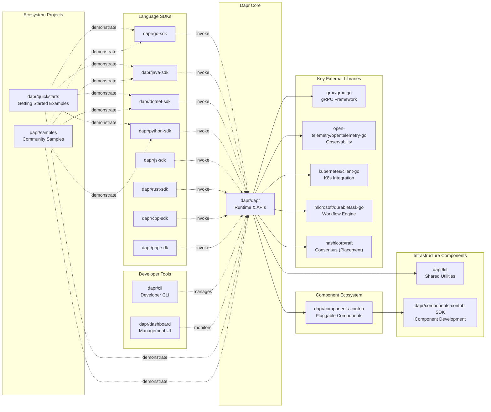

# Dapr

> A portable runtime for building distributed applications across cloud and edge, combining event-driven architecture with workflow orchestration

| Metadata | |
|---|---|
| Repository | https://github.com/dapr/dapr |
| License | Apache-2.0 |
| Primary Language | Go |
| Category | Runtime |
| Analyzed Release | `v1.17.0-rc.4` (2026-02-05) |
| Stars (approx.) | 25,480 |
| Generated by | Claude Opus 4.6 (Anthropic) |
| Generated on | 2026-02-08 |

## Overview

Dapr (Distributed Application Runtime) is a CNCF graduated project that provides a set of integrated APIs with built-in best practices and patterns for building distributed applications. Dapr increases developer productivity by 20-40% through out-of-the-box features such as workflow, pub/sub, state management, secret stores, external configuration, bindings, actors, distributed locks, and cryptography, eliminating the need to write boilerplate code for production-ready applications.

Problems it solves:

- Abstracting infrastructure complexity away from application code, enabling developers to focus on business logic rather than distributed systems plumbing
- Providing consistent APIs across different programming languages and frameworks, eliminating framework lock-in and enabling polyglot architectures
- Simplifying microservices patterns like service invocation, pub/sub messaging, state management, and workflow orchestration through standardized building blocks
- Enabling portable deployments across Kubernetes, edge devices, cloud environments, and self-hosted infrastructure without code changes

Positioning:

Dapr is developer-centric versus infrastructure-centric service meshes like Istio. While service meshes focus on networking layer concerns (traffic management, observability), Dapr operates at the application layer providing building blocks developers need to build resilient microservices. Dapr is commonly deployed alongside service meshes, with each handling different concerns. It has been adopted by platform teams to provide governance and golden paths for API-based infrastructure interaction, and serves as Harbor's default scanner in enterprise environments.

## Architecture Overview

Dapr employs a sidecar architecture where each application instance runs with a companion Dapr runtime process (daprd). The sidecar intercepts all distributed computing concerns via HTTP/gRPC APIs, while the application remains completely decoupled from infrastructure. Components are pluggable implementations of building block interfaces, loaded from a separate components-contrib repository. The control plane provides operational services including placement (for actor distribution), operator (for Kubernetes resource management), sentry (for mTLS certificate authority), and scheduler (for jobs and workflow orchestration).

```mermaid
graph TB
    subgraph Application["Application Layer"]
        App1["Application 1<br/>(Any Language)"]
        App2["Application 2<br/>(Any Language)"]
        App3["Application 3<br/>(Any Language)"]
    end

    subgraph Sidecar1["Dapr Sidecar 1 (daprd)"]
        API1["HTTP/gRPC API"]
        Runtime1["Runtime Core<br/>(pkg/runtime)"]
        Components1["Component Loaders"]
        Middleware1["HTTP Middleware"]
    end

    subgraph Sidecar2["Dapr Sidecar 2 (daprd)"]
        API2["HTTP/gRPC API"]
        Runtime2["Runtime Core<br/>(pkg/runtime)"]
        Components2["Component Loaders"]
        Middleware2["HTTP Middleware"]
    end

    subgraph Sidecar3["Dapr Sidecar 3 (daprd)"]
        API3["HTTP/gRPC API"]
        Runtime3["Runtime Core<br/>(pkg/runtime)"]
        Components3["Component Loaders"]
        Middleware3["HTTP Middleware"]
    end

    subgraph ControlPlane["Dapr Control Plane"]
        Placement["Placement Service<br/>(Actor Distribution)"]
        Operator["Operator<br/>(K8s Resource Management)"]
        Sentry["Sentry<br/>(mTLS CA)"]
        Scheduler["Scheduler<br/>(Jobs & Workflows)"]
        Injector["Sidecar Injector<br/>(K8s Admission Controller)"]
    end

    subgraph BuildingBlocks["Building Blocks"]
        ServiceInvoke["Service Invocation"]
        StateMgmt["State Management"]
        PubSub["Pub/Sub"]
        Bindings["Input/Output Bindings"]
        Actors["Virtual Actors"]
        Secrets["Secret Management"]
        Config["Configuration"]
        Lock["Distributed Lock"]
        Workflow["Workflow"]
        Crypto["Cryptography"]
    end

    subgraph ComponentsRepo["components-contrib Repository"]
        StateStores["State Stores<br/>(Redis, Cosmos, etc.)"]
        PubSubBrokers["Pub/Sub Brokers<br/>(Kafka, RabbitMQ, etc.)"]
        SecretStores["Secret Stores<br/>(Vault, K8s, etc.)"]
        BindingImpls["Bindings<br/>(AWS, Azure, GCP, etc.)"]
    end

    App1 <--> API1
    App2 <--> API2
    App3 <--> API3

    API1 --> Runtime1
    API2 --> Runtime2
    API3 --> Runtime3

    Runtime1 --> Components1
    Runtime2 --> Components2
    Runtime3 --> Components3

    Components1 & Components2 & Components3 --> StateStores & PubSubBrokers & SecretStores & BindingImpls

    Runtime1 & Runtime2 & Runtime3 --> ServiceInvoke & StateMgmt & PubSub & Bindings & Actors & Secrets & Config & Lock & Workflow & Crypto

    Runtime1 & Runtime2 & Runtime3 <--> Placement
    Runtime1 & Runtime2 & Runtime3 <--> Sentry
    Runtime1 & Runtime2 & Runtime3 <--> Scheduler

    Injector -.->|injects| Sidecar1 & Sidecar2 & Sidecar3
    Operator -.->|manages CRDs| ControlPlane

    Runtime1 <-.->|service-to-service| Runtime2
    Runtime2 <-.->|service-to-service| Runtime3
```



## Core Components

### Dapr Runtime (pkg/runtime)

- Responsibility: Core orchestration layer that initializes and manages all building blocks, components, and communication channels throughout the sidecar lifecycle
- Key files: `pkg/runtime/runtime.go`, `pkg/runtime/processor/processor.go`, `pkg/runtime/compstore/compstore.go`
- Design patterns: Dependency injection, component registry pattern, modular pipeline architecture

The DaprRuntime struct serves as the central orchestrator, holding references to all major subsystems including gRPC/HTTP API servers, component store, actor runtime, workflow engine, direct messaging, pub/sub adapters, and security handlers. The runtime initialization flow follows a carefully sequenced startup: security setup, component loading, building block initialization, API server startup, and health check registration. The processor package handles dynamic component lifecycle management including hot-reloading of component configurations via Kubernetes CRD watches. The component store (compstore) maintains an in-memory registry of all loaded components with thread-safe access patterns.

### Building Blocks (pkg/messaging, pkg/actors, pkg/runtime/pubsub)

- Responsibility: Implementing the standard APIs that applications interact with for distributed computing patterns
- Key files: `pkg/messaging/v1/invoke.go`, `pkg/actors/actors.go`, `pkg/runtime/pubsub/adapter.go`, `pkg/runtime/wfengine/`
- Design patterns: Adapter pattern, virtual actor pattern, publish-subscribe pattern, saga pattern (workflows)

Service invocation uses the direct messaging component to provide service-to-service calls with retries, timeouts, and distributed tracing. The actor subsystem implements the virtual actor pattern with turn-based concurrency, where each actor ID is deterministically mapped to a sidecar instance via the placement service's consistent hashing. Pub/Sub uses an adapter interface that supports both push-based (streamer) and pull-based (subscriber) models depending on the broker capabilities. The workflow engine embeds the durabletask-go framework directly into the sidecar, managing long-running workflows with durable execution guarantees and saga-based compensation.

### Component Loaders (pkg/components)

- Responsibility: Discovering, validating, and instantiating pluggable component implementations from components-contrib repository
- Key files: `pkg/components/state/registry.go`, `pkg/components/pubsub/registry.go`, `pkg/components/bindings/registry.go`, `pkg/components/pluggable/`
- Design patterns: Registry pattern, factory pattern, plugin architecture

Each component type (state stores, pub/sub brokers, bindings, secret stores, etc.) has a dedicated registry that maps component names to factory functions. The registration happens at package init time via blank imports in `cmd/daprd/components/`, which automatically includes all available components in the binary. Components implement standardized interfaces defined in components-contrib, ensuring swappability. The pluggable components system extends this to support out-of-process components via gRPC, enabling custom implementations in any language without recompiling Dapr. Component initialization includes metadata validation, connection establishment, and capability detection (e.g., checking if a state store supports transactions or queries).

### API Layer (pkg/api/grpc, pkg/api/http)

- Responsibility: Exposing building block functionality via standard HTTP and gRPC protocols with consistent semantics
- Key files: `pkg/api/grpc/api.go`, `pkg/api/http/api.go`, `pkg/api/universal/universal.go`
- Design patterns: API gateway pattern, protocol translation, middleware chain

The HTTP and gRPC APIs provide equivalent functionality with automatic protocol translation where needed. The universal API package provides a unified abstraction over both protocols for internal use. The gRPC API uses protocol buffers defined in `pkg/proto/` for strong typing and efficient serialization. The HTTP API follows RESTful conventions with JSON payloads. Both APIs integrate middleware chains for cross-cutting concerns like authentication, rate limiting, tracing, and metrics. The API servers support both application-facing endpoints (invocation, state, pub/sub) and control plane endpoints (health, metadata, placement tables).

### Control Plane Services (pkg/placement, pkg/operator, pkg/sentry, pkg/scheduler)

- Responsibility: Providing operational services for actor placement, resource management, security, and workflow scheduling
- Key files: `pkg/placement/placement.go`, `pkg/operator/operator.go`, `pkg/sentry/sentry.go`, `pkg/scheduler/server.go`
- Design patterns: Consistent hashing, certificate authority pattern, raft consensus, scheduler pattern

The placement service uses raft consensus to maintain a distributed hash table mapping actor types to host instances, broadcasting updates to all sidecars. Sentry acts as a certificate authority issuing short-lived x.509 certificates for automatic mTLS between sidecars, supporting rotation and revocation. The operator watches Kubernetes CRDs (Components, Configurations, Subscriptions, HttpEndpoints) and streams updates to sidecars, enabling declarative component management. The scheduler service manages job scheduling and workflow orchestration with durable task execution, handling retries, timeouts, and event-driven task coordination.

## Data Flow

### Service-to-Service Invocation with Actors

```mermaid
sequenceDiagram
    participant App1 as Application 1
    participant Sidecar1 as Dapr Sidecar 1<br/>(daprd)
    participant Placement as Placement Service
    participant NameRes as Name Resolution
    participant Sentry as Sentry (mTLS CA)
    participant Sidecar2 as Dapr Sidecar 2<br/>(daprd)
    participant Actor as Actor Instance
    participant StateStore as State Store<br/>(Redis/Cosmos)

    App1->>Sidecar1: POST /v1.0/actors/MyActor/123/method/transfer
    Sidecar1->>Sidecar1: Parse actor type & ID

    Sidecar1->>Placement: Query actor location (MyActor, 123)
    Placement->>Placement: Consistent hash lookup
    Placement-->>Sidecar1: Target: app-2, pod-xyz

    Sidecar1->>NameRes: Resolve service "app-2"
    NameRes-->>Sidecar1: Target address: 10.1.2.3:50001

    Sidecar1->>Sentry: Get mTLS certificate
    Sentry-->>Sidecar1: x.509 cert (valid 24h)

    Sidecar1->>Sidecar2: gRPC InvokeActor(MyActor/123/transfer)<br/>over mTLS

    Sidecar2->>Sidecar2: Actor lock acquisition<br/>(turn-based concurrency)

    Sidecar2->>StateStore: GET state for actor 123
    StateStore-->>Sidecar2: Actor state

    Sidecar2->>Actor: Activate/Invoke method
    Actor->>Actor: Execute business logic
    Actor-->>Sidecar2: State changes + result

    Sidecar2->>StateStore: Transactional state update
    StateStore-->>Sidecar2: Committed

    Sidecar2->>Sidecar2: Release actor lock

    Sidecar2-->>Sidecar1: Response (200 OK)
    Sidecar1-->>App1: Response payload

    Note over Sidecar1,Sidecar2: Automatic retry on failure<br/>Circuit breaker<br/>Distributed tracing
```

## Key Design Decisions

### 1. Sidecar Architecture with Language-Agnostic APIs

- Choice: Running Dapr as a separate process (sidecar) communicating via HTTP/gRPC rather than as in-process SDKs
- Rationale: Enables true polyglot support where any language can use Dapr without importing heavy frameworks or native libraries. Simplifies upgrades as the runtime can be updated independently of application code. Allows zero-code-change integration with existing applications
- Trade-offs: Additional network hop introduces latency overhead (typically 1-3ms). Higher resource consumption with one sidecar per app instance. Increased operational complexity in managing sidecar lifecycle alongside applications. However, the consistency and portability benefits outweigh performance costs for most distributed applications

### 2. Separation of Building Blocks and Components

- Choice: Defining building blocks as stable APIs while keeping component implementations in a separate pluggable layer (components-contrib repository)
- Rationale: Decouples API contracts from infrastructure implementations, allowing new databases, message brokers, and cloud services to be added without API changes. Enables community-driven component development without requiring changes to core runtime. Facilitates testing via mock components and gradual migration between infrastructure providers
- Trade-offs: Increased repository management overhead with separate component versioning. Potential version skew between runtime and components-contrib. Component discovery and registration adds initialization complexity

### 3. Pluggable Component Architecture with Registry Pattern

- Choice: Using compile-time registration via blank imports plus runtime factory instantiation rather than dynamic plugin loading
- Rationale: Compile-time linking ensures type safety and eliminates runtime dependency resolution failures. Simplifies binary distribution with all components bundled by default. The pluggable components extension provides runtime extensibility via gRPC for custom components without sacrificing the benefits of static linking for standard components
- Trade-offs: Larger binary size (58MB) including all components even if unused. Custom components require either recompilation or running separate pluggable component processes. No dynamic component discovery at runtime

### 4. Actor Model with Placement Service and Consistent Hashing

- Choice: Implementing virtual actors with automatic placement via consistent hashing rather than letting applications manage actor locations
- Rationale: Provides transparent actor distribution and migration across cluster nodes without application awareness. Turn-based concurrency model eliminates race conditions and simplifies actor implementation. Consistent hashing minimizes actor relocations during scale-up/down events. Placement service uses raft for high availability of placement tables
- Trade-offs: Additional control plane dependency (placement service) that must be highly available. Actor invocation requires placement lookup adding latency. Actor state is tied to specific sidecar instances until rebalancing occurs. Single-threaded actor execution may underutilize resources for CPU-bound actors

### 5. Dual Protocol Support (HTTP and gRPC) with Semantic Parity

- Choice: Maintaining identical functionality across both HTTP/REST and gRPC APIs rather than choosing a single protocol
- Rationale: HTTP provides universal accessibility with simple curl-based testing and broad tooling support. gRPC offers superior performance with binary serialization and streaming capabilities. Supporting both eliminates forcing users into one ecosystem and enables gradual migration paths. Internal service-to-service calls use gRPC for performance while external integrations often prefer HTTP
- Trade-offs: Doubled API surface area requiring maintenance of both implementations. Potential for subtle semantic differences between protocols. Increased testing complexity ensuring feature parity. However, the universal adoption benefit justifies the maintenance cost

### 6. Automatic mTLS with Sentry Certificate Authority

- Choice: Enabling mTLS by default for all sidecar-to-sidecar communication with automatic certificate rotation
- Rationale: Provides zero-configuration encryption in transit meeting security compliance requirements. Eliminates burden of manual certificate management from developers. Short-lived certificates (24-hour validity) limit exposure window for compromised credentials. Integration with SPIFFE/SPIRE provides identity verification beyond just encryption
- Trade-offs: Mandatory dependency on Sentry control plane service. Certificate issuance and rotation adds network overhead. Initial TLS handshake increases connection establishment latency. Can be disabled for environments where service mesh already provides mTLS

## Dependencies



## Testing Strategy

Dapr employs a comprehensive multi-layered testing strategy ensuring reliability and stability across its distributed runtime.

Unit tests: Each package includes extensive unit tests following Go testing conventions with `_test.go` files. The testing package (`pkg/testing`) provides test utilities including mock components, fake actors, and test helpers. Component loaders use registry-based mocking enabling isolated testing of building block logic without real infrastructure dependencies. Actor tests verify turn-based concurrency, state persistence, and timer/reminder behavior.

Integration tests: End-to-end tests validate building block interactions across real component implementations. Tests cover service invocation chains, pub/sub message delivery guarantees, state consistency models (strong/eventual), actor placement and migration, and workflow execution resilience. Integration tests run against both self-hosted mode (local processes) and Kubernetes deployments.

Performance tests: Benchmark suites measure latency overhead of sidecar invocation, throughput of pub/sub message processing, state operation performance across different stores, and actor activation/deactivation times. Load tests validate horizontal scalability and placement service performance under cluster churn.

CI/CD: GitHub Actions workflows run on every pull request including unit tests, linting via golangci-lint, integration tests on multiple Kubernetes versions, conformance tests for component implementations, security scanning via Trivy and CodeQL, and code coverage reporting to CodeCov. Scheduled nightly builds run extended test suites and upgrade compatibility tests.

Component conformance: The components-contrib repository includes standardized conformance test suites for each component type (state stores, pub/sub, bindings, etc.) ensuring consistent behavior across implementations. Each component must pass conformance tests before merging.

## Key Takeaways

1. Application-layer abstraction over infrastructure: Dapr demonstrates the power of abstracting distributed systems patterns into standardized APIs at the application layer rather than the network layer. This developer-centric approach complements infrastructure-focused service meshes, with Dapr handling application concerns (state, messaging, workflows) while service meshes handle network concerns (routing, observability, security). This layered architecture enables teams to compose best-of-breed solutions.

2. Sidecar pattern for polyglot portability: The sidecar architecture proves that language-agnostic distributed systems APIs are achievable without sacrificing type safety or developer experience. By moving distributed computing logic into a separate process with HTTP/gRPC interfaces, applications gain instant access to sophisticated patterns (actors, workflows, pub/sub) without importing heavy frameworks. The small latency cost (1-3ms) is acceptable for most microservices workloads and is offset by consistency and portability benefits.

3. Building blocks as stable API contracts: Separating building block APIs from component implementations enables independent evolution of interfaces and infrastructure integrations. This pattern is broadly applicable to platform engineering teams building internal developer platforms. Defining stable API contracts allows teams to standardize on patterns while remaining flexible on underlying technologies, facilitating gradual migration and multi-cloud strategies.

4. Component registry with compile-time and runtime extensibility: Dapr's hybrid approach of compile-time component registration (via blank imports) with runtime pluggable components (via gRPC) balances type safety with extensibility. Standard components benefit from static linking and type checking, while custom components can be developed in any language and deployed independently. This pattern is applicable to any plugin-based system requiring both performance and flexibility.

5. Virtual actors with automatic placement: Implementing the actor model with transparent distribution via consistent hashing dramatically simplifies stateful distributed application development. Turn-based concurrency eliminates race conditions, automatic placement handles scale-up/down, and actor grain size flexibility (fine-grained or coarse-grained) supports diverse use cases. The placement service as a separate control plane component is reusable for any system requiring deterministic entity-to-instance mapping.

6. Dual protocol support for universal adoption: Maintaining semantic parity across HTTP and gRPC APIs maximizes ecosystem reach. HTTP provides low barrier to entry for testing and legacy integration, while gRPC enables high-performance production deployments. This pattern applies to any platform targeting diverse user segments with different performance and tooling requirements. The investment in maintaining both protocols pays dividends in adoption and flexibility.

7. Workflow as embedded engine: Embedding the durable task workflow engine directly into the sidecar eliminates the need for separate workflow orchestrator infrastructure. This monolithic-sidecar approach reduces operational complexity while providing sophisticated saga-based compensation, long-running workflow support, and event-driven task coordination. The pattern demonstrates how carefully selected embedded engines can deliver complex functionality without expanding infrastructure footprint.

## References

- [Dapr Official Documentation](https://docs.dapr.io/)
- [Dapr Overview | Dapr Docs](https://docs.dapr.io/concepts/overview/)
- [Dapr Sidecar (daprd) Overview | Dapr Docs](https://docs.dapr.io/concepts/dapr-services/sidecar/)
- [Dapr Building Blocks | Dapr Docs](https://docs.dapr.io/concepts/building-blocks-concept/)
- [Components | Dapr Docs](https://docs.dapr.io/concepts/components-concept/)
- [Dapr Placement Control Plane Service | Dapr Docs](https://docs.dapr.io/concepts/dapr-services/placement/)
- [Workflow Architecture | Dapr Docs](https://docs.dapr.io/developing-applications/building-blocks/workflow/workflow-architecture/)
- [Dapr and Service Meshes | Dapr Docs](https://docs.dapr.io/concepts/faq/service-mesh/)
- [Decoding the Dynamics: Dapr vs. Service Meshes | Microsoft Community Hub](https://techcommunity.microsoft.com/blog/azuredevcommunityblog/decoding-the-dynamics-dapr-vs-service-meshes/4021563)
- [Dapr & Service Mesh: What Are They, & How Do They Complement Each Other | Diagrid Blog](https://www.diagrid.io/blog/dapr-service-mesh-what-are-they-how-do-they-complement-each-other-for-distributed-apps)
- [GitHub - dapr/dapr](https://github.com/dapr/dapr)
- [GitHub - dapr/components-contrib](https://github.com/dapr/components-contrib)
- [Dapr Release Notes](https://github.com/dapr/dapr/releases)
