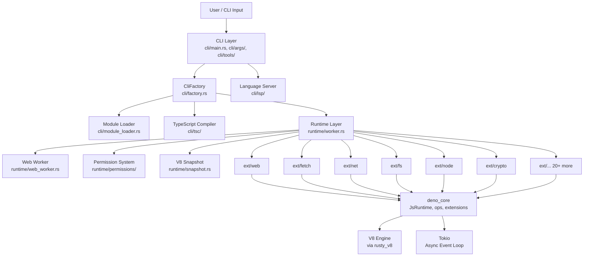
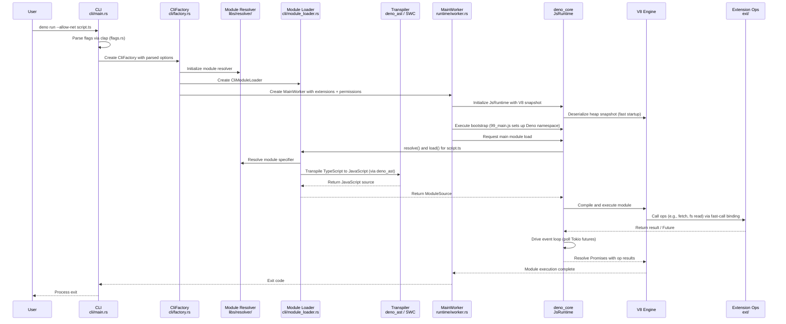
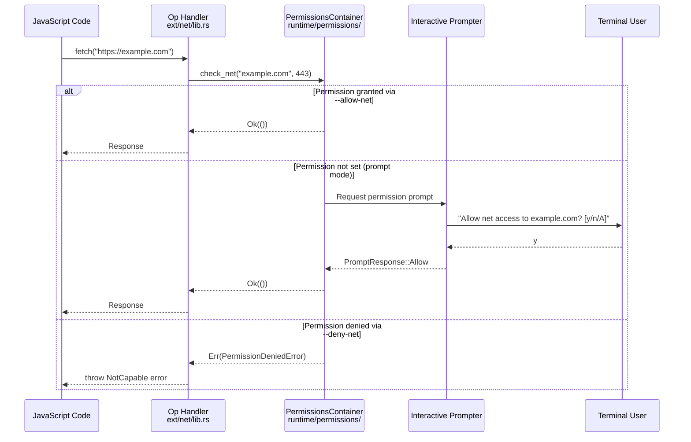
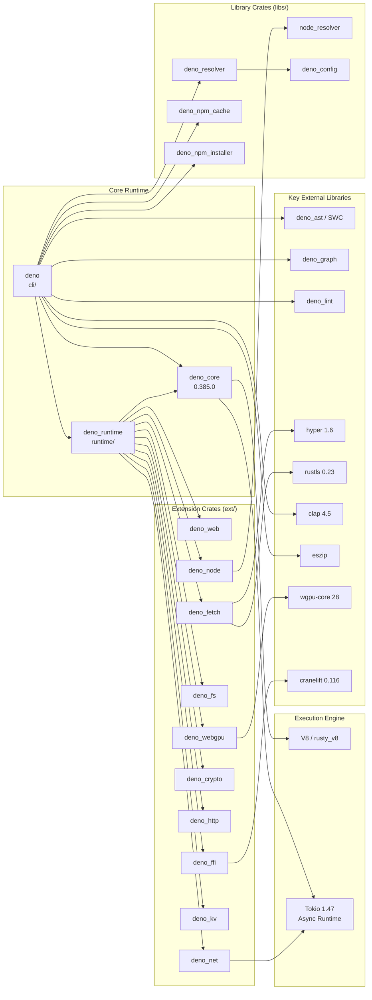

# Deno

> A modern runtime for JavaScript and TypeScript with secure defaults, built on V8, Rust, and Tokio.

| Metadata | |
|---|---|
| Repository | https://github.com/denoland/deno |
| License | MIT License |
| Primary Language | Rust |
| Analyzed Release | `v2.6.8` (2026-02-02) |
| Stars (approx.) | 106,085 |
| Generated by | Claude Opus 4.6 (Anthropic) |
| Generated on | 2026-02-08 |

## Overview

Deno is a secure JavaScript, TypeScript, and WebAssembly runtime that ships as a single executable with built-in tooling including a formatter, linter, test runner, LSP, and package manager. It uses the V8 engine for JavaScript execution, Rust for its core implementation and native bindings, and Tokio as the asynchronous event loop. Deno natively supports TypeScript without requiring a separate compilation step and implements Web Platform APIs wherever possible, making code portable between server and browser environments.

Problems it solves:

- Eliminates the need for separate toolchain components (bundlers, formatters, linters, test runners) by shipping them built-in to the runtime
- Provides security by default through a granular permission system, preventing scripts from accessing the filesystem, network, or environment unless explicitly allowed
- Addresses Node.js legacy design issues by supporting ES modules natively, using URL-based module resolution, and providing first-class TypeScript support without transpilation configuration
- Offers Node.js and npm compatibility, allowing gradual migration of existing Node.js projects

Positioning:

Deno competes primarily with Node.js and Bun as a server-side JavaScript runtime. Compared to Node.js, Deno provides a more secure default posture, built-in TypeScript support, and integrated development tools. Compared to Bun, Deno emphasizes Web Platform API compliance and its security model. Deno distinguishes itself through its Rust-based architecture (versus Node.js's C++ and Bun's Zig), its security-first permission system, and the deno_core crate which enables others to build custom JavaScript runtimes. The project also maintains JSR (JavaScript Registry), a modern package registry that complements Deno's module system.

## Architecture Overview

Deno follows a layered architecture where the CLI layer (`cli/`) handles user interaction and tooling, the runtime layer (`runtime/`) assembles the JavaScript execution environment, and the extension layer (`ext/`) provides native functionality bridged to JavaScript via the ops system. At the foundation sits `deno_core` (an external crate), which wraps V8 through `rusty_v8` bindings and provides the op dispatch mechanism and event loop built on Tokio. The entire system is organized as a Rust workspace with over 40 crate members, enabling modular compilation and reuse.

## Core Components

### CLI Layer (`cli/`)

- Responsibility: Entry point for the `deno` executable, parsing command-line arguments, orchestrating subcommands, and managing the build pipeline from source to execution
- Key files: `cli/main.rs`, `cli/args/flags.rs`, `cli/factory.rs`, `cli/module_loader.rs`
- Design patterns: Factory pattern (CliFactory), Command pattern (subcommand dispatch), Lazy initialization via OnceCell

The CLI layer is the top-level orchestration crate. The `main.rs` file defines all modules and delegates to subcommands. Flag parsing in `cli/args/flags.rs` uses the `clap` crate to define every CLI option, producing a `Flags` struct that drives the rest of the system. The `CliFactory` in `cli/factory.rs` acts as a dependency injection container, lazily constructing components like the file fetcher, module graph, resolver, npm installer, and worker factory. The `module_loader.rs` implements deno_core's `ModuleLoader` trait, handling ES module resolution from local files, remote URLs, and npm packages. The `cli/tools/` directory contains implementations for all built-in tools: `fmt.rs` (formatter using dprint), `cli/tools/lint/` (linter using deno_lint), `cli/tools/test/` (test runner), `cli/tools/compile.rs` (standalone binary compilation via eszip and libsui), `cli/tools/jupyter/` (Jupyter kernel), and more.

### Runtime Layer (`runtime/`)

- Responsibility: Assembling the JavaScript runtime by composing extensions, managing the main worker and web workers, bootstrapping the V8 isolate, and handling the permission system
- Key files: `runtime/worker.rs`, `runtime/web_worker.rs`, `runtime/shared.rs`, `runtime/snapshot.rs`, `runtime/permissions/lib.rs`
- Design patterns: Builder pattern (WorkerOptions), Extension composition, V8 Snapshot pre-initialization

The `MainWorker` struct in `runtime/worker.rs` is the central execution context. It wraps a `deno_core::JsRuntime` (which in turn wraps a V8 Isolate) and adds lifecycle management for events like `load`, `beforeunload`, and `unload`. The `runtime/shared.rs` file uses the `extension!` macro to define the `runtime` extension, which depends on all other extensions and provides the JavaScript files that set up the `Deno` namespace (files like `90_deno_ns.js`, `98_global_scope_window.js`). The `runtime/snapshot.rs` registers all extensions in a specific order to create a V8 heap snapshot at build time, dramatically reducing cold-start time. The `WebWorker` in `runtime/web_worker.rs` provides a similar but sandboxed execution context for spawned workers, communicating with the main worker via message ports. The permission system in `runtime/permissions/lib.rs` implements a fine-grained, capability-based security model with descriptors for read, write, net, env, sys, run, and ffi access, including interactive prompting and audit logging.

### Extension System (`ext/`)

- Responsibility: Providing native platform capabilities to JavaScript through a modular extension architecture, implementing Web Platform APIs and Deno-specific APIs
- Key files: `ext/web/lib.rs`, `ext/fetch/lib.rs`, `ext/fs/lib.rs`, `ext/net/lib.rs`, `ext/node/lib.rs`, `ext/crypto/lib.rs`
- Design patterns: Op system (Rust functions exposed to JS via `#[op2]` macro), Extension macro composition, Trait-based abstraction for platform dependencies

Each subdirectory under `ext/` is an independent Rust crate that registers one or more "ops" (operations) callable from JavaScript. There are 28 extension crates covering: web fundamentals (`ext/web` for timers, encoding, events; `ext/webidl` for WebIDL bindings; `ext/url` for URL parsing), networking (`ext/fetch` for Fetch API, `ext/net` for TCP/UDP/Unix sockets, `ext/tls` for TLS, `ext/websocket`, `ext/http` for HTTP server), filesystem (`ext/fs`), cryptography (`ext/crypto` for Web Crypto API), FFI (`ext/ffi` using cranelift for JIT compilation of foreign function calls), Node.js compatibility (`ext/node` with `ops/` and `polyfills/` subdirectories implementing Node built-in modules), GPU (`ext/webgpu` wrapping wgpu), KV store (`ext/kv`), cron scheduling (`ext/cron`), and telemetry (`ext/telemetry` with OpenTelemetry integration). Each extension can include both Rust ops and JavaScript/TypeScript glue code.

### deno_core (External Crate)

- Responsibility: Providing the foundational JavaScript runtime infrastructure including the V8 binding layer, op dispatch system, module loading interface, event loop integration, and resource management
- Key files: External crate at version 0.385.0 (published on crates.io)
- Design patterns: Op dispatch via `#[op2]` proc macro, Resource table (GC-integrated via cppgc), Promise-to-Future mapping, Extension registration macro

`deno_core` is the foundational crate that makes Deno possible and is also usable independently to build custom JavaScript runtimes. It provides `JsRuntime`, which encapsulates a V8 Isolate and an event loop. The "ops" system is the critical bridge between JavaScript and Rust: Rust functions annotated with `#[op2]` are compiled into highly optimized V8 fast-call bindings. When JavaScript calls an op, deno_core efficiently marshals arguments across the JS/Rust boundary. Asynchronous ops return Rust Futures that are mapped onto JavaScript Promises, with Tokio driving the event loop. The `Extension` type and `extension!` macro allow grouping ops, JavaScript source files, and initialization logic into composable units. The resource table manages objects like file handles and sockets that are shared between JS and Rust, now leveraging V8's cppgc (Oilpan) garbage collector for automatic lifetime management.

### TypeScript Integration (`cli/tsc/`)

- Responsibility: Type checking TypeScript source code, providing type information to the LSP, and interfacing with the TypeScript compiler
- Key files: `cli/tsc/mod.rs`, `cli/tsc/99_main_compiler.js`, `cli/tsc/97_ts_host.js`, `cli/tsc/go.rs`, `cli/type_checker.rs`
- Design patterns: Embedded compiler running inside a dedicated V8 isolate, Host API bridge between Rust and the TypeScript compiler

Deno embeds the TypeScript compiler (`tsc`) itself, running it inside a separate V8 isolate. The `97_ts_host.js` file implements the TypeScript compiler host interface, providing file reading and module resolution to the TS compiler through ops that call back into Rust. The `99_main_compiler.js` file is the entry point that drives type checking. The `cli/tsc/go.rs` and `cli/tsc/go/` directory contain logic for a newer Go-based TypeScript type checker integration (`deno_typescript_go_client_rust`), showing the project's investment in faster type checking. For execution (as opposed to type checking), TypeScript is transpiled to JavaScript using `deno_ast` (based on SWC) without running the full `tsc`, providing much faster startup.

## Data Flow

### Module Execution (deno run script.ts)

### Permission Check Flow

## Key Design Decisions

### 1. Security by Default via Granular Permissions

- Choice: All access to system resources (filesystem, network, environment variables, subprocess execution, FFI) is denied by default and must be explicitly granted via CLI flags like `--allow-read`, `--allow-net`, or `--allow-env`
- Rationale: Node.js grants full system access to any script, creating a large attack surface. Deno's model ensures that running untrusted code (e.g., from a URL) cannot exfiltrate data or modify the system without explicit consent. The permission system supports wildcards, path scoping, and interactive prompting for a flexible developer experience.
- Trade-offs: Adds friction for developers who must remember to pass permission flags. Scripts require more verbose invocation commands. Some Node.js packages assume full access and may not work without granting broad permissions.

### 2. V8 Heap Snapshots for Fast Startup

- Choice: Pre-serialize the initialized V8 heap (including all extension JavaScript code and the Deno namespace setup) into a binary snapshot at build time (`runtime/snapshot.rs`), then deserialize it at startup instead of re-executing initialization code
- Rationale: Deno registers 30+ extensions with substantial JavaScript bootstrapping code. Without snapshots, every `deno run` invocation would need to parse and execute thousands of lines of JavaScript before running user code. Snapshots reduce cold-start time from hundreds of milliseconds to single-digit milliseconds.
- Trade-offs: Increases binary size significantly (the snapshot is embedded in the executable). Snapshot creation requires careful ordering of extensions. Development iteration on runtime JavaScript requires rebuilding the snapshot (mitigated by the `hmr` feature flag that disables snapshots).

### 3. Rust + V8 with the Ops Bridge Architecture

- Choice: Implement the runtime core in Rust, use V8 for JavaScript execution via `rusty_v8` bindings, and bridge them through the `#[op2]` macro system that generates optimized V8 fast-call bindings
- Rationale: Rust provides memory safety without garbage collection overhead, zero-cost abstractions, and excellent concurrency via Tokio. V8 provides best-in-class JavaScript performance. The ops system minimizes the overhead of crossing the JS/Rust boundary by leveraging V8's fast API calls, which can call into Rust without going through the generic slow-path.
- Trade-offs: Requires developers to understand both Rust and JavaScript. V8 is a large C++ dependency that increases compile times substantially. The ops bridge adds a layer of complexity for contributors who need to understand the marshaling semantics.

### 4. Monolithic Single-Binary with Built-in Toolchain

- Choice: Ship a single `deno` executable containing a formatter (dprint-based), linter (deno_lint), test runner, bundler, LSP server, Jupyter kernel, package manager, and compiler (`deno compile` via eszip + libsui)
- Rationale: Eliminates the "JavaScript tooling fatigue" problem where Node.js projects require configuring and maintaining numerous separate tools (prettier, eslint, jest, webpack, etc.). A unified tool ensures consistent behavior and reduces project setup overhead.
- Trade-offs: Larger binary size (~100MB+). All tools must be maintained within the project or its ecosystem. Formatting and linting choices are opinionated. Users cannot independently upgrade individual tools.

### 5. Node.js and npm Compatibility Layer

- Choice: Implement a comprehensive Node.js compatibility layer (`ext/node/`) that polyfills Node built-in modules (fs, path, crypto, http, etc.) and supports loading npm packages via `npm:` specifiers and a built-in npm installer
- Rationale: The JavaScript ecosystem's massive investment in npm packages would be wasted if Deno could not interoperate. Node compatibility dramatically lowers the barrier to Deno adoption and allows incremental migration of existing projects.
- Trade-offs: Maintaining compatibility with Node.js's extensive and sometimes quirky API surface is an enormous ongoing effort (the `ext/node/` crate is by far the largest extension). Performance may differ from native Node.js for some polyfilled APIs. N-API (`ext/napi/`) support is needed for native addons, adding further complexity.

## Dependencies

## Testing Strategy

Deno employs a multi-layered testing approach covering unit tests, spec-based integration tests, and Web Platform Tests (WPT) for standards compliance. The total test suite is extensive and is run via `cargo test`.

Unit tests: Rust unit tests are co-located with source code in each module using standard `#[cfg(test)]` blocks. These test individual functions and components in isolation, particularly in the extension crates and library crates.

Integration tests: The primary integration test mechanism is "spec tests" located in `tests/specs/`. Each test consists of a `__test__.jsonc` file that declares CLI commands to execute and expected output patterns. The output matching supports wildcards (`[WILDCARD]`, `[WILDLINE]`), unordered matching (`[UNORDERED_START]`/`[UNORDERED_END]`), and line comments. Additional integration tests exist in `cli/tests/` and test the CLI binary end-to-end. Web Platform Tests (`tests/wpt/`) verify compliance with web standards for APIs like Fetch, URL, Streams, Crypto, and WebSocket.

CI/CD: GitHub Actions runs the CI pipeline (defined in `.github/workflows/`). The pipeline includes building on multiple platforms (Linux, macOS, Windows), running the full test suite, linting with `./tools/lint.js`, formatting checks with `./tools/format.js`, and release automation. Release builds use LTO (Link-Time Optimization) with `opt-level = 'z'` for size optimization, and critical crates like `v8`, `tokio`, and `hyper` are compiled with `opt-level = 3` even in release builds.

## Key Takeaways

1. Extension-based modular architecture enables ecosystem reuse: By decomposing native functionality into independent extension crates (28 in `ext/`), Deno allows each piece to be developed, tested, and versioned independently. The `deno_core` crate and extension system are designed to be reusable outside of Deno itself -- anyone can build a custom JavaScript runtime by composing selected extensions. This modular approach keeps the codebase maintainable despite its enormous scope.

2. V8 snapshots are a powerful technique for amortizing initialization cost: Deno's approach of serializing the fully-initialized V8 heap at build time and deserializing at runtime is a general technique applicable to any V8-embedding project. The snapshot includes all parsed and compiled JavaScript bootstrap code, global object setup, and extension initialization. This design insight shows that expensive one-time setup can be shifted to build time in any system that supports serialization of its initialized state.

3. The ops bridge pattern demonstrates how to build high-performance polyglot systems: The `#[op2]` macro system automatically generates V8 fast-call bindings, argument marshaling, error conversion, and async-to-promise mapping from a single Rust function signature. This pattern of using proc macros to generate FFI glue between a high-level language runtime and a systems language is broadly applicable. It minimizes both runtime overhead and developer boilerplate when building systems that span language boundaries.

4. Security-by-default is achievable without sacrificing developer experience: Deno proves that a strict capability-based permission model can coexist with good ergonomics through features like interactive prompting, granular scoping (e.g., `--allow-read=/tmp`), and clear error messages that tell users exactly which permission to grant. This challenges the common assumption that security restrictions inevitably degrade usability.

5. Monorepo workspace structure scales for large Rust projects: With 40+ crate members in a single Cargo workspace, Deno demonstrates that Rust's workspace feature combined with careful dependency management (workspace-level dependency declarations, per-crate opt-level overrides) can manage a project of significant complexity while maintaining reasonable compile times through incremental compilation and selective optimization.

## References

- [Deno Official Documentation](https://docs.deno.com)
- [Deno GitHub Repository](https://github.com/denoland/deno)
- [deno_core Crate Documentation](https://docs.rs/deno_core/latest/deno_core/)
- [The Internals of Deno - Overall Architecture](https://choubey.gitbook.io/internals-of-deno/architecture/overall-architecture)
- [The Internals of Deno - Ops](https://choubey.gitbook.io/internals-of-deno/architecture/ops)
- [Deno 2 Internals by Divy Srivastava](https://littledivy.com/deno-2.html)
- [Roll Your Own JavaScript Runtime (Deno Blog)](https://deno.com/blog/roll-your-own-javascript-runtime)
- [DeepWiki - denoland/deno](https://deepwiki.com/denoland/deno)
