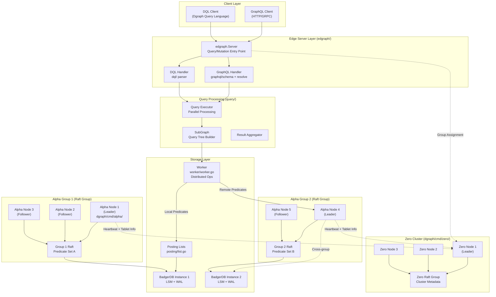
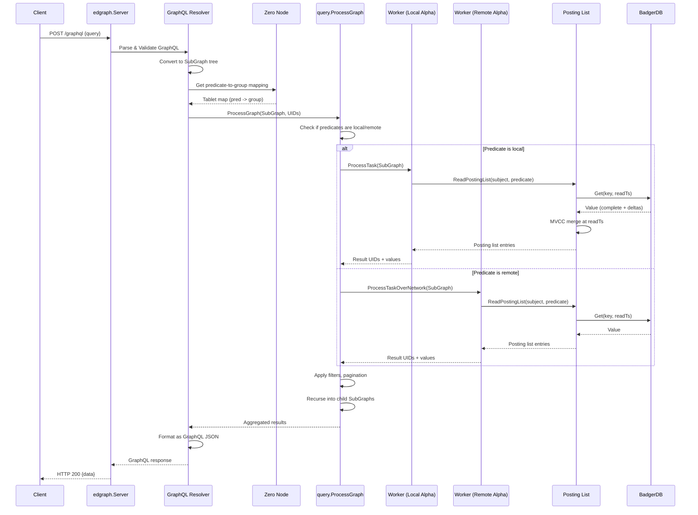
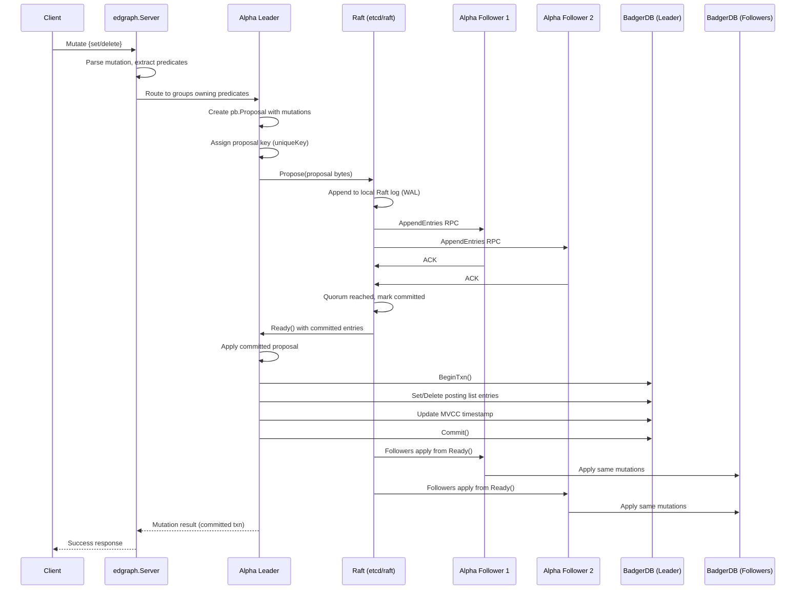
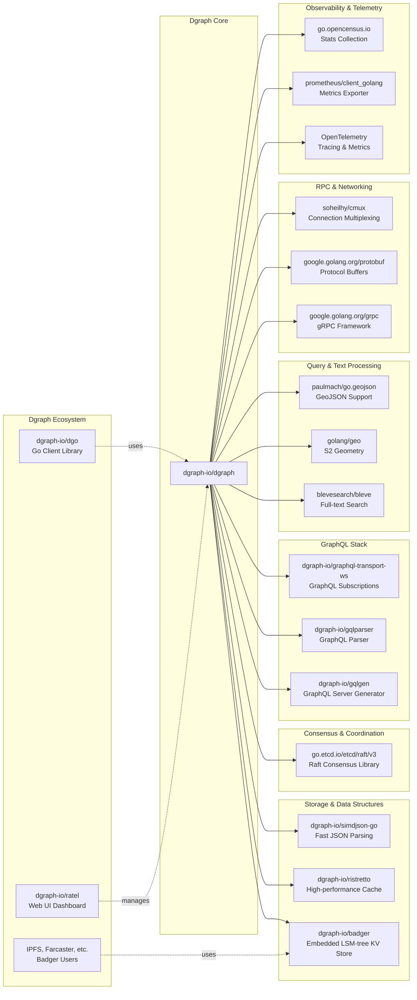

# Dgraph

> A horizontally scalable and distributed GraphQL database with a graph backend

| Metadata | |
|---|---|
| Repository | https://github.com/dgraph-io/dgraph |
| License | Apache-2.0 |
| Primary Language | Go |
| Category | Database |
| Analyzed Release | `v25.2.0` (2026-01-29) |
| Stars (approx.) | 21,500+ |
| Generated by | Claude Sonnet 4.5 (Anthropic) |
| Generated on | 2026-02-08 |

## Overview

Dgraph is a horizontally scalable and distributed GraphQL database built from the ground up with a native graph backend. It provides ACID transactions, consistent replication via Raft consensus, and linearizable reads, designed to deliver Google production-level scale and throughput with low latency for real-time queries over terabytes of structured data.

Problems it solves:

- Complex relational queries spanning 10+ SQL tables with foreign keys become simple graph traversals with native GraphQL support
- Horizontal scalability challenges in traditional graph databases through predicate-based sharding and distributed query execution
- Consistency and replication in distributed environments using Raft consensus protocol across data groups
- Real-time query performance by tightly controlling data layout on disk to minimize network calls and disk seeks

Positioning:

Dgraph is production-ready and used by multiple Fortune 500 companies, as well as open-source projects like Intuit Katlas (Kubernetes asset discovery) and VMware Purser (cost visibility). Unlike Neo4j which is primarily a Cypher-based graph database or ArangoDB which is multi-model, Dgraph is built as a native GraphQL database with distributed architecture from the start, making it uniquely positioned for cloud-native graph workloads.

## Architecture Overview

Dgraph employs a distributed architecture with two core node types: Zero nodes for cluster orchestration and Alpha nodes for data storage and query processing. Data is sharded by predicates (not vertices) across Alpha groups, with each group using Raft consensus for replication. The storage layer uses BadgerDB, a custom LSM-tree based key-value store optimized for graph workloads.

## Core Components

### Zero Server (`dgraph/cmd/zero/`)

- Responsibility: Cluster orchestration, group membership, and predicate-to-group assignment
- Key files: `dgraph/cmd/zero/run.go`, `dgraph/cmd/zero/raft.go`, `dgraph/cmd/zero/assign.go`
- Design patterns: Raft consensus, Cluster coordinator pattern

Zero nodes form a separate Raft group managing cluster-wide metadata. They handle UID assignment, timestamp generation (for MVCC), group rebalancing, and tablet (predicate shard) movement. Zero maintains the authoritative mapping of which Alpha group serves which predicates. During cluster startup, Alphas register with Zero and receive their group ID. Zero monitors Alpha heartbeats and triggers predicate redistribution when nodes join or leave.

The Zero Raft implementation in `dgraph/cmd/zero/raft.go` uses `proposeAndWait()` for linearizable metadata updates. Proposals include `pb.ZeroProposal` messages for operations like `MoveTablet`, `AssignIds`, and `Snapshot`. The uniqueKey mechanism using `atomic.AddUint64` ensures each proposal has a unique identifier for tracking.

### Alpha Server (`dgraph/cmd/alpha/`)

- Responsibility: Data storage, query execution, and mutation processing
- Key files: `dgraph/cmd/alpha/run.go`, `edgraph/server.go`, `worker/worker.go`
- Design patterns: CQRS (Command Query Responsibility Segregation), Actor model for workers

Alpha nodes are the workhorses storing actual graph data as posting lists in BadgerDB. Each Alpha belongs to exactly one group, and each group replicates data via Raft. The `edgraph.Server` implements the gRPC interface for clients, handling both GraphQL and DQL (Dgraph Query Language) queries. Mutations are proposed through Raft, ensuring all replicas in a group stay consistent.

The startup sequence in `dgraph/cmd/alpha/run.go` initializes: BadgerDB for storage, posting list cache, schema manager, worker pool for distributed operations, and the Raft server. The server registers gRPC services including `api.Dgraph` for queries/mutations and `pb.Worker` for inter-Alpha communication.

### Posting List Layer (`posting/`)

- Responsibility: In-memory and on-disk representation of graph edges and values
- Key files: `posting/list.go`, `posting/index.go`, `posting/mvcc.go`
- Design patterns: MVCC (Multi-Version Concurrency Control), Copy-on-Write, Delta encoding

A posting list is Dgraph's fundamental data structure, representing all edges for a subject-predicate pair. For example, for subject `0x123` and predicate `friend`, the posting list contains all UIDs this subject is friends with. Lists support two layers: an immutable base (complete posting list) and a mutable delta layer (recent mutations).

The `List` struct in `posting/list.go` maintains a `pb.PostingList` protobuf and a `mutationMap` for uncommitted changes. Reads at a specific timestamp merge the immutable layer with relevant deltas using MVCC. The `BitCompletePosting` and `BitDeltaPosting` flags in the value indicate whether BadgerDB stores a full list or just deltas. Rollup operations periodically merge deltas into a new complete list to prevent unbounded delta growth.

### Query Engine (`query/`)

- Responsibility: Parsing, planning, and executing graph queries with distributed coordination
- Key files: `query/query.go`, `query/executor.go`, `dql/parser.y`
- Design patterns: Tree traversal, Visitor pattern, Pipeline parallelism

Queries are represented as a `SubGraph` tree structure, where each node corresponds to a GraphQL/DQL field or filter. The algorithm processes SubGraphs recursively: for each SubGraph, retrieve posting lists for matching UIDs, apply filters, then recursively process child SubGraphs with the resulting UID set.

The `query.go` file shows the algorithm: starting from a root UID set, the executor calls `ProcessGraph()` which fans out to workers (potentially on different Alphas if predicates are remote), collects results, applies filters and pagination, then recurses into children. The `algo` package provides optimized set operations (intersection, union) on UID lists encoded as sorted arrays or bitmaps.

Worker communication uses gRPC with `pb.Worker` service. When a query needs a predicate not served by the local Alpha, it calls `worker.ProcessTaskOverNetwork()` which routes the request to the appropriate Alpha group. Results are streamed back and aggregated locally.

### GraphQL Layer (`graphql/`)

- Responsibility: GraphQL schema management, query resolution, and mutation translation to DQL
- Key files: `graphql/schema/schema.go`, `graphql/resolve/resolver.go`, `graphql/admin/admin.go`
- Design patterns: Schema-first design, Resolver pattern, Adapter pattern

Dgraph provides native GraphQL support by transpiling GraphQL queries/mutations into DQL. The `graphql/schema` package parses GraphQL schemas and generates corresponding Dgraph predicates with type information. The `graphql/resolve` package implements resolvers that convert GraphQL AST into DQL `SubGraph` structures.

The `ResolverFactory` pattern allows custom resolvers while providing convention-based defaults. For each GraphQL type, resolvers generate CRUD operations: get, query (with filters), add, update, delete. The `graphql/admin` package provides schema introspection and administrative mutations for updating the GraphQL schema at runtime.

Subscriptions are supported via WebSocket connections, with the `graphql/subscription` package managing live query updates when underlying data changes. This uses Badger's subscription mechanism to detect relevant mutations.

### Worker Communication (`worker/`)

- Responsibility: Inter-Alpha RPC for distributed query and mutation operations
- Key files: `worker/worker.go`, `worker/draft.go`, `worker/predicate_move.go`
- Design patterns: RPC service, Streaming RPC, Work stealing

The `worker` package implements the `pb.Worker` gRPC service for Alpha-to-Alpha communication. Key RPCs include:

- `ProcessTaskOverNetwork`: Execute a query SubGraph on remote predicates
- `Mutate`: Apply mutations to predicates owned by this group
- `Subscribe`: Stream updates for specific predicates (for live queries)
- `StreamSnapshot`: Transfer predicate snapshots during tablet movement

The `grpcWorker` struct in `worker/worker.go` handles incoming RPCs. For `Subscribe`, it leverages BadgerDB's built-in subscription on key prefixes. The `draft.go` file implements a draft proposal mechanism for Raft, allowing the leader to propose mutations efficiently.

### Storage Layer (BadgerDB integration)

- Responsibility: Persistent key-value storage with MVCC, transactions, and WAL
- Key files: `worker/worker.go` (DB initialization), `posting/list.go` (read/write), `raftwal/` (Raft WAL)
- Design patterns: LSM-tree, Write-Ahead Log, MVCC

Dgraph uses BadgerDB (dgraph-io/badger), a pure Go embedded database designed for graph workloads. BadgerDB provides MVCC allowing concurrent reads without blocking writes. Each posting list is stored with a key format: `{predicate}{subject UID}`. Schema and type information use special keys with `BitSchemaPosting` flag.

Raft log entries are stored in a separate BadgerDB instance managed by `raftwal/` package. The `raftwal.Wal` structure provides Raft's required `Storage` interface: `Entries()`, `Term()`, `FirstIndex()`, `LastIndex()`, and `Snapshot()`. This separates Raft metadata from user data, preventing Raft log growth from affecting query performance.

BadgerDB's value log design separates large values from the LSM tree, reducing write amplification. The LSM tree stores only keys and value pointers, with actual values in an append-only log. Dgraph leverages this for large posting lists and text blobs.

### Raft Consensus (`conn/raft_server.go`, etcd/raft)

- Responsibility: Distributed consensus for data replication across Alpha groups
- Key files: `conn/raft_server.go`, `conn/node.go`, `dgraph/cmd/alpha/run.go` (Raft setup)
- Design patterns: Consensus protocol, State machine replication

Dgraph uses etcd's Raft library (`go.etcd.io/etcd/raft/v3`) for consensus. Each Alpha group forms an independent Raft cluster. The `conn.Node` abstraction wraps `raft.Node` and manages proposal tracking via the `proposals` map. When a mutation occurs, the leader calls `Node.Propose()` with a serialized `pb.Proposal`, which is replicated to followers.

The Raft state machine apply loop in `conn/node.go` processes committed entries. Mutations are applied to BadgerDB within a transaction, and the commit timestamp is updated. Snapshot transfers use `worker.StreamSnapshot` RPC to send predicate data between Alphas, enabling new nodes to catch up without replaying full Raft logs.

## Data Flow

### GraphQL Query Execution

### Mutation with Raft Consensus

## Key Design Decisions

### 1. Predicate-Based Sharding (not Vertex Sharding)

- Choice: Shard data by predicates (properties/edges) rather than by vertices (subjects)
- Rationale: Graph queries typically filter on specific edge types (e.g., "all friends of X"). Predicate sharding keeps all instances of a relationship type on the same group, enabling local index scans without cross-group coordination. This contrasts with vertex sharding where each query might need to contact all shards
- Trade-offs: Hot predicates can create load imbalance if one predicate is queried far more than others. Dgraph addresses this via automatic predicate rebalancing across groups. Also, multi-predicate queries may require more inter-group communication than vertex-sharded systems

### 2. BadgerDB as Custom Storage Engine

- Choice: Build and use BadgerDB, a Go-native LSM-tree database, instead of RocksDB or other existing engines
- Rationale: RocksDB is C++ requiring CGO, which complicates cross-compilation and introduces GC pauses. BadgerDB's pure Go implementation enables seamless integration, better profiling, and value log separation that reduces write amplification for graph workloads with large posting lists. The MVCC design aligns perfectly with Dgraph's transaction model
- Trade-offs: Building a custom database is high effort and carries maturity risks. However, BadgerDB has evolved into a standalone project used by many others (IPFS, Farcaster, etc.), validating the investment. Performance is competitive with RocksDB for Dgraph's access patterns

### 3. Native GraphQL with Schema-First Approach

- Choice: Make GraphQL a first-class query language with automatic CRUD generation from schemas, rather than just supporting it via a translation layer
- Rationale: GraphQL's schema-first design maps naturally to graphs and provides type safety. By generating DQL from GraphQL schemas, Dgraph can optimize query execution based on declared types and relationships. This also reduces boilerplate - users define schemas and get mutations, subscriptions, and filtering for free
- Trade-offs: Requires maintaining both GraphQL and DQL (Dgraph's native query language) code paths. Some advanced graph queries may be easier to express in DQL than GraphQL. However, the generated DQL can be inspected and optimized, providing an escape hatch

### 4. Separate Zero and Alpha Node Types

- Choice: Split cluster management (Zero) from data serving (Alpha) into distinct node types
- Rationale: Separates concerns and allows independent scaling. Zero handles infrequent metadata operations (tablet assignment, UID generation, timestamp oracle) while Alphas handle high-throughput queries. Zero's Raft group can be small (3 nodes) for quorum, while Alpha groups scale to workload needs. This also enables Zero to make global decisions with a consistent view of cluster state
- Trade-offs: Additional operational complexity managing two node types. Zero becomes a critical dependency - if all Zero nodes fail, the cluster cannot accept new tablets or generate UIDs (though queries still work). Dgraph recommends running 3 or 5 Zero nodes for high availability

### 5. MVCC with Delta Encoding for Posting Lists

- Choice: Store posting lists as immutable base + mutable deltas, with periodic rollup
- Rationale: Graph workloads have read-heavy patterns with occasional writes. Appending deltas avoids rewriting entire posting lists on each mutation. MVCC provides snapshot isolation for transactions without read locks. Rollup prevents unbounded delta growth and improves read performance by collapsing deltas into a new base
- Trade-offs: Reads must merge base + deltas, adding latency if delta chains grow long. The rollup process consumes CPU and I/O. Dgraph tunes rollup frequency based on delta count and posting list size to balance these factors

### 6. Distributed Query Execution via SubGraph Fanout

- Choice: Recursively decompose queries into SubGraphs that execute on owning Alpha groups, then aggregate results
- Rationale: Enables parallelism and keeps predicate data co-located. Each SubGraph processes its predicates locally, streaming results to the parent. Filters and pagination happen at each level, reducing data transfer. This push-down approach minimizes network overhead compared to pulling all data to a coordinator
- Trade-offs: Complex query plans can create deep fanout with many RPC hops. Coordination overhead increases with query depth. Dgraph mitigates this via query normalization, caching, and parallel SubGraph execution where possible

## Dependencies

## Testing Strategy

Dgraph employs a comprehensive multi-level testing strategy combining unit tests, integration tests, end-to-end tests, and custom testing tools.

Unit tests: Each package includes `_test.go` files with focused tests for individual functions and components. Critical packages like `posting`, `query`, and `worker` have extensive test coverage. The `testutil` package provides helpers for setting up test databases and mock Raft clusters. Tests use table-driven patterns for parameterization.

Integration tests: The `dgraphtest` package provides a test framework for spinning up multi-node Dgraph clusters programmatically. This enables testing distributed scenarios like predicate movement, failover, and multi-group queries. Tests verify Raft log consistency, snapshot transfers, and transaction isolation across groups.

End-to-end tests: The `graphql/e2e` directory contains GraphQL API tests that exercise the full stack from schema creation through complex queries and mutations. These tests validate schema introspection, authorization rules, subscriptions, and error handling using actual HTTP/gRPC clients.

System tests: The `contrib/jepsen` directory contains Jepsen tests for distributed consistency verification. Jepsen induces network partitions, process crashes, and clock skew to validate Dgraph's safety properties under adverse conditions.

Benchmarks: The `query/benchmark` and `codec/benchmark` directories include Go benchmarks for performance-critical code paths. Posting list encoding/decoding, UID list operations, and query execution are regularly benchmarked to prevent regressions.

CI/CD: GitHub Actions workflows in `.github/workflows/` run tests on every PR. The pipeline includes: unit tests, integration tests, linting with trunk, race detection builds, and cross-compilation verification for Linux amd64/arm64. Docker images are built and tested in CI before release.

## Key Takeaways

1. Predicate sharding strategy: Sharding by edge types rather than vertices optimizes for graph traversal patterns. This design is applicable to any system where queries filter on specific relationship types. The tradeoff requires load balancing mechanisms for hot predicates

2. Separation of metadata and data planes: Zero nodes handling cluster metadata separately from Alpha data nodes enables independent scaling and simplifies global decision-making. This pattern is valuable for distributed databases where coordination needs differ from data serving needs

3. MVCC with delta encoding: Combining multi-version concurrency control with delta encoding provides snapshot isolation while optimizing write amplification. The periodic rollup mechanism balances read performance and storage efficiency - a pattern applicable to update-heavy workloads with read-optimized requirements

4. Schema-first GraphQL transpilation: Automatically generating CRUD operations from GraphQL schemas reduces boilerplate while enabling query optimization based on declared types. This approach demonstrates how schema information can drive both API generation and query planning

5. Hierarchical query decomposition: Representing queries as trees (SubGraphs) that recursively execute and aggregate enables distributed query processing with filter/pagination push-down. This pattern minimizes data transfer by processing filters close to data sources

6. Custom storage engine alignment: Building BadgerDB specifically for Dgraph's access patterns (large posting lists, MVCC, Go-native) shows the value of vertically integrating storage when generic solutions don't fit. The value log separation and pure Go implementation were key differentiators

7. Raft group per data shard: Using independent Raft groups for each Alpha group provides fault tolerance without global coordination overhead. Proposals only require quorum within a group, enabling horizontal scalability of consensus

## References

- [Dgraph Official Documentation](https://dgraph.io/docs/)
- [GitHub - dgraph-io/badger](https://github.com/dgraph-io/badger)
- [Database of Databases - DGraph](https://dbdb.io/db/dgraph)
- [Why we choose Badger over RocksDB in Dgraph](https://discuss.dgraph.io/t/why-we-choose-badger-over-rocksdb-in-dgraph-dgraph-blog/3928)
- [Dgraph vs ArangoDB: Architecture and Consistency](https://www.puppygraph.com/blog/arangodb-vs-dgraph)
- [Dgraph GitHub Repository](https://github.com/dgraph-io/dgraph)
- [etcd Raft Library](https://github.com/etcd-io/etcd/tree/main/raft)
