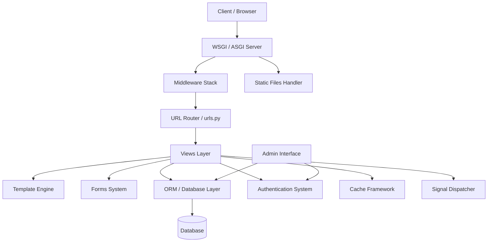
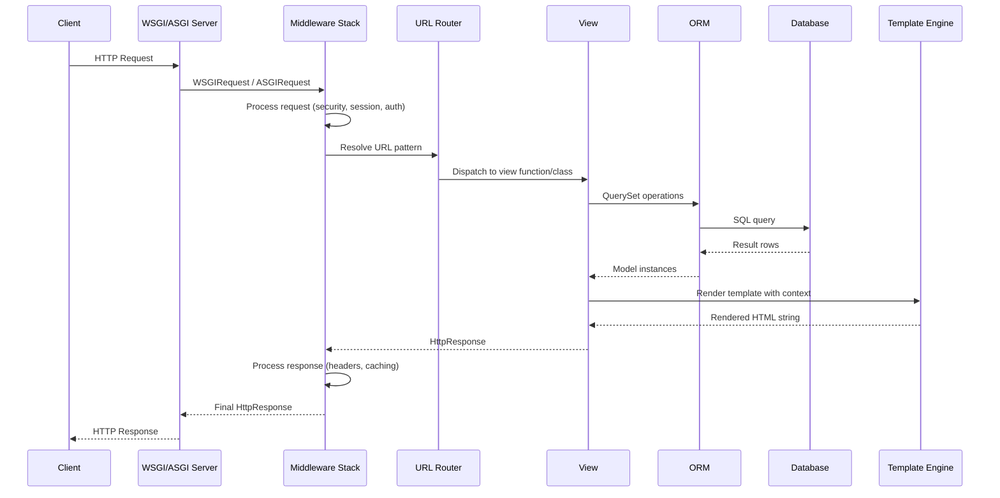
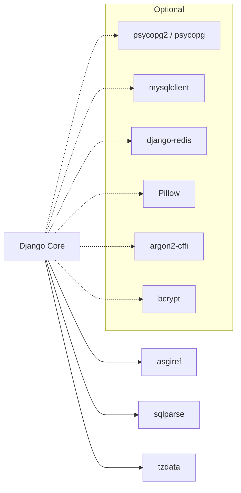

# Django

> The Web framework for perfectionists with deadlines, providing a high-level Python framework that encourages rapid development and clean, pragmatic design.

| Metadata | |
|---|---|
| Repository | https://github.com/django/django |
| License | BSD 3-Clause "New" or "Revised" License |
| Primary Language | Python |
| Category | Web Framework |
| Analyzed Release | `6.0.2` (2026-02-03) |
| Stars (approx.) | 86,000+ |
| Generated by | Claude Opus 4.6 (Anthropic) |
| Generated on | 2026-02-09 |

---

## Overview

### Problem Domain

Building web applications from scratch involves solving many repetitive problems: URL routing, database access, form handling, authentication, security protections, template rendering, and administrative interfaces. Developers need a framework that handles these cross-cutting concerns while remaining flexible enough for diverse use cases.

### Project Positioning

Django is a batteries-included Python web framework that follows the Model-View-Template (MVT) architectural pattern. It provides an integrated set of components -- ORM, template engine, URL router, form system, authentication framework, and admin interface -- that work together seamlessly. Django emphasizes convention over configuration, DRY (Don't Repeat Yourself) principles, and explicit-is-better-than-implicit philosophy inherited from Python itself.

Since its initial release in 2005, Django has become one of the most widely adopted web frameworks, powering sites like Instagram, Disqus, Mozilla, and Pinterest. The framework has evolved to support async views, ASGI deployment, and modern web development patterns while maintaining backward compatibility.

---

## Architecture Overview

---

## Core Components

### 1. ORM and Database Layer

Responsibility: Provides an abstraction layer for database access, mapping Python classes to database tables and Python expressions to SQL queries.

Key Files:
- `django/db/models/base.py` -- Model metaclass and base Model class
- `django/db/models/query.py` -- QuerySet implementation with lazy evaluation
- `django/db/models/fields/` -- Field type definitions (CharField, IntegerField, ForeignKey, etc.)
- `django/db/models/sql/compiler.py` -- SQL compilation from QuerySet expressions
- `django/db/backends/` -- Database-specific backend adapters (PostgreSQL, MySQL, SQLite, Oracle)
- `django/db/migrations/` -- Schema migration framework

Design Patterns:
- Active Record: Model instances map directly to database rows
- Unit of Work: Transaction management via `django.db.transaction`
- Repository: Manager and QuerySet classes provide collection-oriented access
- Identity Map: Model instances cached per-query within a QuerySet
- Lazy Loading: QuerySets defer database evaluation until iteration

### 2. URL Router and Views

Responsibility: Maps incoming HTTP requests to Python view functions or classes, handling URL pattern matching, parameter extraction, and response generation.

Key Files:
- `django/urls/resolvers.py` -- URLResolver and URLPattern classes
- `django/urls/conf.py` -- `path()` and `include()` functions for URL configuration
- `django/views/generic/` -- Class-based views (ListView, DetailView, CreateView, etc.)
- `django/views/decorators/` -- View decorators (csrf_exempt, login_required, cache_page)
- `django/core/handlers/base.py` -- BaseHandler that orchestrates request/response cycle
- `django/core/handlers/wsgi.py` -- WSGI handler implementation
- `django/core/handlers/asgi.py` -- ASGI handler for async support

Design Patterns:
- Front Controller: Single entry point through WSGI/ASGI handler
- Chain of Responsibility: URL resolvers try patterns in sequence
- Strategy: Class-based views allow method-level customization
- Template Method: Generic views define skeleton with overridable hooks

### 3. Middleware Stack

Responsibility: Processes requests and responses globally before they reach views and after views return, handling cross-cutting concerns like security, session management, and content processing.

Key Files:
- `django/middleware/security.py` -- SecurityMiddleware (HSTS, SSL redirect, content type sniffing)
- `django/middleware/csrf.py` -- CSRF protection middleware
- `django/middleware/common.py` -- CommonMiddleware (URL normalization, content-length)
- `django/middleware/cache.py` -- Cache middleware for full-page caching
- `django/middleware/clickjacking.py` -- X-Frame-Options header middleware
- `django/middleware/csp.py` -- Content Security Policy middleware

Design Patterns:
- Decorator / Chain of Responsibility: Each middleware wraps the next
- Onion Architecture: Request goes in through layers, response comes back through same layers in reverse

### 4. Template Engine

Responsibility: Renders dynamic HTML by combining templates with context data, supporting template inheritance, filters, tags, and auto-escaping for security.

Key Files:
- `django/template/engine.py` -- Template engine configuration and lookup
- `django/template/base.py` -- Template parsing and compilation (Lexer, Parser, NodeList)
- `django/template/loader.py` -- Template loading from configured directories
- `django/template/defaulttags.py` -- Built-in template tags (for, if, block, extends)
- `django/template/defaultfilters.py` -- Built-in filters (date, truncate, escape)
- `django/template/context.py` -- Context and RequestContext classes

Design Patterns:
- Interpreter: Template tags and filters form a domain-specific language
- Composite: NodeList contains nested template nodes
- Template Method: Block tags allow child templates to override parent content

### 5. Admin Interface and Authentication

Responsibility: Provides a production-ready automatic admin interface for CRUD operations and a pluggable authentication system with user models, permissions, and session management.

Key Files:
- `django/contrib/admin/sites.py` -- AdminSite class managing admin URL routing
- `django/contrib/admin/options.py` -- ModelAdmin configuration classes
- `django/contrib/auth/models.py` -- User model, Group, Permission
- `django/contrib/auth/backends.py` -- Authentication backends
- `django/contrib/auth/hashers.py` -- Password hashing (PBKDF2, Argon2, bcrypt)
- `django/contrib/sessions/` -- Session management backends

Design Patterns:
- Introspection / Metaclass: Admin auto-generates UI from model definitions
- Strategy: Pluggable authentication backends
- Decorator: Permission checks via decorators and mixins

---

## Data Flow

---

## Key Design Decisions

### 1. Batteries-Included Philosophy

Choice: Bundle ORM, template engine, admin, auth, forms, and dozens of utilities in a single framework.

Rationale: Reduces the need to evaluate, integrate, and maintain third-party packages for common web development tasks. Ensures all components work together seamlessly with consistent APIs and shared conventions.

Trade-offs: Larger framework footprint. Components may be less specialized than standalone alternatives (e.g., SQLAlchemy for ORM, Jinja2 for templates). Tight coupling between some components can make it harder to replace individual parts.

### 2. Model-View-Template (MVT) Pattern

Choice: Use MVT instead of traditional MVC, where Django's "view" handles controller logic and "template" handles presentation.

Rationale: Aligns with Django's philosophy that the framework handles the controller portion (URL dispatch, middleware). Developers focus on models (data), views (business logic), and templates (presentation).

Trade-offs: Naming can confuse developers coming from MVC frameworks. The view layer can become overloaded if developers put too much logic in views instead of models or utility modules.

### 3. Lazy QuerySet Evaluation

Choice: QuerySets are lazy -- they don't hit the database until iterated, sliced, or explicitly evaluated.

Rationale: Allows chaining of filters, annotations, and ordering without executing intermediate queries. Enables composition of complex queries from reusable QuerySet methods.

Trade-offs: Can lead to N+1 query problems if related objects are accessed without prefetch_related() or select_related(). Debugging can be harder since the point of query execution is separated from where it is defined.

### 4. Explicit Migrations System

Choice: Provide a built-in schema migration framework that auto-generates migration files from model changes.

Rationale: Database schema changes need to be versioned, reviewed, and applied consistently across environments. Auto-detection of changes reduces manual migration authoring.

Trade-offs: Migration files accumulate over time and can become complex. Squashing migrations requires manual intervention. Some database operations (data migrations, complex schema changes) still require hand-written migration code.

### 5. Synchronous-First with Async Support

Choice: Originally fully synchronous; gradually adding async support (async views in 3.1, async ORM in 4.1+, async middleware in 5.0+).

Rationale: Synchronous code is simpler to write, debug, and reason about. Adding async incrementally allows the ecosystem to adapt without breaking changes.

Trade-offs: Async support is not yet complete across all components. Mixing sync and async code requires careful handling with sync_to_async/async_to_sync adapters. Performance benefits of async are only realized when using ASGI servers.

---

## Dependencies

Django has a notably minimal set of required dependencies:
- asgiref: ASGI specification library for async support
- sqlparse: SQL parsing for formatting and validation
- tzdata: Timezone data (on Windows)

Optional dependencies are loaded based on configured backends and features.

---

## Testing Strategy

Django has one of the most comprehensive test suites of any open-source project:

- Test Location: `tests/` directory at the repository root, organized by feature area
- Test Runner: Django's own test runner (`django.test.runner.DiscoverRunner`)
- Test Types: Unit tests, integration tests, and regression tests for every component
- Database Testing: Uses TransactionTestCase and TestCase with automatic database rollback
- Coverage: Tests cover ORM queries, view dispatch, template rendering, form validation, admin actions, middleware processing, migrations, and more
- CI Matrix: Tests run against multiple Python versions (3.10+) and database backends (PostgreSQL, MySQL, SQLite, Oracle)
- Deprecation Tests: Explicit tests for deprecated features to ensure warnings are raised

The test suite contains thousands of test cases and is a primary gate for all contributions.

---

## Key Takeaways

1. Mature and Stable Architecture: Django's MVT pattern, middleware stack, and ORM have been refined over nearly two decades. The architecture is well-proven at scale, with clear separation of concerns between URL routing, view logic, database access, and template rendering.

2. Convention Over Configuration: Django reduces decision fatigue by providing sensible defaults and standard project layouts. The settings module (`django.conf.settings`) provides a single, well-documented configuration point for the entire framework.

3. Security by Default: Django includes CSRF protection, SQL injection prevention (via ORM parameterization), XSS protection (via template auto-escaping), clickjacking protection, and secure password hashing out of the box. These are enabled by default, not opt-in.

4. Incremental Async Migration: The gradual adoption of async support (views, middleware, ORM) demonstrates a pragmatic approach to evolving a large codebase without breaking backward compatibility, offering a model for other frameworks facing similar transitions.

5. Extensibility Through Apps: Django's app system (`django.apps`) allows both first-party contrib packages and third-party packages to integrate seamlessly, contributing models, URLs, templates, admin registrations, and management commands.

---

## References

- Django Official Documentation: https://docs.djangoproject.com/
- Django Design Philosophies: https://docs.djangoproject.com/en/6.0/misc/design-philosophies/
- Django Source Code: https://github.com/django/django
- Django Release Notes: https://docs.djangoproject.com/en/6.0/releases/
- Django Security Releases (2026-02-03): https://www.djangoproject.com/weblog/2026/feb/03/security-releases/
