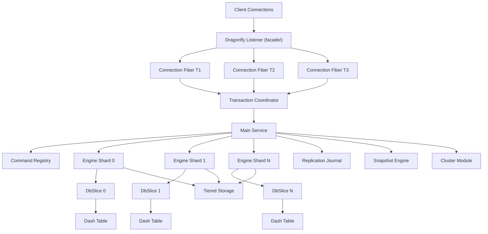
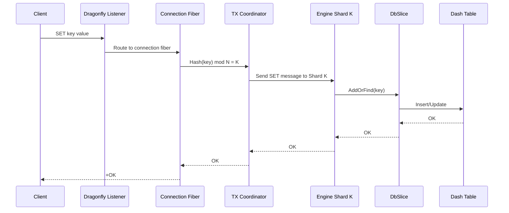
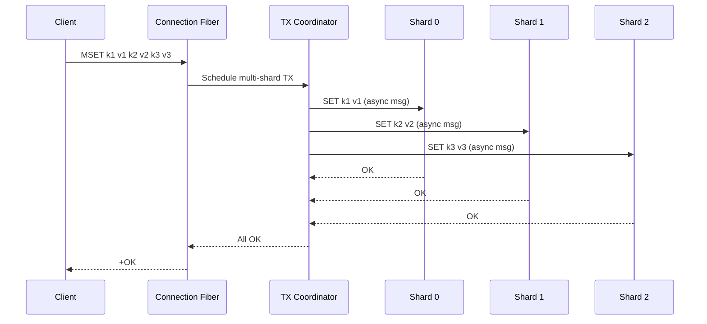
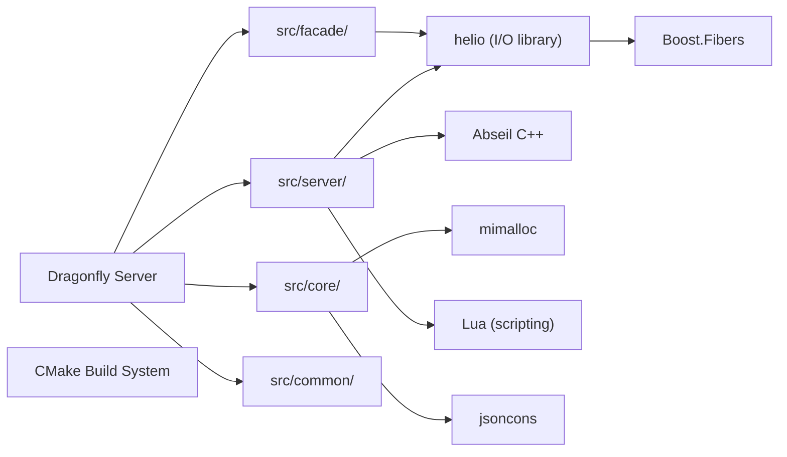

# Dragonfly

> A modern replacement for Redis and Memcached with a multi-threaded, shared-nothing architecture

| Metadata | |
|---|---|
| Repository | https://github.com/dragonflydb/dragonfly |
| License | BSL 1.1 |
| Primary Language | C++ |
| Category | Database |
| Analyzed Release | `v1.36.0` (2026-01-07) |
| Stars (approx.) | 29,931 |
| Generated by | Claude Opus 4.6 (Anthropic) |
| Generated on | 2026-02-08 |

## Overview

Dragonfly is a high-performance in-memory datastore designed as a drop-in replacement for Redis and Memcached, built from the ground up with a multi-threaded, shared-nothing architecture. Unlike Redis's single-threaded event loop, Dragonfly partitions data across CPU threads where each thread exclusively owns its shard, eliminating the need for mutex locks and enabling linear vertical scaling. It achieves up to 25x the throughput of Redis on multi-core machines while maintaining full compatibility with the Redis and Memcached protocols.

Problems it solves:
- Eliminates Redis's single-threaded bottleneck that wastes modern multi-core hardware
- Reduces memory overhead through novel data structures (Dash hash table) that are more compact than Redis's dict
- Provides atomic multi-key transactions across shards without global locks
- Enables faster snapshotting via parallel, non-blocking point-in-time snapshots
- Supports tiered storage to extend beyond RAM capacity

Positioning:
Dragonfly sits in the Redis-compatible in-memory database space alongside Valkey, KeyDB, and Garnet. Its primary differentiator is the shared-nothing, fiber-per-connection architecture that extracts maximum performance from a single machine. While Redis Cluster distributes across multiple processes/nodes, Dragonfly scales vertically within a single process, reaching millions of QPS. It targets use cases where Redis's throughput ceiling becomes a bottleneck, particularly high-traffic caching, session storage, and real-time analytics.

## Architecture Overview

Dragonfly employs a thread-per-core design where the in-memory keyspace is partitioned into N shards, each owned by a dedicated thread. Connection handling uses fiber-based concurrency within each thread, and inter-shard communication occurs exclusively through asynchronous message passing. The coordinator pattern ensures multi-key atomicity without shared locks.

## Core Components

### Engine Shard (`src/server/engine_shard.h`, `src/server/engine_shard.cc`)
- Responsibility: Represents a single data partition owned exclusively by one thread. Each shard manages its own DbSlice, handles local transactions, runs periodic heartbeat tasks for key expiration, and tracks per-shard statistics (defrag counts, transaction counts, eviction events).
- Key files: `engine_shard.h` defines the `EngineShard` class with thread-local storage via `static EngineShard* shard_`. `engine_shard_set.h` manages the collection of all shards. `InitThreadLocal()` sets up each shard on its owning thread.
- Design patterns: Thread-local singleton (one EngineShard per thread), shared-nothing (no cross-shard data access). Statistics are aggregated via `Stats::operator+=`.

### DbSlice (`src/server/db_slice.h`, `src/server/db_slice.cc`)
- Responsibility: Manages the actual key-value data within a shard, including the primary Dash hash table, expiration tracking, memory accounting, and eviction logic. Tracks hits, misses, mutations, RAM vs. tiered storage access patterns.
- Key files: `db_slice.h` defines `DbStats` (key counts, memory usage, capacity) and `SliceEvents` (evictions, expirations, hits/misses, RAM hits vs. misses). `table.h` defines the underlying table structure.
- Design patterns: Facade pattern over the Dash hash table, observer pattern for slice events.

### Dash Hash Table (`src/core/dash.h`, `src/core/dash_internal.h`)
- Responsibility: A custom hash table implementation optimized for Dragonfly's shared-nothing model. Dash (Dynamic And Scalable Hashing) provides better memory efficiency than Redis's dict by using a combination of segments and buckets with inline storage.
- Key files: `dash.h` (public API), `dash_internal.h` (internal bucket/segment layout), `compact_object.h` (memory-efficient object representation), `dense_set.h` (set implementation).
- Design patterns: Open addressing with linear probing within segments, power-of-two segment growth. The compact object system in `compact_object.h` reduces per-key memory overhead compared to Redis's robj.

### Main Service and Command Dispatch (`src/server/main_service.h`, `src/server/main_service.cc`)
- Responsibility: Central service that initializes the server, registers command families, dispatches incoming commands to the correct shard, and manages the overall server lifecycle. Implements `facade::ServiceInterface`.
- Key files: `main_service.h` defines `Service` class with `DispatchCommand()`, `DispatchManyCommands()`, and `InvokeCmd()`. `command_registry.h` maps command names to handler functions. `command_families.h` aggregates all command families (string, list, set, sorted set, hash, stream, etc.).
- Design patterns: Command pattern for each Redis command, registry pattern for command lookup, facade pattern for the service interface.

### Transaction Coordinator (`src/server/tx_base.h`, `src/server/common.h`)
- Responsibility: Coordinates multi-key transactions across shards. When a command touches keys in multiple shards, the coordinator sends messages to each shard's thread, waits for responses, and ensures atomic execution. Uses optimistic and out-of-order execution to maximize throughput.
- Key files: `tx_base.h` (transaction base types), `conn_context.h` (per-connection transaction state), `common.h` (global state and shard count). Statistics track `tx_optimistic_total`, `tx_ooo_total`, and `tx_batch_schedule_calls_total`.
- Design patterns: Two-phase execution (schedule then execute), message-passing for cross-shard coordination. Supports batch scheduling via `ScheduleBatchInShard`.

### Server Family (`src/server/server_family.h`, `src/server/server_family.cc`)
- Responsibility: Manages server-wide operations including persistence (RDB/AOF snapshots), replication, configuration, and administrative commands. Coordinates snapshot storage and replication streaming.
- Key files: `server_family.h` includes `ReplicaRoleInfo`, `ReplicationMemoryStats`. `detail/save_stages_controller.h` orchestrates multi-stage parallel snapshots. `detail/snapshot_storage.h` abstracts snapshot file management. `dflycmd.h` handles Dragonfly-specific replication commands.
- Design patterns: Controller pattern for snapshot stages, strategy pattern for snapshot storage backends.

### Cluster Module (`src/server/cluster/`)
- Responsibility: Implements hash-slot-based clustering compatible with Redis Cluster protocol. Manages slot ownership, slot migration (incoming and outgoing), and cluster configuration.
- Key files: `cluster_config.h` (cluster topology), `cluster_family.h` (CLUSTER command handlers), `coordinator.h` (migration coordination), `incoming_slot_migration.h`, `outgoing_slot_migration.h`, `slot_set.h` (slot range management).
- Design patterns: State machine for migration progress, observer pattern for cluster topology changes.

## Data Flow

### Single-Key SET Command

### Multi-Key MSET Command (Cross-Shard)

## Key Design Decisions

### 1. Shared-Nothing Architecture with Thread-Per-Core
- Choice: Partition the keyspace into N shards, each exclusively owned by one OS thread, using asynchronous message passing for inter-shard communication.
- Rationale: Eliminates all mutex contention and cache-line bouncing. Each thread can operate at full speed on its local data without synchronization overhead. Modern servers with 64+ cores can be fully utilized.
- Trade-offs: Multi-key operations require message passing overhead. Key distribution skew can cause hot shards. The programming model is more complex than lock-based approaches.

### 2. Fiber-Based Concurrency (Boost.Fibers)
- Choice: Use cooperative fibers within each thread rather than OS threads or async callbacks. Each connection is managed by a dedicated fiber.
- Rationale: Fibers provide synchronous-looking code while being non-blocking. A fiber blocked on I/O yields to other fibers on the same thread. This avoids callback hell and simplifies error handling compared to pure async approaches.
- Trade-offs: Requires fiber-aware I/O primitives throughout the codebase. Standard blocking I/O calls (e.g., `write()`, `pthread_mutex_lock()`) would block the entire thread. The helio library provides fiber-friendly replacements.

### 3. Dash Hash Table Instead of Redis dict
- Choice: Custom Dash (Dynamic And Scalable Hashing) table that uses segmented buckets with inline storage, replacing Redis's chained hash table.
- Rationale: Dash achieves better memory density by storing small values inline within buckets, reducing pointer overhead. It also supports incremental resizing without the two-table approach Redis uses.
- Trade-offs: More complex implementation. Less battle-tested than Redis's dict, though extensively tested via `dash_test.cc`. Custom data structures require custom serialization for snapshots.

### 4. Non-Blocking Point-in-Time Snapshots
- Choice: Parallel snapshot mechanism where each shard creates its snapshot independently via `detail/save_stages_controller.h`, without blocking the server.
- Rationale: Redis's fork-based RDB snapshot doubles memory usage and causes latency spikes. Dragonfly's approach uses versioning within the Dash table to capture a consistent point-in-time view while continuing to serve writes.
- Trade-offs: Snapshot consistency across shards requires coordination through `save_stages_controller`. The versioning mechanism adds per-entry metadata overhead during snapshot creation.

### 5. Redis Protocol Compatibility as First-Class Goal
- Choice: Full wire-protocol compatibility with Redis (RESP2/RESP3) and Memcached, including supporting all major Redis commands, Lua scripting, and pub/sub.
- Rationale: Enables drop-in replacement for existing Redis deployments without application changes. The large Redis ecosystem of clients, tools, and monitoring can be reused directly.
- Trade-offs: Compatibility constraints prevent some optimizations that would break protocol semantics. Some Redis behaviors (e.g., single-threaded Lua execution) must be carefully emulated in the multi-threaded context.

## Dependencies

## Testing Strategy

Dragonfly has a thorough testing infrastructure:

- Unit Tests: Per-component tests colocated with source files (e.g., `dash_test.cc`, `compact_object_test.cc`, `bloom_test.cc`, `bptree_set_test.cc`, `cluster_config_test.cc`, `acl_family_test.cc`). Tests use Google Test framework.
- Integration Tests: `dragonfly_test.cc` exercises the full server with real client connections.
- Benchmark Tests: `dash_bench.cc` and `dfly_bench.cc` measure performance of core data structures and full server throughput.
- Blocking Controller Tests: `blocking_controller_test.cc` tests commands like BLPOP that block across fibers.
- Memory Tests: `memory_test.cc` and `allocation_tracker.h` (when `DFLY_ENABLE_MEMORY_TRACKING` is defined) help detect memory leaks and track allocation patterns.
- The build system uses CMake with separate `CMakeLists.txt` for `src/core/`, `src/server/`, and `src/server/cluster/`.

## Key Takeaways

1. Dragonfly's shared-nothing architecture proves that Redis-compatible semantics can be delivered at massive scale on a single machine. By assigning each shard to a dedicated thread and using fiber-based concurrency with message passing for cross-shard operations, it eliminates the fundamental single-threaded bottleneck of Redis while maintaining strict serializability.

2. The coordinator pattern (connection fiber as transaction coordinator) is an elegant solution for multi-key atomicity in a shared-nothing system. Rather than acquiring global locks, the coordinator dispatches operations to relevant shards and assembles results, hiding the distributed nature of the keyspace from the client.

3. The Dash hash table and compact object representation demonstrate that purpose-built data structures can significantly outperform general-purpose ones. By co-designing the hash table with the shared-nothing threading model, Dragonfly achieves both better memory efficiency and higher throughput than Redis's dict.

## References

- Repository: https://github.com/dragonflydb/dragonfly
- Shared-Nothing Architecture Doc: https://github.com/dragonflydb/dragonfly/blob/main/docs/df-share-nothing.md
- Architecture Comparison with Redis: https://www.dragonflydb.io/guides/redis-and-dragonfly-architecture-comparison
- Documentation: https://www.dragonflydb.io/docs
- Helio I/O Library: https://github.com/romange/helio
