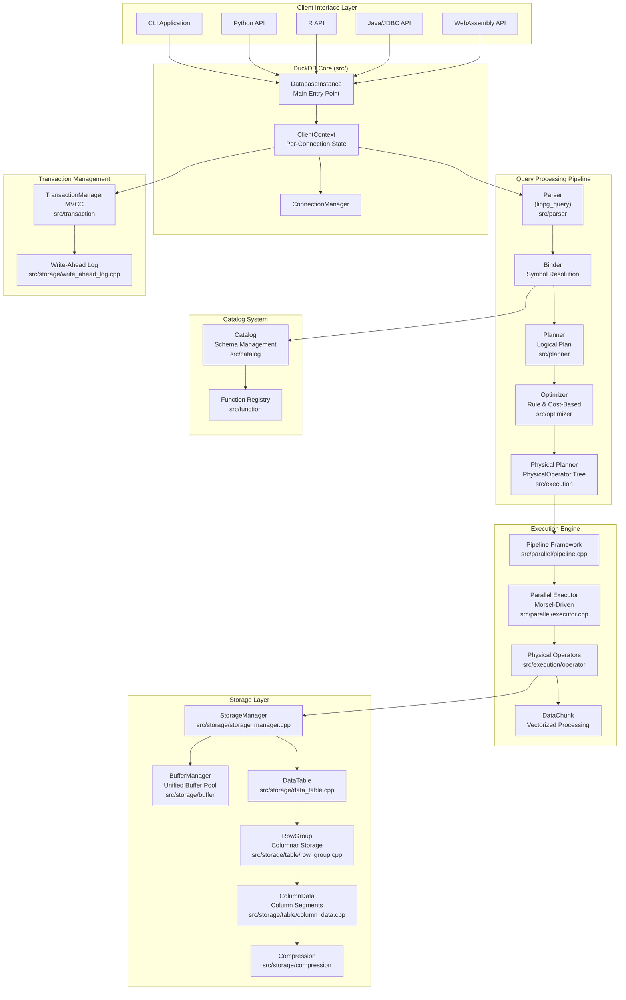
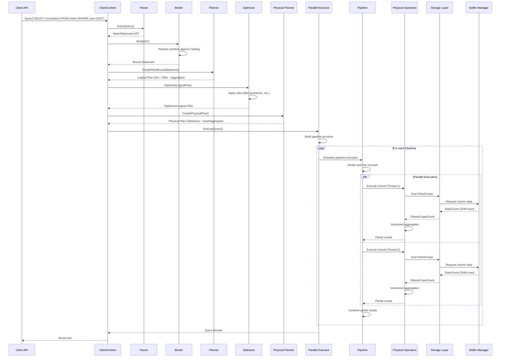
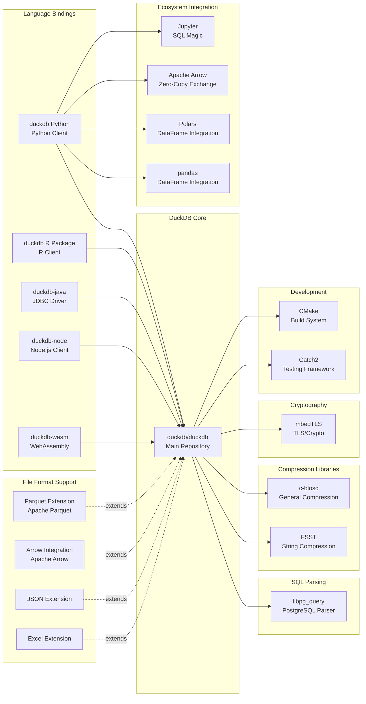

# DuckDB

> An in-process analytical SQL database management system for OLAP workloads

| Metadata | |
|---|---|
| Repository | https://github.com/duckdb/duckdb |
| License | MIT License |
| Primary Language | C++ |
| Category | Database |
| Analyzed Release | `v1.4.4` (2026-01-26) |
| Stars (approx.) | 35,945 |
| Generated by | Claude Sonnet 4.5 (Anthropic) |
| Generated on | 2026-02-08 |

## Overview

DuckDB is a high-performance analytical database system designed to be fast, reliable, portable, and easy to use. It is an embedded database optimized for analytical (OLAP) queries, with a rich SQL dialect supporting complex queries, window functions, correlated subqueries, and complex types.

Problems it solves:

- Providing fast analytical query capabilities without requiring a separate database server (in-process execution like SQLite)
- Enabling efficient analysis of large datasets that exceed available RAM through out-of-core processing
- Seamless integration with data science tools (pandas, dplyr, Arrow) and various data formats (CSV, Parquet, JSON)
- Eliminating the overhead of data serialization and network communication in analytical workloads

Positioning:

DuckDB positions itself as "SQLite for analytics" - an embeddable, zero-dependency analytical database. While SQLite excels at OLTP workloads, DuckDB is optimized for OLAP. It competes with traditional analytical databases by offering in-process execution, and with data processing frameworks like Spark by providing simpler deployment and better single-node performance.

## Architecture Overview

DuckDB employs a modular pipeline architecture with a classic query processing flow: SQL parsing, logical planning, optimization, physical planning, and vectorized execution. The system is built around columnar storage, vectorized execution, and morsel-driven parallelism to achieve high performance on analytical workloads.

## Core Components

### Parser (`src/parser`)

- Responsibility: Converting SQL text into an abstract syntax tree (AST)
- Key files: `src/parser/`, `src/include/duckdb/parser/`
- Design patterns: Visitor pattern for AST traversal, libpg_query integration

DuckDB uses PostgreSQL's parser (libpg_query) as its foundation, ensuring high SQL compatibility. After parsing, the tokens are transformed into DuckDB's custom parse tree representation consisting of `SQLStatement`, `Expression`, and `TableRef` nodes. This approach provides excellent SQL dialect support while maintaining a clean internal representation.

The parser generates statements like `SelectStatement`, `InsertStatement`, `CreateStatement`, which are then passed to the Binder for semantic analysis.

### Planner & Binder (`src/planner`)

- Responsibility: Converting parsed AST into a logical query plan with resolved symbols
- Key files: `src/planner/binder/`, `src/planner/planner.cpp`
- Design patterns: Builder pattern for plan construction, Visitor pattern for AST traversal

The Binder resolves all symbols (table names, column names, function names) against the catalog and performs semantic validation. It transforms unbound expressions into bound expressions with type information.

The Planner then constructs a logical query plan represented as a tree of `LogicalOperator` nodes (e.g., `LogicalGet`, `LogicalFilter`, `LogicalAggregate`, `LogicalJoin`). This logical plan is independent of physical implementation details and focuses on the "what" rather than the "how."

### Optimizer (`src/optimizer`)

- Responsibility: Transforming logical plans into more efficient equivalent plans
- Key files: `src/optimizer/`, optimization rules in subdirectories
- Design patterns: Rule-based optimization (Visitor pattern), Cost-based optimization (Cardinality estimation)

The optimizer applies both rule-based and cost-based optimizations:

Rule-based optimizations include:
- Filter pushdown: Moving predicates closer to data sources
- Projection pushdown: Eliminating unnecessary columns early
- Expression rewriting: Simplifying and normalizing expressions
- Common subexpression elimination
- Constant folding

Cost-based optimizations include:
- Join ordering: Finding efficient join sequences using statistics
- Join type selection: Choosing between hash join, merge join, etc.
- Index selection: Determining when to use available indexes

The optimizer produces an optimized `LogicalOperator` tree that maintains semantic equivalence while improving expected performance.

### Physical Planner (`src/execution`)

- Responsibility: Converting logical plans into executable physical plans
- Key files: `src/execution/physical_plan_generator.cpp`, `src/include/duckdb/execution/physical_operator.hpp`
- Design patterns: Strategy pattern for operator selection

The physical planner transforms each `LogicalOperator` into a corresponding `PhysicalOperator` (e.g., `PhysicalTableScan`, `PhysicalHashJoin`, `PhysicalAggregate`). These physical operators contain concrete implementation details and execution strategies.

Physical operators are organized into pipelines - sequences of operators that can process data in a streaming fashion without materialization. This pipeline model is key to DuckDB's efficient memory usage and parallel execution capabilities.

### Vectorized Execution Engine (`src/execution/operator`, `src/common/types/data_chunk.hpp`)

- Responsibility: Executing physical operators using vectorized processing
- Key files: `src/common/types/data_chunk.cpp`, `src/common/vector_operations/`, `src/execution/operator/`
- Design patterns: Batch processing, SIMD optimization

DuckDB's execution engine is built around the `DataChunk` abstraction - a collection of vectors representing batches of rows (typically 2048 rows per chunk). Instead of processing one tuple at a time (Volcano model), operators process entire vectors, enabling:

- Better CPU cache utilization through sequential memory access
- SIMD (Single Instruction Multiple Data) optimization opportunities
- Reduced per-tuple interpretation overhead
- More efficient branch prediction

Each `PhysicalOperator` implements methods to consume input `DataChunks` and produce output `DataChunks`. The push-based execution model allows operators to actively push data through the pipeline rather than pulling on demand.

### Parallel Execution Framework (`src/parallel`)

- Responsibility: Orchestrating parallel query execution across multiple threads
- Key files: `src/parallel/executor.cpp`, `src/parallel/pipeline.cpp`, `src/parallel/task_scheduler.cpp`
- Design patterns: Morsel-driven parallelism, Pipeline parallelism, Event-driven coordination

DuckDB implements morsel-driven parallelism, a sophisticated approach to intra-query parallelism:

- Queries are broken into pipelines - sequences of operators that can execute without materialization
- Each pipeline is divided into morsels - small chunks of work that can be executed independently
- Worker threads dynamically grab morsels from a work queue, ensuring load balancing
- Pipeline breakers (e.g., hash joins, aggregations) create pipeline boundaries where data is materialized

The `TaskScheduler` manages a thread pool and distributes work across available cores. The `PipelineExecutor` coordinates the execution of individual pipelines, while the `Executor` orchestrates the entire query execution graph.

This design is NUMA-aware and cache-efficient, achieving near-linear scalability on multi-core systems.

### Storage Layer (`src/storage`)

- Responsibility: Managing persistent and in-memory data storage
- Key files: `src/storage/storage_manager.cpp`, `src/storage/data_table.cpp`, `src/storage/table/`
- Design patterns: Columnar storage, Compression, Buffer management

DuckDB's storage layer is designed for analytical workloads:

Columnar Storage (`src/storage/table/row_group.cpp`, `src/storage/table/column_data.cpp`):
- Data is organized into RowGroups (default 122,880 rows)
- Within each RowGroup, data is stored column-wise in ColumnSegments
- This layout optimizes for sequential scans and column-oriented operations
- Supports various compression algorithms per column (dictionary, RLE, bitpacking, etc.)

Buffer Manager (`src/storage/buffer/buffer_manager.cpp`):
- Unified buffer pool managing both persistent and temporary data
- Supports out-of-core processing - can handle datasets larger than RAM
- LRU-based eviction policy with pinning support
- Transparent spilling to temporary files when memory pressure occurs

The storage layer also includes:
- Write-Ahead Log (WAL) for durability
- Checkpoint mechanism for periodic snapshots
- Support for multiple attached databases

### Transaction Manager (`src/transaction`)

- Responsibility: Managing concurrent transactions with ACID guarantees
- Key files: `src/transaction/transaction_manager.cpp`, `src/storage/table/update_segment.cpp`
- Design patterns: MVCC (Multi-Version Concurrency Control)

DuckDB implements MVCC to provide snapshot isolation:
- Each transaction sees a consistent snapshot of the database
- Reads never block writes, and writes never block reads
- Updates create new versions rather than overwriting data
- Garbage collection eventually removes old versions

The transaction manager coordinates commit and rollback operations, ensures serializability, and maintains the transaction state. While optimized for analytical workloads, DuckDB supports transactional updates and can handle mixed workloads.

### Catalog System (`src/catalog`)

- Responsibility: Maintaining metadata about database objects (tables, schemas, functions)
- Key files: `src/catalog/catalog.cpp`, `src/catalog/catalog_entry/`
- Design patterns: Registry pattern, Hierarchical namespace

The catalog stores information about:
- Schemas and tables (structure, statistics, constraints)
- Functions (scalar, aggregate, table, window)
- Types (built-in and user-defined)
- Indexes and views

DuckDB supports multiple attached databases, each with its own catalog. The catalog is transactional - schema changes are versioned and follow ACID properties. This enables features like transactional DDL and time-travel queries.

## Data Flow

### Typical Analytical Query Execution

## Key Design Decisions

### 1. Columnar Storage with Compression

- Choice: Store data column-wise with automatic per-column compression
- Rationale: Analytical queries typically access a subset of columns but many rows. Columnar storage minimizes I/O by reading only required columns. Sequential access patterns enable high compression ratios and efficient SIMD processing
- Trade-offs: Less efficient for transactional workloads requiring full-row updates. Insert operations require updating multiple column segments. However, DuckDB's primary target is analytical workloads where this trade-off is beneficial

### 2. Vectorized Execution with DataChunks

- Choice: Process data in batches (vectors) of 2048 rows rather than row-at-a-time (Volcano model)
- Rationale: Vectorized execution dramatically reduces per-tuple interpretation overhead and enables SIMD optimizations. Processing data in chunks improves CPU cache utilization and enables efficient pipeline execution. The 2048-row default balances memory usage with processing efficiency
- Trade-offs: Requires operators to be rewritten for vectorized processing. Some operations (e.g., complex nested subqueries) are harder to vectorize. Memory usage per operator increases due to batch processing

### 3. Morsel-Driven Parallelism

- Choice: Divide work into small morsels that are dynamically assigned to worker threads
- Rationale: Static work partitioning can lead to load imbalance. Morsel-driven parallelism enables dynamic load balancing - threads that finish early can pick up additional work. The approach is NUMA-aware and cache-friendly. It naturally handles data skew and varying operator costs
- Trade-offs: Overhead of task scheduling and coordination. Requires careful morsel size tuning - too small increases overhead, too large reduces load balancing benefits. More complex implementation than simpler parallelism models

### 4. In-Process Architecture (No Client-Server)

- Choice: Embed the database engine directly in the application process, similar to SQLite
- Rationale: Eliminates serialization and network overhead for data transfer. Simplifies deployment (no separate server to manage). Enables zero-copy integration with data science libraries like pandas and Arrow. Better performance for single-node analytical workloads
- Trade-offs: Cannot share database across multiple processes (unless using read-only mode). Memory is shared with the host application. Not suitable for traditional multi-user OLTP scenarios requiring concurrent writers

### 5. PostgreSQL Parser Integration

- Choice: Use libpg_query (PostgreSQL's parser) rather than building a custom parser
- Rationale: PostgreSQL has one of the most comprehensive and well-tested SQL parsers. Reusing it provides excellent SQL compatibility and saves development effort. The parser supports advanced SQL features (CTEs, window functions, complex subqueries) out of the box
- Trade-offs: Dependency on external library requiring periodic updates. Parser generates PostgreSQL-style AST that must be transformed to DuckDB's internal representation. Some PostgreSQL-specific syntax may not be relevant to DuckDB

### 6. Unified Buffer Manager for Out-of-Core Processing

- Choice: Implement a sophisticated buffer manager that can spill to disk when memory is exhausted
- Rationale: Real-world datasets often exceed available RAM. Out-of-core processing enables DuckDB to handle datasets much larger than memory without failing. The unified buffer manager handles both persistent and temporary data, simplifying memory management
- Trade-offs: Complexity of buffer management logic. Performance degrades when spilling occurs, though DuckDB tries to minimize this through smart eviction policies. Requires careful tuning of memory limits

### 7. Extensibility Through Extensions

- Choice: Support dynamically loadable extensions for additional functionality
- Rationale: Keep core database lightweight while allowing users to add features on demand (e.g., Parquet support, JSON functions, HTTP client). Extensions can be developed independently and distributed separately. Community can contribute new functionality without modifying core
- Trade-offs: Extension API must remain stable, constraining internal changes. Potential security concerns with loading external code. Extension version compatibility must be managed carefully

## Dependencies

## Testing Strategy

DuckDB employs a comprehensive multi-layered testing approach ensuring correctness and performance.

Unit tests: Extensive unit tests for individual components (parser, optimizer rules, storage structures, functions) using the Catch2 framework. Tests are located alongside source code and cover edge cases, error handling, and boundary conditions.

SQL Logic Tests: DuckDB uses the SQLLogic test suite - a standardized set of SQL tests originally developed for SQLite. These tests verify SQL semantics and result correctness across thousands of queries. Located in `test/sql/` directory.

Fuzzing: Continuous fuzzing infrastructure to discover edge cases and potential crashes. The fuzzer generates random SQL queries and data to stress-test the system.

Performance Regression Tests: Benchmark suite including TPC-H, TPC-DS, and custom benchmarks. Automated performance tracking across commits to detect regressions. Results are tracked and visualized over time.

CI/CD: GitHub Actions runs comprehensive test suites on every commit across multiple platforms (Linux, macOS, Windows) and configurations. Tests include compilation, unit tests, SQL tests, and benchmarks. Release builds are automatically generated and distributed.

Verification Mode: Optional runtime verification mode that performs additional correctness checks during execution (e.g., verifying sort orders, checking constraint violations). Useful for debugging but adds overhead.

## Key Takeaways

1. Columnar storage + vectorized execution + parallelism synergy: DuckDB demonstrates how these three architectural choices work together multiplicatively. Columnar storage enables vectorized execution through sequential memory access, which in turn enables efficient parallelization. Each component amplifies the benefits of the others, resulting in exceptional analytical query performance.

2. In-process analytical database niche: DuckDB proves there is significant value in the "embedded analytical database" category between simple file formats (CSV, Parquet) and full-fledged database servers. For single-node analytical workloads, in-process execution eliminates serialization overhead and simplifies deployment while providing full SQL capabilities.

3. Morsel-driven parallelism for dynamic load balancing: Unlike static partitioning approaches, morsel-driven parallelism dynamically distributes work across threads. This design handles data skew gracefully and maintains high CPU utilization even when operator costs vary. The approach is broadly applicable to parallel data processing systems.

4. Unified buffer management for scalability: DuckDB's buffer manager transparently handles both in-memory and out-of-core scenarios. This unified approach simplifies the codebase while enabling the system to gracefully handle datasets exceeding available memory. The design demonstrates that analytical databases need not be pure in-memory systems to achieve good performance.

5. Pipeline-based execution model: Breaking queries into pipelines that can execute without materialization reduces memory footprint and enables streaming processing. The pipeline boundaries (at blocking operators like hash joins) provide natural parallelization points. This model balances memory efficiency with execution parallelism.

6. Extensibility without compromising core simplicity: DuckDB's extension system allows the core to remain lean while enabling rich functionality (file formats, cloud storage, specialized functions). The loadable extension architecture is applicable to any system seeking to balance simplicity with extensibility.

7. Reusing PostgreSQL's parser for SQL compatibility: Instead of building a parser from scratch, DuckDB leverages PostgreSQL's mature parser. This decision provides excellent SQL compatibility with minimal effort, demonstrating the value of strategic dependency on well-maintained open source components.

## References

- [DuckDB Official Documentation](https://duckdb.org/docs/)
- [DuckDB GitHub Repository](https://github.com/duckdb/duckdb)
- [DuckDB: An Embeddable Analytical Database (SIGMOD 2019 Paper)](https://dl.acm.org/doi/10.1145/3299869.3320212)
- [Push-Based Execution in DuckDB (CIDR 2023)](https://www.cidrdb.org/cidr2023/papers/p46-muehleisen.pdf)
- [In-Process Analytical Data Management with DuckDB - InfoQ](https://www.infoq.com/articles/analytical-data-management-duckdb/)
- [DuckDB: An Architectural Deep Dive - ThinhDA](https://thinhdanggroup.github.io/duckdb/)
- [CMU Database Systems Course - DuckDB Lecture](https://15721.courses.cs.cmu.edu/spring2024/notes/20-duckdb.pdf)
- [Morsel-Driven Execution Framework in DuckDB](https://blog.qsliu.dev/post/duckdb-morsel-driven/)
- [DuckDB Push-Based Execution Model - Jian Zhang](https://zz-jason.github.io/posts/duckdb-execution-model/)
- [Why DuckDB - Official Website](https://duckdb.org/why_duckdb)
