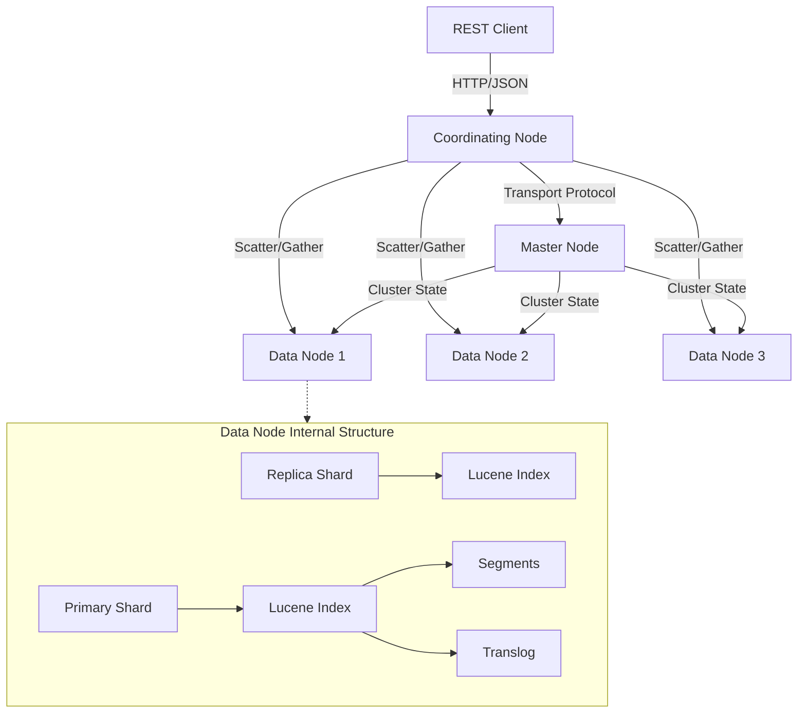
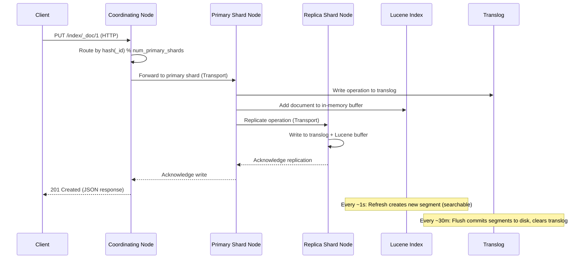
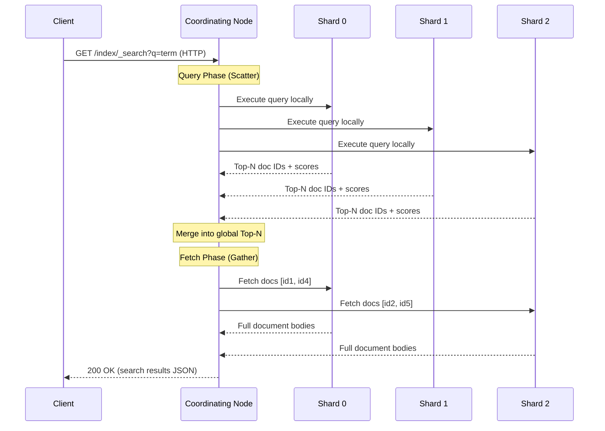
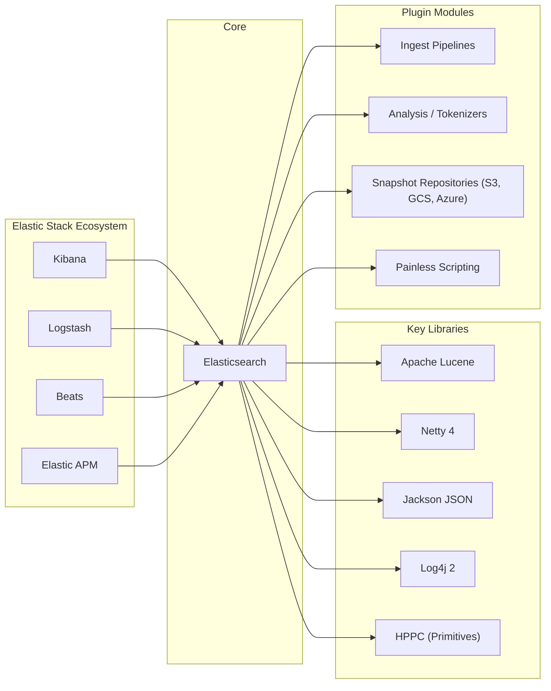

# Elasticsearch

> Free and open source, distributed, RESTful search and analytics engine built on Apache Lucene.

| Metadata | |
|---|---|
| Repository | https://github.com/elastic/elasticsearch |
| License | SSPL / Elastic License 2.0 (dual-licensed) |
| Primary Language | Java |
| Analyzed Release | `v9.3.0` (2026-02-03) |
| Stars (approx.) | 76,000 |
| Generated by | Claude Opus 4.6 (Anthropic) |
| Generated on | 2026-02-08 |

## Overview

Elasticsearch is a distributed search and analytics engine that provides near-real-time full-text search, structured search, analytics, and logging capabilities at scale. Built on top of Apache Lucene, it transforms a single-node text search library into a horizontally scalable distributed system capable of handling petabytes of data across hundreds of nodes. It exposes all of its functionality through a RESTful JSON API and serves as the core component of the Elastic Stack (formerly ELK Stack).

Problems it solves:

- Full-text search across massive datasets with sub-second response times using inverted indices and distributed query execution
- Real-time log and event analytics at scale, enabling observability across distributed systems
- Structured and unstructured data aggregation with a rich query DSL that supports complex filtering, scoring, and faceted navigation
- Horizontal scaling of search workloads without application-level sharding logic, through automatic shard distribution and replication

Positioning:

Elasticsearch occupies a unique position as the dominant open-source distributed search engine. Compared to Apache Solr (also Lucene-based), Elasticsearch offers superior cluster management, a more intuitive REST API, and a richer ecosystem (Kibana, Beats, Logstash). Compared to purpose-built databases like PostgreSQL full-text search, Elasticsearch provides orders-of-magnitude better performance on search-heavy workloads and natively supports distributed execution. Newer competitors like Meilisearch and Typesense target simpler use cases with easier setup, while OpenSearch (the AWS-maintained fork) competes directly but trails in features. Elasticsearch has expanded beyond search into observability, security analytics, and vector search for AI/ML retrieval-augmented generation (RAG) pipelines.

## Architecture Overview

Elasticsearch follows a shared-nothing distributed architecture where a cluster consists of multiple nodes, each holding a subset of the data as shards. A single elected master node coordinates cluster-wide metadata and state changes, while any node can serve as a coordinating node that receives client requests, scatters queries to relevant shards, and gathers results. Each shard is a self-contained Lucene index, and the engine layer wraps Lucene to add transactional semantics, real-time refresh, and recovery capabilities.

## Core Components

### Cluster Management (`server/src/main/java/org/elasticsearch/cluster/`)

- Responsibility: Maintains the global cluster state, manages node membership, shard allocation, and index metadata across all nodes
- Key files: `ClusterState.java`, `ClusterModule.java`, `ClusterService.java`, `ClusterInfo.java`, `NodeConnectionsService.java`
- Design patterns: Event-driven architecture with `ClusterStateListener` and `ClusterStateApplier` observer pattern; task batching via `SimpleBatchedExecutor` for state updates

The cluster state is the central data structure that contains the complete view of the cluster: which nodes are present, which indices exist, which shards are allocated to which nodes, and all index settings and mappings. Only the elected master node can modify the cluster state. State changes are published atomically to all nodes using a two-phase commit protocol. The `ClusterState` object is immutable -- every update creates a new instance, and differential diffs (`Diffable` interface) are used to minimize the amount of data transmitted between nodes. The routing table within cluster state maps each shard to its assigned node, and the `RoutingAllocation` subsystem handles shard placement decisions using configurable allocation deciders (e.g., disk watermarks, awareness attributes).

### Discovery and Coordination (`server/src/main/java/org/elasticsearch/discovery/`, `server/src/main/java/org/elasticsearch/cluster/coordination/`)

- Responsibility: Handles node discovery, master election, and leader-based cluster coordination
- Key files: `DiscoveryModule.java`, `PeerFinder.java`, `SeedHostsResolver.java`, `Coordinator.java` (in `cluster/coordination/`)
- Design patterns: Leader election using a Raft-inspired consensus protocol; seed-based peer discovery

Starting from Elasticsearch 7.0, the legacy Zen Discovery was replaced with a new coordination subsystem inspired by the Raft consensus algorithm. The `PeerFinder` class probes seed hosts (configured via `discovery.seed_hosts`) and discovered peers to build the node graph. Once a quorum of master-eligible nodes is established, a leader election occurs. The elected master then publishes cluster state updates, and followers must acknowledge receipt before the update is committed. This two-phase commit prevents split-brain scenarios that plagued older versions. Fault detection runs bidirectionally: the master pings follower nodes, and followers ping the master, enabling rapid detection of node failures and triggering re-election or shard reallocation.

### Index Engine (`server/src/main/java/org/elasticsearch/index/engine/`)

- Responsibility: Wraps Apache Lucene to provide transactional indexing, version conflict detection, near-real-time search, and crash recovery
- Key files: `Engine.java`, `InternalEngine.java`, `EngineConfig.java`, `LiveVersionMap.java`, `Segment.java`, `CombinedDeletionPolicy.java`
- Design patterns: Template Method pattern (`Engine` abstract class with `InternalEngine` and `ReadOnlyEngine` implementations); Write-Ahead Log pattern via translog

`InternalEngine` is the primary engine implementation and the heart of the indexing pipeline. When a document is indexed, the engine first writes the operation to the translog (write-ahead log) for durability, then adds it to the in-memory Lucene index buffer. The `LiveVersionMap` tracks the latest version of each document in memory, enabling optimistic concurrency control without hitting Lucene. A periodic refresh operation (default: every 1 second) creates a new Lucene segment from the buffer and makes it searchable, achieving near-real-time search semantics. The flush operation performs a Lucene commit, persisting all in-memory segments to disk and truncating the translog. Background merge operations, managed by `ElasticsearchConcurrentMergeScheduler`, consolidate small segments into larger ones to maintain query performance.

### Search Execution (`server/src/main/java/org/elasticsearch/search/`, `server/src/main/java/org/elasticsearch/action/search/`)

- Responsibility: Executes distributed search queries using a scatter-gather pattern with query and fetch phases
- Key files: `SearchService.java`, `SearchModule.java`, `DefaultSearchContext.java`, `SearchPhaseResult.java`
- Design patterns: Scatter-Gather pattern for distributed query execution; Strategy pattern for pluggable search phases (DFS, Query, Fetch)

Search execution follows a two-phase process. In the query phase, the coordinating node forwards the request to a primary or replica copy of every relevant shard. Each shard executes the query locally against its Lucene index, applies scoring, and returns a sorted priority queue of document IDs and scores. The coordinating node merges these per-shard results into a global sorted list. In the fetch phase, the coordinating node issues multi-GET requests to retrieve the actual document content only for the top-N results. This two-phase approach avoids transferring full document bodies from all shards, dramatically reducing network overhead. The optional DFS (Distributed Frequency Statistics) phase can be prepended to collect global term frequencies for more accurate scoring in distributed settings.

### REST API Layer (`server/src/main/java/org/elasticsearch/rest/`, `server/src/main/java/org/elasticsearch/http/`)

- Responsibility: Receives HTTP requests, dispatches them to the appropriate action handlers, and serializes responses
- Key files: `RestController.java`, `BaseRestHandler.java`, `RestRequest.java`, `RestResponse.java`, `RestHandler.java`
- Design patterns: Front Controller pattern (`RestController` routes all requests); Chain of Responsibility for request filtering and interceptors

The `RestController` serves as the central request dispatcher. Incoming HTTP requests are parsed into `RestRequest` objects and matched against registered route patterns. Each endpoint is implemented as a `RestHandler` (typically extending `BaseRestHandler`), which validates parameters, constructs an internal `ActionRequest`, and delegates to the action layer. The action layer then translates REST-level operations into transport-level operations that can be routed to the appropriate node. The HTTP transport itself is abstracted behind the `HttpServerTransport` interface, with the default implementation using Netty 4 (`modules/transport-netty4/`). This clean separation allows the entire REST surface to be tested without a live HTTP server.

### Transport Layer (`server/src/main/java/org/elasticsearch/transport/`)

- Responsibility: Handles inter-node binary communication for cluster operations, shard-level requests, and cluster state propagation
- Key files: `TransportService.java`, `TcpTransport.java`, `InboundHandler.java`, `OutboundHandler.java`, `ConnectionManager.java`, `RemoteClusterService.java`
- Design patterns: Request-Response pattern with registered handlers (`RequestHandlerRegistry`); Connection pooling with `ConnectionProfile`

The transport layer is the nervous system of an Elasticsearch cluster. All inter-node communication -- shard replication, search scatter-gather, cluster state publishing, and recovery -- flows through this layer. `TransportService` is the primary entry point: it registers action handlers, manages connections to other nodes, and routes requests. The underlying `TcpTransport` handles serialization, framing, and compression (LZ4 or Deflate). Each connection between nodes consists of multiple TCP channels organized by type (recovery, bulk, state, ping) to prevent head-of-line blocking. The `InboundPipeline` decodes incoming bytes through `InboundDecoder` and `InboundAggregator`, while `OutboundHandler` serializes and sends responses. The module also supports cross-cluster search via `RemoteClusterService`, which maintains persistent connections to remote clusters using sniff or proxy strategies.

## Data Flow

### Document Indexing

### Distributed Search

## Key Design Decisions

### 1. Immutable Lucene Segments with Background Merging

- Choice: Documents are written to immutable Lucene segments that are never modified in place. Updates create a new version of the document and mark the old version as deleted. Small segments are periodically merged into larger ones by background threads.
- Rationale: Immutability enables lock-free concurrent reads (no reader-writer contention), makes caching highly effective (segments never change so OS page cache hits are reliable), and simplifies crash recovery since partially written segments can simply be discarded.
- Trade-offs: Deletes and updates consume extra disk space until segments are merged. High update rates can create many small segments, increasing merge pressure and temporarily consuming I/O bandwidth. The merge policy (`MergePolicyConfig.java`) must balance search performance (fewer segments) against write throughput (less merge overhead).

### 2. Near-Real-Time Search via Periodic Refresh

- Choice: New documents become searchable only after a refresh operation creates a new Lucene segment, with a default interval of 1 second. The translog provides durability between refreshes.
- Rationale: Achieving true real-time search (every document instantly searchable) would require a Lucene commit after every write, which is prohibitively expensive. The 1-second refresh provides a practical balance between freshness and throughput, while the translog ensures no acknowledged writes are lost even if the node crashes before a flush.
- Trade-offs: There is an inherent latency of up to 1 second (configurable) between indexing and searchability. Applications requiring instant consistency must use the `?refresh=wait_for` parameter, which blocks until the next refresh -- at a throughput cost.

### 3. Hash-Based Shard Routing with Fixed Primary Shard Count

- Choice: Documents are routed to shards using `hash(_routing) % number_of_primary_shards`, where `_routing` defaults to the document `_id`. The number of primary shards is fixed at index creation time.
- Rationale: A deterministic hash function allows any node to instantly compute which shard holds a given document without consulting any lookup table. This makes single-document operations (GET, DELETE by ID) extremely fast -- a single network hop to the correct shard.
- Trade-offs: The primary shard count cannot be changed after index creation (since the hash function would break). Choosing too few shards limits parallelism; choosing too many creates overhead from managing many small Lucene indices. The `_split` and `_shrink` APIs provide workarounds but require reindexing. Time-series use cases mitigate this through index lifecycle management (ILM) with rolling indices.

### 4. Master-Follower Cluster Coordination with Raft-Inspired Consensus

- Choice: Cluster state is managed by a single elected master node using a consensus protocol inspired by Raft, replacing the earlier Zen Discovery gossip-based approach.
- Rationale: The gossip-based Zen Discovery suffered from split-brain scenarios under network partitions, requiring manual configuration of `minimum_master_nodes`. The new protocol guarantees that a master is only elected with a true majority quorum, making split-brain impossible by construction.
- Trade-offs: The master node becomes a bottleneck for metadata operations (index creation, mapping updates, shard allocation). Very large clusters (thousands of nodes) must carefully size master nodes. The protocol adds latency to state updates due to the two-phase commit requirement, but this affects only metadata changes, not data operations.

### 5. Two-Phase Query-Then-Fetch Search Execution

- Choice: Distributed search is split into a query phase (scatter to all shards, gather document IDs and scores) and a fetch phase (retrieve full documents only for the final top-N results).
- Rationale: Transferring full document bodies from every shard for every query would create massive network overhead, especially with large documents or high shard counts. By first identifying only the winning document IDs (lightweight), the fetch phase retrieves full content from a minimal subset of shards.
- Trade-offs: Two network round-trips add latency compared to a single-phase approach. Deep pagination (requesting results beyond the first few pages) remains expensive because each shard must still return `from + size` results in the query phase. The `search_after` API and Point-in-Time (PIT) mechanism address this for large result sets.

## Dependencies

## Testing Strategy

Elasticsearch has an extensive multi-layered testing strategy with thousands of tests spanning unit, integration, and end-to-end levels. The project uses a custom test framework built on JUnit that provides randomized testing capabilities (randomized locales, time zones, merge policies, etc.) to uncover edge cases.

Unit tests: Located alongside source code in the `server/src/test/` directory. The `ESTestCase` base class provides utilities for randomized testing, temporary file management, and assertion helpers. Unit tests cover individual components like the engine, search, and cluster state logic in isolation. The `InternalEngineTests` class alone contains hundreds of tests covering every aspect of the indexing engine.

Integration tests: The `ESIntegTestCase` base class spins up in-process Elasticsearch clusters with configurable numbers of nodes. These tests validate distributed behavior: shard allocation, replication, recovery after node failures, and search across multiple shards. The `qa/` directory contains additional quality assurance tests including rolling upgrade tests, backwards compatibility tests, and smoke tests against packaged distributions.

CI/CD: The project uses Buildkite (`.buildkite/`) for continuous integration with a comprehensive pipeline that runs tests across multiple JDK versions (the project requires JDK 21+), operating systems, and configurations. Gradle is the build system, with custom build conventions in `build-conventions/` and internal tooling in `build-tools-internal/`. The `x-pack/` directory contains additional tests for commercial features.

## Key Takeaways

1. Shard-as-Unit-of-Scale Architecture: Elasticsearch demonstrates how wrapping a single-node library (Lucene) in a distributed shell can create a horizontally scalable system. Each shard is an independent Lucene index, meaning the distributed layer handles routing, replication, and coordination while Lucene handles the actual search mechanics. This separation of concerns allows each layer to evolve independently and keeps the complexity of distributed systems away from the core search logic.

2. Near-Real-Time as a Design Primitive: Rather than pursuing strict real-time consistency (expensive) or pure batch processing (high latency), Elasticsearch chose a 1-second refresh interval as the default trade-off point. This "near-real-time" approach, combined with the translog for durability, demonstrates how carefully chosen defaults can define a product category. The insight is that most search use cases can tolerate 1 second of staleness, and making this the default rather than an option simplifies the mental model for users.

3. Scatter-Gather with Phase Decomposition: The two-phase query-then-fetch pattern is a masterclass in minimizing distributed system overhead. By decomposing the search operation into a lightweight metadata phase and a targeted data phase, Elasticsearch avoids the naive approach of shipping full documents from every shard. This pattern is applicable to any distributed system where the final result set is much smaller than the intermediate working set.

4. Immutability for Concurrent Performance: The use of immutable Lucene segments and immutable cluster state objects shows how immutability can eliminate entire classes of concurrency bugs. Readers never block writers, the OS page cache works optimally on data that does not change, and crash recovery is simplified. The trade-off of increased write amplification (segment merging) is handled by background threads, keeping the critical write path fast.

5. Deterministic Routing Eliminates Lookup Overhead: The `hash(_id) % num_shards` routing formula means any node can instantly determine which shard owns a document without a distributed lookup or directory service. This zero-hop routing for point queries is a powerful pattern for distributed key-value operations, though it requires accepting the constraint of a fixed shard count at index creation time.

## References

- [Elasticsearch Official Documentation](https://www.elastic.co/docs/reference/elasticsearch/)
- [Elasticsearch GitHub Repository](https://github.com/elastic/elasticsearch)
- [Elasticsearch Internals Overview (Elastic Blog)](https://www.elastic.co/blog/found-elasticsearch-internals)
- [Elasticsearch Networking Introduction (Elastic Blog)](https://www.elastic.co/blog/found-elasticsearch-networking)
- [A New Era for Cluster Coordination in Elasticsearch (Elastic Blog)](https://www.elastic.co/blog/a-new-era-for-cluster-coordination-in-elasticsearch)
- [Elasticsearch from the Top Down (Elastic Blog)](https://www.elastic.co/blog/found-elasticsearch-top-down)
- [Clusters, Nodes, and Shards (Elastic Docs)](https://www.elastic.co/docs/deploy-manage/distributed-architecture/clusters-nodes-shards)
- [Node Roles (Elastic Docs)](https://www.elastic.co/docs/deploy-manage/distributed-architecture/clusters-nodes-shards/node-roles)
- [Deep Dive into Elasticsearch Architecture (Medium)](https://codechefvaibhavkashyap.medium.com/deep-dive-into-elasticsearch-architecture-sharding-replication-and-lucene-internals-b5ed61886764)
- [Elasticsearch Flush, Translog and Refresh Guide (Opster)](https://opster.com/guides/elasticsearch/glossary/elasticsearch-flush-translog-and-refresh/)
