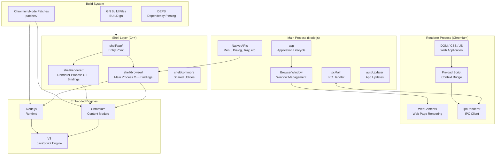
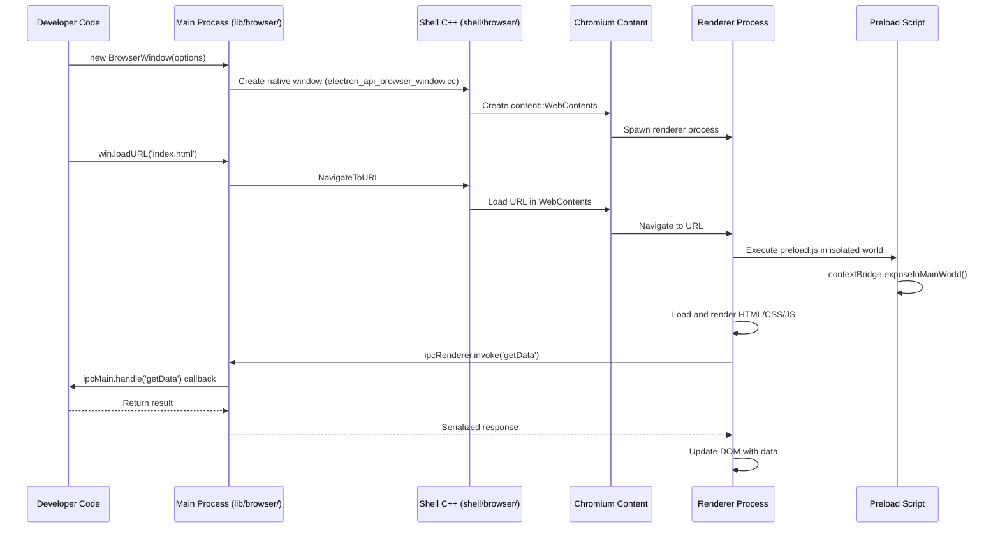
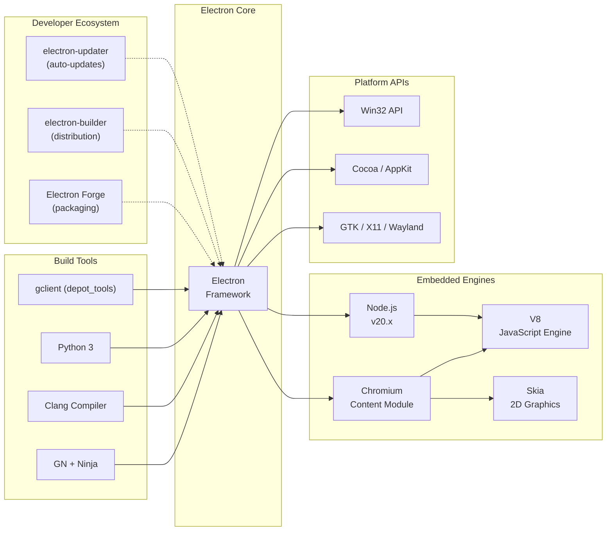

# Electron

> Build cross-platform desktop apps with JavaScript, HTML, and CSS

| Metadata | |
|---|---|
| Repository | https://github.com/electron/electron |
| License | MIT |
| Primary Language | C++ |
| Category | Desktop Application |
| Analyzed Release | `v40.2.1` (2026-02-06) |
| Stars (approx.) | 120,000+ |
| Generated by | Claude Opus 4.6 (Anthropic) |
| Generated on | 2026-02-09 |

## Overview

Electron is a framework for building cross-platform desktop applications using web technologies (JavaScript, HTML, CSS). It embeds Chromium for rendering web content and Node.js for system-level access, allowing developers to create native desktop applications from a single JavaScript codebase. Applications built with Electron include Visual Studio Code, Slack, Discord, Figma, Notion, and Obsidian.

Problems it solves:

- Eliminates the need to learn platform-specific UI frameworks (Win32, Cocoa, GTK) to build desktop applications, lowering the barrier to entry for web developers
- Provides a single codebase approach for Windows, macOS, and Linux desktop applications, reducing development and maintenance costs
- Bridges the gap between web capabilities and native desktop functionality (file system access, system tray, notifications, auto-updates, native menus)
- Offers a consistent rendering engine across platforms, avoiding the inconsistencies of native UI toolkits

Positioning:

Electron is the dominant framework for cross-platform desktop applications built with web technologies. Its main competitors include Tauri (Rust-based, smaller bundle sizes, uses system webview), NW.js (similar Chromium+Node.js approach but with different architecture), and Flutter Desktop (Dart-based with custom rendering). Electron's advantage lies in its mature ecosystem, extensive API surface, and the fact that nearly any web application can be packaged as an Electron app with minimal modification. The trade-off is larger application sizes (100+ MB baseline) due to bundling Chromium and Node.js, and higher memory consumption compared to native applications.

## Architecture Overview

Electron follows a multi-process architecture inherited from Chromium. Each application has one main process (running Node.js with full system access) and one or more renderer processes (each running a Chromium web page). The main process manages the application lifecycle, creates browser windows, and handles native OS integrations. Renderer processes are sandboxed by default and communicate with the main process through IPC (Inter-Process Communication). A preload script mechanism allows controlled exposure of Node.js APIs to renderer processes.

## Core Components

### Shell Layer (`shell/`)

- Responsibility: The C++ layer that bridges Chromium, Node.js, and Electron's JavaScript APIs, implementing native bindings for all Electron APIs
- Key files: `shell/app/electron_main_delegate.cc`, `shell/browser/browser.cc`, `shell/browser/api/electron_api_web_contents.cc`, `shell/renderer/electron_renderer_client.cc`
- Design patterns: Bridge pattern (C++ to JavaScript bindings), Observer pattern (event listeners), Multi-process architecture

The shell layer is the heart of Electron's native code. The `shell/app/` directory contains the application entry point and Chromium content client implementations. `shell/browser/` implements the main process APIs including BrowserWindow, session management, protocol handling, and all native integrations (menus, dialogs, tray, notifications). Each Electron API is exposed to JavaScript through V8 bindings using the gin library for automatic type conversion. `shell/renderer/` handles the renderer-side integration, including preload script injection and context isolation. `shell/common/` contains utilities shared between processes such as IPC message definitions and platform detection.

### JavaScript API Layer (`lib/`)

- Responsibility: Provides the JavaScript-facing API that application developers interact with, implementing IPC protocols and API initialization
- Key files: `lib/browser/init.ts`, `lib/browser/ipc-main-impl.ts`, `lib/browser/rpc-server.ts`, `lib/renderer/init.ts`, `lib/renderer/ipc-renderer-bindings.ts`
- Design patterns: Facade pattern (simplifying complex C++ APIs), Event emitter pattern (Node.js EventEmitter), Module pattern (lazy initialization)

The lib directory contains TypeScript code that runs at startup in both the main process (`lib/browser/`) and renderer processes (`lib/renderer/`). The main process initialization (`lib/browser/init.ts`) sets up the Node.js integration, loads Electron modules, and configures the IPC server. The RPC server (`lib/browser/rpc-server.ts`) handles remote procedure calls from renderer processes. The renderer initialization (`lib/renderer/init.ts`) configures the sandboxed environment and sets up IPC channels for communication with the main process. `lib/common/` contains code shared between both processes, including deprecation helpers and IPC message constants.

### Patch System (`patches/`)

- Responsibility: Manages modifications to Chromium and Node.js source code that enable Electron's unique architecture
- Key files: `patches/chromium/`, `patches/node/`, `patches/v8/`
- Design patterns: Patch-based customization, Dependency vendoring

Electron maintains a large set of patches against Chromium and Node.js source code. These patches are essential for integrating the two runtimes (which were never designed to coexist in a single process), adding Electron-specific features (custom protocol handling, printing APIs, accessibility enhancements), and fixing platform-specific issues. The patches are organized by upstream project and applied during the build process. This approach allows Electron to track upstream releases relatively quickly while maintaining the modifications needed for its architecture.

### Build System (`BUILD.gn`, `DEPS`)

- Responsibility: Orchestrates the compilation of Chromium, Node.js, and Electron's native code into a single binary
- Key files: `BUILD.gn`, `DEPS`, `filenames.gni`, `filenames.auto.gni`, `script/`
- Design patterns: Dependency pinning (DEPS file), GN/Ninja build system (inherited from Chromium)

Electron uses the GN (Generate Ninja) build system from the Chromium project. The `DEPS` file pins exact commits for Chromium, Node.js, and other dependencies using Chromium's `gclient` tool. The `BUILD.gn` file defines how Electron's native code is compiled and linked with Chromium's content module and Node.js. The `script/` directory contains Python and Node.js scripts for build automation, release management, and CI operations. Building Electron from source requires significant resources (50+ GB disk space, 16+ GB RAM) and typically takes 2-4 hours.

### IPC System

- Responsibility: Provides secure communication channels between the main process and renderer processes
- Key files: `shell/browser/electron_api_ipc_handler_impl.cc`, `lib/browser/ipc-main-impl.ts`, `lib/renderer/ipc-renderer-bindings.ts`, `lib/common/ipc-messages.ts`
- Design patterns: Message passing, Channel-based communication, Serialization (Structured Clone Algorithm)

The IPC system is fundamental to Electron's security model. Renderer processes are sandboxed and cannot access Node.js APIs directly. Instead, they communicate with the main process through typed message channels. The `contextBridge` API allows preload scripts to safely expose specific functions to the renderer's web context without leaking the entire Node.js environment. Messages are serialized using the Structured Clone Algorithm, which supports complex data types (ArrayBuffers, Maps, Sets) but not functions or DOM nodes. The system supports both request-response patterns (`ipcRenderer.invoke` / `ipcMain.handle`) and fire-and-forget messages (`ipcRenderer.send` / `ipcMain.on`).

## Data Flow

### Creating a Window and Loading Content

## Key Design Decisions

### 1. Embedding Chromium Rather Than Using System Webview

- Choice: Bundle a full copy of Chromium rather than using the platform's built-in webview (WebView2 on Windows, WKWebView on macOS)
- Rationale: Ensures consistent rendering behavior across all platforms and OS versions. Application developers do not need to test against multiple browser engines or versions. Enables deep integration with the rendering pipeline (custom protocols, service workers, DevTools).
- Trade-offs: Large application size (100-150 MB minimum). High memory usage (each Electron app runs its own Chromium instance). Requires regular updates to keep up with Chromium security patches. This is the primary criticism of Electron and the main advantage that Tauri claims over it.

### 2. Multi-Process Architecture with Sandboxed Renderers

- Choice: Each BrowserWindow runs in a separate sandboxed renderer process, with full system access restricted to the main process
- Rationale: Provides security isolation (a compromised renderer cannot access the file system), stability (a crashed renderer does not bring down the entire app), and follows the principle of least privilege.
- Trade-offs: Higher memory usage (each renderer process has its own V8 heap). Communication between processes requires serialization. Some operations that would be simple in a single-process model require careful IPC design.

### 3. Node.js Integration via Event Loop Merging

- Choice: Merge the Chromium (libuv on the main process) and Node.js event loops into a single loop rather than running them on separate threads
- Rationale: Allows developers to use Node.js APIs and Chromium APIs in the same context without synchronization overhead. JavaScript code can seamlessly mix DOM manipulation with file system operations.
- Trade-offs: Required complex patches to both Chromium and Node.js to make their event loops compatible. This is one of the main sources of maintenance burden. Long-running synchronous Node.js operations can block the UI event loop.

### 4. Context Isolation and Context Bridge

- Choice: By default, preload scripts run in a separate JavaScript context from the web page, and `contextBridge` is used to selectively expose APIs
- Rationale: Prevents untrusted web content from accessing Node.js primitives through prototype pollution or other JavaScript attacks. Even if a renderer loads malicious content, it cannot escape the sandbox.
- Trade-offs: Adds complexity to the development model. Developers must explicitly define the API surface exposed to web content. Objects passed through the context bridge are cloned, not shared, which can be surprising.

### 5. Patch-Based Upstream Tracking

- Choice: Maintain patches against Chromium and Node.js rather than maintaining a fork
- Rationale: Enables Electron to incorporate upstream security fixes and feature updates relatively quickly without maintaining a full fork of either project. Patches can be rebased onto new upstream versions.
- Trade-offs: Significant maintenance burden (hundreds of patches). Upstream changes can break patches, requiring time-consuming rebasing. Build times are extremely long because the entire Chromium tree must be compiled.

## Dependencies

## Testing Strategy

Electron has a comprehensive test suite in the `spec/` directory with hundreds of test files covering every major API surface.

Unit tests: Tests are written in TypeScript using Mocha as the test runner and Chai for assertions. Each Electron API module typically has a corresponding spec file (e.g., `spec/api-browser-window-spec.ts`, `spec/api-ipc-spec.ts`, `spec/api-net-spec.ts`). Tests exercise both the JavaScript API and the underlying native behavior, including window management, IPC communication, protocol handling, and platform-specific features.

Integration tests: The test suite includes cross-process integration tests that verify the interaction between main and renderer processes, context isolation behavior, preload script execution, and security features. Crash reporter tests verify that crash dumps are properly collected and uploaded.

CI/CD: Electron uses GitHub Actions for CI, testing across Windows, macOS, and Linux. The CI pipeline includes linting (ESLint, clang-format, markdownlint), TypeScript compilation checks, and the full test suite. Release builds are produced for multiple platforms and architectures (x64, arm64, ia32). The project uses a structured release process with stable, beta, and nightly channels, closely tracking Chromium's release schedule.

## Key Takeaways

1. Event loop integration as an architectural challenge: Electron's core engineering challenge is merging two independent event loops (Chromium's message loop and Node.js's libuv) into a cohesive runtime. This pattern of integrating multiple async runtimes is relevant to any project that embeds multiple frameworks with their own event-driven architectures.

2. Security through process isolation: Electron's evolution from allowing unrestricted Node.js access in renderers to mandatory context isolation demonstrates how security models must evolve. The context bridge pattern (explicitly defining the API surface between trust boundaries) is applicable to any system where trusted and untrusted code must coexist.

3. Patch management for large dependencies: Electron's approach of maintaining hundreds of patches against Chromium shows both the power and cost of building on top of large open-source projects. The patch system enables rapid integration of upstream improvements while the maintenance burden drives decisions about which features to add natively versus through patches.

4. Process model as an API design constraint: The multi-process architecture fundamentally shapes how Electron APIs are designed. Every API must consider which process it belongs to and how data crosses process boundaries. This constraint-driven API design is a valuable pattern for any distributed or multi-process system.

## References

- [Electron Official Documentation](https://www.electronjs.org/docs/latest/)
- [Electron Process Model](https://www.electronjs.org/docs/latest/tutorial/process-model)
- [Electron Internals: Message Loop Integration](https://www.electronjs.org/blog/electron-internals-node-integration)
- [Electron Internals: Building Chromium as a Library](https://www.electronjs.org/blog/electron-internals-building-chromium-as-a-library)
- [Advanced Electron.js Architecture - LogRocket](https://blog.logrocket.com/advanced-electron-js-architecture/)
- [Electron Security Best Practices](https://www.electronjs.org/docs/latest/tutorial/security)
- [Electron Source Code Directory Structure](https://www.electronjs.org/docs/latest/development/source-code-directory-structure)
