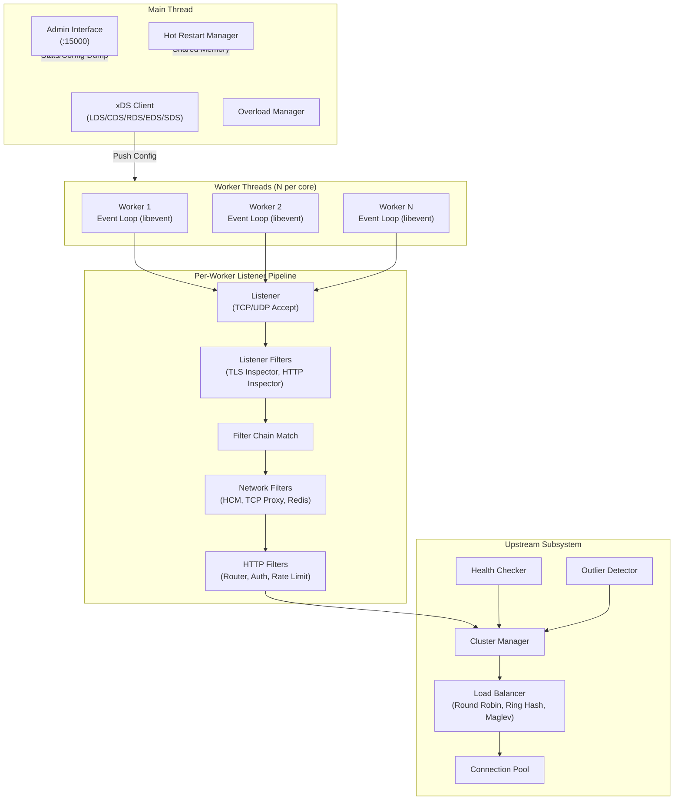
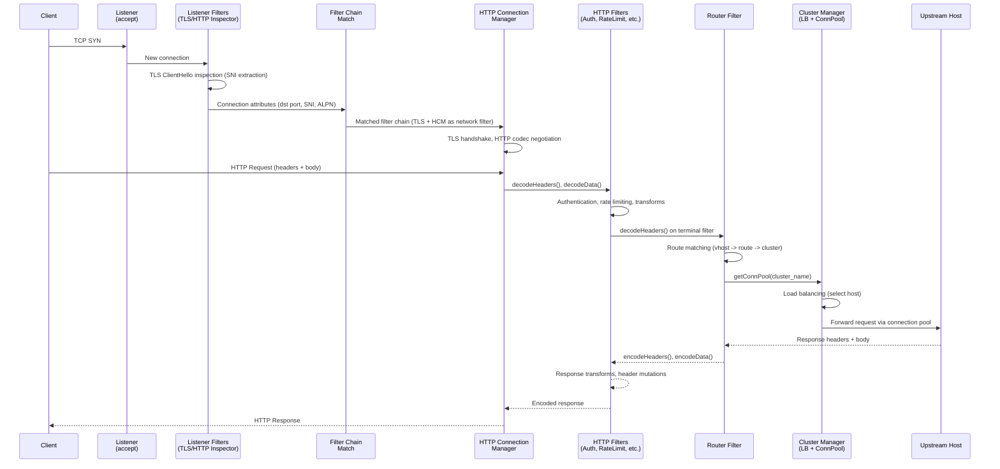
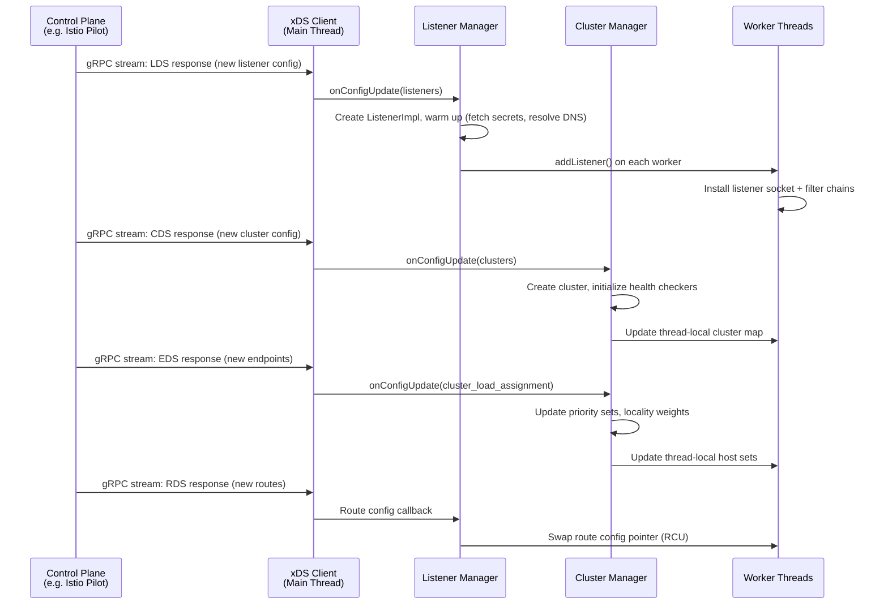
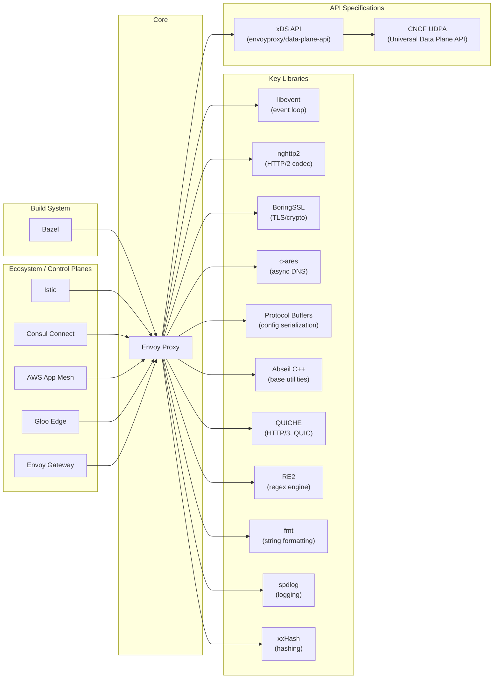

# Envoy

> Cloud-native high-performance edge/middle/service proxy

| Metadata | |
|---|---|
| Repository | https://github.com/envoyproxy/envoy |
| License | Apache License 2.0 |
| Primary Language | C++ |
| Analyzed Release | `v1.37.0` (2026-01-13) |
| Stars (approx.) | 27,473 |
| Generated by | Claude Opus 4.6 (Anthropic) |
| Generated on | 2026-02-08 |

## Overview

Envoy is an L3/L4 network proxy and L7 HTTP proxy designed for large modern service-oriented architectures. Originally built at Lyft and now a CNCF graduated project, it serves as a universal data plane for service mesh, API gateway, and edge proxy use cases. Envoy is written in C++ for maximum performance and provides a rich set of features including advanced load balancing, observability, dynamic configuration via xDS APIs, and a pluggable filter architecture.

Problems it solves:

- Network transparency: applications should not need to know about the network topology. Envoy abstracts the network away so developers can focus on business logic rather than dealing with distributed systems networking concerns.
- Observability gap: in microservice architectures, understanding service-to-service communication, latency distributions, and failure modes is extremely difficult without a dedicated proxy layer that provides consistent metrics, tracing, and logging.
- Configuration agility: traditional proxies require restarts for configuration changes. Envoy supports fully dynamic configuration through xDS APIs, enabling zero-downtime updates to listeners, routes, clusters, and endpoints.
- Protocol heterogeneity: modern architectures use a mix of HTTP/1.1, HTTP/2, HTTP/3 (QUIC), gRPC, and raw TCP. Envoy provides a unified proxy layer that handles all of these protocols with consistent observability and policy enforcement.

Positioning:

Envoy competes with NGINX, HAProxy, and Traefik as a reverse proxy and load balancer. However, its primary differentiation lies in its programmable data plane design, first-class xDS API support, and its role as the de facto data plane for service meshes (Istio, Consul Connect, AWS App Mesh). Unlike NGINX and HAProxy which were designed primarily as edge proxies, Envoy was purpose-built for the service mesh sidecar pattern. Its extension model via C++ filters, Lua, Wasm, and gRPC external processing makes it far more programmable than traditional proxies.

## Architecture Overview

Envoy employs a multi-threaded, event-driven architecture built on top of libevent. A single Envoy process consists of a main thread (responsible for configuration management, xDS, admin, and process lifecycle) and multiple worker threads (each running an independent event loop that handles the full lifecycle of connections assigned to it). This "shared nothing" worker design enables nearly lock-free request processing, making the hot path embarrassingly parallel.

## Core Components

### Server Instance (`source/server/`)

- Responsibility: Process initialization, lifecycle management, main thread coordination, and administrative interface
- Key files: `source/server/instance_impl.cc`, `source/server/server.cc`, `source/server/worker_impl.cc`, `source/server/configuration_impl.cc`
- Design patterns: Singleton (server instance), Observer (lifecycle notifications), Template Method (server initialization sequence)

The server instance (`InstanceImpl` in `source/server/instance_impl.cc`) is the top-level object that bootstraps the entire Envoy process. It reads the bootstrap configuration (either from a static YAML/JSON file or from a configuration provider), initializes the main thread dispatcher, sets up the admin interface, creates worker threads, and orchestrates the server lifecycle including startup, draining, and shutdown. The `WorkerImpl` class in `source/server/worker_impl.cc` wraps each worker thread, each containing its own `DispatcherImpl` event loop. The server also manages the overload manager (`source/server/overload_manager_impl.cc`) which monitors resource pressure (heap size, file descriptors, connections) and applies back-pressure actions like disabling new connections or stopping accept.

### Listener Manager (`source/common/listener_manager/`)

- Responsibility: Managing the lifecycle of listeners, including creation, update, warm-up, draining, and removal. Also responsible for filter chain matching.
- Key files: `source/common/listener_manager/listener_manager_impl.cc`, `source/common/listener_manager/listener_impl.cc`, `source/common/listener_manager/filter_chain_manager_impl.cc`, `source/common/listener_manager/active_tcp_listener.cc`, `source/common/listener_manager/lds_api.cc`
- Design patterns: Factory Method (listener and filter chain creation), Strategy (filter chain matching), Observer (LDS updates)

The `ListenerManagerImpl` handles all listener-related operations. When a new listener configuration arrives (via static config or LDS), the manager creates a `ListenerImpl` object, warms it up (resolving DNS, fetching secrets), and then adds it to the active listeners on each worker thread. The `FilterChainManagerImpl` implements an efficient trie-based data structure for matching incoming connections to the correct filter chain based on attributes like destination port, server name (SNI), transport protocol, and application protocols (ALPN). The `ActiveTcpListener` in each worker thread accepts new connections and dispatches them through listener filters and then into the matched network filter chain. The `LdsApi` class (`source/common/listener_manager/lds_api.cc`) handles Listener Discovery Service subscriptions for dynamic listener configuration.

### HTTP Connection Manager (`source/common/http/`, `source/extensions/filters/network/http_connection_manager/`)

- Responsibility: L7 HTTP processing including codec management (HTTP/1.1, HTTP/2, HTTP/3), stream multiplexing, header processing, and HTTP filter chain orchestration
- Key files: `source/common/http/conn_manager_impl.cc`, `source/common/http/filter_manager.cc`, `source/common/http/codec_client.cc`, `source/extensions/filters/network/http_connection_manager/config.cc`
- Design patterns: Chain of Responsibility (HTTP filter chain), Strategy (codec selection), Proxy (stream abstraction over different HTTP versions)

The HTTP Connection Manager (HCM) is implemented as a network filter and is the central component for L7 traffic processing. `ConnectionManagerImpl` in `source/common/http/conn_manager_impl.cc` manages the lifecycle of HTTP streams on a connection. For each new stream, it creates a `FilterManager` (`source/common/http/filter_manager.cc`) that orchestrates the HTTP filter chain. The filter chain is organized into decoder filters (processing the request path), encoder filters (processing the response path), and access log handlers. Each filter can stop iteration (for async operations like calling an external auth service), continue, or short-circuit the chain with a local reply. The HCM transparently handles protocol differences between HTTP/1.1, HTTP/2, and HTTP/3 through codec abstractions, so HTTP filters operate on a unified stream interface regardless of the wire protocol.

### Router Filter (`source/common/router/`, `source/extensions/filters/http/router/`)

- Responsibility: Terminal HTTP filter responsible for route matching, upstream request forwarding, retries, hedging, and timeout management
- Key files: `source/common/router/config_impl.cc`, `source/common/router/router.cc` (via extensions), `source/common/router/retry_state_impl.cc`, `source/common/router/rds_impl.cc`
- Design patterns: Strategy (route matching, retry policies), Chain of Responsibility (virtual host / route / weighted cluster matching), Observer (RDS updates)

The Router is the terminal HTTP filter in nearly every Envoy filter chain. Route resolution happens through a hierarchy: virtual host matching (based on the Host/Authority header), route matching (based on path, headers, query parameters), and weighted cluster selection. The `RouteConfigImpl` in `source/common/router/config_impl.cc` builds an efficient lookup structure from the route configuration. The `RdsRouteConfigProviderImpl` in `source/common/router/rds_impl.cc` manages Route Discovery Service subscriptions for dynamic route configuration. Once a route is matched, the router selects an upstream cluster, obtains a connection from the connection pool via the Cluster Manager, and forwards the request. It handles retries (with configurable back-off, retry budgets, and retriable status codes), request hedging, timeouts (per-try and global), and request mirroring (shadowing).

### Cluster Manager and Upstream Subsystem (`source/common/upstream/`)

- Responsibility: Managing upstream clusters, endpoints, load balancing, health checking, outlier detection, and connection pooling
- Key files: `source/common/upstream/cluster_manager_impl.cc`, `source/common/upstream/health_checker_impl.cc`, `source/common/upstream/outlier_detection_impl.cc`, `source/common/upstream/cds_api_impl.cc`, `source/extensions/load_balancing_policies/`
- Design patterns: Factory Method (cluster creation), Strategy (load balancing algorithms), Observer (CDS/EDS updates, health state changes), Object Pool (connection pooling)

The `ClusterManagerImpl` (`source/common/upstream/cluster_manager_impl.cc`) is the central registry for all upstream clusters. It manages cluster lifecycle (add, update, remove via CDS), endpoint updates (via EDS), and provides a thread-local cluster handle for each worker thread so that load balancing and connection pooling are lock-free on the hot path. Each cluster has a pluggable load balancer (implementations in `source/extensions/load_balancing_policies/` include Round Robin, Least Request, Ring Hash, Maglev, and Random), active health checking (`source/common/upstream/health_checker_impl.cc` supporting HTTP, TCP, and gRPC health checks), and outlier detection (`source/common/upstream/outlier_detection_impl.cc` which ejects hosts based on consecutive errors, success rate, or failure percentage). Connection pools are maintained per-cluster, per-upstream-protocol, per-worker-thread, supporting HTTP/1.1, HTTP/2, and HTTP/3 with automatic protocol negotiation.

### Event System and Threading (`source/common/event/`)

- Responsibility: Providing the event-driven I/O foundation, including the event loop, timer management, file event handling, and deferred task execution
- Key files: `source/common/event/dispatcher_impl.cc`, `source/common/event/libevent_scheduler.cc`, `source/common/event/libevent.cc`, `source/common/event/timer_impl.cc`
- Design patterns: Reactor (event loop), Wrapper/Adapter (libevent abstraction), Scheduler (timer and deferred callbacks)

The `DispatcherImpl` (`source/common/event/dispatcher_impl.cc`) is the core event loop abstraction that wraps libevent. Every worker thread and the main thread each have their own Dispatcher instance. The Dispatcher provides APIs for creating connections, listeners, timers, file events, and posting callbacks between threads (the only cross-thread synchronization mechanism). The `LibeventScheduler` (`source/common/event/libevent_scheduler.cc`) provides the scheduling primitives, and `source/common/event/libevent.cc` contains the low-level libevent wrappers. Timer management is critical for implementing connection timeouts, retry back-offs, health check intervals, and drain timers. The scaled range timer manager (`source/common/event/scaled_range_timer_manager_impl.cc`) allows the overload manager to uniformly scale all timers to apply back-pressure under resource constraints.

### Hot Restart (`source/server/hot_restart*`)

- Responsibility: Enabling binary upgrades and configuration reloads with zero dropped connections
- Key files: `source/server/hot_restart_impl.cc`, `source/server/hot_restarting_parent.cc`, `source/server/hot_restarting_child.cc`, `source/server/drain_manager_impl.cc`
- Design patterns: Shared Memory (statistics and state transfer), Parent-Child Process (coordinated handoff), Gradual Drain (progressive connection migration)

Envoy's hot restart mechanism allows a new Envoy process (child) to start up while the old process (parent) is still running, with a coordinated handoff that avoids dropping connections. The parent and child communicate over a Unix domain socket using the protocol defined in `source/server/hot_restart.proto`. Shared memory regions (keyed by a base ID and epoch) store statistics counters so that stat values are continuous across restarts. The `DrainManagerImpl` (`source/server/drain_manager_impl.cc`) implements gradual connection draining: over the configurable drain period (default 600 seconds), the drain percentage linearly increases to 100%, sending HTTP/1.1 `Connection: close` headers and HTTP/2 GOAWAY frames to gracefully terminate connections.

## Data Flow

### HTTP Request Processing Lifecycle

### xDS Dynamic Configuration Update Flow

## Key Design Decisions

### 1. Single-Process Multi-Threaded with Shared-Nothing Workers

- Choice: Each worker thread runs its own event loop with its own connections, connection pools, and thread-local copies of configuration. The only cross-thread communication is posting callbacks to another thread's event loop.
- Rationale: This design eliminates locks on the hot path (request processing) and makes each worker essentially single-threaded, vastly simplifying reasoning about concurrency. The kernel's SO_REUSEPORT distributes connections across workers.
- Trade-offs: Memory usage scales linearly with the number of workers (each maintains its own connection pools and config copies). Configuration updates require TLS (Thread Local Storage) slot updates across all workers. Some imbalance in connection distribution can occur since the kernel's balancing is best-effort.

### 2. Pluggable Filter Chain Architecture

- Choice: All protocol processing is implemented as composable filters organized in chains: listener filters, network filters, and HTTP filters. Even the core HTTP router is implemented as an HTTP filter (`source/extensions/filters/http/router/`).
- Rationale: This provides extreme extensibility without modifying core code. Users can add custom authentication, rate limiting, observability, or protocol transformation by inserting filters. The chain pattern allows filters to be independently developed, tested, and composed.
- Trade-offs: Each additional filter adds latency to the request path (though typically very small). Complex filter interactions and ordering dependencies can be difficult to debug. The filter API surface is large and must maintain backward compatibility.

### 3. xDS APIs for Fully Dynamic Configuration

- Choice: Envoy defines a suite of discovery service APIs (LDS, RDS, CDS, EDS, SDS, VHDS, SRDS, ECDS) that allow an external control plane to push configuration updates without requiring restarts. The protocol supports both state-of-the-world and incremental (delta) delivery.
- Rationale: In dynamic environments like Kubernetes, service endpoints change constantly. Static configuration files with reload signals are insufficient. xDS enables a clean separation between the data plane (Envoy) and the control plane (Istio, custom management systems), and supports eventual consistency semantics appropriate for distributed systems.
- Trade-offs: The xDS protocol is complex to implement correctly, both on the Envoy side and on the control plane side. Eventual consistency means there are windows where Envoy's configuration may be stale. The dependency on a control plane adds an operational component, though Envoy is resilient to control plane failures (it continues operating with the last known good configuration).

### 4. Hot Restart via Shared Memory and Drain

- Choice: Binary upgrades are handled by starting a new Envoy process alongside the old one, sharing statistics via shared memory, transferring listen sockets over a Unix domain socket, and gradually draining connections from the old process.
- Rationale: For infrastructure as critical as a proxy, any downtime is unacceptable. Hot restart allows upgrading Envoy binaries without dropping a single connection, which is essential for long-lived connections (WebSockets, gRPC streams) and high-availability deployments.
- Trade-offs: The shared memory mechanism adds complexity and requires careful coordination between process epochs. The drain period adds time to the rollout process. Running two processes simultaneously temporarily doubles resource consumption. The shared memory region for stats has a fixed layout that must be compatible across versions.

### 5. libevent-based Event Loop with Codec Abstraction

- Choice: Envoy uses libevent as the underlying event notification library and wraps it in a `Dispatcher` abstraction. HTTP protocol handling is abstracted behind a codec interface, with http-parser (HTTP/1.1), nghttp2 (HTTP/2), and QUICHE (HTTP/3) as interchangeable codec implementations.
- Rationale: libevent provides a mature, battle-tested, and portable event loop that works across Linux (epoll), macOS (kqueue), and other platforms. The codec abstraction allows HTTP filters to be protocol-agnostic, processing unified stream objects regardless of the underlying wire format.
- Trade-offs: libevent introduces an additional abstraction layer compared to using epoll/kqueue directly (though the overhead is minimal). The codec abstraction means some protocol-specific optimizations (like HTTP/2 priority signaling) must be carefully plumbed through the generic interface. Supporting three HTTP versions with a single filter chain increases codec complexity.

## Dependencies

## Testing Strategy

Envoy has one of the most comprehensive testing strategies in the open-source infrastructure ecosystem, with testing deeply integrated into the development process via Bazel.

Unit tests: Each component has co-located unit tests under the `test/` directory mirroring the `source/` structure. For example, `test/common/http/` contains unit tests for `source/common/http/`. Envoy uses Google Test as its testing framework and maintains extensive mock objects (`test/mocks/`) for isolating components. Unit tests are run via `bazel test //test/common/...` and similar targets. Coverage requirements are enforced per-file via `test/per_file_coverage.sh` and `test/coverage.yaml`.

Integration tests: End-to-end integration tests in `test/integration/` spin up real Envoy instances with configured listeners, clusters, and filters, then send actual traffic through them. These tests verify the full request processing pipeline and are critical for catching issues that unit tests cannot (filter ordering bugs, protocol interop, connection lifecycle issues).

Fuzz tests: Envoy has extensive fuzz testing infrastructure in `test/fuzz/`. Fuzz tests are written using the `DEFINE_FUZZER` interface and built with `envoy_cc_fuzz_test` Bazel macros. They support both corpus-based regression testing (under `bazel test`) and active fuzzing with libFuzzer and AddressSanitizer (under `bazel run --config asan-fuzzer`). Integration with `libprotobuf-mutator` enables structured fuzzing of protobuf-based inputs, which is particularly valuable given Envoy's extensive protobuf configuration surface.

CI/CD: Envoy uses Azure Pipelines and GitHub Actions for CI. The CI pipeline includes multiple configurations: compile (GCC and Clang), ASAN (AddressSanitizer), TSAN (ThreadSanitizer), MSAN (MemorySanitizer), coverage reporting, format/lint checking, documentation builds, and fuzz test execution. All CI runs use Bazel with remote build caching for performance. PRs require passing all CI checks before merge.

## Key Takeaways

1. Shared-nothing threading for high-performance proxies: Envoy's worker thread model demonstrates that shared-nothing architectures can dramatically simplify concurrent systems. By giving each worker its own event loop, connection pools, and thread-local config copies, the hot path is effectively single-threaded. Cross-thread coordination is limited to posting lambdas to other threads' event loops. This pattern is applicable to any system where request processing must be extremely fast and predictable, and is superior to shared-state-with-locks approaches for proxy workloads.

2. Filter chain as the universal extension point: By making everything a filter including core functionality like the router, Envoy creates a uniform and powerful extension model. This architectural choice means that there is no privileged "core" HTTP processing that extensions cannot intercept or modify. New protocols, authentication schemes, observability features, or traffic policies can all be added as filters without touching core code. This pattern is applicable to any system that needs to support a wide variety of use cases: define a small, stable filter interface, make the core functionality a filter itself, and let users compose behavior through configuration.

3. Separation of data plane and control plane via stable APIs: The xDS API contract between Envoy (data plane) and management systems (control plane) is one of the most impactful architectural decisions in the service mesh ecosystem. By defining a well-specified API for discovering listeners, routes, clusters, endpoints, and secrets, Envoy enabled an entire ecosystem of control planes (Istio, Consul, AWS App Mesh) without coupling to any of them. This API-first approach to infrastructure extensibility is a pattern applicable to any system that needs to be managed by multiple orchestration layers: define the management API as a first-class concern, not an afterthought.

4. Graceful lifecycle management through hot restart and drain: Envoy's hot restart mechanism (shared memory for stats, socket transfer via Unix domain sockets, gradual drain over configurable periods) demonstrates how critical infrastructure can be upgraded without downtime. The gradual drain approach, linearly increasing the drain percentage over the drain period, is particularly elegant as it avoids connection storms. Any long-running infrastructure component (databases, message brokers, load balancers) can benefit from this pattern of cooperative handoff between old and new process instances.

## References

- [Envoy Official Documentation](https://www.envoyproxy.io/docs/envoy/latest/)
- [Envoy Architecture Overview](https://www.envoyproxy.io/docs/envoy/latest/intro/arch_overview/arch_overview)
- [Life of a Request](https://www.envoyproxy.io/docs/envoy/latest/intro/life_of_a_request)
- [Envoy Threading Model](https://www.envoyproxy.io/docs/envoy/latest/intro/arch_overview/intro/threading_model)
- [xDS Configuration API Overview](https://www.envoyproxy.io/docs/envoy/latest/intro/arch_overview/operations/dynamic_configuration)
- [xDS REST and gRPC Protocol](https://www.envoyproxy.io/docs/envoy/latest/api-docs/xds_protocol)
- [Envoy External Dependencies](https://www.envoyproxy.io/docs/envoy/latest/intro/arch_overview/security/external_deps)
- [DeepWiki: envoyproxy/envoy](https://deepwiki.com/envoyproxy/envoy)
- [Anatomy of Envoy Proxy (Songrgg)](https://songrgg.github.io/architecture/deeper-understanding-to-envoy/)
- [Inside Envoy - Istio and Envoy Insider](https://istio-insider.mygraphql.com/en/latest/ch2-envoy/index.html)
- [What Is Envoy Proxy - Solo.io](https://www.solo.io/topics/omni/envoy-proxy)
