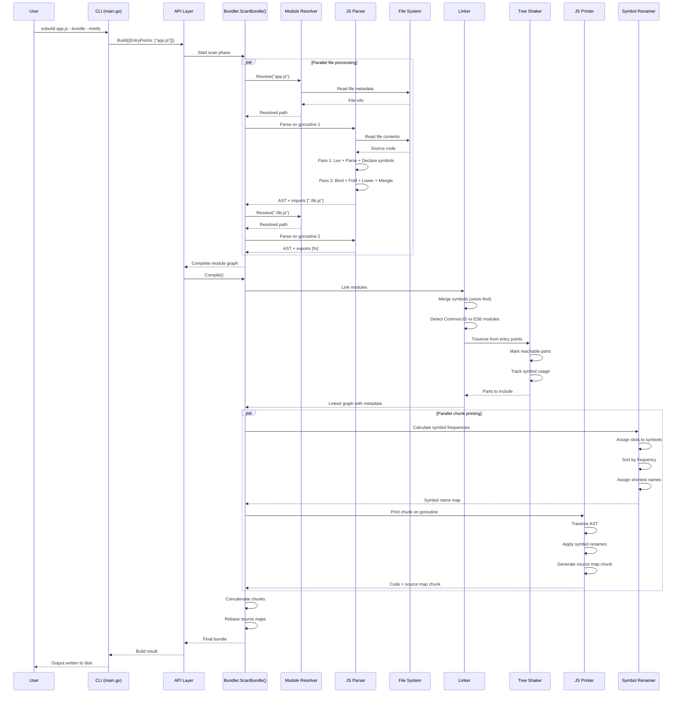
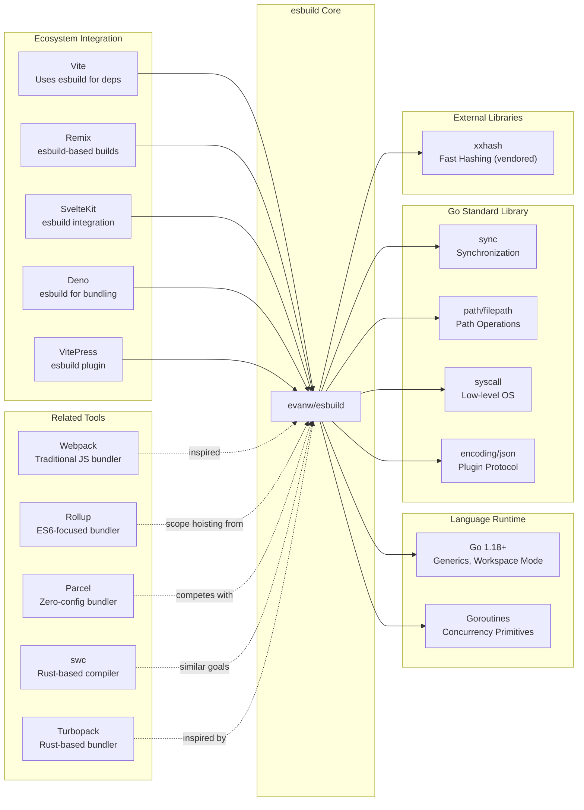

# esbuild

> An extremely fast JavaScript and CSS bundler written in Go

| Metadata | |
|---|---|
| Repository | https://github.com/evanw/esbuild |
| License | MIT |
| Primary Language | Go |
| Category | Build Tool |
| Analyzed Release | `v0.27.3` (2026-02-05) |
| Stars (approx.) | 39,687 |
| Generated by | Claude Opus 4.6 (Anthropic) |
| Generated on | 2026-02-08 |

## Overview

esbuild is an extremely fast JavaScript and CSS bundler developed by Evan Wallace. Its primary goal is to bring about a new era of build tool performance, achieving 10-100x faster bundling than existing JavaScript-based tools through native code compilation and aggressive parallelization.

Problems it solves:

- Slow build times in modern web development workflows caused by JavaScript-based bundlers
- Need for complex toolchain configuration across multiple tools for transpilation, bundling, and minification
- Poor utilization of multi-core processors in existing bundlers
- Lack of built-in TypeScript and JSX support requiring separate compilation steps

Positioning:

esbuild has become a foundational tool in the modern web ecosystem, used directly by developers and integrated into higher-level frameworks like Vite, Remix, and SvelteKit. It demonstrates that build tools can be orders of magnitude faster than previously accepted standards, influencing the development of other next-generation tools like swc and Turbopack.

## Architecture Overview

esbuild employs a highly parallelized two-phase pipeline architecture: scan and compile. The scan phase constructs the module graph through parallel parsing and dependency resolution, while the compile phase performs linking, tree shaking, code generation, and concatenation. The entire system is designed around maximizing CPU core utilization and minimizing full-AST traversals.

```mermaid
graph TB
    subgraph CLI["CLI Layer (cmd/esbuild)"]
        Main["main.go<br/>Entry Point"]
        StdioProtocol["stdio_protocol.go<br/>JSON Protocol Handler"]
        Service["service.go<br/>Long-running Service"]
    end

    subgraph API["API Layer (pkg/api)"]
        GoAPI["api.go<br/>Go API"]
        JSTable["api_js_table.go<br/>JS/Go Bridge"]
        Watcher["watcher.go<br/>Watch Mode"]
        Serve["serve_*.go<br/>Dev Server"]
    end

    subgraph Bundler["Bundler Core (internal/bundler)"]
        BundlerMain["bundler.go<br/>Main Orchestrator"]
        ScanPhase["ScanBundle()<br/>Parallel Worklist"]
        CompilePhase["Compile()<br/>Linking & Codegen"]
    end

    subgraph Parser["Parser Layer"]
        JSParser["js_parser/js_parser.go<br/>JavaScript Parser"]
        TSParser["js_parser/ts_parser.go<br/>TypeScript Extension"]
        CSSParser["css_parser/css_parser.go<br/>CSS Parser"]
        JSLexer["js_lexer/js_lexer.go<br/>On-demand Lexer"]
        CSSLexer["css_lexer/css_lexer.go<br/>CSS Lexer"]
    end

    subgraph AST["AST Representation"]
        JSAST["js_ast/js_ast.go<br/>JavaScript AST"]
        CSSAST["css_ast/css_ast.go<br/>CSS AST"]
        Symbols["Symbols & Scopes"]
    end

    subgraph Resolver["Resolution (internal/resolver)"]
        ResolverMain["resolver.go<br/>Module Resolution"]
        PackageJSON["package_json.go<br/>package.json Parser"]
        TSConfig["tsconfig_json.go<br/>tsconfig.json Parser"]
        YarnPnP["yarnpnp.go<br/>Yarn PnP Support"]
    end

    subgraph Linker["Linker (internal/linker)"]
        LinkerMain["linker.go<br/>Symbol Merging"]
        TreeShaking["Tree Shaking"]
        CodeSplitting["Code Splitting"]
        ScopeHoisting["Scope Hoisting"]
    end

    subgraph Printer["Printer Layer"]
        JSPrinter["js_printer/js_printer.go<br/>JS Code Generation"]
        CSSPrinter["css_printer/css_printer.go<br/>CSS Code Generation"]
        SourceMap["sourcemap/sourcemap.go<br/>Source Map Generation"]
        Renamer["renamer/renamer.go<br/>Symbol Minification"]
    end

    subgraph Support["Support Systems"]
        FS["fs/fs.go<br/>File System Abstraction"]
        Cache["cache/cache.go<br/>Incremental Build Cache"]
        Logger["logger/logger.go<br/>Error Reporting"]
        Runtime["runtime/runtime.go<br/>Runtime Library"]
        Graph["graph/graph.go<br/>Module Graph"]
    end

    Main --> GoAPI
    StdioProtocol --> GoAPI
    Service --> GoAPI
    GoAPI --> BundlerMain
    JSTable --> GoAPI
    Watcher --> GoAPI
    Serve --> GoAPI

    BundlerMain --> ScanPhase
    BundlerMain --> CompilePhase

    ScanPhase --> ResolverMain
    ScanPhase --> JSParser
    ScanPhase --> CSSParser

    JSParser --> JSLexer
    JSParser --> TSParser
    CSSParser --> CSSLexer

    JSParser --> JSAST
    CSSParser --> CSSAST
    JSAST --> Symbols

    ResolverMain --> PackageJSON
    ResolverMain --> TSConfig
    ResolverMain --> YarnPnP
    ResolverMain --> FS

    CompilePhase --> LinkerMain
    LinkerMain --> TreeShaking
    LinkerMain --> CodeSplitting
    LinkerMain --> ScopeHoisting

    CompilePhase --> JSPrinter
    CompilePhase --> CSSPrinter
    JSPrinter --> Renamer
    JSPrinter --> SourceMap
    CSSPrinter --> SourceMap

    BundlerMain --> Cache
    BundlerMain --> Logger
    BundlerMain --> Graph
    LinkerMain --> Runtime

    Parser --> FS
    Linker --> Graph
```

## Core Components

### Bundler Orchestrator (`internal/bundler/bundler.go`)

- Responsibility: Coordinates the entire build pipeline from entry points to final output
- Key files: `internal/bundler/bundler.go`
- Design patterns: Two-phase pipeline, parallel worklist algorithm

The bundler contains two critical functions: `ScanBundle()` and `Compile()`. `ScanBundle()` implements a parallel worklist algorithm starting from entry points, parsing files on separate goroutines and discovering dependencies. Each parsed file may add imports to the worklist, continuing until exhaustion. `Compile()` takes the complete module graph and performs linking, tree shaking, code splitting, and code generation. The design maximizes parallelism while maintaining correctness through careful management of shared state.

### JavaScript Parser (`internal/js_parser/js_parser.go`)

- Responsibility: Parse JavaScript and TypeScript into AST with minimal passes for performance
- Key files: `internal/js_parser/js_parser.go`, `internal/js_parser/ts_parser.go`, `internal/js_parser/js_parser_lower.go`
- Design patterns: Two-pass parsing, on-demand lexing, scope tree mapping

The parser performs only two full-AST passes rather than the typical multi-pass approach. Pass 1 performs lexing, parsing, scope setup, and symbol declaration in a single traversal. Pass 2 performs symbol binding, constant folding, syntax lowering for target compatibility, and syntax mangling for minification. The lexer is called on-the-fly during parsing rather than pre-tokenizing, which is necessary due to context-sensitive tokens like regex vs division operators. TypeScript support is implemented by augmenting the JavaScript parser, skipping type annotations while handling enums, namespaces, and TypeScript-specific class features.

### Module Resolver (`internal/resolver/resolver.go`)

- Responsibility: Resolve import paths to actual file locations with extensive ecosystem compatibility
- Key files: `internal/resolver/resolver.go`, `internal/resolver/package_json.go`, `internal/resolver/tsconfig_json.go`
- Design patterns: Caching strategy, algorithm optimization for syscall reduction

The resolver handles complex module resolution including Node.js algorithm, TypeScript path mapping, package.json exports/imports fields, and Yarn PnP. Syscall caching is critical for performance, as syscall overhead is extremely high. Results are aggressively cached in both the resolver and file system layers. The resolver must handle browser vs Node.js conditions, main fields priority, extension probing, and directory index resolution while maintaining correctness and speed.

### Linker (`internal/linker/linker.go`)

- Responsibility: Merge modules into bundles, eliminate dead code, and enable scope hoisting
- Key files: `internal/linker/linker.go`
- Design patterns: Symbol merging via union-find, graph traversal for tree shaking, connected components for code splitting

The linker implements scope hoisting by merging symbols across files. Each symbol has a `Link` field enabling union-find-style symbol merging where imported symbols link to their exported counterparts. The tree shaking algorithm treats top-level statements as graph nodes ("parts") with edges representing symbol references and file dependencies. Graph traversal from entry points marks reachable parts for inclusion. Code splitting extends tree shaking by tracking which entry points reach each part, grouping parts by entry point sets to create optimal chunks. Cross-chunk variable assignments are prevented by linking related parts together.

### Printer (`internal/js_printer/js_printer.go`)

- Responsibility: Convert ASTs back to JavaScript with minification and source map generation
- Key files: `internal/js_printer/js_printer.go`, `internal/css_printer/css_printer.go`, `internal/sourcemap/sourcemap.go`
- Design patterns: Parallel printing, source map chunking, slot-based symbol renaming

Each file is printed independently enabling full parallelization. Source maps are generated as "chunks" during printing, then rebased when concatenated. Symbol minification uses a sophisticated slot-based frequency analysis algorithm. Symbols in nested scopes are assigned slots (array indices) that share frequency counters across sibling scopes. This allows function parameters in sibling functions to use identical names like `(a, b, c)`, improving gzip compression. Names are assigned from shortest to longest based on frequency, avoiding keywords and unbound symbols.

### Runtime Library (`internal/runtime/runtime.go`)

- Responsibility: Provide helper functions for module system emulation and language features
- Key files: `internal/runtime/runtime.go`
- Design patterns: String-embedded library, automatic tree shaking

The runtime library is embedded as a single string containing all helper functions like `__commonJS()` for CommonJS module wrapping, `__export()` for ES6 exports, `__toESM()` for CommonJS-to-ESM conversion, and `__decorate()` for TypeScript decorators. The library is automatically included in every build and tree shaking removes unused helpers. This design provides zero-overhead abstractions where only used features incur code size costs.

### File System Abstraction (`internal/fs/fs.go`)

- Responsibility: Abstract file system operations with caching and virtual file system support
- Key files: `internal/fs/fs.go`, `internal/fs/fs_real.go`, `internal/fs/fs_mock.go`
- Design patterns: Interface abstraction, aggressive caching, platform-specific implementations

The file system layer provides platform-agnostic file operations while maintaining maximum performance. Multiple implementations exist: `fs_real.go` for actual file systems, `fs_mock.go` for testing, and `fs_zip.go` for Yarn PnP zip archives. Syscall results are heavily cached since file system overhead dominates parsing in many scenarios. The abstraction enables watch mode to track file modifications and incremental builds to reuse unchanged file results.

## Data Flow

### JavaScript Bundle Build Flow

## Key Design Decisions

### 1. Go Implementation with Native Compilation

- Choice: Write esbuild in Go and compile to native code rather than using JavaScript
- Rationale: Go provides true parallelism with shared memory between threads, whereas JavaScript requires serializing data between workers. Go's native compilation eliminates VM startup overhead and JIT warmup time. The language is designed for concurrent programming with goroutines and channels
- Trade-offs: Requires users to install a platform-specific binary rather than pure JavaScript. Plugin API requires communication between JavaScript and Go via message passing. More complex build and distribution process

### 2. Two-Pass Parsing Strategy

- Choice: Compress all parsing work into only two full-AST passes instead of separate passes for each concern
- Rationale: Modern CPUs are limited by memory bandwidth and cache locality. Fewer passes mean better cache utilization since the entire AST stays hot in cache. Each additional pass requires re-traversing the entire tree structure, reading nodes from memory
- Trade-offs: Code complexity increases as multiple concerns are handled in each pass. Harder to maintain and understand. Debugging is more difficult when multiple operations happen simultaneously. Adding new features requires careful integration into existing passes

### 3. Parallel Worklist for Dependency Scanning

- Choice: Use a parallel worklist algorithm where each file is parsed on a separate goroutine
- Rationale: Parsing is CPU-bound and embarrassingly parallel - files can be parsed independently. The worklist dynamically discovers dependencies, adding new files as imports are found. Saturating all CPU cores during the most expensive phase (parsing) provides maximum speedup
- Trade-offs: Requires careful synchronization around the shared worklist and module graph. Must avoid data races when multiple goroutines discover the same dependency. Error handling is more complex with concurrent operations

### 4. Symbol Merging via Union-Find for Scope Hoisting

- Choice: Implement scope hoisting through symbol linking where imported symbols link to exported symbols
- Rationale: Union-find enables efficient merging of symbols without restructuring the AST. The printer follows link chains to find final merged symbols. This allows immutable ASTs to be shared across incremental builds while maintaining symbol relationships in a separate mutable structure
- Trade-offs: Must always call `FollowSymbols()` when accessing symbols, adding overhead. Debugging symbol resolution is harder with multiple levels of indirection. Incorrect linking can cause subtle bugs in output code

### 5. Slot-Based Symbol Minification

- Choice: Use frequency-based slot assignment where sibling scopes reuse slots to share names
- Rationale: Assigning shortest names to most frequent symbols minimizes output size. Reusing names across sibling scopes (like function parameters) creates patterns that compress better with gzip. The slot system enables parallel frequency counting since slot assignments are static
- Trade-offs: Complex algorithm with multiple phases. Must track frequencies across the entire bundle before assigning names. Requires careful handling of three separate symbol namespaces (normal, labels, private). Global names and keywords must be avoided

### 6. Plugin API via Message Passing

- Choice: Plugins run in JavaScript and communicate with Go core via JSON message passing
- Rationale: Allows plugins to be written in JavaScript for ecosystem compatibility. Prevents plugins from directly accessing internal data structures, preserving performance. Limits plugin capabilities to only resolution and loading hooks, not AST manipulation
- Trade-offs: Message passing overhead for each plugin callback. Cannot modify AST directly, limiting plugin power. Some use cases cannot be implemented as plugins. Performance-critical plugins become bottlenecks

## Dependencies

## Testing Strategy

esbuild employs a comprehensive testing approach focused on snapshot testing, end-to-end validation, and performance benchmarking.

Unit tests: Each package contains extensive `_test.go` files. The parser, lexer, resolver, linker, and printer all have dedicated test suites. Tests use table-driven patterns common in Go for testing many cases efficiently.

Integration tests: `internal/bundler_tests/` contains end-to-end bundling tests organized by feature area (DCE, code splitting, loaders, TypeScript, etc.). These use snapshot testing where test inputs are bundled and outputs are compared against golden files in `internal/bundler_tests/snapshots/`. This approach makes it easy to review changes to output across hundreds of test cases.

Performance tests: The repository includes benchmark suites comparing esbuild against Webpack, Rollup, and Parcel on real-world projects. These are used to validate performance claims and prevent regressions.

CI/CD: GitHub Actions run tests on Linux, macOS, and Windows across multiple Go versions. The build process is minimal due to Go's integrated tooling. Releases are built for over 20 platform combinations including WebAssembly. The project uses semantic versioning and maintains extensive release notes documenting changes.

## Key Takeaways

1. Native code + parallelism unlocks order-of-magnitude improvements: By using compiled Go with aggressive parallelization, esbuild demonstrates that build tools were leaving 10-100x performance on the table. This inspired a wave of tools (swc, Turbopack, Oxc) to use systems languages, fundamentally resetting expectations for build tool speed.

2. Two-pass parsing balances complexity and performance: While traditional compilers use many passes for maintainability, carefully designed two-pass parsing achieves excellent cache locality. The first pass handles structure (lexing, parsing, scopes, declaration) and the second handles semantics (binding, folding, lowering, mangling). This pattern is applicable beyond JavaScript parsing.

3. Minimizing syscalls through caching is critical for I/O-bound workloads: esbuild's profiling revealed syscall overhead dominated parsing time. Aggressive caching of file system operations and module resolution results provided massive speedups. Any tool doing heavy file system operations should measure and cache syscall results.

4. Immutable data structures enable incremental builds: By keeping parsed ASTs immutable, esbuild can safely share results across incremental rebuilds. Mutable cross-file state (like symbol links) is kept separate. This pattern of immutable computation results plus mutable indexes is broadly applicable.

5. Slot-based symbol renaming enables parallel minification with compression-friendly output: The insight that sibling function parameters can share names for better gzip compression, combined with static slot assignment for parallelization, shows how understanding multiple layers (minification, compression, parallelism) can yield better algorithms.

6. Strategic limitation of plugin APIs preserves performance: Rather than exposing full AST access, esbuild limits plugins to resolution and loading hooks. This prevents plugins from forcing sequential processing and maintains performance. When building performance-critical tools, consider which extension points truly need exposure versus which can be restricted.

7. Message-passing plugin architecture enables language interoperability: By communicating via JSON messages rather than shared memory, esbuild allows JavaScript plugins to extend a Go core. This pattern works for any scenario where a performance-critical core needs an ecosystem-compatible extension mechanism.

## References

- [esbuild Official Documentation](https://esbuild.github.io/)
- [esbuild Architecture Documentation](https://github.com/evanw/esbuild/blob/main/docs/architecture.md)
- [esbuild FAQ](https://esbuild.github.io/faq/)
- [esbuild Plugins](https://esbuild.github.io/plugins/)
- [A Deep Dive into esbuild's Architecture and Speed](https://codedamn.com/news/javascript/a-deep-dive-into-esbuild-s-architecture-and-speed)
- [Architecture | evanw/esbuild | DeepWiki](https://deepwiki.com/evanw/esbuild/1.1-architecture)
- [Esbuild - A Fast JavaScript Bundler Written in Go](https://byby.dev/esbuild)
- [An introduction to esbuild plugins](https://nick-tomlin.com/posts/an-introduction-to-esbuild-plugins/)
