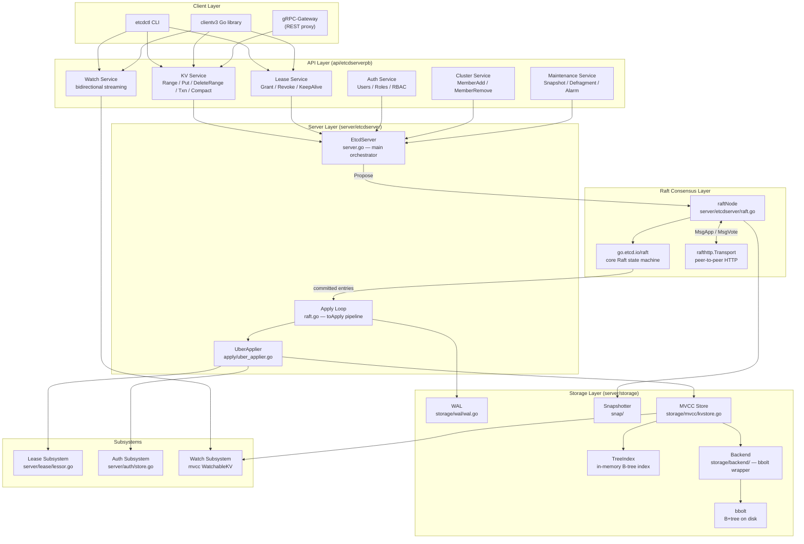
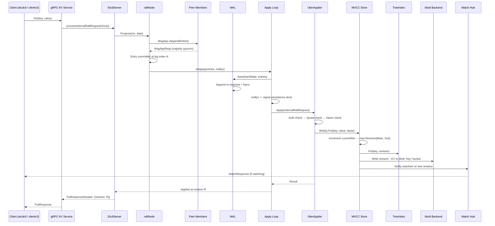
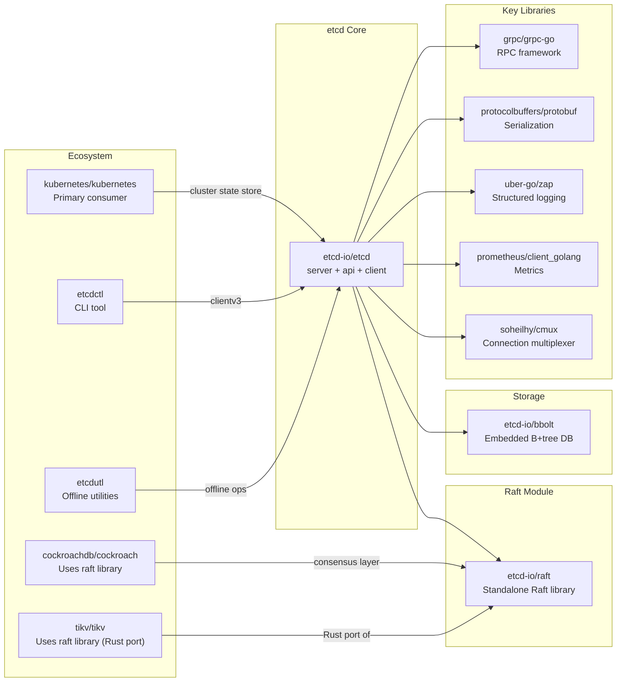

# etcd

> Distributed reliable key-value store for the most critical data of a distributed system

| Metadata | |
|---|---|
| Repository | https://github.com/etcd-io/etcd |
| License | Apache-2.0 |
| Primary Language | Go |
| Analyzed Release | `v3.6.7` (2025-12-17) |
| Stars (approx.) | 51,400+ |
| Generated by | Claude Opus 4.6 (Anthropic) |
| Generated on | 2026-02-08 |

## Overview

etcd is a distributed, strongly consistent key-value store developed originally at CoreOS (now maintained under the CNCF). It uses the Raft consensus algorithm to replicate data across a cluster of nodes, providing linearizable reads and serializable writes. A single etcd cluster typically consists of 3 or 5 members, communicating over gRPC for client requests and HTTP for peer-to-peer Raft traffic.

Problems it solves:

- Reliable storage of configuration data, service discovery metadata, and coordination primitives (locks, elections, leader leases) for distributed systems
- Strong consistency guarantees (linearizable reads via Raft quorum) required by orchestrators like Kubernetes for cluster state management
- Watch-based change notification enabling reactive architectures without polling, backed by an append-only multi-version store that preserves full history up to compaction

Positioning:

etcd is the backing store for Kubernetes, making it one of the most deployed distributed databases in the world. Compared to ZooKeeper (Java, ZAB protocol) and Consul (Go, Raft + Serf gossip), etcd focuses on simplicity: a flat key-value namespace, a single gRPC API, and a minimal binary with no external dependencies. It is a CNCF graduated project.

## Architecture Overview

etcd follows a strict layered architecture. Client requests enter through the gRPC API layer, pass through the EtcdServer orchestrator which proposes writes to the Raft consensus layer, and once committed, entries are applied to the MVCC storage engine backed by bbolt (a B+tree embedded database). A Write-Ahead Log (WAL) ensures durability before entries are committed.

## Core Components

### EtcdServer (`server/etcdserver/server.go`)

- Responsibility: Central orchestrator coordinating the API layer, Raft consensus, storage, and all subsystems
- Key files: `server/etcdserver/server.go`, `server/etcdserver/bootstrap.go`
- Design patterns: Mediator pattern, Event loop

EtcdServer is the heart of etcd. It receives proposals from the gRPC handlers (via `processInternalRaftRequestOnce`), forwards them to the Raft node, and runs the apply loop that takes committed entries and executes them against the MVCC store. It holds references to the Raft node, the MVCC store, the lease manager, the auth store, the alarm store, and the cluster membership manager.

The server manages lifecycle concerns including bootstrapping from WAL/snapshot on startup, periodic snapshots (every `DefaultSnapshotCount = 10000` entries), and compaction of old Raft log entries.

### Raft Consensus (`server/etcdserver/raft.go` + `go.etcd.io/raft`)

- Responsibility: Distributed consensus — ensuring all cluster members agree on the sequence of committed entries
- Key files: `server/etcdserver/raft.go`, external module `go.etcd.io/raft`
- Design patterns: State machine pattern, Minimalist library design

The Raft layer is split into two parts. The `go.etcd.io/raft` library is a standalone, minimal Raft implementation that intentionally excludes networking, storage, and serialization — it only implements the core algorithm (leader election, log replication, snapshotting, membership changes, pre-vote). This minimalism lets users (including etcd itself) plug in their own transport and storage.

The `raftNode` struct in `server/etcdserver/raft.go` wraps the library and connects it to etcd's infrastructure: `rafthttp.Transport` for peer messaging over HTTP, WAL for durable log persistence, and the `toApply` channel for feeding committed entries to the apply loop. The `toApply` struct bundles entries with a `notifyc` channel that synchronizes persistence with application.

### MVCC Store (`server/storage/mvcc/`)

- Responsibility: Multi-version key-value storage with revision tracking, range queries, and watch support
- Key files: `server/storage/mvcc/kvstore.go`, `server/storage/mvcc/kv.go`, `server/storage/mvcc/revision.go`, `server/storage/mvcc/index.go`, `server/storage/mvcc/key_index.go`
- Design patterns: MVCC (Multi-Version Concurrency Control), Append-only store, Interface segregation (ReadView / WriteView)

The MVCC store is the defining architectural feature of etcd v3. Every write creates a new revision (a monotonically increasing `{Main, Sub}` tuple encoded as 17 bytes). Keys are never overwritten in place — instead, each modification appends a new entry to bbolt keyed by the revision. Deletions are recorded as tombstone markers.

The `store` struct implements the `KV` interface by composing `ReadView` and `WriteView`. The in-memory `treeIndex` (a B-tree of `keyIndex` structs) maps user keys to their revision history, enabling efficient lookups at any historical revision. The `WatchableKV` interface extends `KV` with the `Watchable` interface, enabling the watch subsystem to subscribe to changes by revision.

Compaction reclaims space by removing revisions older than a specified point, updating both the in-memory index and bbolt.

### Write-Ahead Log (`server/storage/wal/`)

- Responsibility: Durable, ordered persistence of Raft entries before they are applied
- Key files: `server/storage/wal/wal.go`, `server/storage/wal/encoder.go`, `server/storage/wal/decoder.go`
- Design patterns: Append-only log, Segment-based file management

The WAL provides crash recovery guarantees. Every Raft entry, hard state change, and snapshot marker is appended to 64MB segment files before the entry is considered committed. The WAL uses CRC32-C checksums (Castagnoli) for integrity verification.

The WAL stores five record types: `MetadataType`, `EntryType`, `StateType`, `CrcType`, and `SnapshotType`. On recovery, etcd replays the WAL from the last snapshot marker to reconstruct the Raft state. A `file_pipeline.go` pre-allocates the next segment file in a background goroutine to avoid latency spikes during rotation.

### Backend (`server/storage/backend/`)

- Responsibility: Abstraction layer over bbolt, providing batched transactions and read-only snapshots
- Key files: `server/storage/backend/backend.go`, `server/storage/backend/batch_tx.go`, `server/storage/backend/read_tx.go`, `server/storage/backend/tx_buffer.go`
- Design patterns: Adapter pattern, Batched writes, Read-write separation

The backend wraps bbolt to provide etcd-specific optimizations. Write operations are accumulated in a `batchTx` that commits periodically rather than on every operation, significantly improving throughput. Read operations use `readTx` with a `txReadBuffer` that overlays uncommitted writes from the current batch, ensuring read-your-writes consistency.

bbolt itself uses a copy-on-write B+tree with a single writer and multiple concurrent readers, providing ACID guarantees without explicit locking for readers.

### UberApplier (`server/etcdserver/apply/`)

- Responsibility: Applying committed Raft entries to the MVCC store with auth, quota, and alarm enforcement
- Key files: `server/etcdserver/apply/uber_applier.go`, `server/etcdserver/apply/apply.go`, `server/etcdserver/apply/interface.go`
- Design patterns: Decorator / Chain of responsibility pattern

The UberApplier wraps the base `applierV3` with layers of concern: `authApplierV3` enforces RBAC permissions, `quotaApplierV3` checks backend size limits, and `applierV3Capped` blocks writes when the `NOSPACE` alarm is active. When alarms change, the decorator chain is rebuilt dynamically via `restoreAlarms()`. This layered design keeps the core apply logic clean while allowing cross-cutting concerns to be added or removed at runtime.

## Data Flow

### Key-Value Write (Put) Flow

## Key Design Decisions

### 1. Minimalist Raft Library

- Choice: Implement Raft as a standalone library (`go.etcd.io/raft`) that excludes networking, storage, and serialization — modeling it purely as a state machine that takes `Message` inputs and produces `{Messages, LogEntries, State}` outputs
- Rationale: Most Raft implementations are monolithic, coupling the algorithm with transport and disk I/O. By separating these concerns, the library becomes deterministic, testable, and reusable. Users like CockroachDB, TiKV, and Dgraph have adopted etcd's Raft library with their own transport layers
- Trade-offs: Users must implement transport, storage, and the integration loop themselves. The `Ready` channel pattern (polling for state changes) adds complexity compared to a callback-based API. However, this is offset by determinism and the ability to batch I/O operations

### 2. MVCC with Revision-based Append-only Storage

- Choice: Never overwrite keys in the storage backend. Instead, each write creates a new revision `{Main, Sub}` and appends a new entry to bbolt keyed by that revision. An in-memory B-tree (`treeIndex`) maps user keys to their revision history
- Rationale: This enables time-travel queries (read at any historical revision), efficient Watch implementation (stream changes since revision N), and transactional semantics (multiple keys modified atomically share the same `Main` revision). The append-only model also aligns naturally with the Raft log's append-only semantics
- Trade-offs: Storage grows unboundedly without compaction. Compaction is a background process that must coordinate with active readers. The in-memory `treeIndex` consumes RAM proportional to the number of unique keys times their generation count

### 3. bbolt as the Storage Engine

- Choice: Use bbolt (a fork of BoltDB), an embedded B+tree database with copy-on-write pages, single writer, and lock-free concurrent readers
- Rationale: bbolt provides ACID transactions, requires no external process, and has zero dependencies. Its single-writer model simplifies the storage layer since etcd already serializes writes through Raft. The copy-on-write page model means readers never block writers and always see a consistent snapshot
- Trade-offs: Write amplification from copy-on-write B+tree pages. The single-writer model limits write throughput on a single node (mitigated by batching in `batchTx`). Database file size can grow due to free page fragmentation, requiring periodic defragmentation. bbolt does not support concurrent writers, though this is acceptable since Raft serializes all writes

### 4. gRPC as the Client API

- Choice: Use gRPC with Protocol Buffers for all client-server communication, replacing the v2 REST/JSON API
- Rationale: Type-safe, language-neutral API with built-in streaming support (essential for Watch). gRPC's HTTP/2 multiplexing allows multiple concurrent requests over a single connection. Bidirectional streaming enables the Watch API to send and cancel watches on a single stream. A gRPC-Gateway provides backward-compatible REST endpoints
- Trade-offs: gRPC adds a dependency on the protobuf toolchain. Debugging is harder than with plain REST/JSON (requires `grpcurl` or similar tools). The proto definitions in `api/etcdserverpb/rpc.proto` are complex, defining six services (KV, Watch, Lease, Cluster, Maintenance, Auth) with numerous message types

### 5. WAL + Snapshot Recovery Model

- Choice: Persist the complete Raft state (entries, hard state, and snapshot markers) in an append-only WAL, combined with periodic full snapshots of the MVCC store
- Rationale: The WAL enables fast recovery by replaying only entries after the last snapshot. Unlike the canonical Raft model where the log only stores entries, etcd's WAL also records hard state and snapshot markers, making the WAL alone sufficient to recover the entire Raft state of a member. Pre-allocated 64MB segment files avoid filesystem allocation latency
- Trade-offs: Disk usage grows with write volume between snapshots (default: every 10,000 entries). Old WAL segments must be garbage collected. Snapshot creation pauses the apply loop briefly, though this is amortized over thousands of entries

## Dependencies

## Testing Strategy

etcd employs one of the most rigorous testing strategies in the Go ecosystem, reflecting its role as a critical infrastructure component.

Unit tests: Each package has comprehensive `_test.go` files. The MVCC layer tests revision encoding/decoding (`revision.go`), index operations, compaction correctness, and transaction isolation. The Raft library has its own extensive test suite since it is an independent module.

Integration tests: Located in `tests/integration/`, these spin up multi-member etcd clusters in-process to test client operations, leader election, member addition/removal, authentication, and lease behavior end-to-end.

End-to-end tests: Located in `tests/e2e/`, these launch actual etcd binaries and test via `etcdctl` commands, covering real gRPC transport, TLS, and process lifecycle.

Robustness tests: Located in `tests/robustness/`, these use techniques like fault injection, random kills, and traffic replay to verify linearizability under failure conditions. This is inspired by Jepsen-style testing and is run regularly in CI.

CI/CD: GitHub Actions runs unit, integration, e2e, and robustness tests. The project uses Semaphore CI for additional matrix testing across Go versions and platforms.

## Key Takeaways

1. Separate the consensus algorithm from infrastructure: etcd's Raft library models consensus as a pure state machine with message inputs and state outputs. By excluding networking, storage, and serialization, the library becomes deterministic, testable, and reusable across projects (CockroachDB, TiKV, Dgraph). This principle — isolating the core algorithm from I/O — is applicable to any distributed algorithm implementation.

2. Revision-based MVCC enables powerful primitives for free: By assigning a monotonically increasing revision to every mutation and never overwriting data, etcd gets time-travel queries, efficient change streaming (Watch), and transactional multi-key atomicity as natural consequences of the storage model. This pattern is broadly applicable: any system that needs audit trails, event sourcing, or change data capture benefits from an append-only revision-based design.

3. Decorator pattern for cross-cutting concerns in the apply path: The UberApplier wraps the core applier with auth, quota, and alarm decorators that can be dynamically reconfigured. This avoids polluting the core apply logic with conditional checks and makes it easy to add new enforcement layers. The pattern generalizes to any request processing pipeline where policies may change at runtime.

4. WAL as the single source of truth for recovery: By storing not just log entries but also Raft hard state and snapshot markers in the WAL, etcd ensures a single file sequence is sufficient to recover the full state machine. This simplifies the recovery path and reduces the coordination needed between different persistent stores. Any stateful system can benefit from consolidating recovery-critical data into a single append-only log.

5. Batched writes over an embedded database: The `batchTx` layer accumulates mutations and commits them to bbolt periodically rather than on every operation. This amortizes the cost of fsync and B+tree page splits across many writes, achieving throughput far beyond what per-operation commits would allow. The read buffer overlay (`txReadBuffer`) ensures read-your-writes consistency despite batching. This pattern is applicable whenever an embedded database with expensive commits is used.

## References

- [etcd Official Documentation](https://etcd.io/docs/)
- [The Raft Consensus Algorithm](https://raft.github.io/) — The paper and visualization behind etcd's consensus
- [etcd-io/raft README](https://github.com/etcd-io/raft) — Design philosophy of the standalone Raft library
- [DeepWiki - etcd-io/etcd](https://deepwiki.com/etcd-io/etcd) — AI-generated architecture documentation
- [etcd Persistent Storage Files](https://etcd.io/docs/v3.6/learning/persistent-storage-files/) — Official explanation of WAL and snapshot files
- [Diving into etcd/raft (Daniel Chia)](https://medium.com/@daniel.chia/diving-into-etcd-raft-d48ce1cb6859) — Detailed walkthrough of the Raft integration
- [Understanding etcd's Raft Implementation: A Deep Dive into Raft Log](https://dev.to/justlorain/understanding-etcds-raft-implementation-a-deep-dive-into-raft-log-bdn) — Deep dive into log management
- [How etcd Works and 6 Tips (Pixie Labs)](https://blog.px.dev/etcd-6-tips/) — Practical architecture overview
- [etcd-io/bbolt](https://github.com/etcd-io/bbolt) — The embedded B+tree database used by etcd
