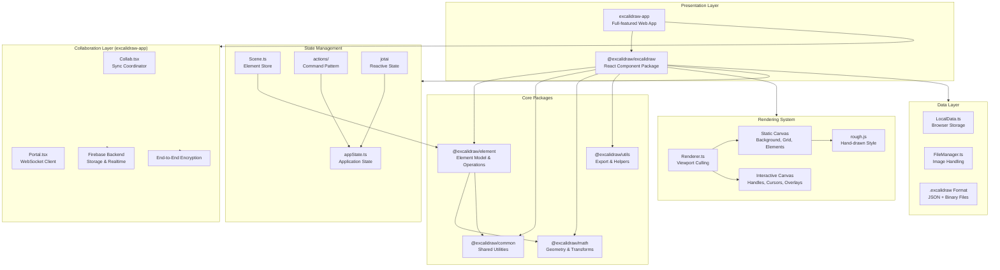
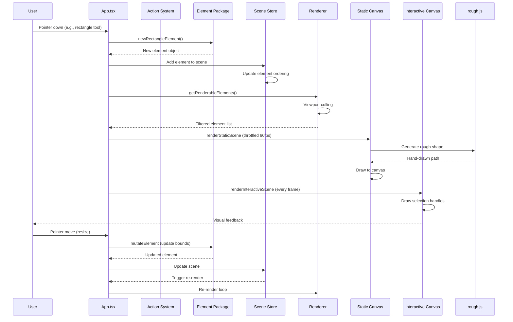
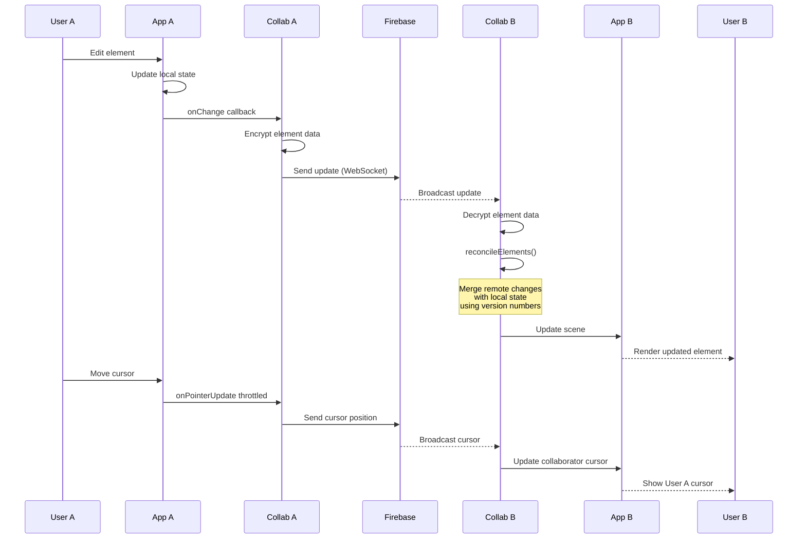
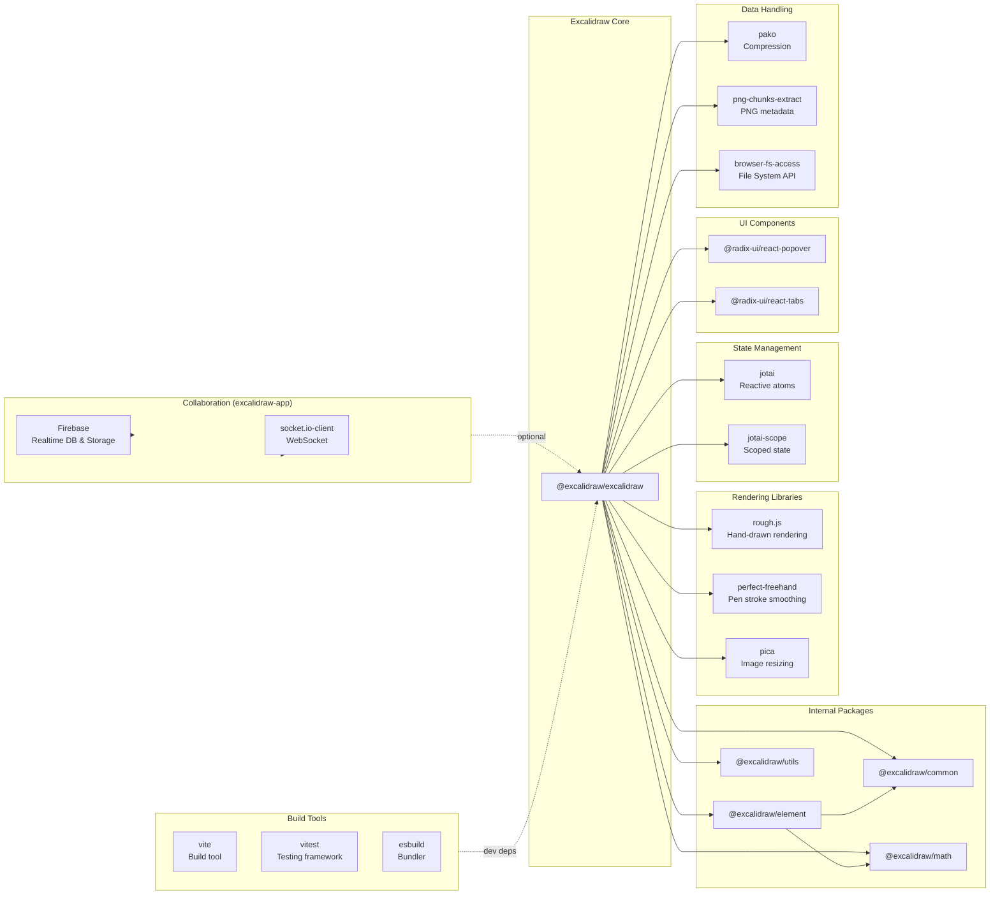

# Excalidraw

> Virtual whiteboard for sketching hand-drawn like diagrams

| Metadata | |
|---|---|
| Repository | https://github.com/excalidraw/excalidraw |
| License | MIT License |
| Primary Language | TypeScript |
| Category | Desktop Application |
| Analyzed Release | `v0.18.0` (2025-03-11) |
| Stars (approx.) | 116,000+ |
| Generated by | Claude Sonnet 4.5 (Anthropic) |
| Generated on | 2026-02-08 |

## Overview

Excalidraw is an open-source virtual whiteboard application for creating hand-drawn style diagrams, wireframes, and sketches. The project provides both a hosted web application at excalidraw.com and a reusable React component distributed as an npm package (@excalidraw/excalidraw), enabling developers to embed whiteboard functionality into their own applications.

Problems it solves:

- Lack of simple, intuitive diagramming tools with a hand-drawn aesthetic that feels more approachable than rigid technical diagrams
- Need for real-time collaborative whiteboarding with end-to-end encryption for privacy
- Challenge of creating embeddable diagramming components that work offline and support local-first data storage
- Difficulty of exporting diagrams to multiple formats (PNG, SVG, JSON) while maintaining editability

Positioning:

Excalidraw has become a widely adopted diagramming solution, integrated into major platforms including Google Cloud architecture diagrams, Meta, CodeSandbox, Obsidian, Replit, Notion, and HackerRank. Its unique hand-drawn style differentiates it from traditional diagramming tools like Draw.io or Lucidchart, while its open-source nature and embeddability make it a popular choice for developers building collaborative tools.

## Architecture Overview

Excalidraw employs a modular monorepo architecture with a clear separation between the reusable editor core (packages) and the full-featured web application (excalidraw-app). The rendering system uses a dual-canvas architecture to optimize performance by separating static scene content from interactive overlays, with RoughJS providing the signature hand-drawn rendering style.

## Core Components

### Element Package (`packages/element/`)

- Responsibility: Defines the data model for all drawable elements and provides pure functions for element manipulation
- Key files: `packages/element/src/index.ts`, `packages/element/src/newElement.ts`, `packages/element/src/mutateElement.ts`, `packages/element/src/renderElement.ts`, `packages/element/src/Scene.ts`
- Design patterns: Immutable data structures, Pure functions, Factory pattern

The Element package is the domain model layer containing all business logic for drawable elements (rectangles, ellipses, arrows, text, images, frames, etc.). Elements are represented as plain JavaScript objects with immutable update semantics enforced through `newElementWith()` and `mutateElement()` functions. The Scene.ts module maintains element ordering and provides efficient lookup via element IDs. Key modules include:

- newElement.ts: Factory functions for creating new elements (newRectangleElement, newArrowElement, etc.)
- mutateElement.ts: Immutable update functions using CaptureUpdateAction for change tracking
- renderElement.ts: Rendering logic delegating to RoughJS for hand-drawn style rendering
- bounds.ts: Bounding box calculations and collision detection
- binding.ts: Arrow-to-element binding system for maintaining connections
- linearElementEditor.ts: Edit mode for multi-point arrows and lines

### Renderer System (`packages/excalidraw/renderer/`, `packages/excalidraw/scene/Renderer.ts`)

- Responsibility: Dual-canvas rendering pipeline with viewport culling and throttling
- Key files: `packages/excalidraw/renderer/staticScene.ts`, `packages/excalidraw/renderer/interactiveScene.ts`, `packages/excalidraw/scene/Renderer.ts`
- Design patterns: Double buffering, Viewport culling, RAF throttling

Excalidraw uses two overlapping HTML canvas elements to optimize rendering performance:

- Static Canvas: Renders the immutable scene content (background, grid, all elements) via `renderStaticScene()`. This function is throttled to 60fps (16ms) using `throttleRAF` to prevent excessive redraws during rapid state changes like dragging.
- Interactive Canvas: Renders ephemeral UI overlays (selection handles, collaborative cursors, snap guides, binding indicators) via `renderInteractiveScene()`. This canvas is redrawn on every frame without throttling for immediate visual feedback.

The Renderer class (`scene/Renderer.ts`) implements viewport culling by filtering elements using `isElementInViewport()`, dramatically reducing rendering load for large scenes. Only elements within or near the viewport bounds are passed to the rendering functions. The Renderer also handles memoization of renderable elements to avoid redundant calculations.

### Application Component (`packages/excalidraw/components/App.tsx`)

- Responsibility: Main application orchestration, event handling, and tool management
- Key files: `packages/excalidraw/components/App.tsx`, `packages/excalidraw/index.tsx`
- Design patterns: Component composition, Event delegation, Hooks architecture

App.tsx is the central orchestrator managing the entire editing lifecycle. It coordinates:

- Event handling: Pointer events (mouse/touch/pen), keyboard shortcuts, gesture recognition
- Tool management: Active tool state (selection, rectangle, arrow, text, etc.) and tool-specific behaviors
- Element lifecycle: Creation, transformation (move/resize/rotate), deletion
- Undo/Redo: History management using `packages/excalidraw/history.ts`
- Clipboard operations: Copy/paste with custom clipboard format
- Canvas interactions: Zoom, pan, scroll with support for infinite canvas

The component uses React hooks extensively for state management and side effects. The `useHandleLibrary` hook manages the shape library, while `useDevice` detects pointer device types (mouse/touch/pen) for adaptive UI behavior. The app is wrapped in `EditorJotaiProvider` for reactive state management using Jotai atoms.

### Action System (`packages/excalidraw/actions/`)

- Responsibility: Command pattern implementation for all user actions
- Key files: `packages/excalidraw/actions/index.ts`, `packages/excalidraw/actions/manager.tsx`, `packages/excalidraw/actions/types.ts`
- Design patterns: Command pattern, Registry pattern

All user interactions are modeled as actions with a consistent interface defined in `types.ts`. Each action exports:

- name: Unique identifier
- perform: Function executing the action and returning updated state
- keyTest: Optional keyboard shortcut predicate
- PanelComponent: Optional UI component for toolbars/menus
- predicate: Optional condition for enabling the action

The ActionManager (`manager.tsx`) maintains a registry of all actions and handles keyboard shortcut routing. Actions are organized by category:

- actionCanvas.tsx: Zoom, pan, theme, background color
- actionProperties.tsx: Element styling (color, stroke, opacity, font)
- actionZindex.tsx: Layer ordering (bring to front, send to back)
- actionGroup.tsx: Grouping and ungrouping elements
- actionAlign.tsx: Alignment operations
- actionDeleteSelected.tsx: Element deletion

This architecture enables easy extensibility, undo/redo support, and keyboard shortcut customization.

### Collaboration Engine (`excalidraw-app/collab/`)

- Responsibility: Real-time multi-user collaboration with end-to-end encryption
- Key files: `excalidraw-app/collab/Collab.tsx`, `excalidraw-app/collab/Portal.tsx`, `excalidraw-app/data/firebase.ts`
- Design patterns: Observer pattern, Operational transformation, CRDT-like reconciliation

The collaboration layer (only in excalidraw-app, not the npm package) implements real-time synchronization using:

- Portal.tsx: WebSocket client managing the connection to the collaboration backend
- Collab.tsx: Sync coordinator handling bidirectional element updates, user presence, and cursor synchronization
- Reconciliation: The `reconcileElements()` function (from `@excalidraw/excalidraw/data/reconcile`) merges remote changes with local edits using element version numbers to detect conflicts
- Encryption: End-to-end encryption using the Web Crypto API ensures scene data is encrypted before transmission to Firebase

Element updates are batched and throttled to reduce bandwidth. The system tracks element versions (versionNonce) to implement last-write-wins conflict resolution. Collaborative cursors and user presence are updated in real-time via Firebase Realtime Database, while scene data is persisted to Firebase Storage.

### Data Layer (`packages/excalidraw/data/`, `excalidraw-app/data/`)

- Responsibility: Serialization, persistence, import/export, and file management
- Key files: `packages/excalidraw/data/json.ts`, `packages/excalidraw/data/blob.ts`, `excalidraw-app/data/LocalData.ts`, `excalidraw-app/data/FileManager.ts`
- Design patterns: Repository pattern, Adapter pattern

Excalidraw uses a JSON-based file format (.excalidraw) containing:

- elements: Array of element objects with full state
- appState: Exported subset of application state (viewport, theme, etc.)
- files: Embedded base64-encoded images (or references to external files)

The data layer provides:

- json.ts: `serializeAsJSON()` and `loadFromJSON()` for .excalidraw format
- blob.ts: `loadFromBlob()` for importing various image formats
- LocalData.ts: Browser localStorage persistence with automatic save/restore
- FileManager.ts: Image upload, caching, and Firebase Storage integration
- restore.ts: Normalizes imported data to current schema version

Images are stored separately from elements to optimize loading. The FileManager maintains a cache of loaded images and handles lazy loading for better performance with image-heavy scenes.

## Data Flow

### Element Creation and Rendering Flow

### Collaboration Synchronization Flow

## Key Design Decisions

### 1. Dual-Canvas Rendering Architecture

- Choice: Using two overlapping canvas elements for static content and interactive overlays
- Rationale: Separates expensive static rendering (background, grid, all elements) from frequently updated UI overlays (selection handles, collaborative cursors). The static canvas is throttled to 60fps while the interactive canvas renders every frame, preventing wasteful redraws of unchanged content
- Trade-offs: Increased memory usage from two canvases. Added complexity in coordinating canvas layers. However, the performance gains are significant for large scenes, enabling smooth interaction even with hundreds of elements

### 2. RoughJS Integration for Hand-Drawn Aesthetics

- Choice: Using the RoughJS library for sketch-style rendering instead of native canvas drawing primitives
- Rationale: Provides the signature hand-drawn look that differentiates Excalidraw from traditional diagramming tools. RoughJS generates randomized strokes with configurable roughness and sloppiness parameters, creating an approachable, informal aesthetic
- Trade-offs: RoughJS rendering is computationally more expensive than native canvas drawing. Shapes are cached in ShapeCache to amortize the cost. The hand-drawn style may not be suitable for formal technical diagrams, but this is intentional design choice

### 3. Immutable Element Updates with CaptureUpdateAction

- Choice: Enforcing immutable updates through `mutateElement()` wrapper with change tracking
- Rationale: Immutability simplifies undo/redo implementation, enables efficient change detection for collaboration sync, and prevents subtle bugs from untracked mutations. The `CaptureUpdateAction` callback notifies the history system of changes
- Trade-offs: Slightly more verbose update code compared to direct mutation. However, the benefits for collaboration and history management far outweigh the verbosity

### 4. Monorepo with Package-Based Modularity

- Choice: Yarn workspaces monorepo with clear package boundaries (@excalidraw/element, @excalidraw/math, etc.)
- Rationale: Separates the reusable editor core from the full-featured web application. Enables independent versioning and testing of packages. The @excalidraw/excalidraw package can be embedded in other applications without pulling in collaboration or Firebase dependencies
- Trade-offs: More complex build configuration. Circular dependency risks between packages (mitigated by clear dependency hierarchy). However, modularity enables better code organization and reusability

### 5. Local-First with Optional Cloud Sync

- Choice: Primary storage in browser localStorage with optional Firebase sync for collaboration
- Rationale: Ensures the editor works offline by default without requiring account creation. Data is owned by the user and stored locally. Firebase is only used when explicitly enabling collaboration
- Trade-offs: Limited to browser storage quotas (typically 5-10MB). Users must manually save files to disk for long-term preservation. However, this aligns with the privacy-focused philosophy and enables instant usage without barriers

### 6. Command Pattern for Actions with Keyboard Shortcuts

- Choice: Modeling all user interactions as Action objects with declarative keyboard shortcut bindings
- Rationale: Centralizes action logic for reuse across UI (buttons, menus, shortcuts). Enables programmatic action invocation via the ExcalidrawAPI. Keyboard shortcuts are declaratively bound to actions rather than scattered in event handlers
- Trade-offs: Requires boilerplate for defining actions. However, the architecture enables easy extensibility, testability, and customization

## Dependencies

## Testing Strategy

Excalidraw employs a multi-layered testing approach focused on unit tests and integration tests.

Unit tests: Each package has comprehensive test coverage using Vitest. Tests are colocated with source files using the `.test.ts(x)` suffix. The Element package tests pure functions for element creation, mutation, and geometry calculations. Action tests verify state transitions and side effects. Test files use `vitest-canvas-mock` to simulate canvas APIs in the Node.js environment.

Integration tests: App-level tests in `packages/excalidraw/tests/App.test.tsx` verify user interactions end-to-end, simulating pointer events and keyboard shortcuts. Snapshot tests capture rendered output for regression detection. The test suite uses `@testing-library/react` for component testing with a focus on user behavior rather than implementation details.

CI/CD: GitHub Actions automates the testing pipeline on every pull request. The build matrix tests against multiple Node.js versions (18+). Type checking via `tsc`, linting via ESLint, and formatting via Prettier run in parallel. The CI also validates bundle size limits using `size-limit` to prevent performance regressions. Builds are deployed to Vercel for preview environments on each pull request.

Build system: Vite serves as the build tool with esbuild for fast TypeScript transpilation. The monorepo uses Yarn workspaces for dependency management. Package builds are orchestrated via the root package.json scripts, with `build:packages` triggering builds for all internal packages before building the main application. The production build generates separate development and production bundles with tree-shaking and minification.

## Key Takeaways

1. Dual-canvas architecture: Separating static scene rendering from interactive overlays is a powerful optimization for canvas-based applications. Throttling the expensive static canvas to 60fps while rendering UI overlays every frame provides smooth interaction without wasted computation. This pattern is applicable to any application with a mix of static and dynamic visual elements.

2. Hand-drawn aesthetic as differentiation: Integrating RoughJS for sketch-style rendering creates a unique, approachable visual identity. The informal aesthetic reduces the psychological barrier to creating diagrams compared to rigid, formal tools. This demonstrates how visual design can be a core architectural decision, not just a presentation concern.

3. Immutable data with change tracking: Enforcing immutable element updates via wrapper functions (mutateElement) simplifies undo/redo and collaboration. The CaptureUpdateAction callback pattern enables decoupled change notifications without tight coupling to specific state management libraries. This is a reusable pattern for any collaborative or history-aware application.

4. Local-first with optional cloud sync: Prioritizing browser storage as the primary persistence layer ensures the application works offline and respects user privacy. Cloud synchronization is opt-in for collaboration, not a requirement. This architecture aligns with progressive enhancement principles and reduces infrastructure dependencies.

5. Monorepo modularity: Splitting the codebase into packages with clear boundaries (@excalidraw/element, @excalidraw/math, etc.) enables reuse and independent testing. The core editor package is embeddable without pulling in collaboration or Firebase dependencies. This demonstrates effective use of monorepos for creating reusable components while maintaining a cohesive developer experience.

6. Command pattern for actions: Modeling user interactions as declarative Action objects centralizes business logic and enables keyboard shortcut customization, programmatic invocation, and easy testing. This pattern is particularly valuable for applications with rich keyboard interaction and extensibility requirements.

7. Viewport culling for performance: Only rendering elements within or near the viewport dramatically reduces rendering load for large scenes. The Renderer class implements efficient filtering using bounding box calculations. This is a fundamental optimization for any infinite canvas or large data visualization application.

## References

- [Excalidraw Official Documentation](https://docs.excalidraw.com)
- [Canvas Rendering Pipeline | excalidraw/excalidraw | DeepWiki](https://deepwiki.com/excalidraw/excalidraw/5.1-canvas-rendering-pipeline)
- [Rendering System | excalidraw/excalidraw | DeepWiki](https://deepwiki.com/excalidraw/excalidraw/5-rendering-and-export)
- [Canvas Rendering | excalidraw/excalidraw | DeepWiki](https://deepwiki.com/excalidraw/excalidraw/4.1-canvas-rendering)
- [excalidraw/excalidraw | DeepWiki](https://deepwiki.com/excalidraw/excalidraw)
- [Excalidraw GitHub Repository](https://github.com/excalidraw/excalidraw)
- [Excalidraw Releases](https://github.com/excalidraw/excalidraw/releases)
