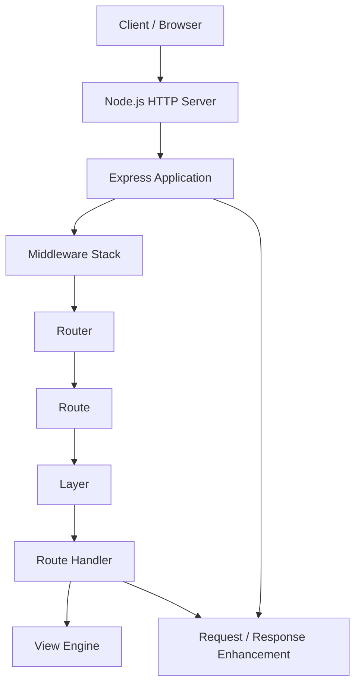
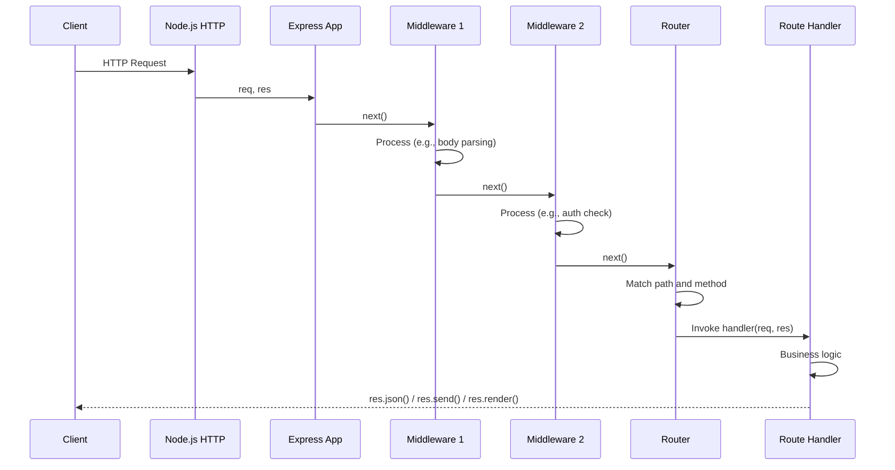
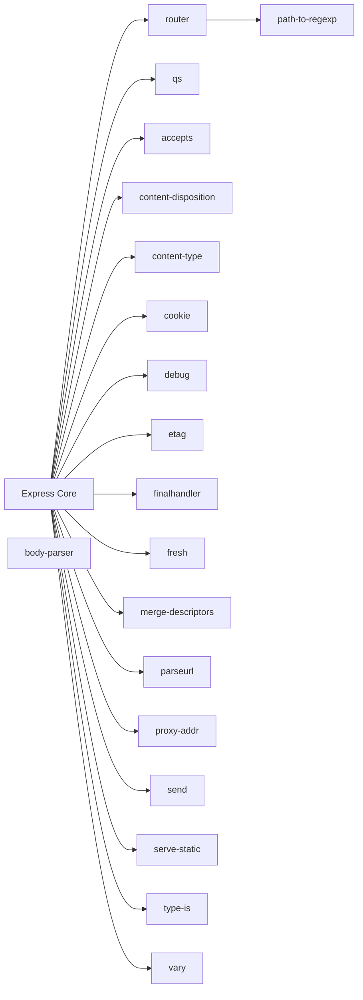

# Express

> Fast, unopinionated, minimalist web framework for Node.js, providing a thin layer of fundamental web application features.

| Metadata | |
|---|---|
| Repository | https://github.com/expressjs/express |
| License | MIT License |
| Primary Language | JavaScript |
| Category | Web Framework |
| Analyzed Release | `v5.2.1` (2025-12-01) |
| Stars (approx.) | 68,000+ |
| Generated by | Claude Opus 4.6 (Anthropic) |
| Generated on | 2026-02-09 |

---

## Overview

### Problem Domain

Building HTTP servers in Node.js using only the built-in `http` module requires handling URL parsing, routing, request body parsing, response formatting, and error handling manually. Developers need a lightweight abstraction that simplifies these tasks without imposing heavy opinions on application structure.

### Project Positioning

Express is the de facto standard web framework for Node.js. Unlike batteries-included frameworks such as Django or Rails, Express takes a minimalist approach -- it provides routing, middleware composition, and HTTP utility methods while leaving higher-level concerns (database access, authentication, templating) to the ecosystem.

Express is the "E" in the MEAN/MERN stack and serves as the foundation for higher-level frameworks like NestJS, Sails.js, and LoopBack. With Express 5.x (stable since late 2025), the framework has modernized its routing engine, improved Promise support, and tightened its API while maintaining the simplicity that made it dominant.

---

## Architecture Overview

---

## Core Components

### 1. Application (`lib/application.js`)

Responsibility: The central object that configures the Express application, registers middleware and routes, manages settings, and starts the HTTP server. It is the main entry point created by `express()`.

Key Files:
- `lib/application.js` -- Application prototype methods: `use()`, `set()`, `get()`, `post()`, `listen()`, `engine()`, `param()`
- `lib/express.js` -- Factory function that creates an Application instance
- `index.js` -- Entry point that exports the express factory

Design Patterns:
- Factory: `express()` creates configured application instances
- Facade: Application provides a simple interface over the middleware/router subsystem
- Mixin: Application prototype is merged onto a function object that doubles as an HTTP request handler

Key Methods:
- `app.use(path, ...fns)` -- Mount middleware at a path
- `app.METHOD(path, ...fns)` -- Register route handlers for HTTP methods
- `app.set(key, value)` -- Configure application settings
- `app.listen(port)` -- Bind and start the HTTP server

### 2. Router and Routing Layer

Responsibility: Matches incoming requests to registered routes based on HTTP method and URL path, and dispatches requests through the matching middleware and handler chain.

Key Files:
- `lib/application.js` -- Router is integrated into the application (Express 5 uses `router` package)
- External dependency: `router` npm package (extracted in Express 5)

Design Patterns:
- Chain of Responsibility: Layers are processed sequentially; each can handle or pass to next
- Composite: Routers can be nested (sub-routers via `express.Router()`)
- Iterator: Internal `next()` function iterates through the layer stack

Core Concepts:
- Layer: Wraps a middleware function with a path pattern and match logic
- Route: Groups layers that share the same path but differ by HTTP method
- Stack: Ordered array of layers that the router traverses per request
- Parameterized Routes: Path parameters (`:id`) extracted and placed on `req.params`

### 3. Request and Response Enhancement

Responsibility: Extends Node.js native `IncomingMessage` and `ServerResponse` with convenience methods for common web operations.

Key Files:
- `lib/request.js` -- Enhanced request object: `req.params`, `req.query`, `req.body`, `req.ip`, `req.hostname`, `req.accepts()`, `req.get()`
- `lib/response.js` -- Enhanced response object: `res.send()`, `res.json()`, `res.status()`, `res.redirect()`, `res.render()`, `res.cookie()`, `res.download()`

Design Patterns:
- Decorator: Extends native objects with additional methods without subclassing
- Prototype Chain: Request/Response prototypes inherit from Node.js base classes

Key Features:
- Content negotiation via `req.accepts()` and `res.format()`
- Automatic Content-Type setting based on response data type
- ETag generation for caching
- JSON and URL-encoded body handling

### 4. View Engine Integration (`lib/view.js`)

Responsibility: Provides a pluggable template rendering system that resolves template files and delegates rendering to registered view engines.

Key Files:
- `lib/view.js` -- View class that handles template lookup, caching, and engine delegation

Design Patterns:
- Strategy: View engines (EJS, Pug, Handlebars) are interchangeable via `app.engine()`
- Template Method: View defines lookup/render flow; engines implement the `__express()` function

Key Features:
- File-based template resolution with configurable root directory
- Template caching in production
- Multiple engine support per application

### 5. Utility Functions (`lib/utils.js`)

Responsibility: Provides internal helper functions used across the framework for content type detection, ETag generation, and response formatting.

Key Files:
- `lib/utils.js` -- Internal utilities: `setCharset()`, `wetag()`, `isAbsolute()`, `flatten()`

---

## Data Flow

---

## Key Design Decisions

### 1. Minimalist Core with Middleware Ecosystem

Choice: Keep the core framework extremely small (6 core files) and delegate all higher-level functionality to middleware packages.

Rationale: Different applications have vastly different needs. A blog needs sessions and templating; an API needs CORS and rate limiting. By keeping the core minimal, Express avoids forcing unnecessary dependencies on users.

Trade-offs: New users must assemble their middleware stack manually, which can be overwhelming. There is no "standard" Express application structure, leading to inconsistency across projects. Quality of third-party middleware varies.

### 2. Middleware as the Primary Abstraction

Choice: Everything is middleware -- logging, parsing, authentication, routing, and error handling all follow the `(req, res, next)` function signature.

Rationale: A single, simple pattern makes the framework easy to understand and extend. Developers can compose functionality by stacking middleware functions in order.

Trade-offs: Linear middleware execution can be inefficient for complex applications. Error handling requires a separate 4-argument `(err, req, res, next)` signature, which is a common source of confusion. No built-in dependency injection or lifecycle hooks.

### 3. Mutable Request/Response Objects

Choice: Middleware functions mutate shared `req` and `res` objects as they pass through the stack.

Rationale: Simple and efficient -- no need to create new objects or return values. Middleware can attach parsed data (body, session, user) directly to the request object.

Trade-offs: Side effects can make debugging difficult. No type safety for dynamically attached properties. Middleware ordering becomes critical since later middleware depends on earlier mutations.

### 4. Router Extraction in Express 5

Choice: Extract the router into a separate `router` npm package in Express 5, making it reusable outside Express.

Rationale: The router is useful independently (e.g., in other frameworks or testing scenarios). Separation improves maintainability and allows independent versioning.

Trade-offs: Adds an external dependency. Internal implementation details are now spread across packages.

### 5. No Built-in Async Error Handling (Pre-5.x) / Promise Support in 5.x

Choice: Express 5 automatically catches rejected promises from async route handlers and passes errors to error-handling middleware.

Rationale: Unhandled promise rejections were a major pain point in Express 4, requiring manual try/catch or wrapper utilities in every async handler.

Trade-offs: Backward compatibility concern for middleware that relied on unhandled rejections. Slight performance overhead from wrapping handlers.

---

## Dependencies

Express follows a micro-package philosophy where each concern (cookie parsing, content negotiation, ETag generation) is handled by a focused, well-tested npm package. This mirrors the broader Node.js ecosystem convention.

---

## Testing Strategy

- Test Location: `test/` directory at the repository root
- Test Framework: mocha with assert-based assertions
- Test Types: Integration tests that start an Express server and make HTTP requests via supertest
- Test Organization: Tests organized by feature area (app.METHOD, req.*, res.*, Router, middleware)
- CI Pipeline: Tests run across multiple Node.js versions via GitHub Actions
- Coverage Focus: Route matching, middleware execution order, response methods, error handling, content negotiation
- Legacy Testing: Separate workflow (`legacy.yml`) ensures backward compatibility

---

## Key Takeaways

1. Power Through Simplicity: Express demonstrates that a framework with only 6 core files and a single middleware pattern can become the most widely used Node.js framework. The `(req, res, next)` convention is one of the most recognizable patterns in web development.

2. Ecosystem-Driven Architecture: By keeping the core minimal, Express created space for a massive ecosystem of middleware packages. This approach trades initial convenience for long-term flexibility and community innovation.

3. Middleware Composition as Architecture: Express popularized the middleware pipeline pattern where cross-cutting concerns are composed as a stack of functions. This pattern has been adopted by many other frameworks (Koa, Hono, Fastify middleware).

4. Progressive Enhancement of HTTP Primitives: Rather than abstracting away Node.js HTTP objects, Express enhances them with convenience methods. This keeps the learning curve low and allows developers to drop down to raw Node.js APIs when needed.

5. Express 5 Modernization: The transition to Express 5 shows how a mature framework can modernize (Promise support, router extraction, path-to-regexp v8) while maintaining its core philosophy and minimizing breaking changes.

---

## References

- Express Official Documentation: https://expressjs.com/
- Express GitHub Repository: https://github.com/expressjs/express
- Express.js Architecture (DESOSA): https://desosa2022.netlify.app/projects/expressjs/posts/essay_2/
- Writing Middleware: https://expressjs.com/en/guide/writing-middleware.html
- Express 5 Migration Guide: https://expressjs.com/en/guide/migrating-5.html
