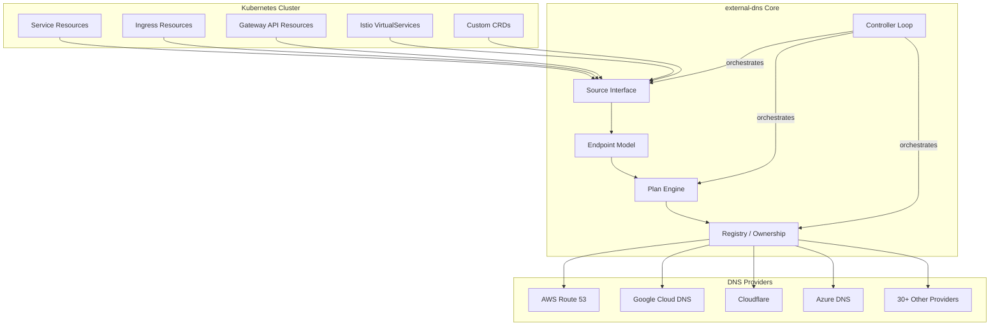
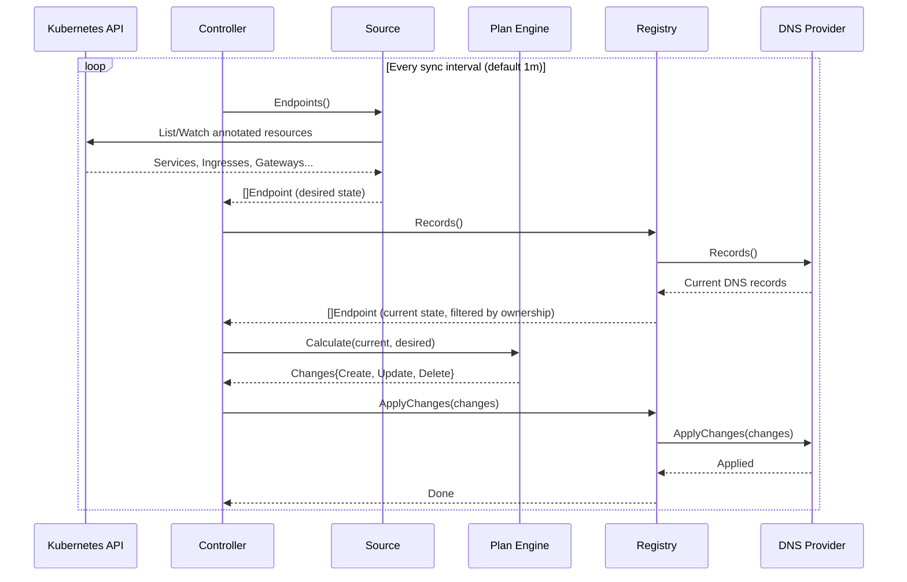
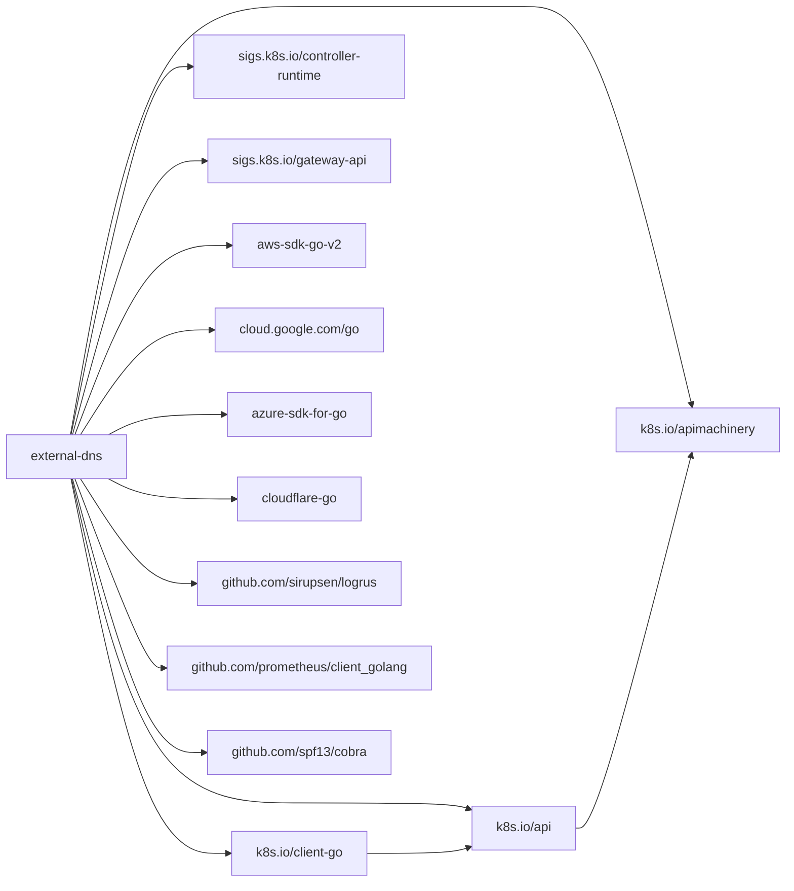

# external-dns Architecture Report

| Item | Value |
|------|-------|
| Project | external-dns |
| Repository | [kubernetes-sigs/external-dns](https://github.com/kubernetes-sigs/external-dns) |
| Category | Networking |
| Language | Go |
| License | Apache License 2.0 |
| Stars | 8,763 |
| Latest Release | v0.20.0 (2025-11-14) / Helm Chart v1.20.0 (2026-01-02) |
| Generated by | Claude Opus 4.6 (Anthropic) |
| Generated on | 2026-02-08 |

---

## Overview

external-dns solves the problem of automatically managing DNS records for Kubernetes resources exposed to
the internet. Without external-dns, operators must manually create and update DNS entries whenever services,
ingresses, or other resources change -- a tedious and error-prone process in dynamic environments.

The project positions itself as the DNS counterpart to Kubernetes internal DNS (CoreDNS/KubeDNS). While
internal DNS handles service discovery within the cluster, external-dns synchronizes Kubernetes resources
with external DNS providers such as AWS Route 53, Google Cloud DNS, Cloudflare, and over 30 others.

The core value proposition is declarative DNS management: annotate your Kubernetes resources with the desired
hostname, and external-dns handles the rest -- creating, updating, and deleting DNS records as resources
come and go.

### Problems Solved

- Manual DNS record management for dynamically provisioned Kubernetes services
- Stale DNS records when services are deleted or modified
- Lack of ownership tracking for DNS records across multiple clusters
- Inconsistent DNS configurations across different cloud providers

---

## Architecture Overview

---

## Core Components

### 1. Source Layer

Responsibility: Extract desired DNS endpoints from Kubernetes resources by watching the Kubernetes API
and converting annotated resources into a normalized Endpoint representation.

Key Files:
- `source/source.go` -- Defines the `Source` interface with `Endpoints()` method
- `source/service.go` -- Extracts endpoints from Service resources (LoadBalancer, NodePort, ExternalName, ClusterIP)
- `source/ingress.go` -- Extracts endpoints from Ingress resources
- `source/gateway.go` -- Extracts endpoints from Gateway API resources
- `source/gateway_httproute.go` -- HTTPRoute handling for Gateway API
- `source/gateway_grpcroute.go` -- GRPCRoute handling for Gateway API
- `source/istio_virtualservice.go` -- Extracts endpoints from Istio VirtualService resources
- `source/istio_gateway.go` -- Extracts endpoints from Istio Gateway resources
- `source/crd.go` -- Generic CRD source for custom resource types
- `source/store.go` -- Source registry/store for managing multiple sources

Design Patterns:
- Strategy Pattern: Each source type implements the same `Source` interface, enabling polymorphic endpoint extraction
- Observer Pattern: Sources watch Kubernetes API server for resource changes via informers
- Adapter Pattern: Each source adapts Kubernetes-specific resource types into the uniform `Endpoint` model

### 2. Endpoint Model

Responsibility: Provide a provider-agnostic representation of DNS records that decouples the Kubernetes
resource model from DNS provider specifics.

Key Files:
- `endpoint/endpoint.go` -- Core `Endpoint` struct definition with DNSName, Targets, RecordType, TTL, Labels, and ProviderSpecific fields
- `endpoint/domain_filter.go` -- Filtering logic to include/exclude DNS domains
- `endpoint/target_filter.go` -- Filtering logic for target IP/hostname values
- `endpoint/labels.go` -- Label serialization/deserialization for TXT record ownership
- `endpoint/crypto.go` -- Hashing utilities for deterministic record naming

Design Patterns:
- Value Object Pattern: Endpoints are immutable data carriers passed between components
- Filter Chain: Domain and target filters compose to narrow down which endpoints are managed

### 3. Plan Engine

Responsibility: Compute the difference between the current state of DNS records (from the provider)
and the desired state (from sources), producing a set of Create, Update, and Delete changes.

Key Files:
- `plan/plan.go` -- Core `Plan` struct and `Calculate()` method that performs the diff
- `plan/conflict.go` -- Conflict resolution when multiple sources claim the same DNS name
- `plan/policy.go` -- Policies for how changes are applied (sync vs. upsert-only)

Design Patterns:
- Reconciliation Loop: Classic Kubernetes-style desired-state vs. actual-state reconciliation
- Policy Pattern: Configurable policies (sync, upsert-only, create-only) control which operations are permitted

### 4. Registry / Ownership

Responsibility: Track which DNS records are owned by this instance of external-dns, preventing
accidental modification of records managed by other tools or other external-dns instances.

Key Files:
- `registry/registry.go` -- `Registry` interface definition wrapping the Provider
- `registry/txt/` -- TXT record-based ownership implementation (default)
- `registry/dynamodb/` -- DynamoDB-based ownership for environments where TXT records are not suitable
- `registry/noop/` -- No-op registry for testing or single-owner scenarios
- `registry/awssd/` -- AWS Cloud Map (Service Discovery) registry

Design Patterns:
- Decorator Pattern: Registry wraps the Provider interface, adding ownership semantics transparently
- Strategy Pattern: Multiple registry backends (TXT, DynamoDB, noop) are interchangeable

### 5. Provider Layer

Responsibility: Interface with specific DNS providers to read current records and apply changes.
Each provider implements the `Provider` interface with `Records()` and `ApplyChanges()` methods.

Key Files:
- `provider/provider.go` -- `Provider` interface definition
- `provider/cached_provider.go` -- Caching decorator that reduces API calls to DNS providers
- `provider/aws/` -- AWS Route 53 provider
- `provider/google/` -- Google Cloud DNS provider
- `provider/cloudflare/` -- Cloudflare provider
- `provider/azure/` -- Azure DNS provider
- `provider/webhook/` -- Generic webhook provider for external integrations
- `provider/inmemory/` -- In-memory provider for testing
- `provider/zone_id_filter.go` -- Zone-level filtering utilities
- `provider/recordfilter.go` -- Record-level filtering utilities

Design Patterns:
- Adapter Pattern: Each provider adapts the generic `Changes` model to provider-specific API calls
- Decorator Pattern: `cached_provider.go` wraps any provider with a caching layer
- Plugin Architecture: New providers can be added by implementing the `Provider` interface

---

## Data Flow

---

## Key Design Decisions

### 1. TXT Record-Based Ownership

Choice: Use companion TXT records to track ownership of DNS records rather than external state stores.

Rationale: TXT records are universally supported across DNS providers, require no external dependencies,
and are co-located with the records they track. This makes the ownership model self-describing and
portable across environments.

Trade-offs:
- Pro: No external state store dependency; works with any DNS provider
- Pro: Ownership information survives external-dns restarts and migrations
- Con: Doubles the number of DNS records (one TXT per managed record)
- Con: Some providers have limitations on TXT record content length
- Con: TXT records are visible to anyone querying DNS

### 2. Provider-Agnostic Endpoint Model

Choice: Define a universal `Endpoint` struct that abstracts DNS records across all providers.

Rationale: By decoupling the Kubernetes resource model from DNS provider specifics, the system enables
adding new sources and providers independently. The `ProviderSpecific` field allows provider-specific
metadata without breaking the core abstraction.

Trade-offs:
- Pro: Clean separation of concerns; new providers do not require changes to core logic
- Pro: Enables testing with in-memory providers
- Con: Lowest common denominator -- some provider-specific features require workarounds
- Con: The `ProviderSpecific` field is weakly typed

### 3. Polling-Based Reconciliation (No Real-Time Watches)

Choice: Use a configurable polling interval (default 1 minute) rather than real-time event-driven updates.

Rationale: DNS propagation is inherently slow (TTLs of 60-300 seconds are common), so real-time updates
provide little benefit. Polling simplifies error handling and prevents thundering herd problems during
bulk changes.

Trade-offs:
- Pro: Simpler implementation, easier to reason about
- Pro: Natural rate limiting for DNS API calls
- Con: Up to 1 minute delay between resource change and DNS update
- Con: Unnecessary API calls when nothing has changed

### 4. Plan-Based Diffing

Choice: Compute a full diff between desired and current state before applying any changes.

Rationale: This ensures idempotent operations and prevents partial updates. The plan can be logged
for debugging without applying changes, and conflict resolution happens before any mutations.

Trade-offs:
- Pro: Idempotent and safe -- rerunning produces the same result
- Pro: Full visibility into what will change before applying
- Con: Requires fetching all records from the provider each cycle
- Con: Large DNS zones can result in slow plan computation

### 5. Webhook Provider for Extensibility

Choice: Provide a generic webhook-based provider interface alongside native providers.

Rationale: The project cannot maintain providers for every DNS service. The webhook provider enables
third-party DNS services to integrate with external-dns by implementing a simple HTTP API, without
modifying the core codebase.

Trade-offs:
- Pro: Unlimited extensibility without core changes
- Pro: Third parties can iterate on their provider independently
- Con: Additional network hop and latency for webhook-based providers
- Con: Less tight integration compared to native providers

---

## Dependencies

---

## Testing Strategy

external-dns employs a comprehensive testing approach:

- Unit Tests: Each component (source, plan, registry, provider) has extensive unit tests. Files follow
  the `_test.go` convention co-located with source files (e.g., `plan/plan_test.go`, `source/service_test.go`).

- In-Memory Provider: The `provider/inmemory/` package provides a fully functional in-memory DNS provider
  used for integration testing without requiring real DNS infrastructure.

- Fake Sources: `source/fake.go` provides a configurable fake source for testing the plan and registry
  components in isolation.

- Controller Tests: `controller/controller_test.go` and `controller/execute_test.go` test the full
  reconciliation loop with mocked dependencies.

- Domain Filter Tests: Extensive testing of inclusion/exclusion filters ensures correct DNS name matching
  behavior across edge cases.

- Provider-Specific Tests: Each provider directory contains its own test suite that often uses API mocking
  (e.g., mock HTTP servers for cloud provider APIs).

---

## Key Takeaways

1. The Source-Plan-Registry-Provider pipeline is a textbook example of separation of concerns in a
   Kubernetes controller. Each layer has a clear responsibility and can be extended independently,
   making the project highly modular despite its broad scope.

2. Ownership tracking via TXT records is an elegant solution to the multi-tenant DNS management problem.
   It requires no external state store, is self-describing, and works universally across DNS providers --
   though at the cost of doubling the number of DNS records.

3. The provider ecosystem (30+ providers) demonstrates the value of a clean interface abstraction.
   The `Provider` interface with just `Records()` and `ApplyChanges()` methods is simple enough for
   third parties to implement, yet expressive enough to handle real-world DNS management.

4. The webhook provider model is an important architectural lesson: when you cannot predict all
   integration targets, provide a generic protocol-based extension point rather than trying to
   maintain every integration natively.

5. Polling-based reconciliation trades latency for simplicity. In domains where the underlying
   system is inherently slow (DNS propagation), this trade-off is well-justified and avoids
   unnecessary complexity.

---

## References

- [GitHub Repository: kubernetes-sigs/external-dns](https://github.com/kubernetes-sigs/external-dns)
- [Initial Design Document](https://kubernetes-sigs.github.io/external-dns/latest/docs/initial-design/)
- [Contributing / Design Guide](https://kubernetes-sigs.github.io/external-dns/latest/docs/contributing/design/)
- [DeepWiki: kubernetes-sigs/external-dns](https://deepwiki.com/kubernetes-sigs/external-dns)
- [Artifact Hub: external-dns Helm Chart](https://artifacthub.io/packages/helm/external-dns/external-dns)
