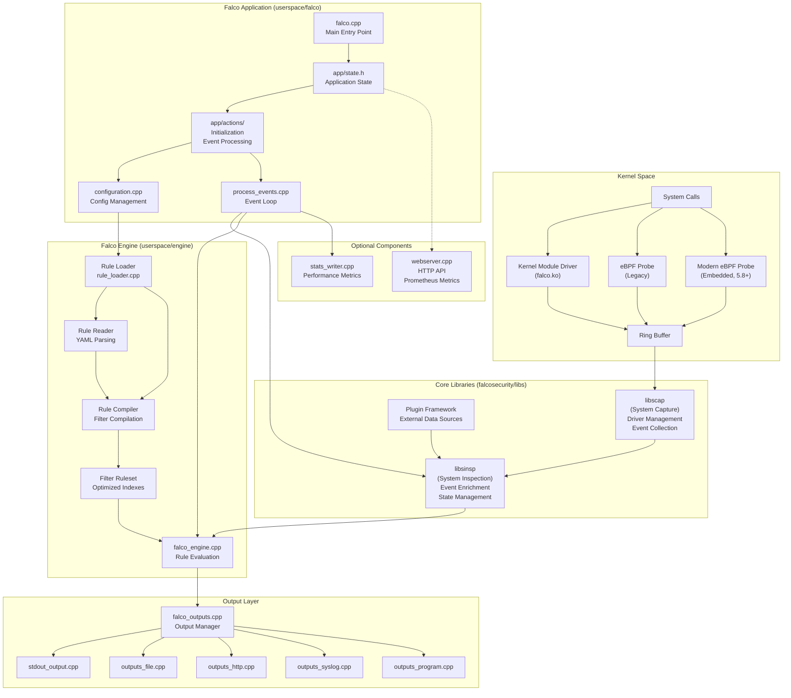
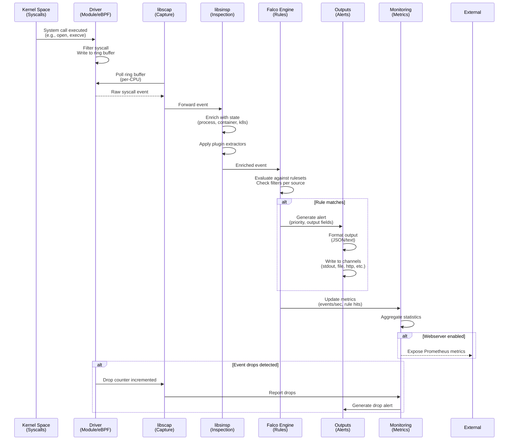
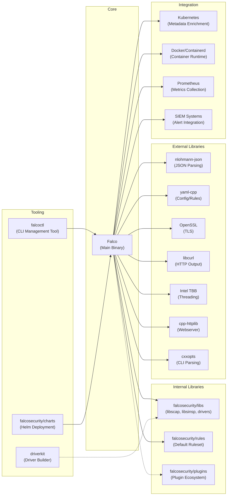

# Falco

> Cloud Native Runtime Security tool for Linux operating systems

| Metadata | |
|---|---|
| Repository | https://github.com/falcosecurity/falco |
| License | Apache-2.0 |
| Primary Language | C++ |
| Category | Security |
| Analyzed Release | `0.43.0` (2026-01-28) |
| Stars (approx.) | 8,639 |
| Generated by | Claude Sonnet 4.5 (Anthropic) |
| Generated on | 2026-02-08 |

## Overview

Falco is a cloud native runtime security tool designed to detect and alert on abnormal behavior and potential security threats in real-time. At its core, Falco is a kernel monitoring and detection agent that observes events such as syscalls based on custom rules, and can enhance these events by integrating metadata from container runtime and Kubernetes. Originally created by Sysdig, Falco is a graduated project under the Cloud Native Computing Foundation (CNCF).

Problems it solves:

- Real-time detection of abnormal behavior and security threats at the kernel level in containerized and Kubernetes environments
- Comprehensive system call monitoring and analysis with minimal performance overhead
- Flexible rule-based threat detection that can be customized for specific security policies
- Integration of runtime security into cloud-native infrastructure without requiring modifications to applications

Positioning:

Falco is the de facto standard for runtime security in cloud-native environments. It competes with tools like Tetragon and Tracee, but has broader adoption due to its CNCF graduation status, extensive rule library, and mature plugin ecosystem. Falco is frequently deployed alongside other security tools like Trivy (static vulnerability scanning) to provide comprehensive DevSecOps coverage.

## Architecture Overview

Falco employs a layered architecture consisting of kernel-level event capture via drivers (kernel module or eBPF), userspace libraries for event processing and enrichment, a rule engine for threat detection, and multiple output channels for alerting. The architecture is designed to maximize performance and minimize overhead while providing comprehensive visibility into system behavior.

## Core Components

### Driver Layer (Kernel Space)

- Responsibility: Capture system calls and kernel events with minimal overhead
- Key files: Managed in `falcosecurity/libs` repository, referenced via `cmake/modules/falcosecurity-libs.cmake`
- Design patterns: Ring buffer for lock-free event passing, driver abstraction

Falco supports three driver options: traditional kernel module (falco.ko), legacy eBPF probe, and modern eBPF probe (embedded). The modern eBPF probe is compiled directly into the Falco binary and requires Linux kernel 5.8+ with support for BPF ring buffers, BTF, and other modern BPF features. Drivers capture syscalls and write them to a per-CPU ring buffer for userspace consumption. The kernel module requires full privileges while eBPF is considered safer and unable to crash or panic the kernel.

### libscap - System Capture Library

- Responsibility: Driver interaction and raw event collection from kernel space
- Key files: External dependency in `falcosecurity/libs`, integrated via `cmake/modules/libscap.cmake`
- Design patterns: Producer-consumer pattern, driver abstraction layer

libscap (lib for System Capture) is the userspace library that directly communicates with drivers, reading syscall events from the ring buffer and forwarding them to libsinsp. It manages the data capture process, handles driver lifecycle, implements OS state collection, and supports reading/writing scap files for capture replay. libscap provides a unified interface regardless of which driver backend is used.

### libsinsp - System Inspection Library

- Responsibility: Event enrichment, state management, and filtering infrastructure
- Key files: External dependency in `falcosecurity/libs`, integrated via `cmake/modules/libsinsp.cmake`
- Design patterns: State machine pattern, observer pattern

libsinsp (lib for System Inspection) receives events from libscap and enriches them with machine state including process trees, network connections, file descriptors, and container metadata. It maintains stateful information to reconstruct system behavior across multiple events. libsinsp also implements the plugin framework that allows extending Falco to consume data from sources beyond syscalls. The library provides a rich API for event filtering and analysis.

### Falco Engine (userspace/engine)

- Responsibility: Rule loading, compilation, and runtime evaluation against events
- Key files: `userspace/engine/falco_engine.cpp`, `userspace/engine/rule_loader.cpp`, `userspace/engine/filter_ruleset.cpp`
- Design patterns: Rule engine pattern, visitor pattern for AST traversal, indexing for optimization

The Falco engine is the core detection logic. It loads security rules from YAML files via the rule loader, which uses a three-stage process: reading (rule_loader_reader.cpp), collection (rule_loader_collector.cpp), and compilation (rule_loader_compiler.cpp). Rules are compiled into optimized filter expressions and organized into indexed rulesets (filter_ruleset.h, evttype_index_ruleset.cpp) for efficient evaluation. The engine supports multiple event sources simultaneously and can enable/disable rules dynamically per ruleset. Each rule consists of a condition (filter expression), output format, priority level, and optional tags.

### Application Layer (userspace/falco)

- Responsibility: Application orchestration, configuration, initialization, and event processing loop
- Key files: `userspace/falco/falco.cpp`, `userspace/falco/app/state.h`, `userspace/falco/app/actions/process_events.cpp`
- Design patterns: Command pattern for actions, state pattern, singleton for configuration

The application layer provides the main entry point (falco.cpp) and orchestrates the entire lifecycle. State is managed in app/state.h which holds configuration, engine instance, inspectors, loaded sources, and plugin configurations. The app/actions directory contains modular action handlers for initialization tasks: load_config, init_falco_engine, load_plugins, load_rules_files, init_inspectors, and process_events. The process_events.cpp implements the core event loop that polls events from inspectors, evaluates them against rules, and dispatches alerts to outputs. The application supports multiple modes: live monitoring (kmod, modern_ebpf), replay from capture files, and nodriver mode for plugin-only operation.

### Configuration System (userspace/falco/configuration.cpp)

- Responsibility: Parse and validate configuration from YAML files and command-line options
- Key files: `userspace/falco/configuration.cpp`, `userspace/falco/configuration.h`, `falco.yaml`
- Design patterns: Builder pattern, validation chain

Configuration management is centralized in the falco_configuration class. It supports layered configuration through a base falco.yaml file plus additional config files in config.d/ directories. Configuration includes engine mode selection (KMOD, MODERN_EBPF, REPLAY, NODRIVER), buffer sizes, output channels, plugin settings, rule file paths, webserver settings, and metrics configuration. The system validates configuration at load time and provides detailed error messages for invalid settings.

### Output System (userspace/falco/falco_outputs.cpp)

- Responsibility: Format and dispatch security alerts to configured output channels
- Key files: `userspace/falco/falco_outputs.cpp`, `userspace/falco/outputs_*.cpp`
- Design patterns: Strategy pattern, observer pattern

The output system implements multiple output channels: stdout, file, HTTP endpoints, syslog, and external programs. Each output can be individually configured with different priorities and formats. Output formatting supports both plain text and JSON with configurable fields. The system includes buffering and rate limiting to prevent overwhelming output channels during alert storms. Output dispatching occurs asynchronously to avoid blocking the event processing loop.

### Plugin System (libsinsp + userspace/falco/app/actions/load_plugins.cpp)

- Responsibility: Extend Falco with external event sources and enrichment capabilities
- Key files: `userspace/falco/app/actions/load_plugins.cpp`, plugin framework in `falcosecurity/libs`
- Design patterns: Plugin pattern, dependency injection

Falco's plugin system allows loading external shared libraries that can provide new event sources or field extraction capabilities. Plugins are loaded dynamically at startup based on configuration. The plugin framework defines a C API that plugins must implement. Official plugins include the container plugin (for enhanced container metadata) and various cloud service integrations. Each plugin can define its own configuration and initialization parameters.

### Monitoring and Metrics (userspace/falco/stats_writer.cpp)

- Responsibility: Collect and export performance metrics and statistics
- Key files: `userspace/falco/stats_writer.cpp`, `userspace/falco/webserver.cpp`, `userspace/falco/event_drops.cpp`
- Design patterns: Observer pattern, metrics aggregation

The statistics subsystem collects performance metrics including event processing rates, drop counters, rule evaluation performance, and memory usage. Metrics can be exported via the embedded webserver in Prometheus format for integration with monitoring systems. The event_drops module specifically tracks and alerts on syscall event drops which indicate the system is under high load. Metrics are collected with minimal overhead to avoid impacting runtime performance.

## Data Flow

### Real-time Threat Detection Flow

## Key Design Decisions

### 1. C++ for Core Implementation

- Choice: Implement Falco core in C++ rather than Go or other high-level languages
- Rationale: Sequential mono-thread execution model due to statefulness requirements means Go's concurrency would not be leveraged; low-level kernel interaction requires minimal abstraction; performance-critical event processing (potentially millions of events/sec) requires fine-grained memory control and no garbage collection; C-compatible codebase ensures maximum cross-language plugin compatibility
- Trade-offs: More complex memory management and potential for memory safety issues (mitigated through smart pointers, address sanitizer in CI, Valgrind testing, and regular security audits) vs superior performance and control

### 2. Multiple Driver Options with Modern eBPF as Default

- Choice: Support kernel module, legacy eBPF probe, and modern embedded eBPF probe
- Rationale: Kernel modules provide maximum compatibility with older kernels but require full privileges; eBPF is safer and cannot crash the kernel; modern eBPF (5.8+) can be embedded in the binary eliminating external dependencies and simplifying deployment; users can choose based on kernel version and security requirements
- Trade-offs: Complexity of maintaining multiple driver implementations vs flexibility and safety for users; modern eBPF requires recent kernels but provides best user experience

### 3. Layered Library Architecture (libscap + libsinsp)

- Choice: Separate event capture (libscap) from event inspection/enrichment (libsinsp)
- Rationale: Clear separation of concerns allows libscap to focus on driver interaction and raw event handling while libsinsp handles stateful analysis; enables reuse of libraries in other projects (Sysdig uses same libs); facilitates testing and maintenance
- Trade-offs: Additional abstraction layers vs modularity and maintainability; enables the broader Falco ecosystem

### 4. Plugin Framework for Extensibility

- Choice: Implement a C-based plugin API supporting external event sources and field extractors
- Rationale: Allows extending Falco beyond syscalls without modifying core; enables community contributions; C API ensures compatibility with plugins written in any language that can interface with C; dynamic loading provides runtime flexibility
- Trade-offs: Plugin system adds complexity and prevents static linking in default builds vs unlimited extensibility

### 5. YAML-based Rule Language

- Choice: Use YAML for rule definitions with custom condition syntax
- Rationale: YAML is human-readable and familiar to DevOps practitioners; custom filter language optimized for syscall filtering is more expressive than general query languages; rules can be version-controlled and shared easily
- Trade-offs: Custom language requires learning vs expressiveness and optimization for the specific use case; rule compilation at startup vs runtime flexibility

### 6. Indexed Ruleset Organization

- Choice: Organize rules into indexed rulesets by event type and other characteristics
- Rationale: Evaluating all rules against all events would be prohibitively expensive; indexing allows quick lookup of relevant rules for each event; supports multiple independent rulesets for different contexts
- Trade-offs: Memory overhead for indexes vs dramatic performance improvement (only evaluating relevant rules)

## Dependencies

## Testing Strategy

Falco employs a multi-layered testing approach covering unit tests, integration tests, and system-level validation.

Unit tests: Located in `unit_tests/falco` and `unit_tests/engine`, built with CMake option `BUILD_FALCO_UNIT_TESTS=ON`. Tests focus on rule loading, engine logic, configuration parsing, and output formatting. The falcosecurity/libs repository contains additional unit tests for libscap and libsinsp. Tests use address sanitizer and undefined behavior sanitizer during CI builds.

Integration tests: The falcosecurity/testing repository contains regression tests and end-to-end scenarios. Tests validate full workflows including driver loading, event capture, rule evaluation, and output generation. Integration tests cover multiple driver types and deployment scenarios.

CI/CD: Uses CircleCI and GitHub Actions for continuous integration. Pipeline includes: static analysis with Semgrep, code formatting checks (clang-format), build matrix across multiple architectures (x86_64, aarch64), unit test execution with sanitizers, Docker image builds, and pre-commit hooks for code quality. Release process includes Valgrind memory checks and manual stress testing with the falcosecurity/event-generator tool. Security audits are performed regularly by third parties with full reports published in the audits/ directory.

## Key Takeaways

1. Layered architecture with kernel/userspace separation: Separating event capture (driver + libscap) from enrichment (libsinsp) and detection (engine) provides clear boundaries, enables independent optimization, and allows reuse of components across projects. This pattern is valuable for any system requiring kernel-level visibility with userspace processing.

2. Performance through indexing and optimization: Organizing rules into indexed structures and only evaluating relevant rules per event type is critical for high-throughput event processing. This demonstrates the importance of profiling and optimizing hot paths in security tools that must process millions of events per second with minimal overhead.

3. Multiple driver options for flexibility: Supporting kernel module, legacy eBPF, and modern eBPF accommodates diverse deployment scenarios from legacy systems to modern Kubernetes clusters. The embedded modern eBPF approach (compiled into binary) significantly improves user experience by eliminating external dependencies. This strategy of supporting multiple backends with different trade-offs is applicable to many infrastructure tools.

4. Plugin architecture for extensibility: The C-based plugin API allows extending Falco to new data sources and enrichment capabilities without modifying core code. This openness has fostered a vibrant ecosystem. The lesson is that well-designed plugin systems must balance simplicity (C API), performance (minimal overhead), and safety (error handling).

5. Declarative rule language for domain experts: YAML-based rules with domain-specific filter syntax make security policies accessible to practitioners without requiring programming expertise. The rule compilation and indexing approach shows how declarative configurations can be translated into high-performance runtime evaluation.

6. Observability and metrics as first-class concerns: Built-in metrics collection, Prometheus integration, and event drop monitoring demonstrate that production-grade security tools must provide visibility into their own operation. The stats writer and webserver components show how to add observability with minimal performance impact.

## References

- [Falco Official Documentation](https://falco.org/docs)
- [Kernel Events Architecture](https://falco.org/docs/concepts/event-sources/kernel/architecture/)
- [GitHub - falcosecurity/libs](https://github.com/falcosecurity/libs)
- [Choosing a Falco driver](https://falco.org/blog/choosing-a-driver/)
- [Getting started with modern BPF probe](https://falco.org/blog/falco-modern-bpf/)
- [Sysdig and Falco now powered by eBPF](https://www.sysdig.com/blog/sysdig-and-falco-now-powered-by-ebpf)
- [How to Implement Security Monitoring with eBPF (Falco, Tetragon)](https://oneuptime.com/blog/post/2026-01-07-ebpf-security-monitoring-falco-tetragon/view)
- [Falco Repository Evolution](https://github.com/falcosecurity/evolution)
