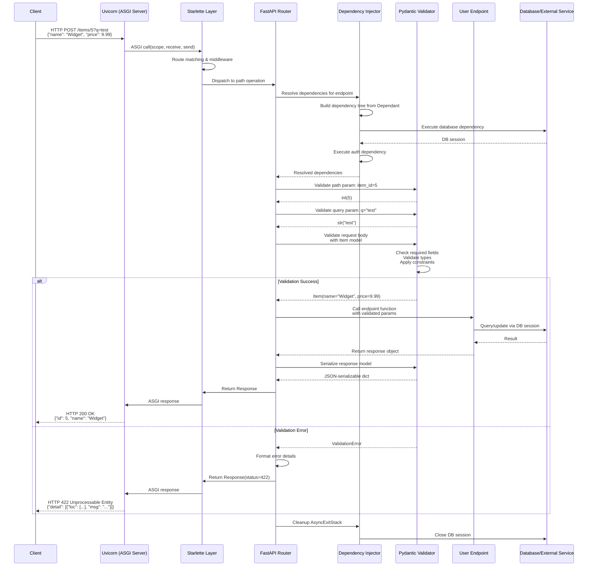
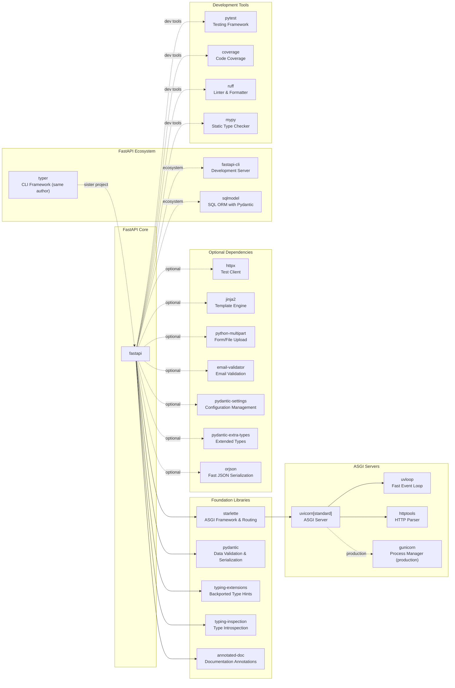

# FastAPI

> A modern, fast (high-performance), web framework for building APIs with Python based on standard Python type hints

| Metadata | |
|---|---|
| Repository | https://github.com/fastapi/fastapi |
| License | MIT License |
| Primary Language | Python |
| Category | Web Framework |
| Analyzed Release | `v0.128.5` (2026-02-08) |
| Stars (approx.) | 94,900+ |
| Generated by | Claude Opus 4.6 (Anthropic) |
| Generated on | 2026-02-08 |

## Overview

FastAPI is a modern, high-performance web framework for building APIs with Python 3.9+, leveraging Python's type hints to provide automatic validation, serialization, and API documentation generation. Built on top of Starlette for the web layer and Pydantic for data validation, FastAPI achieves performance on par with NodeJS and Go while maintaining Python's ease of use.

Problems it solves:

- Eliminates the need for manual API documentation by automatically generating OpenAPI schemas and interactive documentation from type hints
- Reduces development time by providing automatic request validation, serialization, and error handling through Pydantic models
- Achieves high performance for I/O-bound operations through native async/await support and ASGI-based architecture
- Minimizes runtime errors by enabling editor autocomplete and type checking through standard Python type hints

Positioning:

FastAPI is positioned as one of the fastest Python web frameworks, competing directly with NodeJS and Go-based frameworks in performance benchmarks. Unlike traditional Python frameworks like Flask (WSGI-based) or Django (synchronous), FastAPI is built on ASGI and fully supports async/await patterns. It combines the speed of Starlette with the data validation capabilities of Pydantic, making it the de facto choice for modern Python API development, particularly in machine learning services, microservices, and high-concurrency applications.

## Architecture Overview

FastAPI employs a layered architecture where it acts as a thin orchestration layer on top of Starlette and Pydantic. The framework analyzes function signatures with type hints at application startup, building a dependency tree and validation schema. At runtime, incoming requests flow through Starlette's ASGI handling, then through FastAPI's dependency injection system, Pydantic validation, and finally to user-defined endpoint functions.

```mermaid
graph TB
    subgraph Client["Client Layer"]
        Browser["Browser / HTTP Client"]
    end

    subgraph Server["ASGI Server (Uvicorn)"]
        UvicornCore["uvicorn<br/>ASGI Server"]
        UvLoop["uvloop<br/>Event Loop"]
        HttpTools["httptools<br/>HTTP Parser"]
    end

    subgraph Framework["FastAPI Framework"]
        FastAPIApp["FastAPI()<br/>Main Application"]
        Router["APIRouter<br/>Route Management"]
        Routing["routing.py<br/>Path Operations"]
    end

    subgraph Starlette["Starlette Layer"]
        StarletteApp["Starlette<br/>ASGI Application"]
        StarletteRouting["Starlette Routing<br/>Request/Response Handling"]
        Middleware["Middleware Stack<br/>CORS, HTTPS, etc."]
    end

    subgraph DI["Dependency Injection"]
        DependsAnalyzer["dependencies/utils.py<br/>Dependency Analyzer"]
        Dependant["Dependant Model<br/>Dependency Tree"]
        SolveDeps["solve_dependencies()<br/>Runtime Resolution"]
    end

    subgraph Validation["Validation Layer (Pydantic)"]
        PydanticModels["Pydantic BaseModel<br/>Data Models"]
        TypeHints["Type Hints<br/>Function Signatures"]
        Validation["Validation Engine<br/>Data Parsing"]
    end

    subgraph OpenAPI["OpenAPI Generation"]
        OpenAPIUtils["openapi/utils.py<br/>Schema Generator"]
        SwaggerUI["Swagger UI<br/>/docs"]
        ReDoc["ReDoc<br/>/redoc"]
    end

    subgraph UserCode["User Application"]
        PathOps["Path Operation Functions<br/>@app.get() / @app.post()"]
        Models["User Models<br/>Request/Response"]
        Dependencies["Custom Dependencies<br/>Database, Auth, etc."]
    end

    Browser --> UvicornCore
    UvicornCore --> UvLoop & HttpTools
    UvicornCore --> StarletteApp
    StarletteApp --> Middleware
    Middleware --> StarletteRouting
    StarletteRouting --> FastAPIApp
    FastAPIApp --> Router
    Router --> Routing
    Routing --> DependsAnalyzer
    DependsAnalyzer --> Dependant
    Dependant --> SolveDeps
    SolveDeps --> Dependencies
    SolveDeps --> Validation
    Validation --> PydanticModels
    Validation --> TypeHints
    Validation --> PathOps
    PathOps --> Models

    FastAPIApp --> OpenAPIUtils
    OpenAPIUtils --> SwaggerUI & ReDoc

    TypeHints -.->|introspection| DependsAnalyzer
    PydanticModels -.->|schema extraction| OpenAPIUtils
```

## Core Components

### FastAPI Application (`fastapi/applications.py`)

- Responsibility: Main application class that extends Starlette and orchestrates the entire framework
- Key files: `fastapi/applications.py`, `fastapi/__init__.py`
- Design patterns: Facade pattern, Decorator pattern

The `FastAPI` class inherits from `Starlette` and serves as the primary entry point for building applications. It extends Starlette with automatic dependency injection, OpenAPI schema generation, and Pydantic-based validation. The class provides decorator methods like `@app.get()`, `@app.post()`, etc., which internally create `APIRouter` instances and register path operations. At initialization, it sets up exception handlers for validation errors and configures default middleware including CORS, HTTPS redirect, and trusted host validation.

The application maintains an `openapi_schema` property that lazily generates the OpenAPI specification by introspecting all registered routes, dependencies, and Pydantic models. This design allows the schema to be generated once and cached for subsequent requests.

### Routing System (`fastapi/routing.py`)

- Responsibility: Path operation registration, dependency resolution orchestration, and request/response lifecycle management
- Key files: `fastapi/routing.py`, `starlette/routing.py`
- Design patterns: Decorator pattern, Chain of Responsibility, Template Method

The routing system extends Starlette's routing with dependency injection and validation. The `APIRouter` class allows modular route organization with prefix and tag support. Each path operation (GET, POST, etc.) is wrapped in a `request_response()` function that manages the full request lifecycle: dependency resolution, parameter extraction, validation, endpoint execution, and response serialization.

The system analyzes function signatures at registration time using Python's `inspect` module to build a `Dependant` object representing the dependency tree. At runtime, it executes dependencies in topological order, caching results to avoid redundant computation when multiple path operations share dependencies.

### Dependency Injection System (`fastapi/dependencies/`)

- Responsibility: Analyzing, resolving, and injecting dependencies into path operations and other dependencies
- Key files: `fastapi/dependencies/utils.py`, `fastapi/dependencies/models.py`, `fastapi/params.py`
- Design patterns: Dependency Injection, Graph traversal, Caching

FastAPI's dependency injection system analyzes function signatures and type hints to automatically provide dependencies. The `get_dependant()` function recursively inspects a callable and its parameters, building a `Dependant` model that represents a tree of dependencies. Each dependency can declare its own sub-dependencies, creating a hierarchical structure.

At request time, `solve_dependencies()` traverses this tree, resolving each dependency by calling it with its own resolved sub-dependencies. Results are cached in an `AsyncExitStack` to ensure cleanup of async context managers and to prevent duplicate execution. The system supports various parameter types: path parameters, query parameters, headers, cookies, request body, and arbitrary callables.

Dependencies can have different scopes (`call`, `request`, `package`) to control their lifecycle and enable advanced patterns like database connection pooling and request-scoped caching.

### Pydantic Validation Layer (`fastapi/_compat/`, integration)

- Responsibility: Automatic validation, parsing, and serialization of request/response data using Python type hints
- Key files: `fastapi/_compat/v2.py`, integration with Pydantic library
- Design patterns: Adapter pattern, Strategy pattern

FastAPI deeply integrates with Pydantic V2 to provide automatic data validation. The framework creates Pydantic models dynamically based on function parameter type hints. When a request arrives, FastAPI uses these models to parse and validate JSON bodies, query parameters, path parameters, headers, and cookies.

The compatibility layer (`_compat/`) abstracts differences between Pydantic versions, ensuring forward compatibility. For complex request bodies, FastAPI can embed multiple Pydantic models into a single body parameter or flatten them based on field configuration.

Validation errors are automatically converted into HTTP 422 responses with detailed error information following the JSON Schema format, making debugging straightforward for API clients.

### OpenAPI Schema Generation (`fastapi/openapi/`)

- Responsibility: Automatic generation of OpenAPI 3.1.0 specifications and interactive API documentation
- Key files: `fastapi/openapi/utils.py`, `fastapi/openapi/docs.py`, `fastapi/openapi/models.py`
- Design patterns: Builder pattern, Visitor pattern

The OpenAPI generation system introspects the entire application at runtime to build a complete OpenAPI specification. The `get_openapi()` function iterates through all registered routes, extracting metadata from:

- Path operation decorators (method, path, tags, summary, description)
- Function signatures and type hints (parameters, request body)
- Pydantic models (schemas, validation rules)
- Response models and status codes
- Security dependencies (OAuth2, API keys, HTTP auth)

The system generates JSON Schema definitions for all Pydantic models, deduplicates them, and creates references using `$ref` pointers. It also generates security scheme definitions from security dependencies.

Two interactive documentation UIs are provided: Swagger UI at `/docs` and ReDoc at `/redoc`. Both consume the generated OpenAPI schema to provide interactive API exploration and testing capabilities.

## Data Flow

### Typical API Request Processing



## Key Design Decisions

### 1. Building on Starlette and Pydantic (Composition over Implementation)

- Choice: Inherit from Starlette for ASGI handling and integrate Pydantic for validation rather than implementing from scratch
- Rationale: Starlette provides battle-tested ASGI implementation, routing, and middleware support, while Pydantic offers robust data validation using Python type hints. By building on these foundations, FastAPI focuses on developer experience and automatic documentation rather than reinventing low-level HTTP handling. This separation of concerns allows each component to evolve independently
- Trade-offs: FastAPI's capabilities are bounded by Starlette and Pydantic's APIs. Breaking changes in dependencies can impact FastAPI (mitigated by the compatibility layer). The abstraction adds minimal overhead but makes debugging require understanding of multiple layers. However, the benefit of leveraging mature libraries far outweighs reimplementation costs

### 2. Type Hint-Driven Architecture

- Choice: Use Python's native type hints and function signature introspection as the primary API for declaring request parameters, dependencies, and responses
- Rationale: Type hints provide a single source of truth that enables automatic validation, serialization, OpenAPI generation, and editor autocomplete without requiring separate schema definitions or configuration files. This approach reduces code duplication and maintains consistency between implementation and documentation. The standard Python syntax lowers the learning curve for developers already familiar with type hints
- Trade-offs: Requires Python 3.9+ with type hint support. Complex generic types can be difficult to express and may not always map cleanly to JSON Schema. Runtime introspection adds startup time (mitigated by caching). However, the developer experience benefits and automatic features justify this design choice for the framework's target audience

### 3. Dependency Injection with Graph-Based Resolution

- Choice: Implement a hierarchical dependency injection system that analyzes function parameters and builds a dependency graph resolved at request time
- Rationale: Modern applications require clean separation of concerns, testability, and reusability. By making dependencies explicit in function signatures, FastAPI enables easy mocking during tests, clear documentation of requirements, and reuse of common logic (database connections, authentication, etc.) across multiple endpoints. The graph-based approach allows dependencies to depend on other dependencies, creating flexible composition patterns
- Trade-offs: The introspection and graph traversal add computational overhead at request time (optimized through caching). Circular dependencies must be detected and prevented. Debugging complex dependency trees can be challenging. However, the benefits for code organization, testing, and maintainability make this essential for production applications

### 4. Automatic OpenAPI Schema Generation

- Choice: Generate complete OpenAPI 3.1.0 specifications automatically from code rather than requiring manual schema writing or annotations
- Rationale: Maintaining separate API documentation that stays synchronized with implementation is error-prone and time-consuming. By generating schemas from type hints, Pydantic models, and function signatures, FastAPI ensures documentation is always accurate and up-to-date. This approach also enables interactive documentation (Swagger UI, ReDoc) without additional configuration, significantly improving developer experience
- Trade-offs: Generated schemas may not always match desired documentation structure, requiring manual customization through additional parameters. Complex response types can produce verbose schemas. Startup time increases with application size due to schema generation. However, the elimination of manual documentation maintenance and guaranteed accuracy make this worthwhile

### 5. Async-First with Sync Compatibility

- Choice: Design for ASGI and async/await patterns while automatically running synchronous functions in thread pools
- Rationale: Modern Python applications increasingly require high concurrency for I/O-bound operations (database queries, external API calls, etc.). ASGI and async/await provide significantly better performance than traditional WSGI for these workloads. However, many existing libraries and developer knowledge are synchronous. By automatically detecting function signatures (async def vs def) and running sync functions in thread pools, FastAPI allows gradual migration and mixing of async/sync code
- Trade-offs: Thread pool execution for sync functions adds context switching overhead compared to pure async. Developers must understand when to use async vs sync to avoid blocking the event loop. The automatic handling can obscure performance characteristics. However, the flexibility to support both paradigms lowers the adoption barrier and enables incremental modernization

## Dependencies



## Testing Strategy

FastAPI emphasizes testability through its dependency injection system and includes comprehensive testing capabilities.

Unit tests: FastAPI provides a `TestClient` based on HTTPX that allows testing endpoints without running a server. Tests use standard pytest and can override dependencies using `app.dependency_overrides` to inject mocks or test doubles. Each module in the codebase includes extensive unit tests covering normal cases, edge cases, and error conditions. Test files follow the pattern `test_*.py` in the `tests/` directory.

Integration tests: The framework includes integration tests that verify interactions between components: dependency resolution with validation, OpenAPI generation from complex schemas, middleware stacks, and WebSocket support. Tests use real Pydantic models and validate end-to-end request/response cycles. The test suite includes over 1000 test files covering virtually every feature combination.

Build system: FastAPI uses PDM (Python Development Master) as its build backend, defined in `pyproject.toml`. The project follows modern Python packaging standards with PEP 517/518 build system specification. Development dependencies are managed separately from runtime dependencies, allowing clean production installations.

CI/CD: GitHub Actions workflows automate testing across Python versions (3.9-3.14), linting with Ruff, type checking with MyPy, and coverage reporting. The `test.yml` workflow runs the full test suite on every push and pull request. Additional workflows manage documentation builds, release automation, issue labeling, and translation notifications. The project maintains high test coverage (typically above 95%) to ensure reliability.

## Key Takeaways

1. Leverage Standard Language Features: FastAPI's use of Python's native type hints demonstrates how standard language features can enable powerful framework capabilities without requiring proprietary DSLs or configuration formats. This approach improves IDE support, lowers learning curves, and ensures long-term maintainability. Applicable to any framework design across languages.

2. Composition Over Reimplementation: By building on Starlette and Pydantic rather than implementing HTTP handling and validation from scratch, FastAPI achieves production-ready quality while maintaining a small codebase. This design pattern allows focusing innovation on developer experience rather than reinventing solved problems. Critical lesson for framework architects.

3. Single Source of Truth: Using function signatures and type hints as the sole definition for request parameters, validation rules, and documentation generation eliminates synchronization issues between code and documentation. This pattern reduces maintenance burden and prevents documentation drift. Applicable to API frameworks, CLI tools, and RPC systems.

4. Introspection-Based Automation: FastAPI's extensive use of runtime introspection to analyze type hints, build dependency graphs, and generate schemas shows how reflection can reduce boilerplate while maintaining type safety. The trade-off between startup time and developer productivity is often worthwhile for web applications. This pattern applies to any domain requiring metadata-driven behavior.

5. Async by Default with Graceful Degradation: Designing for async/await while automatically handling synchronous code in thread pools provides the best of both worlds: high performance for I/O-bound operations and compatibility with existing synchronous libraries. This migration pattern helps teams adopt modern concurrency models incrementally.

6. Dependency Injection as First-Class Feature: Making dependency injection a core framework feature rather than an add-on library encourages cleaner architecture, better testability, and reusable components. The graph-based resolution with caching demonstrates how to implement DI efficiently without heavyweight containers. Applicable to any application framework requiring component composition.

## References

- [FastAPI Official Documentation](https://fastapi.tiangolo.com/)
- [FastAPI GitHub Repository](https://github.com/fastapi/fastapi)
- [FastAPI Architecture - GeeksforGeeks](https://www.geeksforgeeks.org/python/fastapi-architecture/)
- [Modern FastAPI Architecture Patterns for Scalable Production Systems](https://medium.com/algomart/modern-fastapi-architecture-patterns-for-scalable-production-systems-41a87b165a8b)
- [FastAPI Internals: How It Works Under the Hood (Starlette, ASGI & Pydantic Explained)](https://medium.com/@rameshkannanyt0078/fastapi-internals-how-it-works-under-the-hood-starlette-asgi-pydantic-explained-5e4ab4e8707d)
- [Understanding FastAPI: How Starlette works](https://dev.to/ceb10n/understanding-fastapi-how-starlette-works-43i1)
- [Under the Hood: FastAPI Is Just Starlette + Pydantic](https://leapcell.io/blog/under-the-hood-fastapi-starlette-pydantic)
- [FastAPI + Uvicorn = Blazing Speed: The Tech Behind the Hype](https://dev.to/leapcell/fastapi-uvicorn-blazing-speed-the-tech-behind-the-hype-1npp)
- [Mastering Dependency Injection in FastAPI](https://medium.com/@azizmarzouki/mastering-dependency-injection-in-fastapi-clean-scalable-and-testable-apis-5f78099c3362)
- [Concurrency and async / await - FastAPI](https://fastapi.tiangolo.com/async/)
- [FastAPI OpenAPI Schema Generation](https://deepwiki.com/fastapi/fastapi/3.1-openapi-schema-generation)
