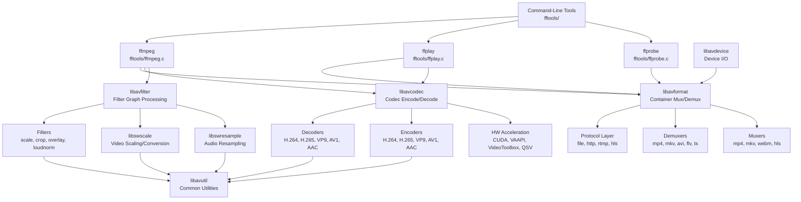
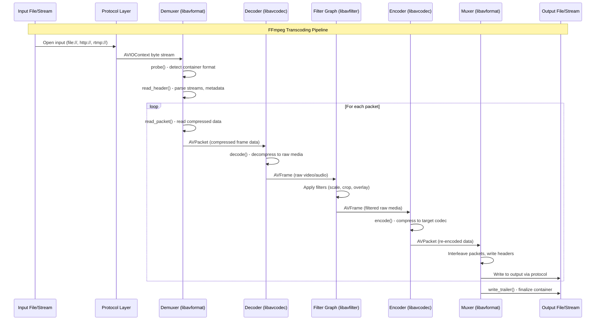
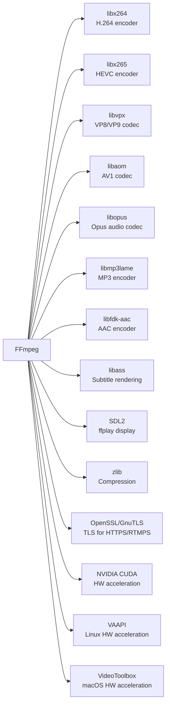

# FFmpeg

> A complete cross-platform solution for recording, converting, and streaming audio and video with a comprehensive library of codecs, formats, and filters

| Metadata | |
|---|---|
| Repository | https://github.com/FFmpeg/FFmpeg |
| License | LGPL 2.1+ / GPL 2+ (dual-licensed) |
| Primary Language | C |
| Category | Data Processing |
| Analyzed Release | `n8.0.1` (2025) |
| Stars (approx.) | 57,000+ |
| Generated by | Claude Opus 4.6 (Anthropic) |
| Generated on | 2026-02-09 |

---

## Overview

### Problem Domain

Multimedia processing involves decoding, encoding, transcoding, filtering, muxing, and demuxing hundreds of different audio and video formats. Each format has its own container structure, codec algorithms, and metadata conventions. Applications ranging from video editing software to streaming platforms require a unified framework for handling this vast diversity of media formats.

### Project Positioning

FFmpeg is the de facto standard open-source multimedia framework, providing a comprehensive set of libraries and command-line tools for processing virtually any audio or video format. It is used by VLC, Chrome, YouTube, and countless other applications as their underlying media processing engine. The project is organized as a set of seven core libraries (libavcodec, libavformat, libavfilter, libavutil, libswscale, libswresample, libavdevice) and three command-line tools (ffmpeg, ffplay, ffprobe). Its architecture is fundamentally modular, with hundreds of codecs, demuxers, muxers, protocols, and filters registered as plugins.

---

## Architecture Overview

---

## Core Components

### 1. libavformat - Container Format Layer

Responsibility: Demuxing (reading) and muxing (writing) container formats. Manages protocol I/O, stream identification, packet reading/writing, seeking, and metadata extraction.

Key files:
- `libavformat/avformat.h` - Public API: AVFormatContext, AVInputFormat, AVOutputFormat
- `libavformat/demux.c` - Generic demuxing infrastructure
- `libavformat/mux.c` - Generic muxing infrastructure
- `libavformat/mov.c` - MP4/MOV demuxer
- `libavformat/movenc.c` - MP4/MOV muxer
- `libavformat/matroska.c` / `libavformat/matroskadec.c` - MKV demuxer
- `libavformat/hlsenc.c` - HLS segment muxer
- `libavformat/protocols.c` - Protocol registry

Design patterns:
- Plugin registry: Each format registers an AVInputFormat or AVOutputFormat struct with function pointers for probe, read_header, read_packet, write_header, write_packet
- Probe pattern: Formats declare a read_probe() function that examines input bytes to detect format type
- AVIOContext abstraction: Unified I/O layer for files, HTTP, RTMP, pipes, and custom protocols

libavformat is responsible for the "container" layer, separating codec-agnostic container concerns from codec-specific encoding/decoding. A demuxer reads a container and produces AVPacket structures containing compressed data for individual streams. A muxer takes AVPacket structures and writes them into a container format with proper interleaving, timestamps, and metadata.

### 2. libavcodec - Codec Processing Layer

Responsibility: Encoding and decoding audio, video, and subtitle streams. Provides the AVCodec interface, hardware acceleration integration, and bitstream filtering.

Key files:
- `libavcodec/avcodec.h` - Public API: AVCodecContext, AVCodec, AVPacket, AVFrame
- `libavcodec/decode.c` - Generic decoding infrastructure
- `libavcodec/encode.c` - Generic encoding infrastructure
- `libavcodec/h264dec.c` - H.264 decoder
- `libavcodec/libx264.c` - H.264 encoder (via x264)
- `libavcodec/hevc/` - HEVC/H.265 codec
- `libavcodec/aac/` - AAC audio codec
- `libavcodec/av1dec.c` - AV1 decoder
- `libavcodec/hwconfig.h` - Hardware acceleration configuration

Design patterns:
- Codec registry: Each codec registers an AVCodec struct with init, encode/decode, and close function pointers
- AVFrame as universal media buffer: Decoded audio/video data in a standard format
- Reference counting: AVFrame and AVPacket use reference counting for zero-copy data sharing
- Hardware acceleration abstraction: AVHWAccel interface allows GPU decoders (VAAPI, CUDA, VideoToolbox) to plug in transparently

libavcodec is the largest library in FFmpeg, containing hundreds of codec implementations. The key abstraction is that all codecs present the same interface: they consume AVPacket (compressed data) and produce AVFrame (raw media data) for decoding, or vice versa for encoding. This uniformity allows the transcoding pipeline to treat all codecs identically.

### 3. libavfilter - Filter Graph Engine

Responsibility: Audio and video filtering through a directed graph of filter nodes. Supports operations like scaling, cropping, overlaying, color correction, audio mixing, and loudness normalization.

Key files:
- `libavfilter/avfilter.h` - Public API: AVFilterGraph, AVFilterContext, AVFilter
- `libavfilter/avfiltergraph.c` - Filter graph construction and negotiation
- `libavfilter/vf_scale.c` - Video scaling filter
- `libavfilter/vf_overlay.c` - Video overlay compositing
- `libavfilter/af_loudnorm.c` - Audio loudness normalization (EBU R128)
- `libavfilter/buffersrc.c` / `libavfilter/buffersink.c` - Graph input/output endpoints

Design patterns:
- Directed graph: Filters are connected via pads (inputs/outputs) forming a processing DAG
- Format negotiation: Filters negotiate compatible pixel/sample formats at link time
- Pull model: The output filter (buffersink) pulls frames through the graph on demand
- Filter registration: Each filter registers an AVFilter struct with query_formats, filter_frame callbacks

libavfilter implements a GStreamer-like filter graph where individual filters are connected through typed pads. When a frame is requested from the graph output, it recursively pulls data through the chain. Format negotiation ensures that filters agree on pixel formats, sample rates, and channel layouts at graph configuration time, inserting automatic conversion filters when needed.

### 4. libavutil - Common Utilities

Responsibility: Shared data structures, mathematical functions, pixel format definitions, memory allocation, logging, option parsing, and error handling used by all other libraries.

Key files:
- `libavutil/frame.h` - AVFrame structure definition
- `libavutil/pixfmt.h` - Pixel format enumeration
- `libavutil/samplefmt.h` - Audio sample format enumeration
- `libavutil/opt.h` - AVOption system for configurable parameters
- `libavutil/dict.h` - AVDictionary for metadata key-value pairs
- `libavutil/hwcontext.h` - Hardware device context management
- `libavutil/mem.h` - Aligned memory allocation

Design patterns:
- AVOption system: Uniform configuration interface allowing all FFmpeg objects to declare typed options with defaults, ranges, and documentation
- Reference-counted buffers: AVBuffer provides thread-safe reference counting for shared data
- Error code convention: Negative AVERROR codes for consistent error propagation

### 5. Command-Line Tools (fftools/)

Responsibility: User-facing CLI applications that orchestrate the libraries for common media processing tasks.

Key files:
- `fftools/ffmpeg.c` - Main transcoding tool entry point
- `fftools/ffmpeg_demux.c` - Input file handling and demuxing
- `fftools/ffmpeg_dec.c` - Decoder management
- `fftools/ffmpeg_filter.c` - Filter graph construction from CLI options
- `fftools/ffmpeg_enc.c` - Encoder management
- `fftools/ffmpeg_mux.c` - Output file handling and muxing
- `fftools/ffmpeg_sched.c` - Scheduler for multi-threaded transcoding pipeline
- `fftools/ffplay.c` - Media player using SDL
- `fftools/ffprobe.c` - Media file inspector

Design patterns:
- Pipeline architecture: demux -> decode -> filter -> encode -> mux
- Scheduler pattern: ffmpeg_sched.c orchestrates concurrent demuxing, decoding, filtering, encoding, and muxing across threads
- Option parsing chain: cmdutils.c provides hierarchical option parsing with per-stream specifiers

---

## Data Flow

---

## Key Design Decisions

### 1. Library-Based Modular Architecture Over Monolithic Design

Choice: Organize functionality into independent, separately linkable libraries (libavcodec, libavformat, etc.) rather than a single library.

Rationale: Applications can link only the libraries they need, reducing binary size. VLC might use libavcodec for decoding but use its own demuxer. Chrome links libavcodec but not libavformat. This granularity enables FFmpeg to serve as the media backbone for applications with vastly different requirements.

Trade-offs: Inter-library API boundaries must be carefully maintained. Version compatibility between libraries requires coordination. Circular dependencies must be avoided, which sometimes leads to functionality being placed in a less intuitive library.

### 2. C Language with Function Pointer Plugin Architecture

Choice: Implement everything in C with struct-based "vtables" (function pointer tables) for polymorphism rather than using C++ or a formal plugin framework.

Rationale: C ensures maximum portability across platforms and compilers. Function pointer structs (AVCodec, AVInputFormat, AVFilter) provide runtime polymorphism without language-level overhead. This approach allows new codecs and formats to be added by simply implementing the interface struct and registering it.

Trade-offs: No type safety for inheritance hierarchies. Manual memory management. Verbose boilerplate for each new codec/format/filter. However, the simplicity and portability benefits outweigh these costs for a project of FFmpeg's scope and platform reach.

### 3. Pull-Based Filter Graph Model

Choice: Use a pull-based model where the output requests frames, recursively pulling data through the filter chain.

Rationale: Pull-based processing naturally handles variable frame rates, format changes, and filters that produce more or fewer frames than they consume (e.g., framerate conversion, audio resampling). It also simplifies buffer management since frames are only produced when downstream needs them.

Trade-offs: Can lead to deep recursive call stacks in complex filter graphs. More difficult to parallelize than push-based or queue-based models. The FFmpeg transcoding scheduler works around this by managing thread-level concurrency above the filter graph.

### 4. Hardware Acceleration as a Pluggable Layer

Choice: Abstract hardware acceleration behind AVHWAccel and AVHWFramesContext interfaces, allowing GPU codecs to plug in alongside software implementations.

Rationale: GPU-accelerated encoding and decoding can provide order-of-magnitude performance improvements. By abstracting the hardware interface, applications can use CUDA, VAAPI, VideoToolbox, QSV, or software codecs with identical API calls.

Trade-offs: Hardware frames live in GPU memory and cannot be processed by CPU-based filters without expensive copies. Format negotiation becomes more complex with hardware pixel formats. Each hardware API has unique constraints that are difficult to abstract uniformly.

---

## Dependencies

---

## Testing Strategy

FFmpeg maintains a rigorous testing infrastructure:

- FATE (FFmpeg Automated Testing Environment): A comprehensive test suite located in `tests/` that runs on dozens of platforms via distributed test machines. FATE tests validate codec output byte-for-byte against reference files, ensuring deterministic behavior.

- Codec-Level Tests: Individual codec tests verify encoding/decoding correctness by comparing output against known-good reference files using checksums.

- Filter Tests: Filter graph tests validate filter output by comparing processed frames against reference images/audio.

- Fuzzing: FFmpeg participates in OSS-Fuzz for continuous fuzzing of demuxers and decoders, catching memory safety issues in format parsers.

- API Tests: The `tests/api/` directory contains C programs that test the library APIs directly, ensuring public interfaces work as documented.

- Regression Tests: When bugs are fixed, regression tests are added to prevent reoccurrence. The FATE reference files are updated with each release.

---

## Key Takeaways

1. Plugin architecture enables massive ecosystem growth: FFmpeg's function-pointer-based plugin system has enabled the community to add hundreds of codecs, formats, and filters over two decades without changing the core architecture. Each new plugin simply implements a well-defined struct interface and registers itself.

2. Layered abstraction mirrors the multimedia stack: The clean separation between protocol (I/O), format (container), codec (compression), and filter (processing) layers directly maps to how multimedia data is structured. This makes the codebase navigable and allows applications to use exactly the layers they need.

3. Reference-counted frames enable zero-copy pipelines: The AVFrame and AVBuffer reference counting system allows decoded frames to pass through filter chains and between threads without copying data, which is critical for real-time video processing performance.

4. Portability through simplicity: By using C with minimal dependencies and avoiding complex language features, FFmpeg compiles on virtually every platform with a C compiler. This design choice has made it the universal multimedia engine, embedded in everything from smartphones to satellites.

---

## References

- FFmpeg GitHub Mirror: https://github.com/FFmpeg/FFmpeg
- FFmpeg Developer Documentation: https://www.ffmpeg.org/developer.html
- FFmpeg Source Internals - Good Software Design: https://leandromoreira.com/2019/08/02/linux-ffmpeg-source-internals-a-good-software-design/
- FFmpeg libav Tutorial: https://github.com/leandromoreira/ffmpeg-libav-tutorial
- DeepWiki Analysis: https://deepwiki.com/FFmpeg/FFmpeg
- FFmpeg Wiki: https://en.wikipedia.org/wiki/FFmpeg
