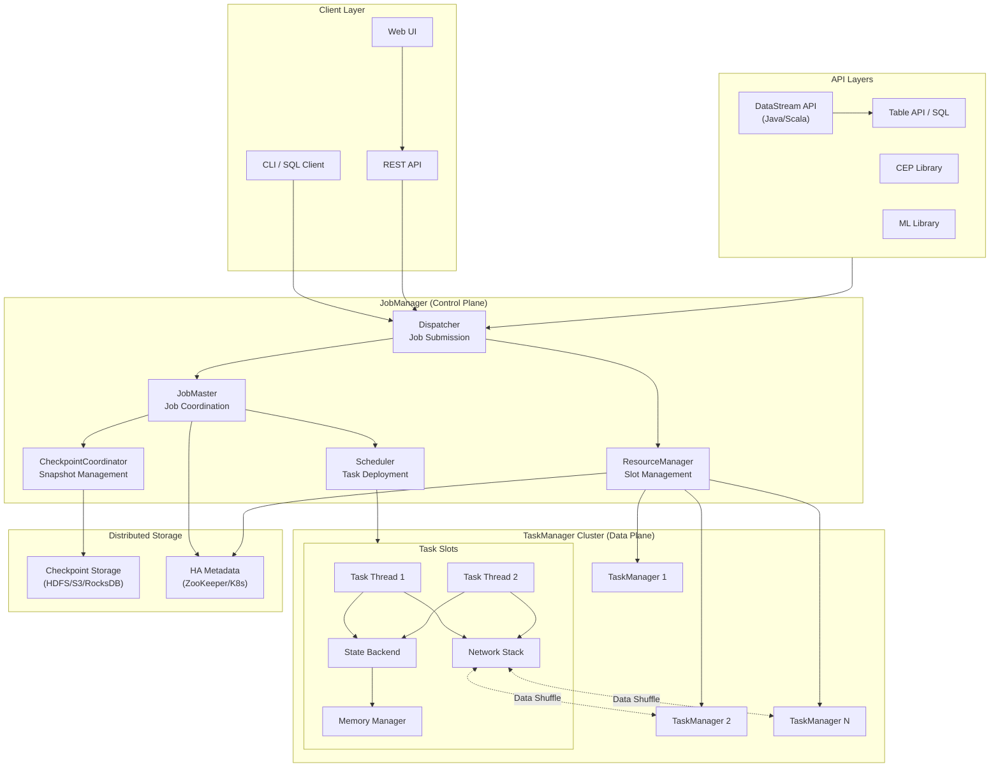
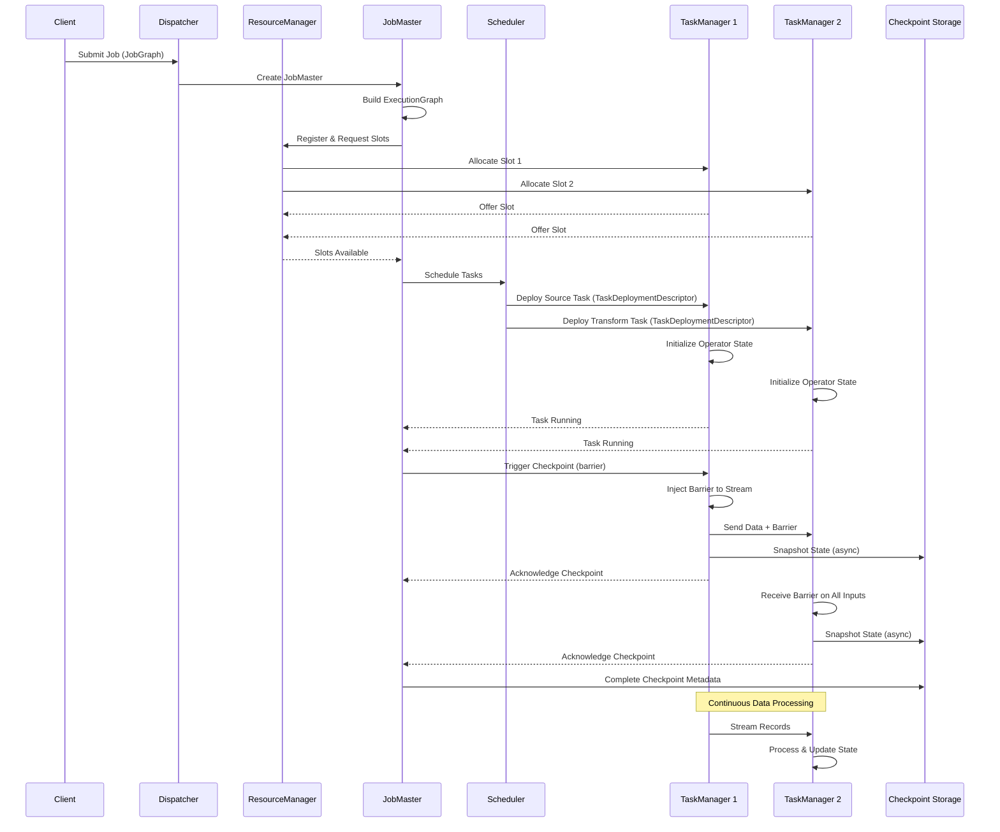
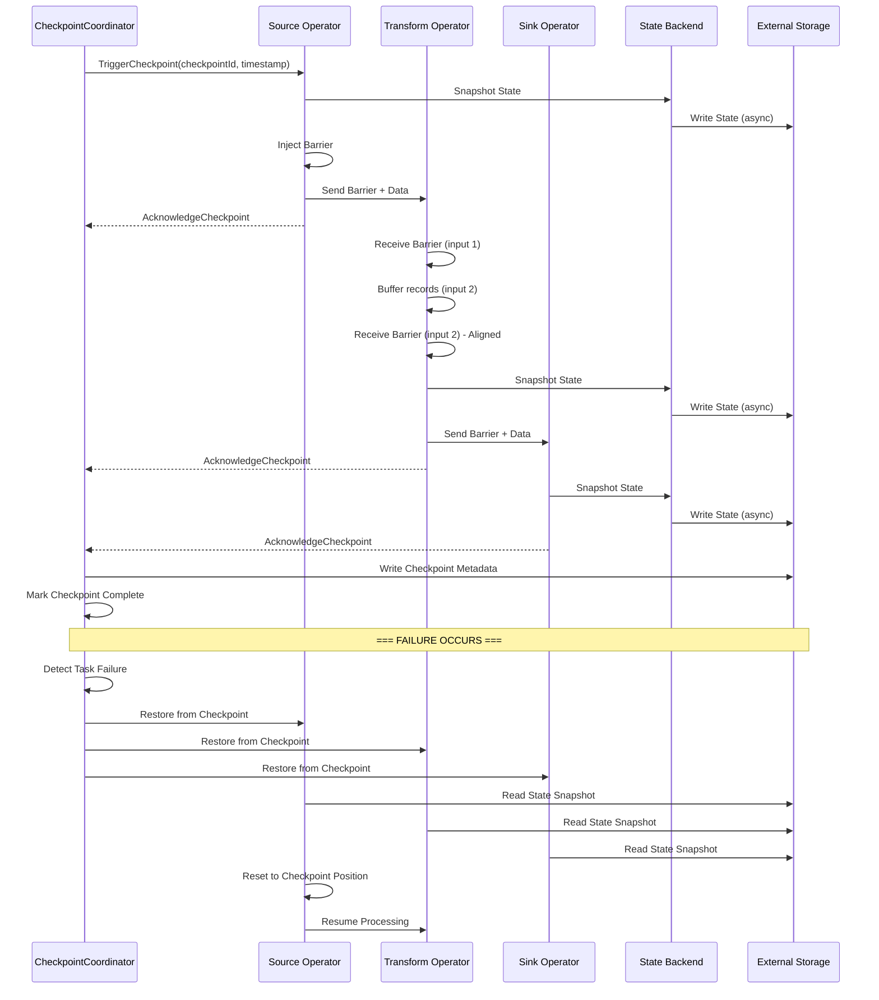
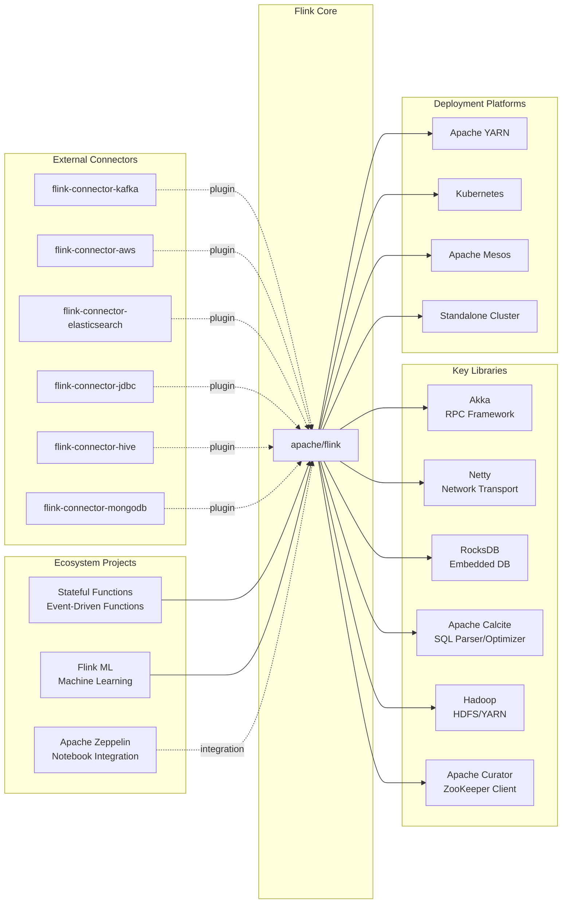

# Apache Flink

> A distributed stream processing framework for stateful computations over unbounded and bounded data streams

| Metadata | |
|---|---|
| Repository | https://github.com/apache/flink |
| License | Apache-2.0 |
| Primary Language | Java |
| Category | Data Processing |
| Analyzed Release | `v2.3-SNAPSHOT` (Development) |
| Stars (approx.) | 25,768 |
| Generated by | Claude Sonnet 4.5 (Anthropic) |
| Generated on | 2026-02-08 |

## Overview

Apache Flink is a distributed processing engine and framework for stateful computations over unbounded and bounded data streams. Flink has been designed to run in all common cluster environments, perform computations at in-memory speed and at any scale. The project originated from the Stratosphere research project and has become the leading engine for stateful stream processing.

Problems it solves:

- Processing unbounded data streams with exactly-once semantics and low latency while maintaining high throughput
- Managing large-scale stateful computations across distributed systems with fault tolerance guarantees
- Unifying batch and stream processing under a single runtime engine, eliminating the need for separate systems
- Handling event-time processing and out-of-order events in distributed streaming scenarios
- Providing scalable state management with automatic checkpointing and recovery

Positioning:

Apache Flink is the de facto standard for stateful stream processing, competing with Apache Spark Structured Streaming and Apache Storm. Unlike Spark's micro-batching approach, Flink provides true stream processing with lower latency. It powers fraud prevention, personalization, supply chain optimization, and AI automation in production environments. Widely adopted by companies like Alibaba, Uber, Netflix, and LinkedIn for mission-critical streaming workloads.

## Architecture Overview

Flink employs a master-worker architecture with a distributed dataflow engine at its core. The runtime executes dataflow programs as directed acyclic graphs (DAGs) of stateful operators connected by data streams. The architecture separates control plane (JobManager) from data plane (TaskManagers), enabling efficient distributed execution with automatic parallelization and fault tolerance.

## Core Components

### JobManager (`flink-runtime/src/main/java/org/apache/flink/runtime/jobmaster`)

- Responsibility: Master node that coordinates distributed execution, manages checkpointing, and handles job lifecycle
- Key files: `JobMaster.java`, `JobManagerRunner.java`, `JobManagerSharedServices.java`
- Design patterns: Actor model (via Akka RPC), Leader election pattern, Coordinator pattern

The JobManager acts as the control plane with three main subcomponents: Dispatcher receives job submissions and spawns JobMasters, ResourceManager manages TaskManager slots and communicates with cluster managers (YARN, Kubernetes, Mesos), and JobMaster coordinates individual job execution including scheduling and checkpointing. Each JobMaster maintains an ExecutionGraph representing the parallel execution plan and uses a CheckpointCoordinator to trigger periodic snapshots.

The component communicates via RPC using Flink's abstraction over Akka, enabling location transparency. High availability is achieved through leader election using ZooKeeper or Kubernetes, with job metadata persisted to recover from failures.

### TaskManager (`flink-runtime/src/main/java/org/apache/flink/runtime/taskexecutor`)

- Responsibility: Worker node that executes tasks, manages memory and network buffers, and handles local state
- Key files: `TaskExecutor.java`, `Task.java`, `TaskManagerServices.java`
- Design patterns: Slot sharing pattern, Memory pool management, Backpressure propagation

TaskManagers are the worker processes executing actual data processing. Each TaskManager provides multiple task slots (typically one per CPU core) that can execute parallel task instances. Slots can share resources for tasks from the same job through slot sharing groups, reducing communication overhead.

The TaskManager manages several critical resources: MemoryManager controls off-heap memory allocation using memory segments, NetworkEnvironment handles data exchange between operators via credit-based flow control preventing backpressure issues, and TaskStateManager coordinates with the CheckpointCoordinator for consistent snapshots.

Each task runs in a separate thread with its own operator chain. Operators are chained together when possible to minimize serialization overhead and maximize throughput.

### ExecutionGraph (`flink-runtime/src/main/java/org/apache/flink/runtime/executiongraph`)

- Responsibility: Runtime representation of the job DAG with parallel execution and failure tracking
- Key files: `ExecutionGraph.java`, `ExecutionJobVertex.java`, `ExecutionVertex.java`, `Execution.java`
- Design patterns: Hierarchical graph model, State machine pattern, Failover strategy pattern

The ExecutionGraph is the central data structure coordinating distributed execution. It transforms the user's JobGraph into a parallel execution plan with four layers: ExecutionGraph represents the entire job, ExecutionJobVertex represents one logical operation with aggregated state, ExecutionVertex represents one parallel subtask instance, and Execution represents one execution attempt (supporting retries on failure).

This hierarchical model enables fine-grained failure recovery. When a task fails, the failover strategy determines which tasks to restart, supporting both full job restarts and fine-grained region-based recovery. The ExecutionGraph tracks deployment status, execution state transitions, and manages result partition lifecycle for intermediate data.

### State Management (`flink-runtime/src/main/java/org/apache/flink/runtime/state`)

- Responsibility: Manages operator state with pluggable backends, checkpointing, and recovery
- Key files: `StateBackend.java`, `AbstractKeyedStateBackend.java`, `CheckpointStorage.java`, `StateDescriptor.java`
- Design patterns: Strategy pattern (pluggable backends), Template method pattern, Snapshot isolation

Flink provides sophisticated stateful stream processing through pluggable state backends. The StateBackend interface abstracts storage mechanisms with implementations including MemoryStateBackend (for testing), FsStateBackend (heap state with filesystem checkpoints), and RocksDBStateBackend (embedded RocksDB for large state).

State is partitioned by key groups enabling dynamic rescaling. When parallelism changes, key groups redistribute across operators. State types include ValueState, ListState, MapState, ReducingState, and AggregatingState, all described via StateDescriptor instances.

Checkpointing creates consistent distributed snapshots using the Chandy-Lamport algorithm with barriers. Barriers flow through the dataflow graph, triggering state snapshots at each operator. The CheckpointCoordinator orchestrates this process, persisting metadata and handling completion acknowledgments.

### Scheduler (`flink-runtime/src/main/java/org/apache/flink/runtime/scheduler`)

- Responsibility: Determines task deployment strategy, slot allocation, and failure recovery
- Key files: `SchedulerNG.java`, `DefaultScheduler.java`, `SchedulingStrategy.java`
- Design patterns: Strategy pattern (scheduling strategies), Builder pattern, Event-driven architecture

The Scheduler component decides when and where to deploy tasks. SchedulerNG is the main interface with DefaultScheduler as the primary implementation. Scheduling strategies are pluggable: EagerSchedulingStrategy deploys all tasks immediately (for streaming), LazyFromSourcesSchedulingStrategy deploys tasks when input data is ready (for batch), and PipelinedRegionSchedulingStrategy balances the two approaches.

Slot allocation goes through the SlotPool which maintains available slots from TaskManagers. The Scheduler requests slots, and upon allocation, deploys tasks by sending TaskDeploymentDescriptors to TaskManagers containing operator configuration, state handles, and input gate descriptors.

Failure handling is integrated with scheduling. When failures occur, the FailoverStrategy determines restart scope, and the RestartStrategy controls timing and attempts limits.

### Network Stack (`flink-runtime/src/main/java/org/apache/flink/runtime/io/network`)

- Responsibility: Handles data exchange between operators with credit-based flow control and result partitioning
- Key files: `NetworkEnvironment.java`, `ResultPartition.java`, `InputGate.java`, `NettyShuffleService.java`
- Design patterns: Credit-based flow control, Producer-consumer pattern, Network buffer pool

The network stack manages data shuffle between tasks using a credit-based flow control mechanism preventing backpressure issues. ResultPartitions produce data from source operators, InputGates consume data at target operators, and Netty provides the underlying network transport.

Memory for network buffers comes from a managed pool with configurable size. Credits represent available buffer capacity, and consumers send credit announcements to producers, who only send data when credits are available. This prevents overwhelming downstream operators.

Result partitions support different exchange patterns: PIPELINED for streaming with low latency, BLOCKING for batch with materialized intermediate results, and HYBRID combining both approaches. The ShuffleService abstracts shuffle implementations allowing pluggable shuffle managers.

### Checkpoint Mechanism (`flink-runtime/src/main/java/org/apache/flink/runtime/checkpoint`)

- Responsibility: Coordinates consistent distributed snapshots for fault tolerance with exactly-once semantics
- Key files: `CheckpointCoordinator.java`, `CompletedCheckpoint.java`, `PendingCheckpoint.java`
- Design patterns: Distributed snapshot algorithm (Chandy-Lamport), Coordinator pattern, Asynchronous snapshot

The CheckpointCoordinator implements Flink's fault tolerance mechanism based on the Chandy-Lamport distributed snapshot algorithm. It periodically triggers checkpoints by injecting barriers into data sources. Barriers flow through the dataflow graph in-band with data records.

When an operator receives a barrier on all input channels, it triggers its own state snapshot, then forwards the barrier downstream. Snapshots happen asynchronously: the operator continues processing while snapshot I/O executes in background threads. StateBackend implementations serialize state to external storage (HDFS, S3, etc.).

The coordinator tracks PendingCheckpoint instances until all operators acknowledge completion, then promotes them to CompletedCheckpoint. Completed checkpoints contain metadata pointing to all operator states, enabling recovery by restarting the job from the last successful checkpoint.

For exactly-once guarantees, operators buffer records received after the first barrier until all barriers arrive (alignment). Alternatively, unaligned checkpoints sacrifice alignment for lower latency by including in-flight records in snapshots.

### Table API and SQL (`flink-table`)

- Responsibility: Provides declarative APIs for batch and stream processing with relational operations
- Key files: `flink-table-planner/`, `flink-table-api-java/`, `flink-sql-parser/`
- Design patterns: Visitor pattern (AST traversal), Builder pattern (query construction), Cost-based optimization

The Table API and SQL layer sits above the DataStream API, providing relational semantics for both batch and streaming. The SQL parser uses Apache Calcite to parse SQL into an abstract syntax tree, then optimizes it through rule-based and cost-based optimization phases.

The Table Planner translates optimized logical plans into physical execution plans, eventually generating DataStream operations. Streaming-specific optimizations handle state retention, late data, and watermark propagation.

Dynamic tables model streaming as continuously updating tables, with queries as continuous transformations. Changelogs capture insert, update, and delete operations, enabling JOIN operations and aggregations over streams.

## Data Flow

### Stream Processing Job Execution

### Checkpoint and Recovery Flow

## Key Design Decisions

### 1. Streaming-First Runtime with Batch as Special Case

- Choice: Design the runtime for unbounded streams, treating bounded datasets as finite streams
- Rationale: Streaming is the more general problem - any batch operation can be expressed as a bounded stream, but not vice versa. This unification eliminates code duplication and allows a single engine to handle both workloads efficiently
- Trade-offs: Initial batch performance lagged behind specialized batch engines, though optimizations (operator fusion, scheduling strategies, blocking shuffles) have closed the gap. Requires careful tuning to match batch-optimized systems

### 2. Asynchronous Barrier Snapshotting (Chandy-Lamport Algorithm)

- Choice: Implement distributed snapshots using barriers that flow in-band with data, with asynchronous state persistence
- Rationale: Enables exactly-once processing guarantees without stopping the dataflow. Barriers provide clear cut points across distributed operators, and asynchronous I/O prevents blocking processing during snapshot writes
- Trade-offs: Barrier alignment requires buffering at operators with multiple inputs, adding latency. Unaligned checkpoints solve this but increase checkpoint size by including in-flight data. State growth can impact checkpoint duration

### 3. Pluggable State Backend Architecture

- Choice: Abstract state storage behind the StateBackend interface with multiple implementations (heap, filesystem, RocksDB)
- Rationale: Different workloads have different state characteristics. Small state fits in heap for fast access, while large state (gigabytes/terabytes) requires embedded databases like RocksDB. Pluggability allows users to choose optimal backends
- Trade-offs: RocksDB backend trades access speed for capacity but adds JNI overhead. State serialization format must remain compatible across backend switches. Memory tuning becomes complex with multiple memory pools

### 4. Credit-Based Flow Control

- Choice: Implement backpressure through credit-based flow control where consumers announce available buffer capacity
- Rationale: Prevents fast producers from overwhelming slow consumers, avoiding out-of-memory errors. Credits directly represent buffer availability, making flow control precise and avoiding dropped messages
- Trade-offs: Credit announcements add network overhead. Buffer pool configuration requires careful tuning. System throughput degrades when backpressure activates, but this is intentional to prevent failures

### 5. Operator Chaining Optimization

- Choice: Automatically chain operators that can execute in the same thread without serialization
- Rationale: Eliminates serialization/deserialization overhead between operators and reduces thread context switching. Dramatically improves throughput for pipelines with many transformations
- Trade-offs: Reduces parallelism granularity since chained operators share threads. Debugging becomes harder as multiple logical operations execute in one task. Failure recovery restarts entire chains

### 6. Akka-Based RPC Abstraction

- Choice: Build RPC layer on Akka actors, later abstracting to support alternative implementations
- Rationale: Akka provides battle-tested actor model implementation with location transparency, enabling seamless communication between distributed components. Actor model fits Flink's event-driven architecture
- Trade-offs: Akka dependency creates version lock-in and licensing concerns. High RPC volume can saturate actor mailboxes. Later versions abstract RPC to remove hard Akka dependency

### 7. Event-Time Processing with Watermarks

- Choice: Support event-time semantics with watermarks tracking progress through event timestamps
- Rationale: Enables correct processing of out-of-order and late events, critical for real-world streaming scenarios. Watermarks provide completeness signals allowing windows to close and aggregations to emit results
- Trade-offs: Watermark generation requires domain knowledge and tuning. Late events require special handling (allowed lateness, side outputs). Clock skew across distributed sources complicates watermark alignment

## Dependencies

## Testing Strategy

Flink employs a comprehensive multi-layered testing approach ensuring reliability for production streaming workloads.

Unit tests: Each module contains extensive unit tests in `src/test/java` directories. Core components like ExecutionGraph, StateBackend implementations, and network stack have high coverage. Tests use JUnit with custom utilities in `flink-test-utils-parent` for creating test environments, mock TaskManagers, and state.

Integration tests: `flink-runtime` and `flink-streaming-java` include integration tests that spin up MiniCluster instances (embedded Flink clusters) to test end-to-end job execution, checkpointing, and recovery. These validate component interactions without requiring full cluster deployment.

End-to-end tests: `flink-end-to-end-tests` contains comprehensive system tests deploying real Flink clusters (Docker, Kubernetes) and running realistic workloads. Tests verify features like exactly-once Kafka integration, state evolution, and high-availability failover scenarios.

Build system: Maven-based multi-module build with profiles for different Java versions (11, 17, 21) and Scala versions. Build enforces architecture constraints using ArchUnit rules in `flink-architecture-tests`.

CI/CD: Azure Pipelines runs extensive test matrix across operating systems, Java versions, and build profiles. Each pull request triggers hundreds of test jobs. Nightly builds include stability tests running jobs for hours with fault injection.

## Key Takeaways

1. Streaming-first unification: Designing for the more general unbounded stream case and treating batch as a special case creates a unified runtime eliminating dual-system complexity. This approach proves that streaming and batch can share infrastructure without compromising on either workload

2. Asynchronous distributed snapshotting: The Chandy-Lamport algorithm with barriers enables exactly-once guarantees in distributed streaming without stopping dataflow. Asynchronous state persistence decouples snapshot I/O from processing, maintaining low latency and high throughput

3. Separation of control and data planes: Clearly separating JobManager (control) from TaskManager (data) enables independent scaling and failure isolation. Control plane handles coordination while data plane focuses on high-throughput processing

4. Pluggable abstractions for heterogeneous requirements: State backends, shuffle services, and deployment modes use pluggable abstractions allowing users to optimize for different scenarios. This flexibility supports everything from development (in-memory state) to production (RocksDB with terabyte state)

5. Credit-based flow control for backpressure: Implementing backpressure at the network layer with credit announcements prevents cascading failures and memory exhaustion. This design makes systems resilient to speed mismatches between producers and consumers

6. Event-time processing with watermarks: Decoupling processing-time from event-time and using watermarks for progress tracking enables correct handling of out-of-order data. This design is essential for real-world streaming where events arrive out of sequence

7. Layered API design: Providing ProcessFunction for low-level control, DataStream API for programmatic access, and Table API/SQL for declarative processing creates onboarding ramps for different user personas while sharing the same runtime

## References

- [Apache Flink Official Documentation](https://flink.apache.org/)
- [Architecture | Apache Flink](https://flink.apache.org/what-is-flink/flink-architecture/)
- [Apache Flink: Stream and Batch Processing in a Single Engine](https://asterios.katsifodimos.com/assets/publications/flink-deb.pdf)
- [Introduction to Apache Flink and Stream Processing](https://www.decodable.co/blog/introduction-to-apache-flink-and-stream-processing)
- [What is Apache Flink? - AWS](https://aws.amazon.com/what-is/apache-flink/)
- [Understand Apache Flink | Confluent Documentation](https://docs.confluent.io/platform/current/flink/concepts/flink.html)
