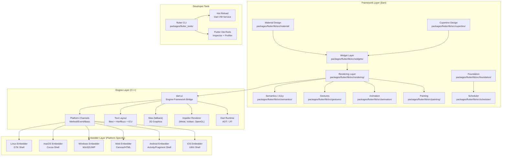
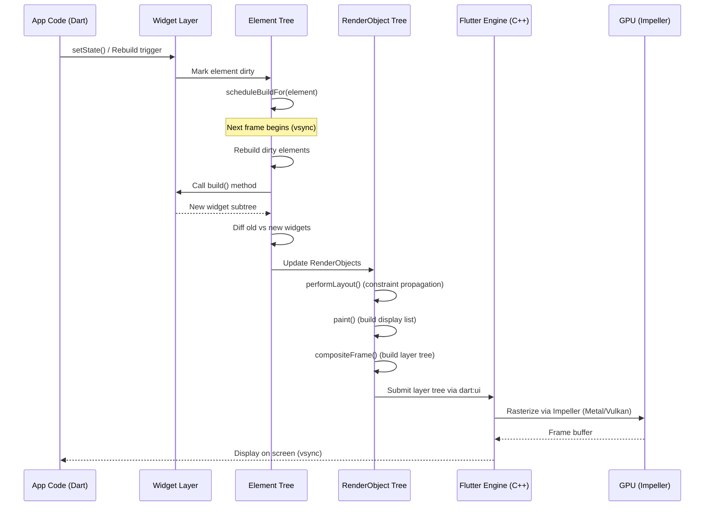
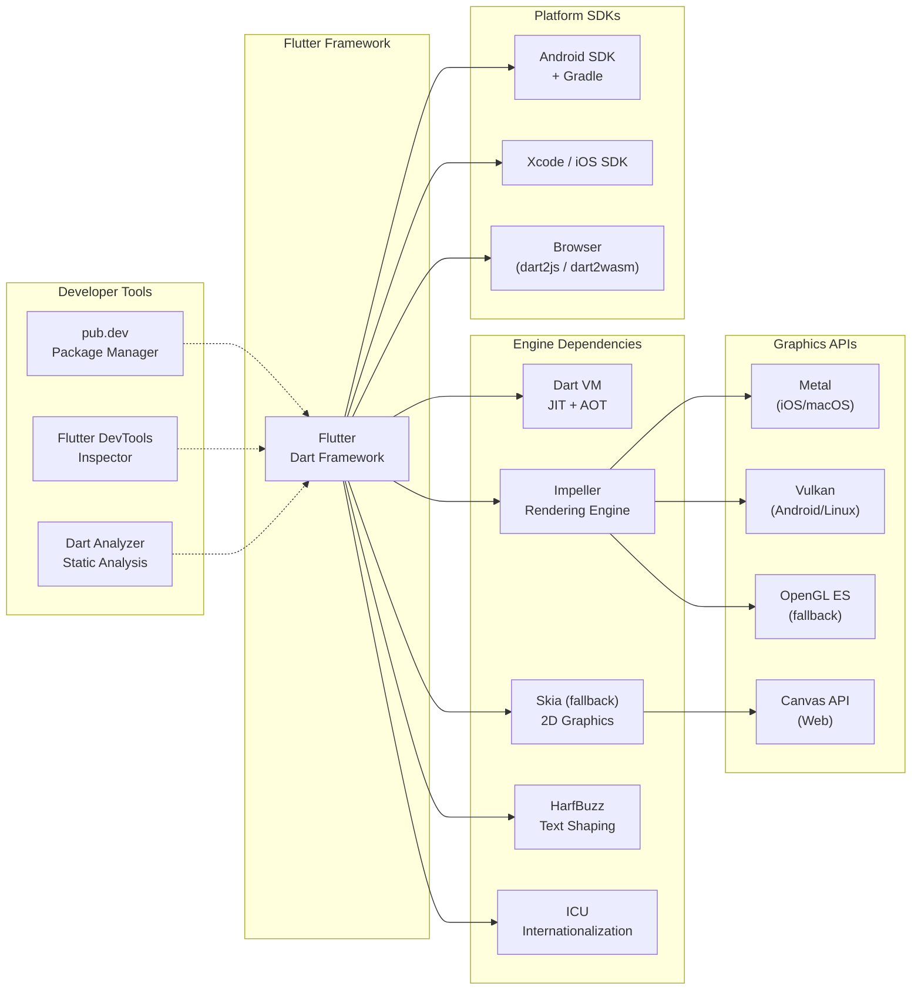

# Flutter

> Flutter makes it easy and fast to build beautiful apps for mobile and beyond

| Metadata | |
|---|---|
| Repository | https://github.com/flutter/flutter |
| License | BSD 3-Clause |
| Primary Language | Dart |
| Category | Developer Tool |
| Analyzed Release | `3.38.6` (2025-09) |
| Stars (approx.) | 175,000+ |
| Generated by | Claude Opus 4.6 (Anthropic) |
| Generated on | 2026-02-09 |

## Overview

Flutter is Google's open-source UI toolkit for building natively compiled applications for mobile (iOS, Android), web, and desktop (Windows, macOS, Linux) from a single Dart codebase. Unlike traditional cross-platform frameworks that wrap native UI components or use a webview, Flutter renders every pixel itself using a high-performance rendering engine (Impeller/Skia), delivering consistent visual fidelity across all platforms. The framework provides a reactive programming model based on composable widgets and a declarative UI paradigm.

Problems it solves:

- Cross-platform development cost: Building separate native applications for iOS, Android, web, and desktop requires maintaining multiple codebases in different languages (Swift, Kotlin, JavaScript, C++), multiplying development effort and bug surface
- UI consistency across platforms: Native cross-platform frameworks (React Native, Xamarin) that bridge to platform widgets produce subtly different appearances and behaviors on each platform
- Performance gap in cross-platform tools: Webview-based approaches (Cordova, Ionic) suffer from performance limitations that prevent building complex, animation-heavy interfaces
- Development iteration speed: Traditional native development requires lengthy compilation cycles; Flutter's hot reload enables sub-second feedback during development

Positioning:

Flutter is one of the most popular cross-platform UI frameworks, competing primarily with React Native (JavaScript/React ecosystem), .NET MAUI (C#/.NET ecosystem), and Kotlin Multiplatform (Kotlin ecosystem). Flutter's differentiator is its custom rendering engine that draws directly to a canvas, bypassing platform UI components entirely. This gives it pixel-perfect consistency across platforms but means it does not use native platform widgets. Flutter's adoption includes major applications from Google (Google Pay, Google Earth), BMW, eBay, Alibaba, and ByteDance. The Dart language, while less widely known than JavaScript or Kotlin, offers ahead-of-time (AOT) compilation for production builds and JIT compilation for hot reload during development.

## Architecture Overview

Flutter's architecture is organized into three main layers: the Framework (Dart), the Engine (C++), and the Embedder (platform-specific). The Framework provides the widget system, rendering pipeline, animation, gestures, and Material/Cupertino design libraries. The Engine handles low-level rendering (via Impeller or Skia), text layout, Dart runtime, and platform channel communication. The Embedder provides platform-specific shell implementations that host the engine on each target platform (iOS UIKit, Android Activity, Win32/UWP, Cocoa, GTK). This layered architecture means no layer has privileged access to the layer below, and every part is designed to be optional and replaceable.

## Core Components

### Widget System (`packages/flutter/lib/src/widgets/`)

- Responsibility: Provides the composable, declarative UI building blocks that form the core of every Flutter application
- Key files: `packages/flutter/lib/src/widgets/framework.dart`, `packages/flutter/lib/src/widgets/binding.dart`, `packages/flutter/lib/src/widgets/basic.dart`, `packages/flutter/lib/src/widgets/stateful_widget.dart`
- Design patterns: Composition over inheritance, Immutable widget trees, Element tree (mutable state), Reactive rebuilds

The widget system is the defining feature of Flutter's programming model. Widgets are immutable descriptions of part of the UI. Every `build()` method returns a new widget tree, and Flutter's framework efficiently diffs these trees to determine the minimal set of changes needed. Under the hood, Flutter maintains three parallel trees: the Widget tree (immutable configuration), the Element tree (mutable state and lifecycle management), and the RenderObject tree (layout and painting). The `StatelessWidget`, `StatefulWidget`, and `InheritedWidget` classes form the core building blocks. `InheritedWidget` provides a mechanism for efficiently propagating data down the tree (used by Theme, MediaQuery, and state management solutions). The `BuildContext` parameter in `build()` methods is actually a reference to the Element, bridging the immutable widget world with mutable state.

### Rendering Pipeline (`packages/flutter/lib/src/rendering/`)

- Responsibility: Handles layout calculation, painting, compositing, and hit testing through a tree of RenderObject nodes
- Key files: `packages/flutter/lib/src/rendering/object.dart`, `packages/flutter/lib/src/rendering/box.dart`, `packages/flutter/lib/src/rendering/sliver.dart`, `packages/flutter/lib/src/rendering/layer.dart`
- Design patterns: Render tree pattern, Constraint-based layout (box model, sliver protocol), Relayout boundary optimization

The rendering layer translates the high-level widget descriptions into concrete visual output. Each `RenderObject` knows how to compute its own layout given constraints from its parent (`performLayout()`) and how to paint itself onto a canvas (`paint()`). The framework uses two layout protocols: the box protocol (`RenderBox`) for 2D rectangular layouts and the sliver protocol (`RenderSliver`) for scrollable content with lazy materialization. Layout is a single-pass, top-down algorithm where parents pass constraints to children and children return their sizes. The relayout boundary optimization marks subtrees that can be relaid out independently, preventing full-tree layout recalculations. After layout, the paint phase builds a layer tree that is composited by the engine. Hit testing walks the render tree in reverse paint order to determine which object was tapped.

### Flutter Engine (`engine/`)

- Responsibility: Provides the low-level runtime including Dart VM, graphics rendering (Impeller/Skia), text layout, and platform integration
- Key files: `engine/src/flutter/`, `engine/scripts/`, referenced external engine repo `flutter/engine`
- Design patterns: Platform abstraction layer, Graphics API abstraction (HAL), Platform channels for native interop

The Flutter engine is primarily written in C++ and provides the runtime foundation. It includes the Dart VM (supporting both JIT for development and AOT for production), the Impeller rendering backend (replacing Skia as the default renderer), text layout via libtxt (wrapping HarfBuzz for shaping and ICU for internationalization), and the platform channel system for communicating with native code. Impeller pre-compiles all shader pipelines at build time, eliminating the shader compilation jank that plagued Skia-based rendering. The engine exposes its capabilities to Dart through the `dart:ui` library, which provides low-level primitives for canvas drawing, text rendering, and input handling.

### Flutter CLI and Build Tools (`packages/flutter_tools/`)

- Responsibility: Provides the command-line interface for creating, building, testing, and deploying Flutter applications
- Key files: `packages/flutter_tools/lib/src/commands/`, `packages/flutter_tools/lib/src/build_system/`, `packages/flutter_tools/lib/src/compile.dart`, `packages/flutter_tools/lib/src/device.dart`
- Design patterns: Command pattern (CLI subcommands), Plugin architecture (device detection), Build graph (incremental builds)

The `flutter` CLI tool orchestrates the entire development workflow. It manages SDK versions, resolves Dart dependencies, compiles applications for target platforms, runs tests, and deploys to devices. The build system (`packages/flutter_tools/lib/src/build_system/`) uses an incremental build graph that tracks file dependencies and only rebuilds what has changed. Device detection (`packages/flutter_tools/lib/src/device.dart`) discovers connected physical devices and running emulators/simulators. The hot reload system communicates with the Dart VM service protocol to inject updated code into a running application without losing state.

### Platform Channels

- Responsibility: Provides bidirectional communication between Dart code and platform-native code (Kotlin/Java, Swift/Objective-C, C++)
- Key files: `packages/flutter/lib/src/services/platform_channel.dart`, `packages/flutter/lib/src/services/message_codecs.dart`
- Design patterns: Method channel (RPC-style), Event channel (stream-based), Standard message codec (binary serialization)

Platform channels are Flutter's mechanism for invoking platform-specific native APIs. The `MethodChannel` class provides a request-response pattern for calling native methods from Dart and vice versa. The `EventChannel` class provides a stream-based pattern for continuous data from native code (e.g., sensor data, Bluetooth events). Messages are serialized using the `StandardMessageCodec`, which supports null, booleans, numbers, strings, byte buffers, lists, and maps. This design allows Flutter applications to access any native API that the underlying platform exposes, making the framework extensible beyond its built-in capabilities.

## Data Flow

### Frame Rendering Pipeline

## Key Design Decisions

### 1. Custom Rendering Engine (Not Native Widgets)

- Choice: Render all UI through a custom engine (Impeller/Skia) drawing directly to a platform canvas, rather than mapping to native platform widgets
- Rationale: Ensures pixel-perfect consistency across platforms. Eliminates the impedance mismatch between a cross-platform abstraction layer and platform-specific widget behavior. Enables richer animations and custom designs that would be difficult or impossible with native widgets.
- Trade-offs: Flutter apps do not automatically adopt platform UI updates (e.g., a new iOS design refresh). Accessibility requires reimplementation at the framework level rather than inheriting platform accessibility features. The framework must maintain its own implementations of scrolling physics, text selection, and other behaviors that native widgets provide for free.

### 2. Immutable Widgets with Three-Tree Architecture

- Choice: Widgets are lightweight immutable configuration objects. Mutable state and rendering are managed by separate Element and RenderObject trees.
- Rationale: Rebuilding the entire widget subtree on every state change is cheap because widgets are just descriptions. The Element tree handles the diffing and lifecycle, while the RenderObject tree handles the expensive layout and paint operations. This separation allows aggressive caching and minimizes the work needed per frame.
- Trade-offs: Developers must understand the conceptual distinction between the three trees to debug performance issues. The indirection can make it harder to trace from a widget definition to its rendered output. Deep widget trees (common in Flutter) can consume memory for all the intermediate nodes.

### 3. Dart as the Programming Language

- Choice: Use the Dart language rather than JavaScript, Kotlin, or Swift
- Rationale: Dart supports both JIT compilation (enabling sub-second hot reload during development) and AOT compilation (enabling native-speed performance in production). It has sound null safety, a familiar C-like syntax, and garbage collection tuned for UI workloads (generational, low-pause). Google's ownership of both Dart and Flutter allows co-evolution of the language and framework.
- Trade-offs: Dart has a smaller ecosystem and community than JavaScript, Kotlin, or Swift. Hiring developers with Dart experience is harder. Interoperability with existing native libraries requires FFI or platform channel wrappers.

### 4. Impeller Replacing Skia as Default Renderer

- Choice: Develop and deploy Impeller, a new rendering backend that pre-compiles shader pipelines at build time
- Rationale: Skia compiled shaders at runtime, causing unpredictable frame drops (shader compilation jank) that were difficult to diagnose and impossible to fully eliminate. Impeller pre-compiles all shader variants during the build, guaranteeing consistent frame times.
- Trade-offs: Required a multi-year engineering effort to build and stabilize a new rendering backend. Impeller must be maintained alongside Skia (which remains available as a fallback). Some advanced Skia features may not be immediately available in Impeller.

### 5. Platform Channels for Native Interop

- Choice: Use asynchronous message passing over named channels rather than direct FFI for platform-native communication
- Rationale: Maintains the separation between the Dart runtime and platform-native code. Channel-based communication is inherently safe (no memory sharing), works across process boundaries, and supports multiple codec formats.
- Trade-offs: Higher latency than direct FFI for performance-sensitive operations. Binary serialization adds overhead for large data transfers. Dart FFI (`dart:ffi`) was later added as an alternative for cases requiring direct C interop without message passing overhead.

## Dependencies

## Testing Strategy

Flutter has one of the most comprehensive testing strategies in the open-source ecosystem, with multiple layers of testing across the framework, engine, and tooling.

Unit tests: The framework uses Dart's `test` package extensively. Each package in the monorepo has its own test directory (e.g., `packages/flutter/test/`). Widget tests use the `flutter_test` package which provides `WidgetTester` for pumping frames and interacting with widgets in a headless environment. Golden image tests (`packages/flutter_goldens/`) compare rendered output against reference screenshots to catch visual regressions.

Integration tests: The `dev/integration_tests/` directory contains end-to-end tests that run on real devices and emulators. The `packages/integration_test/` package provides the framework for writing integration tests that can be executed on physical hardware. The `dev/devicelab/` directory contains performance benchmarks and device-specific tests that run on a dedicated lab of physical devices.

CI/CD: Flutter uses a CI system (configured in `.ci.yaml`) that runs tests across multiple platforms and configurations. The LUCI (Layered Universal Continuous Integration) system, shared with the Chromium project, orchestrates builds and tests. The `dev/bots/` directory contains scripts for CI automation. The `dev/customer_testing/` directory runs tests from real Flutter applications to detect ecosystem-wide regressions.

## Key Takeaways

1. Three-tree architecture for UI performance: Flutter's separation of immutable widgets, mutable elements, and render objects is a powerful pattern for reactive UI frameworks. It allows cheap rebuilds (just recreating lightweight configuration objects) while preserving expensive state (element lifecycle) and computation (layout/paint in render objects). This approach can be applied to any UI framework that needs to reconcile frequent configuration changes with costly rendering operations.

2. Pre-compiled shaders eliminate runtime jank: Impeller's approach of pre-compiling all shader pipelines at build time rather than lazily at runtime is a fundamental insight for graphics-intensive applications. The trade-off of larger build artifacts for guaranteed consistent frame times is almost always worthwhile for user-facing applications.

3. Platform abstraction through message passing: Flutter's platform channel design cleanly separates cross-platform Dart code from platform-specific native code through typed message channels. This boundary makes it explicit where platform-specific behavior exists and provides a natural extension point for accessing new native APIs without modifying the framework itself.

4. Layered architecture enables ecosystem diversity: Flutter's strictly layered architecture (framework on engine on embedder) means each layer can be replaced independently. Third-party embedders can host Flutter on custom platforms, custom renderers can be used, and the widget layer can be replaced entirely. This architectural decision has enabled Flutter's expansion from mobile to web, desktop, and embedded platforms.

## References

- [Flutter Architectural Overview](https://docs.flutter.dev/resources/architectural-overview)
- [The Engine Architecture - Flutter Wiki](https://github.com/flutter/flutter/wiki/The-Engine-architecture)
- [Flutter Rendering Pipeline](https://docs.flutter.dev/resources/rendering)
- [How Impeller is Transforming Flutter UI Rendering](https://dev.to/eira-wexford/how-impeller-is-transforming-flutter-ui-rendering-in-2026-3dpd)
- [Flutter Architecture - Understanding the Internals](https://flutterexperts.com/flutters-architecture-understanding-the-internals/)
- [Flutter Source Code - GitHub](https://github.com/flutter/flutter)
- [Dart Language Official Site](https://dart.dev/)
