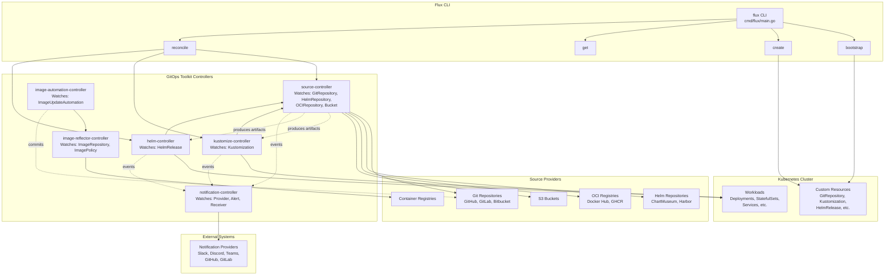
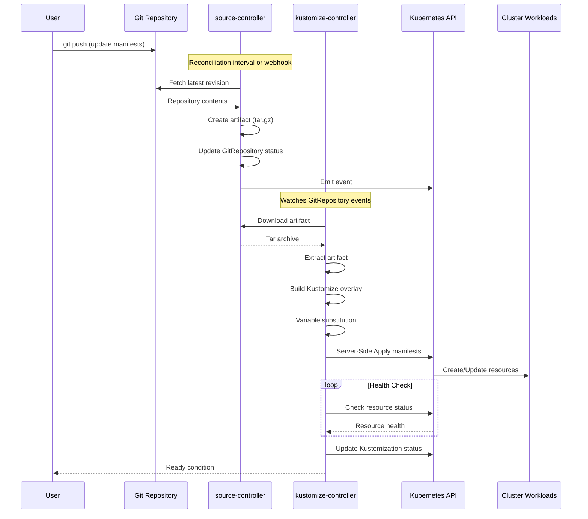
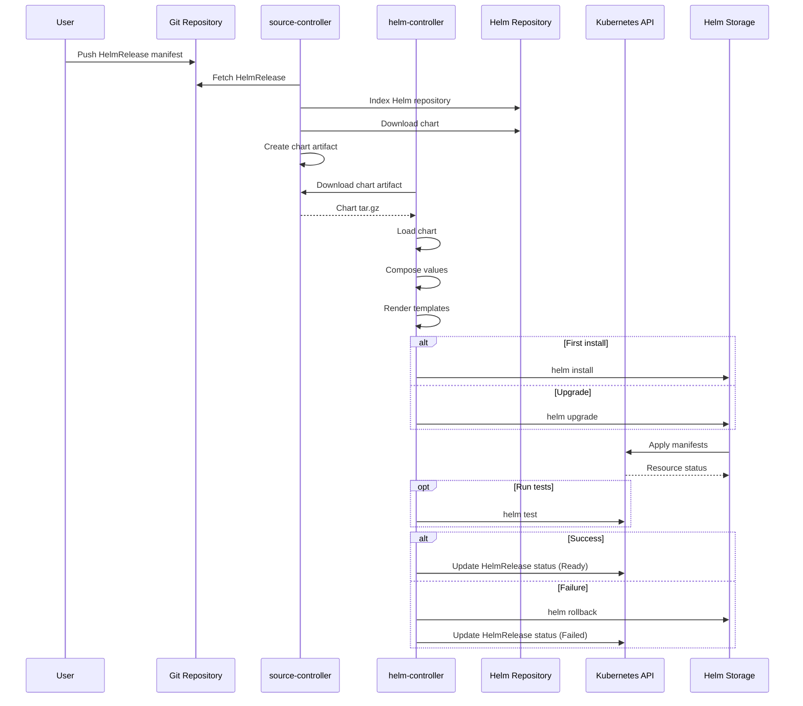
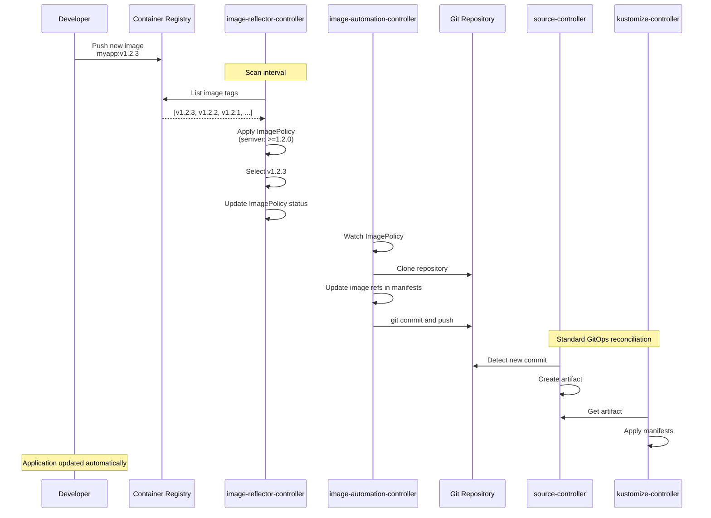
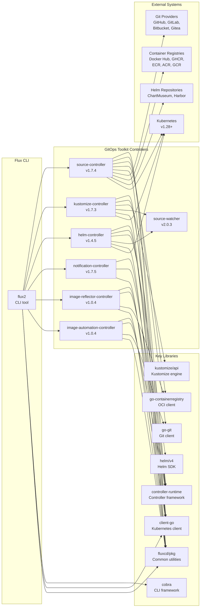

# Flux CD v2

> Open and extensible continuous delivery solution for Kubernetes powered by GitOps Toolkit

| Metadata | |
|---|---|
| Repository | https://github.com/fluxcd/flux2 |
| License | Apache License 2.0 |
| Primary Language | Go |
| Analyzed Release | `v2.7.5` (2025-11-27) |
| Stars (approx.) | 7,851 |
| Generated by | Claude Sonnet 4.5 (Anthropic) |
| Generated on | 2026-02-08 |

## Overview

Flux v2 is a CNCF graduated project that provides continuous delivery for Kubernetes through declarative GitOps workflows. Built from the ground up to use Kubernetes' API extension system, Flux v2 is constructed with the GitOps Toolkit, a set of composable APIs and specialized tools for building continuous delivery on top of Kubernetes.

Problems it solves:

- Keeping Kubernetes clusters in sync with configuration sources (Git repositories, OCI artifacts, Helm repositories)
- Automating deployments when new code or configuration changes are available
- Managing multi-tenancy with support for syncing arbitrary numbers of Git repositories
- Declarative management of Helm releases and Kustomize overlays
- Automated container image updates to Git repositories

Positioning:

Flux v2 represents a complete redesign from Flux v1, using Kubernetes Custom Resources and controllers to implement GitOps workflows. It competes with ArgoCD in the GitOps space but differentiates itself through its modular toolkit approach, native Kubernetes integration, and multi-tenancy support. Flux is used in production by major organizations and cloud providers including AWS, Microsoft Azure, VMware, and Weaveworks.

## Architecture Overview

Flux v2 employs a modular controller architecture based on the GitOps Toolkit. The system consists of specialized controllers that watch Custom Resources and reconcile cluster state with desired state stored in Git or other sources. The architecture follows Kubernetes operator patterns with continuous reconciliation loops.

## Core Components

### Flux CLI (`cmd/flux/main.go`)

- Responsibility: Command-line interface for managing Flux installations and resources
- Key files: `cmd/flux/main.go`, `cmd/flux/bootstrap*.go`, `cmd/flux/create*.go`, `cmd/flux/reconcile*.go`
- Design patterns: Command pattern (Cobra framework), Flag Group pattern

The Flux CLI serves as the primary interface for users to interact with Flux. Built using the Cobra framework, it provides commands for bootstrapping Flux onto clusters, creating resources, triggering reconciliations, and inspecting system status. The CLI does not run as a continuous process but executes one-time operations against the Kubernetes API.

Key command categories include:
- bootstrap: Installs Flux controllers and configures Git sync
- create: Generates Flux custom resources (GitRepository, Kustomization, HelmRelease, etc.)
- get: Lists and describes Flux resources
- reconcile: Manually triggers reconciliation of sources or resources
- diff: Shows differences between local manifests and cluster state

The CLI uses flag groups implementing the `FlagGroup` interface for type-safe configuration management. Configuration resolution follows the priority: CLI flags > environment variables > config file (trivy.yaml).

### Source Controller (`github.com/fluxcd/source-controller`)

- Responsibility: Fetching and caching artifacts from external sources
- Key files: Source controller is a separate repository with its own controllers
- Design patterns: Controller pattern, Reconciler pattern, Artifact storage pattern

The source-controller provides a uniform interface for acquiring artifacts from various external systems. It watches source Custom Resources and produces artifacts that other controllers can consume:

- GitRepository: Clones Git repositories and produces tar archives of specific revisions
- HelmRepository: Indexes Helm chart repositories
- HelmChart: Downloads specific Helm charts
- OCIRepository: Fetches OCI artifacts from container registries
- Bucket: Retrieves artifacts from S3-compatible storage
- ExternalArtifact: References externally managed artifacts
- ArtifactGenerator: Generates artifacts dynamically

Artifacts are stored locally on the controller's filesystem and made available via HTTP. The controller calculates checksums to detect changes and implements efficient caching to minimize redundant fetches. It runs continuous reconciliation loops based on configured intervals.

### Kustomize Controller (`github.com/fluxcd/kustomize-controller`)

- Responsibility: Reconciling Kubernetes manifests using Kustomize
- Key files: Kustomize controller is a separate repository
- Design patterns: Controller pattern, Reconciler pattern, Server-Side Apply

The kustomize-controller watches Kustomization custom resources and applies Kubernetes manifests to the cluster. It retrieves artifacts from the source-controller, builds Kustomize overlays, and uses server-side apply to reconcile resources.

Key features:
- Variable substitution in manifests
- Health assessment of deployed resources
- Dependency management between Kustomizations
- Garbage collection of removed resources (prune)
- Validation and drift detection
- Support for post-build variable substitution
- Integration with secret management solutions (SOPS, Vault)

The controller implements sophisticated health checking by monitoring the status of deployed resources and reporting readiness. It supports dependencies, allowing one Kustomization to wait for another to be ready before proceeding.

### Helm Controller (`github.com/fluxcd/helm-controller`)

- Responsibility: Managing Helm releases declaratively
- Key files: Helm controller is a separate repository
- Design patterns: Controller pattern, Reconciler pattern, Helm SDK integration

The helm-controller watches HelmRelease custom resources and manages Helm releases on the cluster. It consumes HelmChart artifacts from the source-controller and performs Helm operations (install, upgrade, test, rollback, uninstall).

Key features:
- Declarative Helm release management
- Automatic rollback on failure
- Helm tests integration
- Values composition from multiple sources
- Drift detection and correction
- Support for post-rendering (Kustomize patches)
- Dependency management between releases

The controller translates declarative HelmRelease specs into imperative Helm operations, bridging GitOps workflows with Helm's package management capabilities. It maintains Helm release history and can automatically roll back failed upgrades.

### Notification Controller (`github.com/fluxcd/notification-controller`)

- Responsibility: Event routing and webhook receiver
- Key files: Notification controller is a separate repository
- Design patterns: Observer pattern, Event bus pattern, Webhook handler pattern

The notification-controller handles two primary responsibilities: sending notifications about Flux events to external systems and receiving webhooks from external systems to trigger reconciliations.

Components:
- Provider: Configures external notification systems (Slack, Discord, Microsoft Teams, GitHub, GitLab, etc.)
- Alert: Defines notification rules and filters
- Receiver: Configures webhook endpoints for triggering reconciliations

The controller watches events from source-controller, kustomize-controller, and helm-controller, filters them based on Alert rules, and forwards them to configured Providers. This enables integration with existing notification and incident management workflows.

### Image Controllers (`github.com/fluxcd/image-reflector-controller`, `github.com/fluxcd/image-automation-controller`)

- Responsibility: Automated container image updates
- Key files: Two separate controllers for image scanning and Git updates
- Design patterns: Controller pattern, Policy pattern, Git automation pattern

These controllers enable automated image updates in GitOps workflows:

image-reflector-controller:
- ImageRepository: Scans container registries for image tags
- ImagePolicy: Defines policies for selecting image versions (semver, regex, alphabetical)

image-automation-controller:
- ImageUpdateAutomation: Updates Git repository manifests with new image tags based on policies

This enables workflows where application images are automatically updated in Git when new versions matching policy criteria are published to registries. The automation-controller commits changes to Git, triggering the standard GitOps reconciliation loop.

### Bootstrap Package (`pkg/bootstrap/`)

- Responsibility: Initial Flux installation and configuration
- Key files: `pkg/bootstrap/bootstrap.go`, `pkg/bootstrap/bootstrap_*.go`
- Design patterns: Template Method pattern, Provider abstraction pattern

The bootstrap package implements the logic for installing Flux on a cluster and configuring it to sync with a Git repository. It supports various Git providers (GitHub, GitLab, Bitbucket, Gitea) through a provider abstraction.

Bootstrap process:
1. Validates cluster prerequisites
2. Generates Flux installation manifests
3. Applies manifests to the cluster
4. Creates Git repository structure
5. Configures GitRepository and Kustomization resources for self-management
6. Commits configuration to Git
7. Waits for reconciliation to complete

The bootstrap makes Flux self-managing: the Flux installation manifests are stored in Git, and Flux continuously reconciles itself, enabling declarative upgrades and configuration management.

### Manifest Generator (`pkg/manifestgen/`)

- Responsibility: Generating Kubernetes manifests for Flux components
- Key files: `pkg/manifestgen/install/install.go`, `pkg/manifestgen/sync/sync.go`, `pkg/manifestgen/kustomization/kustomization.go`
- Design patterns: Builder pattern, Template pattern

The manifestgen package generates manifests for:
- Flux component installation (controllers, CRDs, RBAC)
- Sync configuration (GitRepository, Kustomization for self-management)
- Source secrets (Git credentials)

It supports generating manifests from GitHub releases or local Kustomize overlays, enabling customization of Flux installations. Templates are processed using Kustomize, allowing configuration through patches and overlays.

## Data Flow

### GitOps Reconciliation Loop

### Helm Release Workflow

### Image Automation Workflow

## Key Design Decisions

### 1. Modular Controller Architecture (GitOps Toolkit)

- Choice: Separate controllers for different concerns (source, kustomize, helm, notification, image)
- Rationale: Each controller focuses on a single responsibility, enabling independent development, testing, and deployment. Users can install only the controllers they need. The toolkit can be used to build custom CD solutions.
- Trade-offs: More complex deployment and operational overhead compared to monolithic architecture. Requires coordination between multiple controllers through Kubernetes events and artifact references. Higher resource usage due to multiple controller processes.

### 2. Artifact-Based Communication Between Controllers

- Choice: source-controller produces immutable artifacts consumed by other controllers rather than direct Git access
- Rationale: Centralized source management reduces redundant Git operations. Artifacts provide a consistent interface regardless of source type (Git, Helm, OCI, S3). Caching improves performance. Decouples source fetching from manifest application.
- Trade-offs: Requires local storage for artifacts. Adds an intermediary layer between sources and consumers. Source-controller becomes a potential single point of failure.

### 3. Kubernetes Custom Resources for Configuration

- Choice: Flux is configured entirely through Kubernetes CRDs (GitRepository, Kustomization, HelmRelease, etc.)
- Rationale: Provides a native Kubernetes experience. Enables GitOps for Flux itself. Allows standard Kubernetes tools (kubectl, RBAC, admission controllers) to work with Flux. Supports multi-tenancy through namespace isolation.
- Trade-offs: Learning curve for users unfamiliar with CRDs. Resource definitions can become verbose. Requires Kubernetes API access for all operations.

### 4. Server-Side Apply for Reconciliation

- Choice: Use Kubernetes server-side apply instead of client-side apply
- Rationale: Better conflict resolution with multiple actors modifying resources. Proper field ownership tracking. Native drift detection. Improved performance for large manifests.
- Trade-offs: Requires Kubernetes 1.16+. More complex error handling. Requires careful field manager configuration.

### 5. Pull-Based GitOps Model

- Choice: Controllers run in-cluster and pull configuration from Git rather than external push-based deployment
- Rationale: Enhanced security (no cluster credentials leave the cluster). Self-healing (continuous reconciliation detects and corrects drift). Resilient to temporary network issues. No need to expose cluster API externally.
- Trade-offs: Requires polling or webhook setup for timely updates. Controllers must have network access to Git repositories. Debugging can be more complex than imperative deployments.

### 6. Bootstrap Self-Management

- Choice: Flux manages its own installation manifests through GitOps
- Rationale: Enables declarative Flux upgrades and configuration. Ensures consistency between cluster state and Git. Provides a canonical example of GitOps workflow. Simplifies disaster recovery.
- Trade-offs: Bootstrap process is more complex than simple installation. Self-management loops require careful design to avoid deadlocks. Initial setup has more prerequisites.

## Dependencies

## Testing Strategy

Flux v2 employs a comprehensive testing strategy across multiple layers to ensure reliability and correctness.

Unit tests: Each controller repository contains extensive unit tests using the testing package and Gomega matchers. Controllers use the controller-runtime's `envtest` framework to run tests against a real Kubernetes API server. Mock objects and interfaces enable isolated testing of business logic. The CLI includes unit tests for command parsing, flag handling, and manifest generation.

Integration tests: End-to-end tests validate the entire GitOps workflow by:
- Bootstrapping Flux on test clusters (kind, k3s)
- Creating Git repositories with test manifests
- Triggering reconciliations
- Verifying cluster state matches Git
- Testing upgrade paths
- Validating multi-tenancy isolation

The test suite includes scenarios for various Git providers, authentication methods, and failure conditions.

CI/CD: GitHub Actions workflows run on every pull request and commit:
- Go unit tests with race detector
- Integration tests on Linux, macOS, and Windows
- End-to-end tests on multiple Kubernetes versions
- Static analysis (golangci-lint)
- Security scanning (Trivy, Snyk)
- FOSSA license compliance
- Artifact signing with Cosign
- Automated release builds with GoReleaser
- Automated documentation deployment

The project follows SLSA Level 3 for supply chain security. Release artifacts are signed and published with provenance attestations.

## Key Takeaways

1. Separation of Concerns Through Controllers: Flux's modular controller architecture demonstrates how complex systems can be decomposed into specialized components with clear boundaries. Each controller focuses on a single concern (source management, kustomization, helm, notifications, images), making the system more maintainable and testable. This pattern is applicable to any distributed system requiring coordinated behavior across multiple actors.

2. Artifact-Based Decoupling: The artifact abstraction between source-controller and consuming controllers (kustomize, helm) provides valuable decoupling. By standardizing on immutable artifacts as the communication interface, controllers can evolve independently. This pattern reduces coupling in microservices architectures and enables better caching and performance optimization.

3. GitOps Self-Management: Flux's ability to manage its own installation through GitOps workflows elegantly solves the bootstrapping problem. By storing the Flux installation manifests in Git and having Flux reconcile them, upgrades become declarative Git commits. This "eating your own dog food" approach validates the core GitOps workflow while providing practical benefits. The pattern applies to any system that can be configured through files: store the system's configuration in version control and have the system apply it.

4. Kubernetes-Native Design: Building on Kubernetes primitives (CRDs, controllers, reconciliation loops) rather than inventing new abstractions provides familiarity for Kubernetes users and enables reuse of existing tools. The server-side apply adoption demonstrates the value of leveraging platform capabilities rather than working around them. This principle applies beyond Kubernetes: when building on top of platforms, embrace platform patterns rather than fighting them.

5. Pull-Based Security Model: The pull-based approach where controllers run in-cluster and pull configuration from external sources provides security advantages over push-based models. Cluster credentials never leave the cluster, and the cluster doesn't need to expose APIs externally. This model is applicable to other scenarios requiring secure configuration management and demonstrates how architecture choices impact security posture.

## References

- [Flux CD Official Documentation](https://fluxcd.io/flux/)
- [GitOps Toolkit Components](https://fluxcd.io/flux/components/)
- [Flux v2 GitHub Repository](https://github.com/fluxcd/flux2)
- [Source Controller Repository](https://github.com/fluxcd/source-controller)
- [Kustomize Controller Repository](https://github.com/fluxcd/kustomize-controller)
- [Helm Controller Repository](https://github.com/fluxcd/helm-controller)
- [Notification Controller Repository](https://github.com/fluxcd/notification-controller)
- [Image Reflector Controller Repository](https://github.com/fluxcd/image-reflector-controller)
- [Image Automation Controller Repository](https://github.com/fluxcd/image-automation-controller)
- [Flux CD Architecture Overview - Spacelift](https://spacelift.io/blog/fluxcd)
- [FluxCD Architecture Part 2 - KodeKloud](https://notes.kodekloud.com/docs/GitOps-with-FluxCD/Flux-Overview/FluxCD-Architecture-Part2/page)
- [GitOps with Flux v2 - Microsoft Azure Documentation](https://learn.microsoft.com/en-us/azure/azure-arc/kubernetes/conceptual-gitops-flux2)
- [GitOps Control Models: Flux CD vs Portainer - Medium](https://medium.com/@portainerio/gitops-control-models-part-2-flux-cd-vs-portainer-5e6ed10d373d)
