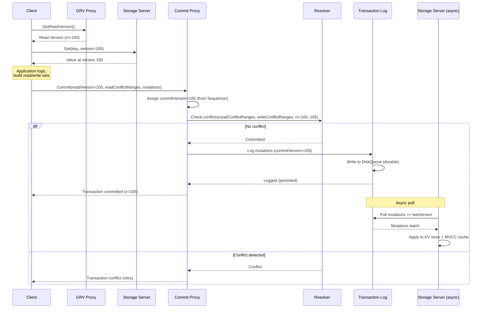
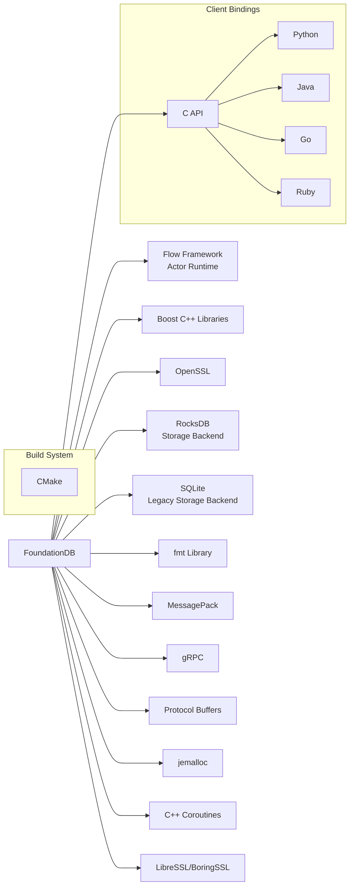

# FoundationDB

> A distributed, transactional key-value store designed to handle large volumes of structured data across clusters of commodity servers, with industry-leading correctness guarantees through deterministic simulation testing.

| Metadata | |
|---|---|
| Repository | https://github.com/apple/foundationdb |
| License | Apache License 2.0 |
| Primary Language | C++ |
| Category | Database |
| Analyzed Release | `7.4.6` (2026-01-29) |
| Stars (approx.) | 16,123 |
| Generated by | Claude Opus 4.6 (Anthropic) |
| Generated on | 2026-02-08 |

## Overview

FoundationDB is a distributed, ordered key-value store that provides strict serializability (the strongest consistency guarantee) with ACID transactions spanning arbitrary key ranges. Developed originally by FoundationDB Inc. and now maintained by Apple after its 2015 acquisition, FoundationDB's architecture follows an "unbundled" design that separates transaction processing, logging, and storage into independently scalable subsystems. Its most distinctive feature is a deterministic simulation testing framework that has verified the system's correctness through an estimated trillion CPU-hours of simulated fault injection.

Problems it solves:
- Provides strictly serializable ACID transactions across a distributed key-value store, enabling applications to build complex data models on a simple, correct foundation without worrying about distributed consistency anomalies
- Enables higher-level data models (document, graph, relational, queues) to be built as "layers" on top of the transactional key-value primitive, decoupling the storage engine from the data model
- Achieves extreme reliability through deterministic simulation testing that can reproduce any bug given a random seed, catching subtle distributed systems bugs that would be nearly impossible to find through traditional testing

Positioning:
FoundationDB occupies a unique niche as a distributed transactional key-value store that prioritizes correctness above all else. It serves as the storage backbone for Apple's iCloud infrastructure (reportedly handling billions of databases) and Snowflake's metadata storage. Unlike Cassandra or DynamoDB which offer tunable consistency, FoundationDB provides only strict serializability. Unlike CockroachDB or TiDB which expose a SQL interface, FoundationDB exposes a minimal key-value API and encourages building higher-level "layers" on top. The Record Layer (used by Apple) and the Document Layer are examples of this approach.

## Architecture Overview

FoundationDB uses an unbundled architecture that cleanly separates three major subsystems: a transaction management system (in-memory, for conflict detection and ordering), a log system (for durable write-ahead logging), and a storage system (for persistent data serving). A coordination service (using Paxos) manages cluster configuration and leader election. This separation allows each subsystem to be independently scaled and provisioned. The entire system is written using the Flow programming language, a C++ extension that adds actor-based concurrency with deterministic simulation capabilities.

```mermaid
graph TB
    Client[Client Application] -->|FDB Client Library| Proxy[Commit Proxies<br/>fdbserver/CommitProxyServer.actor.cpp]
    Client -->|Get Read Version| GRVProxy[GRV Proxies<br/>fdbserver/GrvProxyServer.actor.cpp]

    subgraph "Transaction System (in-memory)"
        GRVProxy -->|Read versions| Sequencer[Sequencer / Master<br/>fdbserver/MasterServer.actor.cpp]
        Proxy --> Resolver[Resolvers<br/>fdbserver/Resolver.actor.cpp]
        Resolver -->|Conflict detection| Proxy
    end

    subgraph "Log System"
        Proxy -->|Committed mutations| TLog[Transaction Logs (TLogs)<br/>fdbserver/TLogServer.actor.cpp]
        TLog --> DiskQueue[(Disk Queue<br/>fdbserver/DiskQueue.actor.cpp)]
    end

    subgraph "Storage System"
        TLog -->|Pull mutations| StorageServer[Storage Servers<br/>fdbserver/StorageServer.actor.cpp]
        StorageServer --> KVStore[(Key-Value Store<br/>SQLite / RocksDB)]
        Client -->|Reads| StorageServer
    end

    subgraph "Coordination"
        Coordinators[Coordinators<br/>fdbserver/Coordination.actor.cpp]
        ClusterController[Cluster Controller<br/>fdbserver/ClusterController.actor.cpp]
        DataDistributor[Data Distributor<br/>fdbserver/DataDistribution.actor.cpp]
        Ratekeeper[Ratekeeper<br/>fdbserver/Ratekeeper.actor.cpp]
    end

    ClusterController --> Coordinators
    DataDistributor --> StorageServer
    Ratekeeper --> Proxy
```

## Core Components

### Flow Programming Framework (`flow/`)
- Responsibility: Provides the actor-based concurrency framework and deterministic simulation runtime that underlies all of FoundationDB's code.
- Key files: `flow/include/flow/flow.h` (core types), `flow/include/flow/Arena.h` (memory arenas), `flow/include/flow/Error.h` (error handling), `flow/DeterministicRandom.h`, `flow/Net2.actor.cpp` (production network), `flow/Trace.cpp` (structured tracing)
- Design patterns: Actor model with `ACTOR` functions compiled by the Flow compiler (`actorcompiler`); `Future<T>` and `Promise<T>` for async operations; `choose ... when` for multiplexing; `wait()` for cooperative yielding.

Flow is a domain-specific extension of C++ that adds keywords like `ACTOR`, `state`, `wait()`, and `choose` for writing asynchronous, actor-based code. The Flow compiler (`actorcompiler`) transforms `.actor.cpp` and `.actor.h` files into standard C++ that uses futures and callbacks. The critical innovation is that by swapping the network and random number implementations, the same production code can run in a deterministic simulation where all non-determinism (network delays, disk I/O, process crashes) is controlled by a seeded PRNG, enabling reproducible testing.

### Commit Proxy (`fdbserver/CommitProxyServer.actor.cpp`)
- Responsibility: Receives client commit requests, batches them, sends them to Resolvers for conflict detection, and logs committed mutations to TLogs.
- Key files: `CommitProxyServer.actor.cpp`, `CommitProxyInterface.cpp`
- Design patterns: Batch processing (groups multiple client transactions into a single batch for conflict resolution); pipeline parallelism between resolution and logging; two-phase commit coordination.

The Commit Proxy is the write-path coordinator. It receives committed transaction batches from clients, assigns commit versions (obtained from the Sequencer), sends read and write conflict ranges to Resolvers, and upon successful conflict check, sends the mutations to Transaction Logs for durable storage. Batching is critical for throughput: by grouping multiple transactions, the overhead of conflict resolution and logging is amortized.

### GRV Proxy (`fdbserver/GrvProxyServer.actor.cpp`)
- Responsibility: Provides clients with read versions (timestamps) that define the snapshot for read operations, implementing the "get read version" (GRV) RPC.
- Key files: `GrvProxyServer.actor.cpp`, `GrvProxyTagThrottler.actor.cpp`, `GrvTransactionRateInfo.actor.cpp`
- Design patterns: Rate limiting and tag-based throttling; batching GRV requests for efficiency; priority levels for different transaction types.

Separating the GRV function from the Commit Proxy allows independent scaling of the read-version assignment path. The GRV Proxy also implements tag-based throttling to prevent hot-key workloads from overwhelming the system.

### Resolver (`fdbserver/Resolver.actor.cpp`)
- Responsibility: Performs conflict detection for transactions by checking whether any transaction's read set overlaps with another transaction's write set within the same version window.
- Key files: `Resolver.actor.cpp`, `ConflictSet.h`
- Design patterns: Optimistic Concurrency Control (OCC); skip-list-based conflict detection on key ranges; versioned conflict windows.

The Resolver maintains a sliding window of recently committed write sets and checks each incoming transaction's read set against these write sets. If a conflict is detected (another transaction wrote to a key that the current transaction read), the transaction is aborted. This implements strict serializability through OCC. Multiple Resolvers can operate in parallel, each responsible for a partition of the key space.

### Transaction Log (TLog) (`fdbserver/TLogServer.actor.cpp`)
- Responsibility: Durably stores committed mutations in an append-only log, serving as the write-ahead log for the system. Storage Servers pull mutations from TLogs to update their persistent state.
- Key files: `TLogServer.actor.cpp`, `LogSystem.cpp`, `LogSystemConfig.cpp`, `DiskQueue.actor.cpp`
- Design patterns: Append-only log with team-based replication (configurable redundancy); pull-based consumption by Storage Servers; epoch-based recovery.

TLogs are the durability layer. Committed mutations are synchronously written to multiple TLog replicas before the commit is acknowledged to the client. The DiskQueue provides a high-performance, append-only persistence layer. During recovery, the TLog data is the source of truth for reconstructing the latest committed state.

### Storage Server (`fdbserver/StorageServer.actor.cpp`)
- Responsibility: Serves read requests by maintaining a persistent key-value store and an in-memory MVCC cache of recent versions.
- Key files: `StorageServer.actor.cpp`, `KeyValueStoreMemory.actor.cpp`, `KeyValueStoreSQLite.actor.cpp`, `KeyValueStoreRocksDB.actor.cpp`, `KeyValueStoreShardedRocksDB.actor.cpp`
- Design patterns: MVCC with version-tagged values stored in memory for recent versions; pull-based mutation application from TLogs; pluggable backing store (SQLite B-tree, RocksDB, memory).

The Storage Server maintains two data structures: a durable key-value store (historically SQLite, increasingly RocksDB) and an in-memory MVCC version store for recent versions. Read requests specify a version and are served from the MVCC store if the version is recent enough, or from the durable store for older versions. The Storage Server continuously pulls committed mutations from TLogs and applies them to both stores.

### Cluster Controller and Data Distribution (`fdbserver/ClusterController.actor.cpp`, `fdbserver/DataDistribution.actor.cpp`)
- Responsibility: Manages cluster membership, role assignment, and data distribution across Storage Servers.
- Key files: `ClusterController.actor.cpp`, `DataDistribution.actor.cpp`, `DDTeamCollection.actor.cpp`, `DDShardTracker.actor.cpp`, `DDRelocationQueue.actor.cpp`
- Design patterns: Singleton leader elected via Paxos through Coordinators; shard-based data distribution with team formation; load balancing through shard splitting and merging.

The Cluster Controller is the centralized coordinator that recruits processes for various roles (TLog, Storage Server, Proxy, Resolver). The Data Distributor monitors shard sizes and movement, splitting large shards and merging small ones, and relocating data when Storage Servers join or leave the cluster.

## Data Flow

### Transaction Commit Path



## Key Design Decisions

### 1. Unbundled Architecture (Separation of Transaction Processing, Logging, and Storage)
- Choice: Decompose the database into three independently scalable subsystems: transaction management (Proxies + Resolvers), logging (TLogs), and storage (Storage Servers), rather than having each node perform all functions.
- Rationale: Each subsystem can be independently provisioned based on workload characteristics. Write-heavy workloads can scale TLogs and Proxies without adding storage. Read-heavy workloads can scale Storage Servers. This separation also simplifies reasoning about each subsystem and enables targeted optimizations.
- Trade-offs: More complex deployment topology. Cross-subsystem communication adds latency. Recovery requires coordinating multiple subsystems. The Cluster Controller becomes a critical orchestration point.

### 2. Strict Serializability Only (No Tunable Consistency)
- Choice: Provide only strict serializability as the consistency model, with no option for weaker consistency levels.
- Rationale: Simplifies the programming model by eliminating the need to reason about consistency anomalies. Applications built on FoundationDB can trust that transactions behave as if executed sequentially. This strong guarantee makes it safe to build higher-level abstractions (layers) that compose transactions.
- Trade-offs: Higher latency for writes compared to systems with weaker consistency. Cross-region deployments must pay the latency cost of synchronous replication. Read-only transactions still need a read version from the GRV Proxy, adding a round trip.

### 3. Deterministic Simulation Testing
- Choice: Build the entire system using the Flow programming framework, which allows the same production code to run in a deterministic simulation where all sources of non-determinism (time, network, I/O, crashes, reboots) are controlled by a seeded pseudo-random number generator.
- Rationale: Distributed systems bugs are notoriously difficult to reproduce and fix. By making execution deterministic, any bug found in simulation can be reliably reproduced by re-running with the same seed. The simulation framework injects realistic faults (network partitions, disk failures, process crashes, slow I/O) far more aggressively than would occur in production, finding bugs that would take years to manifest in real deployments.
- Trade-offs: All code must be written in the Flow actor model, which has a significant learning curve and constrains programming style. The Flow compiler adds build complexity. Some optimizations (like using OS threads for parallelism within a process) are harder to implement. The benefit is extraordinary test coverage: an estimated trillion CPU-hours of simulation testing.

### 4. Optimistic Concurrency Control (OCC) with MVCC
- Choice: Use OCC where transactions execute speculatively and are checked for conflicts only at commit time, combined with MVCC where Storage Servers maintain recent versions for snapshot reads.
- Rationale: OCC avoids lock contention for read-heavy workloads. MVCC enables consistent snapshot reads without blocking writes. The combination provides high throughput for workloads with low contention, which is the common case.
- Trade-offs: High-contention workloads suffer from abort-and-retry overhead. Long-running transactions are more likely to conflict. FoundationDB's 5-second transaction time limit is a hard constraint that prevents long-running transactions. Large transactions (exceeding 10MB) are also limited.

### 5. Layers Architecture (Key-Value as Foundation)
- Choice: Expose only a minimal ordered key-value API and encourage building higher-level data models (document, relational, graph, queue) as "layers" that compose transactions on the key-value primitive.
- Rationale: The key-value interface is simple, general, and easy to make correct. Complex semantics belong in the layer, not the storage engine. This separation of concerns allows the FoundationDB team to focus on making the transactional key-value store as reliable and performant as possible, while the community and users build specialized data models on top.
- Trade-offs: Applications must either use an existing layer or build their own mapping from their data model to key-value pairs. Without a built-in query language, simple queries require more code. The Record Layer (used by Apple) and Document Layer are examples, but the layer ecosystem is smaller than what SQL databases offer.

## Dependencies



## Testing Strategy

FoundationDB's testing strategy is its most celebrated feature and a benchmark for the industry:

- Deterministic Simulation (`fdbserver/workloads/`): The crown jewel of FoundationDB's testing. The entire system runs in a single-threaded, deterministic simulation where all I/O, timing, and failures are controlled by a seeded PRNG. Hundreds of workload types inject realistic faults (network partitions, disk failures, process crashes, slow disks, reboot loops) while running actual production code. A failed test can be reproduced by re-running with the same random seed. An estimated trillion CPU-hours of simulation have been executed.
- Workload-Based Testing: Test workloads are defined as actor-based programs that run within the simulation. Examples include `AtomicOps.actor.cpp`, `ConsistencyCheck.actor.cpp`, `RandomClogging.actor.cpp`, and `Rollback.actor.cpp`. These workloads exercise specific scenarios while the simulation framework injects faults.
- Correctness Verification: The simulation includes consistency checkers that verify invariants after each test run, ensuring no data is lost or corrupted despite injected faults.
- Buggify: A system-wide mechanism where `BUGGIFY` macros in the production code can be activated in simulation to inject rare timing conditions, unusual code paths, and edge cases. This ensures that error handling and recovery paths are exercised.
- Integration Tests (`tests/`): Tests that run against real FoundationDB clusters, verifying client library behavior, backup/restore, and operational procedures.
- Formal Verification: TLA+ specifications exist for core protocols, providing mathematical proof of correctness for algorithms like the recovery protocol.
- Performance Tests: Benchmarks measuring throughput, latency, and scalability under various workload patterns.

## Key Takeaways

1. FoundationDB's deterministic simulation testing framework represents a paradigm shift in distributed systems quality assurance. By constraining all code to the Flow actor model and replacing real I/O with a deterministic simulation, FoundationDB can reproducibly find and fix bugs that would be virtually impossible to discover through traditional testing. The willingness to accept the engineering cost of the Flow programming model in exchange for unprecedented testability has proven to be a transformative decision.

2. The unbundled architecture that separates transaction processing, logging, and storage into independently scalable subsystems demonstrates that distributed database design does not require every node to perform every function. This separation enables precise resource allocation and simplifies reasoning about each subsystem, though it increases deployment complexity and requires sophisticated cluster orchestration.

3. The "layers" philosophy of providing only a minimal, correct key-value API and letting higher-level data models be built on top represents a fundamentally different approach to database design. Rather than building features into the database engine, FoundationDB provides a reliable transactional primitive that can serve as the foundation for arbitrarily complex data models. This approach has proven successful at massive scale (Apple's iCloud) and for specialized use cases (Snowflake's metadata), validating the idea that correctness and simplicity at the foundation can enable complexity at the edges.

## References

- FoundationDB Paper (SIGMOD 2021): https://www.foundationdb.org/files/fdb-paper.pdf
- FoundationDB SIGMOD Record: https://sigmodrecord.org/publications/sigmodRecord/2203/pdfs/08_fdb-zhou.pdf
- FoundationDB CACM Article: https://cacm.acm.org/research/foundationdb-a-distributed-key-value-store/
- Diving into FoundationDB's Simulation Framework: https://pierrezemb.fr/posts/diving-into-foundationdb-simulation/
- Deterministic Simulation Testing: https://pierrezemb.fr/posts/learn-about-dst/
- FoundationDB Engineering Documentation: https://apple.github.io/foundationdb/engineering.html
- How FoundationDB Works: https://uvdn7.github.io/notes-on-the-foundationdb-paper/
- FoundationDB Commit Design Doc: https://github.com/apple/foundationdb/tree/main/design/Commit
- FoundationDB Source Code: https://github.com/apple/foundationdb
